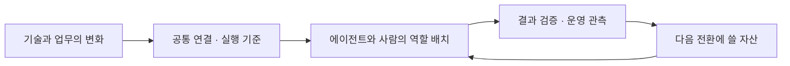
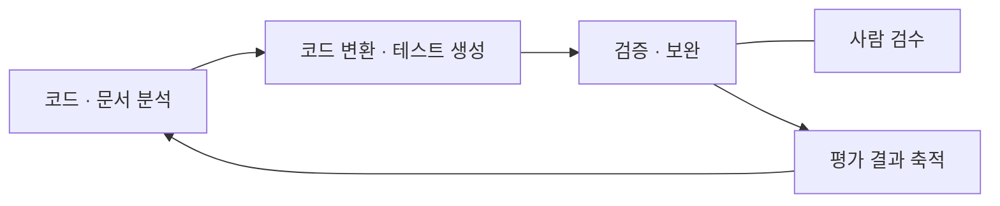

# 지속 가능한 AX를 위한 전략: 표준·자산·운영 — 삼성SDS

> 출처: REAL SUMMIT 2026 · 2026-09-08 · 29:18

## 1. 개요

### 1.1 발표 정보

| 항목 | 내용 |
| --- | --- |
| 어떤 발표였나 | 삼성SDS가 코드 현대화·복지 업무·경비 처리에서 에이전트와 사람의 역할을 나누고, 그 전환을 표준·자산·운영 체계로 이어가는 접근을 설명했다 |
| 공식 발표 제목 | 지속 가능한 AX를 위한 전략: 표준·자산·운영 |
| 어디서 들었나 | REAL SUMMIT 2026 |
| 언제 들었나 | 2026-09-08 |
| 발표자 | 이태희 부사장 |
| 소속 | 삼성SDS |
| 행사 안내 시간 | 10:50–11:20 — 프로그램상 배정 시간 |
| 발표 길이 | 녹취 29분 18초 · 음성 약 29분 19초 |
| 정리 근거 | [발표 복원 문서](assets/S-003/reconstruction.md), STT 57블록, 발표 사진 17장, 행사 안내 이미지, 원음의 의심 구간 9곳에 대한 부분 재전사 대조 |

이 발표의 질문은 **기술이 계속 바뀌는 동안 기업은 무엇을 축적하고 어떤 기준으로 운영할 것인가**였다. 발표자는 연결 규칙을 표준화하고, 성공과 실패를 다음 전환의 자산으로 남기며, 실제 업무의 품질·안전·비용을 관측하는 세 축을 제시했다.

사례의 근거 수준은 서로 다르다. 코드 현대화는 관계사 적용을 설명했고, 복지 티켓 구매는 업무 흐름의 예시 화면을 보여줬으며, 경비 처리는 삼성SDS에서 운영 중이라고 밝혔다. 어느 사례도 전후 성과를 비교할 정량 자료는 공개하지 않았다.

### 1.2 핵심 흐름

표준은 도구와 모델을 교체할 접점을 만들고, 사람과 에이전트의 역할 배치는 실제 업무를 실행 가능하게 한다. 실행 뒤에는 테스트·검수·운영 관측을 통해 다음에 재사용할 근거를 남긴다는 흐름이다.

### 1.3 핵심 개념

#### 표준 — 만드는 도구가 달라도 같은 기준으로 등록하고 운영한다

No-code, Low-code, Pro-code, Code Agents처럼 제작 방식이 다양해져도 등록·평가·배포·운영 기준은 공통으로 유지한다. 연결 지점에서는 도구·에이전트·백엔드·UI의 인터페이스를 정리해 구성요소를 교체할 때의 영향을 줄이는 접근을 설명했다.

#### 자산 — 성공과 실패를 평가해 다음 전환에서 다시 쓴다

발표에서 자산에는 Agent·Tool·Knowledge·Model뿐 아니라 데이터의 의미와 맥락, 실행 및 평가 결과도 포함된다. 데이터를 많이 보유했는지보다 정의·품질·권한을 갖춰 AI가 사용할 수 있는지가 중요하다는 설명은 [[ai-ready-data]]와 연결된다.

코드 현대화에서는 평가 결과를 다음 분석과 변환에 돌려준다. 이 반복 구조는 [[loop-engineering]]과 연결되지만, 발표는 자동 종료 조건이나 반복 한도까지 공개하지 않았다.

#### 사람의 판단 — 승인할 일과 예외를 검토할 일을 업무 안에 배치한다

코드의 보완 지시, 티켓 구매 승인, 경비 예외 검토는 사람이 개입하는 목적이 서로 다르다. [[human-in-the-loop]]가 이 발표에서는 실제 거래를 승인하거나 자동화가 처리하기 어려운 건을 검토하는 역할로 나타난다.

#### 운영 — 실행 경로와 품질·안전·비용을 함께 본다

Task ID를 중심으로 요청·판단·모델 및 도구 결과·사람 승인·응답을 추적하고, 실행 중의 위험과 비용을 확인한다. [[monitoring]]을 에이전트 업무에 적용하는 설명이며, 마지막에는 DevOps와 AgentOps가 버전 관리·품질 평가·관측·거버넌스를 함께 다뤄야 한다고 정리했다.

### 1.4 세 사례를 받치는 공통 플랫폼

발표자는 다섯 레이어를 통해 표준·자산·운영의 책임을 나눴다. 아래는 제품 기능 목록보다 각 계층이 맡는 일을 중심으로 압축한 것이다.

| 계층 | 책임 | 발표에서 제시한 기준 |
| --- | --- | --- |
| Agent Builder | 여러 제작 경로를 공통 수명주기로 연결 | 등록·평가·배포·운영 기준, 연결 인터페이스 |
| Knowledge & Data | 기업 데이터를 AI가 사용할 수 있게 준비 | 정의·맥락·품질, 인증·권한, 결과 축적 |
| Marketplace & Governance | 자산을 검증하고 재사용 범위를 관리 | 등록·승인·검색·재사용·평가, 권한·정책·감사 |
| Intelligent Orchestration | 필요한 에이전트를 찾아 계획하고 사람의 판단과 연결 | 에이전트 탐색, 실행 계획, 검토·승인, 실행 기록 |
| AgentOps | 실행 품질과 운영 비용을 관측하고 개선 | 모델 서빙, 품질·비용·추론 시간, 운영 대시보드 |

사내 자산의 목록은 Agent Directory Service를 통해 실행 계획에 연결되고, [[workflow-orchestration]]에 해당하는 단계 조율 속에 사람의 승인도 들어간다. 마케팅 캠페인 승인 화면은 이 구조를 설명하기 위한 예시였다.

모델 선택에서는 **AI Gateway가 인증·정책·추적의 관문을 맡고, Smart Router가 요청에 맞는 모델을 고른다.** 온프레미스와 클라우드를 함께 쓸 때는 성능·비용 외에 데이터 경계와 권한도 평가한다고 설명했다. 표준화된 호출 경로가 있어도 데이터의 외부 사용 범위까지 자동으로 정해지는 것은 아니라는 의미다.

발표자는 이러한 요소가 FabriX에 반영되어 있다고 설명했다. 다만 제품 출시 연도·버전은 녹취와 음성 재전사로 확정하지 못해 여기에는 싣지 않았다. 플랫폼 전체의 구현 범위와 성능을 이 발표만으로 검증할 수는 없다.

## 2. 사례 상세

### 2.1 코드 현대화 — 분석·변환·검증 결과를 다음 전환에 재사용한다

근거: 복원 문서 사진 12–13 · 녹취 21:01–23:37.

#### 2.1.1 문제

레거시 코드를 현대화하려면 기존 코드와 문서에 들어 있는 구조·의존성·업무 규칙을 먼저 이해해야 한다. 새 코드가 만들어진 뒤에도 테스트와 검수로 변경 결과를 확인해야 한다. 발표는 많은 코드를 바꾸는 과정에서 이 분석·변환·검증을 반복하는 과제를 다뤘다.

발표자는 소프트웨어 개발에 이미 모듈화, 재사용, 테스트와 변경 추적, 배포 자동화의 기반이 쌓여 있어 AI를 적용할 토대가 마련됐다고 설명했다.

#### 2.1.2 해결 접근

에이전트가 분석·변환·검증을 반복하고 사람은 필요한 접점에서 승인하거나 보완을 지시한다. 한 번의 결과를 그 작업에서 끝내지 않고 평가 결과로 축적해 다음 전환의 분석과 생성에 활용한다.

핵심은 생성한 코드와 그 결과를 검증하는 과정을 함께 설계하는 것이다. 발표는 이를 ‘한 번의 전환, 다음 전환의 자산’으로 표현했다.

#### 2.1.3 적용과 아키텍처

| 담당 | 책임 |
| --- | --- |
| 에이전트 | 레거시 구조·의존성·업무 규칙 분석, 코드 변환과 테스트 생성, 테스트 수행·리뷰·오류 보완 |
| 사람 | 전환 결과 검수, 승인, 보완 지시 |
| 축적된 평가 결과 | 다음 전환에서 다시 참조할 근거 |

사람 검수와 검증의 연결은 슬라이드에서 확인되지만, 승인 조건과 세부 상태 전이는 제시되지 않았다. 평가 결과를 어떤 저장소나 형식으로 보관하는지도 공개하지 않았다.

#### 2.1.4 결과와 한계

발표자는 관계사 적용에서 많은 레거시 코드를 자동 변환하고 테스트를 완수하는 과정을 확인했다고 설명했다. 사례의 공개 근거는 구조도와 해당 발화다.

관계사명, 원본·대상 언어, 코드 규모, 테스트 통과율, 소요 기간은 미공개다. 따라서 실제 적용 사례라는 설명은 남기되 생산성 향상률이나 전환 정확도를 수치로 판단할 수는 없다.

### 2.2 복지 티켓 구매 — 자연어 요청을 사람 승인과 기존 시스템의 거래에 연결한다

근거: 복원 문서 사진 14 · 녹취 23:40–25:53.

#### 2.2.1 문제

직원의 ‘가족 나들이 티켓을 구매해 달라’는 요청을 처리하려면 방문일과 인원, 구매 조건, 금액, 결제 방식을 확인해야 한다. 정보를 모은 뒤에는 직원이 구매 내용을 검토하고 승인할 수 있어야 하며, 최종 거래는 기존 복지 시스템에서 처리해야 한다.

에이전트가 요청을 이해하는 것에서 실제 업무 완료까지 이어지려면, 기존 시스템과의 접점과 각 단계의 담당자를 함께 설계해야 한다는 사례다.

#### 2.2.2 해결 접근

업무를 ‘요청 이해 → 조건 확인 → 정보 수집 → 사람 승인 → 시스템 연계’로 재구성한다. 에이전트는 필요한 정보를 준비하고, 사람은 거래 내용을 승인하며, 시스템은 구매를 처리한다.

개발 과정에서도 기획자와 현업이 무엇을 바꿀지 정하고 API 개발자가 기존 시스템을 AI가 사용할 수 있는 형태로 연결한다. 발표자는 기존 API의 유무를 모두 고려하고, 필요하면 MCP 형태로도 제공한다고 설명했다.

#### 2.2.3 적용과 아키텍처

예시 화면에서는 어른 2명·아이 2명의 구매 조건과 총 금액을 제시하고, 복지포인트 차감에 대한 승인을 받은 뒤 구매 완료와 E-티켓 확인으로 이어졌다. 이는 사용자가 어떤 정보를 보고 승인하는지 보여주는 화면이다.

| 개발 단계 | 참여자와 책임 |
| --- | --- |
| Agent 분석 | 기획자·시스템 오너·현업 담당자가 변경할 업무와 필요한 에이전트를 판단 |
| Agent 설계 | 기획자·Agent 개발자가 업무 흐름을 설계 |
| Agent 개발 | API 개발자·Agent 개발자가 시스템 접점과 에이전트를 구현 |
| 연계 및 테스트 | Agent 개발자가 연결된 흐름을 검증 |

#### 2.2.4 결과와 한계

발표 자료에는 구매 완료까지 이어지는 **업무 예시 화면**이 제시됐다. 실서비스의 사용자 수나 운영 범위, 처리 성공률은 확인할 수 없다.

화면의 200,000원과 2025년 일정은 설명용 거래 값이며 비용 절감액이나 행사 당일의 거래가 아니다. 인증 방식, 중복 구매 방지, 승인 후 조건 변경, 구매 실패·취소 처리는 공개되지 않았다.

### 2.3 경비 처리 — Agent의 판단과 RPA의 실행, 사람의 예외 검토를 나눈다

근거: 복원 문서 사진 15 · 녹취 25:56–27:16.

#### 2.3.1 문제

사람이 영수증을 직접 보고 검토하던 경비 업무에 RPA를 적용했지만, 예외 처리나 새로운 변경 사항은 기존 자동화로 다루기 어려웠다고 설명했다. 남은 과제는 입력 절차의 반복뿐 아니라 증빙과 경비 규정을 해석하는 판단이었다.

#### 2.3.2 해결 접근

Agent가 증빙·규정·분류·예외를 판단하고 RPA가 정해진 시스템 작업을 실행한다. 사람은 예외 케이스를 검토한다. 이렇게 업무의 성격에 따라 담당을 나누고, 처리 결과와 판단 근거를 함께 볼 수 있게 한다.

#### 2.3.3 적용과 아키텍처

| 담당 | 맡는 일 | 다음 단계에 넘기는 것 |
| --- | --- | --- |
| Agent | 증빙 인식, 경비 규정 판단, 계정·비용 유형 분류, 예외 판별 | 경비 판단과 분류 결과, 예외 검토 대상 |
| 사람 | 예외 케이스 검토 | 검토 결과 |
| RPA · Brity Automation | 경비시스템 입력, 증빙 첨부·신청, 처리 결과 회신 | 업무 처리 결과 |
| 결과 확인 | 처리 상태·판단 근거·감사 추적 제공 | 업무 진행과 판단을 확인할 근거 |

그림은 사진에서 연결이 확인되는 예외 검토 경로를 중심으로 그렸다. 예외가 아닌 건의 세부 연결과 분기 조건은 공개 자료에서 명확하지 않아 추가하지 않았다. 발표자는 정해진 절차에 따른 실행에는 RPA가 계속 효과적이라고 설명했다.

#### 2.3.4 결과와 한계

발표자는 **삼성SDS에서 운영 중인 경비 처리 자동화 사례**라고 밝혔다. 시간 절약, 처리 상태와 판단 근거의 가시성, 정확도 향상을 효과로 설명했다.

처리 건수, 예외 비율, 정확도, 절약 시간과 비교 기간은 제시하지 않았다. 따라서 운영 여부와 역할 구성은 남기되 효과의 크기를 검증된 개선 수치로 표현하지 않는다.

## 3. 적용할 경험

아래는 발표의 사례를 다른 업무로 옮길 때 남는 판단 기준을 작성자가 추출한 것이다. 발표자의 직접 주장과 구분하며, concept 문서 생성·보강은 별도 작업으로 남긴다.

| 발표에서 나온 개념 | 추상화·일반화 | 적용 조건·제약 | 추출할 concept 이름 |
| --- | --- | --- | --- |
| 코드 전환의 평가 결과를 다음 분석·변환에 재사용 | 반복의 입력에는 산출물뿐 아니라 검증 결과와 실패 원인이 포함되어야 한다 | 평가 기준과 종료·중단 조건이 필요하다. 발표는 실제 기준·저장 구조를 공개하지 않았다 | `loop-engineering` — 기존 concept 보강 후보 |
| 코드 검수·구매 승인·경비 예외 검토 | 사람의 개입 목적을 구분하고, 무엇을 판단할지 업무 단계와 함께 정한다 | 책임자·승인 대상·예외 기준이 필요하다. 승인 대기와 실패 처리 방식은 추가 설계 대상이다 | `human-in-the-loop` — 기존 concept 보강 후보 |
| Agent가 경비를 판단하고 RPA가 시스템에 입력 | 불확실한 해석 결과를 실제 상태 변경에 전달하는 지점에 계약과 검증 책임을 둔다 | 입력 검증과 실패·중복 실행 처리까지 정해야 한다. 이 세부 구현은 발표에서 확인되지 않는다 | `agent-execution-boundary` — 신규 후보. S-002에서도 추출 후보로 제시됨 |
| Task ID로 요청부터 사람 승인·결과까지 추적 | 개별 호출의 성공 외에 업무 전체의 경로와 판단 근거를 연결한다 | 공통 식별자, 단계별 기록, 민감정보 처리 기준이 필요하다. 로그가 있다는 사실만으로 판단의 타당성이 입증되지는 않는다 | `monitoring` — 기존 concept 보강 후보 |
| Gateway의 정책 적용과 Router의 모델 선택을 분리 | 접근 정책의 집행과 요청별 처리 자원 선택은 서로 다른 책임이다 | 업무별 품질·비용 평가와 데이터 사용 경계가 필요하다. 발표에는 라우팅 정확도나 절감률이 없다 | [[model-routing]] — S-004와 함께 개념 작성 |

기존 concept의 파일·별칭과 맵을 확인해 분류했다. `agent-execution-boundary`는 S-002의 후보와 함께 검토할 대상이며, 이번 정리에서 같은 이름의 별도 개념 파일을 만들지는 않는다.

## 4. 참고 자료

발표에서 시작된 질문을 더 조사할 **단위 개념의 자료**다. 아래 문서는 삼성SDS가 실제로 사용한 구현이나 성과의 근거가 아니다.

| 단위 concept | 이 발표에서 시작된 질문 | 더 조사할 범위 | 추천 자료 |
| --- | --- | --- | --- |
| `loop-engineering` | 어떤 검증이 있어야 반복 결과를 다음 개선에 쓸 수 있는가 | 명확한 평가 기준, 생성과 평가의 역할, 반복이 유효한 조건. 장기 축적·종료 정책은 별도 검토 | [Anthropic — Building Effective Agents, Evaluator-optimizer](https://www.anthropic.com/engineering/building-effective-agents) |
| `human-in-the-loop` | 구매 승인과 경비 예외 검토의 책임을 어떻게 정할 것인가 | AI의 설계·사용·평가 과정에서 위험과 신뢰성을 다루는 기준. 이 발표의 승인 상태 구현은 범위 밖 | [NIST — AI Risk Management Framework](https://www.nist.gov/itl/ai-risk-management-framework) |
| `agent-execution-boundary` | 정해진 실행 흐름과 에이전트의 판단을 언제 나눌 것인가 | 미리 정한 워크플로우와 모델이 경로를 결정하는 에이전트의 차이, 복잡성·비용의 조건 | [Anthropic — Building Effective Agents](https://www.anthropic.com/engineering/building-effective-agents) |
| `monitoring` | 여러 호출과 승인 단계를 어떻게 하나의 업무 경로로 볼 것인가 | Trace·Span·부모 관계·Context Propagation. 감사 기록과 판단 검증의 추가 요구는 별도 설계 | [OpenTelemetry — Traces](https://opentelemetry.io/docs/concepts/signals/traces/) |
| `model-routing` | 요청별로 모델을 바꾸는 것이 어떤 조건에서 유효한가 | 입력 분류, 전문 처리 경로, 쉬운 요청과 어려운 요청의 분리, 분류 정확성의 조건 | [Anthropic — Building Effective Agents, Routing](https://www.anthropic.com/engineering/building-effective-agents) |

## 5. 원본과 복원 근거

- [행사 안내 이미지](assets/S-003/program.png) — 사용자가 제공한 공식 제목·발표자·소속·직책·배정 시간의 근거

- [발표 복원 문서](assets/S-003/reconstruction.md) — 시간순 발화·사진 대응, 예시 수치, STT 충돌과 음성 부분 재전사 결과
- [녹취 원문](assets/S-003/transcript.txt) — STT 57블록, 수정하지 않은 원문
- [재생용 WAV](assets/S-003/recording.wav) — 전체 녹음, 16kHz·mono·16bit PCM
- [음성 원본](../../../reference/2026-09-08-real-summit/recordings/11.bin) — WebM/Opus 원본

| 사진 | 내용 |
| --- | --- |
| [01](assets/S-003/01-change-management-three-axes.webp) | 기술 변화와 표준·자산·운영 |
| [02](assets/S-003/02-agent-builder-common-lifecycle.webp) | 제작 방식과 공통 수명주기 |
| [03](assets/S-003/03-connection-standards-a.webp) · [04](assets/S-003/04-connection-standards-b.webp) | 연결 표준 — 같은 슬라이드의 반복 촬영 |
| [05](assets/S-003/05-enterprise-ai-marketplace.webp) | 기업 AI 자산의 등록·검증·재사용 |
| [06](assets/S-003/06-task-trace-human-approval.webp) | Task ID와 실행 추적 |
| [07](assets/S-003/07-agent-safety-feedback.webp) | 입력·실행·출력·지속 검증 |
| [08](assets/S-003/08-orchestration-campaign-approval.webp) | 마케팅 캠페인 승인 예시 |
| [09](assets/S-003/09-gateway-smart-router.webp) | Gateway와 Smart Router |
| [10](assets/S-003/10-hybrid-data-boundary.webp) | 내부·외부 환경과 데이터 경계 |
| [11](assets/S-003/11-fabrix-platform-overview.webp) | FabriX 플랫폼 구성 |
| [12](assets/S-003/12-software-development-paradigms.webp) | 소프트웨어 개발의 기반 변화 |
| [13](assets/S-003/13-legacy-modernization-loop.webp) | 코드 현대화의 반복과 자산 축적 |
| [14](assets/S-003/14-agentic-app-ticket-purchase.webp) | 복지 티켓 구매 흐름 |
| [15](assets/S-003/15-expense-agent-rpa.webp) | 경비 처리의 Agent·RPA·사람 역할 |
| [16](assets/S-003/16-devops-agentops.webp) | DevOps와 AgentOps의 공통 운영 관점 |
| [17](assets/S-003/17-sustainable-ax-summary.webp) | 지속 가능한 AX 전략의 결론 |

공식 제목과 발표자·소속·직책은 사용자가 제공한 행사 안내 이미지에서 확인했다. 제품 출시 숫자와 일부 기술명은 음성 부분 재전사로도 확정하지 못했다. 확인되지 않은 제품 연혁과 세부 용어는 사례의 사실로 사용하지 않았으며, 구체적인 충돌은 복원 문서에 보존했다.
