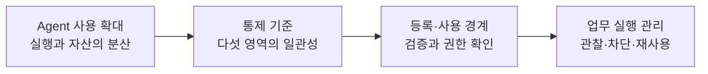
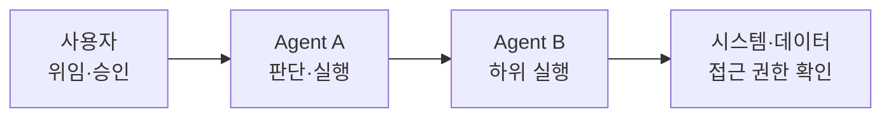
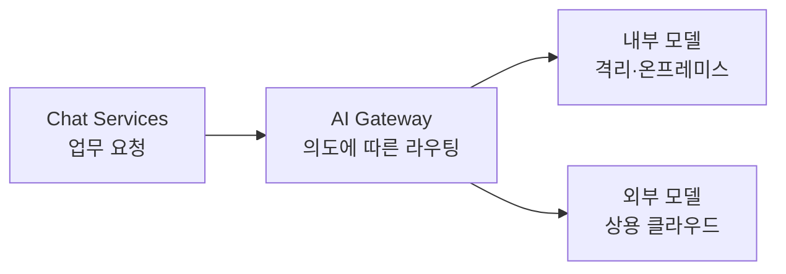
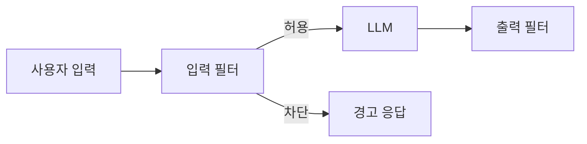
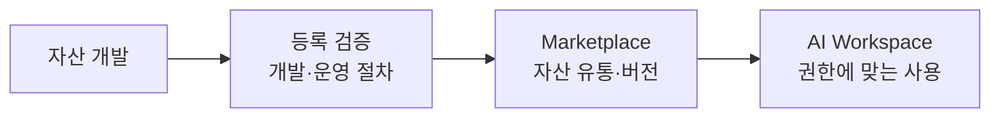

# Agent의 실행을 다섯 통제 영역으로 관리하기 — 삼성SDS

> 출처: REAL SUMMIT 2026 · 2026-09-08 · 확보 녹음 15분 52.128초

## 1. 개요

### 1.1 발표 정보

| 항목 | 내용 |
| --- | --- |
| 어떤 발표였나 | 기업에서 늘어나는 Agent의 실행을 데이터·권한·비용·보안·자산 기준으로 통제하고, 등록부터 업무 사용까지 연결하는 구조를 설명한 발표 |
| 원래 발표 제목 | AX 가속화를 위한 Agent Governance 체계 |
| 어디서 들었나 | REAL SUMMIT 2026 |
| 언제 들었나 | 2026-09-08 · 프로그램 배정 12:50–13:20 |
| 발표자 | 신계영 부사장 |
| 소속 | 삼성SDS |
| 발표 길이 | 전체 실측 길이 미확인. 확보 녹음은 15분 52.128초 |
| 자료 범위 | 권한 설명 중간부터 마무리까지의 Soniox 녹취, 발표 사진 12장, 행사 프로그램 |

발표는 외부 사고·조사 사례로 문제를 제시하고 FabriX의 통제 구조를 설명한다. 고객사별 성과 보고로 읽기보다는 **Agent를 기업 업무에 연결할 때 무엇을 검증하고 누가 관리해야 하는지**를 제시한 자료로 읽는다.

녹음에 없는 데이터·권한 전반부는 사진으로만 복원했다. 사진과 STT가 충돌하는 수치, 제품의 현재 적용 범위와 추후 계획은 구분했다. 시간순 근거는 [발표 재구성](assets/S-004/reconstruction.md)에 있다.

### 1.2 핵심 흐름

마지막 노드는 발표가 제시한 운영 방향이다. 비용 절감률이나 사고 감소율로 효과가 입증됐다는 뜻은 아니다.

### 1.3 핵심 개념

#### 위임된 실행의 권한

[[delegated-authorization]]을 Agent의 다단계 실행에 적용한 설명이다. 이 발표는 작은 업무 단위·최소 권한·기존 인증 체계 연결·이력 추적을 함께 설명했다.

#### Tokenomics

토큰을 많이 사용하는 단계를 넘어 사용량과 비용을 설계·통제하는 의미로 사용했다. [[model-routing]]과 사용 주체별 비용 관리가 두 축이다.

#### 가드레일과 레드 티밍

입력·출력에 룰과 모델 기반 필터를 두고, 공격으로 빈틈을 확인하는 구조다. [[prompt-injection]]에 대한 방어와 관련되지만 필터만으로 모든 Agent 실행이 안전해진다는 주장은 아니다.

#### 검증된 자산 유통

[[ai-asset-inventory]]를 기반으로 Agent·Model·MCP·Skills·Knowledge의 등록 기준과 사용 권한을 확인한다. 목록의 존재보다 **등록할 수 있는 조건과 사용할 수 있는 조건**이 핵심이다.

## 2. 사례 상세

아래 네 사례는 발표의 설계 문제를 묶은 것이다. 네 개의 별도 고객사 구축 실적을 뜻하지 않는다.

### 2.1 기밀 데이터와 위임된 권한의 경계 유지

#### 2.1.1 문제

직원이 외부 AI를 이용할 때 기밀 정보가 함께 전달될 수 있다. Agent가 다른 Agent나 업무 시스템을 호출하면 직접 사용자의 접근만 검사해서는 실제 실행 범위를 설명하기 어렵다.

사진은 Salesforce ForcedLeak(2025)을 악성 지시와 과도한 CRM 접근 권한의 외부 연구 사례로 제시한다. 삼성SDS에서 발생한 유출이나 검증된 실제 피해 규모로 기록하지 않는다.

#### 2.1.2 해결 접근

문서의 보안 등급을 외부 전달 가능 여부와 연결한다. 권한은 업무 목적에 필요한 최소 수준으로 좁히고, 사용자·Agent·하위 시스템 사이에서 맞춰 확인한다.

#### 2.1.3 적용과 아키텍처

| 경계 | 발표에서 제시한 역할 |
| --- | --- |
| 문서 관리 → 보안 분류 | 문서를 수집·분류하고 등급을 갱신 |
| 질의·답변 → 외부 AI | 기밀 필터로 전달을 통제하고 응답 경로에서 민감정보 비식별화 |
| 사용자 → Agent → 시스템 | 기존 통합 인증 체계와 권한을 맞추고 하위 호출 확인 |
| 실행 → 운영자 | 사용 이력과 권한 범위를 추적하고 유출 탐지 |

도식은 사진의 위임 관계를 단순화했다. 각 단계의 인증 토큰 형식이나 권한 교환 프로토콜은 발표 자료에서 확인되지 않는다.

#### 2.1.4 결과와 한계

기밀 분류·차단의 구조와 최소 권한·이력 추적의 설계 방향을 확인했다. 데이터 영역은 사진만 있고 발화가 없으며, 분류 정확도·유출 차단률·운영 고객 규모는 제시되지 않았다.

근거: 재구성 사진 01–03, 녹취 00:00.510–01:15.450.

### 2.2 모델 선택과 사용량 관리로 총비용 통제

#### 2.2.1 문제

Agent가 반복적으로 모델·도구를 호출하면 토큰 단가가 내려가도 총지출은 늘 수 있다. 사용자가 작업에 필요한 모델 크기를 판단하기 어렵고, 내부·외부 AI를 함께 쓰면 비용도 여러 곳에 흩어진다.

Vercel 인용 사진에는 2026년 6–7월 토큰 가격 **13.6% 하락·지출 37% 증가**가 적혀 있지만, 전체 및 구간 Soniox 전사는 지출을 **30% 증가**로 인식했다. 이 차이는 해소되지 않았고 삼성SDS 자체 비용 수치도 아니다.

#### 2.2.2 해결 접근

사용자가 모델을 직접 고르기보다 업무 의도·난도·응답 속도에 맞춰 선택하게 한다. 여기에 사용자·조직·서비스별 사용량을 관찰하고 과도한 사용을 실시간 통제하는 접근을 더한다.

#### 2.2.3 적용과 아키텍처

게이트웨이는 Frontier, General-Purpose, Cost-Effective Light, Ultra-Fast 유형을 구분한다. 복잡한 추론, 일반 요약·문서, 단순 반복 작업, 빠른 응답 등 요구에 맞게 선택하는 기준이다.

발표자는 삼성 관계사에서 여러 외부 AI 서비스와 내부 AI를 함께 사용하는 상황을 언급했다. 사용량 관리는 이들을 사용자·조직·서비스 단위로 보고 제어하는 방향이지만, 이 구간의 사진은 없어 구체적인 한도 UI나 초과 처리 구조를 보충하지 않았다.

#### 2.2.4 결과와 한계

라우팅 구성도와 비용 통제의 두 축이 제시됐다. 발표자는 비용을 줄일 수 있는 접근이라고 설명했지만, 실제 절감률·라우팅 정확도·품질 유지 조건·추가 지연은 공개하지 않았다. [[monitoring]]으로 비용을 보는 것과 실시간 사용을 막는 것은 별도 기능으로 읽어야 한다.

근거: 사진 04–06, 녹취 01:17.550–06:46.350.

### 2.3 입력·출력 검사와 조직별 보안 정책 운영

#### 2.3.1 문제

악성 지시가 입력에 섞이거나 부적절한 답변이 고객에게 전달될 수 있다. 발표는 Air Canada의 잘못된 챗봇 안내, Chevrolet 딜러 챗봇 조작, 숨은 지시에 따른 송금 사례를 외부 예시로 나열했다. 사건의 법률 판단이나 실제 피해·재현 조건은 이 노트에서 확정하지 않는다.

#### 2.3.2 해결 접근

관리자가 명시할 수 있는 기준은 룰로 검사하고 맥락 판단은 모델 기반 필터가 맡는다. 레드 티밍으로 방어의 빈틈을 찾고 정책·필터를 보완한다.

#### 2.3.3 적용과 아키텍처

| 구성 | 책임 |
| --- | --- |
| 보안 관리자 | 모델·룰·정책 그룹 등록과 매핑 |
| 룰 기반 필터 | 지정한 정보와 보안 기준 검사 |
| 모델 기반 필터 | 유해성·탈옥 등 맥락 판단 |
| 레드 티밍 | 공격 프롬프트로 방어 체계 점검 |

조직·부서·사용자별 정책을 모델에 연결하며, 출력 검사 뒤에는 안전한 응답 또는 부적절한 답변에 대한 차단·대체 안내를 제공하는 흐름이다.

#### 2.3.4 결과와 한계

정책 설정과 사용자 응답 경로가 제시됐다. 전체 구상도는 LLM·Agent·MCP·RAG·Tools를 포함하지만, 구체적인 정책 적용 사진에서는 **LLM이 대상이고 Agents·MCP Servers는 “추후”**로 표시돼 있다. 전체 범위를 이미 운영하는 기능으로 해석하지 않는다.

방어 성공률·오탐률·필터 지연은 제시되지 않았다. 필터 모델 학습에 관한 발화도 일부 훼손돼 구체적인 학습 방법을 확정하지 않았다.

근거: 사진 07–09, 녹취 06:49.410–10:02.730.

### 2.4 검증된 자산을 모아 업무에서 재사용

#### 2.4.1 문제

여러 AI 환경에서 만든 Agent·Skills·MCP가 흩어지면 무엇이 있는지, 누가 사용할 수 있는지, 어떤 절차로 만들어졌는지 관리하기 어렵다. 다섯 통제 영역까지 따로 구축하면 정책과 운영도 분절될 수 있다.

사진은 Gartner 자료를 인용해 Fortune 500 기업의 평균 Agent 수가 2025년 15개에서 2028년 150,000개로 늘어난다는 전망과 준비된 응답자 13%를 제시한다. 이는 슬라이드에 실린 외부 전망·조사이며 실현된 수치나 삼성SDS의 자산 수가 아니다. 표본·조사 방법은 확인되지 않는다.

#### 2.4.2 해결 접근

중앙 인벤토리를 출발점으로 삼되 등록 단계에서 개발·운영 프로세스 준수 여부를 검증한다. 사용 단계에서는 사용자·Agent·하위 시스템·데이터 권한을 맞춘다.

#### 2.4.3 적용과 아키텍처

Marketplace의 대상은 Agent·Model·MCP·Skills·Knowledge다. AI Workspace에서는 Agent Directory Service와 멀티 Agent 오케스트레이션으로 의도에 맞는 Agent를 찾아 사용하고, AI Gateway로 모델을 선택하는 구조를 설명했다.

후반부에는 프롬프트·워크플로우·바이브 코딩 환경에서 만든 Agent를 등록하는 흐름도 언급한다. 생성 도구별 상세 구현은 사진이 없으며, 기존 시스템·데이터·인증 권한과 연결된다는 발화 범위까지만 남긴다.

#### 2.4.4 결과와 한계

등록 검증과 사용 권한을 나누는 운영 구조, Marketplace와 Workspace의 관계를 확인했다. 발표자는 검증된 자산의 유통, 중복 개발 감소, 전사 재사용, 대화형 업무 통합을 기대 효과로 설명했다. 실제 등록 자산 수·재사용률·업무 시간 감소는 공개되지 않았다.

근거: 사진 10–12, 녹취 10:06.390–15:01.410.

## 3. 적용할 경험

아래 경험은 개념 문서로 추출·보강했다. 일반 정의와 적용 경계는 연결된 concept 문서가 갖고, 이 노트는 발표의 사례와 근거를 남긴다.

| 발표에서 나온 개념 | 추상화·일반화 | 적용 조건·제약 | 추출할 concept 이름 |
| --- | --- | --- | --- |
| 다단계 Agent의 최소 권한 | 위임 이후에도 호출 주체·허용 행위·자원 경계를 유지하고 추적한다 | 하위 시스템까지 주체와 권한을 연결할 수 있어야 함. 구체적인 위임 프로토콜은 추가 조사 필요 | [[delegated-authorization]] — 신규 작성 |
| 의도별 모델 자동 선택 | 작업의 품질·지연 요구에 따라 실행 자원을 선택한다 | 작업 분류와 품질 평가가 필요하며 라우터 비용·오분류 손실도 포함해야 함 | [[model-routing]] — 신규 작성, S-003·S-004 출처 통합 |
| 사용자·조직·서비스별 비용 파악 | 관측값을 책임 주체에 귀속해야 운영 판단과 통제로 연결할 수 있다 | 서비스 간 집계 기준과 주체 식별이 필요하며 관찰만으로 지출이 제한되지는 않음 | [[monitoring]] — 기존 문서 보강 |
| 룰·모델 필터와 레드 티밍 | 입력·응답 검사와 공격 검증을 분리하고 방어 범위를 명시한다 | 오탐·누락을 평가해야 하며 실제 도구 실행 권한을 필터로 대체할 수 없음 | [[prompt-injection]] — 기존 문서 보강 |
| 검증된 Marketplace | 자산의 존재 파악, 등록 자격, 사용 자격을 별도 관리한다 | 소유자·버전·검증 기준의 유지가 필요하며 중앙 목록만으로 품질이 보장되지는 않음 | [[ai-asset-inventory]] — 신규 작성 |

## 4. 참고 자료

발표에서 답하지 못한 단위 개념을 더 조사하기 위한 1차 자료다. 아래 문서의 설계가 삼성SDS에 실제 구현됐다는 근거로 사용하지 않는다.

| 단위 concept | 이 발표에서 시작된 질문 | 더 조사할 범위 | 추천 자료 |
| --- | --- | --- | --- |
| `delegated-authorization` | 하위 호출에서도 권한 경계를 어떻게 유지할까? | 최소 권한·기본 거부·요청마다 권한 검증. Agent 위임 프로토콜은 별도 조사 | [OWASP Authorization Cheat Sheet](https://cheatsheetseries.owasp.org/cheatsheets/Authorization_Cheat_Sheet.html) |
| `model-routing` | 작업별 분류가 언제 유효하며 무엇을 평가해야 할까? | Routing 패턴, 분류 가능한 작업 유형과 정확도 | [Anthropic, Building Effective Agents — Routing](https://www.anthropic.com/engineering/building-effective-agents) |
| `monitoring` | 여러 서비스의 비용을 누가 책임질 값으로 묶을까? | 비용·사용량의 조직 단위 할당과 공유 비용 처리 | [FinOps Foundation, Allocation](https://www.finops.org/framework/capabilities/allocation/) |
| `prompt-injection` | 필터를 지나 실제 행동으로 이어지는 공격은 어떻게 다룰까? | 간접 인젝션, 다층 방어, 도구 사용 검증과 테스트 | [OWASP LLM Prompt Injection Prevention](https://cheatsheetseries.owasp.org/cheatsheets/LLM_Prompt_Injection_Prevention_Cheat_Sheet.html) |
| `ai-asset-inventory` | 목록에서 검증·갱신·폐기까지 관리하려면 무엇이 필요할까? | 소유권·수명주기·등록 검증 기준 | 조사 필요 |

## 세션 에셋

- [발표 재구성·사진 12장·원본 대응표](assets/S-004/reconstruction.md)
- [행사 프로그램](assets/S-004/program.png)
- [Soniox 전사 원문](assets/S-004/transcript.txt) · [원시 토큰·설정](assets/S-004/transcript.soniox.json)
- [음성 원본 M4A](assets/S-004/recording.m4a) · [WAV · 16 kHz 모노 PCM](assets/S-004/recording.wav)
- [의심 구간 Soniox 재전사](assets/S-004/audio-verification.soniox.json)
