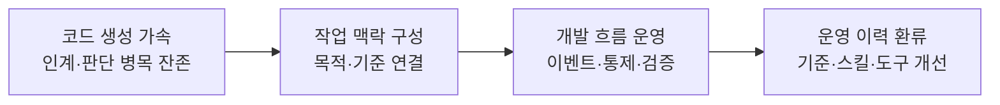
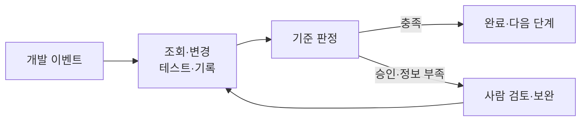
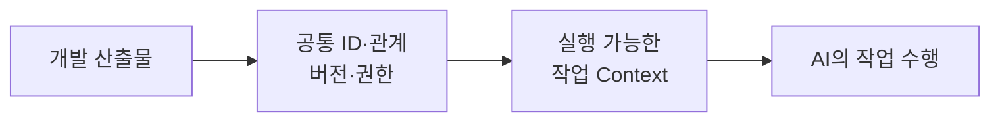
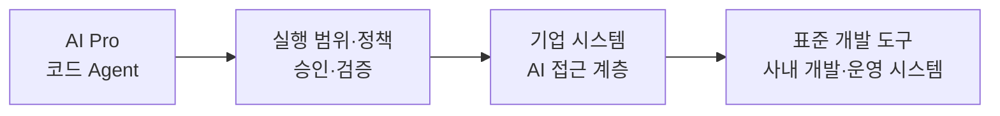
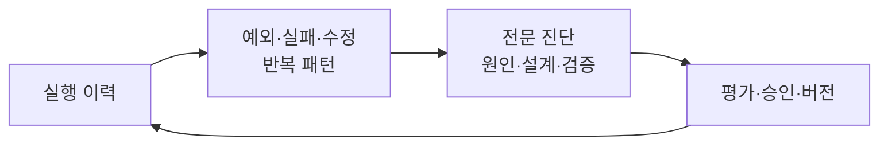

# 코드 생성의 속도를 개발 체계의 성과로 연결하기 — 삼성SDS

> 출처: REAL SUMMIT 2026 · 2026-09-08 · 확보 음성 22분 8.0175초

## 1. 개요

### 1.1 발표 정보

| 항목 | 내용 |
| --- | --- |
| 어떤 발표였나 | 사내 코드 Agent를 개발하면서 발견한 인계·맥락·판단 병목을 개발 프로세스와 실행 체계의 전환으로 풀어가는 경험 |
| 원래 발표 제목 | 기업 AX를 위한 SW 개발 전략 — 행사 프로그램 기준 |
| 어디서 들었나 | REAL SUMMIT 2026 |
| 언제 들었나 | 2026-09-08 · 프로그램 배정 16:10–16:40 |
| 발표자 | 신창민 상무 |
| 소속 | 삼성SDS. 세부 조직 미확인 |
| 발표 길이 | 확보 음성 22분 8.0175초 · 실시간 전사 00:00–22:07 |
| 원료 | 회의 14의 Soniox 실시간 전사 35블록, WebM/Opus 원음, 사진 17장, 행사 프로그램 |

사용자가 제공한 [행사 프로그램](assets/S-005/program.png)으로 제목·발표자·배정 시간을 확인했다. 녹취 메타데이터의 16:12:03 KST는 회의 녹음 시작 기준이며, 프로그램의 30분 배정과 확보 음성 길이는 구분한다. STT의 발표자 이름 오류는 원문에 그대로 보존했다.

시간순 근거와 사진의 단계별 변화는 [발표 재구성](assets/S-005/reconstruction.md)에 있다. 아래 사례는 한 개발 체계의 네 설계 문제이며 네 고객사 구축 실적이 아니다.

### 1.2 핵심 흐름

발표의 전환점은 개인에게 더 좋은 AI 도구를 주는 것에서 **AI가 연속적으로 일할 수 있는 개발 체계를 만드는 것**으로 이동하는 데 있다.

### 1.3 핵심 개념

#### 개인 루프와 프로젝트 흐름

한 명이 목표·구현·검증을 반복하는 속도와 분석·설계·구현·검증·배포를 여러 사람이 이어가는 속도는 다르다. 발표는 구현이 빨라진 뒤에도 일의 정의·맥락 연결·결과 판단이 사람에게 남는 문제를 지적한다.

#### 실행 가능한 작업 맥락

[[executable-task-context]]를 개발 업무에 적용한 설명이다. 자료를 많이 전달하기보다 무엇을 바꾸고 어떻게 완료를 판단할지 구성하는 의미로 사용했다.

#### 이벤트 기반 흐름 운영

개발 이벤트로 Agent 실행을 시작하고 기준 충족·승인 필요·정보 부족에 따라 다음 흐름을 결정한다. [[loop-engineering]]과 [[workflow-orchestration]]에 연결되는 경험이다.

#### 실행 하네스와 지속 성장

기업 시스템의 연결, 권한·도구·승인·검증·감사로 실행을 감싸는 체계와, 운영 결과를 다시 기준·도구 개선으로 바꾸는 체계다. [[human-in-the-loop]]는 매 단계 재지시보다 승인·예외·전문 진단에 배치된다.

## 2. 사례 상세

### 2.1 개인의 구현량 증가가 프로젝트 성과로 이어지지 않는 문제

#### 2.1.1 문제

AI가 코드를 빨리 생성해도 요구사항 해석, 관련 정보 취합, 결과 승인에 사람이 계속 개입한다. 다음 단계에 인계하고 기다리는 시간이 남아 전체 프로젝트 속도가 같은 비율로 빨라지지 않는다.

사진은 다음 수치를 대비했다. **사내 작업량과 외부 업계 통계는 별개 집단**이다.

| 범위 | 사진에 제시한 변화 |
| --- | --- |
| 2025→2026 사내 개발팀 작업 | 1인당 코드 라인 3,239→32,841(×10.1), 기능 개발 건수 1,146→2,640(×2.3), 변경 파일 수 589→2,577(×4.4) |
| Faros AI 2026 외부 텔레메트리 인용 | PR 리뷰 체류 시간 ×4.4, PR당 운영 장애 발생 ×3.4, 리뷰 없이 머지되는 PR +33.1%. 개발자 22,000명·4,000개 팀 표기 |

이 수치를 한 조직의 도입 전후 인과관계로 합치지 않는다. 특히 코드 라인 수를 프로젝트 생산성의 배수로 읽을 수 없다.

#### 2.1.2 해결 접근

사람이 작업을 선택하고 결과를 받아 다음 작업을 다시 지시하는 방식을 이벤트 기반 연속 운영으로 바꾼다. 완료 기준·승인·예외를 명시해 사람의 개입 지점을 정한다.

#### 2.1.3 적용과 아키텍처

시작 이벤트는 신규 이슈·코드 변경·테스트 실패·보안 경고·정기 작업이다. 사람이 여전히 맡는 일은 승인·권한·예외 판단이며, 개발자는 단건 지시보다 흐름의 연결을 설계한다.

#### 2.1.4 결과와 한계

이벤트 기반 흐름과 사람 개입의 분기가 제시됐다. 실제 리드타임이나 승인 대기 감소율은 공개되지 않았다. 앞의 사내 처리량 수치는 문제 제기의 맥락이며 이 흐름 전환만의 효과로 분리 측정한 결과가 아니다.

근거: 사진 01–09, 녹취 00:42–07:16.

### 2.2 흩어진 개발 자료를 AI DLC의 작업 맥락으로 연결

#### 2.2.1 문제

목표는 회의·요구사항 문서에, 맥락은 설계·코드·운영 시스템·담당자 지식에, 판단 기준은 의사결정자와 품질·보안 조직에 흩어져 있다. 문서가 최신인지도 불분명하면 AI는 대상을 다시 찾고 잘못된 변경을 반복한다.

발표는 보안 정책 변경을 예로 들었다. 사람이 알고 있는 요구사항과 변경 위치의 연결을 AI에게 제공하지 않으면 자료가 많아도 일을 바로 수행하기 어렵다.

#### 2.2.2 해결 접근

작업 목적·변경 대상·범위 제약·관련 산출물·적용 기준·완료 승인 조건을 묶어 제공한다. AI DLC는 Agent Skills·Rules·Context로 실행 방법과 회사 기준, 관련 정보를 연결하는 개발 체계로 소개됐다.

#### 2.2.3 적용과 아키텍처

| 구성 | 역할 |
| --- | --- |
| 작업 Context | 목적·대상·범위·산출물·기준·완료 조건 명시 |
| 연결할 산출물 | 요구사항·업무 규칙·설계 대상·컴포넌트·테스트·완료 기준 |
| 공통 식별자·관계 정보 | 관련 산출물을 따라갈 수 있는 연결 |
| 버전·권한 | 변경과 접근 범위 관리 |
| 지식 구조화 | 문서·Wiki·RAG·Graph로 조회·수정에 필요한 정보 제공 |

요구사항이 바뀌면 관련 정보를 갱신해 오래된 작업 맥락으로 수행하지 않도록 한다는 설명이다. 특정 그래프 DB, 관계 갱신 알고리즘, 충돌 처리 방식은 확인되지 않는다.

모델·환경도 개발 단계에 맞게 달리한다고 설명했다. 기술 검토·PoC의 외부 정보 활용과 운영 시스템 변경의 제한된 권한을 구분하며, 특정 모델 하나가 모든 단계의 답이라는 관점을 피한다.

#### 2.2.4 결과와 한계

AI DLC Portal 화면과 연결 구조를 확인했다. 사진은 **협업 생산성 30% ↑**, 구간 재전사는 **개인에게 AI 도구만 준 경우보다 협업 생산성 30% 이상 상승**이라는 자체 테스트 설명을 담고 있다.

원 STT의 “서버 생산성”과 다른 점을 재구성에 남겼다. 표본·기간·측정식·작업 난도 통제는 공개되지 않아 모든 프로젝트에 적용되는 개선율로 일반화할 수 없다.

근거: 사진 04–05·10–12, 녹취 07:16–13:42 및 12:08–13:07 구간 재전사.

### 2.3 기업 시스템 직접 연결에 실행 통제를 결합

#### 2.3.1 문제

사람이 여러 시스템을 조회·취합해 Agent에게 전달하면 병목과 정보 지연이 생긴다. 반면 직접 접근을 허용하면서 권한을 과도하게 주면 잘못된 판단이 시스템 변경으로 이어질 수 있다.

사진의 A사 13시간 장애와 C사/PocketOS의 9초 만의 볼륨 삭제는 발표가 인용한 외부 사고 예시다. 삼성SDS에서 발생한 사고가 아니며, 익명 회사의 실명이나 사건의 실제 경위를 이 노트에서 확정하지 않는다.

#### 2.3.2 해결 접근

기존 커넥터, 맥락 구조화, 업무 도구화를 제공하는 기업 시스템 AI 접근 계층을 둔다. 여기에 권한·최신성·승인·감사를 연결하고, 자율 코드 Agent의 실행은 통제 계층으로 관리한다.

#### 2.3.3 적용과 아키텍처

도식은 사진 13–15의 역할을 합친 개념적 흐름이다. 네트워크 배치나 단일 구현 컴포넌트의 호출 순서를 확정한 것은 아니다.

| 통제 | 발표에서의 역할 |
| --- | --- |
| 신원·권한 | 누가 어떤 범위에서 실행하는지 확인 |
| 실행 범위·도구 제한 | 허용된 동작으로 한정 |
| 정책·승인 게이트 | 허용·승인 필요·금지 분기 |
| 모니터링·감사 | 실행 중 로그, 검증·감사 이력 |

표준 도구로 GitHub·Jira·Confluence·Jenkins가 제시됐다. 발표자는 MCP뿐 아니라 API나 별도 조회 시스템도 필요할 수 있다고 설명했다. AI Pro는 사진에서 삼성SDS 자체 개발 Code Agent로 정의한다.

#### 2.3.4 결과와 한계

접근 계층과 AI Pro Governance 구성도, 정책 로드·로그 전달·승인 대기·차단의 흐름이 확인된다. 발표자는 관련 거버넌스를 함께 만들고 있다고 설명했다. 모든 연결 도구의 운영 완료나 사고 차단률·복구 보장은 공개되지 않았다.

근거: 사진 13–15, 녹취 13:42–15:40.

### 2.4 남은 판단 병목을 운영 개선으로 전환

#### 2.4.1 문제

테스트의 명확한 실패는 자동 처리할 수 있어도 변경 영향·위험한 예외·승인과 책임 판단은 사람에게 남는다. 같은 판단을 반복하면 자동 실행이 늘어도 전문가의 부담이 계속 쌓인다.

#### 2.4.2 해결 접근

실행 로그와 판단 기록에서 반복 패턴을 찾아 전문가가 원인을 진단한다. 이를 룰·평가, 스킬·흐름, 맥락·지식, 도구·연계로 바꿔 다음 실행에 반영한다.

#### 2.4.3 적용과 아키텍처

마지막 연결에는 단계적 적용·모니터링·효과 측정 후 재수집이 있다. 발표의 FDE는 내부 시스템과 개발·운영 흐름을 이해하고 이 개선을 수행하는 역할이다.

#### 2.4.4 결과와 한계

전문가 개입과 운영 환류의 구조가 제시됐다. 병목 해소율이나 자동 자기 개선 성과가 측정됐다는 뜻은 아니다. 발표자는 코드 Agent를 만들다 필요한 기반이 늘어나 개발 플랫폼으로 확장됐다고 설명했다.

후반에는 AI Pro·AI DLC와 사내 자산 제공 프레임워크의 통합을 설명하지만, 통합 플랫폼 명칭은 원 STT와 재전사가 달라 미확인으로 남겼다. 결론은 가까운 개발 업무부터 시스템과 프로세스를 바꾸고 기업 AX로 확장하자는 제안이다.

근거: 사진 16–17, 녹취 15:40–22:07.

## 3. 적용할 경험

아래 경험은 신규 개념 두 개와 기존 개념 세 개에 반영했다. 일반 정의와 적용 경계는 연결된 concept 문서가 갖고, 이 노트에는 발표의 사례와 근거를 남긴다.

| 발표에서 나온 개념 | 추상화·일반화 | 적용 조건·제약 | 추출할 concept 이름 |
| --- | --- | --- | --- |
| 이벤트 기반 연속 개발 | 작업 발견·실행·검증·다음 단계 연결을 외부 흐름으로 운영한다 | 완료 기준과 승인·정보 부족의 재개 조건이 명확해야 함 | [[loop-engineering]] — 기존 문서 보강 |
| 여섯 요소의 작업 Context | 흩어진 자료를 실행 목적·범위·완료 조건으로 구성한다 | 최신성·권한·연결 관계의 유지 비용이 있으며 자료량만 늘려서는 해결되지 않음 | [[executable-task-context]] — 신규 작성 |
| 공통 ID·관계·버전으로 산출물 연결 | 변경된 요구와 관련 산출물을 추적 가능한 관계로 관리한다 | 연결의 정확성과 갱신 책임이 필요. 발표의 상세 갱신 알고리즘은 미확인 | [[artifact-traceability]] — 신규 작성 |
| 승인·권한·예외 중심 개입 | 매 단계 지시 대신 위험과 책임이 생기는 지점에서 사람의 판단을 받는다 | 승인 기준·책임자·대기 후 재개 상태가 필요 | [[human-in-the-loop]] — 기존 문서 보강 |
| 운영 이력을 룰·스킬·도구로 반영 | 반복 판단을 검증 가능한 운영 기준으로 전환한다 | 전문가 진단·평가·버전 관리가 필요하며 자동 학습으로 일반화할 수 없음 | [[engineering-governance]] — 기존 문서 보강. 코드 관련 기준의 집행 범위에 한정 |

## 4. 참고 자료

발표의 미공개 구현을 채우는 자료가 아니라 단위 개념을 더 조사할 경로다.

| 단위 concept | 이 발표에서 시작된 질문 | 더 조사할 범위 | 추천 자료 |
| --- | --- | --- | --- |
| `loop-engineering` | 구현량과 실제 전달 성과를 어떻게 구별할까? | 변경 처리량·불안정성 지표와 병목 개선의 측정 | [DORA, Software Delivery Performance Metrics](https://dora.dev/guides/dora-metrics/) |
| `executable-task-context` | 필요한 맥락을 어떤 기준으로 구성·유지할까? | 한정된 문맥에서 정보 선택·도구·실행 이력 관리 | [Anthropic, Effective Context Engineering for AI Agents](https://www.anthropic.com/engineering/effective-context-engineering-for-ai-agents) |
| `human-in-the-loop` | 시스템 연결과 통제 책임은 어디에서 나뉠까? | Host·Client·Server 역할과 Tools·Resources의 연결 경계. 승인 정책은 별도 설계 | [MCP, Architecture Overview](https://modelcontextprotocol.io/docs/2026-07-28/learn/architecture) |
| `artifact-traceability` | 요구 변경이 관련 산출물의 갱신으로 어떻게 이어져야 할까? | 관계 모델·버전·영향 분석·갱신 책임 | 조사 필요 |

## 세션 에셋

- [행사 프로그램](assets/S-005/program.png)

- [발표 재구성·사진 17장·원본 대응표](assets/S-005/reconstruction.md)
- [Soniox 실시간 전사 원문](assets/S-005/transcript.txt)
- [음성 원본 · 결합 WebM](assets/S-005/recording.webm) · [재생용 WAV](assets/S-005/recording.wav)
- [음성 변환 기록](assets/S-005/audio-provenance.json) · [의심 구간 재전사](assets/S-005/audio-verification.soniox.json)
