# 발표 재구성 — 아모레퍼시픽 (Snowflake World Tour 서울, 2026-08-27)

발표자: 장홍진 (아모레퍼시픽 빅데이터 플랫폼 개발팀) · 21:26
원료: 같은 폴더의 `transcript.txt`(STT 358블록) + 슬라이드 사진 25장

슬라이드 순서대로 복원했다. 각 대목은 **사진 → 슬라이드가 보여준 것 → 발표자가 말한 것** 순이다.
사진이 없는 구간은 녹취만으로 적고 그렇다고 밝혔다.

---

## 도입 (00:00:06 ~ 00:01:53) — 사진 없음

자기소개. 「아모레퍼시픽에서 데이터 개발, 에이전트 개발, 발표 그냥 뭐 다 하는 장홍진입니다.」
박수와 함께 「되게 많이 와주셨네요. 이 세션에 오신 분들은 다들 비슷한 고민을 하실 거라 생각합니다.」

오프닝 비유를 깔았다.

> 「**폭설처럼 쌓이는 데이터**를 저희는 다 사용하지 못하고 제설해 버리는 것이 아니라
> **멋진 눈사람, 즉 에이전트로 만들고자** 하는 고민을 하시는 분들이 지금 여기 계시다고
> 생각합니다. 저희는 그 고민을 하나의 목표로 만들어 봤습니다.」

그 목표가 오늘의 슬로건이다 — **「Data for AI, Agent for Everyone」**.

팀 소개. 빅데이터 플랫폼 개발팀 **25명**이고 하는 일이 셋이다.

1. **데이터를 모은다** — 고객 정보, GA 태그 데이터, 솔루션 데이터까지 Snowflake 기반으로
2. **현업이 쓰도록 서비스로 제공한다** — 대시보드를 만들고, 셀프 BI 를 할 수 있게 교육도 한다
3. **AI** — 오늘 할 이야기

아젠다는 둘. **「데이터에 의미를 더하는 이야기」**와 **「공급망 전 영역을 연계하는 이야기」**.
슬라이드 구석의 눈사람이 세션이 진행되면서 자란다고 미리 알렸다.

---

# 1부 — 데이터에 의미를 더하는 이야기

도입에서 이렇게 예고했다. 「저희는 준비된 AI Ready 데이터를 가지고 **실적 기반의 세일즈
인사이트라는 서비스를 전사 오픈**했고 이 내용을 공유드리려고 합니다.」

## 01 · AI Ready Data — 의미 없이 물었을 때

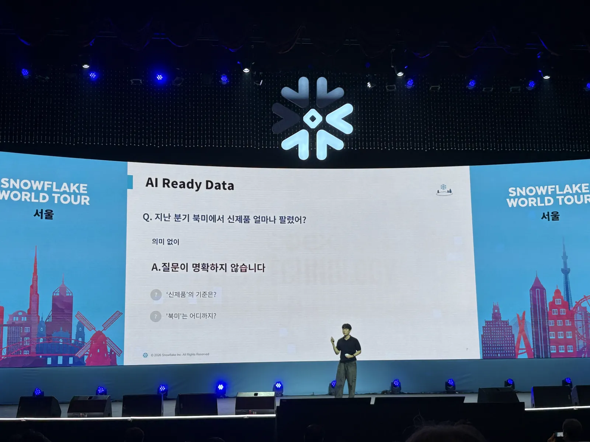

**슬라이드**

```text
Q. 지난 분기 북미에서 신제품 얼마나 팔렸어?

  의미 없이
  A. 질문이 명확하지 않습니다
     ? '신제품'의 기준은?
     ? '북미'는 어디까지?
```

**발표자**

> 「질문을 먼저 하나 하겠습니다. 『지난 분기 북미에서 신제품은 얼마나 팔렸어?』라고 그냥
> 물어보면 제대로 답변을 못하겠죠. **신제품의 기준도 잘 모르고 북미가 어디까지인지 모를 수
> 있기** 때문이죠.」

## 02 · AI Ready Data — 의미를 입혔을 때

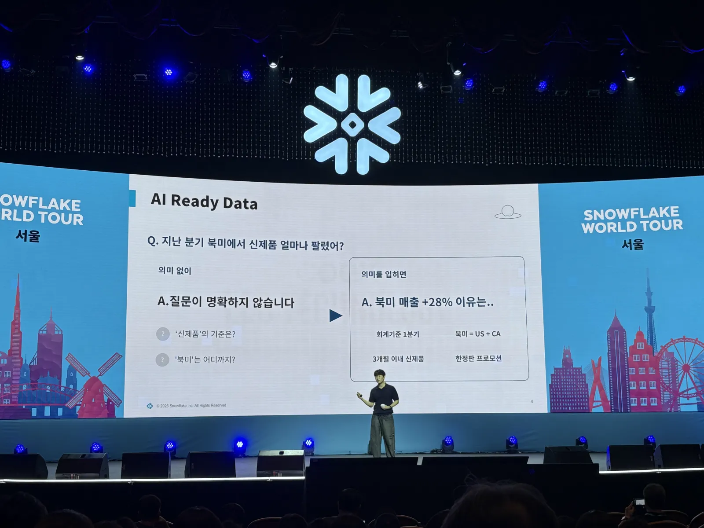

**슬라이드** — 왼쪽은 그대로 두고 오른쪽에 대비 블록이 붙는다.

```text
  의미를 입히면
  A. 북미 매출 +28% 이유는..

     회계기준 1분기        북미 = US + CA
     3개월 이내 신제품      한정판 프로모션
```

**발표자**

> 「하지만 의미를 입히면 **신제품은 3개월 이내에 출시된 녀석들**이었고, 그리고 **북미는 US 쪽
> 회사까지**라고 알기 때문에 보다 명확하게 총 매출은 얼마나 늘었고, 그 이유는 **한정판
> 프로모션** 때문이다. 이런 식으로 답변을 받으실 수 있겠습니다.」
>
> 「중요한 건 **모델의 성능이 아니라 데이터의 의미**이죠. 맥락이었습니다. 저희는 이걸
> **시맨틱 레이어**라고 부르죠.」

## 서비스 소개와 현업 반응 (00:02:52 ~ 00:03:38) — 사진 없음

서비스 이름을 **세일즈 인사이트**로 붙여 오픈했다. 본격 소개 전에 현업 반응부터 보여줬다.

> 「『나도 팀에 공유나 하나 해볼게요. 와, 이거 그냥 **통합 계정 신청해서 받으면 저렇게 BI
> 결과를 정리해 주는 거래요? 미쳤다.**』 네, 되게 감명 깊은 피드백이 많았는데요.」

그리고 효과를 수치 없이 이렇게 말했다.

> 「저희는 이 에이전트가 답변하는 데 **수십 초** 정도 시간이 걸렸습니다. 그런데 그 결과물은
> **한두 시간 혹은 하루 종일 걸려서 만드는 리포트**였습니다. 굉장히 효율적이죠.」

## 03 · 전체 아키텍처 — Snowflake 기반 AI 서비스 구축

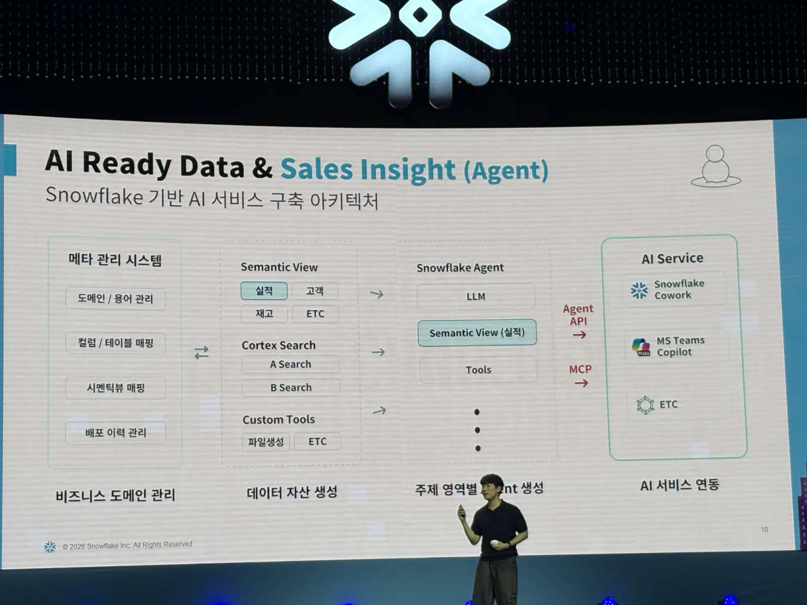

**슬라이드** — 네 칸이고 각 칸 아래에 단계 이름이 붙어 있다.

| | 칸 이름(하단) | 내용 |
| --- | --- | --- |
| ① | 비즈니스 도메인 관리 | **메타 관리 시스템** — 도메인/용어 관리 · 컬럼/테이블 매핑 · 시멘틱뷰 매핑 · **배포 이력 관리** |
| ② | 데이터 자산 생성 | **Semantic View**(실적 · 고객 · 재고 · ETC) / **Cortex Search**(A Search · B Search) / **Custom Tools**(파일생성 · ETC) |
| ③ | 주제 영역별 Agent 생성 | **Snowflake Agent** = LLM + Semantic View(실적) + Tools |
| ④ | AI 서비스 연동 | **Snowflake Cowork** · **MS Teams Copilot** · ETC |

①과 ② 사이는 **양방향 화살표(⇄)**, ②의 세 자산은 각각 ③으로 들어가고, ③에서 ④로는
**`Agent API`** 와 **`MCP`** 두 갈래가 붉은 글씨로 표시되어 있다. `Semantic View(실적)`만
파랗게 강조되어 있다 — 전사 오픈본이 실적 에이전트라서다.

**발표자**

> 「우선 전체 아키텍처입니다. 저희는 데이터, AI 데이터 서비스를 만드는 과정을 **반복 가능한
> 파이프라인으로 표준화**했는데요.」

칸별로 이렇게 설명했다.

- **① 비즈니스 도메인** — 「저희는 **시맨틱 레이어라는 서비스를 내부적으로 만들어서** 도메인,
  용어, 시맨틱 뷰 관련된 것, 그리고 제품 이름 등 메타 데이터를 **저희 거버넌스에 맞게 따로
  관리**를 했습니다.」
- **② 데이터 자산** — 「우선 시맨틱 뷰를 만들었습니다. **실적, 고객, 재고 등 주제 영역별**로
  만들었고요. 다음은 **Cortex Search** 입니다. 벡터 기반인데요, 쉽게 설명드리면 (표기가)
  이렇게 입력하더라도 올바르게 인식되는 서치 기능을 따로 붙였고요. 다음으로는 **커스텀
  툴**도 붙였습니다. 파일 생성, 예를 들면 결과를 엑셀로 만드는 기능.」
- **③ 에이전트** — 「자산을 갖고 에이전트를 만들었는데요. 이번에 전사 오픈한 서비스에는
  **실적 기반으로 만든 에이전트**가 제공됩니다.」
- **④ 서비스 연동** — 「AI 서비스를 운용합니다. Snowflake 로도 제공하지만 **에이전트 API 를
  통해서 MS 환경 팀즈로도** 제공되었습니다.」

운영 이야기를 덧붙였다.

> 「이 과정에서 **인스트럭션을 좀 바꾸면 또 결과가 다시 달라지고**, 이래서 이런 반복 과정을
> 물론 **자동화 툴을 만들어서** 진행을 했고요.」

그리고 이 슬라이드의 결론.

> 「여기서 핵심은 이 **브레인, 모든 중심은 Snowflake 안에 있었다.** 그리고 (나머지는) **연동만
> 된다**라는 부분입니다. Snowflake 최고라는 거죠.」

## 04 · 첫 번째 서비스 — MS Copilot Agent

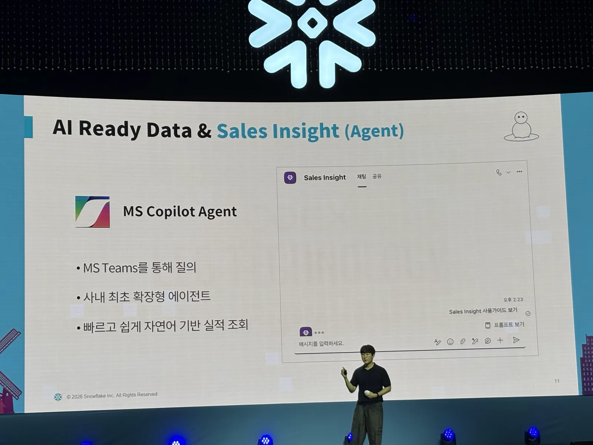

**슬라이드**

```text
MS Copilot Agent
 · MS Teams를 통해 질의
 · 사내 최초 확장형 에이전트
 · 빠르고 쉽게 자연어 기반 실적 조회
```

오른쪽은 Teams 채팅창 화면이다. 상단 탭이 `채팅 / 공유`, 하단에 「Sales Insight 사용가이드
보기」와 「프롬프트 보기」 버튼이 있다.

**발표자**

> 「**쓰던 대화창에서 질문한다**는 콘셉트로, 화면과 같이 팀즈 채팅방에서 세일즈 인사이트를
> 불러서 그냥 질문하면 이 **실적 전문가**가 답변을 해줍니다.」
>
> 「물론 **개인 채팅방 그리고 단체방, 조직 채널방**에서 다 사용 가능하게 되어 있고요.」
>
> 「이게 정말 좋았던 점은 사용자가 하나라도 **교육을 받지 않고** 그냥 팀즈에서 이렇게 사용할
> 수 있었다는 점입니다.」

이어서 어려웠던 점을 슬라이드 없이 말했다.

> 「물론 쉽지는 않습니다. 저희가 **마이크로소프트 생태계**를 사용하고 있는데 여기에
> **Snowflake 와 AWS** 를 가지고 와서 연동한 상태이기 때문에, 그 과정에서 **차트를 보여주려면
> 오피스 스크립트**로 렌더링을 해줘야 되고, **파워 오토메이트, 원드라이브** 이런 (것들까지)
> **8개 시스템을 다 연계**해서 이렇게 붙인 상태입니다.」

## 두 번째 서비스 — Snowflake Cowork (00:06:42 ~ 00:07:30) — 사진 없음

> 「두 번째 서비스입니다. **Snowflake Cowork** 이고요. 한때는 **인텔리전스**였죠.」
>
> 「여기서는 보다 **유연한 분석**이 가능합니다. 왜냐하면 팀즈라는 환경에 국한되어 있지 않기
> 때문이죠. 그리고 여기서 **파일 업로드**도 돼요. 예를 들면 엑셀에 **목표값을 정리해서
> 업로드**하고 『이거를 실적이랑 비교 분석해 줘』 이런 분석도 가능해지죠.」
>
> 「이런 **템플릿이 저장되어 있어서** 분석 결과를 저장해 놓고 공유하고 또 **재활용**도
> 가능합니다.」

1부 표면 둘을 이렇게 묶었다.

> 「요약하면 **팀즈에서 빠르게 분석하고, 코워크에서 좀 더 심도 있게 분석하는** 두 가지
> 서비스를 제공했습니다.」

## 05 · 부가 서비스 — AI_COMPLETE

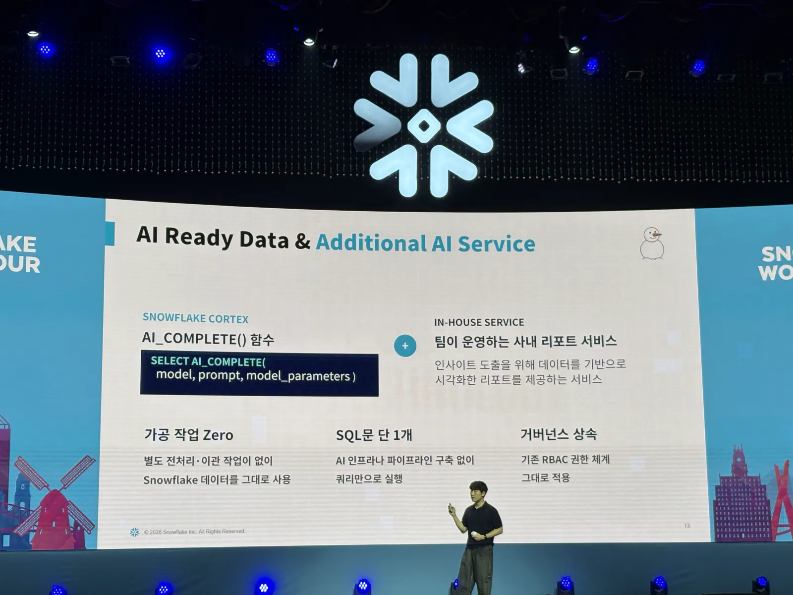

**슬라이드**

```sql
SELECT AI_COMPLETE( model, prompt, model_parameters )
```

오른쪽은 `IN-HOUSE SERVICE — 팀이 운영하는 사내 리포트 서비스 / 인사이트 도출을 위해
데이터를 기반으로 시각화한 리포트를 제공하는 서비스`. 하단에 세 가지.

| | |
| --- | --- |
| **가공 작업 Zero** | 별도 전처리·이관 작업이 없이 Snowflake 데이터를 그대로 사용 |
| **SQL문 단 1개** | AI 인프라나 파이프라인 구축 없이 쿼리만으로 실행 |
| **거버넌스 상속** | 기존 RBAC 권한 체계 그대로 적용 |

**발표자**

> 「저희가 **AI Ready**, 레디가 잘 준비되어 있어서 이걸 보고 **컴플리트 함수**를 씌워서 기존
> 저희가 운영하는 서비스에 부가적으로 제공한 서비스를 잠깐 소개해 드리려고 합니다.」
>
> 「AI 컴플리트라는 것은 모델, **소넷과 (같은) 모델을 연결하고 프롬프트를 넣을 수 있어요.**
> 저희는 이 프롬프트에 쿼리를 넣으면요, **쿼리 결과가 JSON 형태로 이 모델한테 전달되도록**
> 구성하였습니다.」
>
> 「그 과정에서 뭐 **전처리 같은 거 필요 없었겠죠.** 기존에 있었던 그대로 사용했고,
> **SQL문은 하나만 있습니다.** 그리고 **거버넌스 권한도 그대로** 사용하던 것 그대로
> 사용했습니다.」

그렇게 나온 부가 서비스 둘을 이어서 설명했다(해당 화면 사진 없음).

**브리프(인사이트 브리프)**
> 「리포트를 보기 전에 그 내용 **요점만 먼저 볼 수 있도록** 해주는 서비스입니다. 브랜드의
> 성장률과 지표를 빠르게 확인할 수 있습니다. 물론 상단에서 **브랜드도 바꿔가고 기간도
> 바꿔가는** 식으로 연동을 했습니다.」

**AI 서머리**
> 「저희가 서사, 스토리텔링을 뜻하는 **내러티브**라는 단어가 있어요. 내러티브라고 하기도
> 했었는데 지금은 **AI 서머리**고, 보시다시피 저 **대시보드 상단에 되게 조그맣게 서술형으로
> 요약**해 줍니다. 복잡한 대시보드의 내용을 핵심만 AI 가 추려서 서술형으로 위에 설명을
> 적어주는 서비스입니다.」

## 1부 마무리 (00:09:08 ~ 00:09:57) — 사진 없음

> 「이렇게 **MS 팀즈에서 실시간으로 질의 응답을 빠르게** 하고, **코워크 가서 좀 더 심층
> 분석**을 하고, **인사이트 브리프**에서 브랜드의 일련 과정을 확인하고, **AI 서머리**에서
> 대시보드의 스토리를 읽어보는 이런 서비스를 좀 빠르게 소개해 드렸습니다.」
>
> 「Data for AI, Agent for Everyone. 첫 번째 AI 가 여기까지고요. **아직 온톨로지가 끝나지도
> 않았는데 이런 서비스가 나왔습니다.** 꽤 괜찮다고 생각합니다, 저는.」

2부로 넘기는 한 줄.

> 「이제 **『얼마 팔았어』가 아니라 『어떤 일이 발생했고 어떻게 해야 될지』**까지 고민하는
> 시간을 가져보겠습니다.」

---

# 2부 — 공급망 전 영역을 연계하는 이야기

## 06 · 2부 표지

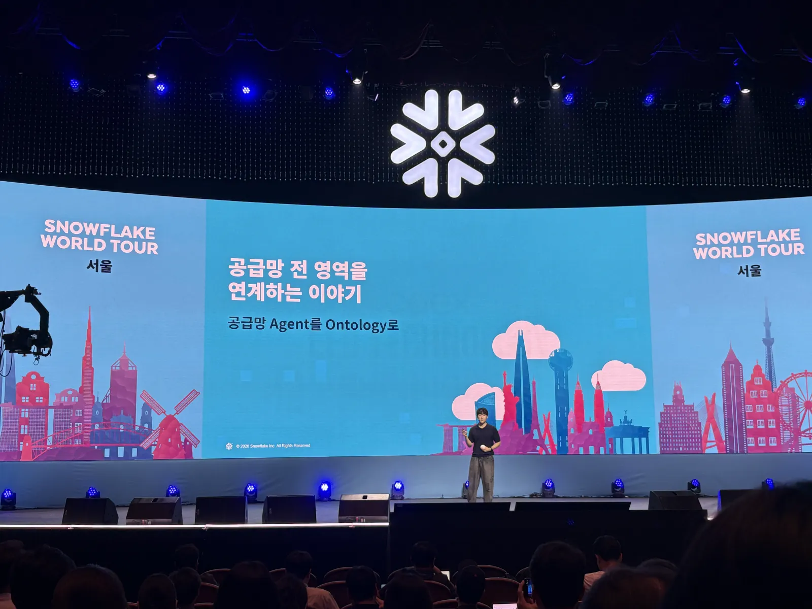

**슬라이드**

```text
공급망 전 영역을 연계하는 이야기
공급망 Agent를 Ontology로
```

**발표자**
> 「공급망 비전을 이번에는 **온톨로지로 만든 이야기**입니다. 많이 기대해 주세요.」

## 07 · 공급망의 진짜 문제 — 왼쪽만 나온 상태

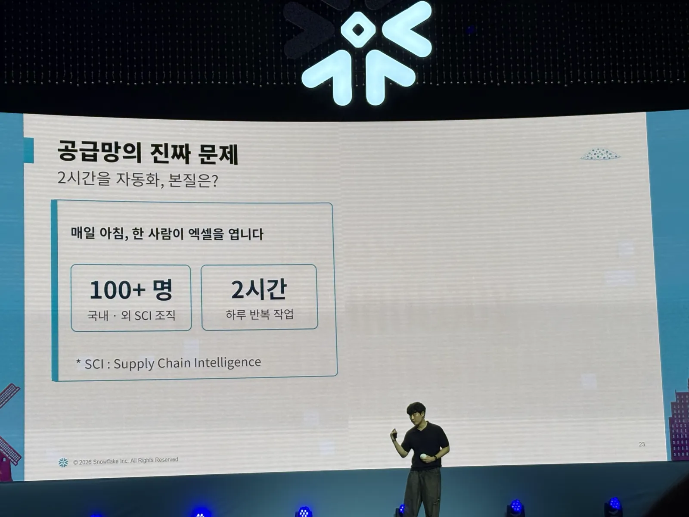

**슬라이드** (부제: `2시간을 자동화, 본질은?`)

```text
매일 아침, 한 사람이 엑셀을 엽니다

  100+ 명            2시간
  국내 · 외 SCI 조직   하루 반복 작업

  * SCI : Supply Chain Intelligence
```

**발표자**

> 「매일 아침 한 사람이 엑셀을 열었습니다. **SCI, 공급망 조직이 100명이 국내외로** 계신데
> 그들에게 KPI 분석된 생산이 어떻고 재고가 어떻고 이런 것들을 **두 시간 동안 반복 작업해서
> 매일매일 발송**했어요. 물론 이 작업은 저희가 **자동화 했습니다.**」
>
> 「**하지만 자동화가 본질은 아니었습니다.**」

## 08 · 공급망의 진짜 문제 — 오른쪽이 채워진 완성 상태

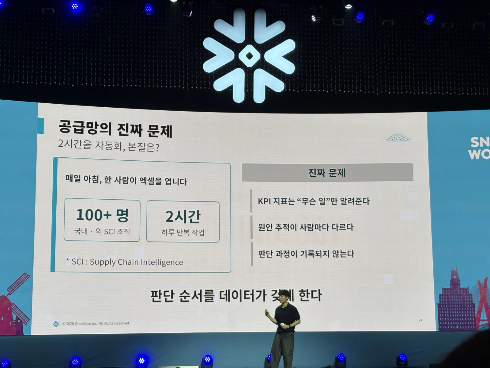

**슬라이드** — 오른쪽 블록과 하단 굵은 한 줄이 붙는다.

```text
              진짜 문제
  KPI 지표는 "무슨 일"만 알려준다
  원인 추적이 사람마다 다르다
  판단 과정이 기록되지 않는다

        판단 순서를 데이터가 갖게 한다
```

**발표자**

> 「진짜 문제는 **KPI 분석은 『생산성이 있었어』라고만 알려주고**, **그 원인을 추적하는 거는
> 담당하는 사람마다 달랐습니다.** 그리고 그 판단이 명확하게 내려지지 않았습니다.」
>
> 「저희가 한 것은 그 **판단 순서를 데이터가 갖게 했습니다.**」

## 09 · 원인은 이 흐름 어딘가에 있다

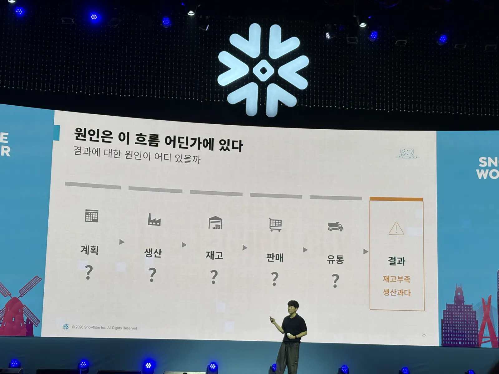

**슬라이드** (부제: `결과에 대한 원인이 어디 있을까`)

```text
계획 → 생산 → 재고 → 판매 → 유통 → [ 결과 ]
 ?      ?      ?      ?      ?      재고부족
                                    생산과다
```

**발표자**

> 「공급망은 계획, 생산 그리고 재고가 쌓이고 판매, 유통, 결과로 이어집니다. 이때 **재고가
> 부족하다, 생산이 과다하다라는 이슈가 생기면 그 원인을 어떻게 고칠까라는 거를 혼자
> 해결하기가 어려웠습니다.**」
>
> 「저희는 고민을 하다가 **각 영역을 시맨틱 모델로 만들었습니다.**」

## 10 · 영역 안에서는 이어진다

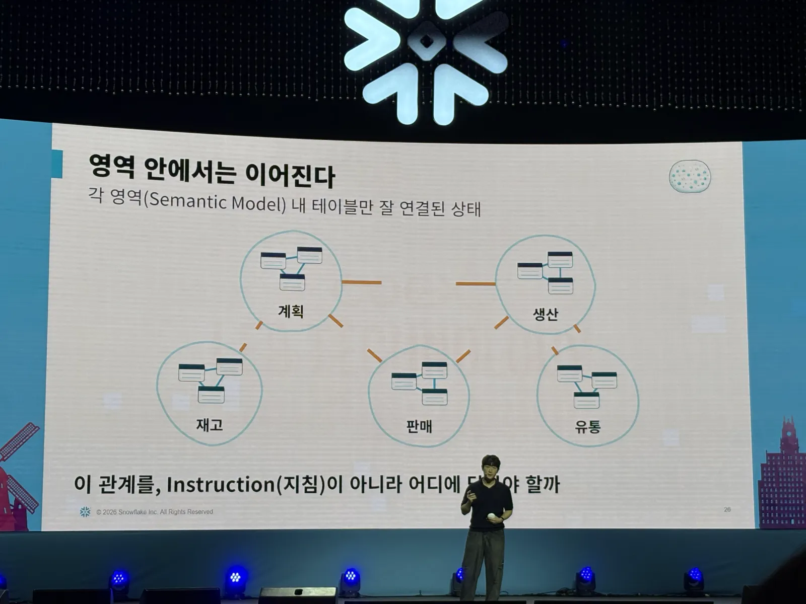

**슬라이드** (부제: `각 영역(Semantic Model) 내 테이블만 잘 연결된 상태`)

원 다섯 개(계획·생산·재고·판매·유통) 안에는 테이블이 선으로 이어져 있는데, **원과 원 사이는
주황색 선분이 끊긴 채로** 놓여 있다. 하단에 굵은 한 줄.

```text
이 관계를, Instruction(지침)이 아니라 어디에 담아야 할까
```

**발표자**

> 「각 영역 안에서는 잘 이어집니다. 시맨틱 모델 안에는 테이블이 잘 이어져, **시맨틱 모델
> 하나를 에이전트에 질문하면 원하는 대로 다 정리해서 나옵니다.** 하지만 **문제는 이 시맨틱
> 모델 간의 관계**인데요.」
>
> 「그걸 **인스트럭션으로 하다 보니까 사이즈도 늘어나고, 정확도가 떨어지고, 사이즈 자체도
> 한계가 있는** 것이기 때문에 그런 문제들이 있어서 — **그렇다면 이 관계를 인스트럭션이 아니라
> 어디에 담아야 할까?**」
>
> 「오신 분들은 다 아실 거예요. **이제부터 온톨로지 이야기**를 해보려고 합니다.」

## 11 · 원천 테이블이 KPI 뷰로 재구성되는 방식

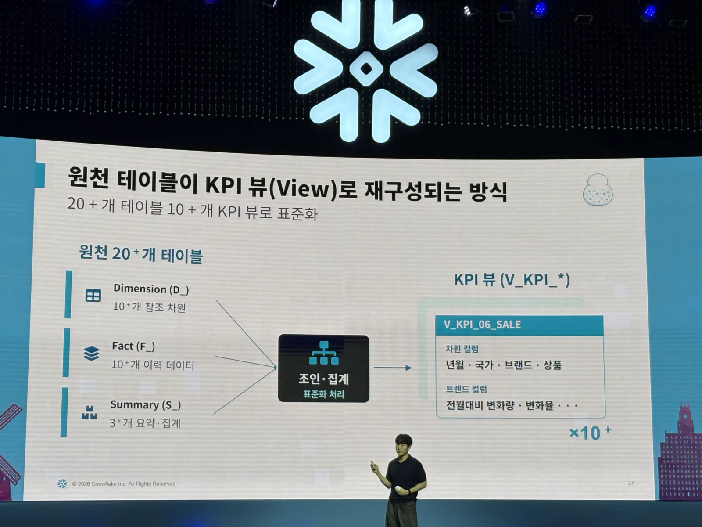

**슬라이드** (부제: `20+개 테이블 10+개 KPI 뷰로 표준화`)

```text
원천 20+개 테이블                              KPI 뷰 (V_KPI_*)
  Dimension (D_)  10+개 참조 차원                V_KPI_06_SALE
  Fact (F_)       10+개 이력 데이터    →  조인·집계  →   차원 컬럼
  Summary (S_)     3+개 요약·집계        표준화 처리      년월·국가·브랜드·상품
                                                       트렌드 컬럼
                                                       전월대비 변화량·변화율…
                                                                        ×10+
```

**발표자**

> 「저희는 공급망 데이터를 먼저 테이블을 **KPI 뷰로 만들었습니다.** 좀 더 상세히 말씀드리면
> 공급망 관련된 **디멘션이 많고 기존에 마트별로 기준이 다르기 때문에 일관된 기준을 가진 KPI
> 뷰**로 만들었습니다.」
>
> 「그럼 이 KPI 뷰는 **판매 영역, 재고 영역** 이렇게 나뉠 수 있겠죠. 그러면 이 KPI에 **전월
> 대비 변화량, 변화율** 이런 값들을 붙이게 됩니다.」

여기서 첫 번째로 가린 대목이 나온다.

> 「좀 **상세 KPI 는 제가 못 보여드리(고) 나중에 부탁드리겠습니다. 저희 회사 정책상.**」

대신 예시 하나를 들었다.

> 「예를 들어서 재고에 **DOS** 라고 있어요. **Days of Supply** 라고 해서 재고 수준이 있습니다.
> **재고가 며칠 동안 버틸 수 있느냐**, 그 일수를 나타낸 지표입니다.」
>
> 「그럼 이 지표에, 이 재고에 있어서 **전월 대비 얼마나 변했어? 변화량, 변화율**, 그리고
> 거기 더해서 **이상 탐지를 위해서** 이 재고 DOS 가 **양호한지, 주의 수준인지, 경고
> 수준인지.** 예를 들면 **30% 밑이면 양호해.** 이런 식으로 저희가 기준을 정해서 붙여줬습니다.」

## 12 · CoCo 스킬로 KPI 인과관계 구성

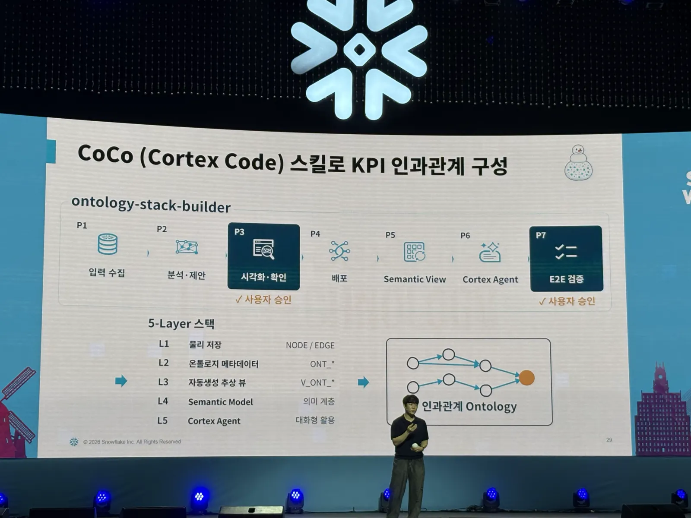

**슬라이드**

```text
ontology-stack-builder
 P1 입력 수집 → P2 분석·제안 → P3 시각화·확인 → P4 배포
 → P5 Semantic View → P6 Cortex Agent → P7 E2E 검증
                    ✓ 사용자 승인 (P3)                ✓ 사용자 승인 (P7)

5-Layer 스택
 L1  물리 저장          NODE / EDGE
 L2  온톨로지 메타데이터   ONT_*
 L3  자동생성 추상 뷰     V_ONT_*     →  [인과관계 Ontology 그래프]
 L4  Semantic Model     의미 계층
 L5  Cortex Agent       대화형 활용
```

`P3` 와 `P7` 두 칸만 짙게 칠해져 있고 그 아래에 각각 「✓ 사용자 승인」이 붙어 있다.
`L3` 왼쪽에 화살표 표시가 있다.

**발표자**

> 「이렇게 준비된 KPI 를 가지고 **코코에게 던집니다.** 코코에게 그대로 주면 **온톨로지 스택
> 빌더라는 스킬**을 통해서 코코가 위와 같이 **7단계를 거치고 자동으로 5레이어의 스택을 만드는
> 온톨로지를 만들어주는데요.**」

여기서 「자동」에 단서를 달았다. **다만 말한 단계 번호가 슬라이드와 다르다.**

> 「지난번에도 자동이라고 말씀드렸지만 사실은 **세 번째 단계, 6번째 단계는 사용자가 확인하고
> 승인을 해줘야 합니다.**」

> ⚠️ **슬라이드에는 `P3` 와 `P7(E2E 검증)` 에 승인 표시가 붙어 있다.** `P6` 는 `Cortex Agent`
> 다. 말과 슬라이드가 어긋난 자리다.

그리고 더 중요한 것을 짚었다.

> 「**더 중요한 것은 첫 두 단계입니다.** 저 첫 번째 단계에 **어떤 데이터를 쓸지** — 저희 같은
> 경우는 공급망 데이터겠죠. 공급망 데이터를 저희가 멋지게 **KPI 로 만들어서 잘 제공해 줘야**
> 됩니다.」
>
> 「그리고 두 번째, 그 데이터 갖고 **무슨 분석을 하고 무슨 목표를 갖고 뭘 원하는지를 명확히
> 전달**해야 합니다. 저희는 **공급망 현업과 협의해서** 공급망에서 **어떤 시나리오들이
> 벌어지는지 듣고** 그 내용을 전달했습니다.」

## 13 · 인과관계 기반의 Ontology — Meta

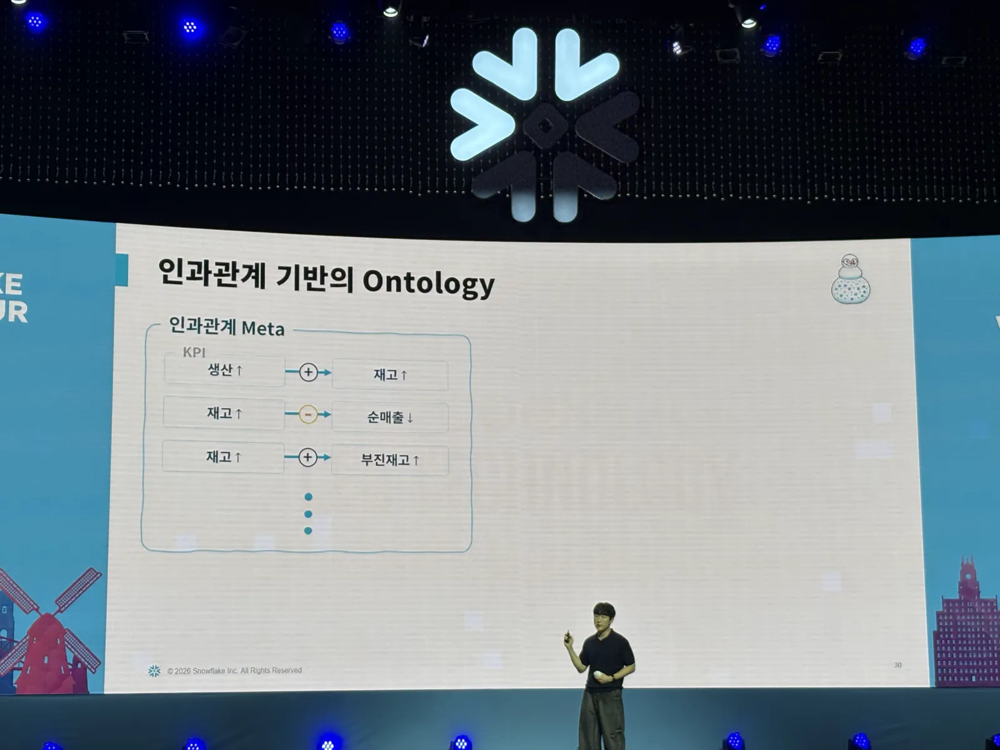

**슬라이드**

```text
인과관계 Meta
  KPI
   생산↑  ─(+)→  재고↑
   재고↑  ─(−)→  순매출↓
   재고↑  ─(+)→  부진재고↑
   ⋮
```

**발표자**

> 「여기서만 세 가지 항목이 있어요. **메타, 노드, 엣지.** 쉽죠? 메타, 노드, 엣지.」
>
> 「메타는 우선 **인과관계 메타**입니다. 예를 들어 **생산 KPI 가 올라간다. 그러면 재고 KPI 가
> 올라간다**는 이런 **코절(causal)**로 관계를 메타로 정해줍니다. 이때 **이 관계에 가중치도 넣을
> 수 있습니다.**」
>
> 「예를 들어 **재고가 쌓인다는 KPI. 그러면 순매출은 떨어진다**는 이런 **네거티브 관계**도
> 메타로 정해놓습니다. 또한 재고가 쌓인다는 KPI, 그럼 **부진재고**라는 KPI 를 저희가 예를 들어
> 정했어요. 그럼 이게 올라온다는 관계도 정해놓습니다. 그리고 **이 관계의 가중치는 1, 뭐 0.8
> 이렇게 정할 수도 있겠죠.**」

## 14 · Meta + Node

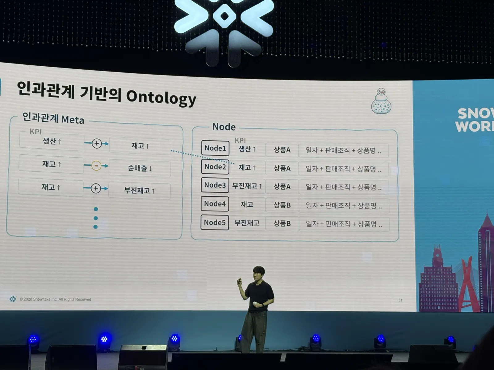

**슬라이드** — 오른쪽에 Node 표가 붙는다.

```text
Node
        KPI
 Node1  생산↑      상품A   일자 + 판매조직 + 상품명 ..
 Node2  재고↑      상품A   일자 + 판매조직 + 상품명 ..
 Node3  부진재고↑   상품A   일자 + 판매조직 + 상품명 ..
 Node4  재고        상품B   일자 + 판매조직 + 상품명 ..
 Node5  부진재고     상품B   일자 + 판매조직 + 상품명 ..
```

Meta 의 `재고↑` 칸에서 `Node2` 로 **점선**이 이어져 있다 — KPI 수준 인과가 상품 레벨
인스턴스로 내려온다는 표시다.

**발표자**

> 「다음으로는 **노드를 만들어봐요.** 노드는 저희가 **상품 레벨까지** 구성이 있습니다.
> **상품 하나에 KPI 하나, 그리고 상품 정보가 옆에 붙습니다. 그게 노드 하나**가 되는 거예요.」
>
> 「그러면 **상품 하나에 여러 KPI 가 붙을 수도 있고, 반대로 KPI 하나에는 여러 상품들이**
> 있겠죠.」

## 15 · Meta + Node + Edge

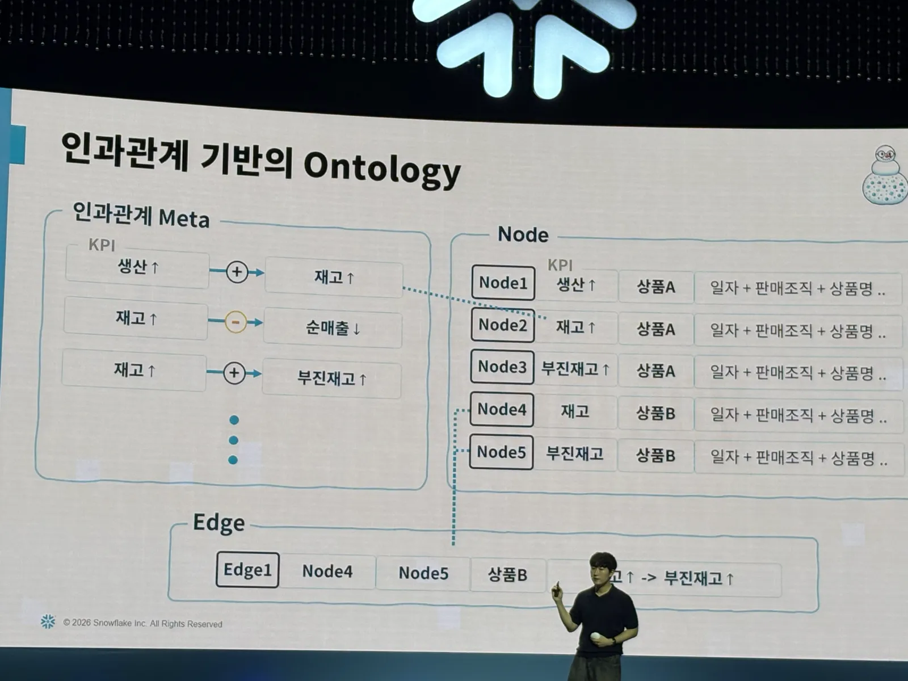

**슬라이드** — 하단에 Edge 가 붙고, `Node4`·`Node5` 에서 아래로 점선이 내려온다.

```text
Edge
 Edge1   Node4   Node5   상품B   (재고)↑ -> 부진재고↑
```

**발표자**

> 「자, 그럼 이제 뭘 만들면 될까요? **엣지를 만들어야 되겠죠. 노드 간의 관계**를 만들어줍니다.」
>
> 「예를 들어 **재고가 올라갈 때 부진재고도 올라간다라는 이거를 상품 하나에 대해서 정의**를
> 해주는 거예요.」
>
> 「여기서 눈썰미 있는 분들은 — 아, 눈썰미 얘기 아니고요 — 그 **노드를 그러면 상품 레벨로만
> 해야 되나? 그건 아니에요. 브랜드 레벨로도 할 수 있겠죠, 묶어서.** 그렇게 할 수 있다는 건
> 저는 (짚고 넘어가요.)」

## 16 · SCI 공급망 KPI 인과관계 온톨로지 그래프

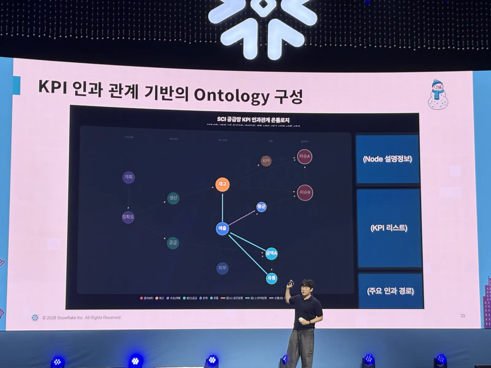

**슬라이드**

제목은 `SCI 공급망 KPI 인과관계 온톨로지`. 상단에 컬럼 구분(수요/계획 · 생산/공급 · 재고
상태 · 유통 · 결과KPI)이 흐릿하게 있고, 하단 범례가 노드 색과 엣지 종류를 가른다 —
`결과KPI · 재고 · 수요/계획 · 생산/공급 · 판매 · 유통` / `양(+) 같은방향 · 음(−) 반대방향 · 산출(0)`.

오른쪽 세 패널은 **내용이 비어 있고 이름만 있다** — `(Node 설명정보)` · `(KPI 리스트)` ·
`(주요 인과 경로)`.

**발표자**

> 「그럼 이렇게 구성되면 다음과 같은 그래프를 볼 수 있습니다.」

## 17 · 같은 그래프 — 이슈에서 거꾸로

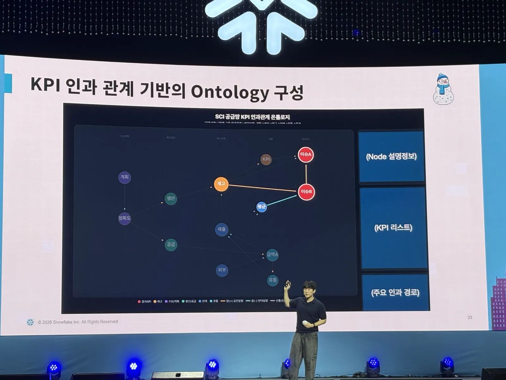

**슬라이드** — 같은 그래프인데 `재고 → 이슈B`, `이슈B → 이슈A`, `평균 → 이슈B` 경로가
굵고 밝게 강조되어 있다.

**발표자**

> 「**계획부터 생산 노드를 거쳐 재고, 판매도 발생하고 어떤 날 이슈가 발생한다**까지. 그러면
> **반대로 저 이슈를 봤을 때 거꾸로 따라갈 수 있겠죠.** 『아, 재고가 어떻게 많아지죠? 생산
> (쪽이)네.』」

여기서 두 번째로 가린 대목이자 데모의 한계를 밝혔다.

> 「그래서 좀 아쉬운 게, **회사 데이터**를 가지고 (하다 보니) 모든 분들이 다 다르다 보니까 —
> 그래서 **KPI 리스트들이 (여기) 인과관계로 정리돼 있는데 조금 아쉽습니다. 그래서 이슈
> 에이전트도 없고 이건 양해 부탁드립니다.**」

> ⚠️ 오른쪽 세 패널이 비어 있는 이유가 이것이다. **KPI 리스트와 이슈 에이전트가 데모에서
> 빠졌다.**

## 18 · Agent 구성 — 용도에 맞게 분리

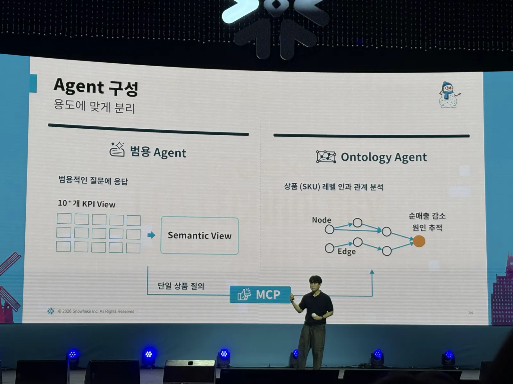

**슬라이드** (부제: `용도에 맞게 분리`)

```text
   범용 Agent                      Ontology Agent
   범용적인 질문에 응답              상품 (SKU) 레벨 인과 관계 분석

   10+개 KPI View                  Node ○→○→○  ⟶ 순매출 감소
   [ □□□□□ ]  →  Semantic View     Edge ○→○→○     원인 추적
   [ □□□□□ ]
   [ □□□□□ ]
         └── 단일 상품 질의 ──[ MCP ]──┘
```

**발표자**

> 「자, 그러면 이렇게 준비된 온톨로지를 에이전트에 활용할 건데요. 저희는 **두 가지
> 에이전트**를 구성했고요. **범용 에이전트와 온톨로지 에이전트**입니다.」
>
> 「**범용 에이전트는** 말 그대로 **범용적 질문에 반응**하는데, **KPI 뷰로만 작동**했던 (것이고)
> **온톨로지 에이전트는 상품 레벨의 인과관계 분석이 가능한 온톨로지를 갖고 있는**
> 에이전트입니다.」
>
> 「예를 들어 『**순매출 3개월 평균 알려줘.**』 그 정도는 그냥 범용 에이전트가 가능해요.
> 하지만 『**라네즈 수분크림 200미리 짜리, 저 순매출이 왜 떨어지고 있어?**』 이렇게 **단일 상품
> 질문이 들어오면 MCP 를 타고 그때 온톨로지 에이전트로 넘어갑니다.**」
>
> 「**사실상 멀티 에이전트는 아니죠.** 그래도 이렇게 구성되어 있고요.」
>
> 「이렇게 그때는 온톨로지 에이전트가 상품 레벨에서 **왜 순매출이 이 상품이 감소했는지
> 인과관계를 찾아보고** …」

## 19 · SCI BI — Overview 대시보드

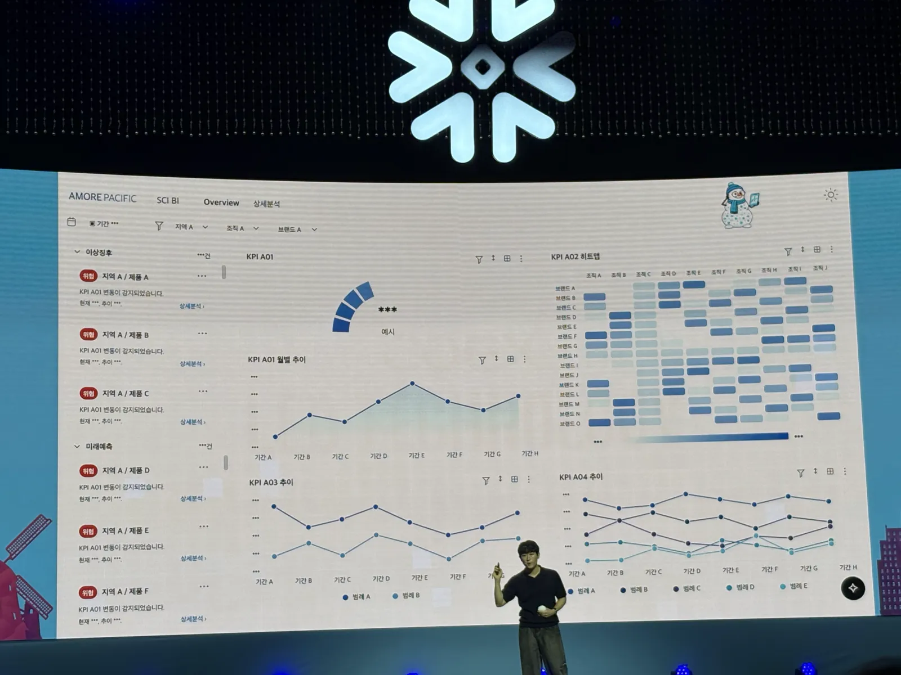

**슬라이드** — Streamlit 앱 화면이다.

- 상단 탭 `Overview / 상세분석`, 필터는 `기간 ***`, `지역 A`, `조직 A`, `브랜드 A`
- 왼쪽 **이상징후** `***건` — `위험 · 지역 A / 제품 A` 형태로 나열되고 각 항목 아래
  「KPI A01 변동이 감지되었습니다 / 현재 ***, 추이 ***」와 `상세분석 ›` 링크
- 그 아래 **미래예측** `***건` — 같은 형식으로 제품 D·E·F
- 오른쪽 `KPI A01`(게이지 + `***`, 「예시」 표기), `KPI A01 월별 추이`, `KPI A03 추이`,
  `KPI A02 히트맵`(브랜드 A~O × 조직 A~J), `KPI A04 추이`
- **수치가 전부 `***` 로 마스킹되어 있고 축 라벨도 `기간 A~H`, `범례 A~E` 로 익명화**

**발표자**

> 「다음으로는 이건 기능이 아니고, 저희 **에이전트를 갖고 리액트 기반의 앱을 만든
> 화면**인데요. **스트림릿 앱** 있죠, 그 앱으로 만든 화면입니다. 대시보드에 브랜드, 특정
> 국가의 브랜드의 KPI 에 앞서 만든 멋진 KPI 들을 이렇게 **한 면에 둘 수 있습니다.**」
>
> 「물론 여기 다 전문가분들이셔서 『나 오늘 아침에 봤어』라고 핸드폰 보시는 분들도 계시는데,
> 네, 중요한 건 **저 왼쪽 빨간색**입니다. 저 빨간색은 **제품 하나당 이상 징후**가 나오는
> 건데요. **위험**이라고 했죠?」

## 20 · SCI BI — 상세분석, KPI 카드

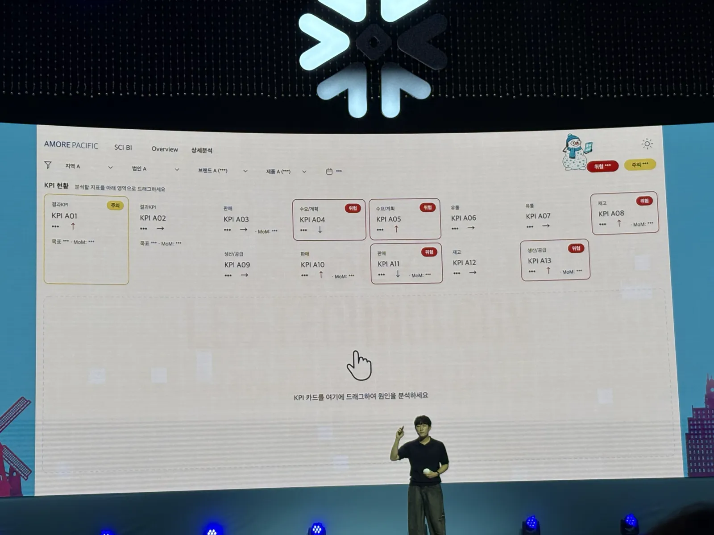

**슬라이드**

- 필터 `지역 A / 법인 A / 브랜드 A (***) / 제품 A (***)`, 우상단에 `위험 ***`, `주의 ***` 배지
- **KPI 현황** — 「분석할 지표를 아래 영역으로 드래그하세요」
- 카드 13장이 분류를 달고 깔린다

| 분류 | 카드 |
| --- | --- |
| 결과KPI | `A01`(주의) · `A02` |
| 판매 | `A03` · `A10` · `A11`(위험) |
| 수요/계획 | `A04`(위험) · `A05`(위험) |
| 유통 | `A06` · `A07` |
| 재고 | `A08`(위험) · `A12` |
| 생산/공급 | `A09` · `A13`(위험) |

각 카드에 값 `***`, 방향 화살표(↑ ↓ →), `목표 *** · MoM: ***`. 하단은 빈 드롭 영역이고
가운데에 손가락 아이콘과 「**KPI 카드를 여기에 드래그하여 원인을 분석하세요**」.

**발표자**

> 「좀 잘 모르시겠지만 **저걸 클릭하게 되면 이렇게 상품 하나에 대해서 KPI 가 상당히
> 나옵니다. 재고는 위험해요. 판매는 양호해.** 이런 식으로 나오게 되고요.」

## 21–22 · SCI BI — KPI A01 원인 분석

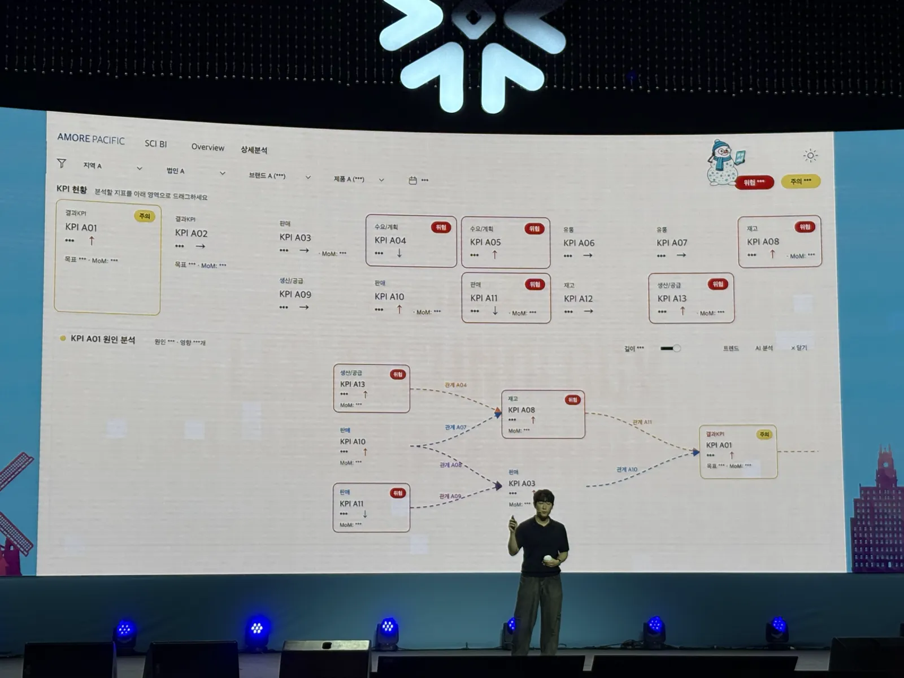

> 같은 화면을 두 번 찍었다. `21-sci-bi-cause-analysis-a.webp` 는 각도가 기울어 흐리고,
> 위에 붙인 `22` 가 선명하다.

**슬라이드**

하단에 `● KPI A01 원인 분석 — 원인 *** · 영향 ***개` 패널이 열리고, 우측에 `길이 ***`
슬라이더와 `트렌드` · `AI 분석` · `× 닫기` 버튼이 있다. 그래프는 이렇게 이어진다.

```text
생산/공급 A13(위험) ──관계 A04──┐
판매 A10 ─────────관계 A07──┤→ 재고 A08(위험) ──관계 A11──┐
                            │                          ├→ 결과KPI A01(주의)
판매 A10 ─────────관계 A08──┤→ 판매 A03 ─────관계 A10──┘
판매 A11(위험) ────관계 A09──┘
```

노드마다 `*** · MoM: ***` 로 값이 가려져 있다.

**발표자**

> 「이 **위험한 재고를 하나 끌어서 내려다 보면 이렇게 재고 하나에 대해서 앞뒤로 인과관계를 볼
> 수 있습니다.**」

세 번째로 가린 대목.

> 「그래서 아쉬운 게 **『재고가 10억이 올랐어. 근데 앞에 봤더니 생산도 이렇네』 이렇게 될 수
> 있는 숫자가 있는 건데 좀 다 가려서 양해 부탁드립니다.** 어쨌든 이렇게 인과관계를 분석할 수
> 있고요.」

## 23 · SCI BI — 더 깊게 + AI 인과분석

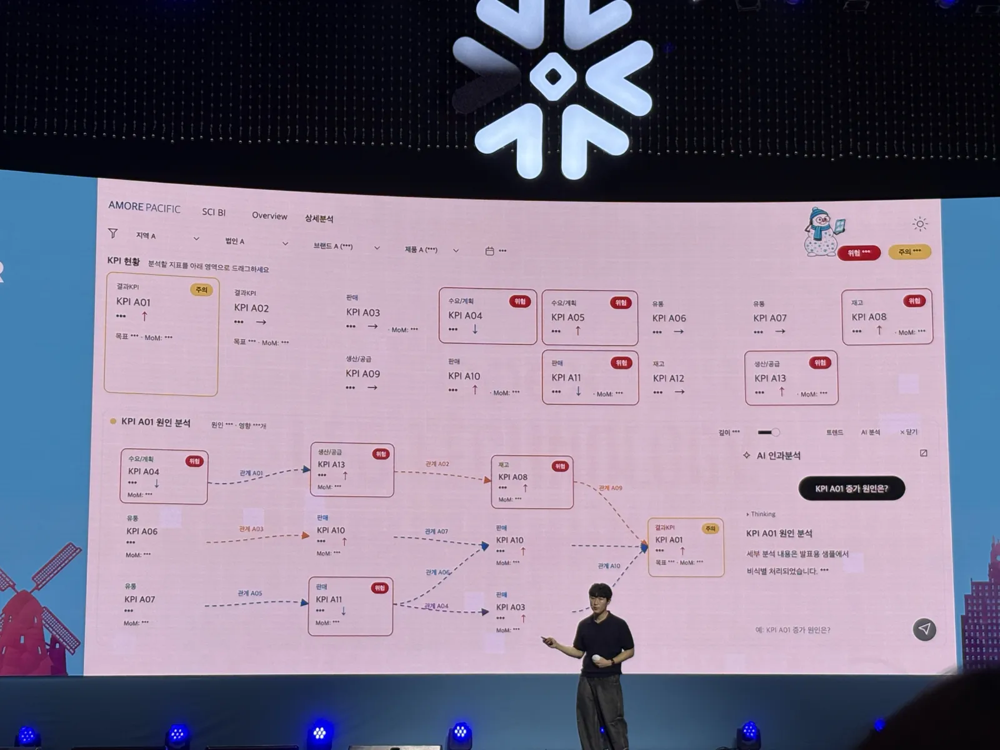

**슬라이드**

그래프가 왼쪽으로 두 단계 더 뻗는다 — `수요/계획 A04(위험)` → `생산/공급 A13(위험)` →
`재고 A08(위험)` → `결과KPI A01`, 그리고 `유통 A06` → `판매 A10`, `유통 A07` →
`판매 A11(위험)` → `판매 A03` 갈래가 함께 그려진다. 엣지 ID 가 `관계 A01`~`관계 A10` 까지 붙는다.

우측 패널 **`✧ AI 인과분석`**

```text
        [ KPI A01 증가 원인은? ]

▸ Thinking
KPI A01 원인 분석
세부 분석 내용은 발표용 샘플에서 비식별 처리되었습니다. ***

예: KPI A01 증가 원인은?
```

> 답변 본문 자리에 **「발표용 샘플에서 비식별 처리되었습니다」**라고 명시되어 있다.

**발표자**

> 「물론 이렇게 **탭을 더 깊게 할 수 있습니다.** 물론 **에이전트를 통해 추가 질문을 하고**
> 여기서 답변 가능한 데이터를 받고 **데이터를 비주얼화해서 사용자가 직접 대시보드와 데이터
> 검수도 가능**합니다.」
>
> 「**꽤 괜찮죠? 여기서 사진 찍어야 할 것 같아요.** 중간중간에. 네, 꽤 괜찮은 서비스 같아요.」

이어서 확장 가능성을 말했다.

> 「지금 말씀드리고자 하는 것은 **공급망을 예시로 이렇게 인과관계를 분석했는데, 그렇다면
> 공급망뿐만 아니라 다른 영역에 적용하면 얼마나 유용할까?** 네, 공감이 가지 않으십니까?
> 꽤 유용할 거라고 생각해서 저런 결과가 되었습니다.」

## 24 · Snowflake 통해 Amorepacific 분석 문화 변화

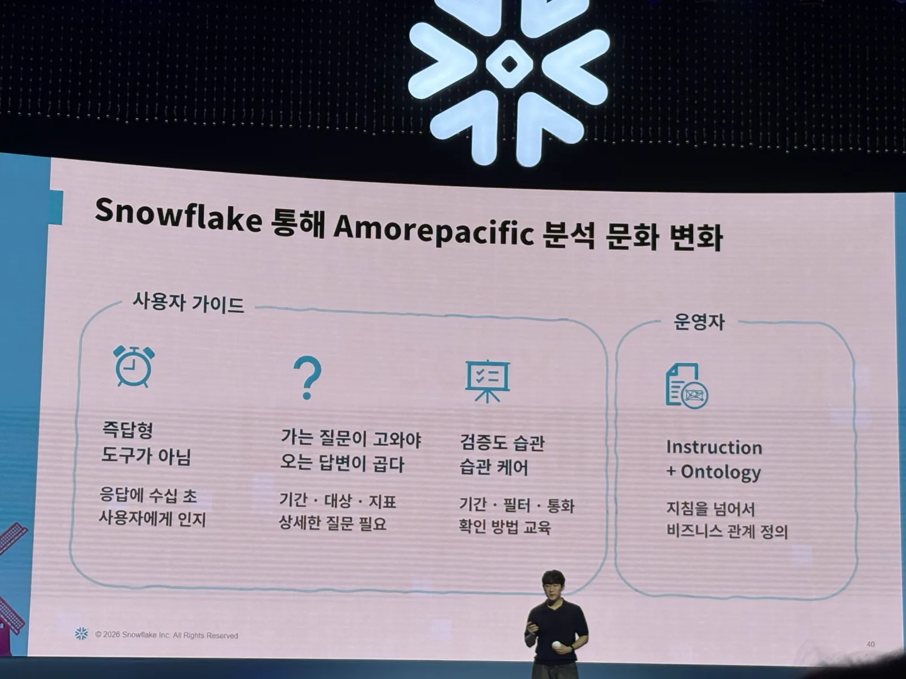

**슬라이드**

```text
사용자 가이드                                            운영자

즉답형          가는 질문이 고와야    검증도 습관        Instruction
도구가 아님      오는 답변이 곱다     습관 케어         + Ontology

응답에 수십 초   기간·대상·지표      기간·필터·통화     지침을 넘어서
사용자에게 인지  상세한 질문 필요     확인 방법 교육     비즈니스 관계 정의
```

**발표자**

> 「Snowflake 를 통해 **아모레퍼시픽 분석 문화는 바뀌고 있습니다.**」
>
> 「사용자에게는 말합니다. **즉답형 도구가 아닌, 분석의 시간이 (수십) 초가 걸릴 거야.**」
>
> 「**가는 질문이 (고와야) 오는 답변이 (곱겠죠).** 당연히 **기간이나 대상, 지표를 상세하게
> 질문**해달라고 교육합니다.」
>
> 「**검증도 강요는 아니고 강조를 합니다.** 기간을 (제대로) 입력하시라. **무조건 믿지 말고
> 『내가 3월을 물어봤어. 3월에 (대해) 했는지』 확인하시라**고 강조를 합니다.」
>
> 「저희는 이제 **인스트럭션을 넘어 온톨로지를 입힌 에이전트**를 만들어 나가고 있습니다.」

## 마무리 (00:20:29 ~ 00:21:26) — 사진 없음

> 「오늘 **데이터 에이전트에서 실적 기반 에이전트를 전사 오픈한 이야기**와 **온톨로지를 입힌
> 공급망 에이전트 대시보드**를 보여드렸는데요.」
>
> 「앞으로는 **하나의 에이전트 안에서 모든 영역에 대해 답변이 가능한 통합 에이전트**를 만들어
> 나가려 합니다. 그리고 아까 (앞선 세션에서) 나왔던 그런 기능도 덧붙일 기대를 하고 있습니다.」

오프닝의 눈사람 비유로 닫았다.

> 「지금까지 이렇게 눈사람, 또 다른 눈사람이죠. **눈사람이 하나 이렇게 떨어졌습니다.**
> 귀엽죠? 저 말고 눈사람이 귀엽죠? 이렇게 눈사람을 만들었는데, 오늘 이렇게 봐주신 여러분
> 너무 감사드리고 앞으로 더욱더 **멋진 눈사람을 만드는 Snowflake 관계자분들이 되기를 응원하며
> — Data for AI, Agent for Everyone 세션을 마치겠습니다.**」

---

## 재구성하면서 남긴 것

**말과 슬라이드가 어긋난 자리 (12번)** — 승인 단계를 「3단계, **6단계**」라고 말했으나
슬라이드는 `P3` 와 `P7`. P6 는 `Cortex Agent` 다.

**발표자가 가렸다고 밝힌 것 셋**
1. 상세 KPI 목록 — 「저희 회사 정책상」(11번)
2. KPI 리스트 패널과 이슈 에이전트 — 데모에서 빠짐(17번)
3. 대시보드 실측치 전부 — 「다 가려서 양해 부탁드립니다」. 화면의 값이 `***`, 축 라벨은
   `기간 A~H`, AI 답변은 「발표용 샘플에서 비식별 처리」(19~23번)

**사진이 없는 구간** — 도입, 세일즈 인사이트 서비스 소개와 현업 반응, Snowflake Cowork,
브리프·AI 서머리 화면, 1부 마무리, 2부 마무리. 녹취만으로 적었다.

**STT 오인식** — 원문은 손대지 않았고 위 인용에서만 바로잡았다.
시맨틱 레이저→레이어 · 코어 텍스트 서치→Cortex Search · 버명 에이전트→범용 Agent ·
코코→CoCo · 수매출→순매출 · SPM은 하나만→SQL문 단 1개 · 스럼 테이트 앱→Streamlit 앱 ·
기준 재고→부진재고 · 데이터 폴 AI 에이전트 폴 에브리원→Data for AI, Agent for Everyone

**이 발표 것이 아닌 사진 한 장** — `99-unidentified-amazon-quick.webp` 는 「Amazon Quick 에서
활용 — 자연어로 대시보드 생성」 슬라이드로 발표 내용에 없다. 같은 행사의 다른 세션으로
보이나 확인하지 못했다.

---

# 최종 정리 — 데이터에 의미와 판단 순서를 담은 두 가지 사례

이 발표는 AI 모델을 바꿔서 문제를 해결한 이야기가 아니다. 아모레퍼시픽은 먼저 **데이터가
회사의 용어를 이해하게 만들고**, 그다음에는 **업무 담당자가 원인을 판단하는 순서까지 데이터로
표현**했다. 그렇게 준비한 데이터를 Snowflake Agent와 사내 서비스에 연결했다.

## 사례 1 — 회사의 언어를 이해하는 실적 분석 Agent

### 문제 — 같은 질문도 사람마다 뜻이 달랐다

「지난 분기 북미에서 신제품이 얼마나 팔렸는가」라는 질문에는 이미 여러 해석이 들어 있다.
지난 분기가 회계 기준으로 언제인지, 북미에 어느 국가가 포함되는지, 출시 후 얼마까지를
신제품으로 볼지 정해야 한다. 이런 기준이 데이터에 없으면 AI는 질문을 이해하지 못하거나
사용자가 기대한 것과 다른 숫자를 답한다.

### 만든 개념 — AI Ready Data와 Semantic Layer

신제품, 북미, 분기처럼 회사에서 사용하는 용어의 정의와 테이블·컬럼의 관계를 관리하는
**Semantic Layer**를 만들었다. 발표에서 말한 **AI Ready Data**는 단순히 정제된 데이터가
아니라, AI가 업무의 의미와 맥락까지 해석할 수 있는 데이터에 가깝다.

### 적용과 아키텍처

도메인·용어와 데이터의 매핑을 메타 관리 시스템에서 관리하고, 실적·고객·재고 등 주제별
Semantic View를 만들었다. 표기 차이를 찾기 위한 Cortex Search와 엑셀 파일 생성 같은 Custom
Tool도 붙였다. 이 자산으로 실적 전문 에이전트인 **Sales Insight**를 만들었다.

| 계층 | 구성요소 | 역할 |
| --- | --- | --- |
| 비즈니스 정의와 거버넌스 | 도메인·용어 관리, 테이블·컬럼 매핑, Semantic View 매핑, 배포 이력 | 회사의 용어와 데이터가 뜻하는 바를 정의하고 변경을 관리한다 |
| 데이터 자산 | Semantic View, Cortex Search, Custom Tools | 실적을 조회하고, 표기 차이를 찾고, 엑셀과 같은 결과물을 만든다 |
| Agent | LLM, 실적 Semantic View, Tools | 질문을 해석하고 필요한 데이터와 도구를 선택해 답변한다 |
| 사용자 접점 | MS Teams, Snowflake Cowork, 사내 리포트 | 빠른 질의, 심층 분석, 기존 서비스 안의 요약을 제공한다 |

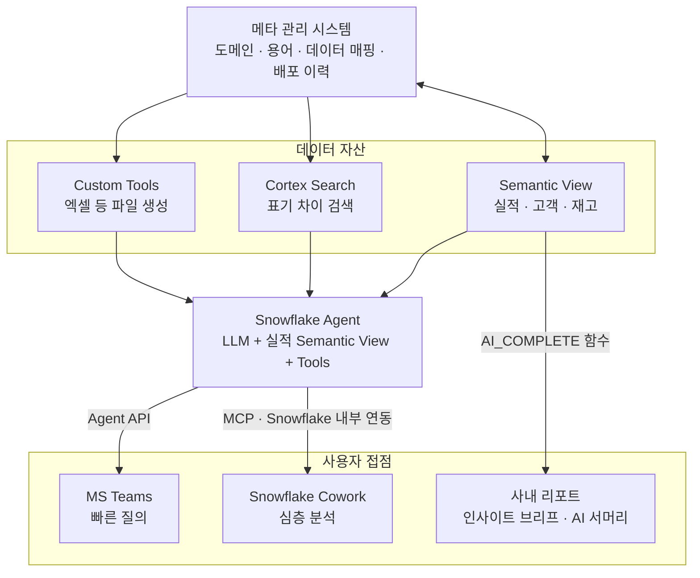
```mermaid
flowchart TB
    META["메타 관리 시스템<br/>도메인 · 용어 · 데이터 매핑 · 배포 이력"]

    subgraph ASSET[데이터 자산]
        SV["Semantic View<br/>실적 · 고객 · 재고"]
        SEARCH["Cortex Search<br/>표기 차이 검색"]
        TOOL["Custom Tools<br/>엑셀 등 파일 생성"]
    end

    AGENT["Snowflake Agent<br/>LLM + 실적 Semantic View + Tools"]

    subgraph CHANNEL[사용자 접점]
        TEAMS["MS Teams<br/>빠른 질의"]
        COWORK["Snowflake Cowork<br/>심층 분석"]
        REPORT["사내 리포트<br/>인사이트 브리프 · AI 서머리"]
    end

    META <--> SV
    META --> SEARCH
    META --> TOOL
    SV --> AGENT
    SEARCH --> AGENT
    TOOL --> AGENT
    AGENT -->|Agent API| TEAMS
    AGENT -->|MCP · Snowflake 내부 연동| COWORK
    SV -->|AI_COMPLETE 함수| REPORT
```

사용자는 **MS Teams**의 평소 쓰던 대화창에서 실적을 빠르게 질문하고, **Snowflake Cowork**에
목표값이 든 파일을 올려 실적과 비교하거나 분석 결과를 저장·재사용할 수 있다. 기존
대시보드에는 `AI_COMPLETE()`를 적용해 리포트의 요점을 먼저 보여주는 **인사이트 브리프**와
복잡한 화면을 문장으로 설명하는 **AI 서머리**를 만들었다.

Snowflake 안에 데이터와 에이전트의 중심을 두고 사용자 접점만 연결했지만, Teams에서 차트까지
보여주려면 Office Script, Power Automate, OneDrive 등을 포함한 8개 시스템의 연계가 필요했다.

### 결과

Sales Insight는 전사에 공개됐다. 발표자는 에이전트가 수십 초 안에 만든 결과가 기존에는
한두 시간에서 하루가 걸리던 리포트에 해당한다고 설명했다. Teams 안에서 바로 쓸 수 있어 별도
사용 교육 없이 접근할 수 있었고, **빠른 질의는 Teams, 심층 분석은 Cowork**라는 사용 방식도
구분했다.

## 사례 2 — 판단 순서를 데이터로 만든 공급망 Agent

### 문제 — KPI는 결과만 보여주고 판단은 사람에게 남았다

공급망 조직은 매일 생산·재고·판매 KPI를 정리하는 반복 업무를 하고 있었다. 리포트 생성을
자동화해도 「재고가 왜 늘었는가」, 「순매출이 왜 줄었는가」를 알아내는 일은 해결되지 않았다.
원인을 찾는 순서가 담당자마다 달랐고, 그 판단 과정도 데이터로 남지 않았기 때문이다.

### 만든 개념 — 인과관계 Ontology

계획 → 생산 → 재고 → 판매 → 유통으로 이어지는 공급망에서 KPI끼리 어떤 영향을 주고받는지를
**Ontology**로 표현했다. 발표자는 이를 **「판단 순서를 데이터가 갖게 한다」**고 설명했다.

| 요소 | 이 사례에서 뜻하는 것 | 예시 |
| --- | --- | --- |
| Meta | KPI 사이의 일반적인 인과관계 | 생산↑ → 재고↑, 재고↑ → 순매출↓ |
| Node | 특정 대상에 붙은 KPI와 상태 | 상품 A의 재고 증가 |
| Edge | 실제 노드 사이에 만들어진 관계 | 상품 A의 재고 증가 → 부진재고 증가 |

### 적용과 아키텍처

기준이 서로 달랐던 20개 이상의 원천 테이블을 10개 이상의 KPI View로 표준화했다. 각 KPI에는
전월 대비 변화량·변화율과 양호·주의·경고 같은 판정 기준을 붙였다. 이후 현업과 함께 실제로
발생하는 공급망 시나리오와 분석 목표를 정하고, CoCo의 `ontology-stack-builder`로 Meta·Node·
Edge와 Semantic Model, Agent까지 이어지는 스택을 구성했다.

```text
원천 테이블 → 표준 KPI View → Ontology(Meta · Node · Edge)
             ├→ 범용 Agent
             └→ Ontology Agent → 인과 그래프 · AI 원인 분석
```

「최근 3개월 순매출 평균」처럼 KPI View만으로 답할 수 있는 질문은 **범용 Agent**가 맡는다.
「특정 상품의 순매출이 왜 감소했는가」처럼 상품 단위 인과관계를 추적해야 하는 질문은 MCP를
통해 **Ontology Agent**로 연결한다.

대시보드에서는 위험 상태인 KPI 카드를 펼쳐 앞뒤의 인과관계를 보고, 더 깊은 원인을 따라가거나
에이전트에 추가 질문할 수 있게 했다. 사용자가 결과만 전달받는 것이 아니라 그래프와 원본
수치를 함께 보며 답변을 검수하도록 구성했다.

### 결과

특정 상품의 위험 KPI에서 출발해 생산·재고·판매를 거슬러 올라가는 인과 그래프와 공급망
대시보드를 구현했다. 기존의 결과 조회를 **원인 탐색과 다음 판단을 돕는 분석**으로 확장한
것이다.

다만 실제 KPI와 수치, AI의 원인 분석 답변은 비식별 처리되어 있다. 정확도, 사용률, 비용
절감액과 같은 정량 성과는 이 발표만으로 확인할 수 없다. 공급망 Ontology Agent도 완성된 전사
운영 성과가 아니라, 앞으로 통합 에이전트로 확장할 구현 사례로 소개됐다.

## 두 사례에서 가져갈 경험

1. **에이전트보다 먼저 용어를 합의한다.** 같은 질문을 같은 기준으로 해석할 수 있어야 한다.
2. **반복되는 업무 판단을 관계로 표현한다.** 긴 Instruction에 업무 규칙을 계속 추가하는 대신,
   추적할 관계를 데이터로 관리한다.
3. **좋은 원천 데이터와 명확한 분석 목표가 자동화보다 먼저다.** 어떤 데이터를 쓰고 무엇을
   판단할지는 현업과 함께 정해야 한다.
4. **범용 조회와 원인 분석을 분리한다.** 모든 질문을 무거운 구조로 처리하지 않고 필요한
   질문만 Ontology Agent로 보낸다.
5. **사용자 접점과 검증 방법까지 설계한다.** 익숙한 도구 안에서 제공하되, 기간·대상·지표를
   명확히 질문하고 답변의 필터와 수치를 다시 확인하도록 안내한다.

결국 두 사례가 보여준 것은 “AI에게 데이터를 연결했다”가 아니다. **조직이 공유하는 의미와
판단 방식을 먼저 데이터 구조로 만들었을 때, 에이전트가 실제 업무 흐름 안으로 들어올 수
있다**는 경험이다.
