# 발표 재구성 — 풀무원 (Snowflake World Tour 서울, 2026-08-27)

발표자: 미확인 (풀무원식품 SCM 조직) · 16:36
원료: 같은 폴더의 `transcript.txt`(STT 279블록) + 슬라이드 사진 15장

슬라이드 순서대로 복원했다. 각 대목은 **사진 → 슬라이드가 보여준 것 → 발표자가 말한 것** 순이다.
사진이 없는 구간은 녹취만으로 적고 그렇다고 밝혔다.

> **녹취 앞부분이 잘려 있다.** 첫 블록이 `00:00:00,660` 의 「고민, 그리고 어떻게 해결했는지를
> 좀 공유드리려고 합니다」로 시작한다. 자기소개와 발표 제목이 통째로 빠졌고, 그래서 **발표자
> 이름을 확인할 수 없다.**

---

## 도입 — 풀무원 소개 (00:00:05 ~ 00:00:59) — 사진 없음

> 「먼저 풀무원을 간단히 소개드리겠습니다. 풀무원은 **두부, 면, HMR** 이라고 해서 간편식인데요.
> 이런 **신선식품**을 중심으로 사업을 하고 있고요. 한국뿐 아니라 **북미, 미국, 일본, 중국,
> 베트남에 생산기지**를 가지고 비즈니스를 운영하고 있습니다.」
>
> 「저희는 **주요 여덟 개 법인**이 있는데요. 여기에는 B2C, B2B, 이커머스 이런 여러 가지 법인이
> 있고요. 여기서 **2만 개 이상의 SKU** 를 운영을 하고 있습니다.」
>
> 「특히 **신선식품 비즈니스**의 특징이 **유통기한이 짧고 SKU 와 고객 채널은 굉장히 많기**
> 때문에 **데이터를 빠르게 연결하고 의사결정 하는 것이 굉장히 중요**한데요. 그래서 실제 저희
> SCM 에서 어떤 데이터가 필요한지, 어떻게 연결했는지 좀 설명을 드리려고 합니다.」

## 01 · 풀무원 SCM — Managing a Complex Fresh Food Supply Chain

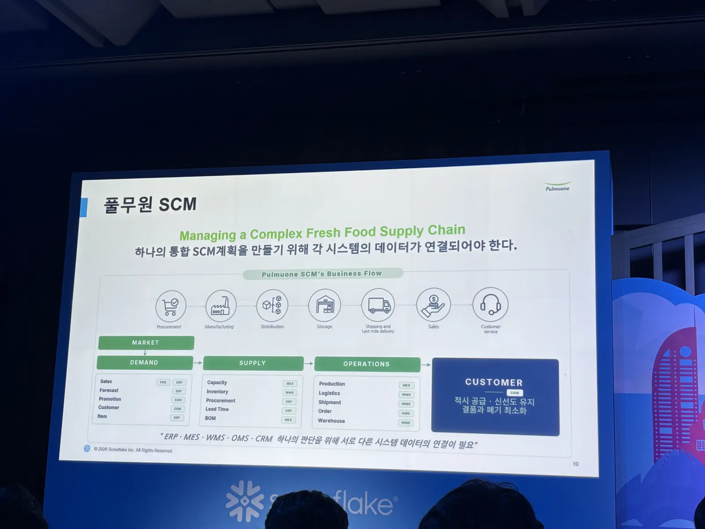

**슬라이드** (부제: `하나의 통합 SCM계획을 만들기 위해 각 시스템의 데이터가 연결되어야 한다.`)

```text
Pulmuone SCM's Business Flow
 Procurement → Manufacturing → Distribution → Storage
 → Shipping and Last-mile delivery → Sales → Customer service

MARKET
  DEMAND              SUPPLY                 OPERATIONS            CUSTOMER
   Sales      POS ERP  Capacity      MES      Production    MES     적시 공급
   Forecast   ERP      Inventory     WMS      Logistics     WMS     신선도 유지
   Promotion  CRM      Procurement   ERP      Shipment      WMS     결품과 폐기
   Customer   CRM      Lead Time     ERP      Order         OMS     최소화
   Item       ERP      BOM           MES      Warehouse     WMS
```

하단에 인용부호로 한 줄이 박혀 있다.

```text
"ERP · MES · WMS · OMS · CRM  하나의 판단을 위해 서로 다른 시스템 데이터의 연결이 필요"
```

**발표자**

> 「**SCM 하면 생소하신 분들도 있을 거예요.** 근데 SCM 은 **제품이 생산되고 고객에게
> 전달되기까지 전 과정**을 포함합니다.」
>
> 「그런데 이 전체 과정에서 **의사결정 하나를 만들기 위해서는 굉장히 많은 데이터가
> 필요합니다.** 수요 쪽에서는 **매출, 포캐스트, 프로모션** 같은 데이터, 공급 쪽에서는
> **캐패시티, 인벤토리, 프로큐어먼트**와 같은 데이터가 필요하고요. 실제로 운영할 때는
> **프로덕션, 로지스틱스, 시프먼트** 이런 여러 가지 데이터를 **한 번에 봐야** 합니다.」
>
> 「각 단계별로 의사결정이 올바르게 이루어져야 고객들에게 우리 물건을 **신선도를 유지해서
> 적시에 공급**할 수 있고, 또 **결품과 폐기를 최소화**할 수 있습니다.」

## 02 · 풀무원 SCM의 고민 — From Disconnected Data to Connected Decision

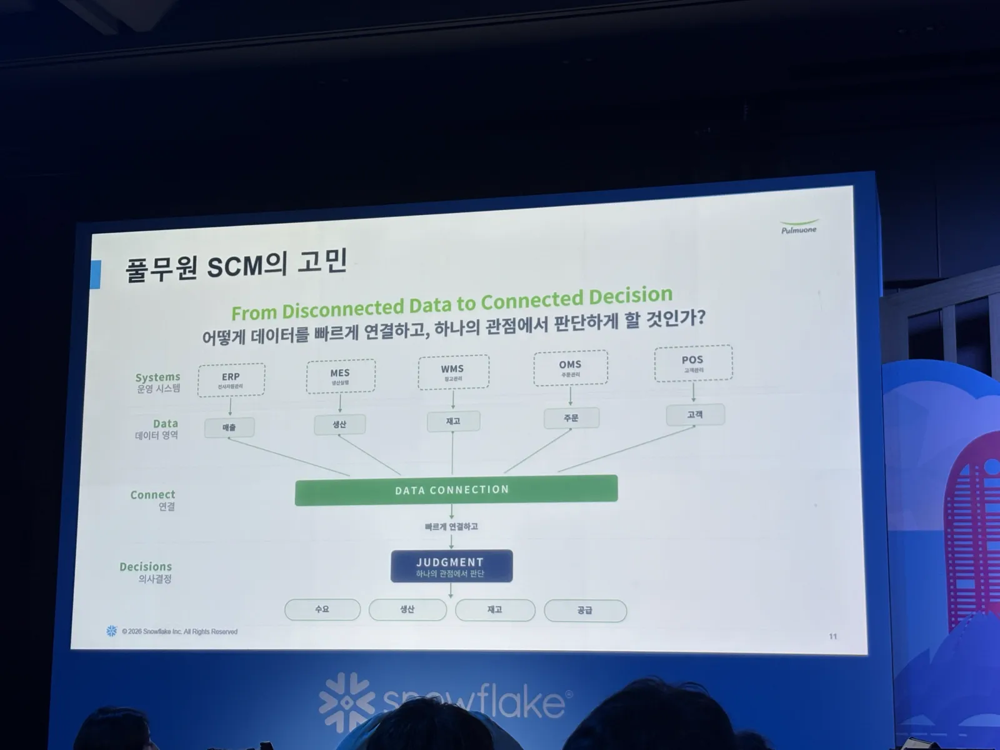

**슬라이드** (부제: `어떻게 데이터를 빠르게 연결하고, 하나의 관점에서 판단하게 할 것인가?`)

왼쪽에 층 이름이 붙어 있다.

```text
Systems   운영 시스템   ERP(전사자원관리)  MES(생산실행)  WMS(창고관리)  OMS(주문관리)  POS(고객관리)
Data      데이터 영역   매출              생산           재고           주문           고객
                                    ↓ 전부 모여
Connect   연결         [ DATA CONNECTION ]
                                    ↓ 빠르게 연결하고
Decisions 의사결정     [ JUDGMENT — 하나의 관점에서 판단 ]
                                    ↓
                        수요    생산    재고    공급
```

**발표자**

> 「결국 하나의 이런 **SCM 계획을 만들고 실행하기 위해서는 각 시스템의 데이터가 연결되어
> 있어야** 하는데요. **여기서 이제 저희 고민이 시작됐습니다.**」
>
> 「저희가 가진 고민은 두 가지였어요. 첫 번째는 **흩어져 있는 데이터를 빠르게 연결하고 하나의
> 관점에서 어떻게 판단할 것인가.**」

도입 배경도 여기서 말했다(해당 슬라이드 없음).

> 「그래서 당시에는 데이터를 **오라클**이었는데요. 오라클에서 **가져오는 것도 굉장히 힘들고
> 느리고, 시스템마다 고객·품목 이런 기준도 다 달랐습니다.** 그래서 여러 데이터 플랫폼을
> 검토를 했고요. 그래서 저희가 이런 여러 가지 문제를 해결하고 앞으로 나아가기 위해서
> **Snowflake 를 도입**하게 되었습니다.」

## 03 · 풀무원 SCM의 DX 전략 — All-in-one platform

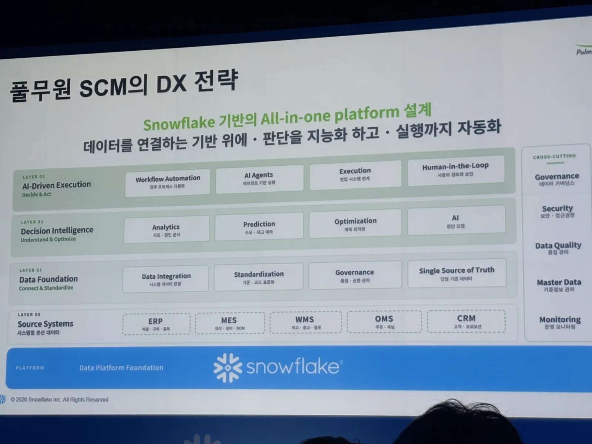

**슬라이드** (부제: `데이터를 연결하는 기반 위에 · 판단을 지능화 하고 · 실행까지 자동화`)

```text
LAYER 03  AI-Driven Execution      Workflow Automation  AI Agents   Execution        Human-in-the-Loop
          Decide & Act             업무 프로세스 자동화   에이전트 기반 실행  현업 시스템 연계  사람의 검토와 승인

LAYER 02  Decision Intelligence    Analytics   Prediction   Optimization  AI
          Understand & Optimize    지표·원인 분석  수요·재고 예측  계획 최적화     판단 모델

LAYER 01  Data Foundation          Data Integration  Standardization  Governance   Single Source of Truth
          Connect & Standardize    시스템 데이터 연결  기준·코드 표준화   품질·권한 관리  단일 기준 데이터

LAYER 00  Source Systems           ERP    MES    WMS    OMS    CRM
          시스템별 분산 데이터

CROSS-CUTTING : Governance · Security · Data Quality · Master Data · Monitoring
PLATFORM      : Data Platform Foundation — snowflake
```

**발표자**

> 「저희는 이런 데이터 문제나 저희가 생각한 데이터 전략 등이 **단순히 데이터를 한 곳으로
> 모으는 문제로 보지는 않았습니다. 데이터를 잘 모으고 실질적으로 활용해야 된다.** 이 부분이
> 가장 중요하다고 생각을 했습니다.」

3단계를 이렇게 설명했다.

> 「첫 번째는 **데이터 파운데이션**입니다. 데이터를 **연결하고 표준화**해서 모두가 같은
> 데이터 기반을 공유하는 겁니다.」
>
> 「두 번째는 그 위에 **디시전 인텔리전스**를 얹어서 **판단을 지능화**하는 단계입니다. 여기서는
> 데이터 파운데이션 위에서 **분석을 하고 예측하고 최적화**하는 단계입니다.」
>
> 「마지막은 **AI 드리븐 익스큐션**인데요. **워크플로우를 자동화**하거나 사람과 AI, 시스템을
> **실제 업무 프로세스까지 연결**하는 단계입니다.」

이 슬라이드의 결론.

> 「결국에는 저희가 만들고 싶었던 것은 단순히 데이터 플랫폼이 아니라 **데이터에서 디시전으로,
> 또 디시전에서 액션까지 하는 하나의 구조**였습니다.」

Snowflake 를 고른 이유도 붙였다.

> 「저희가 초기에 했을 때는 사실 **DW·데이터 레이크 기능이 강했는데**, 그 이후에 **강력한 AI
> 기능으로 확장되면서 완벽한 플랫폼이 Snowflake 가 되었습니다.**」

## 04 · TWO PROBLEMS — Fragmented Data + Human-Driven Decisions

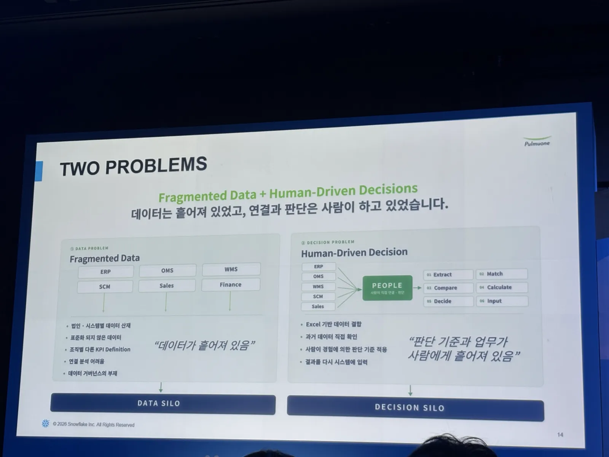

**슬라이드** (부제: `데이터는 흩어져 있었고, 연결과 판단은 사람이 하고 있었습니다.`)

```text
① DATA PROBLEM  Fragmented Data          ② DECISION PROBLEM  Human-Driven Decision

  ERP   OMS   WMS                          ERP ┐
  SCM   Sales Finance                      OMS │              01 Extract   02 Match
                                           WMS ├→ PEOPLE →    03 Compare   04 Calculate
 · 법인·시스템별 데이터 산재                 SCM │  사람이 직접   05 Decide    06 Input
 · 표준화 되지 않은 데이터                   Sales┘  연결·판단
 · 조직별 다른 KPI Definition
 · 연결 분석 어려움                        · Excel 기반 데이터 결합
 · 데이터 거버넌스의 부재                   · 과거 데이터 직접 확인
                                          · 사람이 경험에 의한 판단 기준 적용
   "데이터가 흩어져 있음"                   · 결과를 다시 시스템에 입력

                                            "판단 기준과 업무가 사람에게 흩어져 있음"

   [ DATA SILO ]                             [ DECISION SILO ]
```

**발표자**

> 「실제로 저희가 데이터를 연결하려고 하다 보니 『우리 문제가 무엇일까?』 문제를 정리를
> 해보았습니다. 그래서 여기도 크게 두 가지였는데,」
>
> 「첫 번째는 **데이터 사일로.** **법인과 시스템별로 데이터가 굉장히 많이 흩어져 있었고요.
> KPI 기준과 같은 의사결정을 해야 되는 기준도 서로 달랐습니다.** 그래서 데이터를 연결해서
> 분석하는 것 자체가 쉽지 않았습니다.」
>
> 「그리고 두 번째는 **디시전 사일로**입니다. 데이터를 가져온 이후에도 **사람이 엑셀로 데이터를
> 맞추고 과거 실적을 비교하고, 그다음에 경험과 업무를 기준으로 적용해서 판단을 한 다음에
> 그걸 다시 시스템에 입력**되는 비효율적인 프로세스가 발생을 하고 있었고요.」
>
> 「결국 **데이터는 시스템에 흩어져 있었고, 판단 기준과 업무가 사람에게 모두 흩어져
> 있었습니다.**」

## 05 · SOLUTION 1: DATA SILO — Snowflake Based Data Foundation

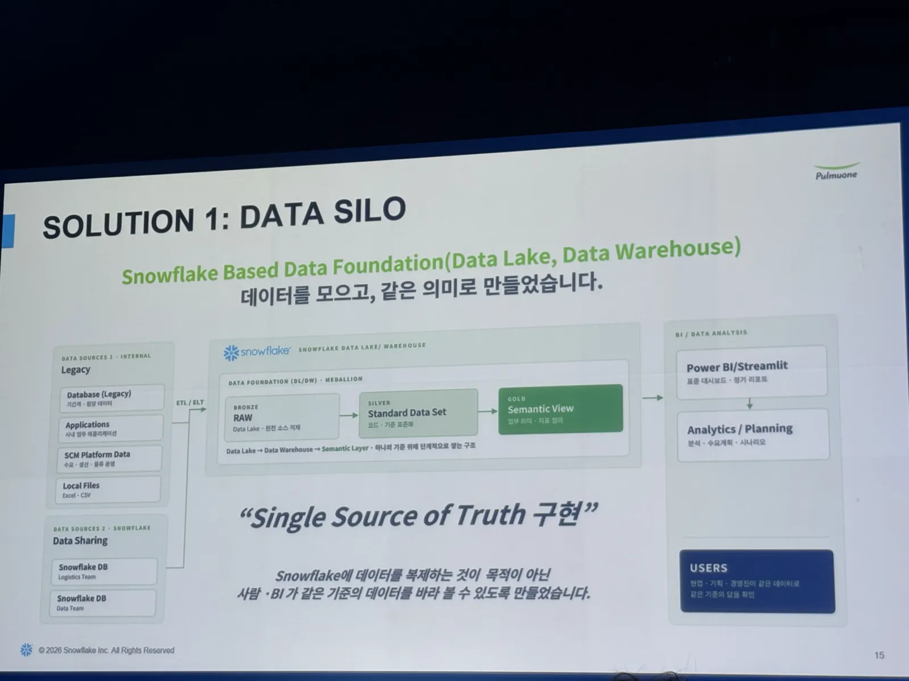

**슬라이드** (부제: `데이터를 모으고, 같은 의미로 만들었습니다.`)

```text
DATA SOURCES 1 · INTERNAL          SNOWFLAKE DATA LAKE / WAREHOUSE
 Legacy                             DATA FOUNDATION (DL/DW) · MEDALLION
  Database (Legacy)  기간계·원장      BRONZE          SILVER              GOLD
  Applications       사내 업무 앱      RAW        →    Standard Data Set →  Semantic View
  SCM Platform Data  수요·생산·물류    Data Lake       코드·기준 표준화       업무 의미·지표 정의
  Local Files        Excel · CSV      원천 소스 적재
                            ETL/ELT
DATA SOURCES 2 · SNOWFLAKE         "Data Lake → Data Warehouse → Semantic Layer
 Data Sharing                        하나의 기준 위에 단계적으로 쌓는 구조"
  Snowflake DB  물류 · Logistics Team
  Snowflake DB  데이터 · Data Team    BI / DATA ANALYSIS
                                      Power BI/Streamlit  표준 대시보드 · 정기 리포트
                                      Analytics / Planning 분석 · 수요계획 · 시나리오
                                      USERS  현업·기획·경영진이 같은 데이터로 같은 기준의 답을 확인
```

가운데 아래에 큰 인용문이 박혀 있다.

```text
"Single Source of Truth 구현"
Snowflake에 데이터를 복제하는 것이 목적이 아닌
사람 · BI 가 같은 기준의 데이터를 바라 볼 수 있도록 만들었습니다.
```

**발표자**

> 「저희가 가장 먼저 한 일은 **단순히 여러 시스템의 데이터를 Snowflake 로 가져오는 것이
> 아니라** — 레거시 DB, 사내 애플리케이션, SCM 플랫폼, 엑셀 같은 내부 데이터, 그리고
> Snowflake 에는 **강력한 쉐어링 기능**이 있는데요. **저희 회사에서 타 팀에서 사용하고 있는
> Snowflake DB 에서 프라이빗 쉐어링을 받아서** 데이터를 연결했습니다.」
>
> 「그리고 이 데이터를 **메달리온 아키텍처** 기반으로 브론즈, 실버, 골드 레이어 구조로
> **단계적으로 정리**를 했습니다. **브론즈는 그대로 보관**하고, **실버에서는 고객·품목 코드와
> 기준을 표준화**했고요. **골드 레이어에서는 실제 업무에서 사용하는 의미와 KPI 를 시맨틱 뷰
> 형태로 정의**를 했습니다.」
>
> 「여기서 저희가 중요하게 본 것은, **Snowflake 안의 데이터를 복제하는 것이 아니라 — 사람이
> 보든, BI 가 보든, AI 가 보든 모두가 같은 기준의 데이터를 사용하게 만드는 것.** 즉 **Single
> Source of Truth 를 구현**하는 것을 목표로 했습니다.」

## 06 · SOLUTION 1 결과 — BEFORE / AFTER

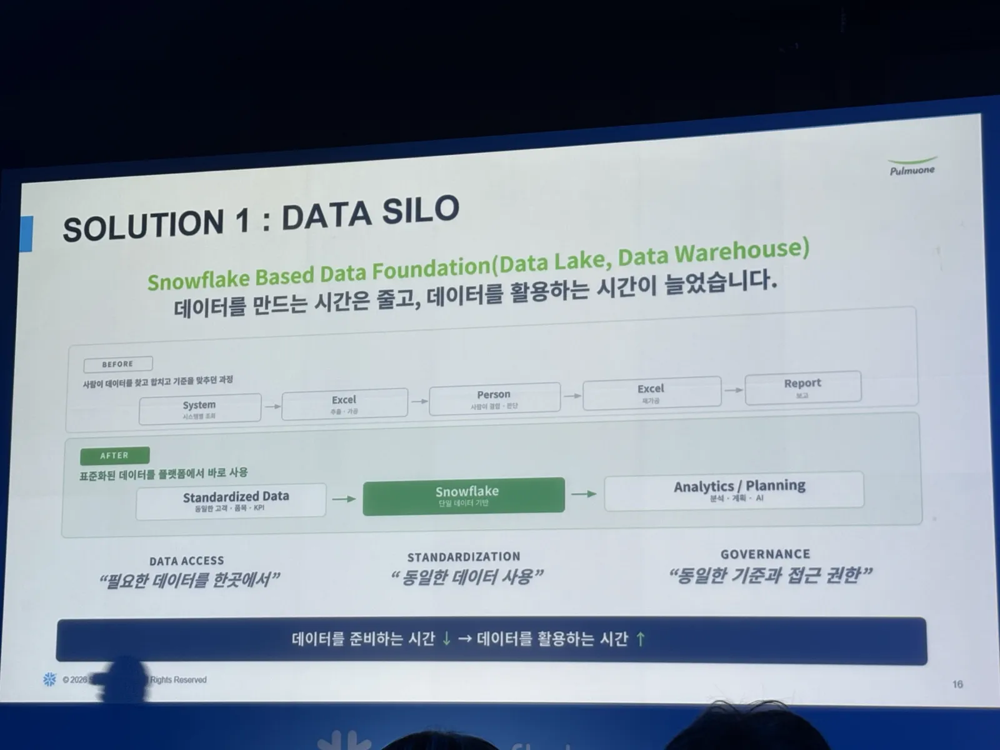

> `07-solution1-before-after-b.webp` 는 같은 슬라이드를 다시 찍은 것이다. 위에 붙인 `06` 이
> 더 선명하다.

**슬라이드** (부제: `데이터를 만드는 시간은 줄고, 데이터를 활용하는 시간이 늘었습니다.`)

```text
BEFORE  사람이 데이터를 찾고 합치고 기준을 맞추던 과정
  System      →  Excel     →  Person        →  Excel   →  Report
  시스템별 조회     추출·가공      사람이 결합·판단     재가공        보고

AFTER   표준화된 데이터를 플랫폼에서 바로 사용
  Standardized Data  →  Snowflake      →  Analytics / Planning
  동일한 고객·품목·KPI     단일 데이터 기반      분석 · 계획 · AI

  DATA ACCESS            STANDARDIZATION       GOVERNANCE
  "필요한 데이터를 한곳에서"  "동일한 데이터 사용"    "동일한 기준과 접근 권한"

       [ 데이터를 준비하는 시간 ↓  →  데이터를 활용하는 시간 ↑ ]
```

**발표자**

> 「그 결과, Single Source of Truth 를 구현하고 나니 **데이터 활용 방식은 굉장히 많이
> 바뀌었습니다.** 예전에는 시스템에서 담당자들이 각각 데이터를 찾고 엑셀로 가공하고 다시
> 결합해서 리포트를 만들어야 했습니다.」
>
> 「이제는 **표준화된 데이터, 강력한 거버넌스를 가지고 Snowflake 에서 바로 사용**할 수 있게
> 되었습니다. 필요한 데이터를 한 곳에서 동일한 데이터를 사용하기 때문에, **데이터를 찾는
> 시간은 굉장히 줄었고요. 오히려 데이터를 활용하는 시간이 증가했습니다.**」

## 08 · STILL WE HAVE PROBLEM — 데이터는 연결되었지만 업무는 줄지 않았다

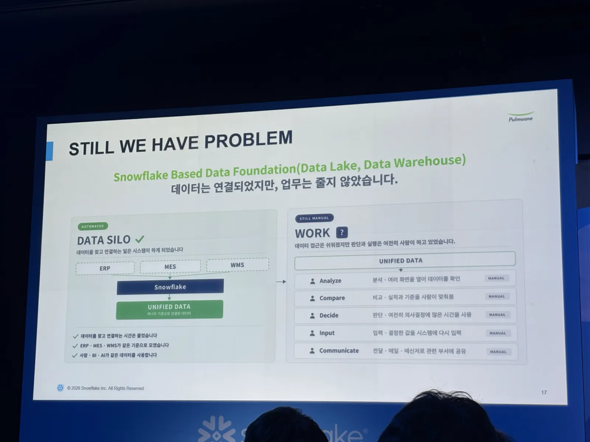

**슬라이드** (부제: `데이터는 연결되었지만, 업무는 줄지 않았습니다.`)

```text
AUTOMATED                              STILL MANUAL
DATA SILO ✓                            WORK ?
데이터를 찾고 연결하는 일은               데이터 접근은 쉬워졌지만
시스템이 하게 되었습니다                  판단과 실행은 여전히 사람이 하고 있었습니다

  ERP    MES    WMS                     [ UNIFIED DATA ]
     ↓ Snowflake                         Analyze      분석 · 여러 화면을 열어 데이터를 확인   MANUAL
  [ UNIFIED DATA ]                       Compare      비교 · 실적과 기준을 사람이 맞춰봄      MANUAL
  하나의 기준으로 연결된 데이터              Decide       판단 · 여전히 의사결정에 많은 시간을 사용 MANUAL
                                         Input        입력 · 결정한 값을 시스템에 다시 입력    MANUAL
 ✓ 데이터를 찾고 연결하는 시간은 줄었습니다   Communicate  전달 · 메일·메신저로 관련 부서에 공유   MANUAL
 ✓ ERP·MES·WMS가 같은 기준으로 모였습니다
 ✓ 사람·BI·AI가 같은 데이터를 사용합니다
```

**발표자**

> 「근데 여기까지도 『아, 이제 데이터를 많이 활용하니까 업무가 줄겠구나』라고 생각을 했는데요.
> **실제로 그렇지 않았습니다.**」
>
> 「**데이터 접근은 확실히 쉬워졌습니다.** 사람, BI, AI 가 같은 데이터를 사용할 수 있게
> 되었죠. **근데 업무만큼은 생각만큼 줄지 않았습니다.**」
>
> 「사람들은 **여전히 데이터를 보고 분석을 하고**, 기존에 있는 데이터를 분석하고, **실적과
> 기준을 비교하고, 메일이나 메신저로 다른 사람에게 그 결과를 전달**을 하고 있었습니다.」
>
> 「즉, **데이터는 자동화했지만 우리 업무는 자동화되지 않았습니다.**」

그래서 다음 단계의 초점을 옮겼다.

> 「데이터는 잘 모아서 해결했으니, 이제 저희는 **사람이 하고 있는 판단과 실행 자체를 어떻게
> 바꿀 것인가**에 집중을 하게 되었습니다.」

## 09 · SOLUTION 2: DECISION SILO — Single Source of Judgement

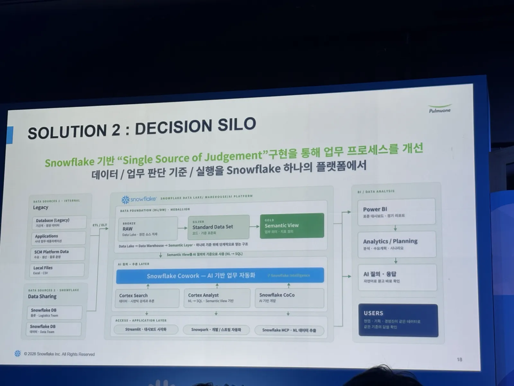

**슬라이드** (부제: `데이터 / 업무 판단 기준 / 실행을 Snowflake 하나의 플랫폼에서`)

05번 아키텍처가 그대로 있고 그 아래에 두 층이 새로 얹혔다.

```text
[ 05번과 동일 : BRONZE → SILVER → GOLD Semantic View ]
        ↓ Semantic View를 AI 질의의 기준으로 사용 (NL → SQL)

AI 필터 · 추론 LAYER
 [ Snowflake Cowork — AI 기반 업무 자동화 ]        ⁄ Snowflake Intelligence
    Cortex Search        Cortex Analyst          Snowflake CoCo
    데이터·시맨틱 검색과 추론  NL → SQL·Semantic View 기반  AI 기반 개발

ACCESS · APPLICATION LAYER
    Streamlit · 대시보드 시각화   Snowpark · 개발/스트림 자동화   Snowflake MCP · NL 데이터 추출

BI / DATA ANALYSIS 에 항목 하나 추가
    AI 질의 · 응답   자연어로 묻고 바로 확인
```

**발표자**

> 「그래서 저희는 다음 단계에서 조금 목표를 바꿨는데요. **데이터를 하나로 모아 Single Source
> of Truth 를 만들었다면, 이제는 사람이 하는 판단과 기준까지 플랫폼 위로 가져오자**라는
> 것이었습니다. 그래서 저희는 이거를 **Single Source of Judgement** 로 정의를 했습니다.」
>
> 「기존에 만들어둔 데이터 레이크, 데이터 웨어하우스, 시맨틱 뷰 위에서 **Snowflake 의 AI
> 기능을 얹었습니다.** 서치는 필요한 데이터와 문맥을 찾는 역할을 하게 되고요. 이런 기능을
> **Streamlit 이나 Snowpark 와 같은 애플리케이션 레이어와 연결해서 실제 업무로 이어지게**
> 했습니다. 또 **Snowflake CoCo 를 이용해서 빠르게 개발**을 진행을 했습니다.」

이 슬라이드의 핵심.

> 「여기서 중요한 점은, **AI 를 별도의 시스템으로 구축한 게 아니라는** 겁니다. **이미
> 표준화돼 있는 같은 데이터, 같은 KPI, 같은 업무의 의미 위에서** AI 가 분석하든 판단을 하든
> **동일하게 판단을 할 수 있게** 만들었습니다.」
>
> 「데이터는 이미 Snowflake 에 모여 있었고, **AI 를 데이터가 있는 곳으로 가져왔습니다.**」
>
> 「그래서 **데이터, 업무 기준, 실행을 Snowflake 하나의 플랫폼에서** 할 수 있게 되었습니다.」

## 10 · USE CASE — 수요계획 확정 프로세스(Sold Notice), 12단계

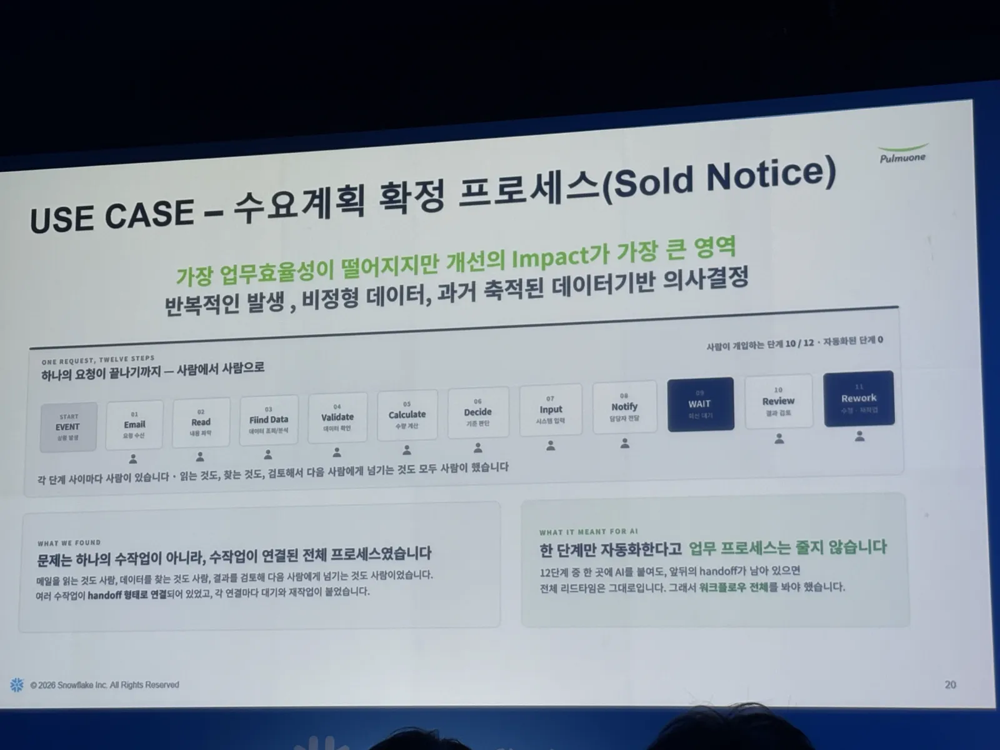

**슬라이드** (부제: `가장 업무효율성이 떨어지지만 개선의 Impact가 가장 큰 영역 / 반복적인 발생, 비정형 데이터, 과거 축적된 데이터기반 의사결정`)

```text
ONE REQUEST, TWELVE STEPS — 하나의 요청이 끝나기까지, 사람에서 사람으로
                                        사람이 개입하는 단계 10 / 12 · 자동화된 단계 0

START  01     02     03          04        05         06      07      08      09    10      11
EVENT  Email  Read   Find Data   Validate  Calculate  Decide  Input   Notify  WAIT  Review  Rework
상황 발생 요청 수신 내용 파악 데이터 조회/분석 데이터 확인  수량 계산   기준 판단 시스템 입력 담당자 전달 회신 대기 결과 검토 수정·재작업
        👤     👤      👤          👤        👤         👤      👤      👤      ▪     👤      ▪

각 단계 사이마다 사람이 있습니다 · 읽는 것도, 찾는 것도, 검토해서 다음 사람에게 넘기는 것도 모두 사람이 했습니다

WHAT WE FOUND                              WHAT IT MEANT FOR AI
문제는 하나의 수작업이 아니라,               한 단계만 자동화한다고
수작업이 연결된 전체 프로세스였습니다          업무 프로세스는 줄지 않습니다

메일을 읽는 것도 사람, 데이터를 찾는 것도      12단계 중 한 곳에 AI를 붙여도, 앞뒤의 handoff가
사람, 결과를 검토해 다음 사람에게 넘기는       남아 있으면 전체 리드타임은 그대로입니다.
것도 사람이었습니다. 여러 수작업이            그래서 워크플로우 전체를 봐야 했습니다.
handoff 형태로 연결되어 있었고,
각 연결마다 대기와 재작업이 붙었습니다.
```

`WAIT` 와 `Rework` 두 칸만 짙은 남색으로 칠해져 있다.

**발표자**

먼저 왜 이 업무를 골랐는지.

> 「이 업무를 선택한 이유는 **대부분의 회사에서 많은 분들이 대부분의 시간을 이메일을
> 주고받으면서 업무**를 하고 계실 거라고 생각을 합니다. 그래서 프로세스를 개선했을 때 **가장
> 효과가 돋보이는 영역**이 어디일까 생각하다가, 이메일 기반으로 하는 이 **수요 계획 확정
> 프로세스**를 선택을 했습니다.」

Sold Notice 가 무엇인지.

> 「**솔드 노티스**를 쉽게 말씀드리면 **신제품 출시나 프로모션, 이런 데이터들이 앞으로 발생할
> 판매 계획**인데요. 이거를 **영업에서 SCM 에 전달하는 업무**입니다. 이 정보를 바탕으로
> SCM 에서는 **어떤 고객에게 어떤 제품을 언제부터 얼마나 판매할 것인지**를 확인하고, 이를
> **실제 수요 계획에 반영**을 하게 됩니다.」

그런데 단순하지 않다.

> 「대부분의 정보가 **이메일 혹은 엑셀 파일**로 들어오게 되고요. 내용을 확인한 다음 **과거 판매
> 실적이나 기존 계획 같은 여러 데이터를 다시 찾아서 분석**을 하고, 결국에 계산하고 또
> **사람이 최종 물량을 시스템에 가서 입력**을 해야 됩니다.」
>
> 「그래서 하나의 솔드 노티스를 처리하는 과정을 실제로 저희가 이렇게 펼쳐봤는데요. **메일을
> 받고, 읽고, 데이터를 찾고, 검증하고, 계산하고, 판단하고, 입력하고 다시 검토하는** 식으로,
> 이 **하나의 요청이 끝나기까지 약 12개의 단계**가 있었습니다. 그리고 중요한 건 **이 중
> 대부분의 단계에 사람이 일일이 개입**하고 있었다는 것입니다.」

그리고 문제 정의를 뒤집었다.

> 「저희가 본 문제는 **단순히 메일을 읽는 업무가 수작업이다가 아니라, 여러 수작업이 사람에서
> 사람으로 연결된 워크플로우 자체가 문제다**라고 생각을 했습니다.」
>
> 「그리고 **이 여러 단계 중 하나만 AI 로 자동화를 한다고 하더라도 문제가 해결되지
> 않습니다.** 그래서 저희는 **전체 워크플로우를 다시 설계하는 방향**으로 접근을 했습니다.」

## 11 · USE CASE — 역할 재배분

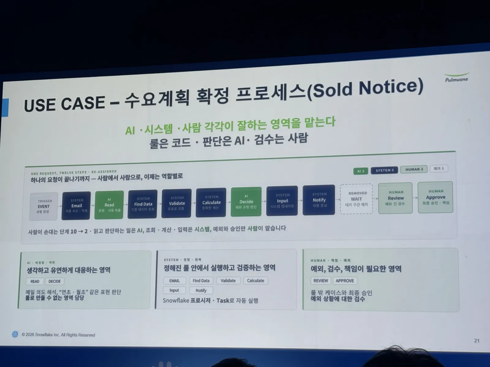

**슬라이드** (부제: `AI · 시스템 · 사람 각각이 잘하는 영역을 맡는다 / 룰은 코드 · 판단은 AI · 검수는 사람`)

```text
ONE REQUEST, TWELVE STEPS · RE-ASSIGNED           AI 2 | SYSTEM 6 | HUMAN 2 | 제거 1
하나의 요청이 끝나기까지 — 사람에서 사람으로, 이제는 역할별로

TRIGGER  SYSTEM  AI    SYSTEM     SYSTEM    SYSTEM     AI      SYSTEM  SYSTEM  REMOVED  HUMAN   HUMAN
EVENT    Email   Read  Find Data  Validate  Calculate  Decide  Input   Notify  WAIT     Review  Approve
상황 발생 자동수신 분류  기준 데이터  유효성 검증 정확한 계산  예외 유형 시스템   자동 통보 대기 구간  예외 건  최종 승인
        ·적재  ·내용  조회                            판단    업데이트         제거     검수     ·책임
              추출

사람이 손대는 단계 10 → 2 · 읽고 판단하는 일은 AI, 조회·계산·입력은 시스템, 예외와 승인만 사람이 맡습니다

AI · 비정형 · 맥락              SYSTEM · 정형 · 반복             HUMAN · 책임 · 예외
생각하고 유연하게 대응하는 영역     정해진 룰 안에서 실행하고 검증하는 영역  예외, 검수, 책임이 필요한 영역
 [READ] [DECIDE]                [EMAIL][Find Data][Validate]    [REVIEW] [APPROVE]
메일 의도 해석, "연초·월초" 같은    [Calculate][Input][Notify]      룰 밖 케이스와 최종 승인
표현 판단                        Snowflake 프로시저 · Task로       예외 상황에 대한 검수
룰로 만들 수 없는 영역 담당         자동 실행
```

**발표자**

> 「저희가 한 것은, 방금 말씀드린 것처럼 **12개 단계를 모두 AI 에게 맡기는 것은 아니었습니다.
> 각 단계의 역할을 다시 나눴습니다.**」
>
> 「**메일처럼 비정형 데이터를 읽고 맥락을 해석하는 것은 AI.** 데이터 조회, 검증, 계산처럼
> **정확한 룰이 필요한 업무는 시스템.** 이 시스템은 **Snowflake 의 프로시저나 태스크**를
> 의미합니다. 그리고 **예외 검토나 최종 승인처럼 책임이 필요한 부분은 사람**이 맡았습니다.」

여기서 숫자를 말했는데 슬라이드와 다르다.

> 「그 결과 사람이 직접 개입하는 단계는 **10개에서 9개로 줄었고요.**」

> ⚠️ **슬라이드는 「사람이 손대는 단계 10 → 2」다.** 배지도 `AI 2 · SYSTEM 6 · HUMAN 2 ·
> 제거 1` 로 사람이 맡는 칸은 `Review` · `Approve` 둘뿐이다. 말과 슬라이드가 어긋난 자리다.

그리고 이 슬라이드의 결론.

> 「핵심은 제가 생각할 땐 이겁니다. **AI 가 모든 일을 하는 것이 아니라 AI 와 시스템, 사람이
> 각자 잘하는 일을 하도록 맡고, 그다음에 그거를 루프로 연결한 일**입니다. 저희는 이것이
> **실제 업무에서의 진정한 에이전틱 AI** 라고 생각을 했습니다.」

## 12 · 수요계획 확정 업무 프로세스 아키텍처

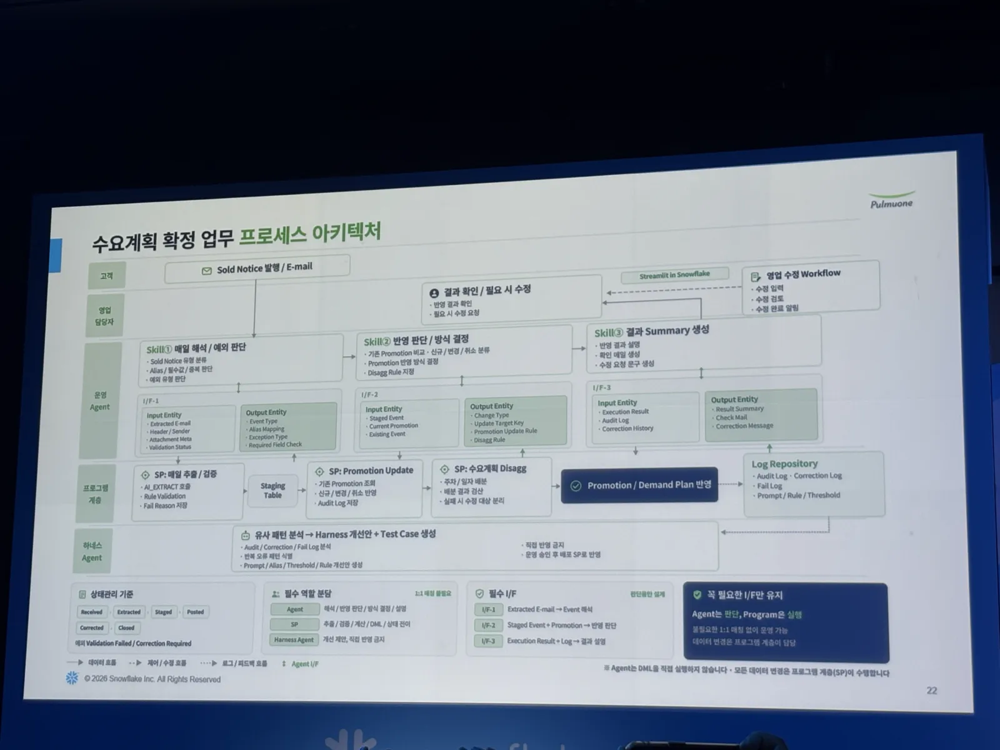

**슬라이드** — 스윔레인 다섯 줄이다.

```text
고객        [ Sold Notice 발행 / E-mail ]
                    ↓
영업 담당자                   [ 결과 확인 / 필요 시 수정 ]  ←── Streamlit in Snowflake ── [ 영업 수정 Workflow ]
                             · 반영 결과 확인                                              · 수정 입력
                             · 필요 시 수정 요청                                           · 수정 검토
                                                                                        · 수정 완료 알림
운영 Agent   Skill① 메일 해석/예외 판단   Skill② 반영 판단/방식 결정      Skill③ 결과 Summary 생성
             · Sold Notice 유형 분류      · 기존 Promotion 비교          · 반영 결과 설명
             · Alias/필수값/중복 판단       · Promotion 반영 방식 결정      · 확인 메일 생성
             · 예외 유형 판단              · Disagg Rule 지정             · 수정 요청 문구 생성

             I/F-1                        I/F-2                         I/F-3
             In: Extracted E-mail         In: Staged Event               In: Execution Result
                 Header/Sender                Current Promotion              Audit Log
                 Attachment Meta              Existing Event                 Correction History
                 Validation Status        Out: Change Type               Out: Result Summary
             Out: Event Type                  Update Target Key              Check Mail
                 Alias Mapping                Promotion Update Rule          Correction Message
                 Exception Type               Disagg Rule
                 Required Field Check

프로그램 계층  SP 메일 추출·검증  →  Staging  →  SP Promotion Update  →  SP 수요계획 Disagg
             · AI_EXTRACT 호출      Table      · 기존 Promotion 조회     · 주차/일자 배분    →  [ Promotion / Demand Plan 반영 ]
             · Rule Validation                · 신규/변경/취소 반영      · 배분 결과 검산
             · Fail Reason 저장                · Audit Log 저장         · 실패 시 수정 대상 분리

하네스 Agent  유사 패턴 분석 → Harness 개선안 + Test Case 생성                  Log Repository
             · Audit/Correction/Fail Log 분석    · 직접 반영 금지              · Audit Log · Correction Log
             · 반복 오류 패턴 식별               · 운영 승인 후 배포 SP로 반영     · Fail Log
             · Prompt/Alias/Threshold/Rule 개선안 생성                        · Prompt/Rule/Threshold

상태관리 기준                     필수 역할 분담  1:1 매칭 불필요    필수 I/F  판단로만 설계    꼭 필요한 I/F만 유지
Received Extracted Staged Posted   Agent      해석/반영 판단/방식 결정/설명   I/F-1  Extracted E-mail → Event 해석
Corrected Closed                   SP         추출/검증/계산/DML/상태 전이   I/F-2  Staged Event + Promotion → 반영 판단
예외: Validation Failed             Harness Agent 개선 제안, 직접 반영 금지   I/F-3  Execution Result + Log → 결과 설명
      Correction Required
                                                          Agent는 판단, Program은 실행
                                                          불필요한 1:1 매칭 없이 운영 가능
                                                          데이터 변경은 프로그램 계층이 담당

※ Agent는 DML을 직접 실행하지 않습니다 · 모든 데이터 변경은 프로그램 계층(SP)이 수행합니다
```

**발표자**

> 「앞에서 말씀드린 구조를 실제 적용한 아키텍처입니다. **솔드 노티스가 들어오면 에이전트가
> 메일을 읽고 내용을 해석합니다.** 그다음 **기존 데이터와 비교해서 어떻게 반영할지 판단**을
> 하게 됩니다.」
>
> 「다만 저희에게 **중요한 원칙이 하나**가 있는데요. **에이전트가 직접 데이터를 변경하지는
> 않습니다. 에이전트는 판단을 하고, 실제 검증, 계산, 데이터 변경은 스토어드 프로시저 같은
> 프로그램이 담당**을 합니다.」
>
> 「그리고 **실행 결과와 수정 이력, 실패 로그는 다시 저장**돼서, 이 로그를 분석해서 **반복되는
> 오류나 패턴을 찾고 이제 프롬프트나 룰 개선안을 다시 만들게** 됩니다.」

그리고 이름을 붙였다.

> 「결론적으로 보면 **판단하고, 실행하고, 검토하고, 개선하고 다시 실행하는 것 — 이 반복적인
> 구조가 저희가 이야기하는 루프 엔지니어링**입니다.」

> 이 슬라이드는 약 1분 만에 지나갔다. **상태관리 6단계와 예외 2종, I/F-1~3 의 Entity 정의,
> 하네스 Agent 의 「직접 반영 금지」 게이트는 말로 설명하지 않았고 슬라이드에만 있다.**

## 13 · 수요계획 확정 업무 샘플 예시

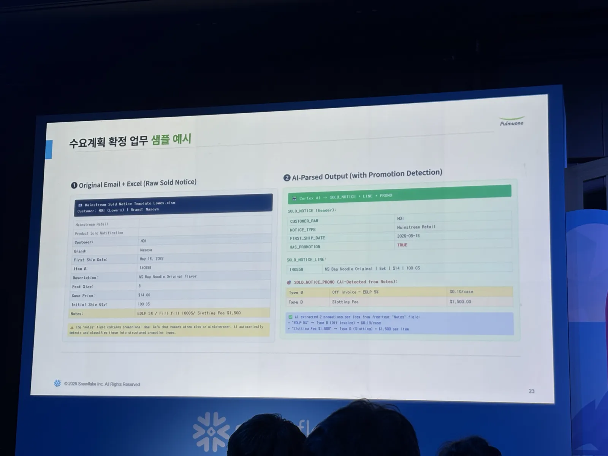

**슬라이드**

```text
① Original Email + Excel (Raw Sold Notice)      ② AI-Parsed Output (with Promotion Detection)

Mainstream Sold Notice Template Lowes.xlsm       Cortex AI → SOLD_NOTICE · LINE · PROMO
Customer: MDI (Lowe's) | Brand: Nasoya
                                                 SOLD_NOTICE (Header)
 Customer:          MDI                            CUSTOMER_RAW      MDI
 Brand:             Nasoya                         NOTICE_TYPE       Mainstream Retail
 First Ship Date:   May 16, 2026                   FIRST_SHIP_DATE   2026-05-16
 Item #:            140558                         HAS_PROMOTION     TRUE
 Description:       NS Bag Noodle Original Flavor
 Pack Size:         8                            SOLD_NOTICE_LINE
 Case Price:        $14.00                         140558  NS Bag Noodle Original | 8pk | $14 | 100 CS
 Initial Ship Qty:  100 CS
 Notes:  EDLP 5% / Fill fill 100CS /             SOLD_NOTICE_PROMO (AI-Detected from Notes)
         Slotting Fee $1,500                       Type B  Off Invoice – EDLP 5%   $0.10/case
                                                   Type D  Slotting Fee            $1,500.00
⚠ The "Notes" field contains promotional deal
  info that humans often miss or misinterpret.    ✓ AI extracted 2 promotions per item from
  AI automatically detects and classifies these     free-text "Notes" field:
  into structured promotion types.                  · "EDLP 5%" → Type B (Off Invoice) = $0.10/case
                                                    · "Slotting Fee $1,500" → Type D (Slotting) = $1,500 per item
```

`Notes` 행만 노란색으로 강조되어 있다.

**발표자**

> 「이거는 저희가 실제 **백단에서 수요계획 확정 업무 샘플 예시**인데요. 이렇게 **로우 데이터**가
> 왼쪽에 보시는 것처럼 들어오게 되고요. 여기서 일반적인 **커스터머, 브랜드, 데이트** 이런
> 것들이 다 들어오는데 — **가장 중요한 거는 노트에 있는 내용**입니다.」
>
> 「**기존에 있는 프로시저나 이런 걸로는 이 노트의 내용을 100% 탐지를 할 수가 없습니다.**
> 여기 노트에 들어온 내용은 **프로모션이나 특별한 예외적인 사항**이 들어가게 되는데요.」
>
> 「저희가 실제로 요 프로모션 내용을 저희 시스템에 있는 **5개의 카테고리**가 있는데,
> **프로모션의 카테고리 5개에 맞춰서 자동으로 분류**를 해주게 됩니다.」
>
> 「이 카테고리를 분류하는 것뿐만 아니라 **과거 데이터나 품목의 히스토리를 분석해서 자동으로
> 이 솔드 노티스에 맞는 볼륨 플랜까지 생성**을 해줍니다.」

## 14 · 자동 Email 전송 샘플

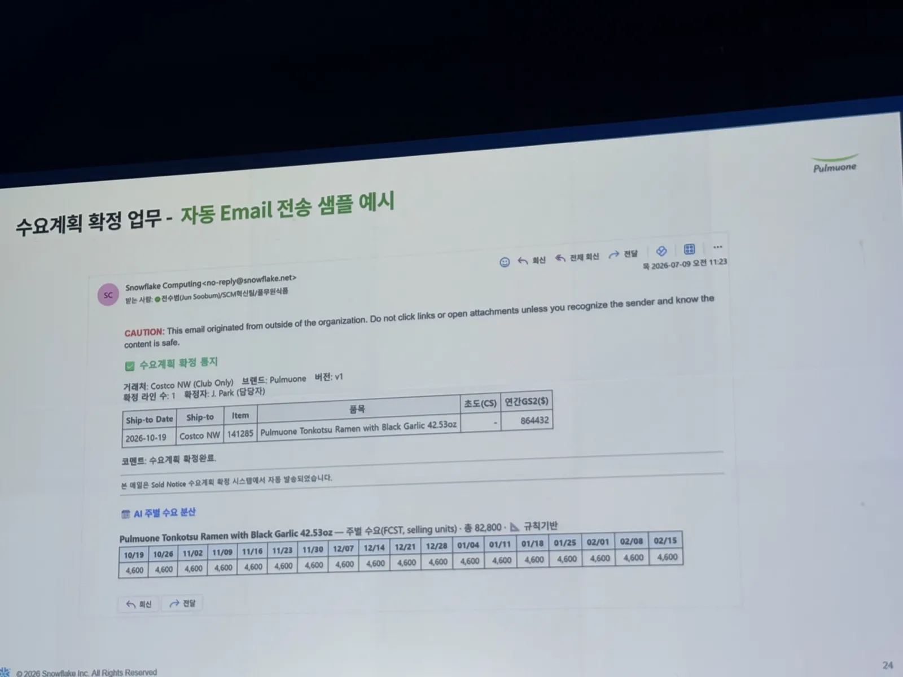

**슬라이드** — Outlook 메일 화면이다.

```text
Snowflake Computing <no-reply@snowflake.net>              목 2026-07-09 오전 11:23
받는 사람: (풀무원식품 SCM혁신팀 담당자)

CAUTION: This email originated from outside of the organization. …

✅ 수요계획 확정 통지
 거래처: Costco NW (Club Only)    브랜드: Pulmuone    버전: v1
 확정 라인 수: 1                  확정자: J. Park (담당자)

 Ship-to Date  Ship-to     Item     품목                                        초도(CS)  연간GS2($)
 2026-10-19    Costco NW   141285   Pulmuone Tonkotsu Ramen with Black Garlic     -       864432
                                    42.53oz

 코멘트: 수요계획 확정완료.
 본 메일은 Sold Notice 수요계획 확정 시스템에서 자동 발송되었습니다.

📅 AI 주별 수요 분산
 Pulmuone Tonkotsu Ramen with Black Garlic 42.53oz — 주별 수요(FCST, selling units) · 총 82,800 · 규칙기반
 10/19  10/26  11/02  11/09  11/16  11/23  11/30  12/07  12/14  12/21  12/28  01/04 …  02/15
 4,600  4,600  4,600  4,600  4,600  4,600  4,600  4,600  4,600  4,600  4,600  4,600    4,600
```

**발표자**

> 「그래서 이런 볼륨 플랜을 실질적으로 담당자들이 이메일을 받고 — **Snowflake 에서 이메일을
> 보낼 수 있어서** — 이메일을 받고 이게 **자동으로 시스템에 들어와서 수요 계획이 자동화되는**
> 겁니다.」

> 이 슬라이드는 **거래처·브랜드·품목번호·금액이 가려지지 않고 그대로** 나왔다. 데모용
> 샘플로 보이나 발표에서 그렇다고 밝히지는 않았다.

## 15 · 맺음말

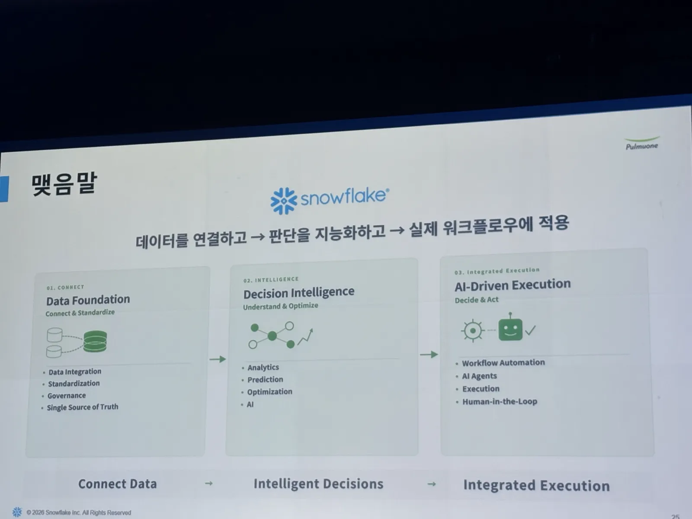

**슬라이드**

```text
데이터를 연결하고 → 판단을 지능화하고 → 실제 워크플로우에 적용

01. CONNECT              02. INTELLIGENCE            03. Integrated Execution
Data Foundation          Decision Intelligence       AI-Driven Execution
Connect & Standardize    Understand & Optimize       Decide & Act

· Data Integration       · Analytics                 · Workflow Automation
· Standardization        · Prediction                · AI Agents
· Governance             · Optimization              · Execution
· Single Source of Truth · AI                        · Human-in-the-Loop

  Connect Data      →    Intelligent Decisions   →   Integrated Execution
```

**발표자**

> 「종합해보면 저희는 사실 **데이터를 연결하고 판단을 지능화하고 실제 업무 실행까지
> 연결시켰습니다.** 그래서 그 과정을 **계속 학습하고 개선하는 루프**로 만들었는데요. 사실
> 이게 오늘 말씀드리고 싶었던 **루프 엔지니어링 기반 에이전틱 AI** 입니다.」
>
> 「저희가 생각할 때 **Snowflake 는 데이터를 모으는 플랫폼에서 시작을 했는데요, 이제는
> 데이터, AI, 사람이 함께 일하는 루프로 만드는 플랫폼으로 진화했다**고 생각합니다.」
>
> 「제가 준비한 발표는 여기까지고요. 이상으로 발표를 마치겠습니다. 감사합니다.」

## 세션 마무리 (00:16:30) — 사진 없음

박수 뒤에 사회자가 받았다.

> 「**데이터 레이어부터 시작해 가지고 워크플로우까지 싹 다 건드셨네.** 다시 한번 큰 박수
> 부탁드립니다.」

---

## 재구성하면서 남긴 것

**말과 슬라이드가 어긋난 자리 (11번)** — 발표자는 사람 개입 단계가 「**10개에서 9개로**」
줄었다고 말했으나, 슬라이드는 「**10 → 2**」이고 배지도 `AI 2 · SYSTEM 6 · HUMAN 2 · 제거 1`
이다. 사람이 맡는 칸은 `Review` · `Approve` 둘뿐이다.

**슬라이드에만 있고 말로는 지나간 것 (12번)** — 아키텍처 슬라이드를 1분 남짓에 넘겼는데
거기 담긴 것이 가장 밀도가 높다.

- 상태관리 `Received / Extracted / Staged / Posted / Corrected / Closed` + 예외
  `Validation Failed` · `Correction Required`
- I/F-1~3 의 Input/Output Entity 정의와 「꼭 필요한 I/F 만 유지 · 불필요한 1:1 매칭 없이 운영 가능」
- 하네스 Agent 의 **「직접 반영 금지 · 운영 승인 후 배포 SP 로 반영」** 게이트
- 「Agent 는 DML 을 직접 실행하지 않습니다」라는 각주

**가리지 않은 것** — 13·14번 샘플 슬라이드에 거래처(MDI/Lowe's, Costco NW), 브랜드(Nasoya,
Pulmuone), 품목번호(140558, 141285), 단가($14.00), Slotting Fee($1,500), 연간 금액(864,432),
확정자 이름이 **그대로 나왔다.** 데모용 샘플로 보이나 발표에서 밝히지 않았다.

**녹취 앞부분 결손** — 자기소개와 발표 제목이 잘려 **발표자 이름을 알 수 없다.** 14번 자동
메일 샘플의 수신자가 풀무원식품 SCM혁신팀 소속으로 찍혀 있으나 발표자와 동일인인지 확인
불가다.

**중복 촬영** — `07-solution1-before-after-b.webp` 는 `06` 과 같은 슬라이드다.

**사진이 없는 구간** — 도입(풀무원·SKU 소개), 오라클에서 Snowflake 로 넘어온 배경, 세션 마무리.
녹취만으로 적었다.

**STT 오인식** — 원문은 손대지 않았고 위 인용에서만 바로잡았다.
룩 엔지니어링→루프 엔지니어링 · 메가년 아키텍처→메달리온 · 스노우플레이크 포클→Snowflake CoCo ·
스노우파이크→Snowpark · 경원과 업무→경험과 업무 · 시먼트→시프먼트 · 규직기반→규칙 기반 ·
테스트→Task

---

# 최종 정리 — 데이터를 연결한 뒤, 판단과 실행까지 연결한 사례

이 발표는 AI 기능 하나를 도입한 이야기가 아니다. 풀무원은 먼저 여러 시스템에 흩어진 데이터를
같은 기준으로 만들었고, 그 위에서 사람이 하던 판단과 실행을 AI·시스템·사람에게 다시
배분했다. 발표가 말하는 변화는 **데이터 연결 → 판단 지능화 → 업무 실행**의 세 단계다.

## 사례 1 — 흩어진 SCM 데이터를 하나의 기준으로 만들기

### 문제 — 시스템과 조직마다 데이터의 기준이 달랐다

풀무원은 유통기한이 짧은 신선식품을 다루면서 주요 8개 법인에서 2만 개가 넘는 SKU를 운영한다.
적시에 공급하면서 결품과 폐기를 줄이려면 매출·수요예측·생산·재고·주문·물류 데이터를 함께
봐야 한다. 그러나 데이터는 ERP·MES·WMS·OMS·CRM과 법인별 시스템에 흩어져 있었고,
고객·품목 코드와 KPI 정의도 서로 달랐다.

담당자는 필요한 데이터를 각각 찾아 엑셀로 추출하고, 기준을 맞춰 결합한 뒤 다시 리포트를
만들었다. 데이터가 흩어진 **Data Silo**뿐 아니라, 조직마다 서로 다른 숫자와 기준으로 판단하는
문제가 함께 있었다.

### 만든 개념 — Single Source of Truth

목표는 데이터를 한곳에 복제하는 것이 아니라 **사람·BI·AI가 같은 의미와 기준의 데이터를
사용하게 만드는 것**이었다. 이를 **Single Source of Truth**로 정의하고, 원천부터 업무
의미까지 단계적으로 정리하는 Medallion Architecture를 적용했다.

| 계층 | 담는 것 | 역할 |
| --- | --- | --- |
| Bronze | Legacy DB, 애플리케이션, SCM 플랫폼, Excel·CSV 원본 | 원천 데이터를 가공하지 않고 보관한다 |
| Silver | 표준화된 고객·품목·코드와 공통 기준 | 시스템과 법인마다 다른 기준을 통일한다 |
| Gold | Semantic View와 업무 KPI | 현업·BI·AI가 사용할 업무 의미를 정의한다 |
| 활용 | Power BI, Streamlit, 분석·수요계획 | 같은 데이터와 KPI로 분석하고 계획한다 |

### 적용과 아키텍처

내부 시스템 데이터는 ETL·ELT로 가져오고, 다른 팀이 Snowflake에서 관리하는 데이터는 Private
Sharing으로 연결했다. 이렇게 모은 데이터를 Bronze → Silver → Gold 순서로 정리하고, Gold의
Semantic View를 모든 분석의 공통 기준으로 사용했다.

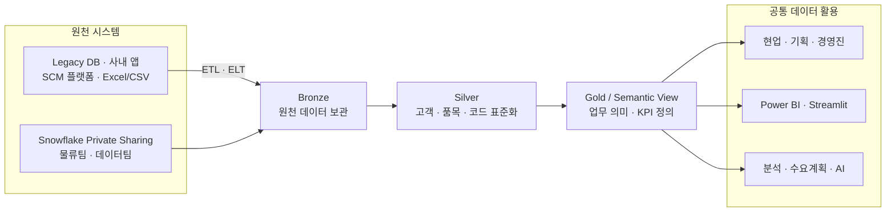
```mermaid
flowchart LR
    subgraph SOURCE[원천 시스템]
        INTERNAL["Legacy DB · 사내 앱<br/>SCM 플랫폼 · Excel/CSV"]
        SHARING["Snowflake Private Sharing<br/>물류팀 · 데이터팀"]
    end

    BRONZE["Bronze<br/>원천 데이터 보관"]
    SILVER["Silver<br/>고객 · 품목 · 코드 표준화"]
    GOLD["Gold / Semantic View<br/>업무 의미 · KPI 정의"]

    subgraph USE[공통 데이터 활용]
        HUMAN[현업 · 기획 · 경영진]
        BI[Power BI · Streamlit]
        ANALYTICS[분석 · 수요계획 · AI]
    end

    INTERNAL -->|ETL · ELT| BRONZE
    SHARING --> BRONZE
    BRONZE --> SILVER --> GOLD
    GOLD --> HUMAN
    GOLD --> BI
    GOLD --> ANALYTICS
```

### 결과

이전에는 시스템 조회 → 엑셀 추출 → 사람의 결합과 판단 → 재가공 → 보고 과정을 반복했다.
이후에는 표준화된 데이터를 Snowflake에서 바로 분석과 계획에 사용할 수 있게 됐다. 발표자는
**데이터를 찾고 준비하는 시간은 줄고, 데이터를 활용하는 시간은 늘었다**고 설명했다.

다만 데이터 접근을 자동화해도 분석·비교·판단·입력·전달은 여전히 사람의 일이었다. 데이터
사일로를 해결한 것이 다음 사례의 출발점이 된 이유다.

## 사례 2 — Sold Notice의 판단과 실행을 하나의 루프로 만들기

### 문제 — 데이터는 연결됐지만 업무는 줄지 않았다

풀무원의 Sold Notice는 신제품 출시나 프로모션으로 생길 판매 계획을 영업이 SCM에 전달하고,
SCM이 수요계획에 반영하는 업무다. 요청은 주로 이메일과 엑셀로 들어왔다. 담당자는 메일을 읽고,
과거 실적과 기존 계획을 찾고, 값을 검증·계산하고, 반영 여부를 판단한 뒤 시스템에 직접
입력하고 다른 담당자에게 결과를 전달했다.

하나의 요청에는 약 12단계가 있었고 그중 10단계에 사람이 개입했다. 문제는 특정 수작업 하나가
아니라 **여러 수작업과 대기·재작업이 handoff로 연결된 전체 워크플로우**였다. 한 단계에만
AI를 붙여도 앞뒤의 수작업이 남기 때문에 전체 리드타임은 줄지 않는다.

### 만든 개념 — Single Source of Judgement와 Loop Engineering

데이터뿐 아니라 업무의 판단 기준도 플랫폼에서 공통으로 사용하도록 **Single Source of
Judgement**를 정의했다. 다만 모든 단계를 AI에 맡기지는 않았다. 각 단계의 성격에 따라 역할을
다시 나눴다.

| 담당 | 잘하는 일 | Sold Notice에서 맡은 일 |
| --- | --- | --- |
| AI | 비정형 정보와 맥락 해석 | 메일 의도·항목 추출, 프로모션 분류, 예외 유형과 반영 방식 판단, 결과 설명 |
| System | 정해진 규칙의 정확하고 반복적인 실행 | 데이터 조회·검증·계산, 수요 배분, 시스템 입력, 알림과 상태 전이 |
| Human | 책임이 필요한 예외 처리와 승인 | 예외 건 검토, 수정, 최종 승인 |

판단 → 실행 → 사람의 검토 → 로그 분석 → 개선 → 다시 실행되는 구조를 **Loop Engineering**이라
불렀다. 핵심은 AI가 모든 일을 대신하는 것이 아니라 AI·System·Human이 잘하는 일을 맡고,
그 결과를 다시 개선에 사용하는 것이다.

### 적용과 아키텍처

AI는 이메일과 첨부 파일에서 맥락을 읽고, 기존 프로모션과 비교해 어떤 방식으로 반영할지
판단하며, 실행 결과를 사람이 이해할 수 있도록 요약한다. 조회·검증·계산과 실제 데이터 변경은
Snowflake Stored Procedure와 Task가 담당한다.

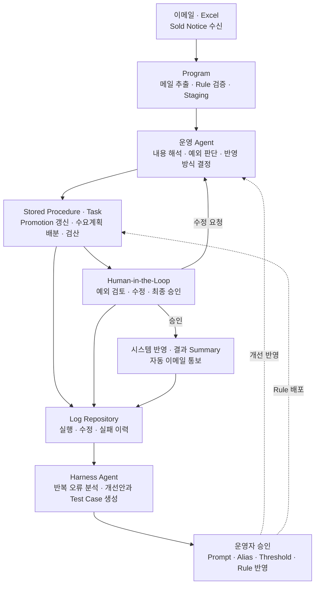
```mermaid
flowchart TB
    INPUT["이메일 · Excel<br/>Sold Notice 수신"]
    EXTRACT["Program<br/>메일 추출 · Rule 검증 · Staging"]
    AGENT["운영 Agent<br/>내용 해석 · 예외 판단 · 반영 방식 결정"]
    EXECUTE["Stored Procedure · Task<br/>Promotion 갱신 · 수요계획 배분 · 검산"]
    REVIEW["Human-in-the-Loop<br/>예외 검토 · 수정 · 최종 승인"]
    RESULT["시스템 반영 · 결과 Summary<br/>자동 이메일 통보"]
    LOG["Log Repository<br/>실행 · 수정 · 실패 이력"]
    HARNESS["Harness Agent<br/>반복 오류 분석 · 개선안과 Test Case 생성"]
    OWNER["운영자 승인<br/>Prompt · Alias · Threshold · Rule 반영"]

    INPUT --> EXTRACT --> AGENT --> EXECUTE
    EXECUTE --> REVIEW
    REVIEW -->|승인| RESULT
    REVIEW -->|수정 요청| AGENT
    EXECUTE --> LOG
    REVIEW --> LOG
    RESULT --> LOG
    LOG --> HARNESS --> OWNER
    OWNER -. 개선 반영 .-> AGENT
    OWNER -. Rule 배포 .-> EXECUTE
```

여기에는 두 가지 안전장치가 있다.

- **Agent는 DML을 직접 실행하지 않는다.** Agent는 판단하고 데이터 변경은 Program 계층이
  수행한다.
- **Harness Agent의 개선안도 직접 운영에 반영하지 않는다.** Test Case와 개선안을 만든 뒤
  운영자의 승인을 거쳐 Prompt나 Rule에 반영한다.

실제 샘플에서는 AI가 Excel의 자유 서술 `Notes`에서 기존 프로시저로 찾기 어려운 프로모션
정보를 읽고, 사내 5개 카테고리에 맞춰 분류했다. 과거 데이터와 품목 이력을 이용해 Volume
Plan을 만들고, 시스템 반영 결과와 주별 수요 배분을 이메일로 자동 통보했다.

### 결과

슬라이드에서는 기존에 사람이 개입하던 10단계를 **AI 2단계·System 6단계·Human 2단계**로
재배분하고 대기 1단계를 제거했다고 설명한다. 사람이 맡는 일은 예외 검토와 최종 승인으로
좁혔다. 이로써 이메일 해석부터 수요계획 반영과 결과 통보까지 하나의 업무 루프로 연결했다.

다만 발표자는 말로는 사람의 개입이 「10개에서 9개로 줄었다」고 했고, 슬라이드는 「10 → 2」로
표시해 서로 어긋난다. 또한 처리 시간, 분류 정확도, 오류율과 같은 정량 성과는 공개하지 않았다.
따라서 발표에서 확실히 확인할 수 있는 결과는 **역할 재설계와 End-to-End 워크플로우의 구현**까지다.

## 두 사례에서 가져갈 경험

1. **Agent보다 먼저 공통 데이터 기반을 만든다.** 고객·품목·KPI가 표준화되지 않으면 AI도
   조직마다 다른 답을 낸다.
2. **자동화의 단위를 작업 하나가 아니라 전체 워크플로우로 본다.** 앞뒤 handoff와 대기가
   남으면 부분 자동화의 효과가 전체 리드타임으로 이어지지 않는다.
3. **AI의 판단과 시스템의 실행을 분리한다.** 비정형 해석은 AI가 맡되, 검증·계산·DML은
   재현 가능한 Program이 수행한다.
4. **사람은 예외와 책임의 지점에 둔다.** Human-in-the-Loop는 모든 단계에 사람을 남기는 것이
   아니라 검수와 승인처럼 책임이 필요한 곳을 명확히 정하는 것이다.
5. **실행 로그를 다음 개선의 입력으로 사용한다.** 실패와 수정 이력을 분석해 개선안을 만들고,
   다시 운영 승인을 거쳐 배포하는 루프가 필요하다.

결국 이 사례가 보여준 것은 데이터 플랫폼을 만든 뒤 AI 기능을 하나 더 붙이는 방식이 아니다.
**같은 데이터 위에서 AI는 판단하고, Program은 실행하고, 사람은 책임을 맡도록 전체 업무를
다시 설계해야 실제 Agentic AI가 된다**는 경험이다.
