# 발표 재구성 — 삼성SDS · 지속 가능한 AX를 위한 전략: 표준·자산·운영 (REAL SUMMIT 2026, 2026-09-08)

발표자: 이태희 부사장 (삼성SDS) · 녹취 29분 18초
원료: 같은 폴더의 [transcript.txt](transcript.txt)(STT 57블록) + [음성 원본 11.bin](../../../../../reference/2026-09-08-real-summit/recordings/11.bin)(WebM/Opus · 약 29분 19초) + 슬라이드 사진 17장 + [행사 안내 이미지](program.png)

공식 제목·발표자·소속·직책은 사용자가 추가 제공한 행사 안내 이미지에서 확인했다. 프로그램상 배정 시간은 10:50–11:20이며 실제 녹음 길이와 구분한다.

사진과 녹취를 대응시켜 발표 순서대로 복원했다. 각 대목은 **사진 → 슬라이드가 보여준 것 → 발표자가 말한 것** 순이다. 시간은 녹취의 상대 시각이며, 사진 촬영 시각을 음성과 동기화한 값이 아니라 해당 내용을 설명하는 발화 범위다. 직접 인용은 STT에서 가져왔다. 불확실한 9개 구간은 원본 음성을 두 로컬 음성 인식 모델로 부분 재전사해 대조했으며, 방법과 결과는 「음성 부분 재전사 대조」에 남겼다.

> **녹취가 “보셨습니까?”로 시작한다.** 앞선 문장과 발표자 소개는 남아 있지 않다. 발표자 이름과 직책은 명찰이나 음성 추정 대신 추가 제공된 행사 안내에서 확인했다. 제품 출시 연도 등 STT 오인식이 의심되는 표현은 미확인으로 남겼다.
>
> **음성은 부분 재전사로 대조했다.** 디코딩 종료 시각은 약 29:18.98로 녹취 종료와 약 1초 차이다. Whisper large-v3-turbo와 large-v3(4bit)로 의심 구간을 재전사했다. 직접 청취를 대신하는 자동 인식 대조이며, 두 모델 모두 문장이 깨지는 구간이 있어 재전사를 정답으로 취급하지 않았다. 일치한 표현과 여전히 미확인인 표현을 구분했다.

# I. 변화의 과정

## 지난 REAL SUMMIT과 AI 내재화의 여정 (00:00 ~ 00:40) — 사진 없음

근거: STT 블록 1.

발표자는 2023년 생성형 AI 도입에서 에이전틱 시스템으로 확장했고, 전년도에는 소프트웨어 개발에서 에이전트를 사용하는 사례를 소개했다고 회고한다. 이번 발표를 AI Native Enterprise 전환과 AX 내재화의 중간 여정으로 놓는다. 이 회고를 뒷받침하는 당시 행사 화면이나 제목 슬라이드는 제공된 사진에 없다.

## 01 · 변한 것과 변하지 않은 것 (00:43 ~ 04:00)

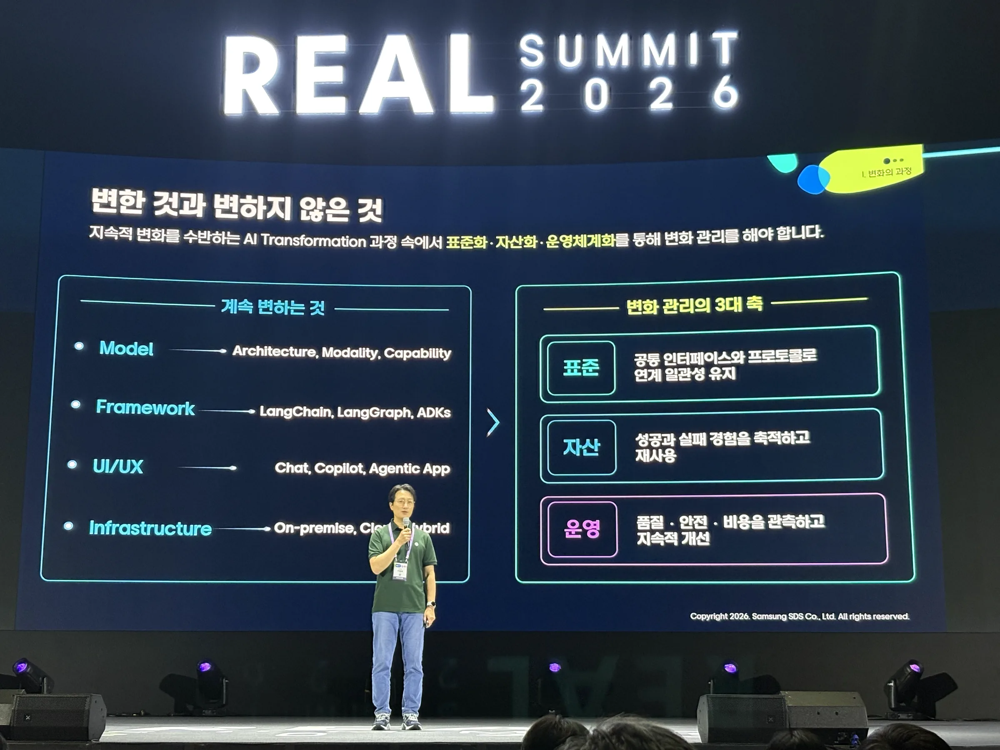

근거: STT 블록 2–7.

**슬라이드**

계속 변하는 기술과 변화를 관리하는 기준을 좌우로 대조한다.

| 계속 변하는 것 | 화면에 제시된 변화 범위 |
| --- | --- |
| Model | Architecture, Modality, Capability |
| Framework | LangChain, LangGraph, ADKs |
| UI/UX | Chat, Copilot, Agentic App |
| Infrastructure | On-premise, Cloud, Hybrid |

| 변화 관리의 축 | 슬라이드가 부여한 역할 |
| --- | --- |
| 표준 | 공통 인터페이스와 프로토콜로 연계 일관성 유지 |
| 자산 | 성공과 실패 경험을 축적하고 재사용 |
| 운영 | 품질·안전·비용을 관측하고 지속적으로 개선 |

**발표자**

모델의 업데이트 주기와 기능, 프레임워크, 사용자 경험이 빠르게 바뀌어도 생산성 향상이라는 지향점은 유지된다고 설명한다. 표준은 앞으로 나올 기술로 바꿀 때의 교체 비용을 줄이는 기준이고, 자산은 성공뿐 아니라 실패를 평가해 다음 시도의 기반으로 남기는 것이다.

> “성공하는 것만이 아니고 실패하는 과정에서도 그 결과를 축적할 수 있는 것이 중요합니다.” — 02:48–03:12, 블록 5

운영은 도입 이후 실행 상태·결과 품질·비용을 관측하면서 실제 생산성 효과를 확인하고 개선하는 과정이라고 설명한다.

# II. 지속 가능한 AX 플랫폼

## 다섯 레이어로 플랫폼을 설명한다 (04:02 ~ 05:39) — 사진 없음

근거: STT 블록 8–11. 다섯 레이어의 개요를 보여주는 사진은 없다. 아래 표는 **발화의 재구성**이며 슬라이드 전사가 아니다.

| 레이어 | 발표자가 설명한 책임 |
| --- | --- |
| Agent Builder | 표준에 따라 에이전트를 만들고 등록·배포·연계 |
| Knowledge & Data | 기업 데이터와 실행 이력을 조직 자산으로 축적 |
| Marketplace & Governance | 기업 내 재사용과 사용자·사용 방식 관리 |
| Intelligent Orchestration | 에이전트를 조율하고 사람의 승인 과정을 통제 |
| AgentOps | 모델 서빙과 실행의 품질·비용·추론 시간 관측 |

> “다섯 가지 레이어로 AX 플랫폼을 설명드리도록 하겠습니다.” — 04:15–04:54, 블록 9

## 02 · 다양한 제작 방식, 통일된 실행 표준 (05:42 ~ 07:09)

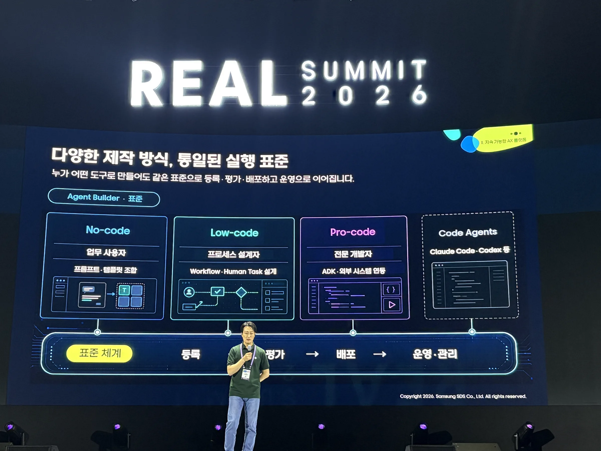

근거: STT 블록 12–14.

**슬라이드**

| 제작 방식 | 화면의 사용자·도구 | 맡는 일 |
| --- | --- | --- |
| No-code | 업무 사용자 | 프롬프트·템플릿 조합 |
| Low-code | 프로세스 설계자 | Workflow·Human Task 설계 |
| Pro-code | 전문 개발자 | ADK·외부 시스템 연동 |
| Code Agents | Claude Code·Codex 등 | 코드 에이전트를 활용한 제작 경로로 제시 |

네 경로는 아래의 공통 수명주기로 합류한다.

```text
제작 방식 → 표준 체계: 등록 → 평가 → 배포 → 운영·관리
```

**발표자**

자연어로 만드는 방식에서 시작해, 변경된 업무 절차를 반영하는 워크플로우 방식, 사내 시스템과 복잡한 로직을 연결하는 전문 개발까지 필요하다고 설명한다. 제작 방법이 달라도 에이전트의 정의와 동작을 설명하는 기준을 유지해야 전체 수명주기를 관리할 수 있다는 주장이다.

> “전체적인 에이전트가 어떤 정의를 가지고 있고, 어떻게 동작하는지에 대한 표준 체계를 유지하게 되면” — 06:24–07:05, 블록 13

사진에 나온 Code Agents의 개별 제품 사용법은 발화에서 설명하지 않는다.

## 03–04 · 확장성을 높이는 연결 표준 도입 (07:11 ~ 09:15)

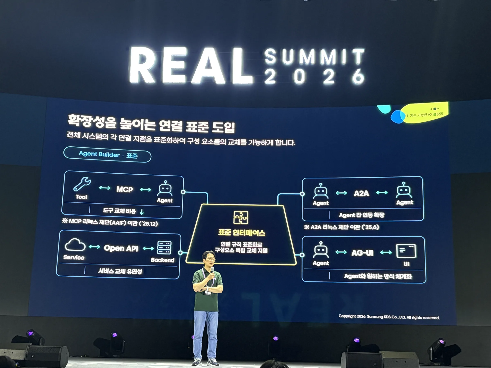

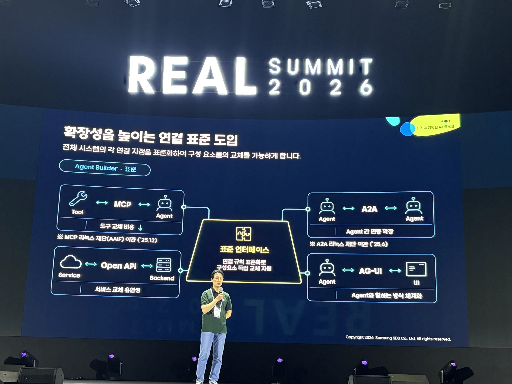

근거: STT 블록 15–18. 두 사진은 같은 구성을 보여준다. 촬영 구도와 발표자 위치가 다르며, 읽을 수 있는 범위에서 추가된 노드나 문구는 없다. 서로 다른 두 단계로 해석하지 않았다.

**슬라이드**

중앙의 표준 인터페이스가 연결 규칙을 표준화해 구성요소의 독립 교체를 지원한다.

| 연결 지점 | 화면 표기 | 제시한 효과 |
| --- | --- | --- |
| Tool ↔ Agent | MCP | 도구 교체 비용 감소 |
| Service ↔ Backend | Open API | 서비스 교체 유연성 |
| Agent ↔ Agent | A2A | 에이전트 간 연동 확장 |
| Agent ↔ UI | AG-UI | 에이전트와 일하는 방식 체계화 |

작은 주석에는 MCP의 리눅스 재단(AAIF) 이관 시점을 `'25.12`, A2A의 리눅스 재단 이관 시점을 `'25.6`으로 적었다. 이는 **발표 슬라이드의 표기**를 기록한 것이며 외부 연혁 검증은 하지 않았다.

**발표자**

기업이 제안한 프로토콜이 생태계 전반으로 확산되는 것을 예로 들며, 현재 사용할 수 있는 표준을 적용하고 새 표준도 살펴야 한다고 설명한다. 사내 백엔드 API도 AI가 사용할 수 있는 형태로 정리해야 하고, 사람과 에이전트의 상호작용까지 표준화 범위가 넓어진다고 말한다.

> “API를 AI가 사용할 수 있는 형태로 잘 정리하고 표준화하는 부분들이 필요하게 됩니다.” — 07:50–08:30, 블록 16

블록 15의 “MCP … 최근에 2.0 버전”은 두 모델의 음성 재전사에서도 “2.0 버전”으로 일치했다. 따라서 이 숫자를 단순한 원 STT 오인식으로 보기는 어렵다. 다만 사진에는 버전 표기가 없으며, 재전사의 일치가 프로토콜의 실제 공식 버전이나 발표 내용의 정확성을 검증하는 것은 아니다.

## Knowledge & Data — 데이터의 양에서 정의·맥락·품질로 (09:19 ~ 11:07) — 사진 없음

근거: STT 블록 19–21.

발표자는 기업이 정형·비정형 데이터를 많이 갖고 있어도 AI가 사용할 만큼 준비되어 있는지는 별개라고 설명한다. 기존 데이터와 새 데이터의 정의를 기록하고 의미와 맥락을 연결하며 품질 기준, 인증, 권한까지 마련하는 과정을 강조한다.

> “각각의 데이터들이 어떤 의미를 가지는지, 맥락을 연결시켜 주는 변화 작업을 거치게 되고” — 09:58–10:38, 블록 20

데이터를 사용한 에이전트의 실행과 생성 데이터도 다시 기업에 축적된다고 설명한다. 이 구간의 전용 슬라이드가 없어 구체적인 데이터 처리 제품, 저장 구조, 품질 평가 수치는 복원할 수 없다. 블록 21의 “실행하는 능력”은 문맥이 어색하다. 두 음성 재전사도 해당 문장을 안정적으로 복원하지 못해 임의로 “이력” 등 다른 단어로 고치지 않았다.

## 05 · 기업 AI 자산의 Marketplace (11:10 ~ 12:02)

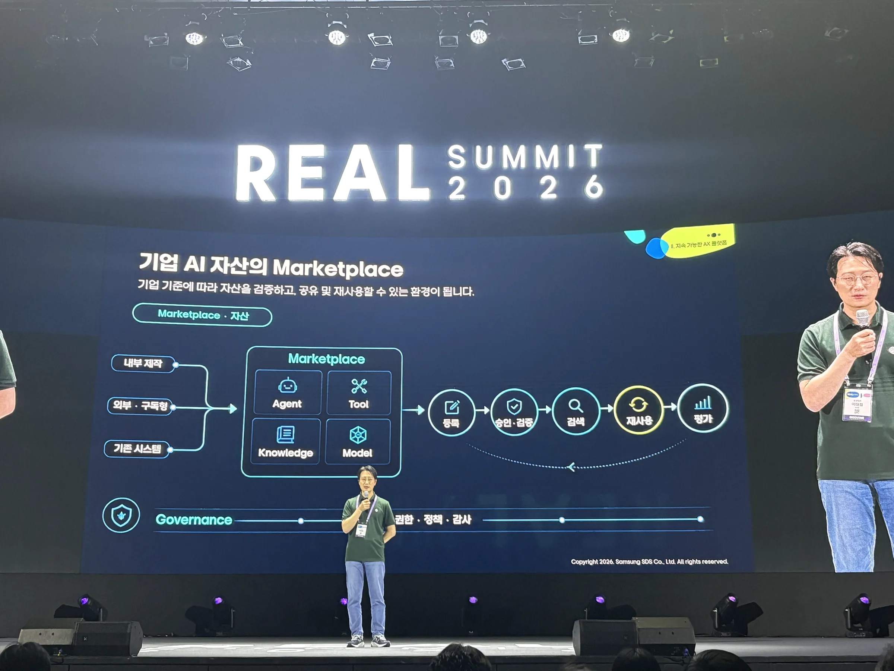

근거: STT 블록 22–23.

**슬라이드**

내부 제작, 외부·구독형, 기존 시스템이라는 세 경로가 Marketplace로 들어온다. 자산은 Agent, Tool, Knowledge, Model로 나뉜다.

```text
내부 제작 / 외부·구독형 / 기존 시스템
  → Marketplace: Agent · Tool · Knowledge · Model
  → 등록 → 승인·검증 → 검색 → 재사용 → 평가
                           평가 결과는 앞선 흐름으로 환류
```

아래에는 Governance가 전체 흐름에 걸쳐 배치되어 있고 `권한·정책·감사`가 읽힌다. 발표자에게 가려진 앞부분의 문구는 복원하지 않았다.

**발표자**

흩어진 에이전트·도구·지식 자산을 모아 등록·배포·승인·검증하는 과정이 기업 내 확산의 기반이라고 설명한다. 재사용할 수 있는 저장소에 그치지 않고, 누가 사용할 수 있는지와 정책 준수 여부까지 관리해야 한다.

> “재사용이라는 측면에서의 마켓플레이스뿐만이 아닌, 기업에서의 적용할 기준을 관리하는 거버넌스의 영역으로도 이어질 수 있습니다.” — 11:45–12:02, 블록 23

## 06 · 설명 가능한 실행, 운영의 시작 (12:05 ~ 12:51)

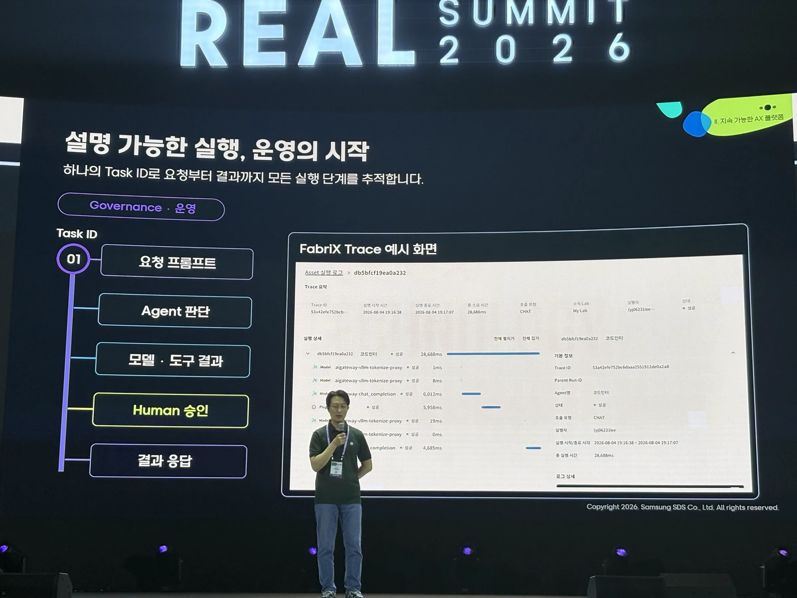

근거: STT 블록 24–25.

**슬라이드**

하나의 Task ID 아래 `요청 프롬프트 → Agent 판단 → 모델·도구 결과 → Human 승인 → 결과 응답`을 연결한다. 오른쪽의 FabriX Trace 예시 화면은 실행별 상태·소요 시간과 하위 실행 막대를 보여준다. 상단 예시의 소요 시간은 `28,688ms`이며, 이는 특정 예시 화면의 값이지 제품의 평균 응답 시간이나 성능 개선 지표가 아니다. 전체 로그 본문과 가려진 행은 읽을 수 없다.

**발표자**

요청을 해석하고 모델을 선택하며, 필요할 때 사람의 승인을 받아 결과를 만드는 전 과정을 추적할 수 있어야 한다고 설명한다.

> “전체 과정들을 추적할 수 있고 분석할 수 있는 것이, 에이전트가 실행한 내용들을 이해하고 설명 가능하도록 하고” — 12:24–12:51, 블록 25

설명 가능성을 품질과 안전성을 높이는 기반으로 제시하지만, 이 화면만으로 모든 실행에서 승인 단계를 거친다고 단정할 수는 없다.

## 07 · 실행 전체 과정의 위험도 확인, 안전성 강화 (12:55 ~ 14:30)

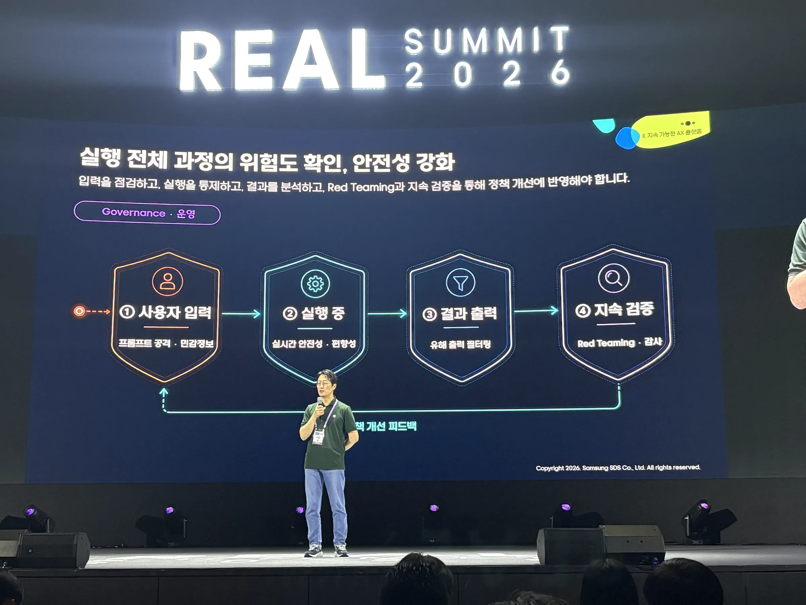

근거: STT 블록 26–28.

**슬라이드**

| 단계 | 확인 대상 |
| --- | --- |
| 사용자 입력 | 프롬프트 공격·민감정보 |
| 실행 중 | 실시간 안전성·편향성 |
| 결과 출력 | 유해 출력 필터링 |
| 지속 검증 | Red Teaming·감사 |

지속 검증에서 입력 쪽으로 돌아가는 선에는 `정책 개선 피드백`이 붙어 있다.

**발표자**

에이전트의 자율성 때문에 미리 정의한 업무 이외의 활용도 가능하므로 입력부터 실제 행동과 출력까지 검사해야 한다고 설명한다.

> “이렇게 검사하고 확인하는 부분들은 한 번에 끝이 난 것이 아니고, 지속적으로 검증하는 과정을 필요로 하고” — 13:34–14:16, 블록 27

같은 구간 후반에는 양자 내성 암호와 오후의 `Making PQC Real` 세션을 언급한다. 에이전트가 다룰 데이터의 양자 취약점도 대비하자는 후속 세션 안내이며, 이 사진에는 PQC 구현 구조가 없다. 현재 플랫폼에 구현됐다는 근거로 해석하지 않았다.

## 08 · Agent의 실행 계획 수립, 사람의 판단 (14:35 ~ 16:07)

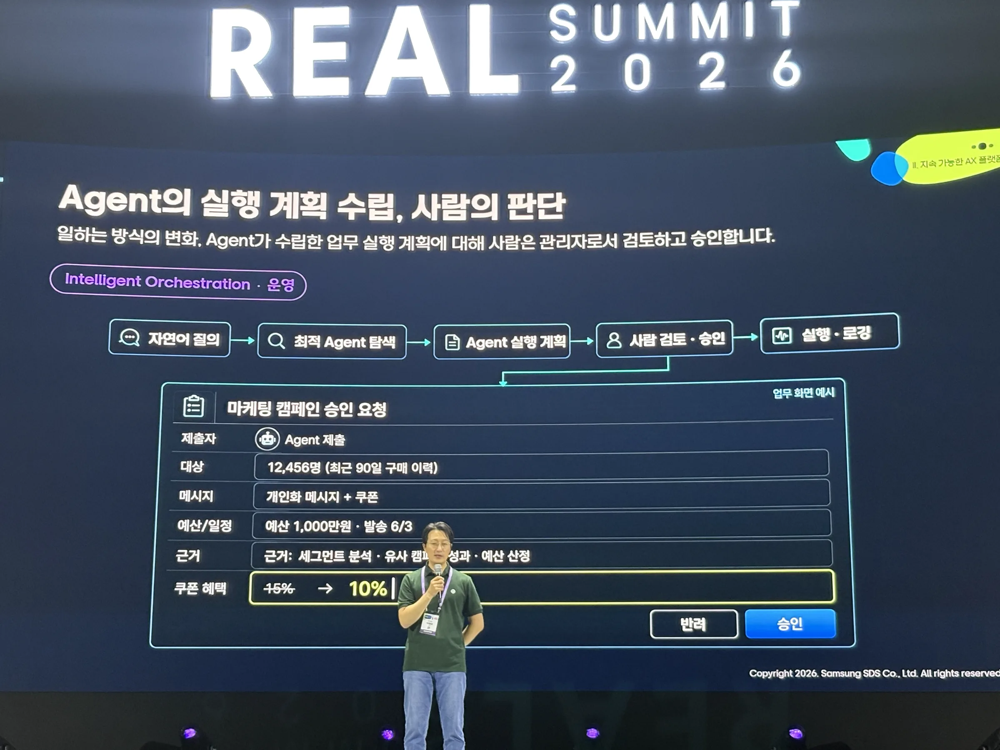

근거: STT 블록 29–31.

**슬라이드**

```text
자연어 질의 → 최적 Agent 탐색 → Agent 실행 계획 → 사람 검토·승인 → 실행·로깅
```

아래는 `업무 화면 예시`로 표시된 마케팅 캠페인 승인 요청이다.

| 항목 | 예시 화면의 값 |
| --- | --- |
| 제출자 | Agent 제출 |
| 대상 | 12,456명 · 최근 90일 구매 이력 |
| 메시지 | 개인화 메시지 + 쿠폰 |
| 예산·일정 | 1,000만원 · 발송 6/3 |
| 근거 | 세그먼트 분석 · 유사 캠페인 성과 · 예산 산정 |
| 쿠폰 혜택 | 15%에 취소선을 긋고 10%로 변경 |
| 사람의 선택 | 반려 / 승인 |

이 숫자는 승인 화면의 예시 입력이며 캠페인의 실적이나 절감 효과가 아니다.

**발표자**

캠페인 정보와 예산을 확인하는 에이전트를 찾아 초안을 만들고 사람이 검토하는 상황을 설명한다. 화면에는 보이지 않는 Agent Directory Service가 필요하며, 기업에서 사용할 에이전트를 찾고 마켓플레이스의 자산을 오케스트레이터가 사용할 수 있게 연결한다고 덧붙인다.

> “화면에는 보이지 않지만, 이런 동작들이 구성이 되려면 에이전트 디렉터리 서비스라고 하는” — 15:14–15:53, 블록 30

블록 30의 “사람의 커먼 인터뷰”는 두 음성 재전사에서도 결과가 달라 정확한 발화가 미확인이다. 사람의 검토·승인이라는 역할은 사진과 전후 발화에서 확인되지만, 해당 표현을 특정 기술 용어로 교정하지 않았다.

## 09 · 다양해진 모델 선택지, Smart Router로 최적화 (16:10 ~ 18:17)

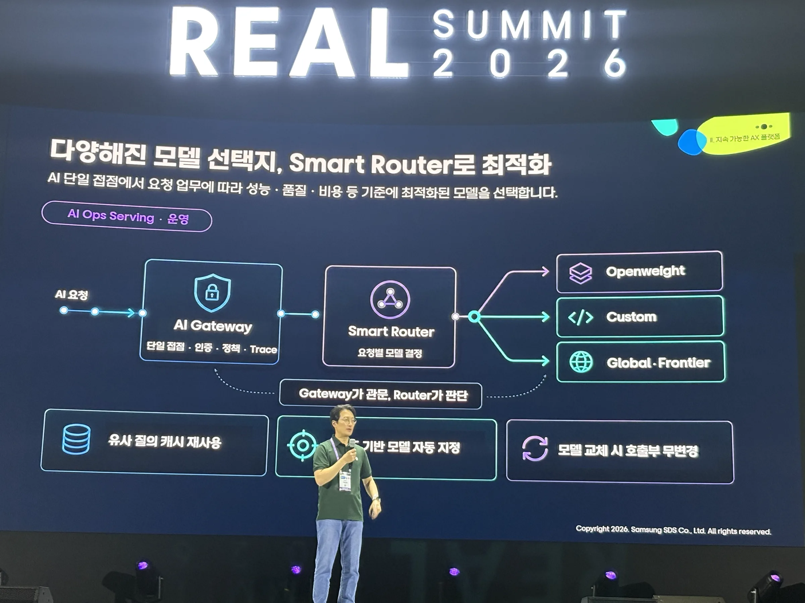

근거: STT 블록 32–35.

**슬라이드**

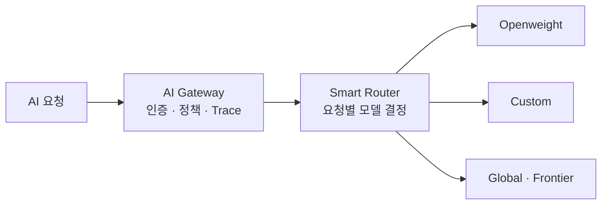
```mermaid
flowchart LR
    Q["AI 요청"] --> G["AI Gateway<br/>인증 · 정책 · Trace"]
    G --> R["Smart Router<br/>요청별 모델 결정"]
    R --> O["Openweight"]
    R --> C["Custom"]
    R --> F["Global · Frontier"]
```

`Gateway가 관문, Router가 판단`이라고 역할을 구분한다. 아래에는 유사 질의 캐시 재사용, 난이도 기반 모델 자동 지정, 모델 교체 시 호출부 무변경을 제시한다. 이는 슬라이드가 제시한 설계 효과이며 실제 절감 수치는 없다.

**발표자**

모든 요청에 가장 비싼 고성능 모델을 쓰는 비용 문제에서 출발한다. 단일 접점에서 정책을 적용하는 역할과, 요청에 맞는 모델을 고르는 역할을 나눠 설명한다. 복잡한 질문에는 고성능 모델, 코딩에는 코드에 특화된 모델을 선택하는 예를 든다.

> “주어진 질문, 테스트에 최적의 비용과 성능을 가진 모델들을 잘 선택하고” — 16:10–17:32, 블록 32–33에 걸친 문장

인용의 “테스트”는 STT 표기다. 원래 발화가 다른 단어였는지는 미확인이다. 발화는 모델을 교체할 때 호출 부분의 변경을 **최소화**한다고 설명하며, 사진의 `호출부 무변경`보다 완화된 표현이다.

## 10 · 다양한 운영 환경 사이의 분리와 공유 (18:21 ~ 19:45)

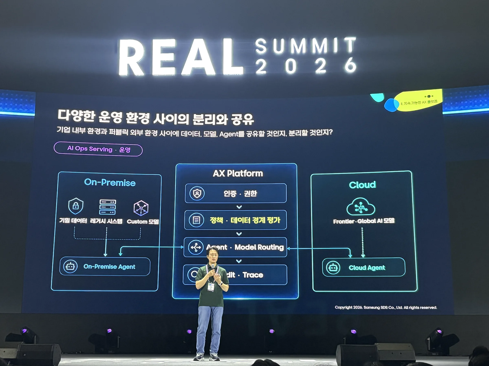

근거: STT 블록 36–38.

**슬라이드**

| 위치 | 구성 |
| --- | --- |
| On-Premise | 기업 데이터 · 레거시 시스템 · Custom 모델 → On-Premise Agent |
| AX Platform | 인증·권한 → 정책·데이터 경계 평가 → Agent·Model Routing → Audit·Trace |
| Cloud | Frontier·Global AI 모델 → Cloud Agent |

가운데 라우팅 계층은 양쪽 에이전트와 연결된다. 질문은 내부와 외부 환경 사이에서 데이터·모델·에이전트를 무엇까지 공유하고 분리할 것인지다.

**발표자**

비밀 데이터는 사내 환경에서 사용하고, 범용 데이터에는 퍼블릭 환경의 모델을 활용하는 조합을 설명한다. 토큰 사용량뿐 아니라 운영 환경과 데이터 경계도 선택 기준에 들어간다는 뜻이다.

> “정책, 데이터의 경계를 잘 평가하고, 인증과 권한을 담당하면서” — 18:21–18:58, 블록 36

19:23 이후에는 다른 연산 장치를 활용하는 모델 서빙과 오후 세션을 안내한다. 원 STT는 GPU 외에 “NPU”를 말한다고 기록하지만, 두 재전사는 각각 GPU·TPU로 인식해 해당 장치명은 미확인이다. 서비스명도 원 STT의 “포크로닉스 SK”와 두 재전사가 서로 다르고 사진으로 확인되지 않아 정확한 이름을 남기지 않았다. 이 구간에서 하드웨어별 성능이나 비용 수치는 제시되지 않는다.

## 11 · FabriX에 반영된 표준·자산·운영 요소 (19:47 ~ 20:18)

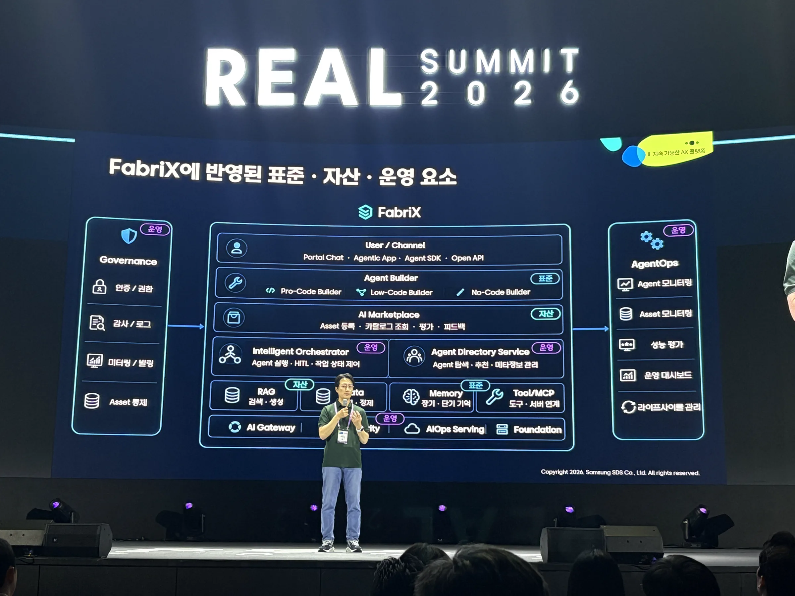

근거: STT 블록 39.

**슬라이드**

| 위치 | 화면에서 확인되는 구성·역할 |
| --- | --- |
| User / Channel | Portal Chat · Agentic App · Agent SDK · Open API |
| Agent Builder · 표준 | Pro-Code / Low-Code / No-Code Builder |
| AI Marketplace · 자산 | Asset 등록 · 카탈로그 조회 · 평가 · 피드백 |
| Intelligent Orchestrator · 운영 | Agent 실행 · HITL · 작업 상태 제어 |
| Agent Directory Service · 운영 | Agent 탐색 · 추천 · 메타정보 관리 |
| 데이터·도구 영역 | RAG(검색·생성), Data, Memory(장기·단기 기억), Tool/MCP(도구·서버 연계) |
| 하단 기반 | AI Gateway · AIOps Serving · Foundation. 중앙 항목은 발표자에게 가려져 전체 명칭 미확인 |
| 왼쪽 Governance · 운영 | 인증·권한 · 감사·로그 · 미터링·빌링 · Asset 통제 |
| 오른쪽 AgentOps · 운영 | Agent 모니터링 · Asset 모니터링 · 성능 평가 · 운영 대시보드 · 라이프사이클 관리 |

Data의 하단 설명 일부도 가려져 있어 다른 계층의 역할로 보충하지 않았다.

**발표자**

> “표준 자산 운영이라는 요소들이 SDS가 가지고 있는 AX 플랫폼 FabriX에도 잘 녹아들어져 있습니다.” — 19:47–20:18, 블록 39

발표자는 앞서 설명한 기준이 제품에 반영되어 있다고 설명한다. 이 개요만으로 각 기능의 운영 규모나 출시 버전별 제공 범위를 확정할 수는 없다.

## FabriX 출시와 향후 강화 방향 (20:21 ~ 20:46) — 대응 사진 없음

근거: STT 블록 40. 제공 사진에는 로드맵이나 출시 연도가 보이지 않는다.

STT는 “현재 2007년 9월에 출시”라고 기록한다. 두 음성 재전사는 이 대목을 각각 “2.2…”, “1.7 버전…”으로 달리 인식했고 날짜도 안정적으로 복원하지 못했다. 원 STT의 숫자를 출시 연도로 채택하지 않았으며, 정확한 연도·버전은 미확인이다. 2.0 출시를 통해 운영 체계와 거버넌스를 강화할 예정이라고 설명하고, 향후 업무 환경·AgentOps·거버넌스를 발전시키겠다는 방향을 제시한다. 이 미래 계획을 현재 구현 완료로 옮기지 않았다. 블록 끝의 “자산 분산형 거버넌스”도 두 재전사에서 안정적으로 복원되지 않아 정확한 용어인지 확인되지 않았다. 2.0 이후 방향은 원 STT 기반 설명이며 재전사로 확정한 제품 로드맵은 아니다.

# III. 구체화 사례

## 사례 설명으로 전환 (20:49 ~ 20:58) — 사진 없음

근거: STT 블록 41. 앞서 설명한 AX 전략의 세 축을 구체적인 사례에 연결하겠다고 예고한다.

## 12 · SW 개발 패러다임의 변화 (21:01 ~ 22:35)

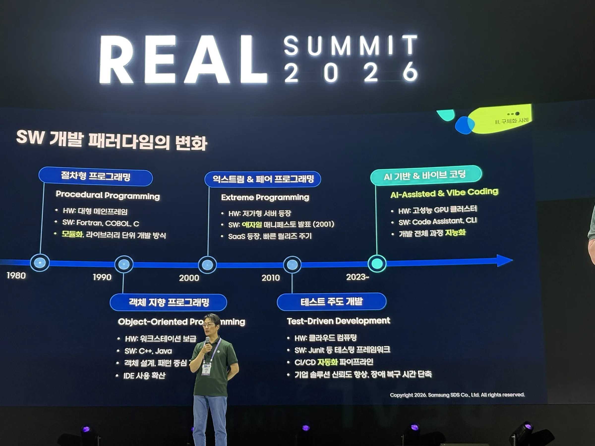

근거: STT 블록 42–44.

**슬라이드**

아래 연대 구분은 발표자가 그린 설명용 연대표다. 각 기술의 최초 등장 연도를 확정하는 기술사 표로 해석하지 않는다.

| 화면의 시기 | 패러다임 | 기반으로 제시한 것 |
| --- | --- | --- |
| 1980 | 절차형 프로그래밍 | 대형 메인프레임, Fortran·COBOL·C, 모듈화·라이브러리 |
| 1990 | 객체 지향 프로그래밍 | 워크스테이션, C++·Java, 객체 설계·패턴, IDE 확산 |
| 2000 | 익스트림 & 페어 프로그래밍 | 저가형 서버, 애자일 매니페스토(2001), SaaS·빠른 릴리스 |
| 2010 | 테스트 주도 개발 | 클라우드, Junit 등 테스트 프레임워크, CI/CD 자동화 |
| 2023~ | AI 기반 & 바이브 코딩 | GPU 클러스터, Code Assistant·CLI, 개발 전체 과정 지능화 |

**발표자**

소프트웨어 개발에서 AI 전환 효과가 먼저 나타나는 이유를 기존 기반에서 찾는다. 모듈화와 재사용이 쌓였고, 테스트·배포·운영 자동화로 빠른 릴리스와 신뢰성을 확보하는 과정이 있었기 때문에 AI를 적용할 토대가 마련됐다는 설명이다.

> “기존에 있었던 모듈화된 부분, 재사용에 대한 체계, 테스트하고 변경점들을 추적하는 부분들이” — 21:41–22:35, 블록 43–44에 걸친 문장

## 13 · 한 번의 전환, 다음 전환의 자산 (22:39 ~ 23:37)

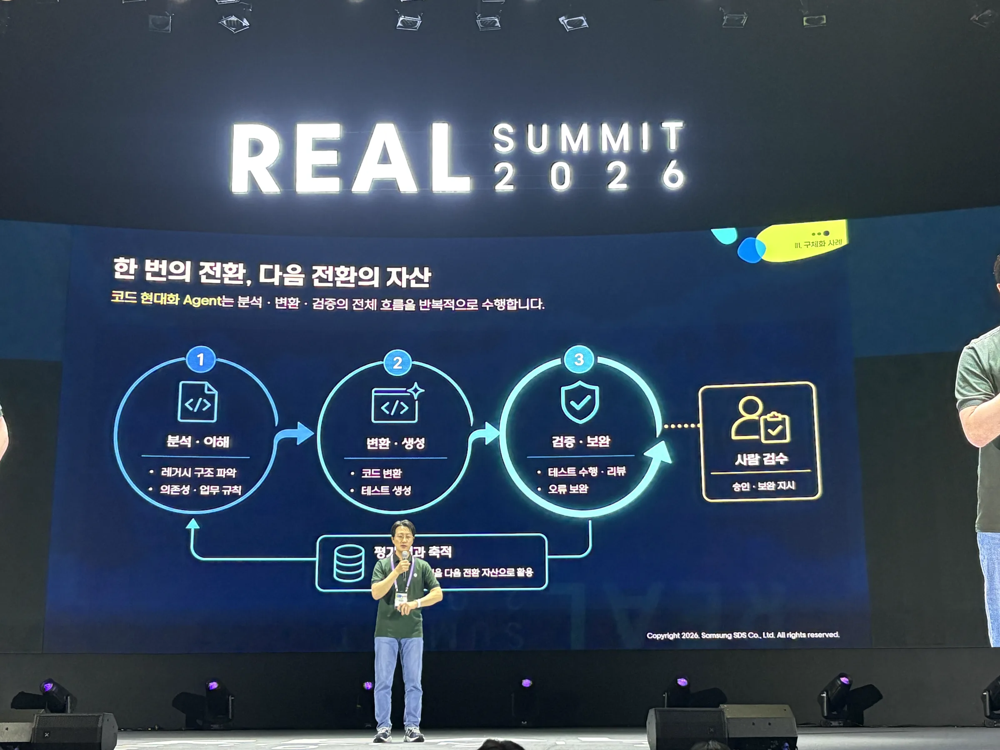

근거: STT 블록 45–46.

**슬라이드**

| 단계 | 수행 내용 |
| --- | --- |
| 분석·이해 | 레거시 구조 파악, 의존성·업무 규칙 |
| 변환·생성 | 코드 변환, 테스트 생성 |
| 검증·보완 | 테스트 수행·리뷰, 오류 보완 |
| 사람 검수 | 승인·보완 지시 |
| 평가 결과 축적 | 다음 전환 자산으로 활용하고 분석 단계로 환류 |

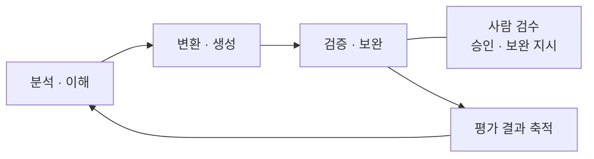
```mermaid
flowchart LR
    A["분석 · 이해"] --> B["변환 · 생성"] --> C["검증 · 보완"]
    C --- H["사람 검수<br/>승인 · 보완 지시"]
    C --> E["평가 결과 축적"] --> A
```

사진의 사람 검수 연결은 점선이며, 그림의 양방향 실행 조건은 명시되어 있지 않아 승인 상태 머신을 추가하지 않았다.

**발표자**

관계사와 확인하고 실제 적용하는 레거시 현대화 사례를 소개한다. 에이전트가 코드와 문서를 분석하고 코드 변경과 테스트를 수행하며, 사람은 필요한 접점에서 승인·수정에 참여한다고 설명한다.

> “많은 양의 레거시 코드들을 에이전트를 통해서 자동적으로 변환을 하고, 안전하게 테스트를 완수할 수 있는 과정이 확인될 수 있었습니다.” — 23:22–23:37, 블록 46

관계사명, 언어, 코드 규모, 테스트 통과율, 소요 기간은 공개되지 않는다. 위 인용은 발표자의 적용 결과 설명이며, 독립적인 성능 검증 자료는 없다.

## 14 · 업무 시스템을 Agentic App으로 전환 (23:40 ~ 25:53)

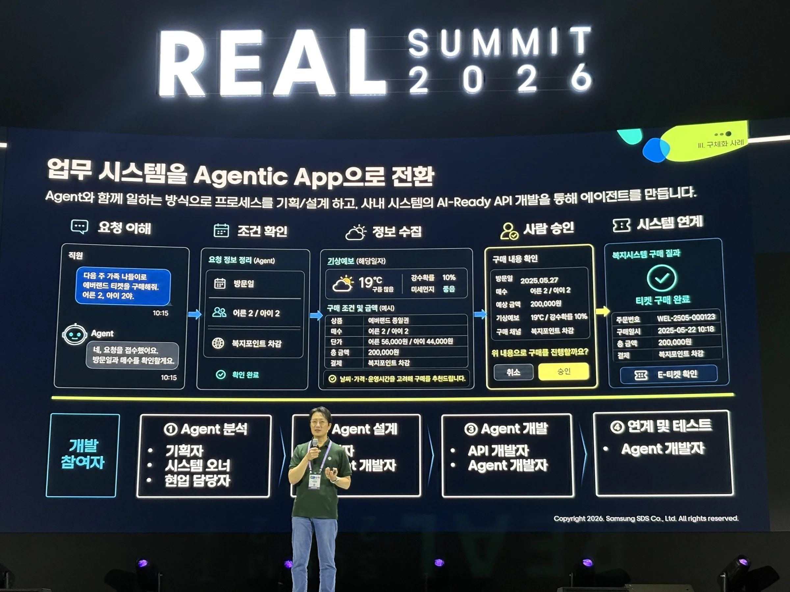

근거: STT 블록 47–51.

**슬라이드**

업무 흐름은 `요청 이해 → 조건 확인 → 정보 수집 → 사람 승인 → 시스템 연계`다. 직원이 어른 2명·아이 2명의 에버랜드 티켓을 요청하면 방문일과 매수를 확인하고, 날씨·구매 조건·금액을 모아 승인 화면을 제시한다. 승인 이후 복지시스템 구매 결과와 E-티켓 확인을 보여준다.

| 예시 화면 항목 | 값 |
| --- | --- |
| 인원·단가 | 어른 2명 × 56,000원, 아이 2명 × 44,000원 |
| 총 금액·결제 | 200,000원, 복지포인트 차감 |
| 날씨 | 19°C, 강수확률 10%, 미세먼지 좋음 |
| 방문일 | 2025.05.27 |
| 구매 결과 화면 | 2025-05-22 10:18 구매, 티켓 구매 완료 |

금액과 일정은 슬라이드의 예시 값이다. 2026년 행사에서 실제로 발생한 거래라는 뜻이 아니다.

| 개발 단계 | 참여자 |
| --- | --- |
| Agent 분석 | 기획자 · 시스템 오너 · 현업 담당자 |
| Agent 설계 | 기획자 · Agent 개발자 — 사진 일부가 가려져 있으나 블록 50에서 역할 확인 |
| Agent 개발 | API 개발자 · Agent 개발자 |
| 연계 및 테스트 | Agent 개발자 |

**발표자**

기존 업무 시스템을 에이전트 앱으로 전환하려면 업무 분석부터 사람과 에이전트의 역할을 다시 정해야 한다고 설명한다. API가 있든 없든 API 개발자가 에이전트가 사용할 수 있는 형태의 접점을 만들고, 필요한 경우 MCP 형태로도 제공한다.

> “API 개발자는 해당 시스템에서 제공하는 API가 있는 경우, 또는 없는 경우를 모두 포함해서” — 25:00–25:37, 블록 50

이 사례를 작은 예이지만 AX에서 반복되는 역할과 과정이라고 설명한다. 특정 복지 시스템의 운영 규모나 사용자 효과는 제시하지 않는다. STT의 “연계 테스트를 통해서 공격을 하게 되는”은 turbo 재전사에서도 “공격”, large-v3 재전사에서는 “공개”로 인식됐다. “공개”가 교정 후보이나 일치하지 않아 확정하지 않았고, 실제 배포 완료 등의 의미도 부여하지 않았다.

## 15 · AI + Automation, 시너지를 통한 AX 구현 (25:56 ~ 27:16)

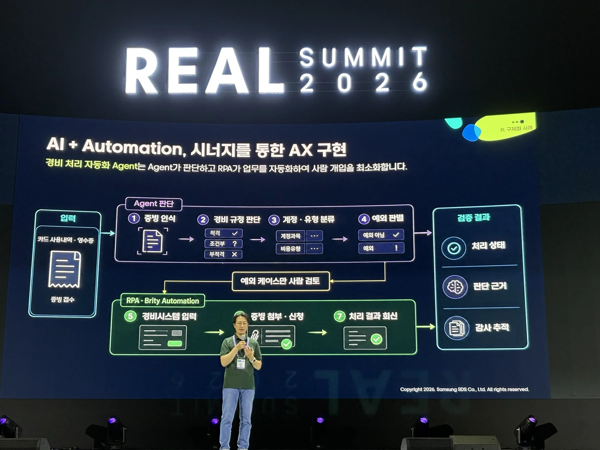

근거: STT 블록 52–53.

**슬라이드**

입력은 카드 사용내역·영수증이다. 보라색은 Agent의 판단, 초록색은 `RPA · Brity Automation`이 맡는 실행이다.

| 담당 | 순서 | 내용 |
| --- | --- | --- |
| Agent | 1 | 증빙 인식 |
| Agent | 2 | 경비 규정 판단 — 적격·조건부·부적격 |
| Agent | 3 | 계정·유형 분류 — 계정과목·비용유형 |
| Agent | 4 | 예외 판별 |
| 사람 | 예외 분기 | 예외 케이스만 검토 |
| RPA | 5 | 경비시스템 입력 |
| RPA | 6 | 증빙 첨부·신청 |
| RPA | 7 | 처리 결과 회신 |

오른쪽 검증 결과는 `처리 상태 · 판단 근거 · 감사 추적`으로 구성된다. 예외가 아닐 때의 세부 연결선은 별도로 드러나지 않으므로 내부 분기 조건을 추가하지 않았다.

**발표자**

삼성SDS에서 운영 중인 경비 처리 자동화 에이전트 사례라고 명시한다. 과거 사람이 영수증을 검토하던 업무를 RPA로 자동화했고, 이후 에이전틱 AI를 도입해 기존 RPA로 어려웠던 예외와 변경 사항을 판단하도록 확장했다고 설명한다.

> “예외의 경우에만 사람, 현업 담당자가 검토하는 형태로 프로세스를 바꾸면서” — 26:40–27:16, 블록 53

발표자는 시간 절약, 처리 상태·판단 근거의 가시성, 정확도 향상을 효과로 설명한다. 절약 시간, 정확도, 예외 비율, 비교 기간은 제시하지 않는다. 정해진 절차에 따른 실행에는 RPA가 계속 유효하다는 점을 강조한다.

# IV. 지속 가능한 AX

## 16 · 지속 가능한 AX, 운영에서 완성되는 Agent (27:20 ~ 28:15)

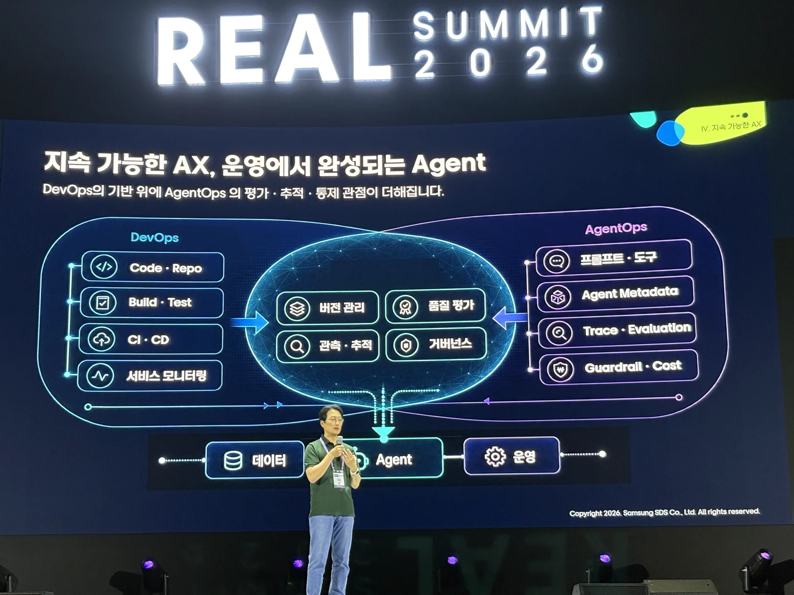

근거: STT 블록 54–55.

**슬라이드**

| DevOps | 공통 운영 관점 | AgentOps |
| --- | --- | --- |
| Code·Repo | 버전 관리 | 프롬프트·도구 |
| Build·Test | 품질 평가 | Agent Metadata |
| CI·CD | 관측·추적 | Trace·Evaluation |
| 서비스 모니터링 | 거버넌스 | Guardrail·Cost |

이 표의 각 행은 공간을 줄여 병렬로 놓은 것이며, 왼쪽과 오른쪽 항목의 일대일 대응을 뜻하지 않는다. 사진은 두 운영 체계가 공통 관점을 통해 `데이터 → Agent → 운영`을 함께 지원하는 구조다.

**발표자**

개발자뿐 아니라 일반 업무 담당자도 에이전트를 만들고 운영하는 환경이므로 기존 소프트웨어의 개발·배포·운영과 에이전트 운영을 조율해야 한다고 설명한다.

> “일반 업무 담당자들 역시도 에이전트를 만들고 실제 운영하는 형태로 많이 확장되고 있고요.” — 27:20–28:02, 블록 54

이어 로봇의 개발·운영·배포도 이러한 체계와 연결될 것으로 예상한다. 로보틱스는 전망으로 언급되며, 이 발표 자료에 구체적인 운영 사례는 없다.

## 17 · 지속 가능한 AX 전략 (28:19 ~ 29:18)

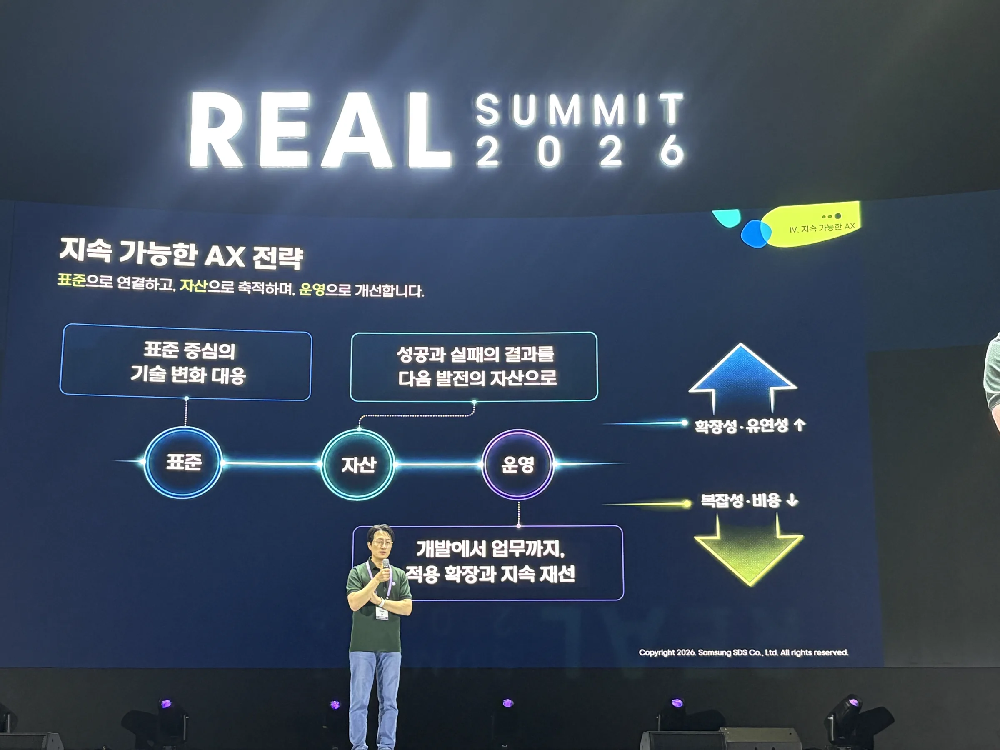

근거: STT 블록 56–57.

**슬라이드**

| 축 | 결론 |
| --- | --- |
| 표준 | 표준 중심의 기술 변화 대응 |
| 자산 | 성공과 실패의 결과를 다음 발전의 자산으로 |
| 운영 | 개발에서 업무까지 적용 확장과 지속 개선 |

오른쪽에는 `확장성·유연성 ↑`, `복잡성·비용 ↓`를 제시한다. 측정 결과가 아니라 전략이 지향하는 방향이다.

**발표자**

> “계속되는 기술 변화 환경 속에서 무엇을 지킬 것인가라는 질문에 대한 답으로” — 28:19–29:01, 블록 56

표준으로 기술 전환에 대응하고, 성공과 실패를 축적하며, 개발에서 업무까지 적용 범위를 넓히고 운영으로 개선하는 세 축을 다시 강조한다. 감사 인사로 끝나며 질의응답은 녹취에 없다. 마지막 블록의 “효과도와 비용은 낮출 수 있는”이라는 STT는 사진의 `복잡성·비용 ↓`와 다르다. 두 음성 재전사도 낮추려는 대상의 명칭을 안정적으로 복원하지 못했다. 사진과 원 STT를 구분해 보존하고 정확한 발화는 미확인으로 남긴다.

## 재구성하면서 남긴 것

- **원료 범위** — STT 57블록, 00:00–29:18. 공식 제목과 발표자 정보는 별도 행사 안내 이미지 `program.png`로 확인했다. 사진은 IMG_3798–IMG_3814로 파일 번호가 연속된 17장이다. 파일 번호의 연속성이 전체 발표 슬라이드가 빠짐없이 있다는 뜻은 아니다.
- **사진 없는 구간** — 도입(00:00–00:40), 다섯 레이어 개요(04:02–05:39), Knowledge & Data(09:19–11:07), 출시·로드맵(20:21–20:46), 사례 전환(20:49–20:58)을 녹취만으로 남겼다. PQC와 NPU 관련 안내도 대응하는 전용 사진이 없다.
- **동일 슬라이드** — 사진 03·04는 연결 표준 슬라이드의 반복 촬영이다. 읽히는 내용이 같아 한 절로 묶었으며 둘 다 참조했다. 발표와 무관한 사진은 발견하지 않았다.
- **음성 상태** — 원본은 기존 reference 경로에 보존했다. 전체 디코딩 시 29:18.98까지 진행되고 끝부분에서 `Error parsing Opus packet header`가 1회 출력됐다. 끝 패킷 오류가 실제 발화에 미친 영향은 미확인이다. -40dB 이하·15초 이상 조건의 무음 탐지에서는 검출 구간이 없었다. 이는 누락된 발화가 없다는 보증은 아니다.
- **녹취의 시작·종료** — 첫 문장이 이미 진행 중이고 자기소개가 없다. 마지막 감사 인사는 남아 있으며 음성 끝과 녹취 끝은 약 1초 차이다. 블록 2→3, 9→10처럼 문장이 블록 경계에서 나뉘는 대목은 문맥을 이어 읽었다.
- **음성 부분 대조 결과** — 9개 구간을 두 모델로 재전사했다. MCP의 “2.0”은 원 STT와 두 결과가 일치한다. 나머지 의심 표현은 아래 표처럼 미확인 또는 교정 후보로 남겼다. 자동 인식 결과를 직접 청취 확인으로 표현하지 않았으며, 원 STT는 수정하지 않았다.
- **표현 차이** — 모델 교체에 대해 사진 09는 `호출부 무변경`, 블록 35는 변경점 최소화를 설명한다. 결론에서 사진 17은 `복잡성·비용 ↓`, 블록 57은 “효과도와 비용은 낮출 수 있는”이라고 기록되어 있다. 더 강한 주장을 선택하거나 STT를 몰래 수정하지 않았다.
- **사진 가림·작은 글자** — Marketplace의 거버넌스 문구 일부, FabriX의 Data 설명과 하단 중앙 항목, 현대화의 축적 설명 일부, 티켓 구매의 설계 참여자 일부가 발표자에게 가려져 있다. Trace 화면의 전체 로그와 명찰도 확정하지 않았다. 티켓 설계의 참여자는 녹취로 확인한 사실임을 따로 밝혔다.
- **예시와 실적 구분** — 캠페인의 12,456명·1,000만원·쿠폰 15%→10%, 티켓의 200,000원·2025년 일정, Trace의 28,688ms는 예시 화면 값이다. 운영 성과, 최신 가격 또는 실거래 기록으로 사용하지 않는다.
- **미공개 범위** — 코드 현대화 관계사명·언어·코드 규모, 복지 앱의 실운영 범위, 경비 처리의 예외 비율·정확도·절감 시간은 확인할 수 없다. 외부 자료로 채우지 않았다.
- **파일 보존** — transcript와 HEIC 원본은 변경하지 않았다. WebP는 원본 IMG_3798부터 순서대로 01–17에 대응하며, 긴 변 2,400px 이하·품질 82로 변환했다. 원본 사진 약 33.21MiB에 대응하는 WebP 전체는 약 3.14MiB다. HEIC는 로컬 보존본이며 리소스 규약상 커밋 대상은 아니다.

## 음성 부분 재전사 대조

원본 `recordings/11.bin`에서 아래 9개 구간(합계 378초, 약 6분 18초)만 임시 PCM WAV(16kHz·mono)로 추출했다. 전체 발표를 새로 전사하지 않았다. `mlx-whisper 0.4.3`의 `mlx-community/whisper-large-v3-turbo`와 `mlx-community/whisper-large-v3-mlx-4bit`를 사용했고, 한국어 지정·temperature 0·이전 문맥 조건 없음으로 실행했다. 원 STT나 교정 후보를 프롬프트에 넣지 않았다.

두 결과를 원 STT 및 해당 사진과 대조했다. 두 모델은 같은 Whisper 계열이므로 결과의 일치만으로 정확성을 보장하지 않는다. 재전사에는 기술명 오인식, 문장 누락, 문맥과 맞지 않는 표현이 반복되어 전체 문장을 대체하는 데 사용하지 않았다. 아래 결과는 **자동 음성 인식의 대조 기록**이며, 사람의 청취 판정을 의미하지 않는다.

| 원음 구간 | 확인 대상 | 재전사 대조 결과 | 문서 반영 |
| --- | --- | --- | --- |
| 00:00–00:18 | 첫 문장·발표자 소개 | 두 모델 모두 “것입니다”로 시작. 원 STT의 “보셨습니까?”와 다름. 이름 소개는 인식되지 않음 | 도입 앞부분 미확인 유지. 발표자 신원은 추가 제공된 행사 안내로 확인. 첫 문구는 원 STT 표기라고 구분 |
| 07:08–07:57 | MCP 버전 | 원 STT와 두 재전사가 모두 “2.0 버전”으로 인식 | 재전사 일치를 기록. 공식 버전 검증과는 구분 |
| 10:27–11:08 | “실행하는 능력” | turbo는 유사 표현을 인식했으나 뒤 문장이 깨지고, large-v3는 다른 문장으로 인식 | 정확한 명사 미확인. 이력 등으로 교정하지 않음 |
| 14:55–15:57 | “사람의 커먼 인터뷰” | 두 모델 모두 해당 구절을 안정적으로 복원하지 못함 | 사진으로 확인되는 검토·승인 역할만 유지. 특정 용어로 교정하지 않음 |
| 16:20–17:35 | 요청 단위 “테스트”, Gateway·Router 역할 | turbo는 “질문 테스트”, large-v3는 해당 앞부분을 누락. Gateway·Router 주변 문장에도 오인식 발생 | 기존 STT 인용 유지. 정확한 원 단어와 세부 발화는 재전사로 확정하지 않음 |
| 19:17–19:48 | 연산 장치·오후 세션명 | 장치명은 원 STT NPU, turbo GPU, large-v3 TPU로 갈림. 서비스명도 “포크로미크스 SK”, “포크노믹스 SK” 등으로 갈림 | 장치·서비스의 정확한 이름 미확인. 외부 제품명으로 보충하지 않음 |
| 20:15–20:50 | 출시 연도·버전·로드맵 | 원 STT는 “2007년 9월”, turbo는 “2.2…”, large-v3는 “1.7 버전…”으로 인식. 뒤 로드맵도 문장 손실 | 출시 숫자 미확인 유지. 원 STT의 연도를 사실로 채택하지 않음 |
| 25:14–25:45 | “공격” / 연계 테스트 다음 동작 | turbo는 “공격”, large-v3는 “공개”로 인식 | “공개”를 교정 후보로만 기록. 실제 배포 여부는 확정하지 않음 |
| 28:43–29:19 | 결론의 감소 대상·종료 | 두 모델 모두 감소 대상의 명사를 안정적으로 복원하지 못함. 마지막 감사 인사는 일치 | 사진의 “복잡성·비용 ↓”와 원 STT의 표현 차이를 유지 |

원음·원 STT·사진 원본은 변경하지 않았다. 부분 추출 WAV와 모델 출력은 작업용 임시 파일이며 최종 원료를 대체하지 않는다. 별도로 사용자의 요청에 따라 전체 녹음의 재생용 [recording.wav](recording.wav)를 16kHz·mono·16bit PCM으로 만들었다. 출시 숫자와 미확인 용어를 확정하려면 위 시간대에 대한 직접 청취 등 추가 근거가 필요하다.

# 최종 정리 — 전환 과정에서 생긴 판단과 검증을 다음 운영의 자산으로 남긴다

앞부분의 플랫폼 설명은 뒤의 세 업무 사례를 읽는 기준이다. 코드 현대화는 평가 결과의 재사용, 복지 티켓 구매는 사람·에이전트·기존 시스템의 연결, 경비 처리는 판단과 정해진 실행의 분담을 보여준다. 마케팅 캠페인은 오케스트레이션의 설명용 화면이므로 별도의 실운영 사례로 세지 않았다.

## 사례 1 — 레거시 코드 변환을 분석·검증의 반복 과정으로 만든다

근거: 사진 12–13, STT 블록 42–46(21:01–23:37).

### 문제 — 코드를 바꾸기 전에 기존 업무 규칙을 이해하고 바뀐 결과를 검증해야 한다

레거시 코드와 문서에 들어 있는 구조·의존성·업무 규칙을 파악해야 새 코드로 옮길 수 있다. 많은 코드를 변환하더라도 테스트와 검수가 없으면 전환 결과를 신뢰하기 어렵다는 과제를 다룬다. 구체적인 실패율이나 작업 병목 수치는 공개하지 않았다.

### 만든 개념 — 한 번의 전환 결과가 다음 전환의 자산이 된다

발표가 세운 구조는 분석·이해, 변환·생성, 검증·보완을 반복하고 평가 결과를 축적하는 것이다. 이미 소프트웨어 개발에 쌓인 모듈화·재사용·테스트·변경 추적 기반 위에서 에이전트를 적용한다.

### 적용과 아키텍처

에이전트가 코드와 문서를 분석하고 코드·테스트를 생성한 뒤 테스트와 오류 보완을 반복한다. 사람은 승인하거나 보완을 지시한다. 검증에서 얻은 평가 결과는 다음 분석·변환에 사용하는 자산으로 돌아간다. 특정 모델, 저장소 구조, 자동 승인 기준은 발표만으로 확인할 수 없다.

### 결과

발표자는 관계사 적용에서 많은 레거시 코드를 자동 변환하고 테스트를 완수하는 과정을 확인했다고 설명했다. 공개 근거는 흐름도와 해당 발화다. 변환량·정확도·시간 절약을 측정한 자료는 없어 전환 생산성을 정량화하지 않는다.

## 사례 2 — 복지 업무를 승인 가능한 Agentic App으로 연결한다

근거: 사진 14, STT 블록 47–51(23:40–25:53).

### 문제 — 사용자 요청을 실행 가능한 조건으로 바꾸고 기존 시스템의 거래까지 연결해야 한다

“가족 나들이 티켓을 구매해 달라”는 요청에는 방문일·인원·금액·결제 방식 같은 확인 사항이 따른다. 이를 모아 사람에게 구매 내용을 보여주고 승인받은 뒤 기존 복지 시스템에 전달하는 과정이 필요하다.

### 만든 개념 — 사람의 확인과 시스템 실행을 포함해 업무 절차를 다시 설계한다

에이전트 앱을 만드는 일은 기획·현업·시스템 오너·API 개발자·에이전트 개발자가 단계별로 참여하는 업무 전환으로 설명된다. 기존 시스템은 AI가 사용할 수 있는 API로 연결하며, 필요한 경우 MCP도 사용한다.

### 적용과 아키텍처

직원의 자연어 요청을 에이전트가 이해하고 조건을 확인한다. 날씨와 구매 정보를 모아 사람이 금액·일정을 승인하게 한 뒤 복지 시스템과 연결하고 구매 결과를 반환한다. 개발 과정은 분석 → 설계 → API·에이전트 개발 → 연계 테스트로 나뉜다. 화면에 없는 인증 방식, 결제 취소·실패 처리, 거래 중복 방지 구조는 복원하지 않았다.

### 결과

구매 완료와 E-티켓 확인까지 이어지는 **예시 화면**이 제시됐다. 실제 운영 서비스의 이용자 수나 처리 성공률은 확인할 수 없다. 200,000원은 예시 거래 금액이며 비용 절감액이 아니다.

## 사례 3 — 경비 처리에서 Agent의 판단과 RPA의 실행을 조합한다

근거: 사진 15, STT 블록 52–53(25:56–27:16).

### 문제 — 기존 자동화가 다루기 어려운 예외와 변경 사항 때문에 사람의 검토가 남는다

사람이 영수증을 읽고 검토하던 업무에 RPA를 도입했지만, 예외 처리와 새로운 변경 사항은 기존 방식으로 다루기 어려웠다고 설명한다. 문제는 정해진 입력 절차뿐 아니라 경비 규정과 증빙을 해석하는 판단에 있다.

### 만든 개념 — 판단·실행·예외 검토의 담당을 나눈다

Agent가 증빙과 규정을 판단하고, RPA가 정해진 시스템 작업을 수행하며, 사람은 예외를 검토한다. 발표는 자동화의 기존 역할을 유지하면서 AI의 판단을 결합하는 방식을 제시한다.

### 적용과 아키텍처

카드 내역·영수증 → Agent의 증빙 인식·규정 판단·계정 분류·예외 판별로 진행한다. 예외는 사람이 검토하고, RPA는 경비시스템 입력·증빙 첨부·신청·결과 회신을 수행한다. 처리 결과와 함께 판단 근거·감사 추적을 남기는 구성이 제시된다. 예외 판별의 임계값이나 실제 규정 엔진의 내부 구현은 공개하지 않는다.

### 결과

발표자는 삼성SDS에서 **운영 중인 사례**라고 밝혔다. 시간 절약, 처리 상태와 판단 근거의 가시성, 정확도 향상을 설명했지만 수치와 측정 조건은 없다. 운영 여부는 발화로 확인되며 효과의 크기는 미확인이다.

## 세 사례에서 가져갈 경험

아래는 발표 사례를 바탕으로 작성자가 일반화한 적용 원칙이다. 발표자의 직접 인용이나 추가로 검증된 성과가 아니다.

1. **변환 결과와 평가 근거를 함께 남긴다.** 코드·에이전트만 저장하면 다음 전환에서 같은 판단을 반복할 수 있다. 무엇을 시도했고 어떤 검증에서 통과·실패했는지 재사용 가능한 형태로 남길 때 자산화가 성립한다. 다만 발표는 저장 스키마나 평가 기준까지 제시하지 않는다.
2. **사람의 책임을 업무 단계로 표현한다.** 코드 보완 지시, 구매 승인, 경비 예외 검토처럼 사람이 무엇을 판단하는지 먼저 구분한다. 적용하려는 업무의 책임자와 승인·예외 기준을 정해야 같은 구조를 옮길 수 있다.
3. **해석이 필요한 판단과 정해진 실행을 나눠 연결한다.** 경비 사례에서는 Agent와 RPA가 다른 일을 맡고, 티켓 사례에서는 API 개발자가 기존 시스템과의 접점을 만든다. 업무가 달라지면 판단·실행의 경계도 다시 확인해야 하며, 모든 단계를 같은 방식으로 자동화할 근거는 없다.
4. **운영 중의 추적·평가를 다음 변경에 연결한다.** 플랫폼은 Task ID, 평가, 거버넌스, 비용 관측을 함께 제시했다. 업무 결과와 실행 이력을 연결하고 평가할 기준이 있어야 운영에서 얻은 정보를 다음 개선에 쓸 수 있다. 이 발표에서 그 개선 폭을 수치로 입증하지는 않았다.
5. **표준 연결에도 데이터와 권한의 경계를 둔다.** 연결 가능한 도구·모델이 늘어나는 것과 회사 데이터의 사용이 허용되는 것은 별개다. 하이브리드 구성의 정책·데이터 경계 평가처럼, 사용할 자산과 실행 환경에 대한 기준을 갖춘 상태에서 표준 인터페이스를 적용한다.
