# 발표 재구성 — AX 가속화를 위한 Agent Governance 체계 (REAL SUMMIT 2026, 2026-09-08)

발표자: 신계영 부사장 (삼성SDS) · 녹음 15분 52.128초
원료: 같은 폴더의 `transcript.txt`(Soniox STT 29블록) + `recording.m4a` + 슬라이드 사진 12장 + `program.png`

> **발표 앞부분이 없는 부분 녹음이다.** 프로그램 배정은 12:50–13:20이지만 현재 음성은 권한 설명 중간부터 마무리까지다. 사진 01–02의 발표 발화는 없다. 시간은 녹음 시작 기준이며 실제 발표 시작이나 기존 다른 녹취의 상대 시각과 다르다.

사진 → 슬라이드 내용 → 발표자 설명 순으로 복원했다. 사진 번호는 원본 IMG_3816–IMG_3827 순서이며 덱의 페이지 번호가 아니다. 시각은 대응하는 STT 블록 범위여서 실제 슬라이드 전환 시각을 뜻하지 않는다. 한 블록에 두 주제가 있어 일부 범위가 겹친다.

음성은 Soniox 전체 전사와 의심 구간 재전사로 대조했다. 직접 청취한 것으로 기록하지 않는다. `transcript.txt`와 `transcript.soniox.json`은 교정하지 않았으며 추가 전사 결과는 `audio-verification.soniox.json`에 별도로 보존했다. 사진에서 읽은 표기와 발화 해석은 구분한다.

## 01 · 기밀 분류와 외부 AI 경계

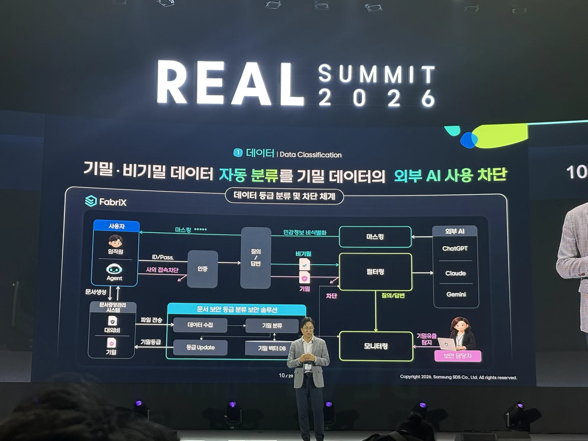

대응 구간: 녹음 이전 · 대응 발화 없음

**슬라이드**

데이터 영역의 통제는 문서 등급을 외부 AI 사용 경계와 연결한다. FabriX 도식에는 임직원·Agent의 인증, 질의·답변의 기밀 필터, 외부 AI, 민감정보 비식별화, 보안 운영자의 모니터링이 함께 놓인다.

문서중앙관리시스템에서 받은 문서를 보안 솔루션이 수집·분류하고 기밀 벡터 DB를 참조한다. 분류한 등급은 문서 시스템으로 갱신하며, 질의·답변 필터와 유출 탐지에도 사용한다. 기밀은 외부 AI 전달을 차단하고, 외부 AI 응답 경로에는 마스킹·비식별화가 표시된다. 인증 부분에는 사외 접속 차단이 적혀 있다.

**발표자**

이 사진은 데이터 영역에 해당하지만 현재 녹음은 다음 권한 영역 중간부터 시작한다. 슬라이드 밖의 설명이나 운영 성과는 복원할 수 없다.

## 02 · 위임 경계가 없는 Agent의 유출 위험

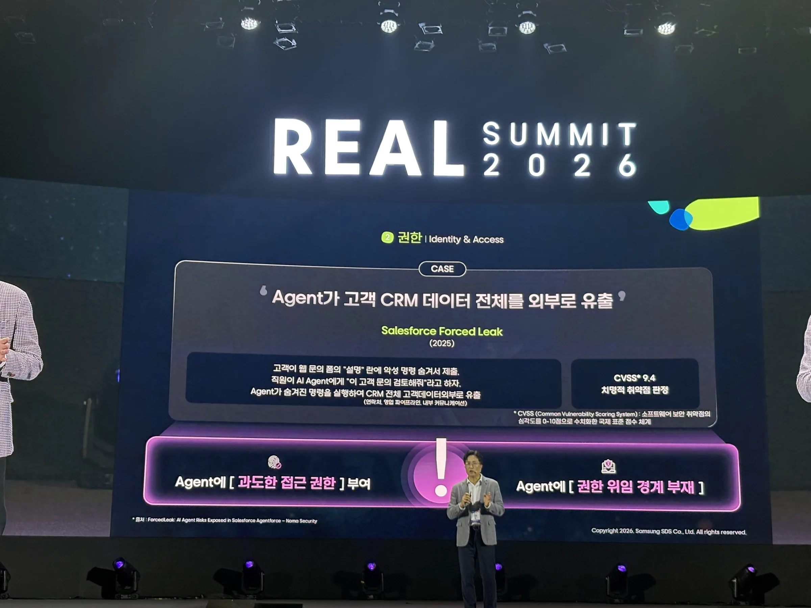

대응 구간: 녹음 이전 · 대응 발화 없음

**슬라이드**

권한 영역의 외부 사례로 **Salesforce Forced Leak (2025)**를 든다. 고객 문의 양식 설명에 악성 지시를 숨기고 직원이 Agent에게 문의 검토를 요청하면 CRM 연락처·영업 파이프라인·내부 커뮤니케이션이 외부로 유출되는 흐름이다.

슬라이드는 CVSS **9.4**, 과도한 접근 권한과 위임 경계 부재를 제시한다. 하단 출처는 Noma Security의 *ForcedLeak: AI Agent Risks Exposed in Salesforce Agentforce*다. 이는 발표가 인용한 외부 보안 연구 사례이며 삼성SDS에서 발생한 사고를 뜻하지 않는다. 실제 피해 범위와 연구 재현 조건은 사진만으로 확인되지 않는다.

**발표자**

해당 사례를 설명한 발화는 이 녹음에 없다.

## 03 · 사용자의 권한을 다단계 위임에도 연결하기

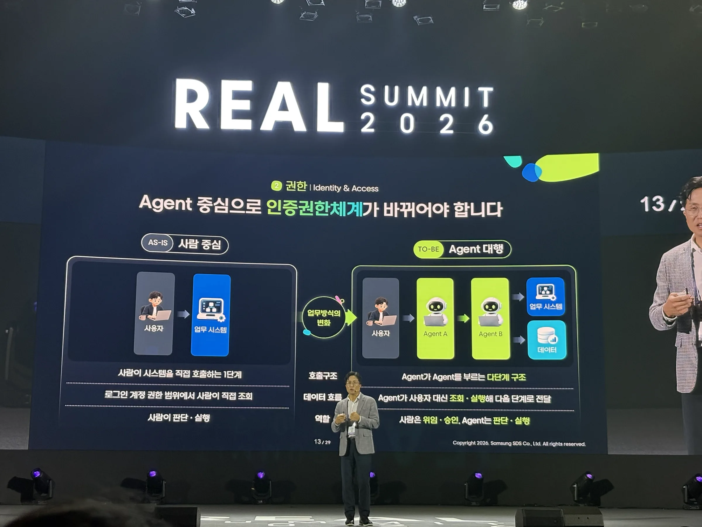

대응 구간: 00:00.510–01:15.450 · 관련 설명의 뒷부분

**슬라이드**

사람이 시스템·데이터에 직접 접근하는 한 단계 구조와, 사용자 → Agent A → Agent B → 시스템·데이터로 이어지는 다단계 구조를 대비한다. 사람의 역할은 **위임·승인**, Agent의 역할은 **판단·실행**으로 나뉜다.

사진은 권한 위임의 개념도다. 녹음의 통합 인증·이력 추적 설명이 사진에 모두 그려져 있다고 보지는 않는다.

**발표자**

녹음은 문장 중간에서 시작한다. 사용자의 권한, 하위 Agent의 권한, 호출하는 시스템·데이터의 권한을 기존 통합 인증 체계와 맞추고, 요청과 이력을 추적해야 한다는 설명이 이어진다. Agent가 맡는 업무를 작게 나누어 부여할 권한도 좁히자는 설계 원칙이다.

> 「작은 단위의 업무들, 최소 권한, 최소 단위의 에이전트를 구성하고, 그리고 최소 수준의 권한을 부여하는 것들이 매우 중요하다.」

## 04 · 토큰 단가가 내려도 총지출은 늘어난다

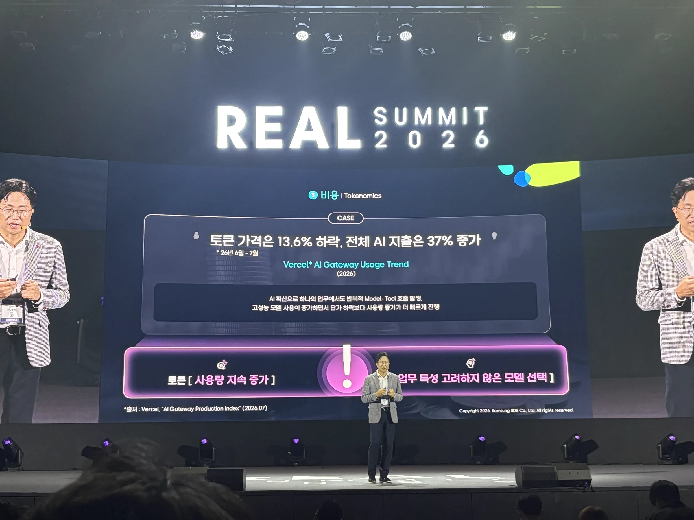

대응 구간: 01:17.550–02:41.370

**슬라이드**

비용 영역의 도입 사례다. **Vercel AI Gateway Usage Trend (2026)**를 인용하며 2026년 6–7월 **토큰 가격 13.6% 하락**, **AI 지출 37% 증가**를 나란히 제시한다. 하단 출처 표기는 *AI Gateway Production Index* (2026.07)다.

반복되는 Model·Tool 호출, 단가 하락을 앞서는 사용량 증가, 업무에 맞지 않는 모델 선택이 문제로 제시된다. 이 통계는 슬라이드의 인용이며 삼성SDS 자체 비용 측정값이 아니다.

**발표자**

Agent는 한 번 호출하고 끝나는 구조와 달리 의도에 맞는지 반복 판단하면서 토큰을 소비한다고 설명한다. 전체 STT와 01:35–02:08 구간 재전사 모두 지출 증가를 **30%**로 인식했다. 사진의 **37%**와 다르므로 어느 쪽도 확정값으로 통일하지 않는다.

> 「토큰 가격은 실제로 13.6%가 떨어졌는데, AI 지출은 오히려 30%가 증가하는」

## 05 · 사용량 확대에서 사용량·비용 통제로

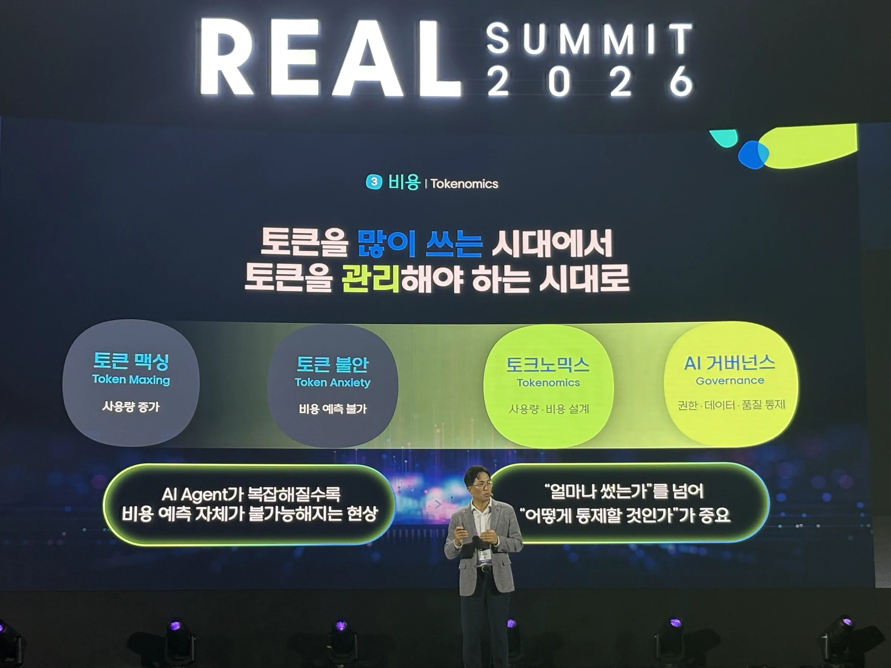

대응 구간: 02:41.490–03:22.890 · 다음 모델 라우팅 도입과 같은 STT 블록

**슬라이드**

“토큰을 많이 쓰는 시대에서 토큰을 관리해야 하는 시대로”라는 흐름이다.

| 단계 | 슬라이드의 의미 |
| --- | --- |
| Token Maxing | AI 사용량 확대 |
| Token Anxiety | 늘어나는 비용과 효과에 대한 불안 |
| Tokenomics | 사용량·비용 설계 |
| AI Governance | 권한·데이터·품질까지 통제 |

Agent가 복잡해질수록 비용 예측이 어려워져 얼마나 쓰는지와 어떻게 통제하는지를 함께 다뤄야 한다.

**발표자**

많이 써 보자는 단계에서 투자 대비 효과를 묻게 되고, 적절한 통제와 절감 수단이 필요해진다고 설명한다. 해결책은 모델 선택과 사용량 관리의 두 축으로 이어진다.

## 06 · 사용자 의도에 맞춰 모델을 고르는 게이트웨이

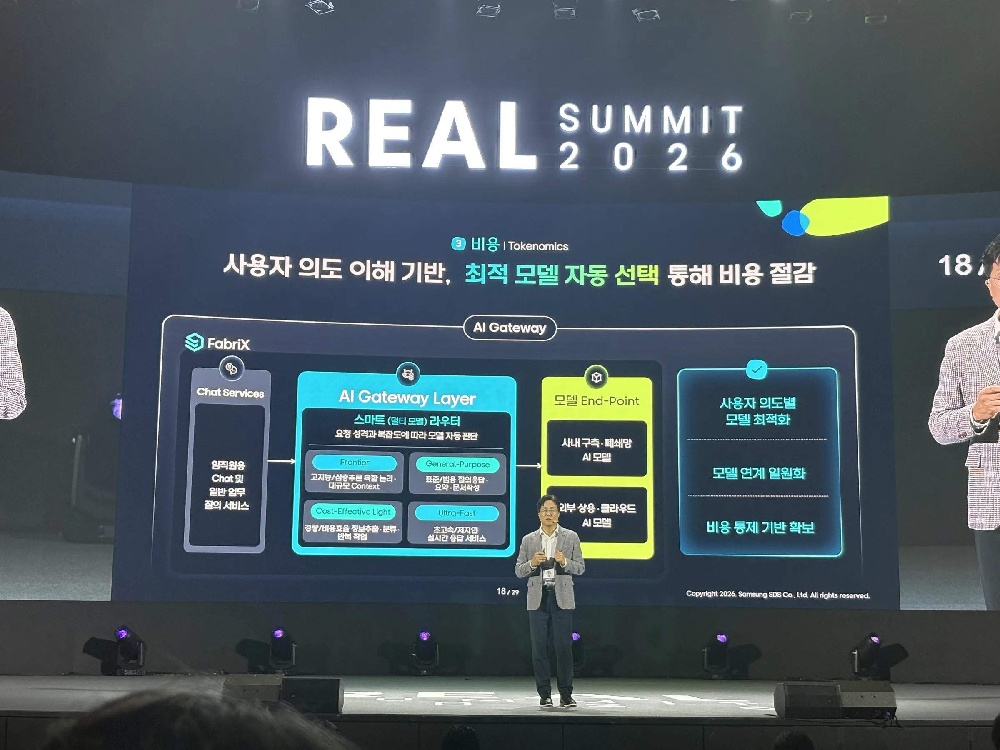

대응 구간: 03:22.950–05:14.730 · 직전 블록에서 도입

**슬라이드**

Chat Services와 내부·외부 모델 사이의 **AI Gateway Layer / Smart Multi-Model Router**를 보여준다. 내부 격리·온프레미스 모델과 외부 상용 클라우드 모델의 접점을 통합한다.

| 모델 유형 | 선택 기준 |
| --- | --- |
| Frontier | 복잡한 추론, 큰 컨텍스트 |
| General-Purpose | 일반 질의, 요약·문서 작업 |
| Cost-Effective Light | 추출·분류 등 반복 작업 |
| Ultra-Fast | 낮은 지연이 중요한 실시간 응답 |

사용자 의도에 맞는 모델 선택과 비용 통제의 기반을 제시한다. 라우터 자체의 분류 알고리즘이나 평가 수치는 보이지 않는다.

**발표자**

사용자가 어떤 모델을 호출할지 알 필요 없이 하고 싶은 일을 말하면, 게이트웨이가 모델 특성과 의도를 대조해 선택하는 구조다. 단순 분류에는 작은 모델, 고난도 추론에는 Frontier, 응답 속도가 중요하면 빠른 모델을 선택한다고 설명한다. 비용을 줄일 수 있는 접근으로 소개했으며 절감률은 제시하지 않았다.

> 「사용자의 목적이 고난도의 생각과 추론을 해야 되거나, 정확한 일을 해야 된다면, 프론티어 모델을 호출하게끔 라우팅해 줄 수가 있을 것이고요.」

## 사용량의 귀속과 실시간 통제 (05:15.450–06:46.350) — 사진 없음

**발표자**

모델 라우팅 다음으로 사용자별·조직별·AI 서비스별 사용량과 비용을 보아야 한다고 설명한다. 삼성 관계사에서 복수의 외부 AI 서비스와 내부 AI를 함께 쓰는 상황을 언급했다. 일부 조직·인력에 사용량이 몰리는 문제는 모니터링뿐 아니라 실시간 통제로 다뤄야 한다는 주장이다.

> 「사용자별로, 조직별로, AI 서비스별로 어떻게 쓰고 있는지를」

> 「실시간으로 이 부분을 통제하고」

구체적인 한도 설정 화면, 초과 요청의 처리 방식, 요금 정산 규칙은 현재 사진·녹취에서 확인되지 않는다.

## 07 · 오작동·탈취·오염에 대한 보안 사례

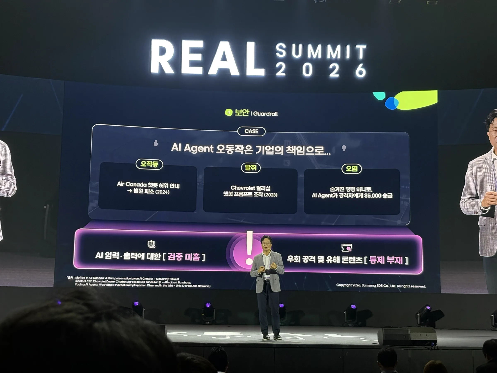

대응 구간: 06:49.410–07:28.050

**슬라이드**

“AI Agent 오동작은 기업의 책임으로…”라는 문제 제기로 외부 사례 세 가지를 나열한다.

| 구분 | 사진의 사례 | 근거 범위 |
| --- | --- | --- |
| 오작동 | Air Canada 챗봇의 잘못된 안내와 법원 패소 (2024) | 사진의 사례 설명이며 판결문을 검토한 법률 판단이 아님 |
| 탈취 | Chevrolet 딜러 챗봇 프롬프트 조작 (2023) | 사진의 외부 사례 |
| 오염 | 숨은 지시로 AI가 공격자에게 5,000달러 송금 | 사진에만 있으며 재현·실제 피해 여부 미확인 |

하단에는 McCarthy Tétrault, AI Incident Database 622, Unit 42의 *Fooling AI Agents: Web-Based Indirect Prompt Injection Observed in the Wild*가 출처로 표시된다. 입력·출력 검증과 통제의 부재를 공통 문제로 묶는다.

**발표자**

Air Canada와 Chevrolet 사례를 언급하지만 사건 설명의 STT가 훼손돼 있다. 고유명사와 사례 구분은 사진을 근거로 적었다. 세 번째 송금 사례의 상세 발화는 확인되지 않는다.

## 08 · 레드 티밍과 입력·출력 가드레일

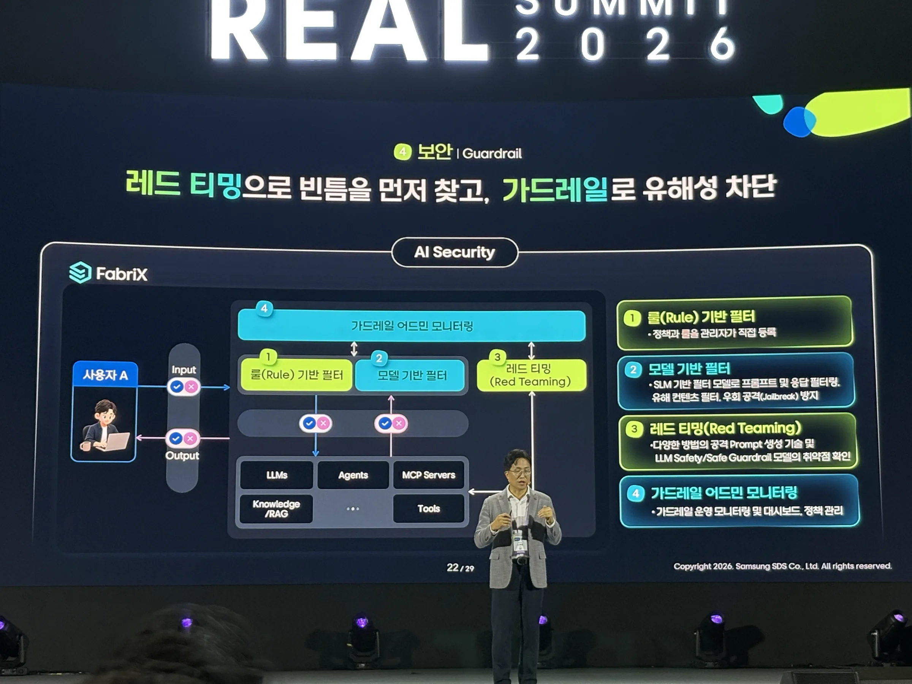

대응 구간: 07:28.110–09:03.450

**슬라이드**

“레드 티밍으로 빈틈을 먼저 찾고, 가드레일로 유해성 차단”을 제시한다. 사용자 입력과 응답 양쪽에 필터를 배치하며, 가운데에는 LLMs·Agents·MCP Servers·Knowledge(RAG)·Tools가 놓인다.

| 구성 | 역할 |
| --- | --- |
| 룰 기반 필터 | 관리자가 정한 정보·보안 정책 검사 |
| 모델 기반 필터 | SLM으로 유해성·탈옥 등 맥락 판단 |
| 레드 티밍 | 공격 프롬프트로 방어 체계의 빈틈 탐색 |
| 관리자 기능 | 정책 관리와 모니터링 대시보드 |

이 사진은 보호 대상의 전체 구상이다. 다음 사진의 **추후** 표기를 함께 봐야 적용 범위를 과장하지 않는다.

**발표자**

질의가 모델에 들어가기 전과 답변이 나온 뒤에 단계별 조치를 둔다. 룰로 표현하기 어려운 맥락은 모델 기반 필터로 판단하고, 공격을 통해 찾은 빈틈을 계속 보완한다고 설명한다.

> 「단순한 룰 기반으로 해결할 수 없는 복잡한 컨텍스트를 이해해서」

## 09 · 조직별 정책과 사용자 응답 경로

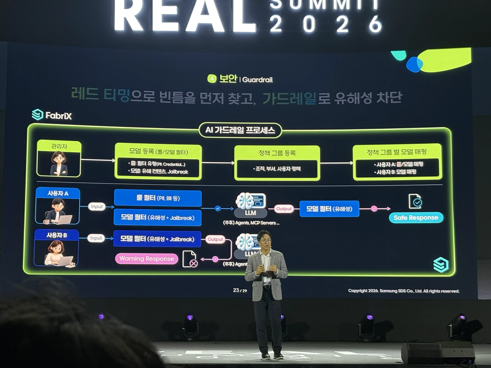

대응 구간: 09:05.850–10:02.730

**슬라이드**

관리자가 모델과 룰·필터를 등록하고 조직·부서·사용자별 정책 그룹을 구성해 모델에 연결한다. 룰 예시는 PII·BII 등이며 모델 필터에는 유해성과 탈옥 판단이 표시된다.

사용자 A 경로는 입력 룰·모델 필터 → LLM → 출력 모델 필터 → Safe Response다. 사용자 B 경로에는 필터 판정에 따른 Warning Response가 있다. 차단된 요청이 반드시 LLM까지 전달된다고 해석하지 않는다.

중앙 대상은 **LLM**이며 **“(추후) Agents, MCP Servers…”**라고 명시돼 있다. Agent·MCP 직접 적용을 이미 완료한 기능으로 기록하지 않는다.

**발표자**

회사 기준을 등록하고 필요하면 각사에 맞는 필터 모델 학습을 거친다고 설명한다. 사용자는 필터의 존재를 의식하지 않고 쓰되, 입력이나 응답이 부적절하면 안내·차단·대체 메시지를 받는 운영 흐름이다. 학습 방법의 STT는 불명확하므로 세부 학습 기법은 확정하지 않는다.

## 10 · Agent가 늘기 전에 인벤토리를 갖추기

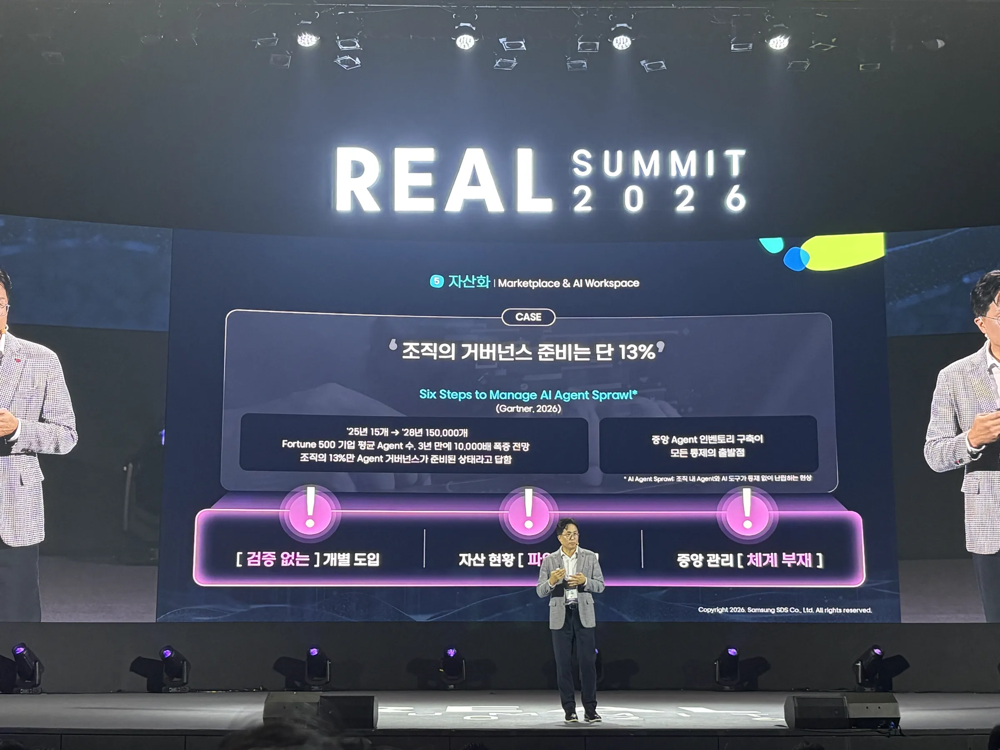

대응 구간: 10:06.390–11:30.990 · 후반부에서 Marketplace로 전환

**슬라이드**

자산화 영역의 문제는 **Agent Sprawl**, 즉 여러 환경에 흩어져 늘어나는 AI 자산이다. 슬라이드 출처는 Gartner의 *Six Steps to Manage AI Agent Sprawl* (2026)다.

Fortune 500 기업의 평균 Agent 수를 2025년 **15개**에서 2028년 **150,000개**로 늘어나는 전망(**10,000배**)으로 제시하고, 대응 준비가 된 응답자는 **13%**라고 적는다. 미래 전망과 조사 수치를 삼성SDS 실제 운영 규모로 해석하지 않는다. 조사 표본·방법은 사진에 없다.

개별 도입과 중앙 관리 부재를 지적하며 중앙 인벤토리를 통제의 출발점으로 삼는다. 하단 일부 문구는 촬영 구도 때문에 가려져 완전하게 옮기지 않았다.

**발표자**

각 환경에서 만든 Skills·Tools·MCP·Agent를 모아 통합 사용해야 한다고 설명한다. 13%와 중앙 인벤토리의 필요성은 녹취에서도 확인된다. 출처 발화는 “파트너” 등으로 인식돼 있어 **Gartner는 사진 표기**로만 확정한다.

> 「결국 중앙에서 에이전트의 전체 인벤토리, 에이전트의 전체, 전체 에이전트의 AI 어셋을 모아서 관리하는 부분들이 이 거버넌스의 출발점이다」

## 11 · 검증된 자산의 등록·유통과 대화형 업무 공간

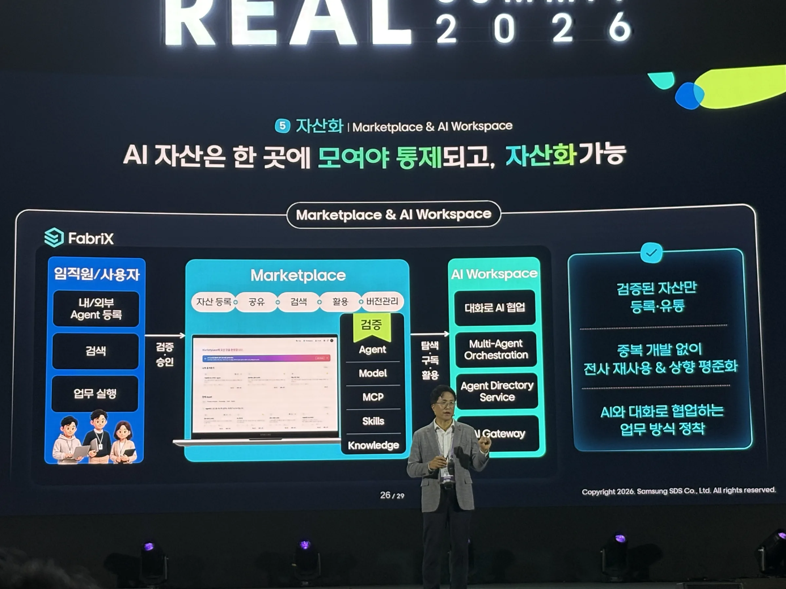

대응 구간: 11:31.170–13:33.090 · 등록 설명은 직전 블록에서 시작

**슬라이드**

Marketplace는 **Agent·Model·MCP·Skills·Knowledge**의 등록·공유·검색·사용·버전을 관리한다. 검증된 자산을 등록해 재사용하는 흐름이다.

AI Workspace에는 대화·협업, Multi-Agent Orchestration, Agent Directory Service, AI Gateway가 배치돼 있다. 검증된 자산만 유통하고 중복 개발을 줄이며 대화로 업무를 수행하는 방향을 보여준다.

**발표자**

등록 때 사내 개발·운영 프로세스 준수 여부를 확인하고, 사용 때 사용자·Agent·하위 시스템·데이터 권한을 맞춘다고 설명한다. Workspace는 권한 있는 Agent를 의도에 맞게 찾고 오케스트레이션하며 게이트웨이로 모델을 선택한다. 전사 재사용과 대화형 업무 통합은 기대 효과로 표현했다.

> 「등록할 때 실제로 사내에 있는 에이전트를 만들고 개발하고 운영하는 프로세스를 준수했는지를 체크해서」

## 12 · 다섯 통제 영역을 하나의 거버넌스로

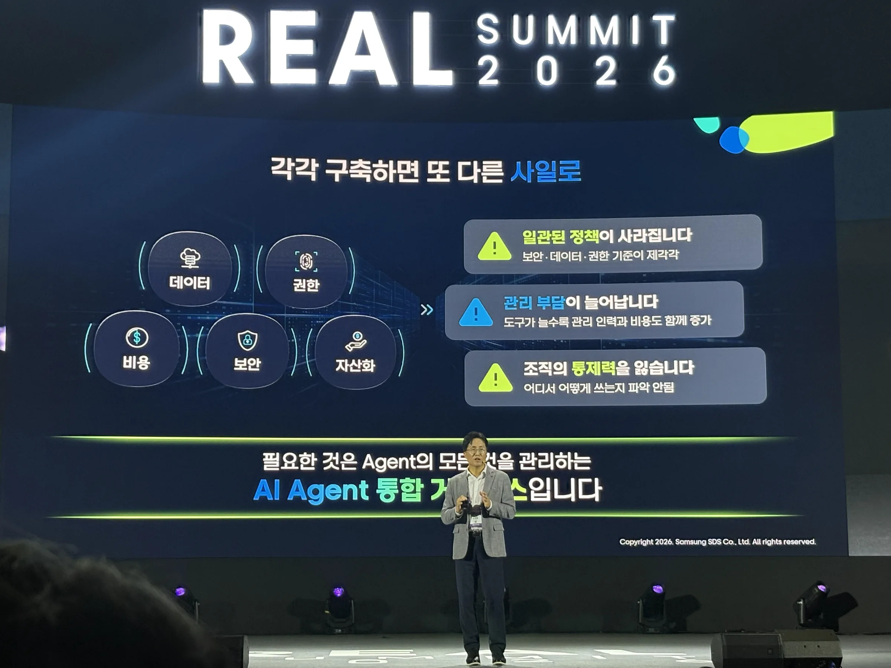

대응 구간: 13:35.490–14:17.010 · 후반부에서 플랫폼 소개로 전환

**슬라이드**

데이터·권한·비용·보안·자산화를 각각 구축하면 정책이 불일치하고 관리 부담이 커지며 전사 통제력을 잃을 수 있다는 그림이다. 개별 영역을 연결하는 **AI Agent 통합 거버넌스**가 결론이다.

**발표자**

다섯 항목의 개별 구축으로 생기는 분절을 지적하고 FabriX를 기업의 통합 Agent Governance 플랫폼으로 소개한다. STT의 “사이버 벤처”처럼 훼손된 표현을 직접 인용하지 않고, 분절된 영역의 통합이라는 사진과 발화의 공통 의미만 요약한다.

## 통합 플랫폼의 생성·등록·사용 흐름 (14:17.070–15:01.410) — 사진 없음

**발표자**

직전 블록에서 시작한 FabriX 소개가 이어진다. 프롬프트, 업무 프로세스 기반 워크플로우, 바이브 코딩 환경 등으로 Agent를 만들고 Marketplace에 등록하는 흐름이다. 등록된 Agent·자산이 기존 시스템·데이터·인증 권한 체계와 연결된다고 설명한다. 이 부분의 전체 플랫폼 구성도는 사진이 없어 보이지 않는 연결이나 내부 컴포넌트를 그리지 않았다.

## 마무리 (15:03.930–15:48.630) — 사진 없음

**발표자**

> 「저희 SDS는 에이전트 도입이 리스크라고 생각하지 않고요.」

데이터·권한·비용·보안·자산의 통제 문제를 다시 언급하며 마무리한다. Michael Dell 관련 인용은 고유명사와 부정 표현이 불명확하다. 전체 STT의 “통제력이 있는 것이 리스크”는 재전사에서도 해소되지 않아, 이를 “없는 것이”로 고쳐 외부 인사의 확정 인용문으로 만들지 않았다. 마지막 인사말 역시 STT 오류가 있어 별도 인명으로 해석하지 않는다. 질의응답은 확인되지 않는다.

## 재구성하면서 남긴 것

| 항목 | 확인 내용과 처리 |
| --- | --- |
| 녹음 범위 | 952.128초 중 STT 발화는 00:00.510–15:48.630. 도입과 데이터·권한 전반부는 없음. 전체 30분 발표를 복원했다는 뜻이 아님 |
| 사진 없는 구간 | 05:15–06:46 사용량 통제, 14:17–15:01 플랫폼 소개, 15:03–15:48 마무리. 앞뒤 STT 블록에 주제 전환 일부 포함 |
| 비용 충돌 | 사진 04는 지출 +37%, 전체 및 구간 재전사는 +30%. 토큰 단가 -13.6%는 일치. 원 인용 자료를 검증한 수치로 취급하지 않음 |
| 출처·이름 | 발표자·제목은 program.png, FabriX·Gartner 등 표기는 사진 근거. STT 고유명사를 원문에서 수정하지 않음 |
| 적용 범위 | 사진 08의 전체 보호 구상과 사진 09의 LLM 적용·Agents/MCP 추후 표기를 구분 |
| 외부 사례 | ForcedLeak, 챗봇 사례, Gartner 전망은 발표에 제시된 인용. 실제 피해·조사 조건·발표 외의 사실은 검증하지 않음 |
| 마지막 발화 | 15:04–15:51 재전사로도 부정 표현이 불명확. 외부 인사 인용을 확정하지 않음 |
| 재전사 | 01:35–02:08, 10:42–11:30, 15:04–15:51. 각 클립의 토큰 시각은 클립 시작 기준이며 JSON의 start를 더해야 원음 시각이 됨 |
| 가림·누락 | 사진 10 일부 하단 가림. 라우팅 평가·필터 오탐률·실제 절감률·전사 사용 규모는 미제시 |
| 사진 식별 | 12장 모두 다섯 거버넌스 영역과 이어지며 본문에 전부 연결. 미식별·제외 사진 없음 |

# 최종 정리 — Agent의 실행을 데이터·권한·비용·보안·자산 기준으로 통제하기

이 발표는 고객사별 구축 성과 보고보다 통제 문제와 FabriX의 대응 구조를 설명한다. 네 가지 설계 사례로 묶되, 외부 사고 예시·제품 구조·기대 효과를 구분한다.

## 사례 1 — 외부 AI 사용과 Agent 위임에 업무 경계 남기기

### 문제 — 사람의 접근 권한만으로는 위임된 실행을 설명하기 어렵다

기밀 문서가 외부 AI로 나가거나, Agent가 사용자의 의도를 넘어 CRM 등 하위 자원에 접근할 수 있다. 다단계 호출에서는 누가 무엇을 허용했는지 추적해야 한다.

### 만든 개념 — 데이터 등급과 최소 권한을 실행 경계로 삼는다

데이터의 외부 전달 가능 여부를 분류하고, Agent의 업무와 권한을 작게 제한한다. 위임 뒤에도 사용자·Agent·하위 시스템의 권한을 함께 확인한다.

### 적용과 아키텍처

문서 분류 결과는 기밀 필터·모니터링과 연결된다. 사용자에서 하위 Agent와 시스템으로 이어지는 실행은 기존 통합 인증 체계와 맞추고 이력을 추적한다. 사진 01의 데이터 경계와 사진 03 및 00:00–01:15의 권한 설명이 근거다.

### 결과

분류·차단 구조와 위임 통제 원칙을 확인했다. 데이터 영역의 발화, 권한 전파 프로토콜, 유출 감소율과 적용 고객 규모는 확인되지 않는다.

## 사례 2 — 모델 선택과 사용량 통제를 함께 설계하기

### 문제 — 단가 인하가 총비용 감소로 이어지지 않는다

반복 호출과 과도한 모델 선택이 지출을 키운다. 여러 내부·외부 AI를 쓰면 누가 얼마를 쓰는지도 분산된다.

### 만든 개념 — 업무 의도로 모델을 고르고 비용을 사용 주체에 귀속한다

복잡도·응답 속도에 맞는 모델을 선택하면서 사용자·조직·서비스별 사용량을 관찰하고 통제한다.

### 적용과 아키텍처

Chat Services와 모델 사이의 AI Gateway가 네 유형의 모델로 요청을 라우팅한다. 별도로 여러 AI 서비스의 사용량을 모니터링하고 과도한 사용을 실시간 제어하는 접근을 설명한다.

### 결과

라우팅 구조와 사용량 관리의 방향을 확인했다. 실제 비용 절감·품질 유지 수치는 없다. 외부 지출 통계의 사진 37%와 STT 30%는 충돌 상태로 남긴다.

## 사례 3 — 가드레일 정책과 공격 검증을 운영에 넣기

### 문제 — 신뢰할 수 없는 입력과 응답이 업무 결과가 된다

악성 지시와 잘못된 안내가 실행·고객 응답으로 이어진다. 조직별로 막아야 하는 정보도 다르다.

### 만든 개념 — 규칙 검사와 맥락 판단을 분리하고 빈틈을 반복 점검한다

룰·모델 기반 필터로 입력과 출력을 검사하고 레드 티밍으로 방어의 빈틈을 찾는다.

### 적용과 아키텍처

관리자가 정책 그룹과 필터를 모델에 연결한다. 사용자 요청은 검사 후 LLM에 전달되거나 경고 응답을 받고, 모델 출력도 검사한다.

### 결과

정책 구성과 필터 응답 경로가 제시됐다. 사진 09에서 Agents·MCP Servers는 추후 적용 대상으로 표시된다. 방어 성공률·오탐률·지연 수치는 공개되지 않았다.

## 사례 4 — 자산 등록을 전사 사용의 검증 관문으로 삼기

### 문제 — 흩어진 자산과 통제 체계는 재사용과 일관된 정책 적용을 어렵게 한다

각 환경에서 Agent·MCP·Skills가 생기고 다섯 통제 영역도 별도로 구축되면 자산 상태와 사용 권한을 한 흐름으로 다루기 어렵다.

### 만든 개념 — 중앙 인벤토리와 검증된 유통을 묶는다

자산을 모으는 데서 출발해 등록 때 개발·운영 절차를 확인하고, 사용 때 권한을 확인한다.

### 적용과 아키텍처

Marketplace의 자산을 AI Workspace의 Directory Service·멀티 Agent 오케스트레이션·AI Gateway로 찾아 사용한다. 개별 통제 영역은 통합 거버넌스 관점에서 연결한다.

### 결과

등록·사용 경계와 Workspace 구성이 제시됐다. 전사 중복 개발 감소와 대화형 업무 통합은 발표자가 기대한 효과이며 측정 결과가 아니다. Gartner의 전망값을 실제 자산 수로 기록하지 않는다.

## 네 사례에서 가져갈 경험

1. **위임해도 권한 검사는 이어져야 한다.** 하위 호출의 주체·자원·허용 행위를 식별할 수 있어야 한다.
2. **비용 통제에는 선택과 귀속이 모두 필요하다.** 업무별 품질 기준과 사용자·조직별 사용량 집계가 있어야 라우팅과 한도를 판단할 수 있다.
3. **필터의 적용 범위를 명시해야 한다.** LLM 응답 검사와 Agent의 실제 실행 통제는 같은 완료 상태로 취급할 수 없다.
4. **등록과 사용은 별도 검증 지점이다.** 중앙 목록을 만드는 것에 더해 등록 기준과 사용 권한을 운영해야 한다.

## 원료와 변환 기록

- [행사 프로그램](program.png) · [STT 원문](transcript.txt) · [Soniox 원시 결과](transcript.soniox.json)
- [음성 원본 M4A](recording.m4a) · [PCM WAV](recording.wav) · [의심 구간 재전사](audio-verification.soniox.json)
- WAV: PCM signed 16-bit, 모노, 16 kHz. 원본의 파생본이며 M4A는 보존했다.
- 사진: HEIC 원본을 보존하고 긴 변 최대 2400px, WebP 품질 82로 변환했다. 아래 대응표는 촬영 순서와 파생본을 연결한다.

| 원본 | 변환본 |
| --- | --- |

| IMG_3816.HEIC | [01-data-classification-external-ai.webp](01-data-classification-external-ai.webp) |

| IMG_3817.HEIC | [02-delegated-permission-risk.webp](02-delegated-permission-risk.webp) |

| IMG_3818.HEIC | [03-agent-delegation-identity.webp](03-agent-delegation-identity.webp) |

| IMG_3819.HEIC | [04-token-price-total-spend.webp](04-token-price-total-spend.webp) |

| IMG_3820.HEIC | [05-tokenomics-control.webp](05-tokenomics-control.webp) |

| IMG_3821.HEIC | [06-intent-based-model-routing.webp](06-intent-based-model-routing.webp) |

| IMG_3822.HEIC | [07-agent-security-incidents.webp](07-agent-security-incidents.webp) |

| IMG_3823.HEIC | [08-guardrail-red-teaming.webp](08-guardrail-red-teaming.webp) |

| IMG_3824.HEIC | [09-guardrail-policy-groups.webp](09-guardrail-policy-groups.webp) |

| IMG_3825.HEIC | [10-agent-inventory-sprawl.webp](10-agent-inventory-sprawl.webp) |

| IMG_3826.HEIC | [11-governed-marketplace-workspace.webp](11-governed-marketplace-workspace.webp) |

| IMG_3827.HEIC | [12-integrated-governance.webp](12-integrated-governance.webp) |
