# 발표 재구성 — 기업 AX를 위한 SW 개발 전략 (REAL SUMMIT 2026, 2026-09-08)

발표자: 신창민 상무 (삼성SDS) · 확보 음성 22분 8.0175초
원료: `transcript.txt`(Soniox 실시간 전사 35블록, 00:00–22:07) + `recording.webm`/`recording.wav` + 사진 17장 + `program.png`

사용자가 제공한 [행사 프로그램](program.png)으로 제목 **기업 AX를 위한 SW 개발 전략**, 발표자 **신창민 상무 · 삼성SDS**, 배정 시간 **16:10–16:40**을 확인했다. 원료는 `reference/2026-09-08-real-summit/transcripts/14.md`와 기존 `assets/S-005/IMG_3850.HEIC`–`IMG_3866.HEIC`다. 기존 S-004 거버넌스 발표와 구분해 S-005로 보관한다.

> **STT에 고유명사와 주요 용어 오류가 있다.** 원문은 보존하고, 사진 표기와 선택 구간의 Soniox 재전사를 별도 근거로 사용했다. 원문 상태 `generating/running`은 당시 수집 메타데이터이며 현재 작업 상태가 아니다. 사진 속 업계 통계와 사내 측정값도 구분한다.

음성은 WebM/Opus 조각 두 개가 이어진 원본이다. 조각별로 샘플 시각을 재설정해 16 kHz 모노 PCM WAV로 변환하고 파일 순서대로 연결했다. 원본 바이트는 `recording.webm`에 그대로 남겼다. WAV 길이는 1328.0175초이며 STT 끝 1327초와 약 1초 차이다. 원 STT 시각은 회의 기준이고 WAV는 샘플 기준이어서 소수점 단위 정렬까지 보장하지 않는다.

음성 대조는 직접 청취가 아니라 Soniox 구간 재전사다. 00:00–00:35, 12:08–13:07, 17:20–19:02, 21:40–22:08을 확인했고 결과는 `audio-verification.soniox.json`에 보존했다.

## 도입과 발표 순서 (00:00–00:42) — 사진 없음

아키텍처와 사내 코드 Agent 개발 경험을 바탕으로 기업 AX에 적용할 시사점을 공유한다고 소개한다. 사내·해외 개발자를 언급하지만 조직·사용자 규모는 확인되지 않는다. 원 STT의 이름은 “한민”, 재전사는 “신탐민”으로 인식됐지만 행사 프로그램으로 **신창민 상무**를 확인했다. 전사 원문은 수정하지 않았다.

발표 순서는 개발 변화, AI 개발의 이상과 현실, SW 개발 AX 전략, 기업 AX로의 확장이다. 사진의 II·III·IV 표기와 이어지지만 I부의 전체 슬라이드는 확보하지 못했다.

## 01 · 구현 처리량과 리뷰 병목

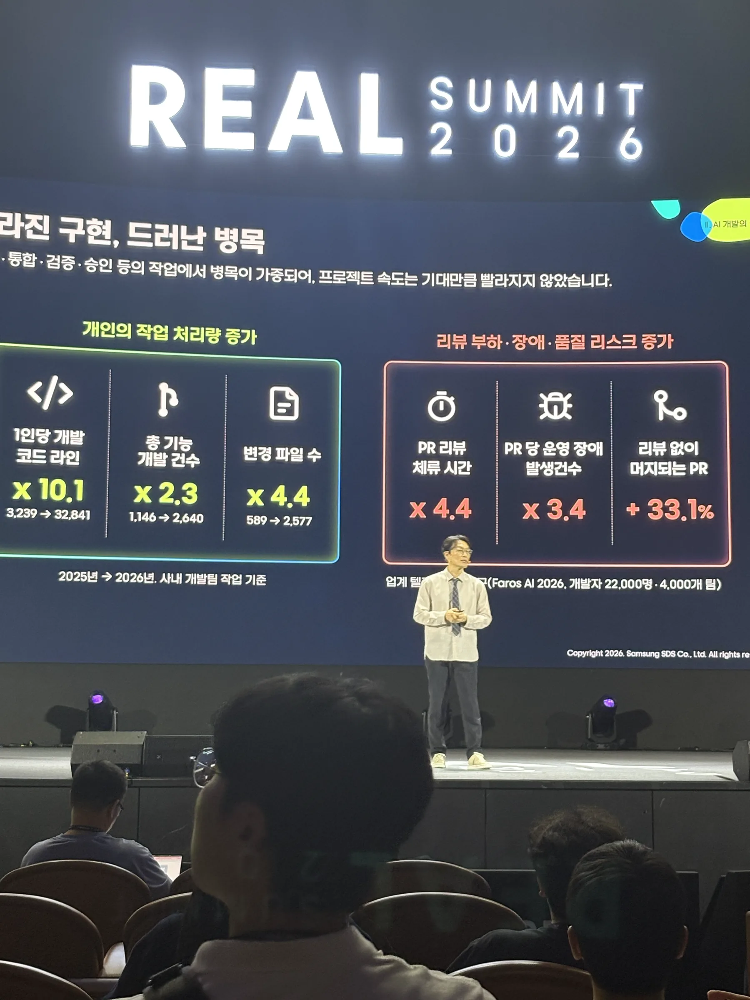

대응 STT: 00:42–01:19 및 다음 블록 초반. 실제 슬라이드 전환 시각이 아니라 주제 대응 범위다.

**슬라이드**

사진 제목은 왼쪽이 잘렸지만 “빨라진 구현, 드러난 병목”으로 읽힌다. 개인 처리량과 프로젝트의 리뷰·품질 부담을 대비한다.

| 구분 | 지표 | 사진의 수치 | 범위 |
| --- | --- | --- | --- |
| 사내 개발팀 | 1인당 개발 코드 라인 | 3,239 → 32,841 · ×10.1 | 2025년 → 2026년 사내 개발팀 작업 기준 |
| 사내 개발팀 | 총 기능 개발 건수 | 1,146 → 2,640 · ×2.3 | 같은 표의 사내 기준 |
| 사내 개발팀 | 변경 파일 수 | 589 → 2,577 · ×4.4 | 같은 표의 사내 기준 |
| 업계 텔레메트리 | PR 리뷰 체류 시간 | ×4.4 | Faros AI 2026 · 개발자 22,000명·4,000개 팀 표기 |
| 업계 텔레메트리 | PR당 운영 장애 발생 건수 | ×3.4 | 같은 외부 자료 인용 |
| 업계 텔레메트리 | 리뷰 없이 머지되는 PR | +33.1% | 퍼센트포인트인지 확인 불가 |

서로 다른 집단의 수치다. 오른쪽을 삼성SDS 사내 장애 증가로 해석하거나 왼쪽과 직접 인과 비교하지 않는다.

**발표자**

개인의 구현이 빨라져도 리뷰·승인 쪽으로 병목이 옮겨 프로젝트 전체 생산성이 같은 비율로 오르지 않는다는 설명이다. STT의 “전술력” 등은 문맥과 사진에 비춰 병목 설명으로 요약한다. 사진 수치 전부를 발화로 확인한 것은 아니다.

## 02 · 코드 생성이 먼저 빨라진 이유

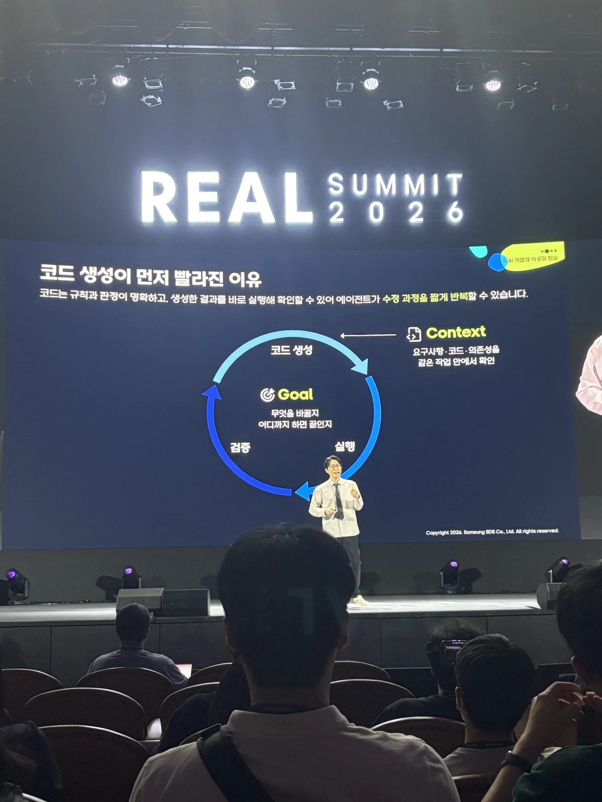

대응 STT: 01:19–02:39 중 전반. 실제 슬라이드 전환 시각이 아니라 주제 대응 범위다.

**슬라이드**

Goal은 무엇을 바꿀지와 어디까지 하면 끝인지다. Context는 요구사항·코드·의존성을 같은 작업 안에서 확인하는 기반이다. 코드 생성 → 실행 → 검증의 짧은 반복 루프를 그린다.

**발표자**

개발은 규범·표준이 있고 필요한 정보를 한 공간에 모을 수 있으며 테스트·빌드·정적 분석으로 결과의 피드백을 바로 받을 수 있다고 설명한다.

> 「테스트나 빌드, 정적 분석 도구를 통해서 내가 한 것이 잘된 건지, 못된 건지 바로바로 피드백을 받을 수 있고」

## 03 · 개인 루프와 프로젝트 프로세스

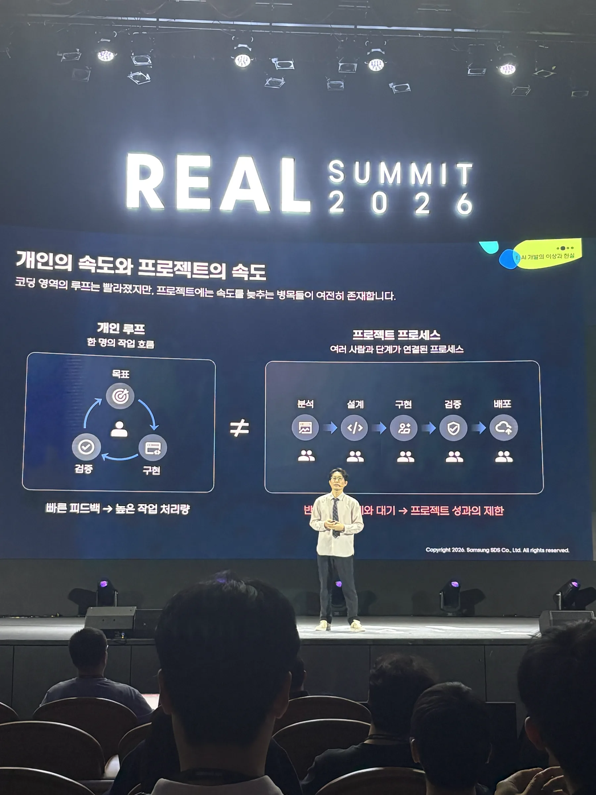

대응 STT: 02:01–03:23 중 프로젝트 설명. 실제 슬라이드 전환 시각이 아니라 주제 대응 범위다.

**슬라이드**

개인의 목표·구현·검증 루프와 분석 → 설계 → 구현 → 검증 → 배포의 프로젝트 프로세스를 대비한다. 한 사람의 빠른 피드백이 여러 사람·단계를 잇는 속도와 같지 않다는 그림이다. 프로젝트에는 반복적인 인계와 대기가 남는다.

**발표자**

개별 작업이 끝나면 다음 단계로 자료를 전달하고 기다려야 한다. 이 때문에 한 공간에서 얻은 개인 효율이 프로젝트 전반의 성과로 바로 이어지지 않는다고 설명한다.

## 04–05 · 흩어진 목표·맥락·판단 근거

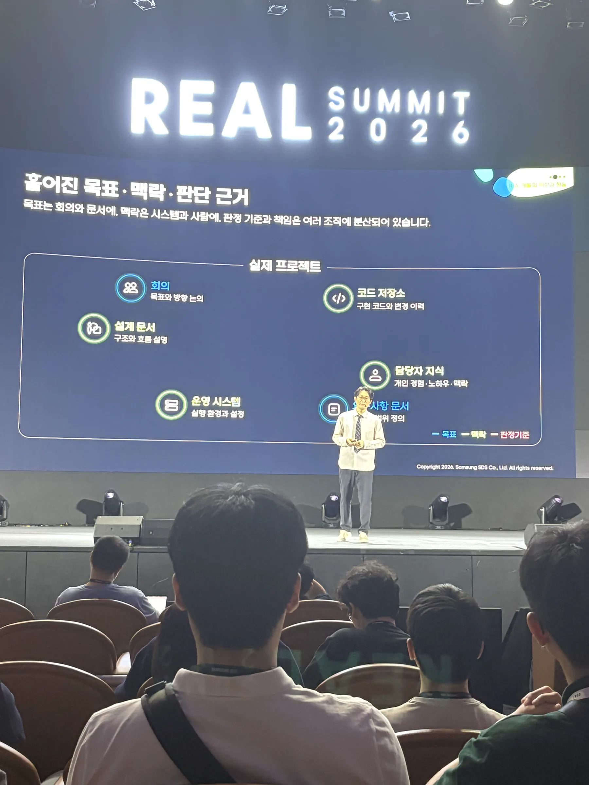

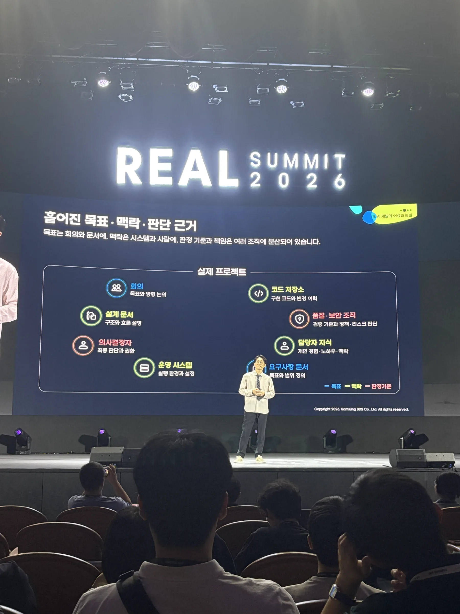

대응 STT: 02:39–04:03. 실제 슬라이드 전환 시각이 아니라 주제 대응 범위다.

**슬라이드**

사진 04에는 회의·요구사항 문서·설계 문서·운영 시스템·코드 저장소·담당자 지식이 흩어져 있다. 사진 05에는 **의사결정자**와 **품질·보안 조직**이 추가돼 판단 기준과 책임도 분산돼 있음을 보여준다.

| 종류 | 위치와 역할 |
| --- | --- |
| 목표 | 회의의 방향 논의, 요구사항 문서의 목표·범위 |
| 맥락 | 설계의 구조·흐름, 운영 환경·설정, 코드·변경 이력, 담당자 경험 |
| 판단 기준 | 의사결정자의 최종 판단·권한, 품질·보안 조직의 검증 기준·정책·리스크 판단 |

두 사진은 같은 주제의 단계적 공개이며 마지막 두 주체가 더해진 차이를 보존했다.

**발표자**

문서가 최신인지 알기 어렵고, 정보를 종합해 판단하는 일은 바쁜 개발 리드나 품질·보안 담당자에게 모인다고 설명한다. 분산된 정보를 이어 주는 역할을 현재 사람이 맡고 있다.

## 06 · 사람이 연결하는 세 지점

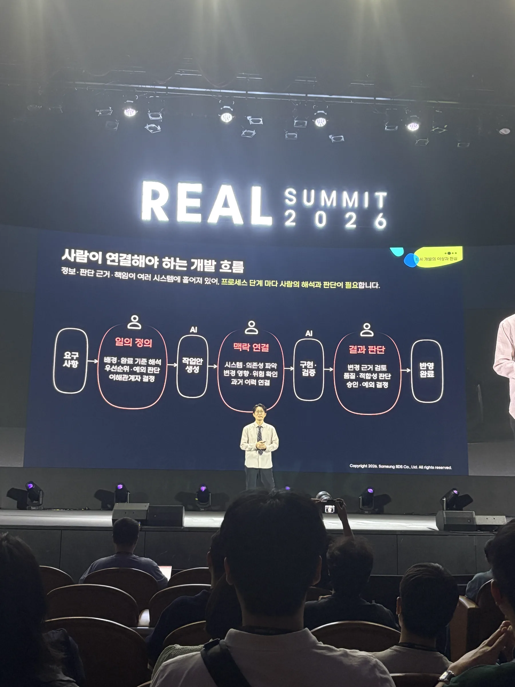

대응 STT: 04:03–04:41. 실제 슬라이드 전환 시각이 아니라 주제 대응 범위다.

**슬라이드**

요구사항 → 일의 정의 → AI 작업안 생성 → 맥락 연결 → AI 구현·검증 → 결과 판단 → 반영 완료의 흐름이다.

| 사람의 지점 | 하는 일 |
| --- | --- |
| 일의 정의 | 배경·완료 기준 해석, 우선순위·예외 판단, 이해관계자 결정 |
| 맥락 연결 | 시스템·의존성 파악, 변경 영향·위험 확인, 과거 이력 연결 |
| 결과 판단 | 변경 근거 검토, 품질·적합성 판정, 승인·예외 결정 |

**발표자**

AI가 구현·검증하는 동안에도 사람이 목표·완료 기준·예외 판단과 데이터를 연결하고 결과를 판단해야 한다. AI가 빨라질수록 이 루프에 사람이 개입하는 횟수도 늘어난다는 지적이다.

## 07 · 코드보다 개발 체계를 바꿔야 한다

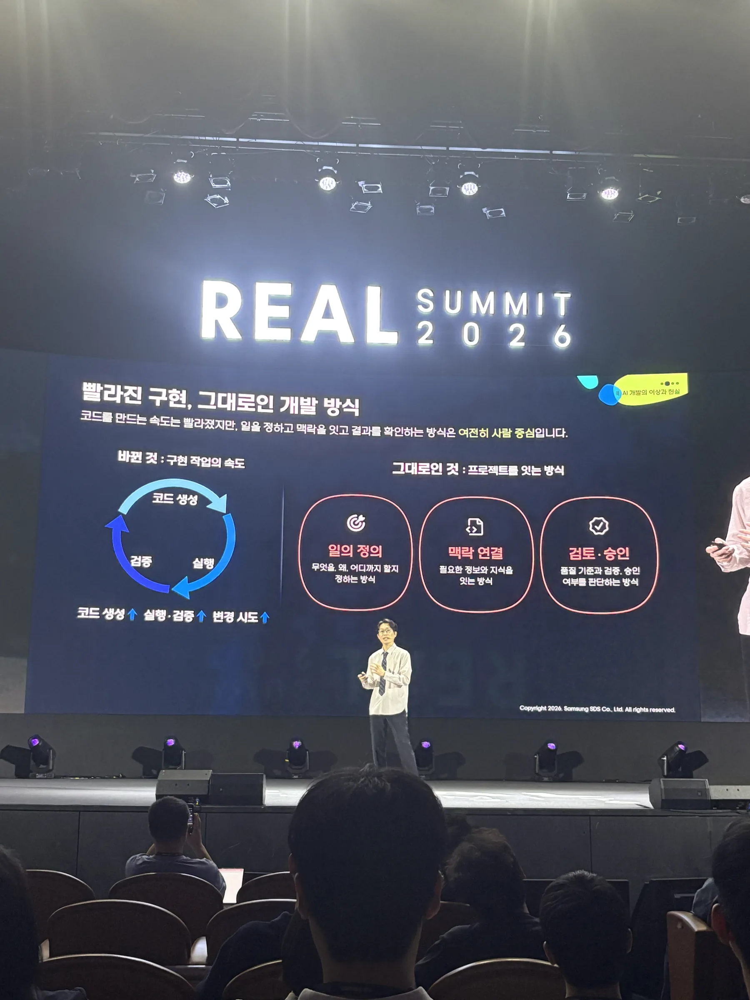

대응 STT: 04:41–05:55 중 전반. 실제 슬라이드 전환 시각이 아니라 주제 대응 범위다.

**슬라이드**

바뀐 것은 코드 생성·실행·검증·변경 시도의 속도다. 그대로인 것은 일의 정의, 맥락 연결, 검토·승인 방식이다. 이 연결 작업은 여전히 사람 중심이라고 대비한다.

**발표자**

코드 생성의 개선만으로 충분하지 않으며 개발 체계 자체를 어떻게 바꿀지 보아야 한다고 전환한다.

> 「개발 체계를 어떻게 바꿀 것이냐를 집중적으로 봐야 한다」

## 08–09 · 작업 단위 위임에서 이벤트 기반 운영으로

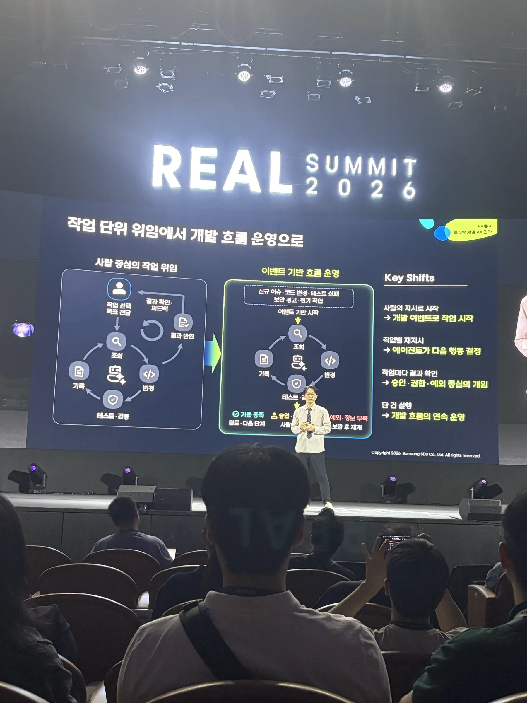

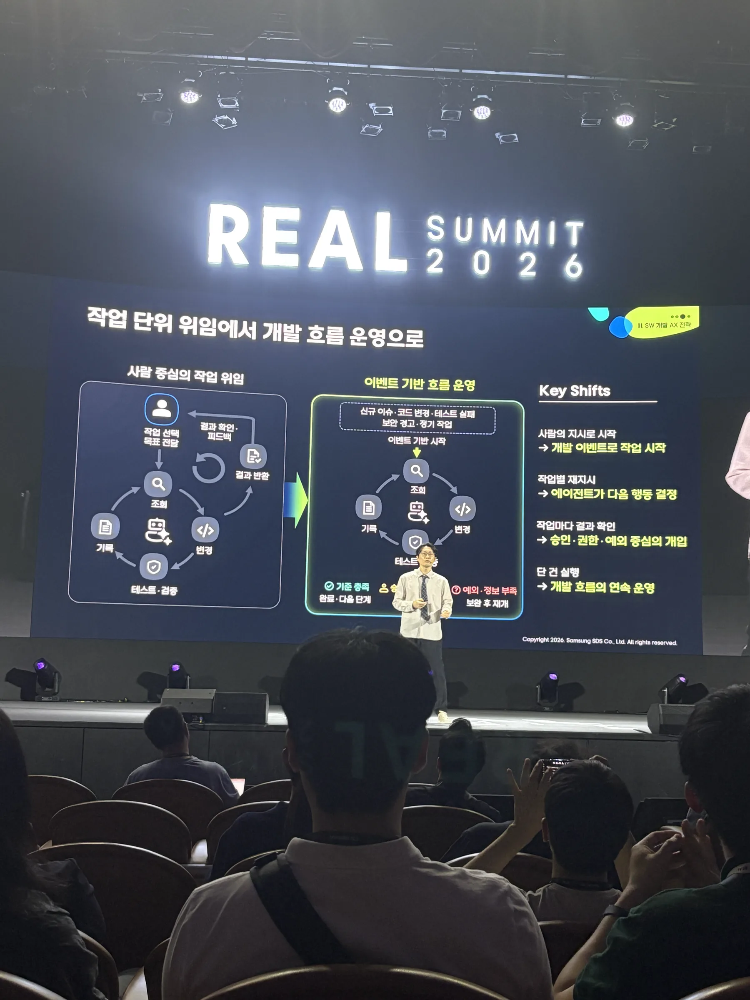

대응 STT: 05:16–07:16. 실제 슬라이드 전환 시각이 아니라 주제 대응 범위다.

**슬라이드**

두 사진은 같은 도식의 촬영 위치·가림이 다른 반복 촬영이며 확인 가능한 구성 차이는 없다.

| 기존 | 전환 방향 |
| --- | --- |
| 사람이 작업 선택·목표 전달 | 신규 이슈·코드 변경·테스트 실패·보안 경고·정기 작업으로 시작 |
| 작업별 재지시 | Agent가 다음 행동 결정 |
| 매 작업 결과 확인 | 승인·권한·예외 중심 개입 |
| 단건 실행 | 개발 흐름의 연속 운영 |

실행 루프는 조회·변경·테스트/검증·기록이다. 기준 충족이면 완료·다음 단계, 승인 필요면 사람의 검토, 예외·정보 부족이면 보완 후 재개한다. 승인 경로 일부는 발표자에 가려져 있으며 발화의 사람 개입 설명과 함께 해석했다.

**발표자**

원하는 이벤트에 스스로 시작하고 기준 충족 후 다음 작업으로 이관하는 흐름을 설명한다. 개발자의 역할은 매 작업을 지시하는 것에서 이 연결 흐름을 설계·운영하는 것으로 옮겨간다.

## 네 설계 관점과 모델·환경 선택 (07:16–09:44) — 사진 없음

**발표자**

모델·환경, 개발 프로세스, 실행을 위한 통제, 지속적인 개선의 네 관점을 설명한다. 좋은 모델 하나를 고르는 문제를 넘어 개발 단계에 맞게 환경을 달리해야 한다는 주장이다.

기술 검토·PoC에서는 외부 자료와 모델을 활용할 수 있는 환경, 프로젝트 구성·공통 개발에서는 상용 서비스 활용, 운영 업무 로직 변경에서는 제한된 권한과 환경을 예로 든다. 실제 배치 방식과 격리 기술은 사진이 없어 확정하지 않는다. “사람별 모델” 등 STT가 모호한 표현은 단계별 설명을 넘어 일반화하지 않았다.

## 자료의 양보다 연결 방식 (09:44–11:05) — 사진 없음

**발표자**

보안 정책이 바뀌었을 때 사람은 요구사항과 변경 위치를 찾아가지만, 연결 정보가 없는 AI는 처음부터 탐색하거나 잘못된 변경을 반복할 수 있다는 예다. 필요한 것은 더 많은 자료가 아니라 해야 할 일을 실행할 수 있게 묶은 작업 맥락이라고 설명한다.

> 「문제는 이 개발 자료들을 연결하는 방식입니다.」

## 10 · 실행 가능한 작업 맥락

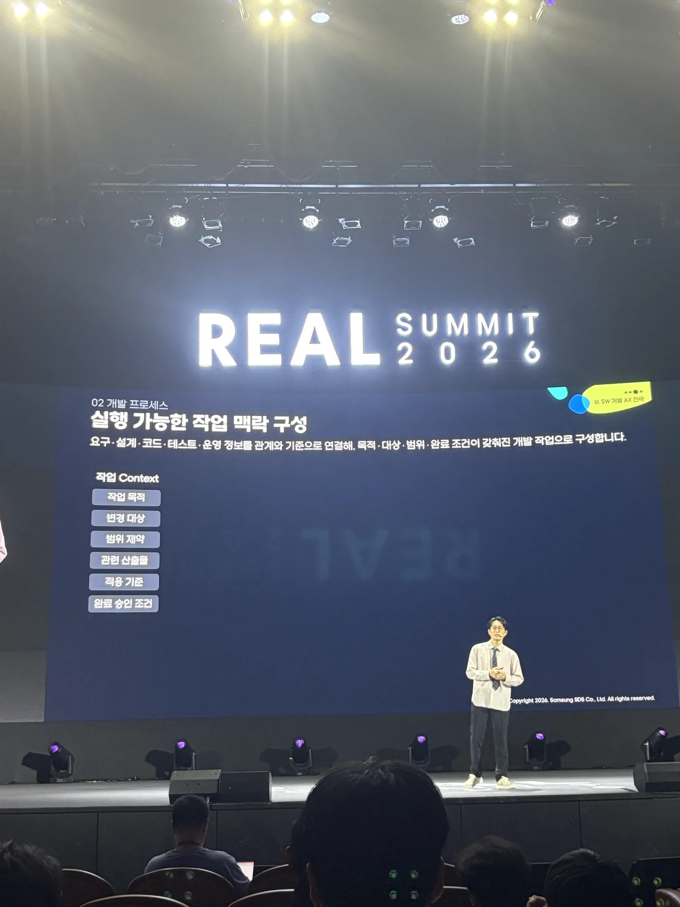

대응 STT: 10:23–11:40. 실제 슬라이드 전환 시각이 아니라 주제 대응 범위다.

**슬라이드**

요구·설계·코드·테스트·운영 정보를 관계와 기준으로 연결해 개발 작업을 구성한다. 작업 Context의 여섯 요소는 **작업 목적, 변경 대상, 범위 제약, 관련 산출물, 적용 기준, 완료 승인 조건**이다.

**발표자**

모든 데이터를 주기보다 무엇을 해야 하는지, 어떤 시스템·컴포넌트를 변경하며 어떤 제약·테스트 조건이 있는지 알려줘야 한다고 설명한다.

> 「작업 목적, 변경 대상, 범위 제약, 관련 사출물, 적용 기준」

## 11 · AI DLC의 산출물 연결과 테스트 결과

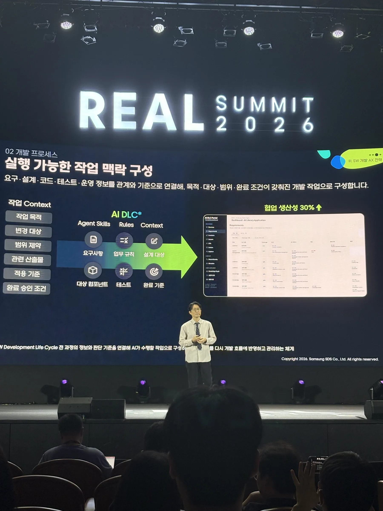

대응 STT: 11:40–12:58. 실제 슬라이드 전환 시각이 아니라 주제 대응 범위다.

**슬라이드**

사진 10의 작업 Context에 **AI DLC**가 더해진다. Agent Skills·Rules·Context와 요구사항·업무 규칙·설계 대상·대상 컴포넌트·테스트·완료 기준을 연결한다. 오른쪽에는 AI DLC Portal 화면과 **“협업 생산성 30% ↑”**가 보인다. 포털의 세부 레코드는 작아 읽을 수 없다.

**발표자**

실행 방식은 Agent·Skill, 표준은 규칙, 관련 정보는 Context로 구성하고 변경된 요구사항의 관련 정보를 갱신하는 체계라고 설명한다. 원 STT의 “AI 데스티니”, “서버 생산성”은 사진 및 재전사와 일치하지 않는다. 구간 재전사는 AI DLC와 **협업 생산성 30% 이상 상승**을 인식했다. 개인에게 AI 도구만 제공한 경우와 비교한 자체 테스트라는 설명이며 표본·기간·측정식은 미공개다.

## 12 · Context 연결 기반의 추가 공개

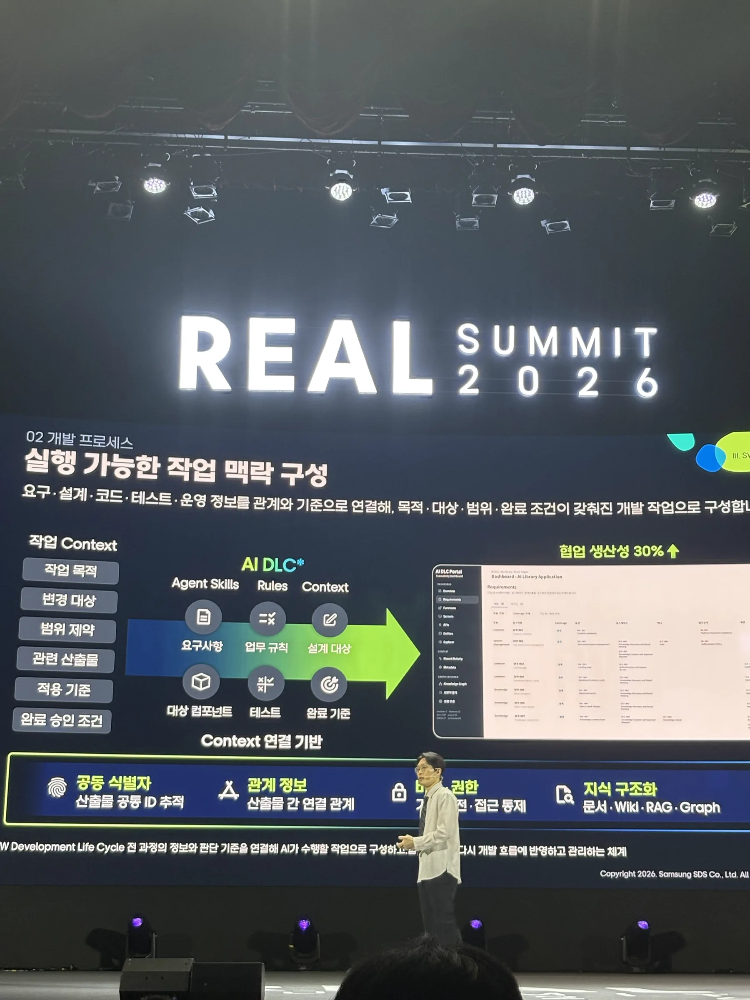

대응 STT: 12:59–13:42 중 전반. 실제 슬라이드 전환 시각이 아니라 주제 대응 범위다.

**슬라이드**

사진 11에 하단 기반이 추가됐다.

| 기반 | 사진 표기 |
| --- | --- |
| 공통 식별자 | 산출물 공통 ID 추적 |
| 관계 정보 | 산출물 간 연결 관계 |
| 버전·권한 | 변경 버전·접근 통제 (일부 가림) |
| 지식 구조화 | 문서·Wiki·RAG·Graph |

특정 그래프 DB나 RAG 구현 제품을 확인할 수는 없다.

**발표자**

산출물이 공통 식별자와 관계 정보로 연결되고 바뀔 때 버전·권한을 함께 관리하며, Agent가 조회·수정 시 이동할 수 있게 지식을 구조화한다고 설명한다. 이 기반의 제공·갱신이 개발자의 중요한 일이 된다는 다음 설명으로 이어진다.

## 13 · 기업 시스템에 직접 접근하는 계층

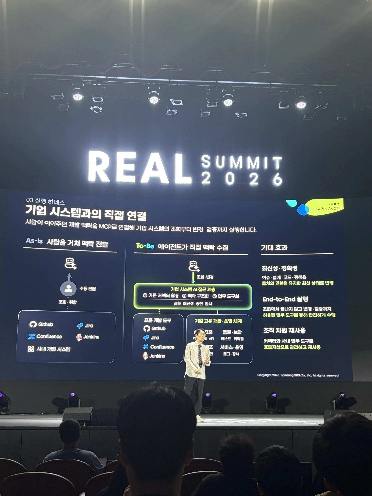

대응 STT: 13:42–14:19 및 직전 블록 후반. 실제 슬라이드 전환 시각이 아니라 주제 대응 범위다.

**슬라이드**

사람이 GitHub·Jira·Confluence·Jenkins·사내 시스템을 조회·취합해 수동 전달하던 흐름을 Agent가 직접 맥락을 수집하는 구조와 대비한다.

기업 시스템 AI 접근 계층은 **기존 커넥터 활용 → 맥락 구조화 → 업무 도구화**, 그리고 **권한·최신성·승인·감사**를 갖는다. 표준 개발 도구와 기업 고유 개발·운영 체계로 연결한다. 기대 효과는 출처·권한을 유지한 최신 정보, 허용된 도구를 통한 변경·검증, 조직 차원의 자산 재사용이다.

**발표자**

MCP뿐 아니라 API나 별도 조회 시스템도 필요할 수 있다고 설명한다. 어느 정보가 최신이고 어디까지 접근 가능한지, 어떤 경로로 접근하는지가 분명해야 한다. 개발자는 개별 기능 구현 외에 AI가 일을 수행할 수 있는 기반을 만드는 역할로 옮겨간다고 설명한다.

## 14–15 · AI Pro의 실행 경계와 감사

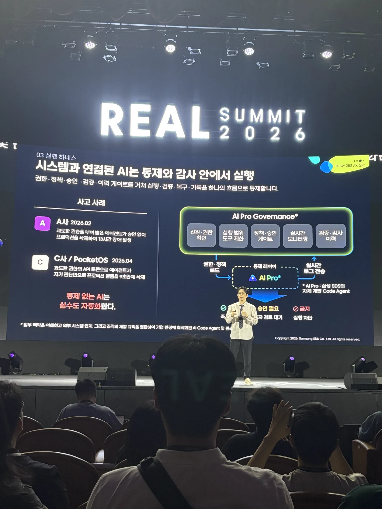

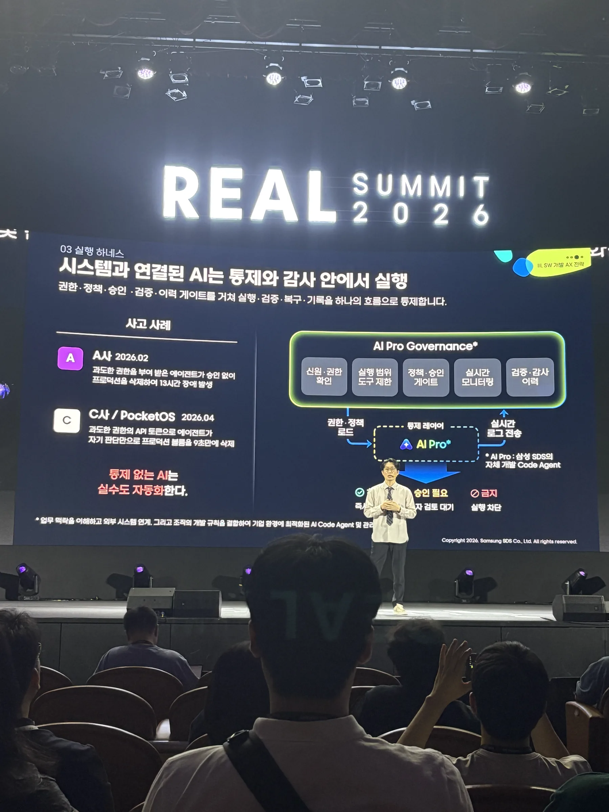

대응 STT: 14:19–15:40. 실제 슬라이드 전환 시각이 아니라 주제 대응 범위다.

**슬라이드**

두 사진은 같은 도식의 반복 촬영이다. AI Pro는 사진 각주에서 **삼성SDS 자체 개발 Code Agent**라고 정의한다.

| AI Pro Governance의 구성 | 역할 |
| --- | --- |
| 신원·권한 확인 | 실행 주체와 허용 범위 확인 |
| 실행 범위·도구 제한 | 실행할 수 있는 도구·범위 한정 |
| 정책·승인 게이트 | 승인 조건 적용 |
| 실시간 모니터링 | 실행 중 관찰 |
| 검증·감사 이력 | 결과와 이력 기록 |

권한·정책을 AI Pro에 로드하고 실시간 로그를 통제 계층으로 보낸다. 결과는 허용된 실행, 승인 필요 시 검토 대기, 금지 시 실행 차단으로 구분한다.

외부 사고 예시는 **A사(2026.02), 승인 없는 프로덕션 삭제와 13시간 장애**, **C사/PocketOS(2026.04), 과도한 API 토큰 권한으로 9초 만에 프로덕션 볼륨 삭제**라는 사진 표기다. A·C사의 실명이나 사고 사실을 추가 추정하지 않는다. 삼성SDS 자체 사고도 아니다.

**발표자**

자율 코드 Agent와 별도로 실행 권한·범위·실시간 모니터링·검증 이력을 관리하는 거버넌스를 함께 만든다고 설명한다. 허용된 범위 안에서는 자율 실행하되 승인 필요와 금지를 구분한다. 이 체계만으로 병목이 모두 없어지는 것은 아니라고 다음 주제로 넘어간다.

## 16 · 운영 이력을 기준·스킬·도구로 환류

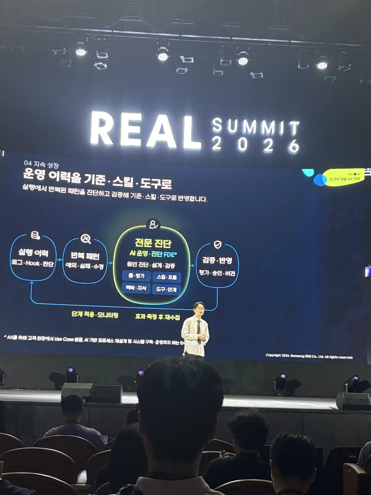

대응 STT: 15:40–17:36. 실제 슬라이드 전환 시각이 아니라 주제 대응 범위다.

**슬라이드**

실행 이력(로그·Hook·판단) → 반복 패턴(예외·실패·수정) → 전문 진단(AI 운영·진단 FDE) → 검증·반영(평가·승인·버전) → 단계 적용·모니터링 → 효과 측정 후 재수집의 순환이다.

전문 진단의 반영 대상은 룰·평가, 스킬·흐름, 맥락·지식, 도구·연계다. 원인 진단·설계·검증을 수행하는 사람의 역할이 가운데 있다.

**발표자**

명확한 테스트 실패는 자동 처리할 수 있어도 변경 영향·예외 위험·승인과 책임은 사람의 판단이 남는다. 판단을 축적해 반복 패턴을 규칙·개발 방식·도구로 바꾸려면 개발·운영 흐름과 내부 시스템을 아는 전문가가 필요하다고 설명한다. FDE는 이 발표의 운영 개선 역할이며 완전 자가학습을 뜻하지 않는다.

## 코드 Agent에서 개발 플랫폼으로 (17:36–19:02) — 사진 없음

**발표자**

AI Pro의 통제·권한, AI DLC의 작업 Context·프로세스·자산, 기존 사내 자산을 AI에 제공하는 프레임워크를 함께 연결하는 방향을 설명한다. 원 STT는 통합 명칭을 “토크노믹스”로 인식했지만 재전사는 “코브닉스”로 달라, 통합 플랫폼의 정식 이름은 미확인으로 남긴다. 프레임워크는 “애니 프레임”으로 인식되며 이 구간에 대응하는 사진이 없다.

처음부터 큰 플랫폼을 계획했다기보다 코드 Agent를 개발하다가 병목과 데이터 부족을 해결하는 과정에서 개발 플랫폼으로 확장됐다는 설명이다. 세 요소를 나열하는 것보다 개발 흐름 전반에 연결해 운영하는 것이 핵심이라고 강조한다.

## 17 · SW 개발 AX에서 기업 업무 시스템의 전환으로

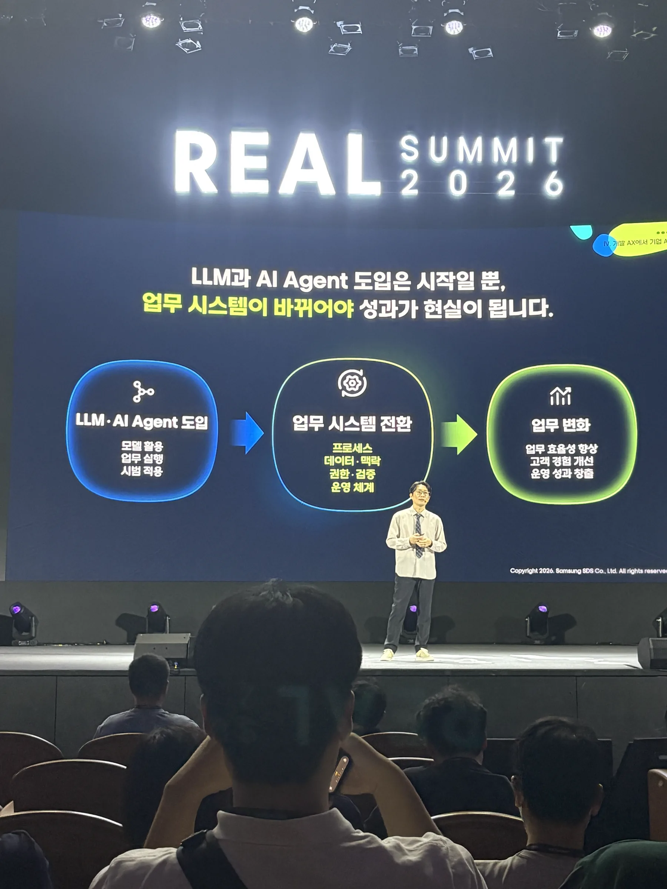

대응 STT: 19:04–20:28. 실제 슬라이드 전환 시각이 아니라 주제 대응 범위다.

**슬라이드**

“LLM과 AI Agent 도입은 시작일 뿐, 업무 시스템이 바뀌어야 성과가 현실이 됩니다.”

모델 활용·업무 실행·시범 적용 → 프로세스·데이터/맥락·권한/검증·운영 체계의 전환 → 업무 효율·고객 경험·운영 성과의 변화라는 세 단계다. 마지막은 목표·기대 효과이며 실제 측정치를 제시한 그림은 아니다.

**발표자**

기업 AX도 AI가 일하는 업무 시스템을 만드는 일이며 모델·환경, 프로세스, 실행 하네스, 지속 성장이라는 관점으로 접근할 수 있다고 설명한다. 개발 체계를 바꾼 경험을 기업 업무 전환의 출발점으로 연결한다.

## 가까운 업무에서 시작하기와 마무리 (20:28–22:07) — 사진 없음

**발표자**

개발팀이라면 자신의 개발 프로세스부터 바꾸고, 하나의 업무를 잘 수행하는 과정에서 병목을 줄여 나가자고 제안한다. 코드 Agent에서 시작해 연계 시스템과 데이터 정비로 확장됐다는 경험을 다시 설명하고 마무리한다. 일부 시스템명은 STT가 훼손돼 복원하지 않았다. 끝 구간 재전사에서도 마무리 발화가 확인되며 질의응답은 없다.

> 「하나의 업무를 어떻게 잘 해내고, 거기서 병목을 줄일 것이냐」

## 재구성하면서 남긴 것

| 항목 | 근거와 처리 |
| --- | --- |
| 발표 식별 | 사용자 지정 14.md와 S-005 사진 17장의 내용이 일치. 제목·신창민 상무·16:10–16:40은 program.png 기준 |
| 음성 변환 | 원본의 EBML 헤더 두 곳에서 분리. 60.7125초와 1267.305초를 디코딩 후 연결. 총 1328.0175초이며 침묵 제거 없음 |
| 음성·STT 시각 | STT 00:00–22:07, WAV 약 22:08. 원 STT는 회의 기준이므로 사진 전환·샘플 정렬을 초 이하로 단정하지 않음 |
| 사진 없는 구간 | 도입, 07:16–11:05의 설계 관점·모델 환경·자료 연결 도입, 17:36–19:02 플랫폼 종합, 20:28 이후 마무리 |
| 연속 사진 | 04→05는 판단 주체 추가, 10→11→12는 작업 Context·AI DLC·연결 기반의 단계적 공개. 08/09와 14/15는 확인 가능한 내용 차이 없는 반복 촬영 |
| 수치 집단 | 사진 01 왼쪽은 사내 개발팀, 오른쪽은 Faros AI 외부 텔레메트리. 같은 집단으로 합치지 않음 |
| 생산성 30% | 사진은 협업 생산성 30% ↑, 원 STT는 서버 생산성 30% 이상, 구간 재전사는 협업 생산성 30% 이상. 발표자의 자체 테스트 주장으로 귀속하고 측정 조건 미공개 표시 |
| 용어 | AI DLC·AI Pro는 사진 표기. 전체 플랫폼 명칭은 재전사로도 확정 불가. 발표자 이름은 행사 프로그램으로 확인 |
| 가림 | 사진 01 왼쪽 제목, 일부 하단 각주와 승인 경로, 포털 레코드·기업 시스템 세부 항목은 가림 또는 작은 글씨로 판독 제한 |
| 외부 사고 | A사·C사/PocketOS 사건은 슬라이드의 인용이며 실제 사건 검증이나 피해 추정은 하지 않음 |
| 원문 보존 | 14.md를 transcript.txt로 바이트 복사. recording.webm도 14.bin과 같은 바이트. HEIC 원본 보존 |

# 최종 정리 — 코드 생성 속도를 개발 흐름의 성과로 연결하기

사내 코드 Agent 개발 과정에서 드러난 네 설계 문제로 묶었다. 네 고객사 구축 사례가 아니라 한 개발 체계의 연결된 문제와 대응이다.

## 사례 1 — 사람이 매번 잇던 작업을 이벤트 흐름으로 바꾸기

### 문제 — 구현이 빨라져도 인계와 승인은 남는다

개인의 짧은 구현 루프와 여러 사람이 참여하는 프로젝트 흐름은 속도를 결정하는 지점이 다르다. 일 정의·맥락 연결·결과 판단이 사람에게 남으면 구현량 증가가 개입 횟수 증가로 이어진다.

### 만든 개념 — 기준과 예외가 있는 연속 운영

사람의 단건 지시 대신 개발 이벤트로 시작하고 조회·변경·검증·기록을 이어간다. 완료 기준과 승인·정보 부족의 분기를 둔다.

### 적용과 아키텍처

신규 이슈·코드 변경·테스트 실패·보안 경고·정기 작업이 실행을 시작한다. 기준 충족 시 다음 단계로, 승인 필요 시 사람에게, 예외·정보 부족 시 보완 후 재개한다.

### 결과

이벤트 기반 운영의 설계가 제시됐다. 실제 프로젝트 리드타임이나 승인 대기 감소 수치는 없다. 사내 처리량과 외부 리뷰 통계는 문제 제기 근거이며 이 설계의 전후 성과가 아니다.

## 사례 2 — 흩어진 자료를 실행 가능한 작업 맥락으로 구성하기

### 문제 — 정보가 많아도 무엇을 바꿀지 연결돼 있지 않다

요구사항·코드·운영 설정·담당자 지식·판정 기준이 분산돼 있다. AI는 관련 대상을 다시 찾거나 오래된 정보로 변경할 수 있다.

### 만든 개념 — 목적·대상·제약·산출물·기준·완료 조건의 묶음

AI DLC는 Agent Skills·Rules·Context로 실행 방법과 판단 기준을 연결한다. 공통 ID와 관계 정보, 버전·권한을 함께 관리한다.

### 적용과 아키텍처

요구사항·업무 규칙·설계·컴포넌트·테스트·완료 기준을 연결하고 변경된 관련 정보를 갱신한다. 문서·Wiki·RAG·Graph가 지식 구조화 수단으로 제시됐다.

### 결과

포털 화면과 구성도가 있으며, 발표자는 AI 도구만 제공했을 때보다 협업 생산성이 30% 이상 올랐다는 테스트를 설명했다. 표본·기간·측정식·통제 조건이 없어 일반적인 향상률로 옮길 수 없다.

## 사례 3 — 기업 시스템 직접 연결과 실행 통제를 함께 제공하기

### 문제 — 사람이 전달하는 맥락은 병목이고 무제한 직접 접근은 위험이다

표준 개발 도구 외에도 기업 고유 시스템에서 최신 정보를 가져와야 한다. 접근 경로만 열면 과도한 권한으로 변경이 실행될 수 있다.

### 만든 개념 — 업무 접근 계층과 통제 계층의 분리

커넥터·맥락 구조화·업무 도구화로 접근을 제공하고, 신원·권한·정책·승인·검증·감사로 실행 경계를 관리한다.

### 적용과 아키텍처

Agent가 기업 시스템 AI 접근 계층을 통해 조회·변경한다. AI Pro Governance는 실행 범위와 도구를 제한하고 허용·승인 필요·금지로 나누며 로그를 받는다.

### 결과

기업 접근 구조와 AI Pro의 통제 도식이 확인된다. 외부 사고 예시와 자체 통제를 구분했으며 차단 성공률·감사 완전성·복구 보장은 제시되지 않았다.

## 사례 4 — 남는 판단 병목을 규칙·스킬·도구 개선으로 바꾸기

### 문제 — 예외와 책임 판단은 자동 실행 이후에도 남는다

변경 영향·위험·승인은 사람의 경험이 필요하다. 같은 판단을 반복하면 사람에게 병목이 계속 쌓인다.

### 만든 개념 — 전문가가 개입하는 운영 개선 순환

실행 이력에서 반복 패턴을 찾고 원인을 진단해 룰·평가, 스킬·흐름, 맥락·지식, 도구·연계로 반영한다.

### 적용과 아키텍처

로그·Hook·판단 → 반복 패턴 → 전문가 진단 → 평가·승인·버전 → 단계 적용·모니터링 → 재수집으로 이어진다. 발표의 FDE는 이 진단과 개선을 맡는 역할이다.

### 결과

사람이 맡는 개선 역할과 환류 구조를 확인했다. 자동 자기 개선 완료나 정량 병목 감소를 뜻하지 않는다. 어떤 판단을 규칙으로 전환할지와 그 검증은 여전히 전문가의 일이다.

## 네 사례에서 가져갈 경험

1. **부분 처리량과 전체 완료 속도를 구분한다.** 리뷰·인계·승인 대기까지 보아야 병목을 찾을 수 있다.
2. **자료보다 작업 단위의 연결을 만든다.** 관련 정보의 최신성·권한·완료 조건을 유지해야 재탐색을 줄일 수 있다.
3. **직접 연결에는 실행 경계가 따라야 한다.** 조회 가능과 변경 가능, 자율 실행과 승인 대기를 구분한다.
4. **반복 판단을 개선 재료로 남긴다.** 실행 기록만 쌓지 말고 전문가 진단과 검증을 거쳐 기준·도구로 바꾼다.

## 세션 원료와 사진 대응표

- [전사 원문](transcript.txt) · [음성 원본 · 결합 WebM](recording.webm) · [재생용 WAV](recording.wav)
- [음성 변환 기록](audio-provenance.json) · [Soniox 구간 재전사](audio-verification.soniox.json)
- WebP는 긴 변 최대 2400px, 품질 82. 원본 HEIC와 음성·전사 원문은 보존했다.

| 원본 | 파생본 |
| --- | --- |

| IMG_3850.HEIC | [01-implementation-speed-review-bottleneck.webp](01-implementation-speed-review-bottleneck.webp) |
| IMG_3851.HEIC | [02-code-generation-feedback-loop.webp](02-code-generation-feedback-loop.webp) |
| IMG_3852.HEIC | [03-individual-versus-project-flow.webp](03-individual-versus-project-flow.webp) |
| IMG_3853.HEIC | [04-scattered-context.webp](04-scattered-context.webp) |
| IMG_3854.HEIC | [05-scattered-decision-owners.webp](05-scattered-decision-owners.webp) |
| IMG_3855.HEIC | [06-human-bridged-development.webp](06-human-bridged-development.webp) |
| IMG_3856.HEIC | [07-unchanged-human-handoffs.webp](07-unchanged-human-handoffs.webp) |
| IMG_3857.HEIC | [08-event-driven-development.webp](08-event-driven-development.webp) |
| IMG_3858.HEIC | [09-event-driven-development-detail.webp](09-event-driven-development-detail.webp) |
| IMG_3859.HEIC | [10-executable-task-context.webp](10-executable-task-context.webp) |
| IMG_3860.HEIC | [11-ai-dlc-connected-artifacts.webp](11-ai-dlc-connected-artifacts.webp) |
| IMG_3861.HEIC | [12-context-identity-version-relations.webp](12-context-identity-version-relations.webp) |
| IMG_3862.HEIC | [13-enterprise-system-access.webp](13-enterprise-system-access.webp) |
| IMG_3863.HEIC | [14-ai-pro-governance.webp](14-ai-pro-governance.webp) |
| IMG_3864.HEIC | [15-ai-pro-governance-detail.webp](15-ai-pro-governance-detail.webp) |
| IMG_3865.HEIC | [16-operational-feedback-improvement.webp](16-operational-feedback-improvement.webp) |
| IMG_3866.HEIC | [17-business-system-transformation.webp](17-business-system-transformation.webp) |
