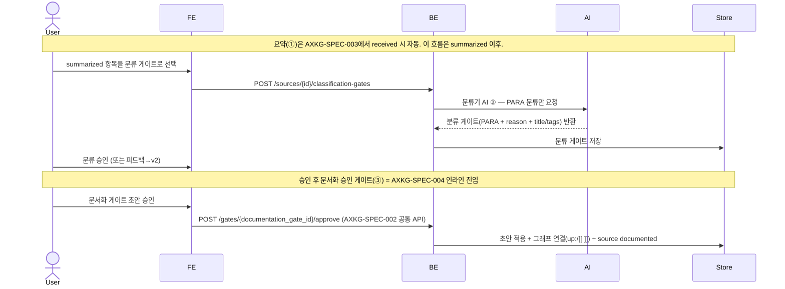
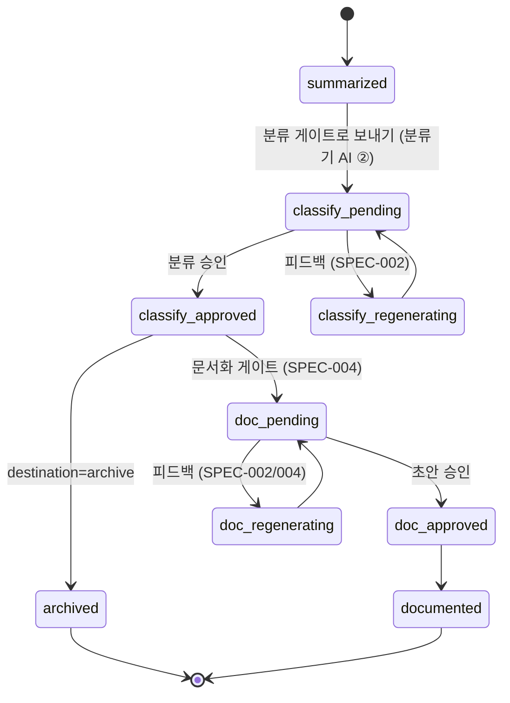

# 요약 이후 분류·문서화 큐레이션 파이프라인

Source Inbox에서 자동 요약된(summarized) source를 **분류 게이트**에서 PARA로 분류하고, 승인 후 **문서화 승인 게이트**(AXKG-SPEC-004)에서 destination별 AI 초안을 검토·승인해 영구 문서로 편입하는 흐름을 보장한다. 연결(connection)은 별도 게이트가 아니라 문서화 초안의 `up:`/`[[ ]]`와 파생지식 후보로 발현된다.

## 1. Context

### Meta

- Decision reference: AXKG-DEC-001, AXKG-DEC-002, AXKG-DEC-004, AXKG-DEC-005
- Baseline reference: AXKG-BL-001
- Domain note: `Source`, `Classification Gate`(②, 분류만), `Documentation Gate`(③, AXKG-SPEC-004), `Permanent Note`
- AI 2-stage: ① 요약 AI — 트리거는 AXKG-SPEC-003의 `received → summarizing` 자동 전이, 요약 생성 로직·결과는 이 spec의 U-2(요약·분류 카드에 병합). ② 분류기 AI — `summarized` 항목을 분류 게이트로 보내면 실행되어 **PARA 분류만** 생성한다(연결 추천은 생성하지 않음). 문서화 초안(연결·파생지식 포함) 생성 AI는 AXKG-SPEC-004 소관.
- 2-게이트: 분류 게이트(②) → 문서화 승인 게이트(③, AXKG-SPEC-004). 우측 사이드바 없이 중앙 세로 스택 인라인.
- MVP scope: AX는 AI Transformation 중심, 저장소는 Markdown SoT + PostgreSQL, Graph RAG Chat 포함

### Business Requirement

사용자는 AX 관련 링크를 쌓아두는 대신, 요약 AI가 자동으로 정리한 요약·분류 카드에서 분류기 AI의 PARA 분류를 승인하고, 문서화 승인 게이트에서 destination별 AI 초안(연결·파생지식 포함)을 검토·승인해 지식그래프의 일부로 전환할 수 있어야 한다.

### Scope

In scope:

- Source Inbox에서 자동 요약된 `summarized` source를 분류 게이트로 진입시키기(요약·분류 카드 병합)
- 분류기 AI가 PARA 분류 후보만 생성(연결 추천 없음)
- 분류 게이트에서의 사용자 승인/피드백
- 분류 승인 후 문서화 승인 게이트(AXKG-SPEC-004) 진입
- 승인된 결과의 영구 문서 생성

Out of scope:

- 문서화 초안·연결·파생지식 후보 생성 UX (AXKG-SPEC-004)
- 자동 크롤링 스케줄러
- 브라우저 확장
- 협업 권한
- 외부 블로그 publish

## 2. UX Contract

### Placement

제품 첫 화면은 작업 큐 중심이다.

```text
+--------------------------------------------------+
| Header: AX Knowledge Graph                        |
+-------------------+------------------------------+
| Source Inbox 큐   | 중앙 세로 스택 (선택 항목)     |
| - Summarized      | ① 요약·분류 카드 (요약 AI ①)   |
| - Classify Pending| ② 분류 게이트 (분류기 AI ②)    |
| - Doc Pending     |    PARA + reason + title/tags  |
| - Documented      | ③ 문서화 승인 게이트 (SPEC-004)|
|                   |    AI 초안 + up:/[[ ]] + 파생  |
+-------------------+------------------------------+
```

우측 사이드바는 없다. 선택한 source의 카드/게이트는 중앙 세로 스택에 인라인으로 쌓인다.

### U-1. Source Input

- **상태**: summarized 목록, 선택됨
- **문구**: 요약은 Source Inbox에서 `received` 시 자동으로 생성된다. 이 파이프라인은 `summarized` 이후를 다룬다.
- **CTA**: 없음 — 수동 `수집 시작` 단계는 제거되었다. URL 최초 입력은 AXKG-SPEC-003 소관.
- **기대 결과**: `summarized` source가 분류 게이트 선택 대상으로 목록에 나타난다.

### U-2. 요약·분류 카드 (요약 + 분류 게이트 병합)

- **상태**: 요약 중, 요약 완료(분류 게이트 자동 생성), 요약 실패
- **문구**: 제목, 핵심 요약, 태그 (요약 AI ① 결과 = 노트 frontmatter 시드). 제목/요약/태그가 이후 생성될 문서의 frontmatter 시드가 된다.
- **CTA**: 없음 — 요약이 자동이므로 중간 `분류 게이트 생성` 버튼을 두지 않는다. 요약 카드와 분류 게이트는 한 카드로 병합된다.
- **기대 결과**: source가 `summarized`가 되어 분류 게이트로 선택되면 분류기 AI(②)가 실행되어 아래 U-3 분류 게이트가 같은 카드에 이어서 나타난다.

### U-3. 분류 게이트 (②, 분류만)

- **상태**: 게이트 없음, 승인 대기, 승인됨, 재생성됨(v2). v1은 read-only(버튼 비활성, archive 보존).
- **문구**: PARA 목적지 후보(project/area/resource/archive), 목적지 판단 근거(destination_reason), 문서화 후보 제목(suggested_title)·태그(suggested_tags), 신뢰도(confidence). 버전 badge(`v2 | v1`).
- **CTA**: `피드백`, `승인` (두 버튼만)
- **기대 결과**: 분류기 AI(②)는 PARA 분류만 생성한다(연결 후보 생성 안 함). `승인`하면 source의 `destination_type`이 확정되고 아래에 문서화 승인 게이트(③, AXKG-SPEC-004)가 인라인 생성된다. 목적지가 `archive`이면 문서화 게이트 없이 종료한다. `피드백` 버튼 → 피드백 모달 열림 → 텍스트 입력 후 `재생성` → 분류 게이트 v2 재생성(v1은 read-only 보존, AXKG-SPEC-002 공통 규칙).

### U-3.1. PARA Destination Rules

분류 게이트는 Source Inbox에서 요약된 source를 아래 목적지 중 하나로 제안한다. `resource`는 PARA 분류 라벨이고 `reference note`는 그 산출 노트 타입으로, 같은 대상의 두 이름이다.

| Destination | 의미 | 대표 입력 | 승인 후 다음 행동 |
|---|---|---|---|
| `project` | 지금 실제로 만들거나 진행할 일 | 제품 기능 아이디어, MVP 작업 후보, 스펙 변경 제안 | `products/ax-knowledge-graph/00-baseline` 후보로 문서화(MVP는 baseline 후보만, decision/spec 후보는 post-MVP — AXKG-DEC-005) |
| `area` | 계속 관리할 책임/관심 영역 | AX 전략, AI 전환 역량, 조직 지식관리, Agent Experience 연구 주제 | area 성격의 permanent note 후보로 문서화 |
| `resource` | 나중에 참고할 외부 자료 | 기사, 유튜브, 논문, 도구 링크, 사례 분석 | reference note 후보로 문서화 |
| `archive` | 지금 쓰지 않을 자료 | 중복 링크, 오래된 자료, 품질 낮은 자료, 현재 범위 밖 자료 | archive 처리하고 연결/영구 문서화는 기본 중단 |

분류 게이트의 최소 출력(분류기 AI ② 한 번의 결과):

| Field | 설명 |
|---|---|
| `destination_type` | `project`, `area`, `resource`, `archive` 중 하나 |
| `destination_reason` | 왜 이 목적지인지에 대한 판단 근거 |
| `suggested_title` | 문서화 후보 제목 |
| `suggested_tags` | 태그 후보 |
| `source_summary` | 분류 판단에 필요한 짧은 요약 |
| `confidence` | AI 판단 신뢰도 |

분류 게이트는 분류만 생성한다. 연결(connection) 후보는 여기서 만들지 않고, 문서화 승인 게이트(③, AXKG-SPEC-004)의 AI 초안에서 `up:`/`[[ ]]`와 파생지식 후보로 발현된다. `archive` 목적지면 문서화 게이트로 넘어가지 않는다.

### U-5. Documentation Gate 진입 (문서화 승인 게이트 = AXKG-SPEC-004)

- **상태**: 문서화 대기(doc_pending), 문서화 승인(doc_approved), 문서 생성(documented)
- **문구**: 확정 destination을 제목으로 하는 문서화 승인 게이트가 분류 게이트 바로 아래 인라인 생성된다. 내부 UX(AI 초안 전문 접기/펴기, 파생지식, 피드백 모달/승인)는 AXKG-SPEC-004가 정의한다.
- **CTA**: (AXKG-SPEC-004의 `피드백`, `승인`)
- **기대 결과**: 문서화 게이트 `승인` 시 destination에 맞는 문서가 생성되고, 초안의 `up:`/`[[ ]]`가 지식그래프 연결로 반영되며 source는 `documented`가 된다.

## 3. User Scenario

### S-1. User — 요약된 source를 2-게이트로 영구 문서화

1. Source Inbox의 URL은 `received` 시 자동으로 요약되어 `summarized`가 된다(요약 AI ①, AXKG-SPEC-003). 제목·요약·태그가 요약·분류 카드에 표시된다.
2. 사용자가 `summarized` 항목을 분류 게이트로 선택하면 분류기 AI(②)가 실행되어 같은 카드에 분류 게이트가 이어서 생성된다.
3. 분류기 AI는 PARA 목적지(`project`, `area`, `resource`, `archive`)·판단 근거·제목·태그·신뢰도를 생성한다(연결 후보는 생성하지 않는다).
4. 분류가 틀리면 사용자는 `피드백` 버튼으로 피드백 모달을 열어 v2를 재생성받는다(v1은 read-only 보존). 맞으면 `승인`한다.
5. 승인 시 source의 목적지가 확정된다. 목적지가 `archive`이면 문서화 게이트 없이 흐름을 종료한다.
6. `project`/`area`/`resource`이면 분류 게이트 바로 아래에 문서화 승인 게이트(③, AXKG-SPEC-004)가 인라인 생성된다.
7. 문서화 게이트는 destination에 맞는 AI 초안(frontmatter + 본문 + `up:`/`[[ ]]` 연결)과 파생지식을 한 덩어리로 보여준다. 사용자는 게이트 `피드백`(모달 → 재생성) 또는 `승인`한다.
8. 문서화 게이트 `승인` 시 초안이 적용되어 문서가 생성되고, 초안의 `up:`/`[[ ]]`가 지식그래프 연결(노드/엣지)로 반영되며 source는 `documented`가 된다.

### S-2. User — 분류가 마음에 들지 않음

1. 사용자는 분류 게이트에서 `피드백` 버튼을 눌러 피드백 모달을 연다(대상 게이트·현재 버전 표시).
2. 모달 텍스트에어리어에 잘못된 점과 원하는 방향을 적고 `재생성`을 누른다.
3. 시스템은 기존 게이트 버전(v1)을 read-only로 보존하고 v2 재생성을 요청한다.
4. 분류기 AI는 피드백을 반영한 분류 게이트 v2를 만든다.
5. 사용자는 v2를 승인하거나 다시 피드백한다. (문서화 게이트 초안 피드백도 같은 버전 규칙을 따른다 — AXKG-SPEC-002, AXKG-SPEC-004.)

## 4. Interface Contract

### API Contract

| Method | Path | 요약 | 권한 |
|---|---|---|---|
| POST | `/sources/{source_id}/classification-gates` | `summarized` source를 분류 게이트로 보내 PARA 분류 게이트 생성(분류기 AI ② 트리거) | owner |

URL 최초 입력(`/sources/manual`, Slack)은 AXKG-SPEC-003 소관이다. 게이트 액션(피드백/재시도/승인)은 AXKG-SPEC-002의 공통 API(`/gates/{gate_id}/*`)를 쓰고, 문서화 게이트 조회·계약은 AXKG-SPEC-004가 정의한다. 문서 생성은 문서화 게이트 `approve`로 일원화한다 — 이전의 `POST /sources/{source_id}/permanent-note`는 폐기됐다(AXKG-DEC-005 메이저 정리).

### Validation

| 필드 | 규칙 |
|---|---|
| `source_status` | 분류 게이트 생성은 `summarized` source에만 허용 |
| `destination_type` | `project`, `area`, `resource`, `archive` 중 하나 |
| `destination_reason` | 비어 있으면 안 됨 |

### Case Matrix

| 에러 코드 | 백엔드 출력 | 프론트 출력 | 표시 위치 |
|---|---|---|---|
| `COLLECTION_FAILED` | 탐색 실패 | 자료를 탐색하지 못했습니다. 다시 시도하거나 메모를 추가해 주세요. | Source Summary |
| `GATE_NOT_APPROVED` | 승인되지 않은 게이트 | 승인된 게이트가 필요합니다. | Gate 영역 |
| `INVALID_DESTINATION` | 허용되지 않은 PARA 목적지 | 분류 목적지가 올바르지 않습니다. | Classification Gate |
| `DOCUMENT_CONFLICT` | 문서 경로 충돌 | 같은 위치의 문서가 이미 있습니다. 제목이나 위치를 조정해 주세요. | Permanent Documentation |

### Flow



### State / Lifecycle

`received → summarizing → summarized`(및 `collection_failed`)까지의 상태는 AXKG-SPEC-003이 SSOT다. 이 spec은 `summarized` 진입 이후를 정의한다. 분류 게이트(②)와 문서화 승인 게이트(③) 2단계이며, 각 게이트는 피드백 시 재생성된다. 게이트 저장 상태의 SSOT는 AXKG-SPEC-002의 공통 `approval_gates.status`다.

**아래 다이어그램의 `classify_*`/`doc_*` 6종은 DB에 저장되는 상태가 아니라 `sources.status` + 게이트 상태 조합의 파생 라벨(Inbox 큐 라벨)이다.** 매핑은 이 표가 SSOT다:

| 파생 라벨 | 정의 (`sources.status` + `approval_gates` 상태) |
|---|---|
| `classify_pending` | `summarized` + 분류 게이트 `generating`/`review_pending`/`feedback_pending` |
| `classify_regenerating` | `summarized` + 분류 게이트 `regenerating` |
| `classify_approved` | `summarized` + 분류 게이트 `approved` (destination 확정) |
| `doc_pending` | `summarized` + 문서화 게이트 `generating`/`review_pending`/`feedback_pending` |
| `doc_regenerating` | `summarized` + 문서화 게이트 `regenerating` |
| `doc_approved` | `summarized` + 문서화 게이트 `approved` (apply 실행 중, `documented` 전이 전) |

`archived`/`documented`는 파생 라벨이 아니라 실제 `sources.status`이며 전이는 AXKG-SPEC-003 SSOT를 따른다. destination=archive 분류 승인의 `summarized → archived` 전이도 AXKG-SPEC-003 상태도에 정의되어 있다.



### Data Contract

| Resource | Field | 설명 |
|---|---|---|
| Source | `url` | 원본 링크 |
| Source | `source_type` | article, video, document, unknown |
| Source | `status` | lifecycle 상태 (`summarized` 이후는 이 spec) |
| Classification Gate | `version` | 같은 source 안의 분류 게이트 버전 |
| Classification Gate | `destination_type` | project, area, resource, archive |
| Classification Gate | `destination_reason` | 목적지 판단 근거 |
| Classification Gate | `suggested_title` | 문서화 후보 제목 |
| Classification Gate | `suggested_tags` | 태그 후보 |
| Classification Gate | `source_summary` | 분류 판단 요약 |
| Classification Gate | `confidence` | AI 판단 신뢰도 |
| Permanent Note | `path` | 생성될 영구 문서 위치 |

연결(connection) 데이터는 분류 게이트가 아니라 문서화 초안의 `up:`/`[[ ]]`에서 나온다(AXKG-SPEC-004 초안 + AXKG-SPEC-005 링크 계약).

### Destination Output Contract

분류 승인 후 문서화 게이트(③, AXKG-SPEC-004)의 AI 초안은 목적지별로 다르게 생성된다. `resource≡reference`(같은 대상의 두 이름).

| Destination | 문서화 초안 형태 |
|---|---|
| `project` | product 문서 후보(MVP는 baseline만, `document_type=baseline`). 승인 후 `products/ax-knowledge-graph/00-baseline`으로 전환 |
| `area` | permanent note 후보(기존 개념 보충 또는 신규 개념). 승인 후 `up:`/`[[ ]]` 연결까지 반영 |
| `resource` | reference note 후보. 문서화 게이트에서 초안·파생지식·연결을 함께 검토 |
| `archive` | archive record. 문서화 게이트로 넘어가지 않음(문서·연결 생성 안 함) |

## 5. Implementation Rules

- 승인되지 않은 AI 제안은 영구 문서에 반영하지 않는다.
- AI 요약 결과는 source에 보존하고, 문서화 결과와 구분한다.
- 요약 AI(①)·분류기 AI(②)·재생성 작업은 AXKG-SPEC-007의 open-kknaks provider 설정을 사용한다.
- 분류기 AI(②)는 PARA 분류만 생성한다. 연결 추천은 분류 게이트에서 만들지 않고, 문서화 게이트(③)의 AI 초안 `up:`/`[[ ]]`와 파생지식 후보로 발현한다.
- 분류 게이트 승인 전에는 source의 PARA 목적지를 확정하지 않는다.
- `archive`로 승인된 source는 문서화 게이트로 넘어가지 않는다(문서·연결 생성 안 함).
- `project`/`area`/`resource`로 승인된 source는 문서화 승인 게이트(AXKG-SPEC-004)로 진입한다. reference는 resource destination의 한 경우다.
- 영구 문서 생성은 멱등적이어야 한다. 같은 문서화 게이트 승인으로 중복 생성 요청이 오면 기존 결과를 반환한다.
- 문서화 게이트는 문서 생성 전에 AI 초안 전문 preview를 제공한다(AXKG-SPEC-004).

## 6. Verification

### Acceptance Criteria

- [ ] `summarized` source를 분류 게이트로 보낼 수 있다(요약·분류 카드 병합, 중간 버튼 없음).
- [ ] 분류 게이트는 분류기 AI가 PARA 분류만 생성한다(연결 후보 없음).
- [ ] 분류 게이트는 `project`, `area`, `resource`, `archive` 중 하나의 목적지를 제안한다.
- [ ] 분류 게이트에는 목적지 판단 근거, 문서화 후보 제목·태그, 신뢰도가 포함된다.
- [ ] 분류 게이트 피드백 시 v2가 재생성되고 v1은 read-only로 보존된다.
- [ ] `archive`로 승인된 source는 문서화 게이트로 넘어가지 않는다.
- [ ] 분류 승인 후 문서화 승인 게이트(AXKG-SPEC-004)가 인라인 진입한다.
- [ ] 문서화 게이트 승인 시 문서가 생성되고 초안의 `up:`/`[[ ]]`가 그래프 연결로 반영된다.

## 7. Open Questions

없음. 영구 문서는 로컬 `data/documents`에 저장하고, 배포에서는 bind mount로 document root를 주입한다.
