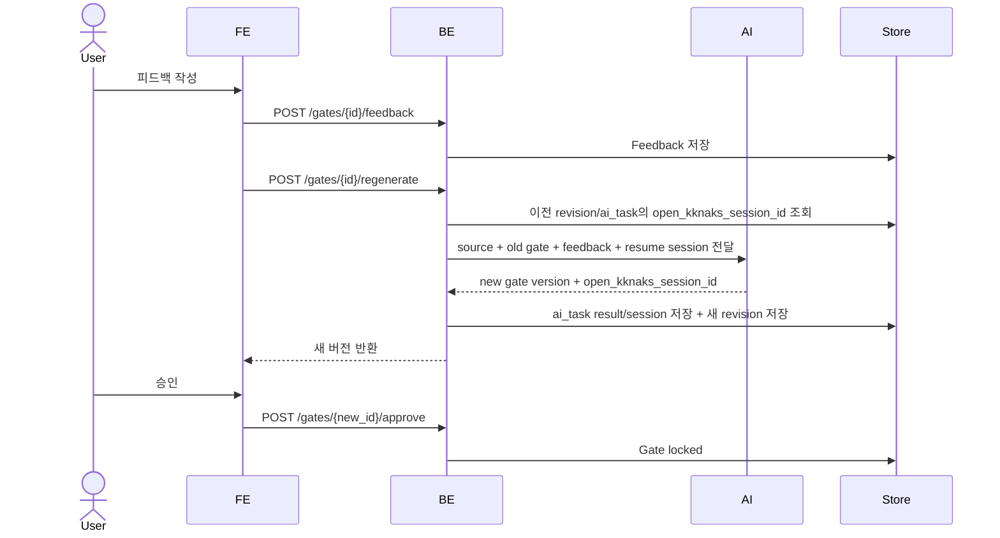
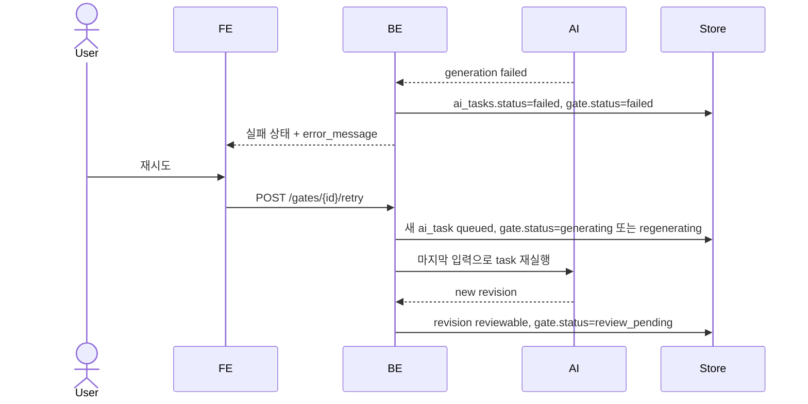
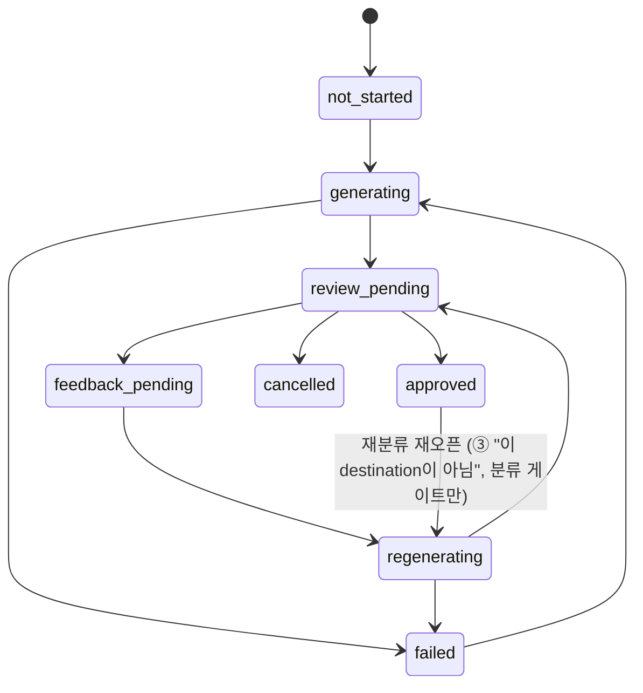
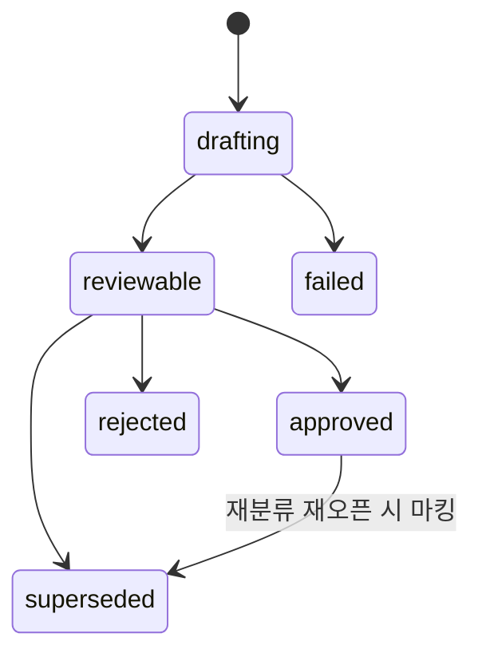

# 승인 게이트 피드백과 재생성 루프

사용자가 AI 제안을 그대로 받지 않을 때 피드백을 남기고, 시스템이 그 피드백을 반영한 새 버전을 생성하는 **공통 버전·resume 규칙**을 정의한다. 주 대상은 파이프라인의 두 게이트 — **분류 게이트(②, AXKG-SPEC-001)**와 **문서화 승인 게이트(③, AXKG-SPEC-004)** — 이며, 피드백은 해당 게이트의 새 revision(v2)을 만들고 직전 버전(v1)은 read-only로 보존한다.

같은 **피드백→v2 재생성 + 직전 버전 read-only 보존 + open-kknaks 세션 resume** 규칙은 **요약 스테이지(①, AXKG-SPEC-003 U-2)의 요약 초안**에도 적용된다. 다만 요약 초안은 게이트가 아니므로 아래 경계를 따른다.

- 요약 초안 draft는 `approval_gates`/`approval_gate_revisions`가 아니라 `sources.summary_payload`(DB, 박제)에 저장되고, 피드백 재생성은 이 payload를 **덮어쓰지 않고 새 버전(v2)을 박제(immutable)로 남긴다** — v1은 read-only 보존, v2는 v1을 `parent`로 참조(게이트 revision과 동일한 버전 원칙). gate_kind·approve-lock·재분류 재오픈 같은 게이트 전용 상태 기계는 요약 초안에 적용하지 않는다. 요약 draft 버전의 저장 위치·구조 세부는 BE 구현 소관(AXKG-SPEC-003 §7 OQ).
- 요약 초안의 "다음 단계로 넘기는" 액션은 게이트 승인(`approve`)이 아니라 **[분류]**(분류 게이트 트리거, AXKG-SPEC-001)다. 요약 초안 단계에는 승인/잠금 개념이 없다 — 사용자는 만족할 때까지 피드백으로 재생성하고, [분류]를 눌러야 파이프라인이 다음으로 진행한다. 이 **[분류]가 요약 draft를 확정하는 지점**이며, 그 순간 active 요약 버전이 **요약 문서(md)로 확정**된다(draft=DB 박제 / 확정=md — 공통 저장 패턴 AXKG-SPEC-011). md는 각 단계를 **앞으로 확정하는 행위**에서 산출된다 — 요약은 [분류] 확정, PARA 지식 문서는 문서화 게이트 승인. **분류 게이트(②) 승인은 md 산출 지점이 아니다**(destination metadata만, AXKG-SPEC-001). 게이트(승인 단계)와 문서(md 산출물)는 별개 개념이므로 "md=문서화 게이트"로 등치하지 않는다.
- 공유하는 것은 **버전 규칙(v1 read-only + v2)과 세션 resume 배선**(AXKG-SPEC-011 Feedback Regeneration Resume Wiring)뿐이다. 이하 §2~§5의 게이트 전용 계약(모달·API·게이트 상태)은 요약 초안 UX(AXKG-SPEC-003)와 별개다.

## 1. Context

### Meta

- Decision reference: AXKG-DEC-001
- Baseline reference: AXKG-BL-001
- Domain note: `Approval Gate`, `Gate Version`, `Feedback`
- Feedback input: 빠른 선택지와 자유 입력을 함께 제공
- AI session: open-kknaks 응답의 session/thread id를 저장하고 재생성 시 이어서 사용

### Business Requirement

AI의 첫 제안이 틀려도 사용자가 직접 모든 내용을 고치는 부담 없이 방향을 피드백하고 새 제안을 받을 수 있어야 한다. 기존 게이트 버전은 감사와 비교를 위해 보존한다.

### Scope

In scope:

- 분류 게이트(②)·문서화 승인 게이트(③) 공통 피드백/재생성 규칙
- 피드백 반영 재생성(v2)
- 게이트 버전 비교, 직전 버전(v1) read-only 보존
- 승인된 버전 잠금
- 요약 초안(①)에 공유되는 버전 규칙(v1 read-only + v2)과 세션 resume 배선(요약 초안 UX·저장은 AXKG-SPEC-003, 배선은 AXKG-SPEC-011)

Out of scope:

- 사람이 게이트 내용을 직접 필드별 편집하는 고급 편집기
- 팀 리뷰와 코멘트 스레드
- 자동 평가 점수 모델

## 2. UX Contract

### Placement

게이트 카드의 CTA는 `피드백`·`승인` **두 버튼만** 둔다. 인라인 텍스트에어리어를 게이트 카드에 상주시키지 않는다. `피드백` 버튼은 **피드백 모달**을 열고, 피드백 입력은 모달 안에서만 받는다. 버전 badge(`v2 | v1`)로 이전 버전을 참조한다.

```text
+--------------------------------------------------+
| Gate (분류 ② 또는 문서화 ③)   badge: v2 | v1     |
| ── AI 제안 내용 ──────────────────────────────── |
| [피드백]  [승인]                                 |
+--------------------------------------------------+
       │ 피드백 클릭
       ▼
+--------------------------------------------------+
| 피드백 모달                                       |
| 대상: 분류 게이트 ② · 현재 버전 v1                |
| [ 텍스트에어리어 — 무엇이 잘못됐나요 / 원하는 방향 ] |
| [취소]  [재생성 → v2]                            |
+--------------------------------------------------+
```

### U-1. Gate Review

- **상태**: 승인 대기, 승인됨, 재생성 중, v1 read-only
- **문구**: 게이트 버전 badge(`v2 | v1`), 생성 시각, AI 판단 근거, 승인 상태
- **CTA**: `피드백`, `승인` (게이트 카드에는 이 두 버튼만). v1 badge를 눌러 이전 버전(read-only)을 본다
- **기대 결과**: 승인 시 게이트가 locked 상태가 되고 후속 단계에서 사용할 수 있다. 직전 버전은 read-only(버튼 비활성)로 보존된다. `피드백`은 피드백 모달을 연다(인라인 입력 아님).

### U-2. Feedback (모달)

- **상태**: 닫힘, 열림(작성 전), 작성 중, 제출 중, 제출 실패
- **문구**: 대상 게이트/현재 버전 라벨, 무엇이 잘못됐나요?, 원하는 방향
- **CTA**: `재생성`(=v2 생성), `취소`
- **기대 결과**: 게이트 `피드백` 버튼이 모달을 연다. 모달은 어느 게이트·현재 버전을 표시한다. 텍스트 입력 후 `재생성` → 피드백이 저장되고 같은 게이트의 새 버전(v2) 생성이 시작되며 모달이 닫힌다. v1은 read-only로 보존. `취소` → 입력 없이 모달만 닫힌다.

### U-3. Version Badge

- **상태**: 버전 1개, 여러 버전, 승인 버전 존재
- **문구**: `v1`, `v2`, 승인됨, 피드백 반영
- **CTA**: `버전 비교`, `이 버전 승인`
- **기대 결과**: 사용자가 과거 제안(read-only)과 새 제안을 비교하고 원하는 버전을 승인할 수 있다.

## 3. User Scenario

### S-1. User — 분류 게이트 피드백 후 새 버전 승인

1. 사용자는 분류 게이트(②) v1을 확인한다.
2. 제안된 PARA 위치나 destination이 틀렸다고 판단한다.
3. 사용자는 게이트의 `피드백` 버튼을 눌러 피드백 모달을 연다. 모달은 대상(분류 게이트 ②)·현재 버전(v1)을 표시한다.
4. 사용자는 모달 텍스트에어리어에 "이 자료는 도구가 아니라 사례로 분류해 달라"처럼 방향을 적고 `재생성`을 누른다.
5. 시스템은 v1을 read-only로 보존하고 모달을 닫으며 v2 생성을 시작한다.
6. AI는 원본 source, v1, 사용자 피드백, 직전 generation session id를 함께 참고해 v2를 생성한다.
7. 사용자는 v2를 승인한다.

### S-2. User — 문서화 게이트 초안 피드백

1. 사용자는 문서화 승인 게이트(③)의 AI 초안 v1을 확인한다.
2. 초안 내용이 부족하면 게이트 `피드백` 버튼으로 피드백 모달을 열어 추가/수정 방향을 적고 `재생성`을 누른다.
3. 시스템은 초안 v1을 read-only로 보존하고 모달을 닫으며 피드백을 반영한 초안 v2를 재생성한다(AXKG-SPEC-004).
4. 사용자는 v2를 확인하고 다시 피드백하거나 승인한다.

### S-3. User — 승인 후 잠금

1. 사용자는 게이트 v2를 승인한다.
2. 시스템은 v2를 locked 상태로 바꾼다.
3. 사용자가 다시 피드백하려 하면, 시스템은 "승인된 게이트는 변경할 수 없고 새 revision을 만들어야 한다"는 선택지를 제공한다.

## 4. Interface Contract

### API Contract

| Method | Path | 요약 | 권한 |
|---|---|---|---|
| POST | `/gates/{gate_id}/approve` | 게이트 승인 | owner |
| POST | `/gates/{gate_id}/feedback` | 피드백 저장 | owner |
| POST | `/gates/{gate_id}/regenerate` | 피드백 기반 새 버전 생성 | owner |
| POST | `/gates/{gate_id}/retry` | 실패한 게이트 생성/재생성 AI task 재실행 | owner |
| GET | `/sources/{source_id}/gates` | 게이트 버전 목록 조회 | owner |

> 승인 게이트(분류②·문서화③)의 API·화면은 **admin 전용**이다 — staff는 표면 자체에 접근할 수 없다. 접근 경계 매트릭스 SSOT는 AXKG-SPEC-008이며 여기서는 재서술하지 않는다.

### Validation

| 필드 | 규칙 |
|---|---|
| `feedback` | 필수, 10자 이상 4000자 이하 |
| `gate_id` | 현재 source에 속한 게이트(분류 ② 또는 문서화 ③)만 허용 |
| `retry` | gate status가 `failed`이고 마지막 `ai_task.status=failed`인 경우만 허용 |

### Case Matrix

| 에러 코드 | 백엔드 출력 | 프론트 출력 | 표시 위치 |
|---|---|---|---|
| `FEEDBACK_TOO_SHORT` | 피드백 길이 부족 | 원하는 수정 방향을 조금 더 구체적으로 적어 주세요. | Feedback Modal |
| `GATE_ALREADY_APPROVED` | 승인된 게이트 수정 시도 | 승인된 게이트는 변경할 수 없습니다. 새 revision을 만들어 주세요. | Gate Review |
| `REGENERATION_FAILED` | AI 재생성 실패 | 새 게이트를 만들지 못했습니다. 다시 시도해 주세요. | Feedback Modal |
| `STALE_GATE_VERSION` | 오래된 버전 승인 시도 | 최신 상태를 다시 확인해 주세요. | Gate Review |
| `RETRY_NOT_ALLOWED` | 재시도 불가 상태 | 현재 상태에서는 재시도할 수 없습니다. | Gate Review |

### Flow



실패 후 재시도:



### State / Lifecycle

`ApprovalGate`는 source + gate_kind 단위의 게이트 묶음이다. 두 게이트(`classification`, `documentation`)는 같은 `approval_gates` table에서 `gate_kind` 열로 구분한다.



`cancelled`는 문서화 게이트가 재분류 재오픈으로 무효화될 때 사용한다(AXKG-SPEC-004 S-3). 그 외 게이트를 임의로 취소하는 사용자 액션은 MVP에 없다.

이 상태 모델이 두 게이트(분류 ②·문서화 ③) 공통의 SSOT다. 문서화 게이트가 UI에 노출하는 표시 상태는 이 공통 상태의 파생이다(AXKG-SPEC-004의 매핑표). `approved --> regenerating`은 문서화 게이트의 "이 destination이 아님" 피드백이 승인된 **분류** 게이트를 재오픈하는 유일한 예외 전이다 — 이때도 revision 자체는 불변이며 컨테이너 상태와 포인터만 바뀐다.

`ApprovalGateRevision`은 AI가 만든 실제 승인 대상 버전이다. 사용자가 승인하거나 피드백하는 대상은 gate가 아니라 현재 active revision이다.



### Data Contract

| Resource | Field | 설명 |
|---|---|---|
| ApprovalGate | `source_id` | 이 게이트가 속한 source |
| ApprovalGate | `gate_kind` | `classification`(②) 또는 `documentation`(③) |
| ApprovalGate | `status` | `not_started`, `generating`, `review_pending`, `feedback_pending`, `regenerating`, `approved`, `failed`, `cancelled` (`held`는 파생지식 개별 보류 제거와 함께 삭제됨) |
| ApprovalGate | `active_revision_id` | 현재 사용자가 검토 중인 revision |
| ApprovalGate | `approved_revision_id` | 최종 승인된 revision, 없으면 null |
| ApprovalGate | `last_ai_task_id` | 마지막 생성/재생성 AI task |
| ApprovalGateRevision | `gate_id` | 상위 ApprovalGate |
| ApprovalGateRevision | `version` | gate 안에서 증가하는 v1, v2, v3 |
| ApprovalGateRevision | `status` | `drafting`, `reviewable`, `approved`, `superseded`, `rejected`, `failed` |
| ApprovalGateRevision | `payload` | AI가 만든 실제 승인 form 데이터 |
| ApprovalGateRevision | `form_schema_version` | gate_kind별 form schema version |
| ApprovalGateRevision | `parent_revision_id` | 피드백 재생성 기준이 된 이전 revision |
| ApprovalGateRevision | `feedback_id` | 이 revision 생성을 유발한 feedback |
| ApprovalGateRevision | `ai_task_id` | 이 revision을 만든 AI task |
| ApprovalGateRevision | `open_kknaks_session_id` | 이 revision 생성 결과로 반환된 provider session/thread id. nullable이지만 AI 성공 시 저장 |
| GateFeedback | `target_revision_id` | 피드백 대상 revision |
| GateFeedback | `body` | 사용자가 남긴 수정 방향 |
| GateFeedback | `quick_options` | 빠른 선택지 |
| GateFeedback | `status` | `submitted`, `consumed`, `cancelled` |
| AITask | `task_type` | 게이트 task 4종: `generate_classification_gate`, `regenerate_classification_gate`, `generate_documentation_gate`, `regenerate_documentation_gate`. task_type 전수(요약 `collect_source_summary`, `graph_rag_chat` 포함)의 SSOT는 AXKG-SPEC-011 Stage Execution Contract다 |
| AITask | `status` | `queued`, `running`, `succeeded`, `failed`, `cancelled` |
| AITask | `retry_of_task_id` | 재시도 대상 task |
| AITask | `retry_count` | 재시도 횟수 |
| AITask | `open_kknaks_task_id` | open-kknaks task id |
| AITask | `open_kknaks_session_id` | open-kknaks 응답 session/thread id. 후속 feedback regeneration의 기본 resume id |
| AITask | `error_code` / `error_message` | 실패 원인 표시와 디버깅용 정보 |

### open-kknaks Session Rule

- 최초 gate 생성이 성공하면 open-kknaks 응답의 session/thread id를 `ai_tasks.open_kknaks_session_id`와 생성된 `approval_gate_revisions.open_kknaks_session_id`에 저장한다.
- 피드백 기반 재생성은 기본적으로 `target_revision.open_kknaks_session_id`를 resume session으로 전달한다.
- `target_revision.open_kknaks_session_id`가 없으면 `target_revision.ai_task_id -> ai_tasks.open_kknaks_session_id`를 사용한다.
- 둘 다 없으면 stateless 재생성으로 실행하되, source + 이전 revision payload + feedback body를 모두 context에 포함한다.
- 재생성 결과가 새 session id를 반환하면 새 `ai_tasks`와 새 `approval_gate_revisions`에 다시 저장한다.
- 실패한 task도 `payload`에 요청 snapshot과 사용하려던 resume session id를 남긴다. retry는 기존 failed task를 수정하지 않고 새 `ai_tasks` row를 만들며 같은 resume session 후보를 다시 계산한다.
- **요약 초안(①)의 재생성**도 같은 계산 규칙을 쓴다: resume 원천은 직전 요약 실행 `ai_tasks.open_kknaks_session_id`이고, 없으면 stateless로 원문+이전 요약 payload+feedback을 인라인한다. 대상 저장소만 `approval_gate_revisions`가 아니라 `sources.summary_payload`이며, 게이트 revision과 마찬가지로 **직전 버전을 덮어쓰지 않고 새 버전을 박제로 남긴다**(비덮어쓰기·v1 보존, AXKG-DEC-005 C). 실제 submit 배선(`options.resume=true` + session)은 AXKG-SPEC-011 Feedback Regeneration Resume Wiring이 SSOT다.

### Approval Gate Payload Schema

모든 `approval_gate_revisions.payload`는 공통 envelope를 사용한다. `gate_kind`에 따라 `form`의 schema만 달라진다.

공통 envelope:

```json
{
  "schema_version": "classification.v1",
  "gate_kind": "classification",
  "source_id": "src_001",
  "summary": {
    "title": "Graph RAG 실전 설계",
    "source_url": "https://example.com",
    "source_summary": "요약된 source 내용"
  },
  "form": {},
  "confidence": 0.82,
  "warnings": []
}
```

공통 필드:

| Field | Required | 설명 |
|---|---|---|
| `schema_version` | yes | `classification.v1` 또는 `documentation.v1` |
| `gate_kind` | yes | `classification` 또는 `documentation` |
| `source_id` | yes | 대상 source |
| `summary` | yes | UI 카드 상단에 보여줄 요약 정보 |
| `form` | yes | gate_kind별 승인 form payload |
| `confidence` | no | AI 판단 신뢰도 |
| `warnings` | no | 검증 경고 또는 사용자 확인이 필요한 항목 |

#### classification.v1

분류 게이트는 PARA destination만 결정한다. 연결 후보나 문서 초안은 만들지 않는다.

```json
{
  "schema_version": "classification.v1",
  "gate_kind": "classification",
  "source_id": "src_001",
  "summary": {
    "title": "Graph RAG 실전 설계",
    "source_url": "https://example.com",
    "source_summary": "문서 그래프를 검색 context로 삼는 RAG 설계 자료"
  },
  "form": {
    "destination_type": "resource",
    "destination_reason": "외부 자료를 참고용 reference note로 보존할 가치가 있음",
    "suggested_title": "Graph RAG 실전 설계 노트",
    "suggested_tags": ["graph-rag", "retriever", "ai-transformation"],
    "source_type": "video",
    "confidence": 0.86
  },
  "confidence": 0.86,
  "warnings": []
}
```

`classification.v1.form`:

| Field | Required | 설명 |
|---|---|---|
| `destination_type` | yes | `project`, `area`, `resource`, `archive` |
| `destination_reason` | yes | PARA 목적지 판단 근거 |
| `suggested_title` | yes | 다음 문서화 게이트에서 사용할 제목 후보 |
| `suggested_tags` | no | 태그 후보 |
| `source_type` | no | `article`, `video`, `document`, `unknown` |
| `confidence` | no | 분류 판단 신뢰도 |

#### documentation.v1

문서화 게이트는 destination별 문서 초안, 파생지식, 적용 계획을 한 payload에 담는다. 파생지식은 개별 승인하지 않고 문서화 게이트 approval에 묶여 적용된다.

```json
{
  "schema_version": "documentation.v1",
  "gate_kind": "documentation",
  "source_id": "src_001",
  "summary": {
    "title": "Graph RAG 실전 설계 노트",
    "source_url": "https://example.com",
    "destination_type": "resource"
  },
  "form": {
    "destination_type": "resource",
    "document_draft": {
      "document_type": "reference",
      "filename_candidate": "2026-07-07-graph-rag-practical-design.md",
      "target_path": "resources/2026-07-07-graph-rag-practical-design.md",
      "frontmatter_preview": {
        "type": "reference",
        "title": "Graph RAG 실전 설계 노트",
        "up": ["agent-experience"],
        "tags": ["graph-rag", "ai-transformation"]
      },
      "body_preview": "## 요약\n문서 그래프를 검색 context로 삼는 RAG 설계...",
      "markdown_full": "---\ntype: reference\n---\n# Graph RAG 실전 설계 노트\n"
    },
    "derived_suggestions": [
      {
        "suggestion_type": "supplement_existing_concept",
        "change_kind": "modify",
        "target_document_id": "doc_agent_experience",
        "target_stem": "agent-experience",
        "target_path": "permanent/concepts/agent-experience.md",
        "file_action": "overwrite_markdown",
        "draft_markdown": "---\ntype: concept\n---\n# Agent Experience\n...(보충 반영 수정 전문)",
        "diff_preview": "@@ ...",
        "link_reason": "Graph RAG가 Agent Experience 사례를 보강함"
      }
    ],
    "apply_plan": {
      "schema_version": "apply_plan.v1",
      "validation_status": "pending",
      "db_actions": [],
      "file_actions": []
    }
  },
  "confidence": 0.8,
  "warnings": []
}
```

`documentation.v1.form`:

| Field | Required | 설명 |
|---|---|---|
| `destination_type` | yes | 승인된 classification destination |
| `document_draft` | yes | 생성될 주 문서 초안 |
| `derived_suggestions` | yes | 초안과 함께 적용될 파생지식 목록. 없으면 빈 배열 |
| `apply_plan` | yes | 승인 시 executor가 검증 후 적용할 action 목록 |

`document_draft`:

| Field | Required | 설명 |
|---|---|---|
| `document_type` | yes | `reference`(resource), `permanent`(area), `baseline`(project, MVP). 어휘 SSOT는 AXKG-SPEC-005 — `product` 값은 쓰지 않는다(AXKG-DEC-005) |
| `filename_candidate` | yes | **AI 출력 = 파일명 후보만**. 디렉토리 조립·최종 `target_path`는 시스템 소관(AXKG-SPEC-004 §4 경로 결정 주체, 2026-07-10 PLAN-009-T-040) |
| `target_path` | system | 최종 경로. AI가 아니라 빌더가 채운다(main=prior current main 재사용 or 타입 디렉토리+filename). envelope 자리는 유지=FE 계약 불변 |
| `frontmatter_preview` | yes | frontmatter preview object |
| `body_preview` | yes | 본문 요약 preview |
| `markdown_full` | yes | 신규 문서 생성 시 전체 markdown |

`derived_suggestions[]`:

| Field | Required | 설명 |
|---|---|---|
| `suggestion_type` | yes | `supplement_existing_concept`, `create_new_concept`, `create_project_baseline` |
| `change_kind` | yes | `create` 또는 `modify` |
| `filename_candidate` | create only | **AI 출력**. create류(`create_new_concept`/`create_project_baseline`) 필수(if/then, 2026-07-10 PLAN-009-T-040) |
| `target_stem` | supplement only | **AI 출력**. `supplement_existing_concept` 필수 — resolver가 기존 경로로 해소(if/then, PLAN-009-T-040) |
| `target_path` | system | 최종 경로. AI가 아니라 빌더/resolver가 채운다(AXKG-SPEC-004 §4 경로 결정 주체) |
| `file_action` | yes | `create_markdown`(신규)·`overwrite_markdown`(수정). patch/부분 액션 없음(SSOT AXKG-SPEC-004 §5, 2026-07-09 PLAN-009-T-018) |
| `target_document_id` | modify only | 기존 문서 수정 대상 |
| `draft_markdown` | yes | 전 suggestion_type 공통 필수(modify 포함, SSOT AXKG-SPEC-004 §4, PLAN-009-T-018) |
| `diff_preview` | modify only | 기존 문서 대비 diff(리뷰 표시용, 적용 입력 아님) |
| `link_reason` | yes | 연결/생성/수정 이유 |

> `derived_suggestions[]`의 필드 계약 SSOT는 AXKG-SPEC-004 §4(Data Contract·Apply Matrix·경로 결정 주체)다. 위 표는 payload envelope 관점 요약이며, `draft_markdown` 전 타입 필수·`file_action` create/overwrite·경로 시스템 조립은 SPEC-004가 규정한다.

#### apply_plan.v1

`apply_plan`은 AI가 제안하고 Apply Executor가 검증 후 실행한다. AI는 DB나 Markdown을 직접 변경하지 않는다.

```json
{
  "schema_version": "apply_plan.v1",
  "validation_status": "pending",
  "db_actions": [
    {
      "action_type": "update_source_status",
      "table": "sources",
      "target_id": "src_001",
      "values": {
        "status": "documented",
        "visible_in_inbox": false
      }
    }
  ],
  "file_actions": [
    {
      "action_type": "create_markdown",
      "target_path": "resources/2026-07-07-graph-rag-practical-design.md",
      "content": "---\ntype: reference\n---\n# Graph RAG 실전 설계 노트\n"
    },
    {
      "action_type": "overwrite_markdown",
      "target_path": "permanent/concepts/agent-experience.md",
      "content": "---\ntype: concept\n---\n# Agent Experience\n...(보충 반영 수정 전문)",
      "diff_preview": "@@ ..."
    }
  ]
}
```

`db_actions[]`:

| Field | Required | 설명 |
|---|---|---|
| `action_type` | yes | `update_source_status`, `create_document`, `update_document`, `rebuild_document_edges`, `update_gate_status` |
| `table` | yes | 대상 table |
| `target_id` | no | 기존 row 대상 |
| `values` | yes | 적용 값 |

`file_actions[]`:

| Field | Required | 설명 |
|---|---|---|
| `action_type` | yes | `create_markdown`(신규)·`overwrite_markdown`(기존 전문 교체). patch/부분 업데이트 액션 없음(수정=전문 overwrite, SSOT AXKG-SPEC-004 §5, 2026-07-09 PLAN-009-T-018) |
| `target_path` | yes | document root 기준 상대 경로. 빌더가 조립(AXKG-SPEC-004 §4 경로 결정 주체, PLAN-009-T-040) |
| `content` | yes | 파일 전체 markdown(create=신규 전문, overwrite=수정 전문) |
| `diff_preview` | modify only | UI 렌더링용 diff(표시용, 적용 입력 아님) |

## 5. Implementation Rules

- 이 규칙은 분류 게이트(②)와 문서화 승인 게이트(③) 모두에 동일하게 적용한다.
- 두 게이트는 `approval_gates` 한 table에서 `gate_kind`로 구분한다.
- 재생성은 기존 revision을 수정하지 않고 새 revision(v2)을 만들고, 직전 revision(v1)은 read-only로 보존한다.
- **형제 reviewable supersede sweep(최신 하나만 reviewable, 2026-07-10 PLAN-009-T-039)**: 새 revision이 `reviewable`로 전이하기 직전(분류·문서화 공통), 같은 게이트의 **다른 모든 `reviewable` revision을 `superseded`로 sweep**한다 — 종전처럼 직전 parent 단건만 supersede하지 않는다. 재생성이 다중 트리거되면 `reviewable` revision이 병렬로 쌓이므로, "게이트당 최신 하나만 active/reviewable"을 이 sweep이 강제한다. **승인 확정 시점**(분류 approve·문서화 apply)에도 같은 sweep을 안전망으로 수행해, 승인된 하나를 제외한 미승인 형제 reviewable이 dangling으로 남지 않게 한다. `drafting` 상태 revision은 sweep 대상이 아니다(미완성 draft는 미터치).
- 승인된 revision은 immutable이며, 한 gate 안에서 `approved_revision_id`는 하나만 허용한다.
- **재분류 재오픈(분류 게이트 전용)**: 문서화 게이트(③)의 "이 destination이 아님" 피드백은 승인된 분류 게이트를 재오픈한다. revision 내용은 불변으로 두고 — 기존 approved revision을 `superseded`로 마킹, `approved_revision_id` 해제, 게이트 status `approved → regenerating`, `sources.destination_type`·`approved_classification_gate_id` 리셋 — 재분류 이유를 반영한 새 revision을 생성한다. 해당 문서화 게이트는 `cancelled`로 전이하고, 새 분류 승인 시 문서화 게이트를 새로 만든다(AXKG-SPEC-004 S-3).
- `approval_gates.status`는 사용자가 보는 게이트 묶음의 상태이고, `approval_gate_revisions.status`는 AI 제안 버전의 상태다.
- AI 생성/재생성 실행 상태는 `ai_tasks.status`로 관리하고 gate/revision status와 섞지 않는다.
- 새 revision은 `parent_revision_id`와 feedback을 참조해야 한다.
- AI 생성/재생성 실패 시 `ai_tasks.status=failed`와 `error_code/error_message`를 저장하고, 연결된 gate는 `failed`로 전이한다.
- 실패한 gate는 `재시도` CTA를 노출한다. 재시도는 기존 failed task를 수정하지 않고 새 `ai_tasks` row를 만들며 `retry_of_task_id`로 원 task를 참조한다.
- 재시도 성공 시 새 revision을 만들고 gate를 `review_pending`으로 전이한다. 이전 failed revision/task는 감사 이력으로 보존한다.
- 같은 feedback으로 중복 재생성 요청이 들어오면 같은 in-progress 작업 또는 결과를 반환한다.
- 피드백 입력은 피드백 모달로 받는다. 게이트 카드에는 `피드백`·`승인` 두 버튼만 두고 인라인 텍스트에어리어를 상주시키지 않는다. 모달은 대상 게이트/현재 버전을 표시하고 `재생성`(v2)·`취소` 액션을 갖는다. 입력 경로만 모달이며 재생성 계약(feedback → v2, v1 read-only 보존)은 불변이다.

## 6. Verification

### Acceptance Criteria

- [ ] 사용자는 게이트에 피드백을 남길 수 있다.
- [ ] 피드백 제출 후 기존 게이트가 보존되고 새 버전이 생성된다.
- [ ] 새 버전은 이전 버전과 구분해서 볼 수 있다.
- [ ] 승인된 게이트는 수정되지 않는다.
- [ ] 승인된 게이트만 다음 단계에서 사용할 수 있다.
- [ ] 게이트 생성/재생성 AI 실패 시 실패 사유와 `재시도` CTA가 표시된다.
- [ ] 재시도는 기존 failed task를 덮어쓰지 않고 새 ai_task로 실행된다.

## 7. Open Questions

- 피드백은 빠른 선택지와 자유 입력을 함께 제공한다(별도 미결 없음).
- ~~**(개선 OQ, 관찰 실측 — 해소 아님) 형제 reviewable revision supersede**: 같은 게이트에서 재생성이 다중 트리거되면 `review_pending`(reviewable) revision이 병렬로 쌓이고, 그 중 하나를 승인해도 형제 revision이 `superseded`로 처리되지 않고 dangling으로 남는다(라이브 실측 2026-07-10, stale 재생성 다중 트리거).~~ → **해소**(2026-07-10 PLAN-009-T-039 코드 + 라이브 검증): 새 revision `reviewable` 전이 직전(분류·문서화 공통) 같은 게이트의 다른 모든 `reviewable`을 `superseded`로 sweep하고(종전=직전 parent 단건), 승인 확정 시점(분류 approve·문서화 apply)에도 동일 sweep을 안전망으로 수행한다. `drafting`은 미터치. 계약은 위 §5 형제 reviewable supersede sweep 규칙이 규정한다("게이트당 최신 하나만 reviewable").
