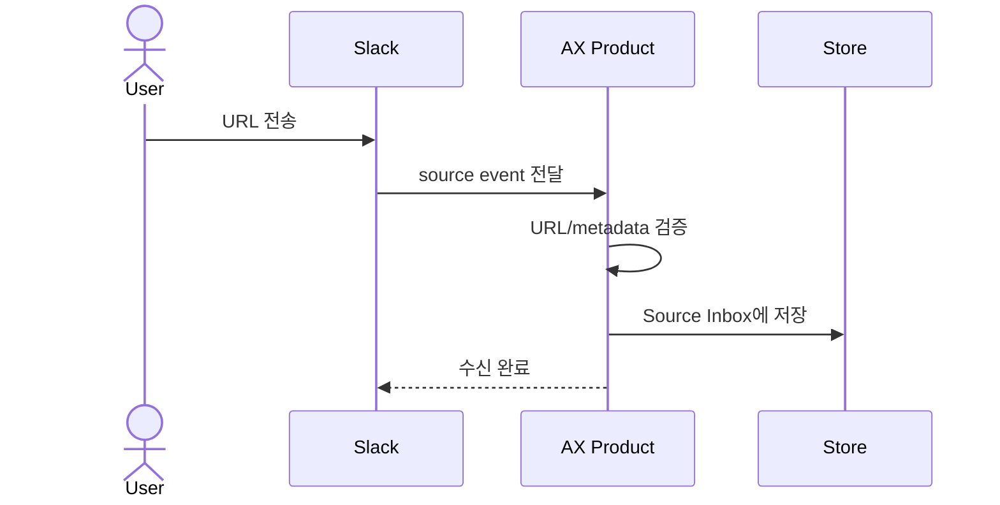
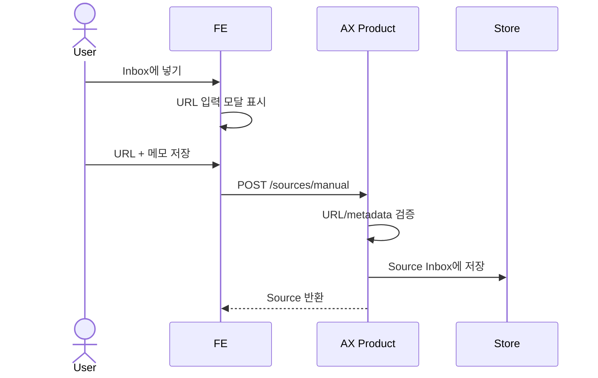
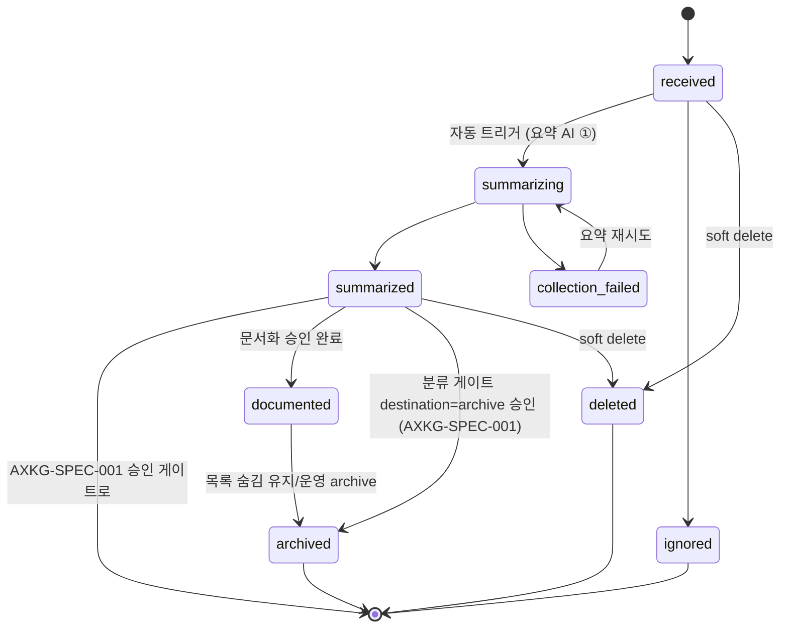

# Source Inbox: URL 1차 수신 위치

Slack으로 들어오거나 페이지에서 직접 입력한 URL은 처음부터 reference나 permanent로 가지 않고, 미분류 raw input queue인 Source Inbox에 저장된다.

> Source Inbox는 PARA의 Inbox/Fleeting 역할이다. 아직 AI가 읽지 않았고, 아직 분류되지 않았고, 아직 영구 지식으로 승인되지 않은 입력만 담는다.

## 1. Context

### Meta

- Decision reference: AXKG-DEC-001, AXKG-DEC-002
- Baseline reference: AXKG-BL-001
- Domain note: `Source Inbox`, `Source`
- Storage: Source Inbox 상태는 PostgreSQL `sources` table에 저장한다.
- 용어: `collection`은 요약 스테이지의 "원문 수집 + 요약 생성" task 전체를 가리킨다. `collection_failed`·`queue-collection`·`COLLECTION_FAILED`는 모두 이 요약 파이프라인(AXKG-SPEC-011 ①)의 실패/재시도를 뜻하며, 별도의 수집 단계가 있는 것이 아니다.

### Business Requirement

사용자는 Slack에 AX 관련 URL을 빠르게 던지거나, 제품 페이지에서 직접 Inbox에 URL을 넣을 수 있어야 한다. 시스템은 이 입력을 잃지 않고 보존하고, source가 `received`가 되면 **자동으로** 요약 AI(①)를 실행해 제목·요약·키워드·자료 유형을 만든다. 다만 요약과 승인 게이트를 거치기 전에는 지식그래프의 확정 노드로 취급하지 않는다.

### Scope

In scope:

- Slack URL 1차 수신
- 페이지 내 직접 URL 입력
- raw input metadata 저장
- Source Inbox 상태 관리
- `received` 시 요약 AI 자동 트리거 상태 전이 및 재시도 상태 관리

Out of scope:

- URL 본문 탐색과 요약 생성 로직 (트리거는 여기서 자동, 탐색·요약 생성 자체는 AXKG-SPEC-001 소관)
- 분류 게이트(②)·문서화 승인 게이트(③)
- 영구 문서 생성
- Slack bot 인증/배포 세부

## 2. UX Contract

### Placement

Source Inbox는 제품의 첫 큐 화면이다.

```text
+--------------------------------------------------+
| Source Inbox                                     |
+---------------------+----------------------------+
| Received Sources    | Selected Source             |
| - received          | URL                         |
| - summarizing       | Slack metadata              |
| - summarized        | Raw text                    |
| - collection_failed | (재시도 가능)               |
+---------------------+----------------------------+
```

### U-1. Source Inbox List

- **상태**: 비어 있음, 수신됨, 요약 중, 요약 완료, 요약 실패
- **문구**: URL, 수신 채널, 수신 시각, 제출자, 상태
- **CTA**: `Inbox에 넣기`, `열기`, `무시`, `삭제`
- **기대 결과**: `Inbox에 넣기`를 누르면 URL 입력 모달이 열린다. source가 `received`가 되면 별도 조작 없이 자동으로 요약 AI(①)가 실행되어 `summarizing → summarized`로 전이한다. 요약이 끝난(`summarized`) 항목만 AXKG-SPEC-001의 승인 게이트로 선택할 수 있다.

### U-2. Source Detail

- **상태**: 선택 없음, source 선택됨
- **문구**: 원본 URL, Slack 메시지 링크, raw text, 제출자, 수신 시각, 요약 상태
- **CTA**: `요약 재시도`(`collection_failed`에서만 활성), `Source 삭제`
- **기대 결과**: source의 원본 정보와 요약 진행 상태를 확인한다. 요약이 실패했으면 `요약 재시도`로 다시 자동 요약을 태울 수 있다.

### U-3. Direct Inbox Modal

- **상태**: 닫힘, 열림, 제출 중, 제출 실패, 중복 URL
- **문구**: URL, 메모, 출처 채널, 제출자, 저장
- **CTA**: `저장`, `취소`
- **기대 결과**: 사용자가 URL을 입력하고 `저장`하면 `source_channel=manual`인 Source가 `received` 상태로 Source Inbox에 추가된다.

## 3. User Scenario

### S-1. User — Slack으로 URL을 던진다

1. 사용자는 Slack 채널 또는 DM에 AX 관련 URL을 보낸다.
2. Slack 연동은 URL과 메시지 metadata를 제품으로 전달한다.
3. 시스템은 URL을 Source Inbox에 `received` 상태로 저장한다.
4. 저장 즉시 시스템은 요약 AI(①)를 자동 실행하고 source를 `summarizing`으로 전이한다.
5. 요약이 끝나면 source는 `summarized`가 되고, 실패하면 `collection_failed`가 되어 재시도할 수 있다.
6. 이 시점의 source는 reference, permanent, product 문서가 아니다.
7. 사용자는 Source Inbox에서 URL과 요약 결과를 확인하고, `summarized` 항목을 AXKG-SPEC-001의 승인 게이트로 선택할 수 있다.

### S-2. System — 중복 URL이 들어온다

1. 같은 URL이 다시 들어온다.
2. 시스템은 기존 Source가 있는지 확인한다.
3. 기존 Source가 아직 `documented` 전이면 새 Slack 메시지 metadata를 기존 Source에 연결한다.
4. 기존 Source가 이미 문서화되었으면 새 입력을 duplicate candidate로 표시한다.

### S-3. User — 페이지에서 직접 Inbox에 URL을 넣는다

1. 사용자는 Source Inbox 화면에서 `Inbox에 넣기`를 누른다.
2. 시스템은 URL 입력 모달을 연다.
3. 사용자는 URL과 선택 메모를 입력한다.
4. 사용자가 `저장`을 누르면 시스템은 URL을 검증한다.
5. 시스템은 `source_channel=manual`인 Source를 `received` 상태로 저장한다.
6. 저장된 Source는 Slack으로 들어온 Source와 같은 Source Inbox 목록에 표시된다.

## 4. Interface Contract

### API Contract

| Method | Path | 요약 | 권한 |
|---|---|---|---|
| POST | `/integrations/slack/sources` | Slack URL을 Source Inbox에 저장 | slack integration |
| POST | `/sources/manual` | 페이지에서 직접 입력한 URL을 Source Inbox에 저장 | owner |
| GET | `/sources?status=received` | Source Inbox 목록 조회 | owner |
| GET | `/sources/{source_id}` | Source 원본 정보 조회 | owner |
| POST | `/sources/{source_id}/queue-collection` | `collection_failed` source의 요약 재시도 (정상 흐름은 `received` 시 자동 트리거이므로 수동 호출 불필요) | owner |
| GET | `/sources/{source_id}/ai-tasks` | source와 연결된 AI task 이력 조회 | owner |

### Request / Response

Slack 수신 요청은 최소한 URL, Slack 메시지 식별자, raw text를 포함한다. 수동 입력 요청은 URL과 선택 메모를 포함한다.

### Validation

| 필드 | 규칙 |
|---|---|
| `source_url` | `http` 또는 `https` URL |
| `source_channel` | `slack` 또는 `manual` |
| `slack_message_ts` | Slack 메시지 timestamp, 선택값이지만 Slack event 수신 시 권장 |
| `submitted_at` | ISO timestamp |
| `raw_text` | 선택값, Slack 메시지 원문 또는 수동 입력 메모 |

### Case Matrix

| 에러 코드 | 백엔드 출력 | 프론트 출력 | 표시 위치 |
|---|---|---|---|
| `INVALID_URL` | URL 형식 오류 | 올바른 URL이 아닙니다. | Source Detail |
| `DUPLICATE_SOURCE` | 기존 Source 존재 | 이미 받은 URL입니다. 기존 항목에 연결했습니다. | Source Inbox List |
| `SLACK_METADATA_MISSING` | Slack 식별자 부족 | Slack 메시지 정보를 일부 저장하지 못했습니다. | Source Detail |
| `MANUAL_NOTE_TOO_LONG` | 수동 메모 길이 초과 | 메모는 2000자 이하로 입력해 주세요. | Direct Inbox Modal |
| `COLLECTION_RETRY_NOT_ALLOWED` | 재시도 불가 상태 | 현재 상태에서는 요약을 재시도할 수 없습니다. | Source Detail |

### Flow

Slack 입력:



페이지 직접 입력:



### State / Lifecycle

이 상태 모델은 제품 전체의 source lifecycle SSOT다. `received`부터 `summarized`까지가 Source Inbox 소관이고, `summarized` 이후 승인 게이트 흐름은 AXKG-SPEC-001이 이어받는다. 최종 문서가 생성된 source는 삭제하지 않고 `documented`로 전이해 기본 Inbox 목록에서 숨긴다.



### Data Contract

| Resource | Field | 설명 |
|---|---|---|
| Source | `id` | 제품 내부 source 식별자 |
| Source | `source_url` | Slack 또는 수동 입력으로 들어온 원본 URL |
| Source | `source_channel` | `slack`, `manual` |
| Source | `slack_message_ts` | Slack 메시지 timestamp. 수동 입력이면 `null` |
| Source | `submitted_at` | 수신 시각 |
| Source | `submitted_by` | Slack 사용자 식별자 또는 제품 사용자 식별자 |
| Source | `raw_text` | Slack 메시지 원문 또는 수동 입력 메모 |
| Source | `status` | `received`, `summarizing`, `summarized`, `collection_failed`, `ignored`, `documented`, `archived`, `deleted` |
| Source | `visible_in_inbox` | 기본 Inbox 목록 표시 여부. `documented`, `archived`, `deleted`는 기본 false |

`archived`의 진입 경로는 두 가지이며 상태는 하나다: (1) 분류 게이트에서 destination=archive 승인(`summarized → archived`, 문서·연결 생성 없음), (2) `documented` 이후 운영상 보관. 두 경우 모두 목록에서 숨기고 row는 보존한다.
| Source | `documented_at` | 최종 문서화 완료 시각 |
| Source | `deleted_at` | soft delete 시각. hard delete는 MVP 범위 밖 |

### Source Inbox Document Form

Source Inbox를 파일 기반으로 남기거나 UI에서 preview할 때는 아래 양식을 따른다. 이 문서는 승인된 지식 문서가 아니라 raw source record다.

필수 frontmatter:

| Field | 설명 |
|---|---|
| `type` | `source` |
| `id` | 제품 내부 source id |
| `status` | `received`, `summarizing`, `summarized`, `collection_failed`, `ignored`, `documented`, `archived`, `deleted` |
| `source_channel` | `slack` 또는 `manual` |
| `source_url` | 원본 URL |
| `submitted_at` | 수신 시각 |
| `submitted_by` | Slack 사용자 식별자 또는 제품 사용자 식별자 |
| `slack_message_ts` | Slack 메시지 timestamp. 수동 입력이면 `null` |
| `classification_gate` | 아직 없으면 `null` |
| `destination_type` | 아직 분류 전이면 `null` |

필수 본문 섹션:

| Section | 역할 |
|---|---|
| `## Raw Input` | Slack 원문과 URL을 보존 |
| `## Source Metadata` | 채널, 제출자, 수신 시각, Slack thread/message 정보 |
| `## Collection Status` | AI 수집 전/후 상태와 실패 사유 |
| `## Next Gate` | 다음에 생성해야 할 승인 게이트 |

Source Inbox 문서는 다음 내용을 넣지 않는다.

- AI가 정리한 최종 reference note 본문
- 사용자가 승인한 permanent note
- 제품 decision/spec 본문
- 문서화 승인 게이트의 최종 승인 연결 목록

## 5. Implementation Rules

- Slack URL과 페이지에서 직접 입력한 URL은 1차로 Source Inbox에만 저장한다.
- Source Inbox의 항목은 승인된 지식이 아니므로 reference/permanent/product 문서로 간주하지 않는다.
- Source Inbox 항목을 파일 또는 preview 문서로 표현할 때는 AXKG-SPEC-003의 Source Inbox Document Form을 따른다.
- source가 `received`가 되면 사용자 조작 없이 자동으로 요약 AI(①)를 실행하고 `summarizing`으로 전이한다. 요약 성공은 `summarized`, 실패는 `collection_failed`이며 `collection_failed`는 재시도할 수 있다.
- 원문 수집 계약과 수집 가능 범위는 AXKG-SPEC-012 소관이다(MVP: YouTube·정적 웹·동적 웹. PDF/RSS 등은 `UNSUPPORTED_SOURCE_TYPE`으로 `collection_failed` 보존, 재시도 대신 "지원 예정 형식" 안내 병기).
- 수집 성공 시 adapter의 `canonical_url` 기준으로 `normalized_url`을 갱신하고 중복을 재검사한다. 기존 source와 합류하면 S-2 중복 규칙을 따른다(AXKG-SPEC-012).
- 요약 AI 실패 시 실패한 `ai_tasks` row를 보존하고 `sources.status=collection_failed`로 전이한다. Source Detail에는 최신 실패 task의 `error_message`와 `요약 재시도` CTA를 표시한다.
- `요약 재시도`는 기존 failed task를 덮어쓰지 않고 새 `ai_tasks` row를 만든다. 새 task는 `retry_of_task_id`로 원 failed task를 참조한다.
- 요약 이후 source는 분류 게이트(②, AXKG-SPEC-001)에서 `project`, `area`, `resource`, `archive` 중 하나로 분류되고, archive 외 destination은 문서화 승인 게이트(③, AXKG-SPEC-004)로 이어진다.
- 문서화 승인 게이트가 최종 승인되고 `documents` row가 생성되면 source는 `documented`가 된다.
- `documented` source는 기본 Source Inbox 목록에서 보이지 않지만, source detail/history와 문서 trace에서는 조회 가능해야 한다.
- Source Inbox에서 삭제한 항목은 hard delete하지 않고 `deleted` 상태와 `deleted_at`을 남기는 soft delete로 처리한다.
- Source Inbox에서 삭제 또는 무시한 항목은 영구 문서화 파이프라인으로 넘어가지 않는다.
- 중복 URL은 새 source를 무조건 만들지 않고 기존 source와 연결할 수 있어야 한다.

## 6. Verification

### Acceptance Criteria

- [ ] Slack URL이 들어오면 Source Inbox에 `received` 상태로 저장된다.
- [ ] 사용자는 페이지에서 `Inbox에 넣기`를 눌러 URL 입력 모달을 열 수 있다.
- [ ] 수동 URL을 저장하면 `source_channel=manual`인 Source가 `received` 상태로 저장된다.
- [ ] 저장된 Source에는 URL, Slack metadata, raw text, 수신 시각이 남는다.
- [ ] Source Inbox 파일/preview는 AXKG-SPEC-003의 필수 frontmatter와 본문 섹션을 따른다.
- [ ] Source Inbox 항목은 reference/permanent/product 문서로 취급되지 않는다.
- [ ] source가 `received`가 되면 자동으로 `summarizing`으로 전이하고 요약 AI가 실행된다.
- [ ] 요약 실패(`collection_failed`) source는 재시도할 수 있다.
- [ ] 요약 재시도는 새 ai_task로 실행되고 기존 실패 task는 보존된다.
- [ ] 요약 이후 분류 목적지는 Source Inbox가 아니라 AXKG-SPEC-001의 승인 게이트에서 확정된다.
- [ ] 최종 문서화된 source는 `documented`가 되고 기본 Inbox 목록에서 숨겨진다.
- [ ] 삭제한 source는 hard delete하지 않고 `deleted` 상태로 soft delete된다.
- [ ] 중복 URL은 기존 Source와 연결되거나 duplicate candidate로 표시된다.

## 7. Open Questions

없음. Slack event는 URL과 metadata 중심으로 저장하고, Source Inbox는 PostgreSQL `sources` table로 관리한다.
