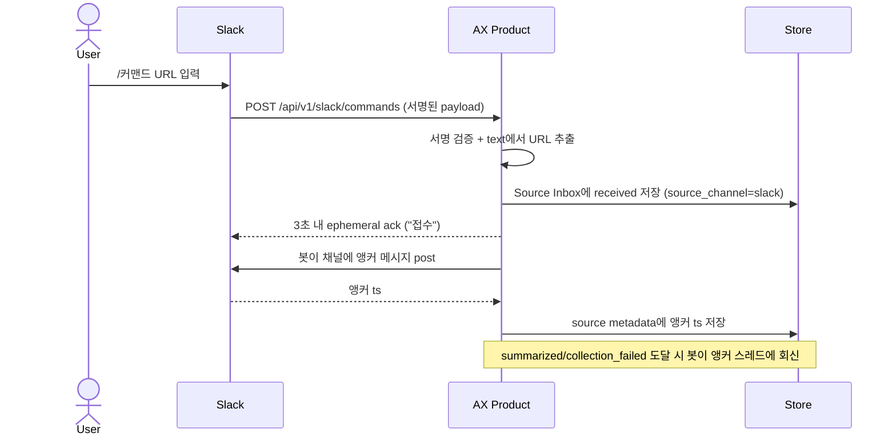
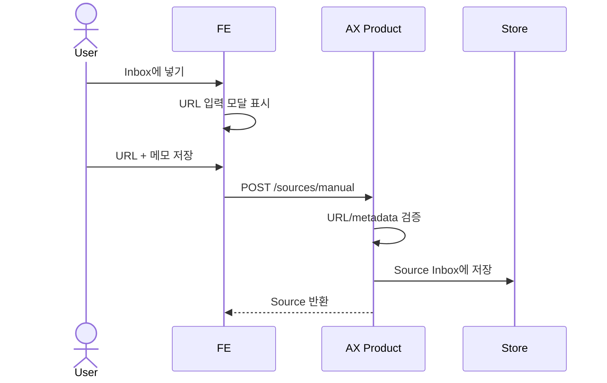
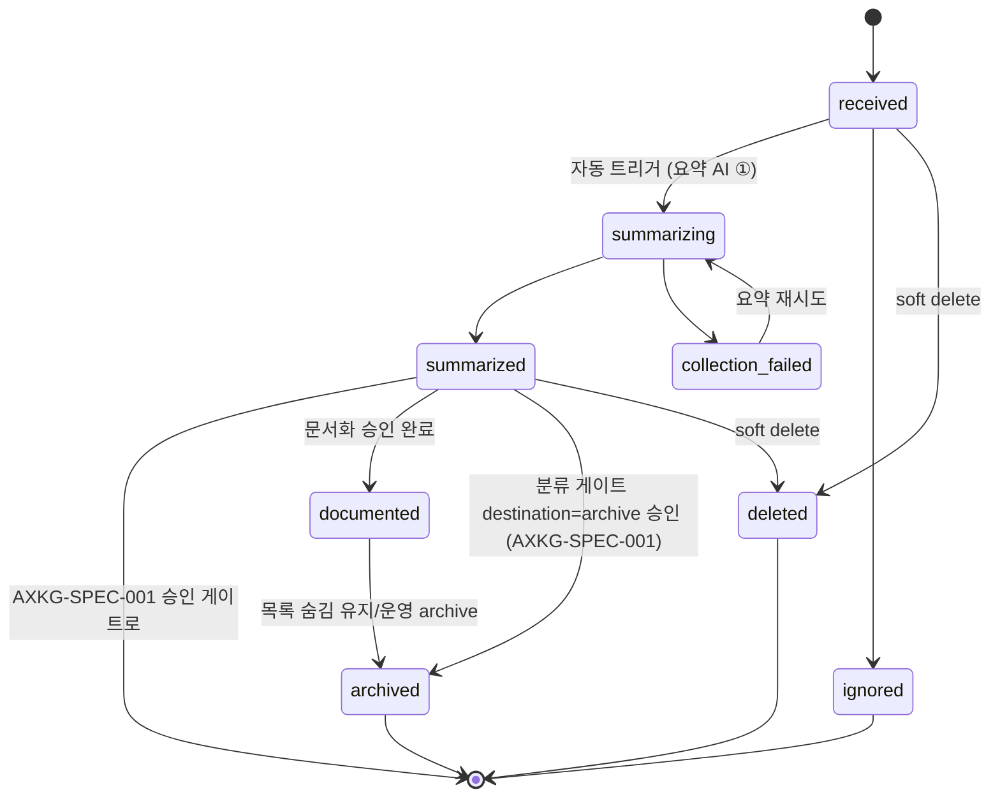

# Source Inbox: URL 1차 수신 위치

Slack으로 들어오거나 페이지에서 직접 입력한 URL, 페이지에서 업로드한 md 파일, 또는 채팅④에서 push된 방안은 처음부터 reference나 permanent로 가지 않고, 미분류 raw input queue인 Source Inbox에 저장된다.

> Source Inbox는 PARA의 Inbox/Fleeting 역할이다. 아직 AI가 읽지 않았고, 아직 분류되지 않았고, 아직 영구 지식으로 승인되지 않은 입력만 담는다.

## 1. Context

### Meta

- Decision reference: AXKG-DEC-001, AXKG-DEC-002
- Baseline reference: AXKG-BL-001
- Domain note: `Source Inbox`, `Source`
- Storage: Source Inbox 상태는 PostgreSQL `sources` table에 저장한다.
- 용어: `collection`은 요약 스테이지의 "원문 수집 + 요약 생성" task 전체를 가리킨다. `collection_failed`·`queue-collection`·`COLLECTION_FAILED`는 모두 이 요약 파이프라인(AXKG-SPEC-011 ①)의 실패/재시도를 뜻하며, 별도의 수집 단계가 있는 것이 아니다.

### Business Requirement

사용자는 Slack에 AX 관련 URL을 빠르게 던지거나, 제품 페이지에서 직접 Inbox에 URL을 넣을 수 있어야 한다. 시스템은 이 입력을 잃지 않고 보존하고, source가 `received`가 되면 **자동으로** 요약 AI(①)를 실행해 제목·요약·키워드·자료 유형의 **요약 초안**을 만든다. 요약 초안은 사용자가 검토하는 게이트다 — 자동으로 분류로 넘어가지 않고, 사용자가 초안을 보고 `피드백`(재요약)하거나 `분류`(분류 게이트 진입)를 눌러야 파이프라인이 진행한다. 요약과 승인 게이트를 거치기 전에는 지식그래프의 확정 노드로 취급하지 않는다.

### Scope

In scope:

- Slack URL 1차 수신
- 페이지 내 직접 URL 입력
- 페이지 내 md 파일 업로드 수신 (`source_channel=upload` intake — v1은 `.md`만, 업로드 md 본문 자체가 원문·URL 수집 스킵)
- 채팅④ 방안 push 수신 (`source_channel=chat` intake — URL 없이 push 시점까지의 대화 내용 전부[방안 포함]를 source로, AXKG-SPEC-006에서 push)
- raw input metadata 저장
- Source Inbox 상태 관리
- `received` 시 요약 AI 자동 트리거 상태 전이 및 재시도 상태 관리
- 요약 초안 렌더(수정 가능 형태) + 피드백 재요약(세션 resume) + `[분류]` 진입 트리거

Out of scope:

- URL 본문 탐색과 요약 생성 로직 (트리거는 여기서 자동, 탐색·요약 생성 자체는 AXKG-SPEC-001 소관)
- 분류 게이트(②)·문서화 승인 게이트(③) — `[분류]`는 여기서 트리거만, 분류 AI 실행·PARA 분류 생성·**PARA 지식 문서 md 생성**은 AXKG-SPEC-001/AXKG-WORK-004(WP3) 소관. (단 **요약 문서 md는 [분류] 확정 시점에 생성**되는 별개 지점으로, 실행·저장 계약은 AXKG-SPEC-011이다 — PARA 문서 md와 혼동하지 않는다.)
- 영구 문서 생성
- Slack bot 인증/배포 세부
- md 외 포맷(pdf/docx 등) 파일 업로드 — 후속 확장(파싱 계층 필요), 이번 라운드 제외

## 2. UX Contract

### Placement

Source Inbox는 제품의 첫 큐 화면이다.

```text
+--------------------------------------------------+
| Source Inbox                                     |
+---------------------+----------------------------+
| Received Sources    | Selected Source             |
| - received          | URL                         |
| - summarizing       | Slack metadata              |
| - summarized        | Raw text                    |
| - collection_failed | (재시도 가능)               |
+---------------------+----------------------------+
```

### U-1. Source Inbox List

- **상태**: 비어 있음, 수신됨, 요약 중, 요약 완료, 요약 실패
- **문구**: URL, 수신 채널, 수신 시각, 제출자, 상태
- **CTA**: `Inbox에 넣기`, `열기`, `무시`, `삭제`
- **기대 결과**: `Inbox에 넣기`를 누르면 URL 입력 모달이 열린다. source가 `received`가 되면 별도 조작 없이 자동으로 요약 AI(①)가 실행되어 `summarizing → summarized`로 전이한다. 요약이 끝난(`summarized`) 항목을 열면 U-2의 요약 초안 검토로 들어간다 — **요약이 자동으로 분류로 넘어가지 않고**, 사용자가 초안을 검토해 `분류`를 눌러야 AXKG-SPEC-001의 분류 게이트로 진입한다.

### U-2. Source Detail · 요약 초안 검토

- **상태**: 선택 없음, source 선택됨(요약 중 / 요약 완료(초안) / 요약 실패)
- **문구**: 원본 URL, Slack 메시지 링크, raw text(메모), 제출자, 수신 시각, 요약 상태. `summarized`이면 요약 초안(제목·요약·키워드·자료 유형)을 **수정 가능한 형태**로 렌더한다 — 문서보기 모달(요약 md 미리보기)과 폼(제목/요약/키워드 필드) 두 표면.
- **CTA**:
  - `summarized`(요약 초안): `피드백`(자연어 입력 → 세션 resume 재요약, `summary_payload`에 v2 새 버전 박제 — v1 보존) · `분류`(분류 게이트로 진입 트리거, AXKG-SPEC-001)
  - `collection_failed`: `메모 추가`/`메모 수정` · `요약 재시도`
  - 공통: `Source 삭제`
- **기대 결과**: source의 원본 정보와 요약 진행 상태를 확인한다.
  - 요약이 끝나면(`summarized`) 요약 초안이 수정 가능한 형태로 뜬다. 사용자는 `피드백`으로 원하는 방향을 자연어로 남겨 재요약(v2)을 받거나, 초안이 만족스러우면 `분류`를 눌러 분류 게이트로 진입시킨다. **요약이 자동으로 분류로 넘어가지 않는다 — 사용자가 `분류`를 눌러야 진입한다.** 요약 초안 draft(v1/v2)는 `sources.summary_payload`(DB)에 박제(피드백 히스토리)되고, 재요약은 **직전 버전(v1)을 덮어쓰지 않고 새 버전(v2)을 박제(immutable)로 남긴다** — 게이트 revision과 동일한 버전 원칙이다(AXKG-SPEC-002). 사용자가 `분류`를 눌러 요약을 확정하는 순간, **그 시점의 active 요약 버전이 요약 문서(md)로 확정**된다(draft=DB 박제 / 확정=md — 요약·문서화 공통 저장 패턴, AXKG-SPEC-011). 이 md 생성은 [분류] 진입(요약 확정) 시점이며, 뒤이어 열리는 분류 게이트가 md를 만드는 것이 아니다(요약 문서 md는 `data/documents/summaries/{stem}.md`에 저장되는 보관용 side-output — §7). 피드백 재생성은 직전 초안(v1)을 참조(`parent`)로 두고 세션 resume로 원문·지침 재전송 없이 이어서 생성한다(버전·resume 규칙 AXKG-SPEC-002, 배선 AXKG-SPEC-011).
  - 요약이 실패했으면(`collection_failed`) `요약 재시도`로 다시 자동 요약을 태울 수 있다. **원문 수집이 안 되는 사이트(Cloudflare/봇 방어 등)라 `collection_failed`가 된 경우, 사용자는 메모(복붙 텍스트 등)를 추가·수정한 뒤 재요약할 수 있고, 그러면 그 메모를 원문 대신 요약 입력으로 삼아(AXKG-SPEC-012 User Note Fallback) `summarized`에 도달할 수 있다.** 메모 기반 요약과 원문 기반 요약을 UI에서 구분 표기하지 않는다.

### U-3. Direct Inbox Modal

- **상태**: 닫힘, 열림, 제출 중, 제출 실패, 중복 URL, 파일 형식 오류
- **문구**: URL, 메모, 출처 채널, 제출자, 저장, md 파일 업로드, 선택된 파일명, 허용 형식(`.md`)
- **CTA**: `저장`, `취소`, `md 파일 업로드`
- **기대 결과**: 이 표면은 두 입력 방식을 갖는다(같은 모달). ① 사용자가 URL을 입력하고 `저장`하면 `source_channel=manual`인 Source가 `received` 상태로 추가된다. 여기서 입력한 **메모(`note`)는 원문 수집이 실패했을 때 요약 입력으로 쓰이는 fallback 소스다**(AXKG-SPEC-012 User Note Fallback). URL 수집이 성공하면 원문을 우선하고 메모는 요약에 쓰지 않는다. ② 사용자가 md 파일을 업로드하고 `저장`하면 `source_channel=upload`인 Source가 `received`로 추가되고, **업로드한 md 본문 자체가 원문**이 되어 URL 수집 없이 그대로 요약 입력이 된다(fallback이 아니라 원문 그 자체). v1은 `.md`만 허용하며, 다른 형식은 저장하지 않고 형식 오류를 표시한다. 이 표면(수동 입력·업로드)은 **admin 전용**이다(접근 경계 SSOT AXKG-SPEC-008 — 업로드는 기존 소스 Inbox 표면의 확장이라 경계 변경 없음).

## 3. User Scenario

### S-1. User — Slack 슬래시 커맨드로 URL을 던진다

1. 사용자는 Slack 채널 또는 DM에서 슬래시 커맨드로 `<커맨드> <URL>`을 입력한다. 원문 수집이 어려운 링크는 메모를 함께 넘길 수 있다: `<커맨드> <URL> << 메모 내용 >>` — `<< >>`로 감싼 텍스트가 메모다.
2. Slack은 등록된 Request URL로 커맨드 payload(command/text/channel_id/user_id/team_id/trigger_id)를 POST한다.
3. 시스템은 서명을 검증하고 `text`에서 URL을 추출한다. URL이 없거나 형식이 틀리면 사용법을 ephemeral로 안내하고 저장하지 않는다. URL 추출 후 `text`에 `<< >>`로 감싼 구간이 있으면 그 안(trim 후 non-empty)을 메모(`raw_text`)로 저장한다. `<< >>`가 없으면 메모 없음이다.
4. 유효하면 시스템은 URL을 Source Inbox에 `received`(`source_channel=slack`) 상태로 저장하고, 3초 내에 "접수" ephemeral ack를 반환한다. `trigger_id` 기반 합성 키로 더블서밋을 막는다.
5. 슬래시 커맨드는 채널 메시지를 남기지 않으므로, 접수 후 봇이 채널에 앵커 메시지를 post하고 그 `ts`를 source metadata에 저장한다.
6. 저장 즉시 시스템은 요약 AI(①)를 자동 실행하고 source를 `summarizing`으로 전이한다.
7. 요약이 끝나면 source는 `summarized`가 되어 봇이 앵커 스레드에 요약 초안을 회신하고, 실패하면 `collection_failed`가 되어 실패 사유를 스레드에 회신하고 재시도할 수 있다.
8. 이 시점(요약 확정 전)의 source는 아직 reference, permanent, product 문서가 아니다. 요약 초안은 `sources.summary_payload`(DB) draft로만 존재한다.
9. 사용자는 Source Inbox에서 URL과 요약 초안을 확인하고, U-2에서 `피드백`으로 재요약하거나 `분류`를 눌러 AXKG-SPEC-001의 분류 게이트로 진입시킨다. `분류`를 누르는 순간 요약이 확정되어 그 시점의 active 요약 버전이 요약 문서(md)로 생성되고, 이어서 분류 게이트가 열린다(분류 게이트 자체는 md를 만들지 않는다). 요약이 자동으로 분류로 넘어가지 않는다.

### S-2. System — 중복 URL이 들어온다

1. 같은 URL이 다시 들어온다.
2. 시스템은 기존 Source가 있는지 확인한다.
3. 기존 Source가 아직 `documented` 전이면 새 Slack 메시지 metadata를 기존 Source에 연결한다.
4. 기존 Source가 이미 문서화되었으면 새 입력을 duplicate candidate로 표시한다.

### S-3. User — 페이지에서 직접 Inbox에 URL을 넣는다

1. 사용자는 Source Inbox 화면에서 `Inbox에 넣기`를 누른다.
2. 시스템은 URL 입력 모달을 연다.
3. 사용자는 URL과 선택 메모를 입력한다.
4. 사용자가 `저장`을 누르면 시스템은 URL을 검증한다.
5. 시스템은 `source_channel=manual`인 Source를 `received` 상태로 저장한다.
6. 저장된 Source는 Slack으로 들어온 Source와 같은 Source Inbox 목록에 표시된다.

### S-4. User — 채팅 방안을 Source Inbox로 push한다

1. 사용자(staff 또는 admin)가 채팅④에서 AI가 제시한 방안을 `Source Inbox에 추가`로 push한다(push 동작·API는 AXKG-SPEC-006).
2. 시스템은 push 시점까지의 채팅 대화 내용 전부(user·assistant 메시지 이력, 방안 포함)를 `raw_text`로, `source_url` 없이 `source_channel=chat`인 Source를 `received` 상태로 저장한다.
3. 이후는 slack/manual source와 동일한 lifecycle이다 — `received`가 되면 자동으로 요약 AI(①)가 실행된다. URL이 없으므로 원문 수집 대상이 없고, `raw_text`(대화 내용 전부)가 곧 요약 입력이 된다(AXKG-SPEC-012 User Note Fallback 경로 재사용). 방안만 떼면 맥락·근거가 유실되므로 대화 전체를 넣고 요약①이 정제한다.
4. 요약→분류→문서화 게이트 흐름과 분류 승인(admin)은 slack/manual과 동일하다(AXKG-SPEC-001/002 무변경).
5. chat source는 push한 staff·admin이 만들지만, **Source Inbox 목록·관리 표면은 admin 전용**이므로 staff는 자신이 push한 source를 인박스 화면에서 열람·관리할 수 없다(접근 경계 SSOT AXKG-SPEC-008).

### S-5. Admin — md 파일을 업로드해 Inbox에 넣는다

1. admin이 Source Inbox의 `Inbox에 넣기` 모달(U-3)에서 `md 파일 업로드`를 선택한다.
2. admin이 `.md` 파일을 고르고 `저장`을 누른다. 파일 형식이 `.md`가 아니면 시스템은 저장하지 않고 형식 오류(`UNSUPPORTED_UPLOAD_TYPE`)를 표시한다.
3. 시스템은 업로드 md 본문을 `raw_text`로, `source_url` 없이 `source_channel=upload`인 Source를 `received` 상태로 저장하고 원본 파일명(`original_filename`)을 보존한다.
4. `received`가 되면 자동으로 요약 AI(①)가 실행된다. **URL 수집을 스킵하고 업로드 md 본문 자체가 원문**이 되어 그대로 요약 입력이 된다(AXKG-SPEC-012 adapter 대상 아님 — fallback이 아니라 원문 그 자체).
5. 이후 요약→분류→문서화 게이트 흐름은 slack/manual/chat과 동일하다. 표면은 admin 전용이며 접근 경계 변경은 없다.

## 4. Interface Contract

### API Contract

| Method | Path | 요약 | 권한 |
|---|---|---|---|
| POST | `/api/v1/slack/commands` | Slack 슬래시 커맨드 수신 → `text`에서 URL 추출·Source Inbox 저장. Slack 등록 Request URL과 문자 그대로 일치(다른 라우트의 무prefix 관례에 대한 예외, rewrite 없음) | slack signing secret |
| POST | `/sources/manual` | 페이지에서 직접 입력한 URL을 Source Inbox에 저장 | owner |
| GET | `/sources?status=received` | Source Inbox 목록 조회 | owner |
| GET | `/sources/{source_id}` | Source 원본 정보 조회 | owner |
| POST | `/sources/{source_id}/queue-collection` | `collection_failed` source의 요약 재시도 (정상 흐름은 `received` 시 자동 트리거이므로 수동 호출 불필요). optional `note`를 함께 보내면 source 메모(`raw_text`)를 갱신한 뒤 재큐한다 — 원문 수집 불가 사이트에 메모를 추가·수정해 재요약하는 경로(User Note Fallback). 최종 파라미터 형태는 BE 구현과 정합 | owner |
| GET | `/sources/{source_id}/ai-tasks` | source와 연결된 AI task 이력 조회 | owner |
| POST | `/sources/{source_id}/ignore` | source를 `ignored`로 전이 (파이프라인 제외, row 보존) | owner |
| DELETE | `/sources/{source_id}` | source soft delete → `deleted`(+`deleted_at`), row 보존·기본 목록 숨김 | owner |

> Source Inbox 표면(목록·조회·수집·삭제/무시)은 **admin 전용**이다 — staff는 접근할 수 없다. Slack 슬래시 커맨드는 signing secret으로 보호되는 별도 경로다. **예외 — chat push 생성**: 채팅④에서 방안을 push해 `source_channel=chat` source를 생성하는 단일 쓰기 액션은 staff·admin 모두 허용한다(2026-07-14 확정, AXKG-DEC-006 개정). 이 액션은 인박스에 source를 **쓰기만** 하며 인박스 목록·조회·관리 표면 접근은 부여하지 않는다(비대칭). push endpoint 자체는 채팅 표면에 있고(`POST /graph/chats/{chat_id}/push-to-inbox`, AXKG-SPEC-006), 이 spec은 그 결과로 생기는 chat source의 데이터 계약을 소유한다. 접근 경계 매트릭스 SSOT는 AXKG-SPEC-008이며 여기서는 재서술하지 않는다.

### Request / Response

Slack 수신 요청은 슬래시 커맨드 payload(command/text/channel_id/user_id/team_id/trigger_id)이며, URL은 `text`에서 추출한다. 수동 입력 요청은 URL과 선택 메모를 포함한다.

### Validation

| 필드 | 규칙 |
|---|---|
| `source_url` | `http` 또는 `https` URL. Slack은 커맨드 `text`에서 추출(없거나 형식 오류면 저장하지 않고 사용법 ephemeral). **`source_channel=chat`·`upload`이면 URL이 없어 `null`** — chat은 `raw_text`(대화 전부), upload는 `raw_text`(md 본문)가 요약 입력이다 |
| `source_channel` | `slack`, `manual`, `chat`, `upload` |
| `slack_message_ts` | 접수 후 봇이 post한 앵커 메시지 timestamp(요약 회신 스레드 기준). 수동 입력·chat·upload이면 `null` |
| `upload file` | `source_channel=upload`은 v1에서 확장자 `.md`만 허용한다. 그 외 형식은 저장하지 않고 `UNSUPPORTED_UPLOAD_TYPE`. 업로드 파일 크기 상한은 구현 기본값(§7 OQ) |
| `original_filename` | `source_channel=upload`에서 업로드 원본 파일명 보존. 다른 채널이면 `null` |
| `submitted_at` | ISO timestamp |
| `raw_text` | 수동 입력 메모, Slack 커맨드 `text`의 `<< >>` 안 텍스트, **chat push의 대화 내용 전부**(push 시점까지의 user·assistant 메시지 이력, 제시된 방안 포함), 또는 **업로드 md 파일 본문**. slack/manual에서는 원문 수집 실패 시 요약 입력이 되는 fallback 메모이고, `source_channel=chat`에서는 URL이 없으므로 이 대화 내용이 곧 요약 입력이다(AXKG-SPEC-012 User Note Fallback). `source_channel=upload`에서는 이 md 본문 자체가 원문이라 URL 수집 없이 곧 요약 입력이다(fallback 아님·원문 그 자체). "있음/없음"은 trim 후 non-empty 기준. chat·upload source는 `raw_text`가 필수. 대화 이력 직렬화 형식은 AXKG-SPEC-006 §7 OQ |
| `trigger_id` | Slack 슬래시 커맨드 멱등 키 원천(더블서밋 차단), Slack 수신 시에만 |

### Case Matrix

| 에러 코드 | 백엔드 출력 | 프론트 출력 | 표시 위치 |
|---|---|---|---|
| `INVALID_URL` | URL 형식 오류 | 올바른 URL이 아닙니다. | Source Detail |
| `DUPLICATE_SOURCE` | 기존 Source 존재 | 이미 받은 URL입니다. 기존 항목에 연결했습니다. | Source Inbox List |
| `SLACK_URL_MISSING` | 커맨드 `text`에 URL 없음/형식 오류 | 사용법: `<커맨드> <URL>` 형식으로 링크를 함께 보내주세요. | Slack ephemeral |
| `MANUAL_NOTE_TOO_LONG` | 수동 메모 길이 초과 | 메모는 2000자 이하로 입력해 주세요. | Direct Inbox Modal |
| `UNSUPPORTED_UPLOAD_TYPE` | 업로드 파일이 `.md`가 아님(v1) | md 파일만 업로드할 수 있습니다. | Direct Inbox Modal |
| `COLLECTION_RETRY_NOT_ALLOWED` | 재시도 불가 상태 | 현재 상태에서는 요약을 재시도할 수 없습니다. | Source Detail |

### Flow

Slack 입력 (슬래시 커맨드):



페이지 직접 입력:



### State / Lifecycle

이 상태 모델은 제품 전체의 source lifecycle SSOT다. `received`부터 `summarized`까지가 Source Inbox 소관이고, `summarized` 이후 승인 게이트 흐름은 AXKG-SPEC-001이 이어받는다. 최종 문서가 생성된 source는 삭제하지 않고 `documented`로 전이해 기본 Inbox 목록에서 숨긴다.

`summarized` source에서 사용자가 `분류`를 눌러 분류 게이트로 진입할 때(요약 확정), 그 시점의 active 요약 버전이 요약 문서(md)로 확정된다 — source 상태 전이(분류 게이트 진입)와 별개로 **요약 문서 md가 산출되는 지점**이다(제품의 md 생성 지점 두 곳 중 첫째, 둘째는 문서화 게이트 승인 시 PARA 지식 문서). 요약 문서 md는 `data/documents/summaries/`에 저장되는 보관용 side-output이고 그래프 노드가 아니다(§7 결정), 실행·저장 계약은 AXKG-SPEC-011이다.



### Data Contract

| Resource | Field | 설명 |
|---|---|---|
| Source | `id` | 제품 내부 source 식별자 |
| Source | `source_url` | Slack 또는 수동 입력으로 들어온 원본 URL. `source_channel=chat`·`upload`이면 URL이 없어 `null` |
| Source | `source_channel` | `slack`, `manual`, `chat`, `upload` |
| Source | `slack_message_ts` | 접수 후 봇 앵커 메시지 timestamp(요약 회신 스레드 기준). 수동 입력·chat·upload이면 `null` |
| Source | `submitted_at` | 수신 시각 |
| Source | `submitted_by` | Slack 사용자 식별자 또는 제품 사용자 식별자. chat push는 push한 유저, upload는 업로드한 admin |
| Source | `raw_text` | Slack 메시지 원문, 수동 입력 메모, chat push의 대화 내용 전부(push 시점까지, 방안 포함), 또는 업로드 md 본문. chat·upload source의 요약 입력이 된다 |
| Source | `original_filename` | `source_channel=upload`의 업로드 원본 파일명. 다른 채널이면 `null` |
| Source | `status` | `received`, `summarizing`, `summarized`, `collection_failed`, `ignored`, `documented`, `archived`, `deleted` |
| Source | `visible_in_inbox` | 기본 Inbox 목록 표시 여부. `documented`, `archived`, `deleted`는 기본 false |

`archived`의 진입 경로는 두 가지이며 상태는 하나다: (1) 분류 게이트에서 destination=archive 승인(`summarized → archived`, 문서·연결 생성 없음), (2) `documented` 이후 운영상 보관. 두 경우 모두 목록에서 숨기고 row는 보존한다.
| Source | `documented_at` | 최종 문서화 완료 시각 |
| Source | `deleted_at` | soft delete 시각. hard delete는 MVP 범위 밖 |

### Source Inbox Document Form

Source Inbox를 파일 기반으로 남기거나 UI에서 preview할 때는 아래 양식을 따른다. 이 문서는 승인된 지식 문서가 아니라 raw source record다.

필수 frontmatter:

| Field | 설명 |
|---|---|
| `type` | `source` |
| `id` | 제품 내부 source id |
| `status` | `received`, `summarizing`, `summarized`, `collection_failed`, `ignored`, `documented`, `archived`, `deleted` |
| `source_channel` | `slack`, `manual`, `chat`, `upload` |
| `source_url` | 원본 URL. `chat`·`upload`이면 없음(`null`) |
| `submitted_at` | 수신 시각 |
| `submitted_by` | Slack 사용자 식별자 또는 제품 사용자 식별자 |
| `slack_message_ts` | 접수 후 봇 앵커 메시지 timestamp. 수동 입력이면 `null` |
| `classification_gate` | 아직 없으면 `null` |
| `destination_type` | 아직 분류 전이면 `null` |

필수 본문 섹션:

| Section | 역할 |
|---|---|
| `## Raw Input` | Slack 원문과 URL을 보존 |
| `## Source Metadata` | 채널, 제출자, 수신 시각, Slack thread/message 정보 |
| `## Collection Status` | AI 수집 전/후 상태와 실패 사유 |
| `## Next Gate` | 다음에 생성해야 할 승인 게이트 |

Source Inbox 문서는 다음 내용을 넣지 않는다.

- AI가 정리한 최종 reference note 본문
- 사용자가 승인한 permanent note
- 제품 decision/spec 본문
- 문서화 승인 게이트의 최종 승인 연결 목록

## 5. Implementation Rules

- Slack URL과 페이지에서 직접 입력한 URL은 1차로 Source Inbox에만 저장한다.
- 채팅④에서 push된 것은 `source_channel=chat`·`source_url=null`·`slack_message_ts=null`인 Source로 `received`에 저장한다. `raw_text`는 **push 시점까지의 채팅 대화 내용 전부(방안 포함)**이며 필수다(trim 후 non-empty). push 동작·endpoint·권한(staff·admin 단일 쓰기 액션)·대화 직렬화 형식은 AXKG-SPEC-006이 소유하고, 이 spec은 생성된 chat source의 데이터 계약과 이후 lifecycle을 소유한다. chat source는 URL이 없어 원문 수집 없이 `raw_text`가 요약 입력이 된다(AXKG-SPEC-012 User Note Fallback 경로 재사용). 요약 이후 흐름·분류 승인(admin)은 slack/manual과 동일하다.
- 페이지에서 업로드한 md 파일은 `source_channel=upload`·`source_url=null`·`slack_message_ts=null`인 Source로 `received`에 저장한다. v1은 확장자 `.md`만 허용하고 그 외 형식은 저장하지 않고 `UNSUPPORTED_UPLOAD_TYPE`로 거부한다(source row를 만들지 않는 intake validation, 수집 실패와 무관). 업로드 md 본문을 `raw_text`(필수)로, 원본 파일명을 `original_filename`으로 보존한다. **업로드 md 본문 자체가 원문**이라 URL 수집을 스킵하고 `raw_text`가 곧 요약 입력이 된다 — chat의 User Note Fallback과 달리 fallback이 아니라 원문 그 자체다(AXKG-SPEC-012 adapter 대상 아님). 이 표면은 기존 수동 입력 표면의 확장이라 **admin 전용**이며 접근 경계 변경은 없다(SSOT AXKG-SPEC-008 소스 Inbox 표면 행에 포섭). 요약 이후 흐름·분류 승인(admin)은 slack/manual과 동일하다. 파일 크기 상한·저장 위치(DB vs 파일시스템)·md frontmatter 처리는 구현 소관이다(§7 OQ).
- Slack intake는 슬래시 커맨드로 받는다. Slack이 등록된 Request URL(`POST /api/v1/slack/commands`, 등록 문자열과 그대로 일치)로 커맨드 payload를 POST한다. 이 경로는 토큰 로그인(AXKG-SPEC-008) 대상이 아니라 Slack signing secret 서명 검증으로 보호하며, 서버는 커맨드 이름과 무관하게 `text`의 URL로 동작한다.
- 슬래시 커맨드 수신 시 3초 내 ephemeral ack("접수")를 반환하고, `trigger_id` 기반 합성 키로 더블서밋을 막는다. `text`에 유효한 URL이 없으면 사용법을 ephemeral로 안내하고 저장하지 않는다.
- 접수 후 봇이 채널에 앵커 메시지를 post하고 그 `ts`를 source metadata에 저장한다. `summarized` 도달 시 앵커 스레드에 요약 결과를, `collection_failed` 시 실패 사유를 회신한다.
- Source Inbox의 항목은 승인된 지식이 아니므로 reference/permanent/product 문서로 간주하지 않는다.
- Source Inbox 항목을 파일 또는 preview 문서로 표현할 때는 AXKG-SPEC-003의 Source Inbox Document Form을 따른다.
- source가 `received`가 되면 사용자 조작 없이 자동으로 요약 AI(①)를 실행하고 `summarizing`으로 전이한다. 요약 성공은 `summarized`, 실패는 `collection_failed`이며 `collection_failed`는 재시도할 수 있다.
- 요약이 끝나(`summarized`) 만들어진 요약 초안 draft(v1/v2)는 `sources.summary_payload`(DB)에 박제(피드백 히스토리)되고, U-2에서 수정 가능한 형태(문서보기 모달·폼)로 렌더된다. **사용자가 `분류`를 눌러 요약을 확정하는 시점에 그 active 요약 버전이 요약 문서(md)로 확정된다**(draft=DB 박제 / 확정=md — 요약·문서화 공통 저장 패턴, 실행 계약 AXKG-SPEC-011). 종전의 '확정 md는 문서화 승인 후에만'(요약=DB only) 서술은 폐기한다 — md 생성 지점은 요약 확정([분류])과 문서화 게이트 승인(AXKG-SPEC-004) 두 곳이다. 요약 문서 md는 `data/documents/summaries/{stem}.md`에 저장되는 보관용 side-output이며 그래프 노드가 아니다(§7 결정).
- **요약이 자동으로 분류로 넘어가지 않는다.** `summarized`는 게이트 상태이며, 사용자가 U-2에서 `분류`를 눌러야 분류 게이트로 진입한다(`POST /sources/{source_id}/classification-gates`, AXKG-SPEC-001). 이 spec은 진입 트리거까지이고 분류 AI 실행·PARA 분류 생성은 AXKG-SPEC-001 소관이다.
- 요약 초안 `피드백`은 자연어 입력을 받아 재요약(v2)을 실행한다. 재요약은 새 `ai_tasks` row로 실행되고 직전 요약 실행의 `open_kknaks_session_id`를 resume로 이어서(원문·방법 지침 재전송 없이) 피드백만 반영한다. **결과는 직전 버전(v1)을 덮어쓰지 않고 `sources.summary_payload`에 새 버전(v2)을 박제(immutable)로 남긴다** — v1은 read-only로 보존되고 v2는 `parent`(v1)를 참조한다. 게이트 revision과 동일한 immutable 버전 체인 원칙이며(버전·resume 규칙 AXKG-SPEC-002, submit 배선 AXKG-SPEC-011), gate_kind·approve-lock 같은 게이트 전용 상태 기계는 적용하지 않는다. **요약 버전의 저장 위치·구조 세부(`summary_payload` 내 버전 배열 vs 별도 버전 테이블)는 BE 구현 소관(OQ)이고, 이 spec은 원칙(박제·비덮어쓰기·v1 보존)을 계약으로 규정한다.** 피드백/재요약 API의 최종 파라미터 형태는 BE 구현과 정합한다(코드 병렬 태스크 소관).
- 요약 초안 단계에는 승인/잠금 개념이 없다. 사용자는 만족할 때까지 `피드백`으로 재요약하고, `분류`로만 다음 단계로 넘어간다.
- 원문 수집 계약과 수집 가능 범위는 AXKG-SPEC-012 소관이다(MVP: YouTube·정적 웹·동적 웹. PDF/RSS 등은 `UNSUPPORTED_SOURCE_TYPE`으로 `collection_failed` 보존, 재시도 대신 "지원 예정 형식" 안내 병기).
- URL 원문 수집이 모두 실패해도 source에 메모(`raw_text`, trim 후 non-empty)가 있으면 그 메모를 요약 입력으로 삼아 `summarized`에 도달한다(AXKG-SPEC-012 User Note Fallback). `collection_failed`는 "원문 수집 실패 AND 메모 없음"일 때만이다. URL 수집이 성공하면 원문을 우선하고 메모는 요약에 쓰지 않는다.
- `collection_failed` source에는 메모를 추가·수정한 뒤 재요약할 수 있다. 메모 갱신 재요약은 `queue-collection`에 `note`를 함께 보내 `raw_text`를 갱신하고 새 `ai_tasks` row로 재큐한다(기존 실패 task 보존). 메모 기반 요약과 원문 기반 요약을 상태·payload·UI에서 구분 표기하지 않는다(source_basis 플래그/배지 없음).
- 수집 성공 시 adapter의 `canonical_url` 기준으로 `normalized_url`을 갱신하고 중복을 재검사한다. 기존 source와 합류하면 S-2 중복 규칙을 따른다(AXKG-SPEC-012).
- 요약 AI 실패 시 실패한 `ai_tasks` row를 보존하고 `sources.status=collection_failed`로 전이한다. Source Detail에는 최신 실패 task의 `error_message`와 `요약 재시도` CTA를 표시한다.
- `요약 재시도`는 기존 failed task를 덮어쓰지 않고 새 `ai_tasks` row를 만든다. 새 task는 `retry_of_task_id`로 원 failed task를 참조한다.
- 요약 이후 source는 분류 게이트(②, AXKG-SPEC-001)에서 `project`, `area`, `resource`, `archive` 중 하나로 분류되고, archive 외 destination은 문서화 승인 게이트(③, AXKG-SPEC-004)로 이어진다.
- 문서화 승인 게이트가 최종 승인되고 `documents` row가 생성되면 source는 `documented`가 된다.
- `documented` source는 기본 Source Inbox 목록에서 보이지 않지만, source detail/history와 문서 trace에서는 조회 가능해야 한다.
- Source Inbox에서 삭제한 항목은 hard delete하지 않고 `deleted` 상태와 `deleted_at`을 남기는 soft delete로 처리한다.
- Source Inbox에서 삭제 또는 무시한 항목은 영구 문서화 파이프라인으로 넘어가지 않는다.
- 중복 URL은 새 source를 무조건 만들지 않고 기존 source와 연결할 수 있어야 한다.

## 6. Verification

### Acceptance Criteria

- [ ] Slack URL이 들어오면 Source Inbox에 `received` 상태로 저장된다.
- [ ] 사용자는 페이지에서 `Inbox에 넣기`를 눌러 URL 입력 모달을 열 수 있다.
- [ ] 수동 URL을 저장하면 `source_channel=manual`인 Source가 `received` 상태로 저장된다.
- [ ] 채팅④에서 push하면 `source_channel=chat`·URL 없이 `raw_text`(push 시점까지의 대화 내용 전부, 방안 포함)를 담은 Source로 `received`에 저장되고, slack/manual과 동일한 요약→분류 lifecycle을 탄다.
- [ ] chat source는 URL 원문 수집 없이 `raw_text`(대화 내용 전부)가 요약 입력이 되어 `summarized`에 도달한다.
- [ ] 페이지에서 `.md` 파일을 업로드하면 `source_channel=upload`·URL 없이 md 본문(`raw_text`)과 원본 파일명(`original_filename`)을 담은 Source로 `received`에 저장되고, slack/manual과 동일한 요약→분류 lifecycle을 탄다.
- [ ] upload source는 URL 수집을 스킵하고 업로드 md 본문 자체가 원문으로 요약 입력이 되어 `summarized`에 도달한다(fallback 아님).
- [ ] `.md`가 아닌 파일 업로드는 `UNSUPPORTED_UPLOAD_TYPE`으로 거부되고 source가 생성되지 않는다.
- [ ] 업로드 표면은 admin 전용이며 접근 경계 변경이 없다(기존 소스 Inbox 표면 행에 포섭).
- [ ] 저장된 Source에는 URL, Slack metadata, raw text, 수신 시각이 남는다.
- [ ] Source Inbox 파일/preview는 AXKG-SPEC-003의 필수 frontmatter와 본문 섹션을 따른다.
- [ ] Source Inbox 항목은 reference/permanent/product 문서로 취급되지 않는다.
- [ ] source가 `received`가 되면 자동으로 `summarizing`으로 전이하고 요약 AI가 실행된다.
- [ ] 요약 실패(`collection_failed`) source는 재시도할 수 있다.
- [ ] 요약 재시도는 새 ai_task로 실행되고 기존 실패 task는 보존된다.
- [ ] Slack 커맨드 `text`에 `<< 메모 >>`가 있으면 그 안 텍스트를 `raw_text` 메모로 저장한다(없으면 메모 없음).
- [ ] URL 원문 수집이 실패해도 메모가 있으면 `summarized`에 도달하고, 메모가 없을 때만 `collection_failed`가 된다.
- [ ] `collection_failed` source에 메모를 추가·수정해 재요약하면 그 메모로 요약이 성립한다.
- [ ] 메모 기반 요약과 원문 기반 요약을 상태·UI에서 구분 표기하지 않는다.
- [ ] `summarized` source의 요약 초안이 U-2에서 수정 가능한 형태(문서보기 모달·폼)로 렌더된다.
- [ ] 요약이 자동으로 분류로 넘어가지 않고, 사용자가 `분류`를 눌러야 분류 게이트로 진입한다.
- [ ] 사용자가 `분류`를 눌러 요약을 확정하면 그 시점의 active 요약 버전이 요약 문서(md)로 생성된다(분류 게이트 자체는 md를 만들지 않는다).
- [ ] 요약 초안 `피드백`은 세션 resume 재요약으로 `summary_payload`에 새 버전(v2)을 박제(immutable)로 남기고 직전 초안(v1)은 덮어쓰지 않고 read-only로 보존한다(v2는 v1을 `parent`로 참조).
- [ ] 요약 이후 분류 목적지는 Source Inbox가 아니라 AXKG-SPEC-001의 승인 게이트에서 확정된다.
- [ ] 최종 문서화된 source는 `documented`가 되고 기본 Inbox 목록에서 숨겨진다.
- [ ] 삭제한 source는 hard delete하지 않고 `deleted` 상태로 soft delete된다.
- [ ] 중복 URL은 기존 Source와 연결되거나 duplicate candidate로 표시된다.

## 7. Open Questions

아래 요약 문서 관련 항목은 2026-07-09 PLAN-009-T-015에서 **결정으로 승격**되었다(T-012 코드 확정 반영). 계약(박제·비덮어쓰기·v1 read-only·v2 parent 참조)은 이 spec과 AXKG-SPEC-002가 규정한다.

- ~~요약 draft 버전의 저장 위치·구조(PLAN-009-T-009, AXKG-DEC-005 C)~~ → **확정: 별도 테이블 `source_summary_revisions`**(2026-07-09 PLAN-009-T-015, T-012 코드): 요약 재요약 immutable 버전 체인(v1 보존·v2 박제·v2 parent 참조)은 `sources.summary_payload` 내부 배열이 아니라 **별도 테이블 `source_summary_revisions`**에 박제한다. `summary_payload`는 현재 active 요약을 가리키고, 버전 히스토리는 이 테이블이 보유한다.
- ~~요약 문서 md 저장 위치(PLAN-009-T-013)~~ → **확정: `data/documents/summaries/{stem}.md`, 보관용(archival) side-output**(2026-07-09 PLAN-009-T-015): 요약 확정([분류]) 시 산출되는 요약 문서(md)는 `data/documents/summaries/{stem}.md`에 저장한다. 이 md는 **사용자 아카이브용 side-output**이며 파이프라인 입력이 아니다 — downstream(분류②/문서화③)은 요약 md가 아니라 DB `summary_payload`/active revision을 읽는다.
- ~~요약 문서의 그래프 편입과 PARA 문서와의 관계(PLAN-009-T-013)~~ → **확정: 그래프 노드 아님**(2026-07-09 PLAN-009-T-015): 요약 문서(md)는 그래프 노드가 아니다 — 인덱스/retriever/`/graph/documents`에 편입되지 않고, 요약 문서 → PARA 지식 문서 lineage도 없다. 그래프 노드는 문서화 게이트가 산출하는 PARA 지식 문서(reference/permanent/baseline)뿐이다(SSOT AXKG-SPEC-005).
- ~~요약 확정 후 재피드백/재분류 시 요약 문서 버전 갱신 흐름(PLAN-009-T-013)~~ → **확정: 현재 active 버전으로 overwrite**(2026-07-09 PLAN-009-T-015): 재피드백으로 요약 draft 버전이 바뀐 뒤 다시 확정([분류])하면 요약 문서 md는 **현재 active 버전으로 갱신(overwrite)**한다. 버전 히스토리는 DB `source_summary_revisions`가 박제하므로 md는 현재 최종본 하나만 유지한다(PARA 문서의 파일 supersede 모델과 달리 요약 md는 파일을 남기지 않고 덮어쓴다 — AXKG-SPEC-004).
- Slack intake는 슬래시 커맨드 payload에서 URL과 metadata 중심으로 저장하고, Source Inbox는 PostgreSQL `sources` table로 관리한다.
- (2026-07-14 PLAN-013-T-004) md 업로드 intake의 구현 미결: 업로드 파일 크기 상한, md 본문 저장 위치(DB `raw_text` vs 파일시스템 아티팩트), 업로드 md의 frontmatter 처리(보존·strip·요약 입력 반영 여부)는 계약에 박지 않고 구현 기본값으로 시작해 관찰 후 조정한다. md 외 포맷(pdf/docx 등)은 파싱 계층이 필요한 후속 확장으로 이번 라운드 제외(parking).
