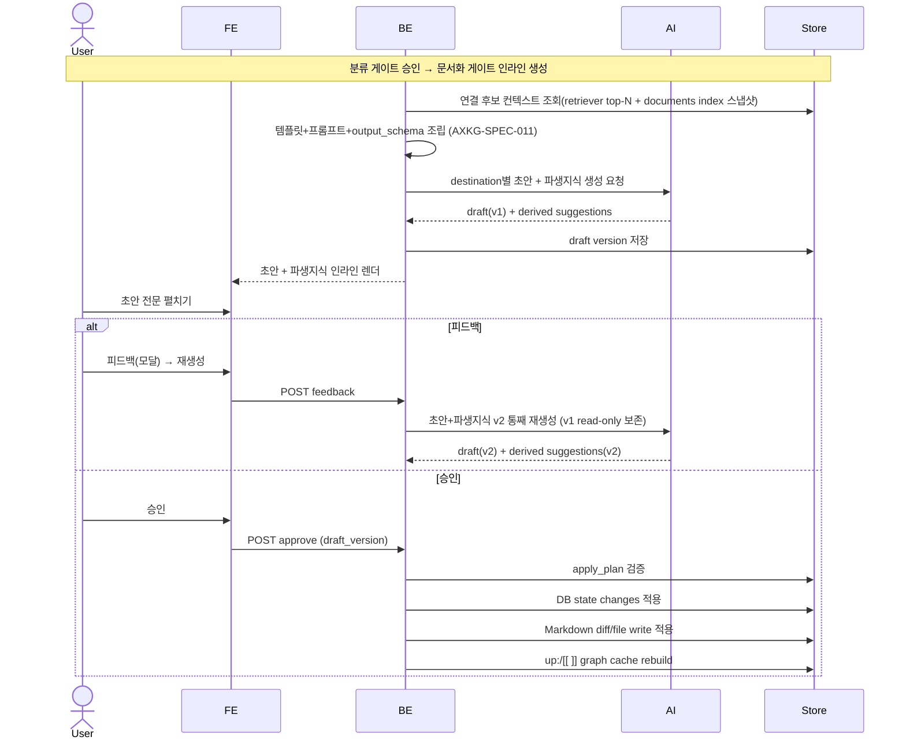
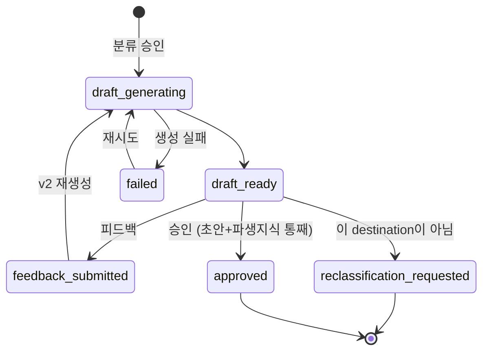

# 문서화 승인 게이트: destination별 AI 초안과 파생지식

분류 게이트(AXKG-SPEC-001)에서 `project`/`area`/`resource`로 승인된 source를, 분류 게이트 바로 아래 인라인으로 열리는 **문서화 승인 게이트(③)**에서 destination별 AI 초안(frontmatter + 본문 + `up:`/`[[ ]]` 연결)과 그 초안에 **한 덩어리로 동반되는 파생지식**을 검토해 영구 문서로 확정하는 흐름을 보장한다. 게이트는 초안+파생지식을 **단일 단위**로 다루며, 개별 파생지식 승인 없이 게이트 레벨 `피드백`/`승인`으로만 처리한다.

> `resource≡reference`: `resource`는 PARA 분류 라벨, `reference note`는 그 산출 노트 타입으로 같은 대상의 두 이름이다. 이 게이트는 destination-agnostic이며, reference는 `resource` destination의 한 경우다. 매핑: `resource→reference note`, `area→permanent note`, `project→product 문서(MVP는 baseline 후보만, decision/spec 후보는 post-MVP — AXKG-DEC-005)`, `archive→문서화 중단`.

## 1. Context

### Meta

- Decision reference: AXKG-DEC-001, AXKG-DEC-002, AXKG-DEC-004
- Baseline reference: AXKG-BL-001
- Domain note: `Documentation Gate`, `Document Draft`, `Derived Suggestion`
- Storage: 확정 문서는 최종승인 후 Markdown SoT로 저장하고 PostgreSQL `documents.path`로 index한다.
- Placement: 우측 사이드바 없이 분류 게이트(②) 바로 아래 **중앙 세로 스택 인라인**.

### Business Requirement

분류 게이트에서 destination이 확정된 source는 그 성격에 맞는 문서로 편입되어야 한다. 사용자는 분류 게이트 아래 인라인으로 열리는 문서화 승인 게이트에서 AI가 생성한 destination별 문서 초안 전문과 파생지식 후보를 검토한 뒤, 피드백(재생성)하거나 승인(문서 생성 + 그래프 연결)할 수 있어야 한다.

### Scope

In scope:

- `project`/`area`/`resource`로 승인된 source의 문서화 승인 게이트(인라인)
- destination별 AI 초안 생성(frontmatter + 본문 + `up:`/`[[ ]]` 연결)
- AI 초안 전문 렌더(접기/펴기)
- 초안 피드백과 재생성(버전 관리, v1 read-only)
- 승인 시 문서 생성 + 지식그래프 연결 반영
- AI 초안과 함께 생성되어 초안과 한 단위로 동반되는 파생지식(기존 개념 보충 / 신규 개념 / project baseline) — 개별 승인 없이 게이트 단일 승인에 딸려 적용
- 승인 시 적용될 실행 계획: DB state change와 Markdown diff/file write actions
- "이 destination이 아님" 피드백과 분류 게이트 재검토

Out of scope:

- 분류 게이트의 PARA 분류 자체(AXKG-SPEC-001)
- 링크/그래프 계약 세부(AXKG-SPEC-005)
- 게이트 버전/피드백 공통 규칙 세부(AXKG-SPEC-002)
- 팀 단위 멀티 reviewer

## 2. UX Contract

### Placement

문서화 승인 게이트는 별도 페이지·사이드바가 아니라, 승인 화면 중앙 세로 스택에서 분류 게이트 바로 아래 인라인으로 열린다.

```text
+----------------------------------------------------------+
| Source Inbox 큐 |  중앙 세로 스택                          |
| - summarized     |  ① 요약·분류 카드                       |
|                  |  ② 분류 게이트 (승인됨: resource)       |
|                  |  ③ 문서화 승인 게이트  badge: v2 | v1    |
|                  |     제목 = 확정 destination             |
|                  |     [AI 초안 전문  ▼ 접기/펴기]         |
|                  |       frontmatter + 본문 + up:/[[ ]]    |
|                  |     [파생지식]  (초안과 한 덩어리, 개별 승인 없음) |
|                  |     [피드백]  [승인]  (피드백=모달)     |
+----------------------------------------------------------+
```

### U-1. Documentation Gate Header

- **상태**: 생성 중, 검토 중, 재생성 중(v2), 승인됨
- **문구**: 제목 = 확정 destination(`project`|`area`|`resource`|`archive` 중 승인된 값), 버전 badge(`v2 | v1`)
- **CTA**: 없음(헤더). v1 badge는 read-only 표시
- **기대 결과**: 분류 게이트 승인 직후 이 게이트가 인라인 생성되고, destination에 맞는 초안 생성이 시작된다.

### U-2. AI Draft (전문 접기/펴기)

- **상태**: 생성 중, 생성 완료, 생성 실패, 재생성 중
- **문구**: destination별 문서 초안 — frontmatter preview + 본문 preview + `up:`/`[[ ]]` 연결. 전문은 접기/펴기로 펼친다.
- **CTA**: `초안 전문 펼치기/접기`
- **기대 결과**: 신규 문서 생성이면 사용자는 생성될 `.md` 초안 전문(frontmatter 포함)을 인라인에서 펼쳐 확인한다. 기존 문서 보충/수정이면 기존 문서 대비 diff를 확인한다. resource→reference note, area→permanent note, project→product 문서 형태.

### U-3. Derived Knowledge (초안 동반, 읽기용)

- **상태**: 제안 없음, 제안 있음(초안과 한 단위)
- **문구**: 기존 개념 보충 후보, 신규 개념 후보, project baseline 후보, 연결 대상 note, 추천 이유, 신규/변경 표시
- **CTA**: 없음. 파생지식 항목 자체에 개별 `승인`/`보류` 버튼은 없다. 유일한 액션은 게이트 레벨(U-4)의 `피드백`/`승인`이다.
- **기대 결과**: 파생지식은 AI 초안 생성 시 **함께** 산출되어 초안 아래 읽기용 목록으로 표시된다. 신규 지식은 생성될 `.md` preview로, 기존 지식 보충/수정은 대상 문서와 diff preview로 표시한다. 초안과 한 덩어리로 취급되어, 게이트 `승인` 시 초안과 함께 적용되고 `피드백` 시 초안과 함께 v2로 재생성된다(부분 승인·부분 재생성 없음).

### U-4. Gate Actions (피드백 / 승인)

- **상태**: 승인 대기, 피드백 작성 중, 재생성 중, 승인됨
- **문구**: 게이트 CTA는 `피드백`·`승인` 두 버튼. `피드백`은 피드백 모달을 연다(AXKG-SPEC-002 공통 규칙)
- **CTA**: `피드백`, `승인`, (모달 내 보조) `이 destination이 아님`
- **기대 결과**: `피드백` → 피드백 모달 열림(대상 게이트·현재 버전 표시), 초안/파생지식 어디든 지적 입력 후 `재생성` → 초안+파생지식 **한 덩어리로** v2 재생성(v1 read-only 보존, 모달 닫힘). `승인` → 초안+파생지식 **함께** 적용 + 문서 생성 + 지식그래프 연결(`up:`/`[[ ]]` 반영) + 파생지식 반영, source `documented`. `이 destination이 아님`(모달 내 옵션) → 이유를 받아 분류 게이트(②) 재검토로 되돌린다.

### U-5. Apply Plan Preview

- **상태**: 없음, 생성됨, 검증 실패, 적용 중, 적용 완료
- **문구**: 생성될 파일, 수정될 파일, Markdown diff, DB 상태 변경, graph cache rebuild 대상
- **CTA**: 없음. 적용 계획은 게이트 `승인`의 결과로만 실행된다.
- **기대 결과**: 사용자는 게이트 승인 전에 어떤 DB row가 바뀌고 어떤 Markdown 파일이 생성/수정될지 확인할 수 있다. 신규 파일은 full content preview, 기존 파일 변경은 unified diff 또는 split diff preview로 본다.

## 3. User Scenario

### S-1. User — 초안을 검토하고 승인해 문서 생성

1. 분류 게이트에서 destination(`resource`)이 승인되면 그 아래 문서화 승인 게이트가 인라인으로 열린다.
2. 시스템은 destination에 맞는 AI 초안(reference note frontmatter + 본문 + `up:`/`[[ ]]` 연결)과 초안에 동반되는 파생지식을 한 덩어리로 생성한다.
3. 사용자는 `초안 전문 펼치기`로 `.md` 초안 전문과 그 아래 파생지식 목록을 확인한다. 신규 문서는 전문 preview로, 기존 문서 보충은 diff preview로 확인한다.
4. 초안과 파생지식이 적절하면 사용자가 게이트 `승인`을 누른다.
5. 시스템은 초안과 파생지식을 함께 적용해 문서를 생성하고, 초안의 `up:`/`[[ ]]`를 지식그래프 연결(노드/엣지)로 반영하며 파생지식을 반영한다.
6. source 상태가 `documented`가 된다.

### S-2. User — 초안에 피드백해 재생성

1. 사용자는 초안 또는 파생지식 내용이 부족하다고 판단한다.
2. `피드백` 버튼을 누르면 피드백 모달이 열린다(대상 게이트·현재 버전 표시).
3. 사용자는 모달에서 초안·파생지식 어디든 추가/수정 방향을 적고 `재생성`을 누른다.
4. 시스템은 기존 초안+파생지식(v1)을 read-only로 보존하고 피드백을 반영한 초안+파생지식 v2를 한 덩어리로 재생성한다.
5. 사용자는 v2를 확인하고 다시 피드백하거나 `승인`한다.

### S-3. User — 이 destination이 아니라는 피드백

1. 사용자는 초안을 보고 이 source가 해당 destination이 아니라고 판단한다.
2. 사용자는 `이 destination이 아님`을 선택하고 이유를 명시한다(필수).
3. 시스템은 이유를 저장하고 분류 게이트(②)를 재오픈한다(AXKG-SPEC-002 재분류 재오픈 규칙): 분류 게이트 status `approved → regenerating`, 기존 approved revision은 내용 불변으로 `superseded` 마킹 + `approved_revision_id` 해제, `sources.destination_type`·`approved_classification_gate_id` 리셋.
4. 이 문서화 게이트는 `cancelled`로 전이한다(표시 상태 `reclassification_requested`).
5. 분류기 AI가 재분류 이유를 반영해 다른 PARA destination을 새 revision으로 추천한다(AXKG-SPEC-001). 새 분류가 승인되면 문서화 게이트가 새로 생성된다.

### S-4. System — 게이트 승인 시 파생지식 통째 반영

1. 사용자는 초안 아래 파생지식 목록을 읽기용으로 확인한다(개별 승인/보류 버튼 없음).
2. "기존 개념 보충" 항목에는 연결할 기존 area/concept note와 보충 근거가, "새 개념"·"project baseline" 항목에는 생성 대상과 근거가 함께 표시된다.
3. 사용자가 게이트 `승인`을 누르면 시스템은 초안과 **함께** 모든 파생지식을 반영한다.
4. "기존 개념 보충"은 기존 개념 note 보충 draft를 만들고 확정 문서와 `up:`/`[[ ]]`로 연결한다.
5. "새 개념"은 신규 개념 note를 생성하고 확정 문서를 근거로 연결한다.
6. "project baseline"은 `products/ax-knowledge-graph/00-baseline` 후보 draft를 만들고 확정 문서를 source/related 근거로 연결한다.
7. 파생지식이 부적절하면 사용자는 개별 보류 대신 게이트 `피드백`으로 지적해 초안+파생지식 v2를 재생성한다.

## 4. Interface Contract

### API Contract

| Method | Path | 요약 | 권한 |
|---|---|---|---|
| GET | `/documentation-gates` | `project`/`area`/`resource` 승인 source의 문서화 게이트 목록(조회 전용 뷰) | owner |
| GET | `/documentation-gates/{source_id}/drafts/{draft_version}/markdown` | 초안 `.md` 전문 조회 | owner |
| POST | `/gates/{gate_id}/feedback` | 초안 또는 destination에 대한 피드백 저장(v2 재생성 트리거). 공통 게이트 API(AXKG-SPEC-002) | owner |
| POST | `/gates/{gate_id}/retry` | 초안 생성/재생성 실패 task 재시도. 공통 게이트 API | owner |
| POST | `/gates/{gate_id}/approve` | 초안+파생지식 통째 승인 → 문서 생성 + 그래프 연결 + 파생지식 반영. 공통 게이트 API | owner |

액션(feedback/retry/approve)은 별도 문서화 전용 엔드포인트 없이 AXKG-SPEC-002의 공통 게이트 API(`/gates/{gate_id}/*`)를 사용한다. 문서화 게이트의 `gate_id`는 `GET /sources/{source_id}/gates` 또는 `GET /documentation-gates`(조회 전용)로 얻는다. 초안과 파생지식은 분류 게이트 승인 시 게이트 생성과 함께 한 덩어리로 자동 산출된다(별도 생성 트리거 API 없음). 파생지식은 초안 산출물의 일부로, 개별 승인 엔드포인트 없이 게이트 `approve`에 함께 처리된다. AXKG-SPEC-001의 `POST /sources/{source_id}/permanent-note`는 폐기됐다 — 문서 생성은 문서화 게이트 `approve`로 일원화한다.

### Validation

| 필드 | 규칙 |
|---|---|
| `source_id` | 분류 게이트에서 `project`/`area`/`resource`로 승인 완료된 source |
| `feedback.body` | 피드백 선택 시 필수 |
| `not_this_destination_reason` | "이 destination이 아님" 피드백이면 필수 |
| `draft_version` | 승인 시 현재 최신 draft version (초안+파생지식 한 단위) |
| `apply_plan` | 승인 시 실행할 DB action과 Markdown file action 목록 |

### Case Matrix

| 에러 코드 | 백엔드 출력 | 프론트 출력 | 표시 위치 |
|---|---|---|---|
| `NOT_APPROVED_DESTINATION` | 분류 승인 안 된 source | 문서화 대상이 아닙니다. | Documentation Gate Header |
| `MISSING_NOT_THIS_DESTINATION_REASON` | 이유 누락 | 이 destination이 아닌 이유를 입력해 주세요. | Feedback form |
| `DRAFT_NOT_READY` | 초안 없음 | 초안이 아직 준비되지 않았습니다. | AI Draft |
| `DRAFT_MARKDOWN_NOT_FOUND` | markdown 전문 없음 | 초안 전문을 불러오지 못했습니다. | AI Draft |
| `STALE_DRAFT_VERSION` | 오래된 draft 승인 | 최신 초안을 다시 확인해 주세요. | AI Draft |
| `GATE_ALREADY_APPROVED` | 승인된 게이트 수정 시도 | 승인된 게이트는 변경할 수 없습니다. 새 revision을 만들어 주세요. | Gate Actions |
| `DRAFT_RETRY_NOT_ALLOWED` | 재시도 불가 상태 | 현재 상태에서는 초안 생성을 재시도할 수 없습니다. | AI Draft |

### Flow



### State / Lifecycle

문서화 게이트의 저장 상태 SSOT는 AXKG-SPEC-002의 공통 `approval_gates.status`다(문서화 게이트 = `approval_gates(gate_kind=documentation)`, 별도 테이블 없음). 아래 표시 상태는 UI 렌더용 **파생 라벨**이며 새 저장 상태를 만들지 않는다. 상위 파이프라인 파생 상태(`doc_pending → doc_approved → documented`)는 AXKG-SPEC-001을 따른다.

| 표시 상태(파생) | 공통 gate status(SSOT, AXKG-SPEC-002) |
|---|---|
| `draft_generating` | `generating` 또는 `regenerating` |
| `draft_ready` | `review_pending` |
| `feedback_submitted` | `feedback_pending` |
| `failed` | `failed` |
| `reclassification_requested` | 이 게이트 `cancelled` + 분류 게이트 재오픈(`approved → regenerating`) |
| `approved` | `approved` |



### Data Contract

`DocumentationGate`는 독립 리소스가 아니라 `ApprovalGate(gate_kind=documentation)`(AXKG-SPEC-002)의 조회 뷰다.

| Resource | Field | 설명 |
|---|---|---|
| DocumentationGate | `source_id` | `project`/`area`/`resource`로 승인된 source |
| DocumentationGate | `destination_type` | project, area, resource |
| DocumentationGate | `status` | 표시 상태(파생): draft_generating, draft_ready, feedback_submitted, failed, reclassification_requested, approved. 저장 SSOT는 공통 `approval_gates.status`(위 매핑표) |
| DocumentDraft | `version` | draft version (v1 read-only, 피드백 시 v2) |
| DocumentDraft | `frontmatter_preview` | 문서 frontmatter preview |
| DocumentDraft | `body_preview` | 문서 body preview |
| DocumentDraft | `markdown_full` | frontmatter와 본문(`up:`/`[[ ]]` 포함)을 담은 `.md` 전문 |
| DocumentDraft | `filename_candidate` | 생성될 markdown 파일명 후보 |
| ApplyPlan | `db_actions` | `sources`, `approval_gates`, `documents`, `document_edges` 등에 적용할 상태 변경 |
| ApplyPlan | `file_actions` | markdown create/update와 diff patch actions |
| ApplyPlan | `validation_status` | pending, valid, invalid |
| DerivedSuggestion | `suggestion_type` | supplement_existing_concept, create_new_concept, create_project_baseline |
| DerivedSuggestion | `change_kind` | `create` 또는 `modify` |
| DerivedSuggestion | `target_note_id` | 기존 개념 보충 대상 |
| DerivedSuggestion | `target_document_id` | 변경 대상 문서. `change_kind=modify`이면 필수 |
| DerivedSuggestion | `draft_markdown` | 생성/보충될 문서 draft |
| DerivedSuggestion | `diff_preview` | 기존 문서 대비 unified diff 또는 split diff 표시용 데이터 |
| DerivedSuggestion | `link_reason` | 확정 문서와 연결해야 하는 이유 |

`DerivedSuggestion`은 독립 승인 리소스가 아니라 `DocumentDraft`에 동반되는 산출물의 일부다. 개별 status/approve 필드를 갖지 않으며, 게이트 draft version과 함께 v1/v2로 묶여 승인·재생성된다.

`ApplyPlan`은 AI가 직접 실행하지 않는다. AI는 초안과 함께 적용 제안을 만들고, 백엔드 executor가 schema validation, path validation, state transition validation을 통과한 action만 DB와 Markdown root에 적용한다.

### Derived Knowledge Apply Matrix

파생지식은 반드시 "어디를 수정하거나 어디에 생성되는지"를 명시해야 한다. 모든 파생지식은 `ApplyPlan.file_actions`와 `ApplyPlan.db_actions`로 변환 가능해야 한다.

| suggestion_type | change_kind | 적용 대상 | file_action | 렌더링 | DB 반영 |
|---|---|---|---|---|---|
| `supplement_existing_concept` | `modify` | 기존 concept/permanent 문서 | `patch_markdown` 또는 `update_frontmatter` | 대상 문서명 + diff preview | 기존 `documents.updated_at` 갱신, `document_edges` rebuild |
| `create_new_concept` | `create` | 새 concept/permanent 문서 경로 | `create_markdown` | 생성될 `.md` 전문 preview | 새 `documents` row 생성, `document_edges` rebuild |
| `create_project_baseline` | `create` | `products/ax-knowledge-graph/00-baseline/*.md` 후보 | `create_markdown` | 생성될 baseline `.md` 전문 preview | 새 `documents` row 생성 또는 product-doc index 등록, `document_edges` rebuild |

예시:

```text
source
  = Graph RAG 유튜브

문서화 초안
  create_markdown
  target_path: reference/2026-07-07-graph-rag-practical-design.md

파생지식 A
  suggestion_type: supplement_existing_concept
  change_kind: modify
  target_document_id: doc_agent_experience
  target_path: permanent/concepts/agent-experience.md
  file_action: patch_markdown
  render: diff preview

파생지식 B
  suggestion_type: create_new_concept
  change_kind: create
  target_path: permanent/concepts/evidence-first-rag.md
  file_action: create_markdown
  render: full markdown preview

파생지식 C
  suggestion_type: create_project_baseline
  change_kind: create
  target_path: products/ax-knowledge-graph/00-baseline/baseline-002-graph-rag-qa-product.md
  file_action: create_markdown
  render: full markdown preview
```

적용 후 trace:

```text
sources
  -> approval_gates
      -> approval_gate_revisions
          -> apply_plans
              -> documents
                  -> document_edges
```

## 5. Implementation Rules

- 이 게이트는 분류 게이트에서 `project`/`area`/`resource`로 승인된 source에만 열린다. `archive`는 문서화 게이트로 넘어가지 않는다.
- 초안 생성과 파생지식 후보 생성은 AXKG-SPEC-007의 open-kknaks provider 설정을 사용한다.
- 초안 생성의 입력 컨텍스트는 AXKG-SPEC-011의 실행 계약을 따른다: 연결 후보 컨텍스트 2단(Graph RAG retriever top-N + documents index 스냅샷)이 항상 주입되고, 활성 템플릿(AXKG-SPEC-010)+프롬프트(AXKG-SPEC-009)+output_schema를 백엔드 context builder가 조립한다. AI가 만드는 `up:`/`[[ ]]`와 `derived_suggestions.target_document_id`는 이 컨텍스트 안에서만 생성된다.
- 초안과 파생지식 후보는 분류 승인 시 함께 생성된다(별도 수동 생성 단계 없음).
- destination별 초안 형태는 `resource→reference note`, `area→permanent note`, `project→product 문서(MVP는 baseline 후보만)`다. 초안 `document_draft.document_type` 값은 각각 `reference`/`permanent`/`baseline`이다(AXKG-SPEC-005 document_type 어휘, `product` 값은 쓰지 않음 — AXKG-DEC-005).
- `승인` 전까지 문서는 확정 문서가 아니다. `승인` 시 초안이 적용되어 문서가 생성되고 `up:`/`[[ ]]`가 그래프 연결로 반영된다.
- `승인` 시 실행되는 변경은 `ApplyPlan`으로 표현한다. ApplyPlan은 DB action과 Markdown file action으로 나뉜다.
- `file_actions`는 `create_markdown`, `patch_markdown`, `update_frontmatter`를 구분한다.
- AI는 DB나 Markdown 파일을 직접 변경하지 않는다. AI 결과는 `approval_gate_revisions.payload`의 draft/apply_plan 제안으로만 저장된다.
- 백엔드 executor만 DB 상태 변경과 Markdown diff/file write를 수행한다.
- Markdown 수정은 전체 overwrite보다 diff/patch 적용을 우선한다. 단, 신규 문서 생성은 full content write를 허용한다.
- 문서화 게이트 렌더링은 file action에 따라 달라진다. `create_markdown`은 생성될 `.md` 전문을 보여주고, `patch_markdown`/`update_frontmatter`는 대상 문서명과 diff preview를 보여준다.
- executor는 document root 밖 path, stale revision, 이미 승인된 gate 변경, 깨진 wikilink를 거부해야 한다.
- 초안 생성/재생성 실패 시 실패한 `ai_tasks` row를 보존하고 문서화 gate를 `failed`로 표시한다. UI는 실패 사유와 `초안 생성 재시도` CTA를 제공한다.
- 초안 생성 재시도는 기존 failed task를 덮어쓰지 않고 새 `ai_tasks` row를 만들며 `retry_of_task_id`로 원 task를 참조한다.
- 초안 전문은 인라인 접기/펴기로 frontmatter 포함 `.md` 전문을 볼 수 있어야 한다.
- 사용자가 초안에 피드백하면 기존 draft(v1)를 덮어쓰지 않고 새 draft version(v2)을 생성하며, v1은 read-only로 보존한다(AXKG-SPEC-002 공통 버전 규칙).
- "이 destination이 아님" 피드백은 반드시 이유를 요구하고, AXKG-SPEC-002의 재분류 재오픈 규칙을 실행한다(분류 게이트 `approved → regenerating`, approved revision `superseded` 마킹, `sources.destination_type` 리셋, 이 문서화 게이트 `cancelled`).
- 파생지식은 초안과 한 덩어리로 취급한다. 개별 `승인`/`보류` 버튼이나 개별 승인 API를 두지 않으며, 게이트 `승인` 시 초안과 함께 반영되고 `피드백` 시 초안과 함께 v2로 재생성된다(부분 승인·부분 재생성 없음). 기존 개념 보충은 대상 note와 보충 근거를, 신규 개념·baseline은 확정 문서를 근거 링크로 포함한다. baseline은 `products/ax-knowledge-graph/00-baseline` 후보로만 제안하고 게이트 승인 전 파일을 만들지 않는다.
- 파생지식은 `suggestion_type`, `change_kind`, `target_path`, `file_action`을 반드시 가진다. `change_kind=modify`이면 `target_document_id`와 `diff_preview`가 필수다. `change_kind=create`이면 `target_path`와 `draft_markdown`이 필수다.
- 문서 연결은 AXKG-SPEC-005의 wikilink/frontmatter `up` 계약을 따른다.

## 6. Verification

### Acceptance Criteria

- [ ] `project`/`area`/`resource` 승인 source에 문서화 게이트가 분류 게이트 아래 인라인으로 열린다(우측 사이드바 없음).
- [ ] destination별 AI 초안이 frontmatter + 본문 + `up:`/`[[ ]]` 연결을 포함해 생성된다.
- [ ] 초안 전문을 접기/펴기로 인라인 확인할 수 있다.
- [ ] 신규 지식은 생성될 `.md` 전문 preview로 표시된다.
- [ ] 기존 지식 보충/수정은 대상 문서와 diff preview로 표시된다.
- [ ] 파생지식이 초안과 한 덩어리로 렌더되며 개별 `승인`/`보류` 버튼이 없다(게이트 레벨 `피드백`/`승인`만 존재).
- [ ] 파생지식은 적용 대상 경로와 file action을 표시한다.
- [ ] `modify` 파생지식은 `target_document_id`와 diff preview를 가진다.
- [ ] `create` 파생지식은 `target_path`와 생성될 markdown preview를 가진다.
- [ ] 초안 또는 파생지식 피드백 시 초안+파생지식 v2가 통째로 재생성되고 v1은 read-only로 보존된다.
- [ ] 초안 생성/재생성 실패 시 실패 사유와 `초안 생성 재시도` CTA가 표시된다.
- [ ] 초안 생성 재시도는 새 ai_task로 실행되고 기존 실패 task는 보존된다.
- [ ] `승인` 시 문서가 생성되고 초안의 `up:`/`[[ ]]`가 그래프 연결로 반영되며 파생지식이 함께 반영된다.
- [ ] "이 destination이 아님" 피드백은 이유가 필수이며 분류 게이트 재검토를 생성한다.
- [ ] 기존 개념 보충 후보는 대상 note와 보충 근거를 포함한다.

## 7. Open Questions

없음. 문서 초안의 뼈대는 AXKG-SPEC-010의 활성 템플릿(DB 동적 관리, 파일 template directory 없음)을 따르고, 링크/frontmatter 계약은 AXKG-SPEC-005가 SSOT다(AXKG-DEC-005).
