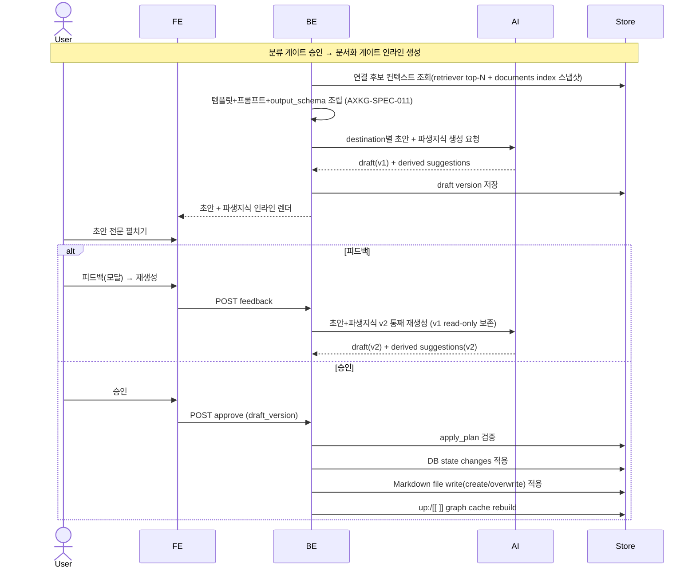
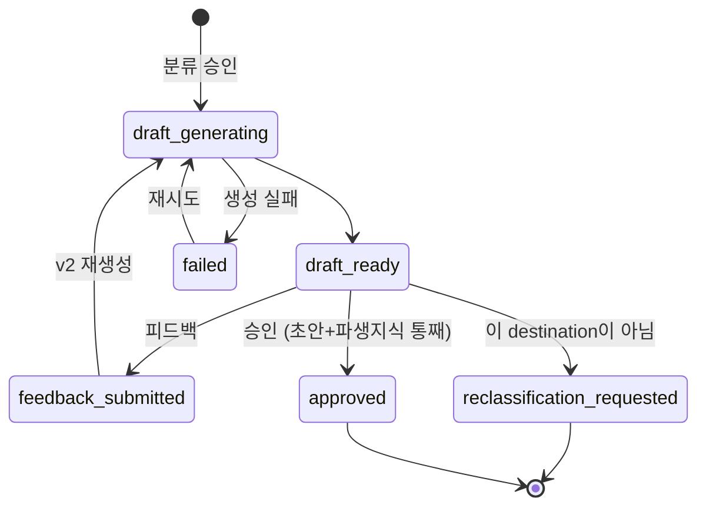

# 문서화 승인 게이트: destination별 AI 초안과 파생지식

분류 게이트(AXKG-SPEC-001)에서 `project`/`area`/`resource`로 승인된 source를, 분류 게이트 바로 아래 인라인으로 열리는 **문서화 승인 게이트(③)**에서 destination별 AI 초안(frontmatter + 본문 + `up:`/`[[ ]]` 연결)과 그 초안에 **한 덩어리로 동반되는 파생지식**을 검토해 영구 문서로 확정하는 흐름을 보장한다. 게이트는 초안+파생지식을 **단일 단위**로 다루며, 개별 파생지식 승인 없이 게이트 레벨 `피드백`/`승인`으로만 처리한다.

> `resource≡reference`: `resource`는 PARA 분류 라벨, `reference note`는 그 산출 노트 타입으로 같은 대상의 두 이름이다. 이 게이트는 destination-agnostic이며, reference는 `resource` destination의 한 경우다. 매핑: `resource→reference note`, `area→permanent note`, `project→product 문서(MVP는 baseline 후보만, decision/spec 후보는 post-MVP — AXKG-DEC-005)`, `archive→문서화 중단`.

## 1. Context

### Meta

- Decision reference: AXKG-DEC-001, AXKG-DEC-002, AXKG-DEC-004
- Baseline reference: AXKG-BL-001
- Domain note: `Documentation Gate`, `Document Draft`, `Derived Suggestion`
- Storage: 확정 문서는 최종승인 후 Markdown SoT로 저장하고 PostgreSQL `documents.path`로 index한다.
- Placement: 우측 사이드바 없이 분류 게이트(②) 바로 아래 **중앙 세로 스택 인라인**.

### Business Requirement

분류 게이트에서 destination이 확정된 source는 그 성격에 맞는 문서로 편입되어야 한다. 사용자는 분류 게이트 아래 인라인으로 열리는 문서화 승인 게이트에서 AI가 생성한 destination별 문서 초안 전문과 파생지식 후보를 검토한 뒤, 피드백(재생성)하거나 승인(문서 생성 + 그래프 연결)할 수 있어야 한다.

### Scope

In scope:

- `project`/`area`/`resource`로 승인된 source의 문서화 승인 게이트(인라인)
- destination별 AI 초안 생성(frontmatter + 본문 + `up:`/`[[ ]]` 연결)
- AI 초안 전문 렌더(접기/펴기)
- 초안 피드백과 재생성(버전 관리, v1 read-only)
- 승인 시 문서 생성 + 지식그래프 연결 반영
- AI 초안과 함께 생성되어 초안과 한 단위로 동반되는 파생지식(기존 개념 보충 / 신규 개념 / project baseline) — 개별 승인 없이 게이트 단일 승인에 딸려 적용
- 승인 시 적용될 실행 계획: DB state change와 Markdown diff/file write actions
- "이 destination이 아님" 피드백과 분류 게이트 재검토

Out of scope:

- 분류 게이트의 PARA 분류 자체(AXKG-SPEC-001)
- 링크/그래프 계약 세부(AXKG-SPEC-005)
- 게이트 버전/피드백 공통 규칙 세부(AXKG-SPEC-002)
- 팀 단위 멀티 reviewer

## 2. UX Contract

### Placement

문서화 승인 게이트는 별도 페이지·사이드바가 아니라, 승인 화면 중앙 세로 스택에서 분류 게이트 바로 아래 인라인으로 열린다.

```text
+----------------------------------------------------------+
| Source Inbox 큐 |  중앙 세로 스택                          |
| - summarized     |  ① 요약·분류 카드                       |
|                  |  ② 분류 게이트 (승인됨: resource)       |
|                  |  ③ 문서화 승인 게이트  badge: v2 | v1    |
|                  |     제목 = 확정 destination             |
|                  |     [AI 초안 전문  ▼ 접기/펴기]         |
|                  |       frontmatter + 본문 + up:/[[ ]]    |
|                  |     [파생지식]  (초안과 한 덩어리, 개별 승인 없음) |
|                  |     [피드백]  [승인]  (피드백=모달)     |
+----------------------------------------------------------+
```

### U-1. Documentation Gate Header

- **상태**: 생성 중, 검토 중, 재생성 중(v2), 승인됨
- **문구**: 제목 = 확정 destination(`project`|`area`|`resource`|`archive` 중 승인된 값), 버전 badge(`v2 | v1`)
- **CTA**: 없음(헤더). v1 badge는 read-only 표시
- **기대 결과**: 분류 게이트 승인 직후 이 게이트가 인라인 생성되고, destination에 맞는 초안 생성이 시작된다.

### U-2. AI Draft (전문 접기/펴기)

- **상태**: 생성 중, 생성 완료, 생성 실패, 재생성 중
- **문구**: destination별 문서 초안 — frontmatter preview + 본문 preview + `up:`/`[[ ]]` 연결. 전문은 접기/펴기로 펼친다.
- **CTA**: `초안 전문 펼치기/접기`
- **기대 결과**: 신규 문서 생성이면 사용자는 생성될 `.md` 초안 전문(frontmatter 포함)을 인라인에서 펼쳐 확인한다. 기존 문서 보충/수정이면 기존 문서 대비 diff를 확인한다. resource→reference note, area→permanent note, project→product 문서 형태.

### U-3. Derived Knowledge (초안 동반, 읽기용)

- **상태**: 제안 없음, 제안 있음(초안과 한 단위)
- **문구**: 기존 개념 보충 후보, 신규 개념 후보, project baseline 후보, 연결 대상 note, 추천 이유, 신규/변경 표시
- **CTA**: 없음. 파생지식 항목 자체에 개별 `승인`/`보류` 버튼은 없다. 유일한 액션은 게이트 레벨(U-4)의 `피드백`/`승인`이다.
- **기대 결과**: 파생지식은 AI 초안 생성 시 **함께** 산출되어 초안 아래 읽기용 목록으로 표시된다. 신규 지식은 생성될 `.md` preview로, 기존 지식 보충/수정은 대상 문서와 diff preview로 표시한다. 초안과 한 덩어리로 취급되어, 게이트 `승인` 시 초안과 함께 적용되고 `피드백` 시 초안과 함께 v2로 재생성된다(부분 승인·부분 재생성 없음).

### U-4. Gate Actions (피드백 / 승인)

- **상태**: 승인 대기, 피드백 작성 중, 재생성 중, 승인됨
- **문구**: 게이트 CTA는 `피드백`·`승인` 두 버튼. `피드백`은 피드백 모달을 연다(AXKG-SPEC-002 공통 규칙)
- **CTA**: `피드백`, `승인`, (모달 내 보조) `이 destination이 아님`
- **기대 결과**: `피드백` → 피드백 모달 열림(대상 게이트·현재 버전 표시), 초안/파생지식 어디든 지적 입력 후 `재생성` → 초안+파생지식 **한 덩어리로** v2 재생성(v1 read-only 보존, 모달 닫힘). `승인` → 초안+파생지식 **함께** 적용 + 문서 생성 + 지식그래프 연결(`up:`/`[[ ]]` 반영) + 파생지식 반영, source `documented`. `이 destination이 아님`(모달 내 옵션) → 이유를 받아 분류 게이트(②) 재검토로 되돌린다.

### U-5. Apply Plan Preview

- **상태**: 없음, 생성됨, 검증 실패, 적용 중, 적용 완료
- **문구**: 생성될 파일, 수정될 파일, Markdown diff, DB 상태 변경, graph cache rebuild 대상
- **CTA**: 없음. 적용 계획은 게이트 `승인`의 결과로만 실행된다.
- **기대 결과**: 사용자는 게이트 승인 전에 어떤 DB row가 바뀌고 어떤 Markdown 파일이 생성/수정될지 확인할 수 있다. 신규 파일은 full content preview, 기존 파일 변경은 unified diff 또는 split diff preview로 본다.

## 3. User Scenario

### S-1. User — 초안을 검토하고 승인해 문서 생성

1. 분류 게이트에서 destination(`resource`)이 승인되면 그 아래 문서화 승인 게이트가 인라인으로 열린다.
2. 시스템은 destination에 맞는 AI 초안(reference note frontmatter + 본문 + `up:`/`[[ ]]` 연결)과 초안에 동반되는 파생지식을 한 덩어리로 생성한다.
3. 사용자는 `초안 전문 펼치기`로 `.md` 초안 전문과 그 아래 파생지식 목록을 확인한다. 신규 문서는 전문 preview로, 기존 문서 보충은 diff preview로 확인한다.
4. 초안과 파생지식이 적절하면 사용자가 게이트 `승인`을 누른다.
5. 시스템은 초안과 파생지식을 함께 적용해 문서를 생성하고, 초안의 `up:`/`[[ ]]`를 지식그래프 연결(노드/엣지)로 반영하며 파생지식을 반영한다.
6. source 상태가 `documented`가 된다.

### S-2. User — 초안에 피드백해 재생성

1. 사용자는 초안 또는 파생지식 내용이 부족하다고 판단한다.
2. `피드백` 버튼을 누르면 피드백 모달이 열린다(대상 게이트·현재 버전 표시).
3. 사용자는 모달에서 초안·파생지식 어디든 추가/수정 방향을 적고 `재생성`을 누른다.
4. 시스템은 기존 초안+파생지식(v1)을 read-only로 보존하고 피드백을 반영한 초안+파생지식 v2를 한 덩어리로 재생성한다.
5. 사용자는 v2를 확인하고 다시 피드백하거나 `승인`한다.

### S-3. User — 이 destination이 아니라는 피드백

1. 사용자는 초안을 보고 이 source가 해당 destination이 아니라고 판단한다.
2. 사용자는 `이 destination이 아님`을 선택하고 이유를 명시한다(필수).
3. 시스템은 이유를 저장하고 분류 게이트(②)를 재오픈한다(AXKG-SPEC-002 재분류 재오픈 규칙): 분류 게이트 status `approved → regenerating`, 기존 approved revision은 내용 불변으로 `superseded` 마킹 + `approved_revision_id` 해제, `sources.destination_type`·`approved_classification_gate_id` 리셋.
4. 이 문서화 게이트는 `cancelled`로 전이한다(표시 상태 `reclassification_requested`).
5. 분류기 AI가 재분류 이유를 반영해 다른 PARA destination을 새 revision으로 추천한다(AXKG-SPEC-001). 새 분류가 승인되면 문서화 게이트가 새로 생성된다.

### S-4. System — 게이트 승인 시 파생지식 통째 반영

1. 사용자는 초안 아래 파생지식 목록을 읽기용으로 확인한다(개별 승인/보류 버튼 없음).
2. "기존 개념 보충" 항목에는 연결할 기존 area/concept note와 보충 근거가, "새 개념"·"project baseline" 항목에는 생성 대상과 근거가 함께 표시된다.
3. 사용자가 게이트 `승인`을 누르면 시스템은 초안과 **함께** 모든 파생지식을 반영한다.
4. "기존 개념 보충"은 기존 개념 note 보충 draft를 만들고 확정 문서와 `up:`/`[[ ]]`로 연결한다.
5. "새 개념"은 신규 개념 note를 생성하고 확정 문서를 근거로 연결한다.
6. "project baseline"은 지식 볼트 `projects/` 후보 draft를 만들고 확정 문서를 source/related 근거로 연결한다(경로 SSOT: AXKG-SPEC-005 Path Convention).
7. 파생지식이 부적절하면 사용자는 개별 보류 대신 게이트 `피드백`으로 지적해 초안+파생지식 v2를 재생성한다.

## 4. Interface Contract

### API Contract

| Method | Path | 요약 | 권한 |
|---|---|---|---|
| GET | `/documentation-gates` | `project`/`area`/`resource` 승인 source의 문서화 게이트 목록(조회 전용 뷰) | owner |
| GET | `/documentation-gates/{source_id}/drafts/{draft_version}/markdown` | 초안 `.md` 전문 조회 | owner |
| POST | `/gates/{gate_id}/feedback` | 초안 또는 destination에 대한 피드백 저장(v2 재생성 트리거). 공통 게이트 API(AXKG-SPEC-002) | owner |
| POST | `/gates/{gate_id}/retry` | 초안 생성/재생성 실패 task 재시도. 공통 게이트 API | owner |
| POST | `/gates/{gate_id}/approve` | 초안+파생지식 통째 승인 → 문서 생성 + 그래프 연결 + 파생지식 반영. 공통 게이트 API | owner |

> 문서화 승인 게이트(③)의 API·화면은 **admin 전용**이다 — staff는 접근할 수 없다. 접근 경계 매트릭스 SSOT는 AXKG-SPEC-008이며 여기서는 재서술하지 않는다.

액션(feedback/retry/approve)은 별도 문서화 전용 엔드포인트 없이 AXKG-SPEC-002의 공통 게이트 API(`/gates/{gate_id}/*`)를 사용한다. 문서화 게이트의 `gate_id`는 `GET /sources/{source_id}/gates` 또는 `GET /documentation-gates`(조회 전용)로 얻는다. 초안과 파생지식은 분류 게이트 승인 시 게이트 생성과 함께 한 덩어리로 자동 산출된다(별도 생성 트리거 API 없음). 파생지식은 초안 산출물의 일부로, 개별 승인 엔드포인트 없이 게이트 `approve`에 함께 처리된다. AXKG-SPEC-001의 `POST /sources/{source_id}/permanent-note`는 폐기됐다 — 문서 생성은 문서화 게이트 `approve`로 일원화한다.

### Validation

| 필드 | 규칙 |
|---|---|
| `source_id` | 분류 게이트에서 `project`/`area`/`resource`로 승인 완료된 source |
| `feedback.body` | 피드백 선택 시 필수 |
| `not_this_destination_reason` | "이 destination이 아님" 피드백이면 필수 |
| `draft_version` | 승인 시 현재 최신 draft version (초안+파생지식 한 단위) |
| `derived_suggestions[].draft_markdown` | 전 suggestion_type 공통 필수(modify 포함) — 없으면 apply에서 skip되고 `apply_plans.skipped`에 기록 |
| `apply_plan` | 승인 시 실행할 DB action과 Markdown file action 목록 |

### Case Matrix

| 에러 코드 | 백엔드 출력 | 프론트 출력 | 표시 위치 |
|---|---|---|---|
| `NOT_APPROVED_DESTINATION` | 분류 승인 안 된 source | 문서화 대상이 아닙니다. | Documentation Gate Header |
| `MISSING_NOT_THIS_DESTINATION_REASON` | 이유 누락 | 이 destination이 아닌 이유를 입력해 주세요. | Feedback form |
| `DRAFT_NOT_READY` | 초안 없음 | 초안이 아직 준비되지 않았습니다. | AI Draft |
| `DRAFT_MARKDOWN_NOT_FOUND` | markdown 전문 없음 | 초안 전문을 불러오지 못했습니다. | AI Draft |
| `STALE_DRAFT_VERSION` | 오래된 draft 승인 | 최신 초안을 다시 확인해 주세요. | AI Draft |
| `GATE_ALREADY_APPROVED` | 승인된 게이트 수정 시도 | 승인된 게이트는 변경할 수 없습니다. 새 revision을 만들어 주세요. | Gate Actions |
| `DRAFT_RETRY_NOT_ALLOWED` | 재시도 불가 상태 | 현재 상태에서는 초안 생성을 재시도할 수 없습니다. | AI Draft |
| `PATH_NOT_ALLOWED` | Path Convention 위반 경로 (AXKG-SPEC-005) | 허용되지 않은 경로에는 문서를 만들 수 없습니다. | Apply Plan Preview |
| `BROKEN_WIKILINK` | 초안/파생 `draft_markdown`의 wikilink resolve 실패 (AXKG-SPEC-005) | 연결할 문서를 찾지 못했습니다. | AI Draft / Derived Knowledge |
| `SUPPLEMENT_TARGET_NOT_CONCEPT` (422) | supplement 대상 `document_type`이 concept가 아님 | 개념 보충은 개념 문서에만 할 수 있습니다. | Derived Knowledge |
| `STALE_REGENERATION_NOT_ALLOWED` (409) | 재생성 불가 상태의 stale 문서 | 현재 상태에서는 재생성할 수 없습니다. | 재검토(문서함) |
| `DOCUMENT_NOT_FOUND` (404) | 대상 문서 없음 | 문서를 찾을 수 없습니다. | 재검토(문서함) |

`SUPPLEMENT_TARGET_NOT_CONCEPT`은 `supplement_existing_concept`의 대상이 concept 문서가 아닐 때 거부한다 — 보충 대상을 concept로 한정하지 않으면 reference 등 비-concept 문서가 보충으로 오염된다(2026-07-10 라이브 실측: reference v2 오염, 구현 PLAN-009-T-036). `STALE_REGENERATION_NOT_ALLOWED`·`DOCUMENT_NOT_FOUND`은 stale regenerate API(위 Document Lifecycle E)가 각각 재생성 불가 상태·대상 부재를 거부하는 코드다(구현 PLAN-009-T-030).

### Flow



### State / Lifecycle

문서화 게이트의 저장 상태 SSOT는 AXKG-SPEC-002의 공통 `approval_gates.status`다(문서화 게이트 = `approval_gates(gate_kind=documentation)`, 별도 테이블 없음). 아래 표시 상태는 UI 렌더용 **파생 라벨**이며 새 저장 상태를 만들지 않는다. 상위 파이프라인 파생 상태(`doc_pending → doc_approved → documented`)는 AXKG-SPEC-001을 따른다.

| 표시 상태(파생) | 공통 gate status(SSOT, AXKG-SPEC-002) |
|---|---|
| `draft_generating` | `generating` 또는 `regenerating` |
| `draft_ready` | `review_pending` |
| `feedback_submitted` | `feedback_pending` |
| `failed` | `failed` |
| `reclassification_requested` | 이 게이트 `cancelled` + 분류 게이트 재오픈(`approved → regenerating`) |
| `approved` | `approved` |



### Data Contract

`DocumentationGate`는 독립 리소스가 아니라 `ApprovalGate(gate_kind=documentation)`(AXKG-SPEC-002)의 조회 뷰다.

| Resource | Field | 설명 |
|---|---|---|
| DocumentationGate | `source_id` | `project`/`area`/`resource`로 승인된 source |
| DocumentationGate | `destination_type` | project, area, resource |
| DocumentationGate | `status` | 표시 상태(파생): draft_generating, draft_ready, feedback_submitted, failed, reclassification_requested, approved. 저장 SSOT는 공통 `approval_gates.status`(위 매핑표) |
| DocumentDraft | `version` | draft version (v1 read-only, 피드백 시 v2) |
| DocumentDraft | `frontmatter_preview` | 문서 frontmatter preview |
| DocumentDraft | `body_preview` | 문서 body preview |
| DocumentDraft | `markdown_full` | frontmatter와 본문(`up:`/`[[ ]]` 포함)을 담은 `.md` 전문 |
| DocumentDraft | `filename_candidate` | 생성될 markdown 파일명 후보 |
| ApplyPlan | `db_actions` | `sources`, `approval_gates`, `documents`, `document_edges` 등에 적용할 상태 변경 |
| ApplyPlan | `file_actions` | markdown `create_markdown`(신규)·`overwrite_markdown`(기존 문서 전문 교체) actions |
| ApplyPlan | `validation_status` | pending, valid, invalid |
| ApplyPlan | `skipped` | apply에서 제외된 file/db action과 사유. `ApplyResult.skipped`를 `apply_plans`에 박제해 관측 가능하게 한다(2026-07-09 PLAN-009-T-018) |
| DerivedSuggestion | `suggestion_type` | supplement_existing_concept, create_new_concept, create_project_baseline |
| DerivedSuggestion | `change_kind` | `create` 또는 `modify` |
| DerivedSuggestion | `target_note_id` | 기존 개념 보충 대상 |
| DerivedSuggestion | `target_document_id` | 변경 대상 문서. `change_kind=modify`이면 필수 |
| DerivedSuggestion | `filename_candidate` | 생성될 파일명 후보. **create류(`create_new_concept`/`create_project_baseline`) AI 출력 필수** — 디렉토리는 시스템이 조립한다(아래 경로 결정 주체, 2026-07-10 PLAN-009-T-040) |
| DerivedSuggestion | `target_stem` | 보충 대상 문서 stem. **`supplement_existing_concept` AI 출력 필수** — resolver가 기존 경로로 해소한다(아래 경로 결정 주체, PLAN-009-T-040) |
| DerivedSuggestion | `draft_markdown` | 생성/보충될 문서 **전문(markdown)**. **전 suggestion_type 공통 필수**(2026-07-09 PLAN-009-T-018, AXKG-DEC-005) — modify(보충)도 diff/patch가 아니라 보충 반영 **수정 전문**을 담아 executor가 overwrite한다 |
| DerivedSuggestion | `diff_preview` | 기존 문서 대비 변경 요지 **리뷰 표시용 서술**. 적용 엔진 입력이 아니다(modify는 `draft_markdown` overwrite로 적용, PLAN-009-T-018) |
| DerivedSuggestion | `link_reason` | 확정 문서와 연결해야 하는 이유 |

`DerivedSuggestion`은 독립 승인 리소스가 아니라 `DocumentDraft`에 동반되는 산출물의 일부다. 개별 status/approve 필드를 갖지 않으며, 게이트 draft version과 함께 v1/v2로 묶여 승인·재생성된다.

`ApplyPlan`은 AI가 직접 실행하지 않는다. AI는 초안과 함께 적용 제안을 만들고, 백엔드 executor가 schema validation, path validation, state transition validation을 통과한 action만 DB와 Markdown root에 적용한다.

### 지식 아키텍처와 SoT 위임 (4층 문서 정체성, AXKG-DEC-005 A·B)

문서화 게이트가 산출하는 문서(초안 + 파생지식)는 **`출처 → 원자 개념 → 종합/전략 → 실행`** 방향으로 자라는 4층 지식 모델 위에 놓인다. destination별 산출물의 정체성이 이 층에 대응하며, 이 표가 문서 유형별 정체성의 SSOT다. 경로·document_type 어휘는 AXKG-SPEC-005(Path Convention·Required Frontmatter)가 SSOT이며 여기서 재정의하지 않는다.

| 층 | destination / suggestion_type | 경로(SPEC-005) | 정체성 | 단위 | 수명 |
|---|---|---|---|---|---|
| 출처 기록 | resource → reference | `resources/` | "이 자료가 무엇을 말했나" — 출처 맥락·논지 흐름·인용 | 자료 하나 | 생성 후 거의 고정 |
| 원자 개념 | `create_new_concept`(파생) → concept | `permanent/concepts/` | "이 개념은 무엇인가" — **사실의 SoT**, 출처 독립 | 개념 하나 | 여러 출처가 합류하며 성장(supplement) |
| 종합 노트 | area → permanent | `permanent/` | "내 전략/종합 판단" — 원자 개념들이 합쳐져 자라는 살아있는 문서 | 영역 하나 | 개념 유입마다 성장 |
| 실행 문서 | project → baseline | `projects/` | 프로젝트 문서 | 프로젝트 | — |

- permanent 안의 두 층(`permanent/concepts/`=원자 개념, `permanent/` 루트=종합)은 **합치지 않고 위계를 유지**한다. concept는 독립 document_type이며 파생지식으로 생성/보충된다.
- 요약 md(`data/documents/summaries/`)는 순수 데이터 보관용 side-output으로 이 지식 그래프와 무관하다(기존 확정 재확인, 위 Document Lifecycle 각주 및 AXKG-SPEC-005).

**SoT 위임(중복 서술 금지)** — 개념 상세의 SoT는 concept 노트 **한 곳**이다:

- reference(출처 기록)는 개념 상세를 재서술하지 않고 **요지 + `[[concept]]` 링크로 위임**한다. reference→concept 링크의 의미는 "출처가 개념을 인용"하는 관계다.
- permanent(종합 노트)도 개념 내용을 재서술하지 않는다 — 개념들을 엮은 **내 판단/전략**만 소유하고, 구성 개념은 `[[concept]]` 링크로 참조한다.
- 같은 개념에 두 번째 출처가 오면 새 concept 생성이 아니라 기존 concept **보충**(`supplement_existing_concept`)으로 합류한다. 이것이 개념 성장 메커니즘이며, 파생지식 apply matrix의 `supplement_existing_concept`(modify)가 그 실행 경로다.

**"재서술하지 않는다"의 범위 (2026-07-09 PLAN-009-T-024)**: 이 규율은 **개념의 상세 설명 섹션을 복사하지 않는다**는 뜻이다. permanent 종합 노트의 **판단 문장 안에 개념의 요지가 인용되는 것은 허용되며 필연적**이다(예: "성숙도 4단계 기준 우리는 2단계이므로 확산에 집중" — 판단에 개념 요지가 스며든다). 따라서 concept가 개정되면 permanent의 판단 문장이 **낡은 사실을 담을 수 있다** — 이것이 아래 E(stale 연쇄)의 실질 근거다. SoT 위임은 개념 상세의 중복 오염 **표면적을 줄일 뿐, 오염을 구조적으로 0으로 만들지 않는다**(판단 문장에 스민 요지는 여전히 낡을 수 있다).

### Derived Knowledge Apply Matrix

파생지식은 반드시 "어디를 수정하거나 어디에 생성되는지"를 명시해야 한다. 모든 파생지식은 `ApplyPlan.file_actions`와 `ApplyPlan.db_actions`로 변환 가능해야 한다.

경로 컨벤션(디렉토리)은 AXKG-SPEC-005 Path Convention이 SSOT다. **디렉토리는 AI가 아니라 빌더가 조립한다**(아래 경로 결정 주체) — 표·예시의 `target_path`는 AI 출력이 아니라 시스템 조립 결과다. 모든 파생지식은 `draft_markdown`(전문)을 갖는다 — modify도 diff/patch가 아니라 수정 전문 overwrite다(2026-07-09 PLAN-009-T-018).

| suggestion_type | change_kind | 적용 대상(경로: SPEC-005) | file_action | 렌더링 | DB 반영 |
|---|---|---|---|---|---|
| `supplement_existing_concept` | `modify` | 기존 문서 경로 그대로 | `overwrite_markdown` | 대상 문서명 + diff preview(표시용) | 기존 `documents` 문서 전문 교체, `document_edges` rebuild |
| `create_new_concept` | `create` | `permanent/concepts/` | `create_markdown` | 생성될 `.md` 전문 preview | 새 `documents` row 생성, `document_edges` rebuild |
| `create_project_baseline` | `create` | `projects/` | `create_markdown` | 생성될 baseline `.md` 전문 preview | 새 `documents` row 생성, `document_edges` rebuild |

예시:

```text
source
  = Graph RAG 유튜브

문서화 초안
  create_markdown
  target_path: resources/2026-07-07-graph-rag-practical-design.md

파생지식 A
  suggestion_type: supplement_existing_concept
  change_kind: modify
  target_document_id: doc_agent_experience
  target_path: permanent/concepts/agent-experience.md   # 기존 경로 그대로
  draft_markdown: <보충 반영 수정 전문>
  file_action: overwrite_markdown
  render: diff preview (표시용)

파생지식 B
  suggestion_type: create_new_concept
  change_kind: create
  target_path: permanent/concepts/evidence-first-rag.md
  draft_markdown: <신규 전문>
  file_action: create_markdown
  render: full markdown preview

파생지식 C
  suggestion_type: create_project_baseline
  change_kind: create
  target_path: projects/baseline-002-graph-rag-qa-product.md
  draft_markdown: <신규 전문>
  file_action: create_markdown
  render: full markdown preview
```

적용 후 trace:

```text
sources
  -> approval_gates
      -> approval_gate_revisions
          -> apply_plans
              -> documents
                  -> document_edges
```

### 경로 결정 주체 (AI=파일명/stem · 시스템=디렉토리 조립, 2026-07-10 PLAN-009-T-040)

경로의 **디렉토리는 AI가 결정하지 않는다**. AI 출력(`output_schema` = `documentation_gate` v3)은 파일명/stem만 산출하고, 디렉토리 조립과 최종 `target_path`는 백엔드 빌더가 소유한다. AI가 `target_path` 디렉토리를 확률적으로 오생성하던 문제(라이브 실측 2026-07-10: `areas/`·`concepts/` 오생성 2회 — 허용 경로는 `resources/`·`permanent/`·`permanent/concepts/`·`projects/`, AXKG-SPEC-005 Path Convention)를 계약 수준에서 닫는다.

- **AI 출력(파일명/stem만)**: `document_draft`는 `target_path` 없이 `filename_candidate`만 낸다. `derived_suggestions[]`도 `target_path`를 내지 않는다 — create류(`create_new_concept`/`create_project_baseline`)는 `filename_candidate` 필수, `supplement_existing_concept`은 `target_stem` 필수다(**if/then 스키마 강제** — suggestion_type에 따라 요구 필드가 갈린다).
- **시스템 조립(디렉토리 + 최종 경로)**: Phase 2 `wrap_documentation_output` 빌더가 경로를 조립한다.
  - main: 같은 source 계보에 **prior current main이 있으면 그 경로를 재사용**한다(재생성 시 파일명이 흔들려 새 파일로 갈라지는 것을 차단). 없으면 destination 타입 디렉토리 + 정규화된 filename(`.md` 보장, 디렉토리 성분 제거).
  - 파생 create: `suggestion_type` 디렉토리(위 Apply Matrix·AXKG-SPEC-005 Path Convention) + filename.
  - 파생 modify: resolver가 `target_stem`을 기존 문서 경로로 해소한다(해소 실패 시 빈 값 → executor가 거부).
  - 경로 매핑 SSOT는 빌더·executor 공용 모듈 `services/document_paths.py`다.
- **executor `PATH_NOT_ALLOWED`는 안전망으로 유지**한다(AXKG-SPEC-005 Path Convention 위반 최종 거부). 시스템이 조립하므로 정상 경로에서는 발생하지 않지만 방어선은 남긴다.
- **envelope의 `target_path` 자리는 유지**한다 — AI가 비우고 **시스템이 채운다**. FE는 조립된 `target_path`를 그대로 읽으므로 **FE 계약 무변경**이며, 구형 revision payload(직접 `target_path` 포함)도 하위호환으로 수용한다.
- 라이브 실측(2026-07-10): Knowledge graph 소스 → main `resources/지식-그래프-knowledge-graph.md` + 파생 concept 2건 `permanent/concepts/` 조립, 승인 1트라이 통과(교정 루프 0회).

### Document Lifecycle (확정 문서, AXKG-DEC-005 D)

확정 문서(`documents`)는 apply commit 시점의 단발 산출이 아니라 **lifecycle을 갖는다**. 피드백/재분류로 같은 source가 다시 문서화되면 옛 문서를 지우거나 덮어쓰지 않고 **박제(immutable) 보존**한 채 새 문서를 `current`로 세운다. 게이트 revision·요약 draft의 버전 박제 원칙(AXKG-SPEC-002)을 **commit 경계 너머의 확정 문서까지** 일관 확장한 것이다.

| 개념 | 계약 |
|---|---|
| `status` | `current`(최신 유효본) 또는 `superseded`(옛 버전, 박제 보존). 신규 문서는 `current` |
| `version` | 같은 문서 계보 안에서 증가하는 버전 |
| producing 링크 | 이 문서를 만든 **게이트 revision**(`approval_gate_revisions`)과 **source**를 가리키는 링크 — 어느 게이트 버전이 이 문서를 산출했는지 추적 |
| supersede 전이 | 재분류/피드백 재문서화가 apply되면 이전 `current` 문서를 `superseded`로 마킹하고, 새 문서를 `current`로 생성한다. 기존 문서 row/파일은 감사·비교용으로 보존 |

- apply executor의 문서 생성은 종전 `write_new`(경로 중복이면 거부)에서 **버전 생성/supersede**로 확장한다: 같은 source 계보의 재문서화는 중복 거부가 아니라 옛 문서 `superseded` + 새 문서 `current`로 처리한다.
- `status`/`version`/producing 링크의 정확한 컬럼명·마이그레이션과 supersede apply action의 정확한 명칭은 **코드 소관(OQ)**이다. 이 spec은 계약(상태값 `current`/`superseded`, 박제 보존, 무엇을 추적하는지)만 규정한다. superseded 문서의 그래프 노출은 AXKG-SPEC-005가 규정한다.

#### 파생 concept 버전 확장 (AXKG-DEC-005 D — 구현 완료)

위 Document Lifecycle(버전 박제·`documents.status`/`version`/producing 링크·`supersede_document`)은 **파생 concept 문서에도 확장**된다. 확정된 버전 모델(md=현재본 하나 / 히스토리=DB immutable revision / `documents.version`++, PLAN-009-T-015)을 파생지식 `create_new_concept`으로 생성되고 `supplement_existing_concept`으로 보충되는 concept 문서까지 일관 적용한다. **구현 완료**(2026-07-10 PLAN-009-T-027 코드 + 라이브 검증: concept version 1→2).

- **계약(구현됨)**: concept `create_new_concept` apply는 `version=1`로 생성하고, `supplement_existing_concept`(modify) apply는 옛 버전을 박제 보존(DB revision)한 뒤 `documents.version`을 올리며(v++) `producing_revision_id`/`source_id`를 스탬프한다. **파일명 버전(`concept_v1.md`/`v2.md`)은 채택하지 않는다** — stem이 바뀌면 기존 `[[concept]]` 링크가 전부 깨지고 "md=현재본 하나" 결정과 충돌한다. **stem 불변 + DB 버전**을 유지하며, 그래프는 항상 `current`만 노출한다(superseded 제외, AXKG-SPEC-005).
- **main 계보 판단에서 concept 제외(구현됨)**: 같은 source 계보의 재문서화 supersede 판단에서 파생 concept는 제외한다 — concept는 여러 출처가 합류하는 원자 개념(§4 SoT 위임)이라 특정 source 계보에 매이지 않고, 자신의 보충(modify) 경로로 독립 version++된다.
- 종전 as-is 갭(파생 concept 보충이 `overwrite_markdown`으로만 덮어써 버전 히스토리가 남지 않던 문제)은 해소됐다. 컬럼·apply action 명칭은 위 확정 명칭(`documents.status`/`version`/`producing_revision_id`/`source_id`·`supersede_document`, PLAN-009-T-015)을 따른다.

#### concept → permanent stale 연쇄와 재생성 게이트 (AXKG-DEC-005 E — 구현 완료)

concept 새 버전이 승인되면, 그 concept를 구성 개념으로 참조하는 종합 노트(permanent)를 찾아 **영향 가능성을 표시**하되 자동으로 다시 쓰지는 않는다. **구현 완료**(2026-07-10 BE PLAN-009-T-030 / FE PLAN-009-T-031·032·033 + 라이브 검증: 감지→배지→재생성 게이트→승인→해제 전 구간). 동작 계약(2026-07-09 PLAN-009-T-024):

- **E-1. stale 배지의 의미 = "영향 가능성 있음"**: 배지는 참조 기반 과잉 포함(참조하면 붙음)이며 **"수정 필요" 판단이 아니다**. 시스템은 수정 필요 여부를 판단하지 않는다 — 판단은 사용자 몫이다.
- **E-2. 감지 = backlink 쿼리(AI 없음)**: concept 새 버전 승인(문서화 게이트 `supplement_existing_concept` 승인) 시점에 backlink(`document_edges`)로 그 concept를 `[[concept]]`로 참조하는 permanent를 조회해 **배지만 붙인다**. 어떤 실행도 자동 트리거하지 않는다. 배지에는 **concept 변경 요지를 동봉**한다(게이트 payload의 변경 요지 재사용) — 사용자가 목록을 열지 않고도 1차 판단할 수 있게.
- **E-3. 재생성 = 문서당 독립 태스크**: stale N개 중 **사용자가 트리거한 것만** 재생성 태스크로 큐에 쌓인다. **1 프롬프트 = 1 문서**. 입력 계약 = 대상 permanent 전문 + 바뀐 concept 전문 + 변경 요지(문서당 이 3개, 소형 컨텍스트). N개를 한 프롬프트에 넣는 일괄 판단은 없다.
- **E-4. 1 승인 = 1 문서**: 각 재생성 게이트의 승인은 그 permanent 하나만 갱신한다(version++). 일괄 승인·일괄 실행은 없다.
- **E-5. 부분 처리 허용(트랜잭션 아님)**: 미처리 stale은 배지가 유지되는 **가시적 상태**로 남는다. concept v2는 이미 확정 적용된 뒤이므로 미처리가 시스템을 깨지 않는다 — 판단 전제가 낡은 상태(기존과 동일)일 뿐이다.
- **E-6. 출력 규율(계약 수준)**: 재생성 초안은 옛 전제에 의존한 판단만 수정하고 **지적되지 않은 판단은 보존**한다(피드백 재생성 v2 규율과 동일 계열). 명시 인용뿐 아니라 개념을 **암묵 전제로 한 판단**도 탐지 대상이며, 최종 방어는 사용자 게이트다.
- **재생성 게이트(수동)**: 반영은 자동이 아니다. 사용자가 원할 때 해당 permanent의 재생성 게이트를 열어 초안 검토 → 승인으로 갱신한다. 승인 게이트 철학(AI는 제안만, 확정은 사용자)을 따르며 **자동 연쇄 재작성은 하지 않는다**.
- **구현(완료)**: E-1~6 계약 그대로 구현됐다(2026-07-10, BE PLAN-009-T-030 / FE PLAN-009-T-031·032·033 + 라이브 검증). stale 표시는 **`document_stale_marks` 테이블**(alembic 0018)에 저장하고, API 3종 — `GET /documents/stale`(stale 목록), stale dismiss(사용자 해제), stale regenerate(재생성) — 으로 노출한다. regenerate는 대상 permanent의 **producing source 문서화 게이트 재문서화 경로를 재사용**한다(1 프롬프트 = 1 문서, E-3/E-4). 미처리 stale은 배지가 유지되는 가시적 상태로 남는다(E-5).
- **FE surface(현황)**: 문서함은 `inbox|승인|재검토|완료` 4탭이며 stale은 **재검토** 탭에 노출된다(좌 목록 + 우 상세, 본문 read-through `GET /documents/{id}` markdown_full). 문서함 탭 구조·라우팅 계약의 owning spec은 이 spec의 U 섹션이 아니므로 여기서는 현황만 기술한다.

**요약 문서와의 관계 (2026-07-09 PLAN-009-T-013 → T-015 확정)**: 제품의 md 문서는 두 곳에서 생성된다 — 요약 문서는 [분류] 확정 시(AXKG-SPEC-003), PARA 지식 문서는 문서화 게이트 승인 시. 두 문서는 **`draft(DB 박제) → 확정(md 현재 최종본 하나)` 저장 패턴만 공통**이다(각 단계 draft v1/v2는 DB 박제, 확정 시 active 버전이 md로). **그러나 위 Document Lifecycle(`documents.status` current/superseded·`version`·producing 링크·`supersede_document` apply)은 PARA 지식 문서 전용이다.** 요약 문서는 `data/documents/summaries/{stem}.md`에 저장되는 **보관용(archival) side-output**으로 `documents` 그래프 노드가 아니며(인덱스/retriever 미편입), 재확정 시 파일을 supersede 보존하지 않고 **현재 active 버전으로 overwrite**한다 — 요약 버전 히스토리는 별도 테이블 `source_summary_revisions`(DB)가 박제한다(AXKG-SPEC-003 §7). 요약→PARA lineage는 없다.

> **용어 주의**: **문서(document)** = md 산출물, **게이트(gate)** = 승인 단계(분류 게이트/문서화 게이트), **문서화(documentation)** = PARA 지식 문서를 만드는 단계다. "문서화 게이트만이 md를 만든다"는 서술은 틀리다 — **요약 확정([분류])도 md(요약 문서)를 만든다.** md 생성과 문서화 게이트를 등치시키지 않는다.

## 5. Implementation Rules

- 이 게이트는 분류 게이트에서 `project`/`area`/`resource`로 승인된 source에만 열린다. `archive`는 문서화 게이트로 넘어가지 않는다.
- 초안 생성과 파생지식 후보 생성은 AXKG-SPEC-007의 open-kknaks provider 설정을 사용한다.
- 초안 생성의 입력 컨텍스트는 AXKG-SPEC-011의 실행 계약을 따른다: 연결 후보 컨텍스트 2단(Graph RAG retriever top-N + documents index 스냅샷)이 항상 주입되고, 활성 템플릿(AXKG-SPEC-010)+프롬프트(AXKG-SPEC-009)+output_schema를 백엔드 context builder가 조립한다. AI가 만드는 `up:`/`[[ ]]`와 `derived_suggestions.target_document_id`는 이 컨텍스트 안에서만 생성된다.
- 초안과 파생지식 후보는 분류 승인 시 함께 생성된다(별도 수동 생성 단계 없음).
- destination별 초안 형태는 `resource→reference note`, `area→permanent note`, `project→product 문서(MVP는 baseline 후보만)`다. 초안 `document_draft.document_type` 값은 각각 `reference`/`permanent`/`baseline`이다(AXKG-SPEC-005 document_type 어휘, `product` 값은 쓰지 않음 — AXKG-DEC-005).
- `승인` 전까지 문서는 확정 문서가 아니다. `승인` 시 초안이 적용되어 문서가 생성되고 `up:`/`[[ ]]`가 그래프 연결로 반영된다.
- `승인` 시 실행되는 변경은 `ApplyPlan`으로 표현한다. ApplyPlan은 DB action과 Markdown file action으로 나뉜다.
- `file_actions`는 `create_markdown`(신규 문서)과 `overwrite_markdown`(기존 문서 전문 교체)을 구분한다. patch/부분 업데이트 액션은 두지 않는다(수정=전문 overwrite, 2026-07-09 PLAN-009-T-018).
- AI는 DB나 Markdown 파일을 직접 변경하지 않는다. AI 결과는 `approval_gate_revisions.payload`의 draft/apply_plan 제안으로만 저장된다.
- 백엔드 executor만 DB 상태 변경과 Markdown file write를 수행한다.
- 기존 문서 수정(modify/supplement)은 diff/patch 적용 엔진 없이 AI가 낸 **수정 전문(`draft_markdown`)으로 overwrite**한다. modify 후보 문서의 전문은 연결 후보 컨텍스트로 주입된다(AXKG-SPEC-011 A1 modify). 신규 문서 생성도 full content write이며, `diff_preview`는 적용 입력이 아니라 리뷰 표시용이다.
- **supplement 자발 제안**(2026-07-09 PLAN-009-T-028, 라운드 A 라이브 실측): 전문이 연결 후보 컨텍스트로 주입된 기존 concept에 대해 출처가 **새 정보를 담고 있으면 AI는 `supplement_existing_concept`를 자발적으로 제안**해야 한다 — `[[concept]]` 링크만 걸고 넘어가지 않는다(라운드 A 실측: 유도 피드백 없이는 supplement가 산출되지 않음). 이것이 개념 성장(§4 SoT 위임)의 실행 경로다.
- **경로 디렉토리는 AI가 아니라 시스템이 결정한다**(위 §4 경로 결정 주체, 2026-07-10 PLAN-009-T-040): AI는 `filename_candidate`(main·파생 create)/`target_stem`(파생 supplement)만 산출하고, Phase 2 빌더(`wrap_documentation_output`)가 디렉토리를 조립해 `target_path`를 채운다(main은 prior current main 경로 재사용, 매핑 SSOT `services/document_paths.py`). `PATH_NOT_ALLOWED`는 안전망으로 남고 envelope `target_path` 자리는 시스템이 채워 FE 계약은 불변이다.
- 문서화 게이트 렌더링은 file action에 따라 달라진다. `create_markdown`은 생성될 `.md` 전문을, `overwrite_markdown`(수정)은 대상 문서명과 diff preview(표시용)를 보여준다.
- executor는 document root 밖 path·**경로 컨벤션 위반(`PATH_NOT_ALLOWED`, AXKG-SPEC-005 Path Convention)**, stale revision, 이미 승인된 gate 변경, 초안·**파생 `draft_markdown`의 깨진 wikilink(`BROKEN_WIKILINK`/`UP_WITHOUT_BODY_LINK`, AXKG-SPEC-005)**를 거부해야 한다. apply에서 제외된 항목은 `ApplyResult.skipped`로 `apply_plans`에 박제해 관측 가능하게 한다(2026-07-09 PLAN-009-T-018).
- 확정 문서는 lifecycle(`status` current/superseded + `version` + producing revision/source 링크)을 갖는다(위 Document Lifecycle, AXKG-DEC-005 D). 같은 source 계보의 재분류/피드백 재문서화 apply는 옛 문서를 덮어쓰지 않고 `superseded`로 마킹한 뒤 새 문서를 `current`로 생성한다 — executor의 문서 생성은 단순 `write_new`(중복 거부)가 아니라 버전 생성/supersede로 동작한다. 컬럼·apply action 명칭 세부는 코드 소관(OQ).
- 초안 생성/재생성 실패 시 실패한 `ai_tasks` row를 보존하고 문서화 gate를 `failed`로 표시한다. UI는 실패 사유와 `초안 생성 재시도` CTA를 제공한다.
- 초안 생성 재시도는 기존 failed task를 덮어쓰지 않고 새 `ai_tasks` row를 만들며 `retry_of_task_id`로 원 task를 참조한다.
- 초안 전문은 인라인 접기/펴기로 frontmatter 포함 `.md` 전문을 볼 수 있어야 한다.
- 사용자가 초안에 피드백하면 기존 draft(v1)를 덮어쓰지 않고 새 draft version(v2)을 생성하며, v1은 read-only로 보존한다(AXKG-SPEC-002 공통 버전 규칙).
- "이 destination이 아님" 피드백은 반드시 이유를 요구하고, AXKG-SPEC-002의 재분류 재오픈 규칙을 실행한다(분류 게이트 `approved → regenerating`, approved revision `superseded` 마킹, `sources.destination_type` 리셋, 이 문서화 게이트 `cancelled`).
- 파생지식은 초안과 한 덩어리로 취급한다. 개별 `승인`/`보류` 버튼이나 개별 승인 API를 두지 않으며, 게이트 `승인` 시 초안과 함께 반영되고 `피드백` 시 초안과 함께 v2로 재생성된다(부분 승인·부분 재생성 없음). 기존 개념 보충은 대상 note와 보충 근거를, 신규 개념·baseline은 확정 문서를 근거 링크로 포함한다. baseline은 지식 볼트 `projects/` 후보로만 제안하고 게이트 승인 전 파일을 만들지 않는다(경로 SSOT: AXKG-SPEC-005 Path Convention).
- 파생지식은 `suggestion_type`, `change_kind`, `target_path`, `file_action`, **`draft_markdown`(전 타입 공통 필수 — 2026-07-09 PLAN-009-T-018)**을 반드시 가진다. `change_kind=modify`(supplement)이면 `target_document_id`가 필수이고 `draft_markdown`은 보충 반영 **수정 전문**이다(executor overwrite, `diff_preview`는 리뷰 표시용). `change_kind=create`이면 `target_path`와 `draft_markdown`(신규 전문)이 필수다. `draft_markdown` 누락 항목은 apply에서 skip되고 `apply_plans.skipped`에 기록된다(종전 전량 `no_draft_markdown` 스킵 갭 해소).
- 문서 연결은 AXKG-SPEC-005의 wikilink/frontmatter `up` 계약을 따른다.

## 6. Verification

### Acceptance Criteria

- [ ] `project`/`area`/`resource` 승인 source에 문서화 게이트가 분류 게이트 아래 인라인으로 열린다(우측 사이드바 없음).
- [ ] destination별 AI 초안이 frontmatter + 본문 + `up:`/`[[ ]]` 연결을 포함해 생성된다.
- [ ] 초안 전문을 접기/펴기로 인라인 확인할 수 있다.
- [ ] 신규 지식은 생성될 `.md` 전문 preview로 표시된다.
- [ ] 기존 지식 보충/수정은 대상 문서와 diff preview로 표시된다.
- [ ] 파생지식이 초안과 한 덩어리로 렌더되며 개별 `승인`/`보류` 버튼이 없다(게이트 레벨 `피드백`/`승인`만 존재).
- [ ] 파생지식은 적용 대상 경로와 file action을 표시한다.
- [ ] 모든 파생지식이 `draft_markdown`(전문)을 갖는다(modify 포함). `no_draft_markdown` 전량 스킵이 발생하지 않는다.
- [ ] `modify`(supplement) 파생지식은 `target_document_id`와 수정 전문을 갖고, diff/patch 엔진 없이 `overwrite_markdown`으로 적용된다(diff preview는 표시용).
- [ ] `create` 파생지식은 `target_path`와 생성될 markdown 전문을 가진다.
- [ ] 경로 컨벤션(`resources/`·`permanent/`·`projects/`·`permanent/concepts/`, AXKG-SPEC-005)을 벗어난 경로는 `PATH_NOT_ALLOWED`로 거부된다.
- [ ] 파생 `draft_markdown`의 깨진 wikilink는 거부되고, apply에서 제외된 항목은 `apply_plans.skipped`에 기록된다.
- [ ] 초안 또는 파생지식 피드백 시 초안+파생지식 v2가 통째로 재생성되고 v1은 read-only로 보존된다.
- [ ] 초안 생성/재생성 실패 시 실패 사유와 `초안 생성 재시도` CTA가 표시된다.
- [ ] 초안 생성 재시도는 새 ai_task로 실행되고 기존 실패 task는 보존된다.
- [ ] `승인` 시 문서가 생성되고 초안의 `up:`/`[[ ]]`가 그래프 연결로 반영되며 파생지식이 함께 반영된다.
- [ ] "이 destination이 아님" 피드백은 이유가 필수이며 분류 게이트 재검토를 생성한다.
- [ ] 기존 개념 보충 후보는 대상 note와 보충 근거를 포함한다.

## 7. Open Questions

- ~~확정 문서 lifecycle 컬럼·supersede apply action 세부(PLAN-009-T-009, AXKG-DEC-005 D)~~ → **확정**(2026-07-09 PLAN-009-T-015, T-012 코드): 재문서화 시 supersede를 수행하는 apply action 명칭은 **`supersede_document`**, 컬럼은 **`documents.status`(current/superseded)·`version`·`producing_revision_id`·`source_id`**로 확정한다. lifecycle은 **`documents`(DB)에만** 두고 문서 `.md` frontmatter에는 스탬프하지 않는다(`.md`는 순수 본문 — AXKG-SPEC-005). 계약(박제 보존·current/superseded 전이·producing 추적)은 이 spec의 Document Lifecycle이 규정한다.
- 문서 초안의 뼈대는 AXKG-SPEC-010의 활성 템플릿(DB 동적 관리, 파일 template directory 없음)을 따르고, 링크/frontmatter 계약은 AXKG-SPEC-005가 SSOT다(AXKG-DEC-005).
- ~~요약 문서 lifecycle 적용 세부(PLAN-009-T-013)~~ → **확정**(2026-07-09 PLAN-009-T-015): 요약 문서는 위 Document Lifecycle(`documents` status/version/producing·`supersede_document`)의 적용 대상이 아니다 — `data/documents/summaries/{stem}.md`에 저장되는 보관용 side-output으로 그래프 노드가 아니고, 재확정 시 현재 active 버전으로 overwrite(히스토리는 DB `source_summary_revisions` 박제)한다. 두 문서가 공통으로 갖는 것은 `draft(DB 박제) → 확정(md)` 저장 패턴뿐이다(SSOT AXKG-SPEC-003 §7 / AXKG-SPEC-005).
- ~~**파생 concept 버전 확장(AXKG-DEC-005 D) 구현은 후속 WP**(2026-07-09 PLAN-009-T-023)~~ → **구현 완료**(2026-07-10 PLAN-009-T-027 + 라이브 검증 concept v1→2): create=v1 / supplement=v++ / `producing_revision_id`·`source_id` 스탬프, main 계보 supersede 판단에서 concept 제외. 방향(stem 불변+DB 버전, 파일명 버전 불채택, 그래프 current만)은 위 Document Lifecycle이 확정, 명칭은 T-015 확정(`documents.version`·`supersede_document`)을 따른다.
- ~~**concept → permanent stale 연쇄 + 재생성 게이트(AXKG-DEC-005 E) 구현은 후속 WP**(2026-07-09 PLAN-009-T-023, 동작 계약 E-1~6 보강 T-024)~~ → **구현 완료**(2026-07-10 BE PLAN-009-T-030 / FE PLAN-009-T-031·032·033 + 라이브 검증): E-1~6 계약 그대로 구현. 저장=`document_stale_marks`(alembic 0018), API 3종(`GET /documents/stale`·dismiss·regenerate=producing source 문서화 게이트 재문서화 재사용). 계약은 위 Document Lifecycle E 서브섹션이 규정한다.
- **stale 후보 AI 사전 심사(triage)는 v1 제외 — 도입 트리거 기준 구체화(open 유지, 2026-07-10 PLAN-009-T-043 재논의, AXKG-DEC-005 E-7)**: stale 후보별로 영향 유/무를 AI가 판정해 배지를 걸러주는 사전 심사는 v1 범위 밖이다. v1은 참조 기반 과잉 포함(E-1) 배지만 둔다. **재논의 실측(2026-07-10)**: stale 누적 이력 총 1건(dismissed)·미처리 0·permanent 현재 1개로 과잉 배지가 구조적으로 발생하지 않는 규모이며, 심사 1건 입력(permanent 전문+변경 요지)이 재생성과 유사한 연산이라 소량 국면에서는 심사 비용이 거르는 효용을 초과한다(역마진) → **구현 착수 안 함, 조건부 OQ 유지**. **도입 재검토 트리거(둘 중 하나 성립 시)**: ① 정량 — 미처리(active) stale 배지가 상시 10건 이상 유지되는 국면, ② 정성 — 재검토 탭에서 "열어보니 무영향이라 dismiss"가 처리량의 다수로 체감되는 국면. **도입 시 검토 순서**: AI triage로 직행하지 않고 lexical 사전 필터(변경 요지 키워드 ↔ permanent 본문 인용의 기계 대조, 저비용 선별)를 1차로 검토한 뒤 AI 심사를 후순위로 둔다.
- ~~**(개선 OQ, 관찰 실측 — 해소 아님) target_path 디렉토리 신뢰성**: AI가 `target_path`의 디렉토리를 확률적으로 틀린다(라이브 실측 2026-07-10: `areas/`·`concepts/` 오생성 2회). 디렉토리는 빌더/executor가 destination·`suggestion_type`에서 결정하고 AI는 파일명만 산출하게 하는 방안을 검토한다(현재는 `PATH_NOT_ALLOWED` 사후 거부만).~~ → **해소**(2026-07-10 PLAN-009-T-040 코드 + 라이브 검증): AI 출력에서 경로(디렉토리) 개념을 제거하고 빌더/executor가 조립하도록 이관했다. `output_schema`는 `filename_candidate`(main·파생 create)/`target_stem`(파생 supplement)만 산출(if/then 강제), 디렉토리 조립·prior current main 재사용·최종 `target_path`는 Phase 2 `wrap_documentation_output` 빌더가 소유(매핑 SSOT `services/document_paths.py`), executor `PATH_NOT_ALLOWED`는 안전망 유지, envelope `target_path`는 시스템이 채워 FE 계약 무변경. 계약은 위 §4 경로 결정 주체가 규정한다.
