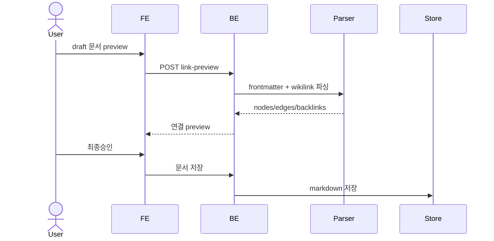

# 문서 링크와 그래프 연결 계약

AX 제품이 생성하는 모든 확정 문서는 Obsidian에서도 연결되어 보여야 하고, 제품 페이지도 같은 링크를 파싱해 문서 그래프를 구성해야 한다.

> 링크 데이터는 별도 중앙 DB 문서가 아니라 각 markdown 문서의 frontmatter와 본문 wikilink에 분산 저장한다. 본문 `[[ ]]`가 엣지의 단일 소스이고, frontmatter `up`은 lineage 오버레이다.

> 연결(connection)은 별도의 "연결 게이트"가 아니라 문서화 승인 게이트(③, AXKG-SPEC-004)의 AI 초안 안 `up:`/`[[ ]]`에서 발현된다. 초안 승인 시 이 링크가 그래프 엣지로 반영된다. 본문 링크/그래프 계약 자체는 이 spec이 SSOT다.

## 1. Context

### Meta

- Decision reference: AXKG-DEC-001, AXKG-DEC-002, AXKG-DEC-005(연결 후보 컨텍스트)
- Baseline reference: AXKG-BL-001
- Domain note: `Document Node`, `Wikilink Edge`, `Lineage Edge`, `Backlink`
- Graph output: 제품 그래프는 API 응답과 PostgreSQL `document_edges` cache로 제공한다.

### Business Requirement

reference, area/concept, baseline 문서가 생성될 때 연결 정보가 함께 남아야 한다. 작성자는 Obsidian에서 연결을 보고, 제품 페이지는 같은 markdown을 읽어 문서 카드, 사이드바, 그래프 뷰를 연결해야 한다.

### Scope

In scope:

- frontmatter 링크 필드 규약
- 본문 wikilink 규약
- Obsidian 호환 링크
- 제품 페이지의 링크 파싱 기준
- reference -> area/concept/project 연결 규칙

Out of scope:

- 그래프 시각화 UI 세부
- 실제 parser 구현
- 저장소/DB 선택

## 2. UX Contract

### Placement

문서 링크는 문서화 승인 게이트(③, AXKG-SPEC-004)의 초안 인라인 렌더와 확정 문서 상세에서 보여준다.

```text
+--------------------------------------------------+
| Document Detail                                  |
+--------------------------+-----------------------+
| Markdown body            | Linked Documents      |
| [[related-note]]         | Backlinks             |
|                          | Upstream / Downstream |
+--------------------------+-----------------------+
```

### U-1. Document Link Preview

- **상태**: 링크 없음, 링크 있음, 깨진 링크, lineage 링크 있음
- **문구**: 연결 문서 제목, 링크 타입, 연결 이유, 원본 wikilink
- **CTA**: `문서 열기`. 연결에 대한 개별 `승인`/`보류` 버튼은 없다 — 연결은 초안과 한 덩어리로 게이트 레벨 `피드백`/`승인`에만 딸린다(AXKG-SPEC-004).
- **기대 결과**: 사용자는 AI가 넣을 링크를 확정 문서 생성 전에 확인하고, 연결이 부적절하면 게이트 `피드백`으로 지적해 초안째 재생성받는다.

### U-2. Graph-based Navigation

- **상태**: 문서 선택됨, 백링크 있음, 상류/하류 있음
- **문구**: 이 문서가 참조한 문서, 이 문서를 참조한 문서, lineage upstream/downstream
- **CTA**: 링크 클릭
- **기대 결과**: 제품 페이지는 markdown의 wikilink와 frontmatter `up`을 읽어 문서 간 이동을 제공한다.

## 3. User Scenario

### S-1. AI — reference note에 링크를 포함해 생성

1. Reference draft 생성 시 AI는 연결 후보 컨텍스트(AXKG-SPEC-011: Graph RAG retriever top-N 관련 문서 + documents index 스냅샷)에서 관련 기존 문서를 찾는다. AI가 스스로 그래프를 탐색하지 않고, 주입된 컨텍스트 안에서만 연결을 만든다.
2. AI는 본문에 `[[target-stem]]` 또는 `[[target-stem|표시명]]` 형태의 Obsidian wikilink를 넣는다.
3. 특정 문서가 이 reference의 기반이거나 계보상 상류이면 frontmatter `up`에 target stem을 추가한다.
4. 제품은 문서화 게이트 인라인에서 초안과 함께 연결 목록을 보여준다.
5. 사용자가 게이트를 `승인`하면 wikilink와 `up`이 포함된 markdown이 확정된다(AXKG-SPEC-004).

### S-2. User — reference에서 기존 개념을 보충

1. 사용자가 기존 개념 보충 파생지식이 포함된 문서화 게이트를 `승인`한다(파생지식 개별 승인 없음, AXKG-SPEC-004).
2. 시스템은 기존 개념 note draft에 reference note wikilink를 본문에 추가한다.
3. reference가 해당 개념 보충의 근거이면 기존 개념 note frontmatter `up`에 reference stem을 추가한다.
4. 제품 페이지는 이 링크를 읽어 reference -> concept lineage를 표시한다.

### S-3. User — project baseline을 생성

1. 사용자가 project baseline 파생지식이 포함된 문서화 게이트를 `승인`한다(개별 승인 없음, AXKG-SPEC-004).
2. 시스템은 baseline 문서 본문에 근거 reference/source wikilink를 포함한다.
3. baseline frontmatter `links.related`에는 관련 reference/concept 링크를 사람이 읽는 추적용으로 남긴다.
4. 그래프 엣지는 본문 wikilink와 `up`에서 생성된다.

## 4. Interface Contract

### Link Syntax Contract

| Link | 용도 | Obsidian | 제품 페이지 |
|---|---|---|---|
| `[[stem]]` | 기본 연결 | 지원 | edge type `assoc` |
| `[[stem|label]]` | 표시명 있는 연결 | 지원 | edge type `assoc`, label ignored for target |
| `[[folder/stem]]` | 경로형 연결 | 지원 | target stem으로 정규화 |
| frontmatter `up: [stem]` | 계보/근거 연결 | 무시 또는 property로 표시 | edge type `lineage`, direction upstream -> current |

### Required Frontmatter

확정 문서는 최소 아래 필드를 가져야 한다.

| Field | Required | 설명 |
|---|---|---|
| `type` | yes | `reference`, `permanent`, `concept`, `baseline`, `decision`, `spec`, `work`, `source` — 이 8종이 제품 document_type 어휘의 SSOT다(DB enum 동일). `product`는 타입이 아니라 project destination 산출물의 묶음 명칭이며 실제 type은 `baseline`/`decision`/`spec`이다(AXKG-DEC-005) |
| `id` | yes | 제품 안에서 유일한 id |
| `title` | yes | 문서 제목 |
| `aliases` | recommended | id와 사람이 찾을 별칭. `[[id]]` resolve용 |
| `up` | optional | lineage upstream stem 목록 |
| `source` | optional | 외부 URL. URL은 그래프 노드가 아니라 속성 |
| `links` | optional | 제품 문서 추적용 사람이 읽는 링크 묶음. 그래프 엣지 SoT가 아님 |

### Graph Edge Contract

| Edge Source | Edge Type | Direction | Notes |
|---|---|---|---|
| 본문 `[[ ]]` | `assoc` | none | Obsidian과 제품 페이지가 모두 읽는 기본 연결 |
| 본문 `[[ ]]` + frontmatter `up` | `lineage` | upstream -> current | `up`은 본문 링크의 타입/방향 오버레이 |
| frontmatter `links` only | none | none | 추적용 metadata. 그래프 엣지로 쓰지 않음 |
| `source: https://...` | none | none | 외부 URL 속성 |

### API Contract

| Method | Path | 요약 | 권한 |
|---|---|---|---|
| GET | `/documents/{document_id}/links` | 문서의 wikilink/up/backlink 조회 | owner |
| POST | `/documents/{document_id}/link-preview` | draft markdown에서 연결 preview 생성 | owner |
| GET | `/graph/documents` | 문서 그래프 노드/엣지 조회 | owner |

### Validation

| 필드/문법 | 규칙 |
|---|---|
| `up` | target stem이 본문 `[[ ]]`에도 있어야 함 |
| wikilink target | 파일명 stem 또는 alias로 resolve 가능해야 함 |
| duplicate stem | 제품 그래프 안에서 허용하지 않음 |
| frontmatter `links` | 그래프 엣지의 SoT로 사용하지 않음 |

### Case Matrix

| 에러 코드 | 백엔드 출력 | 프론트 출력 | 표시 위치 |
|---|---|---|---|
| `BROKEN_WIKILINK` | target resolve 실패 | 연결할 문서를 찾지 못했습니다. | Document Link Preview |
| `UP_WITHOUT_BODY_LINK` | `up`이 본문 링크에 없음 | 계보 링크는 본문 링크도 필요합니다. | Document Link Preview |
| `DUPLICATE_STEM` | stem 충돌 | 같은 파일 식별자가 이미 있습니다. | Document save |

### Flow



## 5. Implementation Rules

- 본문 wikilink가 그래프 엣지의 단일 소스다.
- lineage가 필요한 연결은 반드시 본문 wikilink와 frontmatter `up`을 함께 둔다.
- `up`에만 있고 본문에 없는 target은 invalid다.
- frontmatter `links`는 제품 문서 추적용 metadata이며, 제품 그래프 엣지로 사용하지 않는다.
- source URL은 `source` 속성으로 보존하고 그래프 노드로 만들지 않는다.
- 확정 문서의 본문 SoT는 Markdown 파일이며, PostgreSQL의 `documents.path`는 해당 파일의 위치를 가리킨다.
- PostgreSQL의 graph edge 저장은 조회 최적화용 cache이며, 언제든 Markdown에서 재빌드 가능해야 한다.
- 제품 페이지는 Obsidian과 같은 target 규칙을 따른다: 파일명 stem 우선, aliases/id resolve 지원.
- 깨진 링크 정책: **생성 경로에서는 거부, 사후 발견은 표시.** 초안 preview와 승인 executor는 resolve 불가 링크를 `BROKEN_WIKILINK`로 거부한다(제품이 깨진 링크를 새로 만들지 않음). `document_edges.is_broken`은 외부(Obsidian/git) 직접 편집으로 사후에 깨진 엣지를 재인덱스 시 cache에 표시하는 용도다.
- `concept`은 독립 document_type이며 경로 관례는 `permanent/concepts/*.md`다(파생지식 create_new_concept의 생성 위치).
- 그래프 노드는 문서(document_type 8종)뿐이다. `type=source` 문서(raw source record)는 `/graph/documents` 기본 노출에서 제외한다. AXKG-BL-001이 제안했던 `case`/`tool`/`person`/`organization` 별도 노드타입은 채택하지 않았다 — 문서=노드, 타입=document_type.
- AI가 생성하는 reference, area/concept, baseline draft는 연결 후보와 연결 이유를 같이 보고해야 한다.
- 초안 AI에게는 유효한 stem/alias 목록(documents index 스냅샷)이 항상 제공되어야 하며(AXKG-SPEC-011), AI는 스냅샷 밖 target을 wikilink로 생성하지 않는다. 스냅샷 밖 링크는 link-preview/executor의 `BROKEN_WIKILINK` 검증에서 거부된다.

## 6. Verification

### Acceptance Criteria

- [ ] 생성된 reference draft 본문에 관련 문서 wikilink가 포함될 수 있다.
- [ ] lineage 연결은 본문 wikilink와 `up`에 모두 존재한다.
- [ ] 제품 페이지는 draft 저장 전 연결 preview를 보여준다.
- [ ] Obsidian에서 `[[stem]]` 링크가 깨지지 않아야 한다.
- [ ] 제품 페이지는 같은 markdown으로 문서 링크와 백링크를 구성한다.
- [ ] frontmatter `links`만 있는 관계는 그래프 엣지로 처리하지 않는다.

## 7. Open Questions

- `_graph.json` 파일 산출물은 MVP 범위에서 제외한다. 제품 그래프는 API 응답과 PostgreSQL `document_edges` cache로 제공한다.
