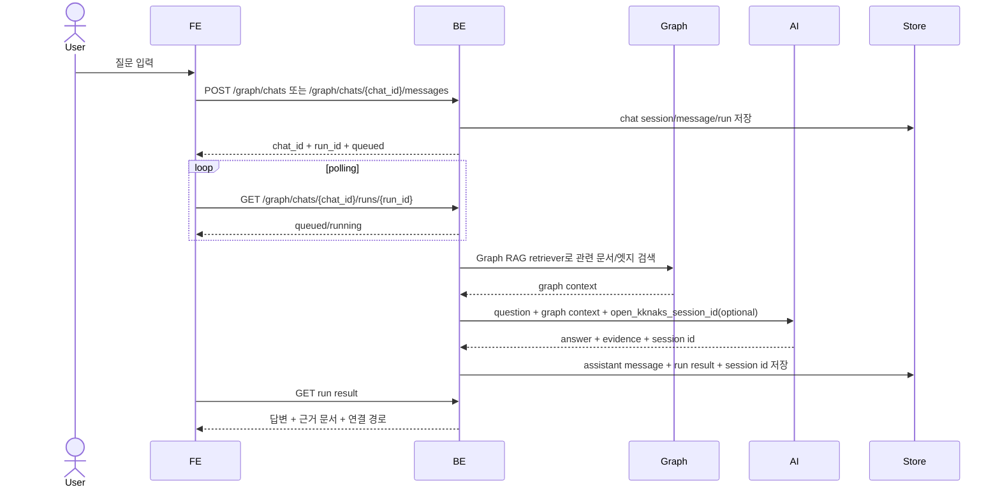

# 그래프 탐색과 Graph RAG 기반 AI 채팅

사용자는 왼쪽에서 문서 그래프를 보고, 오른쪽 채팅에서 Graph RAG 기반 AI 채팅으로 그래프의 문서와 연결을 근거로 질문에 대한 답을 받을 수 있어야 한다.

## 1. Context

### Meta

- Decision reference: AXKG-DEC-001, AXKG-DEC-003(2026-07-14 개정: qmd 2단 retriever)
- Baseline reference: AXKG-BL-001
- Domain note: `Graph View`, `Graph Chat`, `Graph RAG`, `Evidence Document`, `Graph Context`, `qmd Sidecar`, `2-Stage Retriever`
- Retriever: **2단 구조**(AXKG-DEC-003 2026-07-14 개정) — 1단 후보 발굴 = qmd 하이브리드 검색(BM25 + 벡터 RRF, 리랭크 설정 토글·기본 off — CPU 실측 근거, GPU 배포 시 on 권장), 2단 그래프 확장 = qmd top-K 시드로 wikilink 그래프 탐색(edge 가중치·hop 감쇠·다중 시드 합산·선택 노드 우선). qmd 사이드카 장애 시 `keyword score + edge distance`로 graceful fallback. 인덱싱은 사이드카가 소유한 주기적 증분 재인덱싱이라 채팅 요청 경로에 인덱싱 비용이 없다(확정 직후 검색 반영까지 수분 staleness 허용).

### Business Requirement

AX 자료가 reference, area/concept, baseline으로 쌓이면 사용자는 단순 목록이 아니라 관계 구조로 탐색해야 한다. 또한 질문을 던졌을 때 AI는 전체 인터넷이 아니라 제품이 가진 문서 그래프를 검색 context로 삼아 답변해야 한다.

### Scope

In scope:

- `[graph] | [chat]` split view
- 기존 `kknaks_profile` `/graph` 구현을 참고한 문서 노드/엣지 시각화
- 노드 선택과 채팅 context 동기화
- Graph RAG 기반 질문 응답
- 사용자별 채팅 세션과 이전 대화 조회
- 응답 생성 run 상태 폴링
- 2단 retriever(qmd 하이브리드 후보 발굴 + wikilink 그래프 확장)와 qmd 장애 시 keyword+edge 폴백
- 답변 근거 문서/링크 표시
- 근거 부족 시 모른다고 답하고 필요한 수집/연결 제안
- 생각/아이디어 질문에 대한 **방안 제시**와 그 방안을 **Source Inbox로 push**(chat intake)

Out of scope:

- 범용 웹 검색 답변
- 그래프 편집 UI
- 실시간 multi-user collaboration
- Source Inbox 목록·조회·관리 표면 (push 이후는 AXKG-SPEC-003 소관·admin 전용)
- 자동 push (사용자 명시 CTA 없이 방안을 인박스에 넣지 않는다)

## 2. UX Contract

### Placement

그래프 페이지는 좌측 그래프, 우측 채팅으로 구성한다.

```text
+--------------------------------------------------------------+
| Graph Chat                                                   |
+-------------------------------+------------------------------+
| Graph                         | Chat                         |
| - nodes                       | - question input             |
| - edges                       | - answer                     |
| - filters                     | - evidence documents         |
| - selected node detail        | - suggested next actions     |
+-------------------------------+------------------------------+
```

간단 표현:

```text
[graph] | [채팅]
```

### U-1. Graph View

- **상태**: 로딩, 빈 그래프, 그래프 표시, 필터 적용, 노드 선택됨
- **문구**: 노드 제목, 문서 type, 엣지 타입, 연결 수, 필터
- **CTA**: `노드 열기`, `연결 보기`, `채팅 컨텍스트로 사용`
- **기대 결과**: 노드를 선택하면 문서 상세와 주변 연결이 표시되고, 채팅은 해당 노드를 우선 context로 사용한다.

### U-2. Chat Panel

- **상태**: 대기, 질문 입력 중, 응답 생성 중, 근거 부족, 응답 완료, 방안 push 중, push 완료
- **문구**: 질문 입력, 답변, 근거 문서, 사용한 연결 경로, 추가 수집 제안, 제시된 방안, push 결과
- **CTA**: `질문 보내기`, `근거 문서 열기`, `관련 노드 강조`, `Source Inbox에 추가`
- **기대 결과**: 사용자의 질문에 Graph RAG 기반 답변을 제공하고 근거 문서를 함께 보여준다. 사용자가 생각/아이디어를 물으면 시스템은 관련 노드를 근거로 **방안**을 제시하고, 사용자가 `Source Inbox에 추가`를 누르면 **push 시점까지의 채팅 대화 내용 전부(제시된 방안 포함)**를 Source Inbox로 push한다 — `source_channel=chat`인 source 1건이 `received`로 생성되어 기존 요약→분류 파이프라인에 합류한다(AXKG-SPEC-003). 방안만 떼지 않고 대화 전체를 넣는 이유는 방안이 나온 맥락·근거가 유실되지 않게 하기 위함이며, 요약①이 그 대화를 정제한다. push는 사용자 명시 CTA로만 일어나고, push 후 인박스 목록/관리 표면은 이 화면에 노출하지 않는다(admin 전용, 접근 경계 SSOT AXKG-SPEC-008). 이 CTA는 모든 유저(staff 포함)가 사용할 수 있다.

### U-3. Evidence Block

- **상태**: 근거 있음, 근거 부족, 충돌 근거 있음
- **문구**: 문서 제목, 문서 type, 관련 구절 요약, 연결 이유, wikilink
- **CTA**: `문서 열기`, `그래프에서 보기`
- **기대 결과**: 사용자는 답변이 어떤 문서와 연결을 근거로 했는지 추적할 수 있다.

## 3. User Scenario

### S-1. User — 그래프를 보면서 질문한다

1. 사용자는 Graph Chat 페이지를 연다.
2. 시스템은 AX 문서 그래프를 로드한다.
3. 사용자는 그래프에서 특정 concept 또는 reference 노드를 선택한다.
4. 사용자는 오른쪽 채팅에 질문을 입력한다.
5. 시스템은 Graph RAG retriever로 선택 노드, 주변 노드, 관련 reference/baseline을 context로 검색한다.
6. AI는 검색된 graph context를 근거로 답변한다.
7. 시스템은 답변 아래에 근거 문서와 연결 경로를 표시한다.

### S-2. User — 전체 그래프에 질문한다

1. 사용자는 노드를 선택하지 않고 질문한다.
2. 시스템은 Graph RAG retriever로 전체 그래프에서 질문과 관련된 문서/엣지를 검색한다.
3. AI는 검색된 그래프 context만 사용해 답한다.
4. 근거가 부족하면 시스템은 답변 대신 부족한 자료와 수집할 URL/주제 후보를 제안한다.

### S-3. User — 답변 근거를 검증한다

1. 사용자는 답변의 Evidence Block을 본다.
2. 사용자는 `그래프에서 보기`를 누른다.
3. 시스템은 해당 근거 문서와 연결된 노드를 그래프에서 강조한다.
4. 사용자는 `문서 열기`로 markdown 전문을 확인한다.

### S-4. User — 생각을 방안으로 발전시켜 Source Inbox로 push한다

1. 사용자(staff 또는 admin)가 채팅에 생각/아이디어를 묻는다(예: "이 개념으로 뭘 해볼 수 있을까").
2. 시스템은 Graph RAG로 관련 노드를 탐색하고, 그 근거 위에서 **방안**(실행/탐구 제안)을 답변으로 제시한다.
3. 답변에는 `Source Inbox에 추가` suggested action이 딸려 온다(push 대상은 이 채팅의 대화 내용 전부이며, 제시된 방안은 그 안의 assistant 메시지로 포함된다).
4. 사용자가 `Source Inbox에 추가`를 누른다.
5. 시스템은 **push 시점까지의 채팅 대화 내용 전부(user·assistant 메시지 이력 — 방안 포함)**를 `raw_text`로 하는 `source_channel=chat` source를 `received`로 생성한다(URL 없음). push를 만든 채팅/run을 provenance로 함께 남긴다.
6. 생성된 source는 기존 Source Inbox 파이프라인에 합류한다 — URL이 없으므로 그 대화 내용(`raw_text`)이 곧 요약 입력이 되어(AXKG-SPEC-012 User Note Fallback 경로 재사용) 요약→분류→문서화 게이트를 그대로 탄다. 요약①이 대화 전체에서 방안과 그 맥락·근거를 정제한다. 분류 승인은 admin이 한다(AXKG-SPEC-001/002 무변경).
7. 사용자는 push 완료 피드백을 채팅에서 받는다. 인박스 목록/관리 화면은 이 화면에서 열리지 않는다(admin 전용).

## 4. Interface Contract

### API Contract

| Method | Path | 요약 | 권한 |
|---|---|---|---|
| GET | `/graph/documents` | 문서 그래프 노드/엣지 조회 | owner |
| GET | `/graph/documents/{document_id}/neighborhood` | 선택 문서 주변 그래프 조회 | owner |
| GET | `/graph/chats` | 내 채팅 세션 목록 조회 | owner |
| POST | `/graph/chats` | 새 채팅 생성 + 첫 질문 run 생성 | owner |
| GET | `/graph/chats/{chat_id}` | 채팅 메시지 이력 조회 | owner |
| POST | `/graph/chats/{chat_id}/messages` | 기존 채팅에 질문 추가 + 새 run 생성 | owner |
| GET | `/graph/chats/{chat_id}/runs/{run_id}` | 응답 생성 상태/결과 폴링 | owner |
| POST | `/graph/chats/{chat_id}/push-to-inbox` | 제시된 방안을 Source Inbox로 push (`source_channel=chat` source 생성) | authenticated (staff·admin) |
| POST | `/graph/search` | 질문과 관련된 문서/엣지 검색 | owner |

`POST /graph/chat` 단발 응답 API는 두지 않는다. 응답 생성은 오래 걸릴 수 있으므로 chat session + run을 만들고 클라이언트가 run 상태를 polling한다.

> **push 권한 경계**: `POST /graph/chats/{chat_id}/push-to-inbox`는 채팅 접근이 되는 모든 유저(staff·admin)가 쓸 수 있는 **단일 쓰기 액션**이다. 이 액션은 `source_channel=chat` source 1건을 생성할 뿐 Source Inbox 목록·조회·관리 표면 접근을 부여하지 않는다(그 표면은 admin 전용, AXKG-SPEC-003). 다른 `/graph/*` 조회 API의 `owner` 권한과 달리 push만 staff에 열린다. 접근 경계 매트릭스 SSOT는 AXKG-SPEC-008이며 여기서 재서술하지 않는다. push endpoint 경로/파라미터의 최종 형태는 BE 구현과 정합한다(계약 수준까지만 규정).

### Request / Response

새 채팅 `POST /graph/chats` 요청:

| Field | Required | 설명 |
|---|---|---|
| `question` | yes | 사용자 질문 |
| `selected_node_id` | optional | 그래프에서 선택한 문서 |
| `filters` | optional | type, tag, date 등 |

응답:

| Field | 설명 |
|---|---|
| `chat_id` | 새 채팅 세션 id |
| `run_id` | 첫 응답 생성 run id |
| `status` | `queued` 또는 `running` |
| `user_message_id` | 저장된 사용자 메시지 id |

기존 채팅 `POST /graph/chats/{chat_id}/messages` 요청:

| Field | Required | 설명 |
|---|---|---|
| `question` | yes | 사용자 질문 |
| `selected_node_id` | optional | 이번 질문에서 우선 사용할 그래프 문서 |
| `filters` | optional | type, tag, date 등 |

응답은 `run_id`, `status`, `user_message_id`를 반환한다. 서버는 기존 채팅의 `open_kknaks_session_id`가 있으면 AI 실행에 resume/session context로 전달한다.

폴링 `GET /graph/chats/{chat_id}/runs/{run_id}` 응답:

| Field | 설명 |
|---|---|
| `chat_id` | 채팅 세션 id |
| `run_id` | 응답 생성 run id |
| `status` | queued, running, succeeded, failed, cancelled |
| `assistant_message` | 성공 시 저장된 assistant 메시지 |
| `answer` | Graph RAG 기반 답변 |
| `evidence_documents` | 사용한 문서 목록 |
| `evidence_edges` | 사용한 연결 경로 |
| `used_paths` | 답변에 사용한 graph path |
| `confidence` | 근거 충분성 |
| `missing_context` | 근거 부족 시 필요한 자료/질문 |
| `suggested_actions` | Source Inbox 추가, 연결 보강 등. `Source Inbox에 추가`는 push가 가능함을 알리는 액션이고, push되는 내용은 이 채팅의 대화 내용 전부다(제시된 방안은 그 안의 assistant 메시지로 포함). U-2 CTA가 push 요청을 만든다 |
| `error_code` / `error_message` | 실패 시 오류 |

방안 push `POST /graph/chats/{chat_id}/push-to-inbox` 요청:

| Field | Required | 설명 |
|---|---|---|
| `raw_text` | **no** | Source Inbox로 push할 텍스트 = **push 시점까지의 채팅 대화 내용 전부(user·assistant 메시지 이력, 제시된 방안 포함)를 직렬화한 것**. 요약 입력이 된다. **서버가 `chat_id` 로 조립하므로 request 가 보내도 무시한다** — 형식과 조립 위치는 §7.1 확정값 참조 |
| `run_id` | optional | push 시점(대화 컷오프)을 가리키는 run — provenance 기록 및 "push 시점까지" 경계용 |

응답:

| Field | 설명 |
|---|---|
| `source_id` | 생성된 `source_channel=chat` source id |
| `status` | 생성된 source 상태(`received`) |

> push는 Source Inbox source 생성 계약(AXKG-SPEC-003)을 따른다. 생성되는 source의 데이터 계약(`source_channel=chat`·`source_url` 없음·`slack_message_ts=null`·`raw_text`=push 시점까지의 대화 내용 전부[방안 포함])과 이후 요약→분류 흐름은 AXKG-SPEC-003이 소유하며 여기서 재서술하지 않는다.

### Validation

| 필드 | 규칙 |
|---|---|
| `question` | 비어 있으면 안 됨 |
| `selected_node_id` | 그래프에 존재하는 노드여야 함 |
| `evidence_documents` | 답변에 사용한 문서 id/stem을 포함해야 함 |
| `push raw_text` | 비어 있으면 안 됨(trim 후 non-empty). chat source의 요약 입력이 된다 |

### Case Matrix

| 에러 코드 | 백엔드 출력 | 프론트 출력 | 표시 위치 |
|---|---|---|---|
| `EMPTY_QUESTION` | 질문 없음 | 질문을 입력해 주세요. | Chat input |
| `NODE_NOT_FOUND` | 선택 노드 없음 | 선택한 문서를 찾지 못했습니다. | Graph View |
| `INSUFFICIENT_GRAPH_CONTEXT` | 근거 부족 | 현재 그래프만으로 답하기 어렵습니다. | Chat Panel |
| `EMPTY_PUSH_TEXT` | push할 대화 내용 없음 | 인박스에 추가할 내용이 비어 있습니다. | Chat Panel |

### Flow



### Data Contract

| Resource | Field | 설명 |
|---|---|---|
| GraphChatSession | `id` | `chat_id` |
| GraphChatSession | `user_id` | 채팅 소유자 |
| GraphChatSession | `title` | 첫 질문 요약 또는 사용자 지정 제목 |
| GraphChatSession | `status` | active, archived, deleted |
| GraphChatSession | `last_open_kknaks_session_id` | 기존 채팅 resume용 AI 세션/thread id |
| GraphChatMessage | `session_id` | 상위 채팅 |
| GraphChatMessage | `role` | user, assistant, system |
| GraphChatMessage | `content` | 메시지 본문 |
| GraphChatMessage | `sequence_no` | 채팅 내 순서 |
| GraphChatMessage | `evidence` | assistant 메시지의 근거 문서/엣지/경로 |
| GraphChatRun | `session_id` | 상위 채팅 |
| GraphChatRun | `user_message_id` | 이 run을 만든 사용자 질문 |
| GraphChatRun | `assistant_message_id` | 성공 시 생성된 assistant 메시지 |
| GraphChatRun | `ai_task_id` | open-kknaks 실행 추적 row |
| GraphChatRun | `status` | queued, running, succeeded, failed, cancelled |
| GraphChatRun | `retrieval_context` | 검색된 문서/엣지/path snapshot |
| GraphChatRun | `result_payload` | answer/evidence/missing_context/suggested_actions |

## 5. Implementation Rules

- 채팅 응답은 AXKG-SPEC-005의 문서 그래프를 context로 사용한다.
- 채팅 응답은 Graph RAG 방식으로 관련 문서 노드, 연결 엣지, neighborhood, edge path를 검색한 뒤 생성한다.
- **retriever는 2단 구조다**(AXKG-DEC-003 2026-07-14 개정):
  - **1단 후보 발굴**: qmd 사이드카 하이브리드 검색(BM25 + 로컬 embedding 벡터검색 RRF 융합)으로 질문 관련 문서 top-K 후보를 얻는다. **리랭크는 설정 토글이며 기본 off**다(2026-07-14 T-006 CPU-only 실측 수용 — LLM 리랭크 1회 60초+, qmd 공식도 CPU는 off 권장. 설정으로 on 가능, GPU 배포 시 on 권장). 리랭크 토글의 설정 표면 소유는 AXKG-SPEC-007이다(경계 참조만 — 이 spec에서 설정 UI/필드를 재서술하지 않는다).
  - **2단 그래프 확장**: 1단 top-K를 시드로 wikilink 그래프를 자체 탐색한다. edge 타입별 가중치, hop 감쇠, 다중 시드 점수 합산을 적용하고, 선택 노드가 있으면 그 neighborhood를 우선한다(기존 계약 유지). 근거 경로(`used_paths`·`evidence_edges`)를 산출한다.
- **인덱싱은 사이드카가 소유한 주기적 증분 재인덱싱으로 수행한다** — 채팅 요청 경로에서 인덱싱하지 않는다(채팅 지연에 인덱싱 비용 0). qmd MCP가 index/update 툴을 노출하지 않아 api 이벤트 구동 대신 사이드카가 주기적 증분 재인덱싱을 소유하며(2026-07-14 T-006 실측 수용), 확정 직후 검색 반영까지 수분 staleness를 허용한다.
- **graceful fallback**: qmd 사이드카를 사용할 수 없으면(장애·미기동) 1단을 기존 `keyword score + edge distance` 스캔으로 자동 대체하고 2단 그래프 확장은 그대로 수행한다. 폴백은 사용자 실패가 아니라 품질 강등이며 관찰 가능하게 기록한다. keyword+edge 경로는 삭제하지 않고 폴백으로 유지한다.
- pgvector는 도입하지 않는다(계속 파킹). embedding 검색은 qmd 사이드카가 담당한다.
- retriever 튜닝 숫자(edge 가중치·hop 감쇠·top-K/리랭크 기본값)와 qmd 통합 형태(subprocess vs MCP)는 이 spec이 규정하지 않는다(구현 기본값/OQ — AXKG-SPEC-011 §7).
- retriever는 채팅④과 문서화③가 공유하는 컴포넌트이므로, 2단·폴백 실행 계약의 SSOT는 AXKG-SPEC-011이다(이 spec은 채팅 표면에서의 사용만 규정).
- 그래프 시각화 UI는 기존 `app/front/app/graph`와 `app/front/components/graph` 구현 방식을 참고해 AX 제품 화면에 맞게 새로 구현한다.
- 참고 구현과 같은 `react-force-graph-2d`/`d3-force` 기반으로 시작하고, 새 시각화 라이브러리는 도입하지 않는다.
- 채팅 응답 생성은 AXKG-SPEC-007의 open-kknaks provider 설정을 사용한다.
- 채팅은 사용자별 `GraphChatSession`으로 저장하고 이전 대화를 조회할 수 있어야 한다.
- 새 채팅은 새 `chat_id`를 만들고, 기존 채팅은 기존 `chat_id`와 저장된 `open_kknaks_session_id`를 사용해 이어간다.
- 응답 생성은 run 단위로 추적하고 클라이언트는 `run_id`로 polling한다.
- 성공한 응답은 assistant message, run result, evidence, open-kknaks session id를 함께 저장한다.
- Graph Chat은 PostgreSQL의 `document_edges` cache를 사용할 수 있지만, cache는 Markdown 링크에서 재빌드 가능해야 한다.
- 그래프 context에 없는 사실은 단정하지 않는다.
- 근거 문서가 없으면 `INSUFFICIENT_GRAPH_CONTEXT` 상태로 답하고 필요한 수집/연결 후보를 제안한다.
- 답변에는 사용한 문서와 연결 경로를 Evidence Block으로 표시한다.
- 선택된 노드가 있으면 해당 노드의 neighborhood를 우선 검색하고, 부족하면 전체 그래프로 확장한다.
- 채팅이 새 지식이나 수집 필요성을 발견하면 `Source Inbox에 추가` suggested action을 제공할 수 있다.
- 생각/아이디어 질문에는 관련 노드를 근거로 **방안**을 제시하고, 방안에는 push 가능한 본문(`raw_text`가 될 텍스트)을 실은 `Source Inbox에 추가` suggested action을 딸려 보낸다.
- 방안 push는 사용자가 `Source Inbox에 추가` CTA를 누를 때만 실행한다. **자동 push하지 않는다**(CTA 없이 방안을 인박스에 넣지 않는다).
- push는 `POST /graph/chats/{chat_id}/push-to-inbox`로 **push 시점까지의 채팅 대화 내용 전부(방안 포함)**를 `raw_text`로 하는 `source_channel=chat` source 1건을 `received`로 생성한다. source 데이터 계약과 이후 요약→분류 파이프라인 합류는 AXKG-SPEC-003이 규정하며, URL이 없는 chat source는 그 대화 내용(`raw_text`)이 요약 입력이 된다(AXKG-SPEC-012 User Note Fallback 경로 재사용). 방안만 떼지 않고 대화 전체를 넣어 방안의 맥락·근거를 보존하고, 요약①이 정제한다.
- push는 채팅 접근이 되는 모든 유저(staff·admin)가 쓸 수 있는 단일 쓰기 액션이다. 이 액션은 인박스 표면(목록·조회·관리·삭제/무시) 접근을 부여하지 않는다 — 그 표면은 admin 전용이다(접근 경계 SSOT AXKG-SPEC-008). 분류 승인도 admin이 한다(게이트 무변경).

## 6. Verification

### Acceptance Criteria

- [ ] 그래프와 채팅이 `[graph] | [채팅]` 레이아웃으로 동시에 보인다.
- [ ] 그래프 노드를 선택하면 채팅 context에 반영된다.
- [ ] 채팅 답변에는 근거 문서와 연결 경로가 표시된다.
- [ ] 근거가 부족하면 모른다고 답하고 추가 수집/연결 제안을 한다.
- [ ] Evidence Block에서 문서를 열거나 그래프에서 강조할 수 있다.
- [ ] 생각/아이디어 질문에 관련 노드를 근거로 방안을 제시하고, `Source Inbox에 추가`로 그 방안을 push할 수 있다.
- [ ] push하면 `source_channel=chat` source가 `received`로 생성되어 요약→분류 파이프라인에 합류한다(URL 없이 push 시점까지의 대화 내용 전부가 요약 입력, 방안 포함).
- [ ] push는 staff·admin 모두 쓸 수 있고, push 후에도 인박스 목록/관리 표면은 이 화면에 노출되지 않는다.
- [ ] 자동 push는 없다 — 사용자가 CTA를 눌러야만 push된다.

## 7. Open Questions

- (2026-07-14 PLAN-013-T-001) 2단 retriever 튜닝 숫자(edge 타입 가중치·hop 감쇠 함수·qmd top-K)와 qmd 사이드카 통합 형태(subprocess CLI vs MCP)·클래스/파일 경로는 구현 기본값으로 시작하고 관찰 후 조정한다. 상세 SSOT는 AXKG-SPEC-011 §7 OQ다. pgvector는 계속 파킹(qmd 개정으로 대체). (2026-07-14 PLAN-013-T-007 실측 수용) 리랭크 on/off 기본값은 이 튜닝 OQ에서 빠졌다 — CPU 실측으로 **기본 off 확정**(설정 표면 AXKG-SPEC-007으로 on, GPU 배포 시 on 권장).
- ~~(2026-07-14 PLAN-013-T-003) chat push `raw_text` 의 직렬화 형식과 조립 위치~~ → **해소 (2026-07-14 PLAN-013-T-008 구현 확정).** 아래 §7.1 참조. **대화 길이 상한/truncation 정책은 여전히 미결**이다 — 이번 라운드에서 도입하지 않았고, 필요해지면 관찰 후 별도로 결정한다.

### 7.1. chat push `raw_text` 직렬화 — 확정값

> OQ 로 열어 뒀던 것을 구현이 확정했고, 그 결과를 여기 옮긴다. 근거가 결과 보고서에만
> 남아 있으면 보고서가 사라질 때 "왜 이렇게 정했는지" 가 함께 사라진다.

**조립 위치 = 서버다.** 채팅 이력의 SoT 가 서버이므로 클라이언트 직렬화를 신뢰하지 않고 서버가 `chat_id` 로 대화를 authoritative 하게 조립한다. 그래야 *"push 시점까지의 대화 전부"* 를 위·변조 없이 보장하고, 직렬화 형식을 백엔드 한 곳에 고정할 수 있다.

**직렬화 형식 = role heading.** 각 메시지를 `## {Role}` + 본문 블록으로 쓰고 블록 사이는 빈 줄로 구분한다. Role 라벨은 `User`·`Assistant`·`System`. 근거는 `raw_text` 를 요약①(LLM)이 소비하기 때문이다 — role 이 명확한 markdown 이 파싱·정제에 유리하다. **공백뿐인 메시지는 잡음이라 건너뛴다.**

**`run_id` 는 컷오프이자 provenance 다.** 주어지면 그 run 의 응답(assistant, 없으면 user 질문)까지를 경계로 삼고, 없으면 세션 전체를 담는다.

**request 의 `raw_text` 는 optional 이다.** 서버 조립으로 확정하면서 §4 Request 의 `raw_text(required)` 를 optional 로 정리했다 — request 에서 의미를 갖는 것은 `run_id` 뿐이고, `raw_text` 가 와도 **무시하고 서버 조립본을 authoritative 로 쓴다.**

조립 결과가 trim 후 빈 문자열이면 `EMPTY_PUSH_TEXT` 로 거부한다(Case Matrix).
