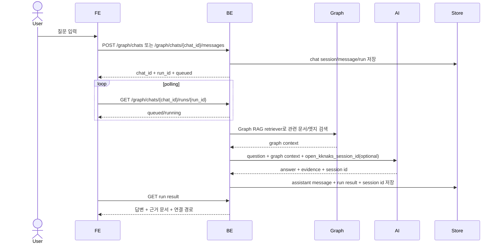

# 그래프 탐색과 Graph RAG 기반 AI 채팅

사용자는 왼쪽에서 문서 그래프를 보고, 오른쪽 채팅에서 Graph RAG 기반 AI 채팅으로 그래프의 문서와 연결을 근거로 질문에 대한 답을 받을 수 있어야 한다.

## 1. Context

### Meta

- Decision reference: AXKG-DEC-001, AXKG-DEC-003
- Baseline reference: AXKG-BL-001
- Domain note: `Graph View`, `Graph Chat`, `Graph RAG`, `Evidence Document`, `Graph Context`
- Ranking: MVP는 `keyword score + edge distance`

### Business Requirement

AX 자료가 reference, area/concept, baseline으로 쌓이면 사용자는 단순 목록이 아니라 관계 구조로 탐색해야 한다. 또한 질문을 던졌을 때 AI는 전체 인터넷이 아니라 제품이 가진 문서 그래프를 검색 context로 삼아 답변해야 한다.

### Scope

In scope:

- `[graph] | [chat]` split view
- 기존 `kknaks_profile` `/graph` 구현을 참고한 문서 노드/엣지 시각화
- 노드 선택과 채팅 context 동기화
- Graph RAG 기반 질문 응답
- 사용자별 채팅 세션과 이전 대화 조회
- 응답 생성 run 상태 폴링
- MVP ranking은 keyword score와 edge distance 조합
- 답변 근거 문서/링크 표시
- 근거 부족 시 모른다고 답하고 필요한 수집/연결 제안

Out of scope:

- 범용 웹 검색 답변
- 그래프 편집 UI
- 실시간 multi-user collaboration

## 2. UX Contract

### Placement

그래프 페이지는 좌측 그래프, 우측 채팅으로 구성한다.

```text
+--------------------------------------------------------------+
| Graph Chat                                                   |
+-------------------------------+------------------------------+
| Graph                         | Chat                         |
| - nodes                       | - question input             |
| - edges                       | - answer                     |
| - filters                     | - evidence documents         |
| - selected node detail        | - suggested next actions     |
+-------------------------------+------------------------------+
```

간단 표현:

```text
[graph] | [채팅]
```

### U-1. Graph View

- **상태**: 로딩, 빈 그래프, 그래프 표시, 필터 적용, 노드 선택됨
- **문구**: 노드 제목, 문서 type, 엣지 타입, 연결 수, 필터
- **CTA**: `노드 열기`, `연결 보기`, `채팅 컨텍스트로 사용`
- **기대 결과**: 노드를 선택하면 문서 상세와 주변 연결이 표시되고, 채팅은 해당 노드를 우선 context로 사용한다.

### U-2. Chat Panel

- **상태**: 대기, 질문 입력 중, 응답 생성 중, 근거 부족, 응답 완료
- **문구**: 질문 입력, 답변, 근거 문서, 사용한 연결 경로, 추가 수집 제안
- **CTA**: `질문 보내기`, `근거 문서 열기`, `관련 노드 강조`, `Source Inbox에 추가`
- **기대 결과**: 사용자의 질문에 Graph RAG 기반 답변을 제공하고 근거 문서를 함께 보여준다.

### U-3. Evidence Block

- **상태**: 근거 있음, 근거 부족, 충돌 근거 있음
- **문구**: 문서 제목, 문서 type, 관련 구절 요약, 연결 이유, wikilink
- **CTA**: `문서 열기`, `그래프에서 보기`
- **기대 결과**: 사용자는 답변이 어떤 문서와 연결을 근거로 했는지 추적할 수 있다.

## 3. User Scenario

### S-1. User — 그래프를 보면서 질문한다

1. 사용자는 Graph Chat 페이지를 연다.
2. 시스템은 AX 문서 그래프를 로드한다.
3. 사용자는 그래프에서 특정 concept 또는 reference 노드를 선택한다.
4. 사용자는 오른쪽 채팅에 질문을 입력한다.
5. 시스템은 Graph RAG retriever로 선택 노드, 주변 노드, 관련 reference/baseline을 context로 검색한다.
6. AI는 검색된 graph context를 근거로 답변한다.
7. 시스템은 답변 아래에 근거 문서와 연결 경로를 표시한다.

### S-2. User — 전체 그래프에 질문한다

1. 사용자는 노드를 선택하지 않고 질문한다.
2. 시스템은 Graph RAG retriever로 전체 그래프에서 질문과 관련된 문서/엣지를 검색한다.
3. AI는 검색된 그래프 context만 사용해 답한다.
4. 근거가 부족하면 시스템은 답변 대신 부족한 자료와 수집할 URL/주제 후보를 제안한다.

### S-3. User — 답변 근거를 검증한다

1. 사용자는 답변의 Evidence Block을 본다.
2. 사용자는 `그래프에서 보기`를 누른다.
3. 시스템은 해당 근거 문서와 연결된 노드를 그래프에서 강조한다.
4. 사용자는 `문서 열기`로 markdown 전문을 확인한다.

## 4. Interface Contract

### API Contract

| Method | Path | 요약 | 권한 |
|---|---|---|---|
| GET | `/graph/documents` | 문서 그래프 노드/엣지 조회 | owner |
| GET | `/graph/documents/{document_id}/neighborhood` | 선택 문서 주변 그래프 조회 | owner |
| GET | `/graph/chats` | 내 채팅 세션 목록 조회 | owner |
| POST | `/graph/chats` | 새 채팅 생성 + 첫 질문 run 생성 | owner |
| GET | `/graph/chats/{chat_id}` | 채팅 메시지 이력 조회 | owner |
| POST | `/graph/chats/{chat_id}/messages` | 기존 채팅에 질문 추가 + 새 run 생성 | owner |
| GET | `/graph/chats/{chat_id}/runs/{run_id}` | 응답 생성 상태/결과 폴링 | owner |
| POST | `/graph/search` | 질문과 관련된 문서/엣지 검색 | owner |

`POST /graph/chat` 단발 응답 API는 두지 않는다. 응답 생성은 오래 걸릴 수 있으므로 chat session + run을 만들고 클라이언트가 run 상태를 polling한다.

### Request / Response

새 채팅 `POST /graph/chats` 요청:

| Field | Required | 설명 |
|---|---|---|
| `question` | yes | 사용자 질문 |
| `selected_node_id` | optional | 그래프에서 선택한 문서 |
| `filters` | optional | type, tag, date 등 |

응답:

| Field | 설명 |
|---|---|
| `chat_id` | 새 채팅 세션 id |
| `run_id` | 첫 응답 생성 run id |
| `status` | `queued` 또는 `running` |
| `user_message_id` | 저장된 사용자 메시지 id |

기존 채팅 `POST /graph/chats/{chat_id}/messages` 요청:

| Field | Required | 설명 |
|---|---|---|
| `question` | yes | 사용자 질문 |
| `selected_node_id` | optional | 이번 질문에서 우선 사용할 그래프 문서 |
| `filters` | optional | type, tag, date 등 |

응답은 `run_id`, `status`, `user_message_id`를 반환한다. 서버는 기존 채팅의 `open_kknaks_session_id`가 있으면 AI 실행에 resume/session context로 전달한다.

폴링 `GET /graph/chats/{chat_id}/runs/{run_id}` 응답:

| Field | 설명 |
|---|---|
| `chat_id` | 채팅 세션 id |
| `run_id` | 응답 생성 run id |
| `status` | queued, running, succeeded, failed, cancelled |
| `assistant_message` | 성공 시 저장된 assistant 메시지 |
| `answer` | Graph RAG 기반 답변 |
| `evidence_documents` | 사용한 문서 목록 |
| `evidence_edges` | 사용한 연결 경로 |
| `used_paths` | 답변에 사용한 graph path |
| `confidence` | 근거 충분성 |
| `missing_context` | 근거 부족 시 필요한 자료/질문 |
| `suggested_actions` | Source Inbox 추가, 연결 보강 등 |
| `error_code` / `error_message` | 실패 시 오류 |

### Validation

| 필드 | 규칙 |
|---|---|
| `question` | 비어 있으면 안 됨 |
| `selected_node_id` | 그래프에 존재하는 노드여야 함 |
| `evidence_documents` | 답변에 사용한 문서 id/stem을 포함해야 함 |

### Case Matrix

| 에러 코드 | 백엔드 출력 | 프론트 출력 | 표시 위치 |
|---|---|---|---|
| `EMPTY_QUESTION` | 질문 없음 | 질문을 입력해 주세요. | Chat input |
| `NODE_NOT_FOUND` | 선택 노드 없음 | 선택한 문서를 찾지 못했습니다. | Graph View |
| `INSUFFICIENT_GRAPH_CONTEXT` | 근거 부족 | 현재 그래프만으로 답하기 어렵습니다. | Chat Panel |

### Flow



### Data Contract

| Resource | Field | 설명 |
|---|---|---|
| GraphChatSession | `id` | `chat_id` |
| GraphChatSession | `user_id` | 채팅 소유자 |
| GraphChatSession | `title` | 첫 질문 요약 또는 사용자 지정 제목 |
| GraphChatSession | `status` | active, archived, deleted |
| GraphChatSession | `last_open_kknaks_session_id` | 기존 채팅 resume용 AI 세션/thread id |
| GraphChatMessage | `session_id` | 상위 채팅 |
| GraphChatMessage | `role` | user, assistant, system |
| GraphChatMessage | `content` | 메시지 본문 |
| GraphChatMessage | `sequence_no` | 채팅 내 순서 |
| GraphChatMessage | `evidence` | assistant 메시지의 근거 문서/엣지/경로 |
| GraphChatRun | `session_id` | 상위 채팅 |
| GraphChatRun | `user_message_id` | 이 run을 만든 사용자 질문 |
| GraphChatRun | `assistant_message_id` | 성공 시 생성된 assistant 메시지 |
| GraphChatRun | `ai_task_id` | open-kknaks 실행 추적 row |
| GraphChatRun | `status` | queued, running, succeeded, failed, cancelled |
| GraphChatRun | `retrieval_context` | 검색된 문서/엣지/path snapshot |
| GraphChatRun | `result_payload` | answer/evidence/missing_context/suggested_actions |

## 5. Implementation Rules

- 채팅 응답은 AXKG-SPEC-005의 문서 그래프를 context로 사용한다.
- 채팅 응답은 Graph RAG 방식으로 관련 문서 노드, 연결 엣지, neighborhood, edge path를 검색한 뒤 생성한다.
- MVP retriever ranking은 `keyword score + edge distance`로 시작한다.
- embedding/pgvector 검색은 MVP 범위에 포함하지 않는다.
- 그래프 시각화 UI는 기존 `app/front/app/graph`와 `app/front/components/graph` 구현 방식을 참고해 AX 제품 화면에 맞게 새로 구현한다.
- 참고 구현과 같은 `react-force-graph-2d`/`d3-force` 기반으로 시작하고, 새 시각화 라이브러리는 도입하지 않는다.
- 채팅 응답 생성은 AXKG-SPEC-007의 open-kknaks provider 설정을 사용한다.
- 채팅은 사용자별 `GraphChatSession`으로 저장하고 이전 대화를 조회할 수 있어야 한다.
- 새 채팅은 새 `chat_id`를 만들고, 기존 채팅은 기존 `chat_id`와 저장된 `open_kknaks_session_id`를 사용해 이어간다.
- 응답 생성은 run 단위로 추적하고 클라이언트는 `run_id`로 polling한다.
- 성공한 응답은 assistant message, run result, evidence, open-kknaks session id를 함께 저장한다.
- Graph Chat은 PostgreSQL의 `document_edges` cache를 사용할 수 있지만, cache는 Markdown 링크에서 재빌드 가능해야 한다.
- 그래프 context에 없는 사실은 단정하지 않는다.
- 근거 문서가 없으면 `INSUFFICIENT_GRAPH_CONTEXT` 상태로 답하고 필요한 수집/연결 후보를 제안한다.
- 답변에는 사용한 문서와 연결 경로를 Evidence Block으로 표시한다.
- 선택된 노드가 있으면 해당 노드의 neighborhood를 우선 검색하고, 부족하면 전체 그래프로 확장한다.
- 채팅이 새 지식이나 수집 필요성을 발견하면 `Source Inbox에 추가` suggested action을 제공할 수 있다.

## 6. Verification

### Acceptance Criteria

- [ ] 그래프와 채팅이 `[graph] | [채팅]` 레이아웃으로 동시에 보인다.
- [ ] 그래프 노드를 선택하면 채팅 context에 반영된다.
- [ ] 채팅 답변에는 근거 문서와 연결 경로가 표시된다.
- [ ] 근거가 부족하면 모른다고 답하고 추가 수집/연결 제안을 한다.
- [ ] Evidence Block에서 문서를 열거나 그래프에서 강조할 수 있다.

## 7. Open Questions

없음. embedding/pgvector 기반 ranking은 MVP 이후 개선 항목으로 둔다.
