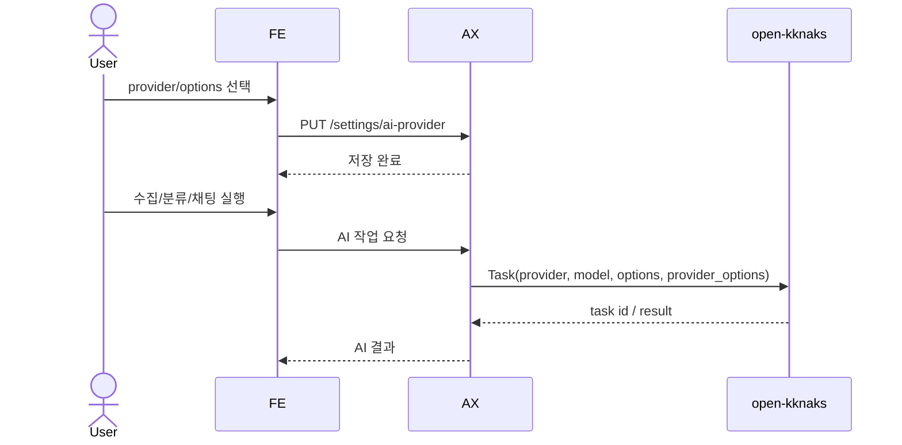

# 내부 AI 실행 설정과 provider 선택

AX 제품의 내부 AI 실행은 `open-kknaks`를 사용하고, 사용자는 설정 페이지에서 기본 provider를 `claude` 또는 `codex`로 선택할 수 있어야 한다. 또한 AI의 최대 대화/반복 turn 수와 reasoning effort 같은 실행 한도를 설정할 수 있어야 한다.

> 설정 페이지는 `AI Provider`(이 spec) + `Prompts`(AXKG-SPEC-009) 2개 섹션으로 구성된다. 이 spec은 provider·model 바인딩과 실행 한도 설정을 다루고, AI 프롬프트 텍스트의 동적 관리·버전 롤백은 AXKG-SPEC-009 소관이다.

## 1. Context

### Meta

- Decision reference: AXKG-DEC-001, AXKG-DEC-003
- Related product: `open-kknaks`
- Related open-kknaks contract: OKK-DEC-001, OKK-SPEC-009
- Domain note: `AI Provider Settings`, `open-kknaks Task`, `provider`
- Default provider: `claude`
- Model preset: MVP에서는 provider별 기본 model preset을 두지 않는다.
- Execution limits: `max_turns`, `effort`, `timeout_sec`

### Business Requirement

수집 요약, 분류 게이트, reference draft, Graph RAG 채팅은 모두 AI 실행이 필요하다. AX 제품은 특정 provider에 고정되지 않고 `open-kknaks`의 provider 기반 task 실행 모델을 사용해야 하며, 사용자는 설정에서 Claude/Codex 중 기본 실행 provider와 실행 한도를 바꿀 수 있어야 한다.

### Scope

In scope:

- 내부 AI 실행 backend로 `open-kknaks` 사용
- 설정 페이지에서 기본 provider 선택
- 지원 provider: `claude`, `codex`
- provider별 model/options/provider_options 저장
- 공통 실행 옵션: `timeout_sec`, `resume`
- provider 실행 옵션: `max_turns`, `effort`
- task_type별 model/options/provider_options override
- MVP seed/default provider는 `claude`
- AI 작업 생성 시 설정된 provider 적용
- provider 상태/가용성 표시

Out of scope:

- custom provider 등록
- provider별 계정 생성/인증 파일 관리 UI
- task queue 운영 상세
- open-kknaks 자체 구현 변경
- AI 프롬프트 텍스트의 동적 관리·버전 롤백 (AXKG-SPEC-009)

## 2. UX Contract

### Placement

설정 페이지에 AI 실행 설정 섹션을 둔다.

```text
+--------------------------------------------------+
| Settings                                         |
+----------------------+---------------------------+
| Navigation           | AI Provider Settings      |
| - General            | Provider: Claude / Codex  |
| - AI                 | Model                     |
| - Integrations       | Options                   |
|                      | Execution Limits          |
|                      | Health                    |
+----------------------+---------------------------+
```

### U-1. AI Provider Settings

- **상태**: 로딩, 설정 있음, 저장 중, 저장 실패, provider unavailable
- **문구**: 내부 AI 실행, provider, model, 실행 옵션, 상태, 마지막 health check
- **CTA**: `Claude`, `Codex`, `저장`, `연결 확인`
- **기대 결과**: 사용자가 provider를 선택하고 저장하면 이후 생성되는 AI 작업의 기본 provider로 사용된다.

### U-2. Provider Health

- **상태**: available, unavailable, unknown
- **문구**: Claude 사용 가능, Codex 사용 가능, worker 연결 실패, 인증 필요
- **CTA**: `다시 확인`
- **기대 결과**: 사용자는 현재 선택한 provider로 AI 작업을 실행할 수 있는지 알 수 있다.

### U-3. Execution Limits

- **상태**: 기본값, override 있음, 저장 중, 저장 실패
- **문구**: `디폴트 설정`, `override`, model, timeout, resume, 최대 turn 수, reasoning effort, 작업별 override
- **CTA**: 디폴트 설정 섹션 하단의 `저장`, override 섹션의 `override 추가`, `override 수정`, `override 삭제`
- **기대 결과**: 사용자는 커스텀 디폴트 설정과 task별 override를 구분해 관리한다. `저장`은 디폴트 설정 섹션 안의 `model`, `options`, `provider_options`를 전역 디폴트로 저장한다. task override의 추가/수정/삭제는 해당 행/모달에서 즉시 적용되며, override는 필요한 경우 `model`, `options.resume`, `options.timeout_sec`, `provider_options.max_turns`, `provider_options.effort`를 task별로 덮어쓸 수 있다.

### U-4. Task Definition Binding

- **상태**: 등록된 task, 비활성 task, override 있음, prompt 연결 없음
- **문구**: task key, 표시명, handler kind, prompt key, active prompt version, 기본 실행 한도, override
- **CTA**: `override 추가`, `prompt 열기`, `비활성화`
- **기대 결과**: 설정 화면의 override는 임의 문자열이 아니라 등록된 `AITaskDefinition.key`에만 붙는다. 새 AI 기능(예: Graph RAG Chat)을 추가할 때는 task definition을 등록하고, 해당 definition이 사용할 prompt key와 handler kind를 연결한다. 이후 사용자는 provider/options/provider_options를 동적으로 조정하고, Prompts 화면에서 연결된 prompt 버전을 동적으로 관리한다.

## 3. User Scenario

### S-1. User — 기본 provider를 Codex로 바꾼다

1. 시스템의 기본 provider는 `claude`로 설정되어 있다.
2. 사용자는 Settings 페이지를 연다.
3. 사용자는 AI Provider Settings에서 `Codex`를 선택한다.
4. 사용자는 필요한 model/options를 확인한다.
5. 사용자는 `연결 확인`을 눌러 provider 상태를 확인한다.
6. 사용자는 `저장`을 누른다.
7. 시스템은 기본 provider를 `codex`로 저장한다.
8. 이후 Source 수집/분류/채팅 AI 작업은 별도 override가 없으면 `open-kknaks` task의 `provider=codex`로 생성된다.

### S-2. System — provider가 unavailable이다

1. 사용자가 `연결 확인`을 누른다.
2. 시스템은 open-kknaks provider health를 조회한다.
3. provider가 unavailable이면 설정 화면에 사유를 표시한다.
4. 저장은 허용할 수 있지만, AI 작업 실행 시 unavailable 상태면 작업을 queued/failed로 표시하고 사용자에게 provider 설정 확인을 요구한다.

### S-3. User — AI 반복/사고 한도를 조정한다

1. 사용자는 Settings 페이지를 연다.
2. 사용자는 `디폴트 설정` 섹션에서 `model`, `timeout_sec`, `resume`을 확인한다.
3. 사용자는 `max_turns`를 조정한다.
4. 사용자는 `effort`를 `low`, `medium`, `high` 중 하나로 선택한다.
5. 사용자는 디폴트 설정 섹션 하단의 `저장`을 누른다.
6. 사용자는 필요하면 `override` 섹션에서 Graph RAG Chat만 `resume=true`, 더 긴 `timeout_sec`, 더 높은 `max_turns`를 쓰도록 task override를 추가한다.
7. 이후 생성되는 open-kknaks task는 저장된 `options`와 `provider_options`를 사용한다.

### S-4. System — 새 AI 기능을 등록하고 설정에서 관리한다

1. 개발자는 새 기능을 처리할 handler를 코드에 추가한다. 예: `graph_rag_chat`.
2. 시스템은 `AITaskDefinition`에 `key=graph_rag_chat`, `prompt_key=graph_rag_chat`, `handler_kind=graph_rag_chat`을 등록한다.
3. Prompts 섹션에는 `graph_rag_chat` prompt가 나타난다.
4. AI Provider Settings의 task overrides 목록에는 `graph_rag_chat`이 선택 가능한 task로 나타난다.
5. 사용자는 Graph RAG Chat만 `timeout_sec=600`, `max_turns=6`, `effort=high`로 조정한다.
6. 이후 Graph Chat에서 생성되는 `ai_tasks(task_type=graph_rag_chat)`는 해당 task definition과 override를 병합한 설정 snapshot을 저장하고 open-kknaks로 실행한다.

## 4. Interface Contract

### API Contract

| Method | Path | 요약 | 권한 |
|---|---|---|---|
| GET | `/settings/ai-provider` | 현재 AI provider 설정 조회 | owner |
| PUT | `/settings/ai-provider` | 전역 AI provider/default options 저장 | owner |
| PUT | `/settings/ai-provider/task-overrides/{task_key}` | 특정 task override 즉시 추가/수정 | owner |
| DELETE | `/settings/ai-provider/task-overrides/{task_key}` | 특정 task override 즉시 삭제 | owner |
| GET | `/settings/ai-provider/health` | Claude/Codex provider 상태 조회 | owner |
| POST | `/ai/tasks` | open-kknaks 기반 AI task 생성 | internal |

### Data Contract

| Resource | Field | 설명 |
|---|---|---|
| AIProviderSettings | `provider` | `claude` 또는 `codex` |
| AIProviderSettings | `model` | provider model override, 선택 |
| AIProviderSettings | `options` | open-kknaks 공통 options |
| AIProviderSettings | `provider_options` | provider별 자유 옵션 |
| AIProviderSettings | `task_overrides` | 등록된 task definition key별 model/options/provider_options override |
| AIProviderSettings | `updated_at` | 마지막 저장 시각 |
| AITaskDefinition | `key` | task_type으로 쓰는 안정 key. 예: `graph_rag_chat` |
| AITaskDefinition | `display_name` | 설정 화면 표시명 |
| AITaskDefinition | `handler_kind` | 코드가 알고 있는 실행 handler |
| AITaskDefinition | `prompt_key` | Prompts에서 관리되는 prompt key |
| AITaskDefinition | `default_options` | task 기본 options |
| AITaskDefinition | `default_provider_options` | task 기본 provider_options |
| AITaskDefinition | `enabled` | 설정 화면/실행 사용 여부 |
| ProviderHealth | `provider` | `claude`, `codex` |
| ProviderHealth | `status` | available, unavailable, unknown |
| ProviderHealth | `message` | 상태 설명 |

### open-kknaks Task Mapping

AX 제품의 모든 AI 작업은 open-kknaks task로 변환된다.

| AX 작업 | open-kknaks field |
|---|---|
| prompt | `Task.prompt` |
| context | `Task.context` |
| provider 설정 | `Task.provider` |
| model override | `Task.model` |
| 공통 실행 옵션 | `Task.options` |
| provider별 옵션 | `Task.provider_options` |

실행 설정 병합 순서:

```text
global AIProviderSettings
  + AITaskDefinition.default_model/default_options/default_provider_options
  + AIProviderSettings.task_overrides[task_key]
  = ai_tasks.model/options/provider_options snapshot
```

프롬프트 선택:

```text
ai_tasks.task_type
  -> AITaskDefinition.key
  -> AITaskDefinition.prompt_key
  -> Prompts active version(prompt_text + output_schema)
  -> open-kknaks Task.prompt + structured output contract
```

`task_overrides`는 `model`, `options`, `provider_options`만 바꾼다. 프롬프트 본문과 출력 스키마는 `prompt_key`에 연결된 Prompts 활성 버전이 담당한다.

실행 한도 mapping:

| 설정 | open-kknaks field | 설명 |
|---|---|---|
| `timeout_sec` | `Task.options.timeout_sec` | task 실행 제한 시간 |
| `resume` | `Task.options.resume` | session/thread 이어가기 설정 |
| `max_turns` | `Task.provider_options.max_turns` | provider가 허용하는 최대 대화/반복 turn 수 |
| `effort` | `Task.provider_options.effort` | reasoning/사고 강도 |

MVP 기본값:

| Field | Default |
|---|---|
| `provider` | `claude` |
| `model` | null |
| `options.timeout_sec` | 300 |
| `provider_options.max_turns` | 3 |
| `provider_options.effort` | `medium` |

지원 provider는 `claude`, `codex`만이다. 알 수 없는 provider는 저장할 수 없다.
초기 seed/default provider는 `claude`다.

### Validation

| 필드 | 규칙 |
|---|---|
| `provider` | `claude` 또는 `codex` |
| `model` | 선택값 |
| `options` | object |
| `provider_options` | object |
| `options.timeout_sec` | 30 이상 3600 이하 |
| `provider_options.max_turns` | 1 이상 20 이하 |
| `provider_options.effort` | `low`, `medium`, `high` 중 하나 |
| `task_overrides` | 등록되어 있고 `enabled=true`인 task definition key만 허용 |
| `task_overrides.*.model` | 비어 있으면 디폴트 model 사용 |
| `task_overrides.*.options.resume` | boolean |

### Case Matrix

| 에러 코드 | 백엔드 출력 | 프론트 출력 | 표시 위치 |
|---|---|---|---|
| `UNSUPPORTED_PROVIDER` | 지원하지 않는 provider | 지원하지 않는 provider입니다. | AI Provider Settings |
| `PROVIDER_UNAVAILABLE` | provider health 실패 | 선택한 provider를 사용할 수 없습니다. | Provider Health |
| `AI_TASK_SUBMIT_FAILED` | open-kknaks task 생성 실패 | AI 작업을 시작하지 못했습니다. | 호출 화면 |
| `INVALID_EXECUTION_LIMIT` | 실행 한도 범위 오류 | 실행 한도 값을 확인해 주세요. | Execution Limits |

### Flow



## 5. Implementation Rules

- AX 제품은 AI 실행을 직접 provider CLI에 붙이지 않고 `open-kknaks` task API를 통해 실행한다.
- 기본 provider 설정은 모든 AI 작업에 적용된다.
- 기본 execution limits는 모든 AI 작업에 적용된다.
- 작업별 override가 있으면 전역 설정 위에 병합한다. 예: Source 요약은 `max_turns`를 낮게, Graph RAG Chat은 `max_turns`를 높게 둘 수 있다.
- 초기 설정이 없으면 시스템은 `claude`를 기본 provider로 사용한다.
- 개별 작업이 provider override를 허용하더라도, MVP 기본 UI는 전역 설정을 우선한다.
- 지원 provider는 `claude`, `codex`만이다.
- provider health는 설정 화면에서 확인 가능해야 한다.
- provider 설정 변경은 기존 queued/running task에는 소급 적용하지 않는다.
- `max_turns`, `effort`, `timeout_sec` 변경은 새로 생성되는 task에만 적용하고 기존 queued/running task에는 소급 적용하지 않는다.
- `max_turns`는 open-kknaks의 `provider_options.max_turns`로 전달한다.
- `effort`는 open-kknaks의 `provider_options.effort`로 전달한다.
- `timeout_sec`는 open-kknaks의 `options.timeout_sec`로 전달한다.

## 6. Verification

### Acceptance Criteria

- [ ] Settings 페이지에서 Claude/Codex 중 하나를 선택할 수 있다.
- [ ] 초기 설정이 없으면 기본 provider는 `claude`다.
- [ ] 저장된 provider가 이후 AI 작업 생성에 반영된다.
- [ ] Settings 페이지에서 `max_turns`, `effort`, `timeout_sec`를 설정할 수 있다.
- [ ] 저장된 execution limits가 이후 open-kknaks task의 `options`/`provider_options`에 반영된다.
- [ ] task_type별 override를 설정할 수 있다.
- [ ] provider health를 확인할 수 있다.
- [ ] unsupported provider는 저장되지 않는다.
- [ ] AI 작업은 open-kknaks task contract로 생성된다.

## 7. Open Questions

없음. MVP에서는 provider별 기본 model preset을 두지 않고, 실행 한도 기본값은 `max_turns=3`, `effort=medium`, `timeout_sec=300`으로 시작한다.
