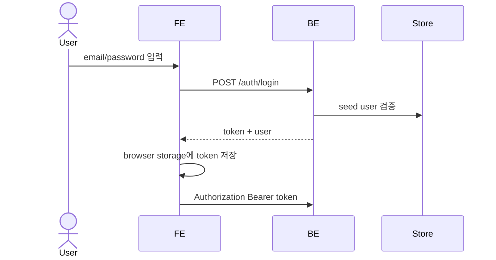

# 간단한 토큰 로그인

MVP는 단일 seed 계정으로 로그인하고, 서버가 발급한 auth token을 브라우저에 저장해 보호된 페이지와 API 요청에 사용한다.

> 이 인증은 개인용/초기 MVP 기준이다. 다중 사용자 권한, refresh token, password reset, MFA는 범위 밖이다.

## 1. Context

### Meta

- Decision reference: AXKG-DEC-001
- Baseline reference: AXKG-BL-001
- Domain note: `User`, `AuthToken`, `ProtectedRoute`
- Token storage: MVP는 `localStorage`

### Business Requirement

Source Inbox, 승인 게이트, 그래프 채팅, AI provider 설정은 개인 지식 베이스를 다루므로 로그인 없이 접근하면 안 된다. MVP에서는 단일 seed 계정으로 간단히 보호한다.

### Scope

In scope:

- 로그인 페이지
- seed user
- auth token 발급
- 브라우저 `localStorage` token 저장
- 보호 라우트
- 로그아웃

Out of scope:

- 회원가입
- 비밀번호 변경/재설정
- refresh token
- role/permission
- MFA
- 외부 OAuth

## 2. UX Contract

### Placement

로그인하지 않은 사용자는 모든 앱 페이지 접근 시 로그인 화면으로 이동한다.

```text
+----------------------------------+
| AX Knowledge Graph               |
| Email                            |
| Password                         |
| [Login]                          |
+----------------------------------+
```

### U-1. Login Page

- **상태**: 기본, 입력 중, 제출 중, 실패
- **문구**: Email, Password, Login, 로그인 실패 메시지
- **CTA**: `Login`
- **기대 결과**: 인증 성공 시 auth token을 브라우저에 저장하고 Source Inbox 또는 직전 요청 페이지로 이동한다.

### U-2. Protected App Shell

- **상태**: 인증됨, token 없음, token 만료/무효
- **문구**: 사용자 email, 로그아웃
- **CTA**: `Logout`
- **기대 결과**: token이 없거나 무효하면 로그인 페이지로 이동한다. 로그아웃하면 브라우저 token을 삭제한다.

## 3. User Scenario

### S-1. User — seed 계정으로 로그인

1. 사용자는 로그인 페이지를 연다.
2. 사용자는 `kknaks@medisolveai.com`과 `1234`를 입력한다.
3. 사용자가 `Login`을 누른다.
4. 시스템은 seed user credential을 검증한다.
5. 시스템은 auth token을 발급한다.
6. 브라우저는 token을 저장한다.
7. 사용자는 보호된 앱 화면으로 이동한다.

### S-2. User — 로그아웃

1. 사용자는 앱 상단 또는 설정에서 `Logout`을 누른다.
2. 브라우저는 저장된 auth token을 삭제한다.
3. 시스템은 사용자를 로그인 페이지로 이동시킨다.

## 4. Interface Contract

### Seed Data

| Field | Value |
|---|---|
| email | `kknaks@medisolveai.com` |
| password | `1234` |

초기 개발 seed data다. 운영 비밀번호 정책으로 간주하지 않는다.

### API Contract

| Method | Path | 요약 | 권한 |
|---|---|---|---|
| POST | `/auth/login` | email/password로 auth token 발급 | public |
| GET | `/auth/me` | 현재 token의 사용자 조회 | authenticated |
| POST | `/auth/logout` | 클라이언트 로그아웃 처리 | authenticated |

### Request / Response

`POST /auth/login` request:

| Field | Required | 설명 |
|---|---|---|
| `email` | yes | seed user email |
| `password` | yes | seed user password |

`POST /auth/login` response:

| Field | 설명 |
|---|---|
| `token` | API 요청에 사용할 auth token |
| `user.email` | 로그인 사용자 email |

### Token Storage

| Item | Contract |
|---|---|
| browser storage | MVP는 브라우저 저장소에 token 저장 |
| request header | `Authorization: Bearer <token>` |
| logout | 브라우저 저장 token 삭제 |

### Protected Routes

다음 화면/API는 token이 필요하다.

| Area | Examples |
|---|---|
| Source Inbox | `/sources`, `/sources/manual` |
| Approval Gates | `/gates/{gate_id}/feedback·retry·approve`, `/sources/{id}/classification-gates`, `/documentation-gates` 조회 (AXKG-SPEC-002/004) |
| Documents/Graph | document link preview, graph documents |
| Graph Chat | `/graph/chats`, `/graph/chats/{chat_id}/*` (AXKG-SPEC-006 run polling) |
| Settings | `/settings/ai-provider`, `/prompts/*`, `/templates/*` |

예외: `POST /integrations/slack/sources`는 token이 아니라 Slack signing secret 검증으로 보호한다(AXKG-SPEC-003).

### Validation

| 필드 | 규칙 |
|---|---|
| `email` | 비어 있으면 안 됨 |
| `password` | 비어 있으면 안 됨 |
| `token` | 서버가 발급한 유효 token |

### Case Matrix

| 에러 코드 | 백엔드 출력 | 프론트 출력 | 표시 위치 |
|---|---|---|---|
| `INVALID_CREDENTIALS` | email/password 불일치 | 이메일 또는 비밀번호가 올바르지 않습니다. | Login Page |
| `MISSING_TOKEN` | Authorization header 없음 | 로그인이 필요합니다. | App Shell |
| `INVALID_TOKEN` | token 검증 실패 | 세션이 유효하지 않습니다. 다시 로그인해 주세요. | App Shell |

### Flow



## 5. Implementation Rules

- MVP seed user는 `kknaks@medisolveai.com / 1234`다.
- token은 브라우저에 저장하고 API 요청에 `Authorization: Bearer`로 전달한다.
- 보호 API는 token 없이는 실행하지 않는다.
- 로그아웃은 브라우저 token 삭제를 기준으로 한다.
- `1234`는 개발 seed 비밀번호이며 운영 보안 기준이 아니다.

## 6. Verification

### Acceptance Criteria

- [ ] seed 계정으로 로그인할 수 있다.
- [ ] 로그인 성공 시 브라우저에 token이 저장된다.
- [ ] token이 있으면 보호 페이지에 접근할 수 있다.
- [ ] token이 없거나 invalid면 로그인 페이지로 이동한다.
- [ ] 로그아웃하면 token이 삭제된다.

## 7. Open Questions

없음. MVP token 저장소는 `localStorage`로 확정한다.
