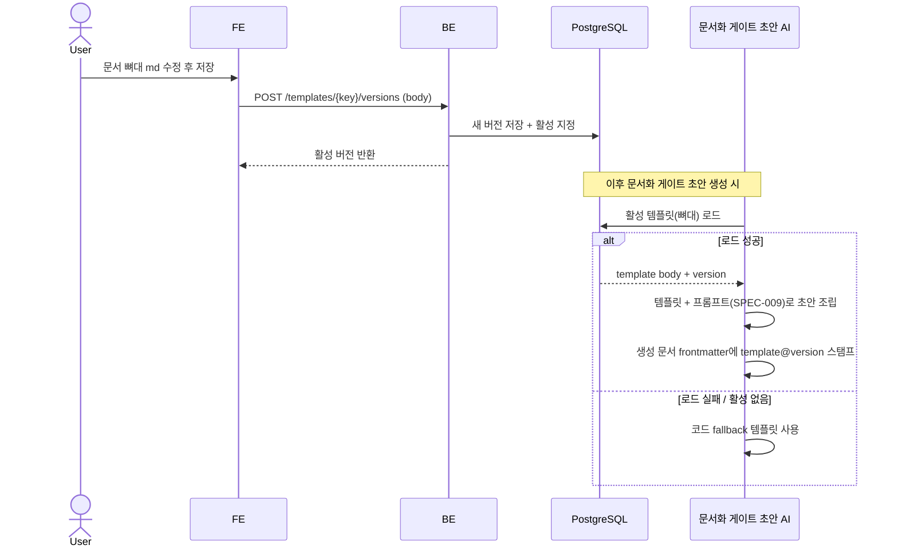
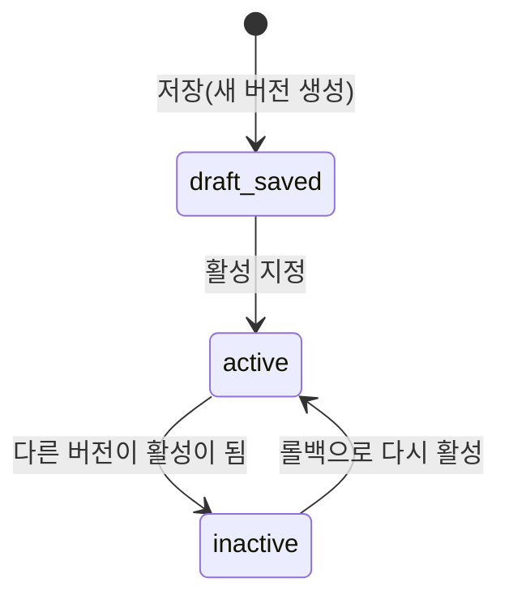

# 문서 템플릿 동적 관리와 버전 롤백

ax-graph가 AI로 생성하는 **지식 문서의 템플릿(문서 뼈대 = frontmatter 필드 + 섹션 구조)** 을 코드 재배포 없이 설정에서 편집·버저닝하고, 잘못된 버전은 이전 버전으로 롤백하며, 생성된 문서에는 적용된 템플릿 버전을 frontmatter에 스탬프해 추적 가능하게 보장한다. AXKG-SPEC-009(프롬프트·출력 스키마 동적 관리)와 대칭 구조다.

> 기능/정책 묶음 단위의 **외부 계약** 문서다. client / QA / 외부 통합이 이 문서만 읽고 따를 수 있어야 한다.
> 템플릿 저장 스키마·컬럼·repository/service 구조는 이 문서에 두지 않는다.
> **경계**: 이 spec의 대상은 **ax-graph가 AI로 생성하는 지식 문서(reference/permanent 등)의 템플릿**이다. 코드레포의 `templates/product/**`(product-doc-pipeline 메타문서 템플릿, @product-curator 소유)와 **별개**이며 섞지 않는다. 템플릿 = 문서 뼈대, 문서생성 프롬프트(AXKG-SPEC-009) = 뼈대를 채우는 작성 방법이다.
> **출력 양식 층 위치**: 템플릿은 3층 taxonomy(AXKG-SPEC-011 §4 Layer Taxonomy)의 **출력 양식** 층에서, `output_schema`(출력 JSON shape)와 **구별되는 별도 아티팩트**인 **md 뼈대**다(이 구분은 유지). 템플릿은 **문서화③ 전용**이다 — reference/permanent/project_baseline **및 concept**(파생 원자 개념) 문서 뼈대. 요약①은 md(`body_markdown`)를 출력하지만 원문 구조를 따르는 **적응형 출력**이라 고정 뼈대가 맞지 않아 템플릿이 없고(형식 규약은 프롬프트=AXKG-SPEC-009 소관), 분류②·채팅④는 md 산출이 없어 템플릿 없이 `output_schema`(AXKG-SPEC-009)만 갖는다(2026-07-09 PLAN-009-T-011 재정정 — T-009의 "md 산출 스테이지 ①③ 공통" 서술을 문서화③ 전용으로 되돌림). archive는 문서화 게이트가 없어 템플릿이 없다(아래 MVP scope). 템플릿은 `output_schema`에 넣지 않고 조립 시 프롬프트에 주입한다(넣으면 응답 스키마가 비대해짐).
> **주입 방식 구분**(2026-07-09 PLAN-009-T-028): main 문서 템플릿(reference/permanent/project_baseline)은 **destination 매핑**으로 선택되고, `concept` 템플릿은 파생 원자 개념이라 destination이 없어 **문서화③ 조립 시 고정 동봉**으로 주입된다. concept가 고정 골격(정의/맥락/근거 출처)을 가진 문서 타입이므로 뼈대는 템플릿 소유가 맞다 — T-023이 "concept는 템플릿 대상 아님·형식은 프롬프트 소관"으로 둔 것을 **개정**한다(배선 부재 타협 해소).

## 1. Context

### Meta

- Decision reference: AXKG-DEC-002(운영 저장소 PostgreSQL), AXKG-DEC-004(MVP 기본값), AXKG-DEC-005(채택 근거·3자 조립·project 포함)
- Baseline reference: AXKG-BL-001
- Domain note: `Document Template`, `Template Version`, `template key`, `active version`, `template stamp`
- Storage: 템플릿(md 본문)과 버전은 PostgreSQL(DEC-002 운영 저장소)에 둔다. 문서 SoT(Markdown)와 별개이며, 운영 설정 데이터다.
- 템플릿 정의 = 문서 뼈대(frontmatter 필드 + 섹션 구조)를 담은 md 본문 + 버전. 하나의 템플릿 키(문서 타입)마다 여러 버전이 있고 그중 하나가 활성이다.
- 경계: 문서생성 프롬프트·출력 스키마는 AXKG-SPEC-009 소관. 이 spec은 템플릿(md 뼈대) + 버전 + 스탬프만 다룬다. 코드레포 `templates/product/**`는 범위 밖. taxonomy 상 위치는 **출력 양식 층의 md 뼈대 아티팩트**(문서화③ 문서 뼈대 전용)이고, JSON shape은 `output_schema`가 별도로 대응한다(AXKG-SPEC-011 §4 Layer Taxonomy, 위 경계 참조).
- MVP scope: 문서화③ 문서 템플릿 `reference`·`permanent`·`project_baseline`·`concept` **4종**(2026-07-09 PLAN-009-T-028). main 3종은 destination 매핑(resource→reference, area→permanent, project→project_baseline, AXKG-DEC-005), `concept`는 파생 원자 개념이라 destination 없이 **문서화③ 조립 시 고정 동봉**으로 주입한다. project의 decision/spec 후보 템플릿 확장은 Open Questions. 요약①은 원문 구조를 따르는 적응형 출력이라 템플릿 대상이 아니다(형식 규약은 프롬프트 소관, AXKG-SPEC-011 §4 Layer Taxonomy). archive는 문서화 게이트로 넘어가지 않으므로(AXKG-SPEC-004) 템플릿이 없다.

### Business Requirement

AI가 생성하는 지식 문서의 뼈대(frontmatter 필드·섹션 구조)를 코드에 하드코딩하면, 뼈대 한 줄을 고치려 해도 재배포가 필요하다. 사용자는 설정에서 문서 템플릿 md를 편집·저장해 즉시 반영하고, 새 버전이 나쁘면 이전 버전으로 롤백할 수 있어야 한다. 또한 생성된 문서에는 적용된 템플릿 버전을 남겨(예: `reference@v3`), 어떤 문서가 어떤 뼈대로 만들어졌는지 추적하고 템플릿 개정 시 재적용/마이그레이션의 근거로 쓸 수 있어야 한다.

### Scope

In scope:

- 문서 템플릿(md 본문) 목록/조회/편집
- 편집 시 새 버전으로 저장(기존 버전 보존)
- 활성 버전 지정
- 이전 버전으로 롤백(활성 버전 전환)
- 문서화 승인 게이트(③, AXKG-SPEC-004) 초안 생성 시 활성 템플릿 적용
- 생성된 문서 frontmatter에 적용된 템플릿 버전 스탬프

Out of scope:

- 코드레포 `templates/product/**`(product-doc-pipeline 메타문서 템플릿) 수정
- 문서생성 프롬프트·출력 스키마 (AXKG-SPEC-009)
- 템플릿 변경 시 기존 문서 자동 마이그레이션 (Open Questions)
- project의 decision/spec 후보 템플릿 확장 (Open Questions. MVP의 project 초안은 baseline 후보만)
- 템플릿 다국어/변수 엔진, A/B 테스트

## 2. UX Contract

### Placement

설정 페이지 안에 `Templates` 섹션을 둔다. AXKG-SPEC-009 `Prompts` 섹션과 대칭이다. 좌측 템플릿 목록, 우측 md 편집기·버전 히스토리다.

```text
+----------------------------------------------------------+
| Settings                                                 |
+----------------+-----------------------------------------+
| Navigation     | Templates                               |
| - General      | +---------------+---------------------+ |
| - AI Provider  | | Template List | Editor              | |
| - Prompts      | | - reference   | [문서 뼈대 md]      | |
| - Templates    | |   (활성 v3)   | frontmatter+섹션구조 | |
|                | | - permanent   | [저장 = 새 버전]    | |
|                | |   (활성 v1)   +---------------------+ |
|                | |               | Version History     | |
|                | |               | v3 (활성) v2 v1     | |
|                | +---------------+---------------------+ |
+----------------+-----------------------------------------+
```

템플릿 편집기는 문서 뼈대(frontmatter 필드 + 섹션 구조)를 담은 md 본문을 편집한다. `저장`은 이를 새 버전으로 묶는다.

### U-1. Template List

- **상태**: 로딩, 목록 있음, 빈 목록, 에러
- **문구**: 템플릿 키(reference/permanent/project_baseline/concept)와 용도, 활성 버전 번호, 마지막 수정 시각
- **CTA**: `템플릿 선택`(목록 항목 클릭)
- **기대 결과**: 항목을 선택하면 우측 편집기와 버전 히스토리가 해당 템플릿으로 채워진다. 템플릿 키는 문서 타입 기반이다 — main 3종은 AXKG-SPEC-001의 destination 매핑(`resource→reference`, `area→permanent`, `project→project_baseline`)에서 파생하고, `concept`는 파생 원자 개념 문서 타입(destination 없음, 문서화③ 고정 동봉)에서 온다. 이 spec은 키를 새로 발명하지 않는다.

### U-2. Template Editor (문서 뼈대 md)

- **상태**: 비어 있음(미선택), 편집 중, 저장 중, 저장 실패
- **문구**: 문서 뼈대 md 본문(`body`, frontmatter 필드 + 섹션 구조) 편집 영역, 현재 활성 버전 표시, `저장하면 새 버전이 생성됩니다` 안내
- **CTA**: `저장`(본문이 비어 있지 않을 때 활성)
- **기대 결과**: `저장`하면 기존 버전을 덮어쓰지 않고 새 버전이 생성되며 그 새 버전이 활성 버전이 된다. 저장 후 버전 히스토리에 새 버전이 활성으로 표시된다.

### U-3. Version History

- **상태**: 버전 1개, 여러 버전, 활성 버전 표시
- **문구**: 버전 번호, 생성 시각, 활성 여부, 버전 본문 미리보기
- **CTA**: `이 버전으로 롤백`, `버전 비교`
- **기대 결과**: `이 버전으로 롤백`을 누르면 선택한 과거 버전이 활성 버전이 된다(복사한 새 버전을 만들지 않고 활성 포인터를 이동). `버전 비교`는 두 버전의 md 차이를 보여준다.

### U-4. Save / Rollback Confirm

- **상태**: 닫힘, 열림
- **문구**: 저장/롤백 대상 템플릿과 버전, 변경 후 활성 버전 안내
- **CTA**: `확인`, `취소`
- **기대 결과**: 활성 버전 전환(저장·롤백)은 확인 후 반영된다.

## 3. User Scenario

### S-1. User — reference 템플릿을 수정하고 새 버전으로 활성화

1. 사용자는 설정 `Templates` 섹션에서 `reference` 템플릿을 선택한다.
2. 편집기에 현재 활성 버전의 문서 뼈대 md(frontmatter 필드 + 섹션 구조)가 채워진다.
3. 사용자는 뼈대(예: `up` 필드 추가, `## 우리 적용점` 섹션 추가)를 수정하고 `저장`을 누른다.
4. 시스템은 기존 버전을 보존한 채 새 버전을 만들고, 새 버전을 활성 버전으로 지정한다.
5. 이후 AXKG-SPEC-004의 문서화 승인 게이트(③) 초안 AI는 활성 reference 템플릿(뼈대) + 문서생성 프롬프트(AXKG-SPEC-009)를 함께 소비해 초안을 생성한다.
6. 생성된 문서 frontmatter에는 적용된 템플릿 버전이 스탬프된다(예: `template: reference@v3`).

### S-2. User — 새 템플릿 버전이 나빠서 롤백

1. 사용자는 새 버전 적용 후 생성되는 문서 뼈대가 나빠졌다고 판단한다.
2. 사용자는 Version History에서 직전 버전을 선택하고 `이 버전으로 롤백`을 누른다.
3. 시스템은 활성 버전을 이전 버전으로 전환한다(과거 버전은 그대로 보존).
4. 이후 문서 생성은 롤백된 활성 템플릿을 사용하고, 그 버전을 frontmatter에 스탬프한다.

### S-3. System — 활성 템플릿 로드 실패

1. 문서화 승인 게이트(③) 초안 생성 시 활성 템플릿을 로드하려 한다.
2. 저장소 조회가 실패하거나 활성 버전이 없다.
3. 시스템은 코드에 내장된 fallback 템플릿(뼈대)으로 문서 생성을 계속한다(초안 생성을 중단하지 않는다).
4. 로드 실패는 관찰 가능한 방식으로 기록되며, 이후 재시도 시 정상 로드되면 활성 버전을 다시 사용한다.

## 4. Interface Contract

### API Contract

| Method | Path | 요약 | 권한 |
|---|---|---|---|
| GET | `/templates` | 템플릿 목록(각 항목의 활성 버전 포함) 조회 | owner |
| GET | `/templates/{key}` | 단일 템플릿의 활성 버전 조회 | owner |
| GET | `/templates/{key}/versions` | 템플릿 버전 목록 조회 | owner |
| POST | `/templates/{key}/versions` | 본문 저장(새 버전 생성 + 활성화) | owner |
| POST | `/templates/{key}/rollback` | 지정 버전으로 활성 버전 전환 | owner |

> 템플릿 관리 화면과 변경 API는 설정 소관으로 **admin 전용**이다 — staff는 접근할 수 없다. 접근 경계 매트릭스 SSOT는 AXKG-SPEC-008이며 여기서는 재서술하지 않는다.

문서화 승인 게이트(③)의 초안 생성이 활성 템플릿을 소비하는 계약은 AXKG-SPEC-004가 정의한다.

### Request / Response

저장 요청은 템플릿 `key`와 새 본문(`body`, md)을 포함한다. 롤백 요청은 활성으로 만들 대상 `version`을 포함한다. 조회 응답은 활성 버전의 본문을 반환한다. 필드는 계약 수준(`key`, `body`, `version`, `is_active`, `updated_at`)으로만 정의하고, 저장 스키마 상세는 코드/migration이 SoT다.

### Validation

| 필드 | 규칙 |
|---|---|
| `key` | 존재하는 템플릿 key여야 함(문서 타입 기반, reference/permanent/project_baseline/concept) |
| `body` | 비어 있으면 안 됨 |
| `version` | 롤백 시 해당 템플릿에 존재하는 버전이어야 함 |

### Case Matrix

| 에러 코드 | 백엔드 출력 | 프론트 출력 | 표시 위치 |
|---|---|---|---|
| `TEMPLATE_NOT_FOUND` | 존재하지 않는 템플릿 key | 템플릿을 찾을 수 없습니다. | Template List |
| `EMPTY_TEMPLATE_BODY` | 본문 없음 | 템플릿 본문을 입력해 주세요. | Template Editor |
| `TEMPLATE_VERSION_NOT_FOUND` | 롤백 대상 버전 없음 | 롤백할 버전을 찾을 수 없습니다. | Version History |
| `TEMPLATE_SAVE_FAILED` | 버전 저장 실패 | 템플릿을 저장하지 못했습니다. 다시 시도해 주세요. | Template Editor |

### Flow



### State / Lifecycle

템플릿 버전의 활성 여부 전이는 아래와 같다. 저장은 새 버전을 활성으로, 롤백은 기존 버전을 활성으로 만든다.



### Data Contract

| Resource | Field | 설명 |
|---|---|---|
| Template | `key` | 템플릿 식별 키(문서 타입 기반). main 3종은 AXKG-SPEC-001 destination 매핑에서 파생, `concept`는 파생 원자 개념 타입(destination 없음, 문서화③ 고정 동봉) |
| Template | `active_version` | 현재 활성 버전 번호 |
| TemplateVersion | `version` | 같은 key 안에서 증가하는 버전 번호 |
| TemplateVersion | `body` | 문서 뼈대 md 본문(frontmatter 필드 + 섹션 구조) |
| TemplateVersion | `is_active` | 활성 버전 여부 |
| TemplateVersion | `updated_at` | 저장/변경 시각 |

생성된 지식 문서의 frontmatter에는 적용된 템플릿 버전을 스탬프한다(예: `template: reference@v3`, 또는 `template_key`+`template_version` 한 쌍). 이 스탬프는 어떤 문서가 어떤 템플릿 버전으로 만들어졌는지 추적하고 템플릿 개정 시 재적용 대상 식별의 근거가 된다.

## 5. Implementation Rules

- 템플릿 저장은 기존 버전을 수정하지 않고 새 버전을 만든다. 저장하면 새 버전이 활성이 되고, 롤백하면 지정한 기존 버전이 활성이 된다.
- 문서화 승인 게이트(③, AXKG-SPEC-004) 초안 생성은 **템플릿(뼈대) + 문서생성 프롬프트(AXKG-SPEC-009) + output_schema(구조 필드)** 3자를 조립해 수행한다. 조립 주체는 백엔드 context builder이고 순서는 `template → prompt → output_schema`다(AXKG-DEC-005, 실행 계약은 AXKG-SPEC-011). 템플릿은 뼈대를, 프롬프트는 채우는 방법을 담당하며 AI는 조립된 컨텍스트를 채우기만 한다.
- 생성된 문서 frontmatter의 템플릿 스탬프는 생성 시점의 활성 버전을 기준으로 기록한다.
- 활성 템플릿 로드 실패나 활성 버전 부재 시 코드 fallback 템플릿으로 문서 생성을 계속한다(중단하지 않는다).
- 템플릿 키는 문서 타입 기반이다. main 3종(reference/permanent/project_baseline)은 AXKG-SPEC-001의 destination 매핑에서 파생하고, `concept`는 파생 원자 개념 문서 타입에서 온다(destination 없음). 이 spec에서 새 키를 발명하지 않는다.
- 문서 템플릿의 frontmatter 필드는 AXKG-SPEC-005 Required Frontmatter 계약을 SSOT로 따르며 새 필드 어휘를 발명하지 않는다(2026-07-09 PLAN-009-T-018, AXKG-DEC-005): `id`는 넣지 않고(필수→선택 강등, resolve 우선순위 `stem→alias→id`는 코드 유지), reference 템플릿은 `source`(파서 키 — `source_url` 아님)·`aliases`·`up`(list 문법)을 두며 `created_at`은 넣지 않는다.
- **permanent 템플릿 = 종합 노트 골격**(2026-07-09 PLAN-009-T-023, AXKG-DEC-005 C): permanent(area)는 원자 개념들이 합쳐져 자라는 **종합/전략 노트**이므로(4층 지식 아키텍처 SSOT는 AXKG-SPEC-004), 템플릿 골격은 `영역 주제 / 현재 나의 종합·판단 / 구성 개념(- [[concept]] — 역할) / 열린 질문`으로 재정의한다. 종합 노트는 개념 상세를 재서술하지 않고 구성 개념을 `[[concept]]` 링크로 참조한다(SoT 위임, AXKG-SPEC-004). 세부 문안(실제 md 뼈대 텍스트)은 BE 태스크 소관이며, 이 spec은 "permanent=종합 노트" 계약 수준까지만 규정한다.
- **concept(원자 개념)도 템플릿을 갖는다 — 문서화③ 고정 동봉**(2026-07-09 PLAN-009-T-028, T-023 C항 개정): concept는 고정 골격(정의/맥락/근거 출처)을 가진 문서 타입이므로 Layer Taxonomy(AXKG-SPEC-011 §4)상 **뼈대는 템플릿 소유**가 맞다. concept는 main이 아니라 **파생지식**(`create_new_concept`)으로 산출되어 destination 매핑이 없으므로, main 3종처럼 destination으로 선택되지 않고 **문서화③ 조립 시 고정 동봉**으로 주입된다. concept 템플릿은 뼈대(정의/맥락/근거 출처)만 담고, 채우는 작성 방법(how)은 여전히 프롬프트(AXKG-SPEC-009) 소관이다. 종전 T-023이 "concept는 템플릿 대상 아님·형식은 프롬프트 소관"으로 둔 것을 이 항이 개정한다(배선 부재 타협 해소). 현행 permanent 템플릿의 "한 줄 주장/맥락/내 결론" 골격이 실은 concept의 모양이라는 관찰은 유지 — 그 골격은 concept 템플릿으로 이사한다.
- 이 spec의 템플릿은 코드레포 `templates/product/**`와 무관하다. 서로 수정·참조하지 않는다.

## 6. Verification

### Acceptance Criteria

- [ ] 설정 `Templates` 섹션에서 템플릿 목록과 각 활성 버전을 볼 수 있다.
- [ ] 템플릿 편집기에서 문서 뼈대 md를 편집할 수 있다.
- [ ] 저장하면 새 버전이 생성되고 활성 버전이 된다.
- [ ] 빈 본문은 저장되지 않는다.
- [ ] Version History에서 롤백하면 활성 버전이 전환된다.
- [ ] 문서화 게이트 초안은 활성 템플릿 + 프롬프트(AXKG-SPEC-009)를 함께 소비해 생성된다.
- [ ] 생성된 문서 frontmatter에 적용된 템플릿 버전이 스탬프된다.
- [ ] 활성 템플릿 로드 실패 시 코드 fallback으로 문서 생성이 계속된다.
- [ ] 이 spec의 템플릿은 코드레포 `templates/product/**`와 분리되어 있다.
- [ ] 문서 템플릿 frontmatter가 AXKG-SPEC-005 Required Frontmatter를 따른다(`id` 없음, `source`/`aliases`/`up` list, `created_at` 없음).
- [ ] permanent 템플릿이 종합 노트 골격(영역 주제 / 종합·판단 / 구성 개념 `[[concept]]` / 열린 질문)을 따르며 개념 상세를 재서술하지 않는다.
- [ ] concept(원자 개념) 템플릿이 MVP scope 4종째로 존재하며, main 3종과 달리 destination 매핑이 아니라 문서화③ 조립 시 고정 동봉으로 주입된다.

## 7. Open Questions

- ~~project·archive 템플릿으로의 확장 방식~~ → **project는 MVP 포함으로 확정**(AXKG-DEC-005): `project_baseline` 템플릿 1종(project destination의 초안은 baseline 후보만, AXKG-SPEC-004). project의 decision/spec 후보 템플릿 확장은 후속 결정. archive는 문서화 게이트가 없으므로 템플릿 대상이 아니다.
- 템플릿 개정 시 기존 문서의 재적용/마이그레이션 방식. frontmatter 템플릿 스탬프로 재적용 대상 문서를 식별하는 것까지는 정하되, 실제 재생성/수동 갱신 정책은 후속 결정으로 남긴다.
- ~~요약① `body_markdown` 템플릿의 key 편입 방식~~ → **철회**(2026-07-09 PLAN-009-T-011): 요약①은 원문(출처)의 자체 구조를 따라가는 **적응형 출력**이라 고정 뼈대(템플릿)를 두지 않기로 재정정했다. 따라서 요약 템플릿 key/저장 편입 문제 자체가 성립하지 않는다. 요약 md의 형식 규약은 프롬프트(작성 방법, AXKG-SPEC-009)가 담고, `body_markdown`은 요약 output_schema 필드로 출력된다(AXKG-SPEC-011 §4 Layer Taxonomy).
- ~~3자의 조립 순서와 표현 형식~~ → **확정**(AXKG-DEC-005): 백엔드 context builder가 `template → prompt → output_schema` 순으로 조립하며, output_schema는 JSON Schema다. 실행 계약은 AXKG-SPEC-011이 SSOT다.
