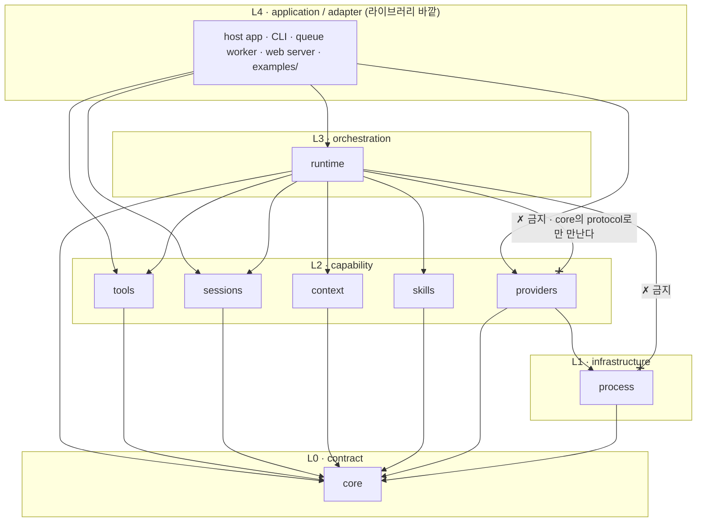

# Runtime 디렉터리 구조와 의존 경계

KAG-BL-001이 가안으로 남긴 책임 분해를 **책임별 package 구조**로 확정하고, 각 상위 디렉터리의 단일 책임과 package 사이의 허용/금지 의존 방향을 함께 정한다.

> baseline의 날것 입력을 spec으로 내리기 전에 적용 방향을 정하는 문서.
> 기능 계약 상세는 `20-spec/`, 실제 작업 순서는 `30-work/`에 둔다.

> **상태 `accepted` (2026-08-08 사용자 확정).** planner가 `proposed`로 올린 권고안을 사용자가 Option B로 확정했다. 아래 내용은 이제 이 제품의 결정이며, 바꾸려면 새 decision으로 supersede한다. 다만 §Open Questions에 남은 항목은 여전히 미결이고, 이 결정이 명시적으로 Out으로 둔 범위(파일·클래스·signature·동작 state machine 등)는 확정되지 않았다.

## Context

- 관련 baseline: [[baseline-001-provider-neutral-llm-runtime|KAG-BL-001]]
- 문제/기회
  - KAG-BL-001은 목표(“provider는 한 번의 공통 요청을 한 번의 공통 응답으로 바꾸는 adapter다”)와 소유권(tool·loop·session·context·compaction·skill은 라이브러리와 호스트의 것)을 확정했다.
  - 그러나 `core` / `runtime` / `providers` / `tools` / `sessions` / `context` / `skills` / `process`라는 이름은 **설계 노트의 가안**일 뿐이고, 어느 계층이 어느 계층을 참조할 수 있는지는 한 번도 결정된 적이 없다.
  - 의존 방향이 비어 있으면 “provider 교체 가능”은 검증할 수 없는 구호로 남는다. `runtime`이 provider 전용 타입 하나만 import해도 교체 가능성은 그 순간 사라지지만, 규칙이 없으면 그 위반을 지적할 근거가 없다.
- 결정이 필요한 이유
  - 첫 파일을 만들기 전에 “무엇을 어디에 두는가”와 “무엇이 무엇을 부를 수 있는가”가 있어야 이후 decision(동작 구조)과 spec(계약 표면)이 놓일 자리가 생긴다.
  - 이 결정은 **디렉터리와 의존 방향**만 다룬다. 그 안에 들어갈 파일·클래스·API·state machine은 뒤 단계다.

## Options

학습 난이도, provider 교체 가능성, 의존 통제력, 초기 복잡도 네 축으로 비교했다.

| Option | Description | Pros | Cons | Notes |
|---|---|---|---|---|
| A. Flat package | `src/kknaks_agents/` 아래에 `models.py`, `runner.py`, `registry.py`, `codex.py` 등을 계층 없이 평면으로 둔다 | 초기 복잡도 최저. 파일 수가 적을 때 탐색이 빠름. 첫 vertical slice까지 가장 빠름 | 의존 방향을 표현할 자리가 없다 — 모든 모듈이 서로를 부를 수 있고 순환이 자연 발생한다. provider 전용 코드가 공통 코드와 같은 층에 섞여 “교체 가능” 여부를 파일 구조로 증명할 수 없다. 파일이 늘면 재배치가 강제된다 | 기각 |
| B. 책임별 package | `core` / `runtime` / `providers` / `tools` / `sessions` / `context` / `skills` / `process`를 package로 나누고 package 사이의 의존 방향을 규칙으로 고정한다 | 경계가 곧 디렉터리라서 위반이 import 한 줄로 드러난다. provider 종속 코드가 `providers/`에 갇힌다. 계층 수가 얕아 학습 부담이 낮다. baseline이 이미 쓰는 어휘와 이름이 같다 | package 8개는 첫 slice에 필요한 것보다 많고, 일부는 한동안 파일 1~2개로 비어 보인다. 경계 규칙을 사람이 지켜야 한다(자동 검증은 별도) | **채택** |
| C. Ports/adapters 중심 깊은 계층 | `domain/` / `application/` / `ports/` / `adapters/` / `infrastructure/`로 나누고 모든 외부 접점을 port 인터페이스 뒤에 둔다 | 의존 역전이 구조로 강제된다. 교체 가능성이 가장 엄격하게 보장된다. 대규모 팀·장기 유지보수에 유리 | 파일 하나를 이해하려고 4~5개 디렉터리를 왕복해야 한다. 이름이 도메인 어휘(`tools`, `sessions`)가 아니라 아키텍처 어휘라서 baseline과 문서 어휘가 어긋난다. port 개수가 실제 구현(현재 1개)보다 많아지는 과설계 | 기각 |

핵심 trade-off를 숨기지 않는다: **B는 C만큼 엄격하지 않다.** B에서 의존 방향은 디렉터리가 “표현”할 뿐 언어가 “강제”하지 않는다. Python은 어떤 package든 import할 수 있으므로, 아래 §Decision의 금지 의존은 코드 리뷰와(도입한다면) 정적 검사가 지켜야 하는 규약이다. 대신 B는 C가 요구하는 왕복 비용 없이 baseline의 학습 목적(“loop를 소유해야 학습이 된다”)을 유지한다.

## Decision

사용자가 2026-08-08에 Option B로 확정했다.

- 채택: **Option B — 책임별 package + 명시적 의존 방향.**
- 기각: Option A(flat), Option C(ports/adapters 깊은 계층).
- 보류: 배포 package 이름, public import 표면, CLI/queue/web adapter의 최초 구현 시점 (→ §Open Questions).

이하 §1~§6이 Option B의 확정 구조다.

### 1. 저장소 구조

저장소는 `kknaks_agents`(remote `github.com/kknaks/kknaks_agents.git`, 제품 README 기준)이고, Python package는 `src/` layout으로 둔다.

```text
kknaks_agents/                  # 코드 저장소 root (이 문서 레포가 아니다)
├── README.md
├── pyproject.toml
├── src/
│   └── kknaks_agents/          # import 대상 Python package (§2)
├── tests/
├── examples/
└── docs/
```

| 디렉터리 | 단일 책임 | 두지 않는 것 |
|---|---|---|
| repo root | 패키징 메타데이터, 개발 진입점, 저장소 수준 설정 | 라이브러리 로직 |
| `src/kknaks_agents/` | 라이브러리 본체. 외부에 import되는 유일한 코드 | 실행형 애플리케이션, 예제 전용 코드 |
| `tests/` | 라이브러리 계약의 자동 검증. 외부 프로세스 없이 돌아가는 fake 포함 | 라이브러리가 import하는 프로덕션 코드 |
| `examples/` | 라이브러리를 **사용하는 쪽**의 실제 사례. 호스트 애플리케이션이 무엇을 소유하는지 보여주는 자리 | 라이브러리가 의존하는 코드 (역참조 금지) |
| `docs/` | 코드 저장소를 읽는 사람을 위한 설명 | 제품 결정의 원본. 결정 SoT는 이 문서 파이프라인(`products/kknaks-agents/`)이다 |

`src/` layout을 쓰는 이유는 하나다: 설치되지 않은 상태에서 테스트가 우연히 통과하는 것을 막아, `examples/`와 `tests/`가 **외부 사용자와 같은 경로로** 라이브러리를 보게 만든다. 이는 “provider를 바꿔도 사용자 코드가 그대로여야 한다”를 실제로 관찰하기 위한 최소 조건이다.

### 2. Package 내부 구조

```text
src/kknaks_agents/
├── core/         # 공통 계약
├── process/      # 외부 프로세스 실행 격리
├── providers/    # provider별 변환 (provider 종속 코드의 유일한 거처)
├── tools/        # 외부 tool 등록·검증·정책·실행
├── sessions/     # session event 저장·조회
├── context/      # model에 보낼 context 구성·압축
├── skills/       # skill 등록·선택·prompt 투영
└── runtime/      # turn 반복과 종료·검증
```

| Package | 단일 책임 | 두지 않는 것 |
|---|---|---|
| `core` | provider-neutral 요청·응답·content block·tool call·tool result·event·오류의 **계약**과, 교체 지점의 protocol 정의 | 어떤 실행 로직도, 어떤 provider 이름도, 다른 package로의 import도 |
| `process` | 외부 프로세스 실행 격리 — timeout, 취소, 환경변수 allowlist, 출력 상한, stdout/stderr 분리 | 특정 provider의 CLI 이름·flag·출력 형식 |
| `providers` | 공통 요청 ↔ provider별 입출력 사이의 **변환만**. provider capability 선언 | loop, tool 실행, session 쓰기, context 구성. 즉 한 번의 요청을 한 번의 응답으로 바꾸는 것 외의 모든 것 |
| `tools` | **호스트 애플리케이션이 바깥에서 주입한** tool 정의와 handler의 등록, turn별 허용 subset 판정, 입력 schema 검증, 정책 확인, handler 실행, 결과 정규화 | model 호출, turn 반복, provider 형식. **provider 내부 tool 탐색이나 런타임 dynamic tool discovery는 이 디렉터리의 책임이 아니다** — tool 목록의 출처는 언제나 호스트의 명시적 등록이다 |
| `sessions` | session event의 손실 없는 저장과 조회 | 어떤 event를 model에 보낼지에 대한 판단 |
| `context` | session event와 skill·tool snapshot에서 이번 호출용 요청 재료를 구성하고 압축 | 원본 event 삭제, model 호출 |
| `skills` | skill 등록, 선택, 버전 관리, prompt 투영 | tool 실행, provider 형식 |
| `runtime` | 한 turn의 model↔tool 반복, 종료 조건, 최종 응답 검증, 조립된 부품의 호출 순서 | provider 구현 선택, provider 전용 타입, 프로세스 실행 세부 |

이 표는 **책임**만 고정한다. 각 package 안의 파일 이름, 클래스, method signature는 이 문서의 범위가 아니다(§Scope Out).

### 3. Package 이름

Python import package 이름은 **`kknaks_agents`**로 정한다. 설계 노트의 `llm_runtime`은 가칭이었고, 제품 slug(`kknaks-agents`)와 저장소 이름과 import 이름을 하나로 맞추면 “이 문서가 저 코드다”를 추적하는 비용이 사라진다.

단, 다음 두 가지는 **이 결정에 포함하지 않는다**: PyPI 배포명(import 이름과 다를 수 있다)과, `__init__.py`가 재수출할 public import 표면의 안정성 약속. 배포 시점에 별도로 판단한다(→ OQ-1, OQ-2).

### 4. 의존 방향

계층은 4단이고, 화살표는 항상 위에서 아래로만 간다.



허용/금지를 표로 다시 못박는다.

| Package | 참조해도 되는 것 | 참조하면 안 되는 것 |
|---|---|---|
| `core` | 표준 라이브러리와 최소 외부 의존만 | **이 package의 다른 모든 하위 package.** core는 다른 package를 import/호출하지 않는다 |
| `process` | `core` | `providers`, `tools`, `sessions`, `context`, `skills`, `runtime` |
| `providers` | `core`, `process` | `runtime`, `tools`, `sessions`, `context`, `skills` |
| `tools` | `core` | `runtime`, `providers`, `sessions`, `context`, `skills`, `process` |
| `sessions` | `core` | `runtime`, `providers`, `tools`, `context`, `skills`, `process` |
| `context` | `core` | `runtime`, `providers`, `tools`, `sessions`, `skills`, `process` |
| `skills` | `core` | `runtime`, `providers`, `tools`, `sessions`, `context`, `process` |
| `runtime` | `core`, `tools`, `sessions`, `context`, `skills` | **`providers`, `process`** — provider와 프로세스는 `core`의 protocol로만 만난다 |
| L4 application/adapter | 전부 | — (조립은 여기서만 한다) |

읽는 법 세 줄:

1. **L2 형제끼리는 서로를 부르지 않는다.** `context`가 session event를 다루더라도 `sessions`를 import하지 않고 `core`의 event 타입을 받는다. 형제 간 조합은 `runtime`이 한다.
2. **`runtime`은 `providers`를 import하지 않는다.** 어떤 provider를 쓸지는 애플리케이션이 정해서 주입하고, runtime은 `core`의 protocol만 안다. `providers`가 `core`만 바라보고 `runtime`은 `providers`를 모르기 때문에, provider를 추가·교체해도 runtime 코드와 그 테스트는 열리지 않는다.
3. **`providers → process`만 계층을 하나 건너뛴다.** subprocess 기반 provider가 실행 격리를 재사용해야 하기 때문이고, 이 한 방향만 예외로 명시한다. 반대 방향(`process → providers`)은 금지다.

### 5. Provider 종속 코드의 격리

provider 종속 코드는 **`src/kknaks_agents/providers/` 아래에만** 존재한다. 다음은 그 밖에서 등장하면 위반이다.

- provider 제품 이름·모델 이름·CLI 실행 파일 이름·CLI 옵션 문자열
- provider별 요청/응답 JSON의 필드 이름과 형태
- provider의 thread·session·resume·내장 tool·내장 skill·내장 compaction 개념을 가리키는 타입

특히 `core`와 `runtime`에는 provider별 thread/session/tool 타입을 **두지 않는다.** provider가 준 원문이 필요하면 진단·관측용 불투명 값으로만 옮기고, 상태 전이나 정책 판단이 그 값의 내부 구조를 읽지 않는다.

검증 방법도 구조에서 나온다: `core/`와 `runtime/` 아래에서 provider 이름이 grep으로 잡히면 그 자체가 위반이다. 이 규칙을 정적 검사로 강제할지는 미결이다(→ OQ-5).

### 6. Core library 바깥의 adapter/application layer

CLI, queue/worker, web server는 **라이브러리가 아니라 라이브러리를 부르는 쪽**이다. 셋 다 “turn 하나를 어떤 입구로 시작할 것인가”를 정할 뿐이고, loop·tool·session의 소유권을 바꾸지 않는다. 따라서 `src/kknaks_agents/`의 8개 package 안에 두지 않는다. 설계 노트가 package 루트에 `cli.py`를 두었던 가안은 이 결정으로 뒤집는다.

이번 결정이 정하지 않는 것: 셋 중 무엇을 **언제** 만들 것인지, 그리고 만들 때 같은 저장소의 별도 top-level package에 둘지 별도 배포물로 둘지. 최초 구현 범위에 포함할지 여부는 결정하지 않는다(→ OQ-3). queue·multi-worker·production 배포는 KAG-BL-001 OQ-11대로 여전히 MVP 범위 밖이다.

## Rationale

- 판단 기준
  1. **교체 가능성이 구조로 보이는가.** provider를 바꿀 때 열어야 하는 파일이 `providers/` 안으로 한정되는가.
  2. **의존 위반을 발견할 수 있는가.** 잘못된 참조가 import 한 줄로 드러나는가.
  3. **학습 목적을 해치지 않는가.** loop·context·compaction을 읽으려고 몇 개 디렉터리를 왕복해야 하는가.
  4. **첫 vertical slice까지의 초기 복잡도.**
- 대안 대비 이유
  - A(flat)는 기준 1·2에서 즉시 탈락한다. 경계를 표현할 자리가 없어 “provider 교체 가능”을 구조로 증명할 수 없고, 순환 의존을 막는 장치가 관습밖에 없다. 초기 속도 이점은 첫 provider 추가 시점에 사라진다.
  - C(ports/adapters)는 기준 1·2에서 가장 강하지만 3·4에서 비싸다. 지금 교체 지점은 provider와 session store 둘이고 구현은 각각 1~2개뿐이라, port 계층을 통째로 세우면 추상화가 구현보다 많아진다. 또한 `domain`/`application` 어휘는 baseline이 쓰는 `tools`/`sessions` 어휘와 어긋나 문서와 코드 사이에 번역 비용을 만든다.
  - B는 1·2를 “충분히” 만족하면서 3·4를 지킨다. 결정적으로 B의 package 이름은 baseline의 책임 목록과 1:1이라, 이 문서와 코드 트리가 같은 단어를 쓴다.
- 리스크
  - **규약이 코드로 강제되지 않는다.** 누구든 `runtime`에서 `providers`를 import할 수 있다. 완화: §4 표를 리뷰 기준으로 삼고, 필요해지면 import 경계 정적 검사를 도입한다(OQ-5).
  - **package 8개가 처음엔 비어 보인다.** 파일 1~2개짜리 디렉터리가 생긴다. 완화 없이 감수한다 — 이름이 먼저 있어야 코드가 제자리에 놓인다. 다만 비어 있다는 이유로 나중에 합치는 일이 생기면 그때 decision으로 되돌린다.
  - **`providers → process` 예외가 늘어날 수 있다.** HTTP 기반 provider가 생기면 비슷한 공용 infrastructure 요구가 나온다. 예외를 늘리기 전에 이 문서를 갱신한다.
  - **`process`의 성격이 아직 모호하다.** 지금은 범용 실행 격리지만 실제 사용처가 subprocess provider 하나뿐이라, `providers` 안으로 접히는 것이 맞을 수도 있다(OQ-4).

## Scope

- In
  - 코드 저장소 상위 디렉터리(`src/`, `tests/`, `examples/`, `docs/`)와 각각의 단일 책임
  - Python package 이름 제안(`kknaks_agents`)과 `src/` layout
  - package 내부 8개 상위 디렉터리와 각각의 단일 책임
  - package 사이의 허용 의존과 금지 의존 (§4 diagram + 표)
  - provider 종속 코드의 격리 위치와 위반 판정 기준
  - CLI·queue/worker·web server를 라이브러리 바깥 계층으로 규정
- Out
  - 각 디렉터리 안의 **파일 목록, 클래스명, method signature, 타입 정의**
  - turn의 **동작 state machine**과 종료 조건 — 다음 decision
  - `tools/`·`providers/` 등의 **public contract 상세** — 그 다음 decision 이후 spec
  - Codex CLI 격리 옵션, JSON protocol 형태, schema validator 선택, session event schema
  - `pyproject.toml`, 의존성 목록, Python 최소 버전, sync/async API 형태
  - PyPI 배포명과 public import 안정성 약속
  - queue·multi-worker·production 배포 범위
  - 실제 코드 저장소·package 생성 (이 decision은 문서만 남긴다)
- 영향을 받는 spec 후보: 없음. 이 decision은 spec을 직접 만들지 않는다. 구조 위에 올릴 **동작 구조 decision**이 확정된 뒤에 첫 spec을 연다.

## Open Questions

| ID | Question | Owner | Next |
|---|---|---|---|
| OQ-1 | PyPI 배포명을 import 이름 `kknaks_agents`와 같게 갈지, 다르게 갈지 | 사용자 | 첫 배포를 실제로 고려하는 시점에 결정. KAG-BL-001 OQ-1을 이 문서로 이관 |
| OQ-2 | `kknaks_agents/__init__.py`가 무엇을 재수출하고, 그 표면을 어디까지 안정 API로 약속할지 | planner | 공개 계약 decision/spec 단계 |
| OQ-3 | CLI·queue worker·web server 중 무엇을 언제 만들고, 같은 저장소의 별도 top-level package로 둘지 별도 배포물로 둘지 | 사용자 | 첫 vertical slice 이후 |
| OQ-4 | `process`를 범용 infrastructure로 유지할지, subprocess provider 안으로 접을지 | planner | 두 번째 provider adapter가 생길 때 재평가 |
| OQ-5 | §4의 의존 방향을 정적 검사로 강제할지(import 경계 린터), 리뷰 규약으로만 둘지 | planner | 의존성 정책 decision과 함께 |
| OQ-6 | skill 자산(instruction 문서)이 package 안에 사는지, 호스트 애플리케이션이 소유하는지 | planner | skill 책임 decision |
| OQ-7 | 코드 저장소 `docs/`와 이 제품 문서 파이프라인의 역할 분리 — 결정 SoT 중복을 어떻게 막을지 | planner | 코드 저장소 첫 커밋 전 |
| OQ-8 | `products/open-kknaks/`와의 관계 | 사용자 | KAG-BL-001 OQ-10 유지. 이 decision은 답하지 않는다 |

## Resulting Spec

| Spec | Action | Notes |
|---|---|---|
| (없음) | - | 이 decision은 spec을 만들지 않는다. 디렉터리와 의존 경계만 정하고, 동작 구조 decision이 확정된 뒤 첫 spec을 연다. 미래 decision/spec ID를 미리 선점하지 않는다 |
