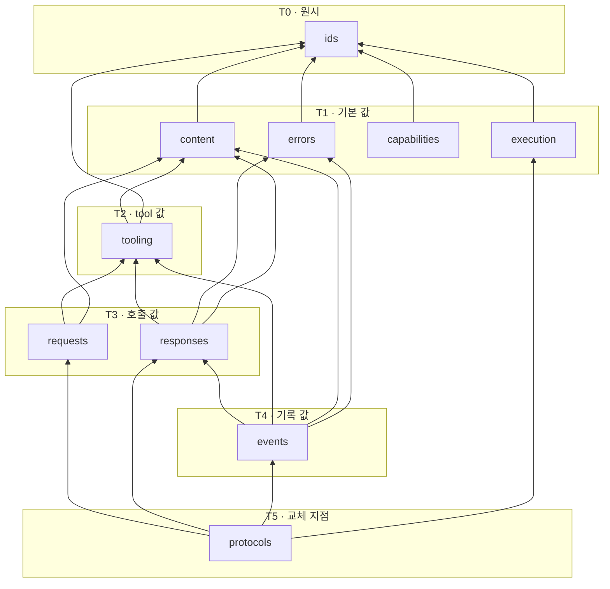

# core package 계약 경계 — 파일·타입 범주와 공개 표면

KAG-DEC-001이 `core`에 배정한 “공통 계약과 교체 지점 protocol”이라는 단일 책임을 **어떤 파일에 어떤 종류의 타입으로 나눠 담을지**, 그리고 그 중 무엇을 바깥에 공개할지 제안한다. 파일 후보 트리, 파일별 역할, 타입 범주, module 사이 방향, 공개 재수출 범위, 호환성 원칙까지가 대상이고 **exact signature·필드·enum 값·JSON schema는 대상이 아니다.**

> baseline의 날것 입력을 spec으로 내리기 전에 적용 방향을 정하는 문서.
> 기능 계약 상세는 `20-spec/`, 실제 작업 순서는 `30-work/`에 둔다.

> **상태 `proposed` — 사용자 리뷰 대기.** 이 문서의 §Decision 이하는 전부 **권고안**이며 아직 이 제품의 결정이 아니다. 사용자가 확정하기 전에는 어떤 파일도 만들지 않는다. KAG-BL-001·KAG-DEC-001·KAG-DEC-002의 `accepted`는 이 문서가 바꾸지 않는다 — 이 문서는 그 위에 쌓일 뿐 되돌리지 않는다.

## Context

- 관련 baseline: [[baseline-001-provider-neutral-llm-runtime|KAG-BL-001]]
- 선행 결정: [[decision-001-runtime-directory-boundaries|KAG-DEC-001]] (accepted), [[decision-002-turn-runtime-flow|KAG-DEC-002]] (accepted)
- 문제/기회
  - KAG-DEC-001은 `core`를 “provider-neutral 요청·응답·content block·tool call·tool result·event·오류의 **계약**과 교체 지점의 protocol 정의”가 사는 자리로 확정하고, L0에 두어 **다른 어떤 package도 import하지 않는다**는 금지 의존을 걸었다. 그러나 “각 디렉터리 안의 파일 목록·클래스명·타입 정의”는 명시적으로 Out이었다.
  - KAG-DEC-002는 한 turn의 진행 phase 9 + 종료 state 4와 side effect 순서를 확정했다. 이제 각 phase가 **무엇을 주고받는지**가 고정됐으므로, 그 “무엇”이 어느 파일에 사는지 결정할 근거가 생겼다.
  - 지금 상태로 첫 파일을 만들면 두 가지가 즉시 문제가 된다. (1) `core`가 한 파일이든 열 파일이든 규칙이 없어 사람마다 다르게 놓는다. (2) `core` 안에서 module끼리 서로를 import하다 순환이 생기면, L0을 순환 없는 바닥으로 두려던 KAG-DEC-001의 의도가 파일 단위에서 무너진다. package 사이 방향은 정해졌지만 **package 안쪽 방향은 아무도 정하지 않았다.**
  - 공개 표면도 비어 있다. KAG-DEC-001 OQ-2(`__init__.py`가 무엇을 재수출하고 어디까지 안정 API로 약속할지)와 KAG-DEC-002 OQ-9(그 질문을 어느 decision에서 다룰지)가 서로를 가리킨 채 남아 있다.
- 결정이 필요한 이유
  - `core`는 의존 그래프의 바닥이라 **여기서 틀리면 전 package가 같이 틀린다.** 위 계층은 나중에 고쳐도 core만 열면 되지만, core를 고치면 전부 열린다. 그래서 코드보다 문서가 먼저 와야 하는 자리 중 가장 앞이다.
  - 사용자가 디렉터리 상세를 하나씩 보고 확정하기로 했고, 이번 대상은 `core/` 하나다. 나머지 7개 package의 내부 구조는 이 문서가 정하지 않는다.

## Options

**초기 학습 비용, 순환 의존 방지, 검색성(무엇이 어디 있는지 찾는 비용), 공개 표면 통제, 확장 비용** 다섯 축으로 비교했다.

| Option | Description | Pros | Cons | Notes |
|---|---|---|---|---|
| A. 단일 `contracts.py` 중심 | `core/`에 `__init__.py`와 `contracts.py`(+ 필요 시 `errors.py`) 정도만 두고 요청·응답·content·tool·event·protocol을 한 파일에 모은다 | 순환 의존이 **구조적으로 불가능**하다 — 파일이 하나면 파일 간 순환이 없다. 첫 slice까지 가장 빠르고, 계약 전체를 위에서 아래로 한 번에 읽을 수 있어 초기 학습 비용이 가장 낮다. import 경로가 하나라 공개 표면 고민이 늦춰진다 | 파일 하나가 곧 수백 줄이 되고, “tool result가 어디 있나”를 파일 안 검색으로만 찾는다. data 계약과 행동 protocol이 한 파일에 섞여 **“이건 값인가 교체 지점인가”가 시각적으로 구분되지 않는다.** 변경 diff가 항상 같은 파일에 몰려 무엇이 바뀌었는지 리뷰에서 흐려진다. 쪼갤 시점을 판단할 신호가 없어 쪼개기가 늦어진다 | 비권고 |
| B. 계약 관심사별 평면 module 분리 | `core/` 아래에 중첩 없이 관심사별 module을 두고(`content` · `tooling` · `events` · `errors` · `protocols` 등), module 사이 import 방향을 **총순서로 고정**한다 | 파일명이 곧 색인이라 검색성이 가장 좋다. data 계약 module과 protocol module이 파일로 갈려 §4의 구분이 눈에 보인다. 총순서를 걸면 순환이 규칙 위반으로 즉시 드러난다(§3.2). 계층이 한 겹이라 왕복 비용이 없다. 파일 하나가 늘어나는 비용이 작아 확장이 싸다 | module 수가 처음부터 10개 안팎이라 A보다 무겁고, 일부는 처음에 몇 줄짜리로 비어 보인다. 총순서를 사람이 지켜야 한다(언어가 강제하지 않는다). 어느 관심사가 어느 module인지 경계가 애매한 타입이 생기면 배치 논쟁이 난다 | **권고** |
| C. 도메인별 중첩 package + `ports/` 분리 | `core/messaging/` · `core/tooling/` · `core/session/` · `core/ports/`처럼 도메인별 하위 package로 나누고 protocol을 `ports/`에 모은다 | 도메인 응집도가 가장 높고, 도메인별로 파일이 늘어도 자기 폴더 안에서 큰다. protocol이 한 폴더에 모여 교체 지점 목록이 한눈에 보인다. 큰 계약 집합에서 가장 오래 버틴다 | **KAG-DEC-001이 C(ports/adapters)를 기각한 이유가 여기서 그대로 재발한다** — 계약 하나를 이해하려고 폴더를 왕복하고, `ports`라는 아키텍처 어휘가 이 제품의 도메인 어휘와 어긋난다. 하위 package 사이 순환은 평면보다 발견이 **더** 어렵다(`__init__.py`가 방향을 가린다). 현재 교체 지점이 1~3개인데 그것만을 위한 폴더를 세우면 추상화가 구현보다 많아진다 | 비권고 |

핵심 trade-off를 숨기지 않는다: **A가 순환 방지에서는 B보다 강하다.** 파일이 하나면 파일 간 순환은 정의상 없다. B는 순환 가능성을 다시 들여오고, 그것을 §3.2의 총순서라는 **규약**으로 막는다 — 언어가 아니라 사람이 지킨다. B를 권고하는 이유는 순환 방지가 유일한 축이 아니기 때문이다. core는 “거의 안 바뀌지만 바뀌면 전부에 파급되는” 코드라서, 변경 diff가 어느 관심사에 떨어졌는지 파일 경로로 읽히는 쪽이 리뷰 비용을 크게 줄인다. 그리고 §4의 “값 계약 대 행동 protocol” 구분은 B에서 파일 경계와 일치시킬 수 있지만 A에서는 주석과 규율로만 존재한다.

C를 비권고하는 이유는 C가 나쁜 구조라서가 아니라 **지금 규모에서 이르기 때문**이다. B에서 한 module이 커지면 그 module 하나만 하위 package로 승격하면 되고, 그 경로는 열려 있다(§6).

## Decision

> 아래는 전부 **권고안**이다. 사용자 확정 전에는 결정이 아니다.

- 권고: **Option B — 계약 관심사별 평면 module 분리 + module 간 총순서 고정.**
- 비권고: Option A(단일 `contracts.py`), Option C(도메인별 중첩 package + `ports/`). C는 §6의 승격 경로로 남긴다.
- 미결로 남김: 재수출 이름의 안정 API 약속 수준, package-root `kknaks_agents/__init__.py`의 표면, turn 결과 타입의 소유 package, 근거(evidence) 계약 (→ §Open Questions).

이하 §1~§7이 Option B의 권고 내용이다.

### 1. core가 소유하는 계약 범주와, 소유하지 않는 것

먼저 범주를 못박는다. 파일 배치는 그 다음이다.

| # | 계약 범주 | 이 범주가 필요한 근거 | core가 소유하는 이유 |
|---|---|---|---|
| K1 | **message와 content block** | KAG-DEC-002 §2 — `context`가 조립하고 `providers`가 복원하며 `sessions`가 기록한다 | 세 package가 같은 값을 주고받는데 셋은 서로를 import할 수 없다(KAG-DEC-001 §4 “L2 형제끼리 부르지 않는다”) |
| K2 | **공통 요청** | KAG-DEC-002 §4 3단계 — 기록된 event의 읽기 전용 투영이 provider에게 넘어간다 | `context`가 만들고 `providers`가 읽는다. 형제 간 직접 참조 금지 |
| K3 | **공통 응답**(usage와 provider 원문의 불투명 보관 포함) | KAG-DEC-002 §4 4~5단계, §4.1 판정 | `providers`가 만들고 `runtime`이 판정한다. `runtime`은 `providers`를 import할 수 없다 |
| K4 | **tool call과 tool result** | KAG-DEC-002 §4 6~8단계, §4.2 직렬 실행의 1:1 짝 | `providers`가 응답에서 복원하고 `tools`가 결과를 만들며 `runtime`이 짝을 판정하고 `sessions`가 기록한다 — 4개 package 공유 |
| K5 | **model에 공개되는 tool 정의** | KAG-DEC-002 §2 — 요청 조립에 “허용 tool 공개 정의”가 실린다 | `tools`가 만들고 `context`가 싣고 `providers`가 변환한다. **handler·권한·secret이 빠진 공개 표면만**이 여기 산다(KAG-BL-001) |
| K6 | **session event payload** | KAG-DEC-002 §4의 12단계가 전부 event append 순서로 정의돼 있다 | `runtime`이 기록을 결정하고 `sessions`가 저장하며 `context`가 읽는다 |
| K7 | **오류·거부 사유 표현** | KAG-DEC-002 §5 — recoverable(tool 검증·정책 거부, handler 오류)과 terminal(provider 오류, malformed, 내부 오류)의 구분이 계약이다 | 만드는 쪽(`tools`·`providers`)과 판정하는 쪽(`runtime`)이 다르고 서로를 import할 수 없다 |
| K8 | **실행 context·실행 한도·registry revision 등 turn 고정 값의 provider-neutral 부분** | KAG-DEC-002 §3 snapshot 5항목 | L4 애플리케이션이 넘기고 `runtime`이 고정하며 `tools`가 주입받아 실행한다 |
| K9 | **provider capability 선언** | KAG-DEC-002 §3 — snapshot이 “주입된 대상 하나와 그 capability 선언”을 고정한다 | `providers`가 선언하고 `runtime`이 읽는다. `runtime` ↛ `providers` |
| K10 | **교체 지점 protocol** | KAG-DEC-001 §4 — provider는 “core의 protocol로만 만난다” | 의존 역전이 성립하는 유일한 자리 (§4) |

**core가 소유하지 않는 것.** 아래가 `core/` 아래에 나타나면 그 자체가 위반이다.

| 두지 않는 것 | 사는 곳 | 근거 |
|---|---|---|
| provider 제품명·모델명·실행 파일명·CLI 옵션 문자열, provider별 요청/응답 JSON 필드 | `providers` | KAG-DEC-001 §5 (grep으로 잡히면 위반) |
| provider의 thread·resume·내장 tool·내장 skill·내장 compaction 개념 타입 | (어디에도 두지 않음) | KAG-BL-001 경계 한 줄, KAG-DEC-002 §6 완전 제외 |
| subprocess 실행, timeout 집행, 환경변수 allowlist, 출력 상한 | `process` | KAG-DEC-001 §2 |
| tool registry, executor, schema validator 선택과 실행, 정책 판정 구현 | `tools` | KAG-DEC-001 §2 |
| session store 구현, 저장 포맷, 직렬화·역직렬화 코드 | `sessions` | KAG-DEC-001 §2 |
| context builder, compaction 알고리즘, token 계산 | `context` | KAG-DEC-001 §2 |
| skill loader·selector·prompt 투영 | `skills` | KAG-DEC-001 §2 |
| turn loop 실행, phase 전이 코드, 한도 집행, 종료 판정 로직 | `runtime` | KAG-DEC-002 §1·§4 |
| 조립, factory, DI 컨테이너, 기본 구현 선택 | L4 애플리케이션 | KAG-DEC-001 §4 “조립은 여기서만” |
| KAG-DEC-002의 **진행 phase 9개 이름**을 담은 enum/class | (승격하지 않음) | KAG-DEC-002 §0 — 개념 라벨이며 코드 식별자로 올리지 않는다 |

마지막 줄에 한 가지 구분을 덧붙인다. **진행 phase는 runtime 내부의 단계**라서 core 타입으로 만들지 않는다. 반면 **종료 원인은 애플리케이션에 반환되는 값**이므로(KAG-DEC-002 §5 “모든 종료는 원인이 구분된 결과로 반환된다”) 계약이 필요하다. 다만 그 값 집합의 이름과 소유 package는 이 문서에서 확정하지 않는다(→ OQ-3).

### 2. 파일 후보 트리

```text
src/kknaks_agents/core/
├── __init__.py       # 공개 재수출 표면 (§5)
├── ids.py            # 식별자와 불투명 값의 원시 타입
├── errors.py         # 오류·거부 사유의 표현
├── content.py        # message와 content block
├── capabilities.py   # provider capability 선언
├── execution.py      # 실행 context·실행 한도·registry revision 등 turn 고정 값
├── tooling.py        # 공개 tool 정의 · tool call · tool result
├── requests.py       # 공통 요청
├── responses.py      # 공통 응답 (usage · provider 원문의 불투명 보관 포함)
├── events.py         # session event payload
└── protocols.py      # 교체 지점 protocol
```

이름에 대한 판단 두 가지.

- **`tooling.py`이지 `tools.py`가 아니다.** 형제 package `kknaks_agents/tools/`와 basename이 겹치면 `from kknaks_agents.core import tools`와 `from kknaks_agents import tools`가 읽는 사람의 머릿속에서 충돌한다. 기술적 충돌은 없지만 혼동 비용이 실재한다(→ OQ-5).
- **`models.py`를 쓰지 않는다.** LLM의 “model”과 데이터 “model”이 같은 단어라, 이 제품에서만큼은 관심사 이름(`content`·`requests`·`responses`)으로 부르는 편이 오해가 적다.

### 3. 파일별 역할과 module 간 방향

#### 3.1 파일별 역할 · 타입 범주 · producer/consumer

“대표 타입/Protocol 범주”는 **어떤 종류의 것이 사는가**이지 확정 클래스명이 아니다.

| 파일 | 단일 역할 | 대표 타입/Protocol 범주 | 주로 만드는 쪽 (producer) | 주로 쓰는 쪽 (consumer) |
|---|---|---|---|---|
| `ids.py` | 계약 전체가 공유하는 식별자와 불투명 값의 원시 타입 | session·turn·step·tool call 식별자, provider 원문을 담는 불투명 값 | `runtime` (발급), `providers` (원문 포장) | 전 package |
| `errors.py` | 오류와 거부 사유를 **값으로** 표현 (K7) | tool 검증·정책 거부 사유, tool handler 실패, provider 호출 실패, 응답 판정 불가, 내부 불변식 위반. model-safe 표현과 진단 전용 표현의 구분 | `tools`, `providers`, `runtime` | `runtime` (terminal/recoverable 판정), `sessions` (기록), L4 (반환값 해석) |
| `content.py` | message와 content block (K1) | 역할 구분된 message, 텍스트/구조화 content block, 신뢰 등급(외부 문서·tool 결과는 untrusted) 표시 | `context` (조립), `providers` (복원) | `providers`, `runtime`, `sessions`, `context` |
| `capabilities.py` | provider가 자기 능력을 provider-neutral하게 선언 (K9) | native tool call 지원 여부, 지원하는 content block 종류, 구조화 출력 지원 여부 같은 **능력 축**. provider 이름은 들어가지 않는다 | `providers` | `runtime` (snapshot 고정과 fail-closed 판정) |
| `execution.py` | turn 시작 시 고정되는 값 중 provider-neutral 부분 (K8) | 사용자 실행 context(누구의 권한으로), 실행 한도(step·시간·취소 상태), tool registry revision, 허용 tool 식별 목록 | L4 애플리케이션 (전달), `runtime` (고정) | `tools` (주입받아 실행), `runtime` (판정) |
| `tooling.py` | tool을 둘러싼 세 가지 값 (K4·K5) | ① model에 공개되는 tool 정의(이름·버전·설명·입력 schema — handler와 권한은 없다) ② tool call ③ model-safe tool result | `tools` (정의·결과), `providers` (call 복원) | `context` (요청에 싣기), `runtime` (짝 판정), `sessions` (기록) |
| `requests.py` | 한 번의 model 호출에 넘길 재료의 최종 형태 (K2) | 공통 요청, 생성 옵션 | `context` | `providers` |
| `responses.py` | 한 번의 model 호출에서 돌아온 것의 공통 형태 (K3) | 공통 응답, 사용량 계측, provider 원문의 불투명 보관 | `providers` | `runtime` (§4.1 판정), `sessions` (기록) |
| `events.py` | session에 append되는 event의 payload 계약 (K6) | turn 시작·사용자 입력·model 응답·tool 검증(거부 포함)·tool 결과(실패 포함)·final·종료 event의 payload 범주. **model 응답 event는 `responses.py`의 공통 응답을 참조하며 같은 형태를 다시 정의하지 않는다** | `runtime` (기록 시점과 내용 결정) | `sessions` (저장·조회), `context` (읽기 전용 투영), L4 (관측) |
| `protocols.py` | 교체 지점의 **행동** 계약 (K10, §4) | model 호출 경계(필수), tool handler 경계(권고). 그 이상은 §4.1의 기준을 통과하지 못한다 | 구현: `providers`, L4 호스트 | `runtime`, `tools` |
| `__init__.py` | 공개 재수출 표면 (§5) | — (정의를 두지 않는다) | — | L4 애플리케이션 |

세 줄 덧붙인다.

- **model 응답 event는 공통 응답을 그대로 참조한다.** KAG-DEC-002 §4의 I1(기록 먼저, 사용 나중)은 “model 응답을 기록한 뒤 tool을 실행한다”를 요구하고, §4 5단계는 그 기록이 **손실 없어야** 성립한다. `events.py`가 저장용 응답 형태를 따로 정의하면 두 형태가 갈라지는 순간 “기록된 것”과 “판정에 쓴 것”이 달라진다. 그래서 event는 응답을 다시 그리지 않고 참조하며, 그 결과 `events`는 `responses`보다 위 tier에 놓인다(§3.2).
- **`responses.py`의 “provider 원문의 불투명 보관”은 진단·관측 전용이다.** KAG-DEC-001 §5 그대로 — 상태 전이나 정책 판단이 그 값의 내부 구조를 읽으면 위반이다. 그래서 원시 타입은 `ids.py`에 두고 “구조를 읽지 않는 값”이라는 성격을 이름으로 드러낸다.
- **`tooling.py`의 tool 정의에는 handler가 없다.** handler는 실행 주체이고 공개 정의는 model에 보이는 표면이다. 둘을 한 타입으로 묶으면 model에 보내면 안 되는 것이 실수로 실린다(KAG-BL-001 보안 모델).

#### 3.2 module 간 방향 — 6단 총순서

KAG-DEC-001이 package 사이 방향을 정했듯, `core/` 안에서도 방향을 정한다. **화살표는 항상 아래에서 위로만 간다. 같은 tier끼리는 서로 import하지 않는다.**



| Tier | module | 이 tier에 있는 이유 |
|---|---|---|
| T0 | `ids` | 아무것도 참조하지 않는다. 모든 tier가 참조한다 |
| T1 | `errors` · `content` · `capabilities` · `execution` | `ids`만 참조한다. 서로를 참조하지 않는다 |
| T2 | `tooling` | `content`(결과 표현)와 `ids`(call 식별자)를 참조한다 |
| T3 | `requests` · `responses` | 한 번의 model 호출에 들어가고 나오는 값. tool 값과 content를 조합한다. 둘은 서로를 참조하지 않는다 |
| T4 | `events` | 기록되는 값. model 응답 event가 `responses`를 **참조**해야 하므로(§3.1) T3보다 위다 |
| T5 | `protocols` | 값 계약 전부를 참조한다. 아무도 이것을 참조하지 않는다 (core 안에서) |

`events`를 `requests`/`responses`와 같은 tier에 두는 배치도 검토했지만 채택하지 않는다. 같은 tier면 상호 참조가 금지되므로 event가 응답을 참조할 수 없고, 그러면 저장용 응답 형태를 `events.py`에 **중복 정의**하는 길밖에 남지 않는다. 중복은 KAG-DEC-002 I1이 요구하는 “손실 없는 기록”을 정면으로 위협하므로, 결합을 줄이려다 더 나쁜 것을 들이는 교환이 된다. 대신 방향을 한쪽으로만 고정한다 — **`events`는 `responses`를 알고, `responses`는 `events`를 모른다.**

이 배치의 효용 세 가지.

1. **순환이 “tier를 거스르는 import 한 줄”로 환원된다.** 순환 여부를 판단하려고 그래프를 그릴 필요 없이 tier 번호만 비교하면 된다. `core/`가 L0이라 여기 순환이 생기면 전 package가 같이 물린다 — 가장 싸게 막아야 하는 자리다.
2. **`protocols`가 꼭대기라서 “값은 행동을 모른다”가 구조로 표현된다.** data 계약이 protocol을 참조하는 순간 값과 행동이 얽히는데, tier가 그것을 금지한다.
3. **`requests`와 `responses`가 서로를 모르고, 기록은 한 방향으로만 붙는다.** 요청이 응답을 참조하거나 그 반대가 되면 한 번의 호출 계약이 스스로 순환한다 — 같은 tier 금지가 그것을 막는다. `events`는 그 위에서 `responses`를 단방향으로 참조하므로(바로 위 문단) 기록 계약이 호출 계약을 알지만 호출 계약은 저장을 모른다.

한계도 적는다: 이 총순서 역시 **사람이 지키는 규약**이다. Python은 tier를 모른다. KAG-DEC-001 OQ-5(import 경계 정적 검사)를 도입한다면 package 경계와 함께 이 tier도 같은 검사에 넣는 것이 자연스럽다.

### 4. 값 계약과 행동 Protocol의 경계

#### 4.1 판정 규칙

> **core에 protocol을 두는 기준은 하나다 — 그 계약의 소비자가 구현이 사는 package를 import할 수 없을 때만 둔다.**

의존 역전이 실제로 필요하지 않은데 protocol을 만들면, 구현이 하나뿐인 인터페이스가 늘어나면서 KAG-DEC-001이 Option C를 기각할 때 말한 “추상화가 구현보다 많아지는 과설계”가 core 안에서 재발한다.

| 후보 | 소비자 | 구현이 사는 곳 | 소비자가 구현 package를 import할 수 있나 | 판정 |
|---|---|---|---|---|
| model 호출 경계 (요청 1개 → 응답 1개) | `runtime` | `providers` | **✗ 금지** (KAG-DEC-001 §4) | **core 필수** — 이것 없이는 `runtime`이 provider를 부를 방법 자체가 없다 |
| tool handler 경계 | `tools` | L4 호스트 애플리케이션 | ✗ (라이브러리는 L4를 역참조하지 않는다) | **core 권고** — `tools`가 정의해도 성립하지만, 호스트가 tool 하나 쓰려고 실행 package를 import해야 하는 결합이 생긴다 |
| session event 저장·조회 경계 | `runtime`·`sessions` | `sessions` + 향후 외부 저장소 | **○ 가능** — KAG-DEC-001 §4가 `runtime → sessions`를 허용한다 | **core에 두지 않는다** — 기준을 통과하지 못한다. 소비자가 구현 package를 직접 import할 수 있으므로 의존 역전이 필요 없다. store 교체(memory ↔ 영속)는 `sessions` 안에서 해결되는 문제다 (→ OQ-2) |
| provider capability 선언 | `runtime` | `providers` | ✗ | **core에 두되 protocol이 아니라 값**(K9) — 능력은 질의하는 행동이 아니라 선언된 사실이다 |
| context 구성 경계 | `runtime` | `context` | ○ 허용 | **두지 않는다** — 역전이 필요 없다 |
| skill 선택 경계 | `runtime` | `skills` | ○ 허용 | **두지 않는다** (이번 범위 밖이기도 하다 — KAG-DEC-002 §6) |
| tool 정책·승인 게이트 경계 | `tools` | L4 | ✗ | **이번 문서에서 정하지 않는다** — `tools` 상세 decision의 몫 |
| subprocess 실행 경계 | `providers` | `process` | ○ 허용 (§4 예외 방향) | **두지 않는다** |
| 시계·취소 신호원 | `runtime` | `runtime`·L4 | ○ | **두지 않는다** — 취소는 주입되는 신호가 아니라 snapshot이 들고 있는 상태다 (KAG-DEC-002 §3) |

정리하면 `protocols.py`에 들어갈 후보는 **필수 1개(model 호출 경계) + 권고 1개(tool handler 경계) = 최대 2개**이고, 그 이상은 지금 근거가 없다. 둘 중 필수는 하나뿐이라는 점을 강조한다 — tool handler 경계는 “두는 편이 낫다”이지 “두어야 한다”가 아니다.

KAG-DEC-001 Rationale이 교체 지점을 “provider와 session store 둘”로 센 것과 이 결과가 어긋나 보일 수 있어 이유를 적는다. **교체 가능하다는 것과 core protocol이 필요하다는 것은 다른 문제다.** session store는 여전히 교체 지점이지만, 그 교체를 성립시키는 데 core의 도움이 필요 없다 — `runtime`이 `sessions`를 직접 import할 수 있으므로 경계를 `sessions` 안에 두면 된다. core에 protocol을 하나 더 얹으면 교체 가능성은 그대로인 채 L0의 표면만 넓어진다.

#### 4.2 protocol이 아닌 것을 protocol로 만들지 않기

`core/protocols.py`에 두지 **않는** 것을 명시한다.

- 기본 구현, 추상 기반 클래스가 제공하는 공통 로직, mixin
- registry·executor·store·builder·selector 같은 **역할 이름을 가진 서비스 클래스** — 이름이 “-er/-or”로 끝나면 core가 아닐 가능성이 높다
- 편의 함수, factory, 조립 helper, 기본값 결정 로직
- 검증 함수 자체 — 무엇이 유효한지는 계약이지만 **검증을 수행하는 코드**는 `tools`·`runtime`의 것이다
- 직렬화·역직렬화 구현 — 저장 포맷은 `sessions`, wire 형태는 `providers`

즉 `core`는 **읽을 수는 있어도 실행할 것이 거의 없는 package**여야 한다. core에 테스트할 “동작”이 늘어나기 시작하면 경계가 새고 있다는 신호다.

#### 4.3 값 계약 쪽 원칙

- **불변으로 둔다.** turn 도중 값이 바뀌면 KAG-DEC-002 §3의 snapshot 불변 전제가 파일 단위에서 깨진다.
- **값이 스스로 정책을 판단하지 않는다.** “이 tool call이 허용되는가”는 값의 method가 아니라 `tools`의 판정이다. 값에 판정 method를 붙이는 순간 실행 로직이 core로 새어 들어온다.
- **provider 원문은 구조를 읽지 않는 불투명 값으로만 보관한다** (§3.1).

### 5. 공개 표면 — `core/__init__.py`와 그 바깥

#### 5.1 재수출 범위 선택지

| 안 | 내용 | Pros | Cons |
|---|---|---|---|
| S1. 전면 재수출 | 모든 공개 타입을 `core/__init__.py`가 재수출하고, 내부 module 직접 import를 라이브러리 안팎 모두 금지 | import 경로가 하나라 사용자가 외울 것이 없다. 내부 재배치가 사용자에게 안 보인다 | 라이브러리 내부까지 `__init__`을 거치면 §3.2의 tier가 import 경로에서 사라져 총순서 위반이 눈에 안 띈다. `__init__`이 전부를 끌어와 부분 사용이 불가능해진다 |
| S2. 재수출 없음 | `__init__.py`를 비우고 언제나 module 경로로 import | tier가 모든 import 줄에 드러난다. 안정 API를 약속하지 않으므로 재배치가 자유롭다 | 호스트가 tool 하나 정의하려고 여러 module 경로를 외워야 한다. “무엇이 공개 표면인가”라는 질문에 답이 없다 |
| S3. 선별 재수출 + 내부는 module 경로 | `__init__.py`는 **호스트 애플리케이션이 실제로 필요로 하는 것만** 재수출하고, 라이브러리 내부(L1~L3)는 항상 module 경로로 import | 공개 표면이 “호스트가 쓰는 것”으로 정의돼 목록 자체가 문서가 된다. 내부 import에는 tier가 그대로 보인다. 재수출되지 않은 것은 자연히 내부 취급 | 두 규칙(바깥/안)을 사람이 구분해 지켜야 한다. 무엇을 재수출할지 판단이 필요하고, 그 목록이 곧 약속처럼 읽힐 위험이 있다 |

**S3을 권고한다.** 근거는 공개 표면의 정의를 “core에 있는 것 전부”가 아니라 **“호스트가 tool을 정의하고 turn 입력을 넘기고 결과와 오류를 해석하는 데 필요한 것”**으로 두면, 목록이 커지는 것 자체가 “호스트에게 너무 많은 것을 요구하고 있다”는 신호가 되기 때문이다. KAG-BL-001의 목적(“provider를 바꿔도 사용자 코드가 그대로”)은 이 목록이 작고 안정적일 때만 관찰 가능하다.

재수출 후보 범주(이름이 아니라 범주다): tool 공개 정의 · tool 결과 · 실행 context · 실행 한도 · model-safe 오류 표현 · turn 입력에 쓰는 content. 재수출하지 **않을** 후보: 공통 요청/응답, event payload, capability 선언, 원시 식별자 — 이들은 라이브러리 내부와 provider 구현자의 관심사다. 다만 provider나 store를 **새로 구현하려는 사람**에게는 이것들이 필요하므로, “호스트용 표면”과 “확장 구현자용 표면”을 나눌지가 미결이다(→ OQ-1).

#### 5.2 KAG-DEC-001 OQ-2의 분리

KAG-DEC-001 OQ-2는 “`kknaks_agents/__init__.py`가 무엇을 재수출하고 그 표면을 어디까지 안정 API로 약속할지”였다. **이 문서는 그 질문을 전부 해결하지 않는다.** 셋으로 쪼개 하나만 다룬다.

| 조각 | 이 문서에서 | 이유 |
|---|---|---|
| (a) `core/__init__.py`가 무엇을 재수출하는가 | **§5.1에서 권고** (S3) | core 상세 결정의 일부다 |
| (b) package-root `kknaks_agents/__init__.py`가 무엇을 재수출하는가 | **미결로 남긴다** (→ OQ-4) | root 표면에는 turn 진입점과 `tools`·`sessions`의 표면이 함께 올라간다. 그 두 package의 상세가 아직 없는데 root를 정하면 나중에 뒤집힌다 |
| (c) 어디까지를 안정 API로 **약속**하는가 | **미결로 남긴다** (→ OQ-1) | 약속은 배포 시점의 판단이고 KAG-DEC-001 OQ-1(배포명)과 묶여 있다 |

KAG-DEC-002 OQ-9(“OQ-2와 turn 진입점을 어느 decision에서 함께 다룰지”)에 대한 답도 여기서 제안한다: **(a)는 이 문서에서, (b)와 turn 진입점 형태는 `runtime` 상세 decision에서 함께** 다룬다. turn 진입점의 인자와 반환은 core 계약이 아니라 `runtime`의 공개 표면이기 때문이다.

### 6. 호환성과 versioning — 원칙 수준

확정 대상은 “원칙”이고, 버전 표기법·deprecation 기간·도구는 배포 시점 결정이다(→ OQ-1).

| # | 원칙 | 근거 |
|---|---|---|
| V1 | **core 계약 변경은 가장 비싼 변경으로 취급한다.** L0이라 전 package와 호스트 코드에 동시에 파급된다. 다른 package에서 해결 가능한 문제를 core 변경으로 풀지 않는다 | KAG-DEC-001 §4 의존 방향 |
| V2 | **선택적 값의 추가만 비파괴적이다.** 기존 소비자가 모르고 지나쳐도 의미가 유지되는 선택적 값을 더하는 것은 호환 가능한 변경이다. 기존 값의 삭제·필수화·의미 변경은 파괴적 변경이다 | 계약 소비자가 4개 package + 호스트로 흩어져 있다 |
| V3 | **모르는 값을 조용히 무시하지 않는다.** 소비자가 처음 보는 event 종류·오류 사유·content block 종류를 만나면 “없음”으로 접지 말고 판정 불가로 다룬다 | KAG-DEC-002 §5 “동기화·조회 실패를 없음으로 해석하지 않는다”와 같은 방향 |
| V3′ | **새 판별값(discriminant) 추가는 V2의 “추가”가 아니다.** 새로운 event 종류·오류 사유·content block 종류를 더하면 V3에 따라 기존 소비자가 그 값에서 **fail-closed로 멈춘다.** 즉 자동으로 비파괴적이지 않다. 버전 또는 capability 협의로 “이 소비자가 이 판별값을 안다”가 확인되지 않는 한 **파괴적 변경으로 취급한다** | V2와 V3를 동시에 지키려면 이 구분이 필요하다. 이것을 적지 않으면 “추가는 열려 있다”를 근거로 새 event 종류를 넣고, V3 때문에 기존 소비자가 멈추는 모순이 생긴다 |
| V4 | **provider 원문은 계약이 아니다.** 불투명 값의 내부 구조에 아무도 의존하지 않으므로, provider 쪽 변화가 core 버전을 흔들지 않는다 | KAG-DEC-001 §5 |
| V5 | **재수출된 이름만 안정 약속의 후보다.** module 경로 직접 import는 내부 취급이고, 재배치로 깨져도 파괴적 변경으로 세지 않는다 | §5.1 S3 |
| V6 | **capability 불일치는 fail-closed다.** 요청이 선언된 capability를 넘으면 조용히 낮춰 실행하지 않고 실패로 끝낸다 | KAG-BL-001 보안 모델, KAG-DEC-002 §5 |

### 7. KAG-DEC-002 phase ↔ core 계약 매핑 (누락·중복 검증)

각 진행 phase가 요구하는 계약이 §2의 파일로 전부 덮이는지, 같은 것이 두 곳에 정의되지 않는지 확인한다. **phase 이름은 KAG-DEC-002 §0의 개념 라벨이며 여기서도 코드 식별자로 승격하지 않는다.**

| DEC-002 진행 phase | 이 phase가 다루는 계약 | 담당 파일 | 비고 |
|---|---|---|---|
| 입력수신 | 사용자 입력 content, 허용 tool 식별, 실행 context, 실행 한도 | `content` · `tooling` · `execution` | 애플리케이션이 넘기는 값이므로 §5.1 재수출 후보와 겹친다 |
| turn고정 | provider capability 선언, registry revision, 허용 tool 목록, 실행 context, 한도 | `capabilities` · `execution` | snapshot **값**은 core, 고정하는 **행위**는 `runtime` |
| 입력기록 | 사용자 입력 event payload | `events` | |
| 진행판정 | 한도 값, 취소 상태, 짝 판정용 call/result 식별자, 불변식 위반 오류 | `execution` · `ids` · `tooling` · `errors` | **판정 로직은 core에 없다.** core는 판정에 쓰이는 값만 제공 |
| context구성 | 공통 요청, message/content block, 공개 tool 정의 | `requests` · `content` · `tooling` | 조립 알고리즘은 `context` |
| provider호출 | model 호출 경계, 공통 요청, 공통 응답 | `protocols` · `requests` · `responses` | §4.1의 유일한 필수 protocol |
| 응답판정 | 공통 응답, tool call, 판정 불가 오류 | `responses` · `tooling` · `errors` | 판정 규칙(§4.1 of DEC-002)은 `runtime` |
| tool단계 | tool call, tool result, 실행 context, handler 경계, 거부·실패 사유, 검증/결과 event | `tooling` · `execution` · `protocols` · `errors` · `events` | 거부도 결과도 **기록되는 값**이라 `events`가 함께 필요 |
| final판정 | 응답 content, 검증 실패 오류, final event | `content` · `errors` · `events` | 검증 기준 자체는 KAG-DEC-002 OQ-5로 미결 |
| (종료 state 4종) | 종료 원인 값 | `errors` 일부 + 미결 | 정상 완료·한도·취소는 오류가 아니다 → OQ-3 |

**중복 점검 4건.**

- **model 응답 형태가 `responses`(판정용)와 `events`(기록용) 양쪽에 필요하다** → 정의는 `responses.py` 한 곳이고 `events.py`는 참조한다(§3.1·§3.2). 저장용 형태를 따로 그리면 KAG-DEC-002 I1의 “손실 없는 기록”이 두 형태의 차이만큼 무너진다.
- content block이 요청·응답·event 세 곳에 등장한다 → 정의는 `content.py` 한 곳이고 나머지는 참조만 한다. `events.py`가 자체 message 표현을 갖지 않는다.
- tool call 식별자가 `tooling`과 `events` 양쪽에 필요하다 → 원시 타입은 `ids.py` 한 곳.
- 실행 한도가 turn 고정과 진행 판정 양쪽에 등장한다 → 값은 `execution.py`, 소진 여부 계산은 `runtime`.

**누락 점검 5건.**

| 항목 | 상태 |
|---|---|
| 사용량(usage) 계측 | `responses.py`의 선택 값으로 덮인다. token budget 기반 판단은 KAG-DEC-002 §6 추후 확장 |
| 근거(evidence) ID와 출처 위치 | KAG-BL-001의 첫 사례 요구지만 final 검증 기준이 KAG-DEC-002 OQ-5로 미결이라, 지금 core 계약으로 올리지 않는다 (→ OQ-6) |
| 취소 신호의 tool handler 전파 | KAG-DEC-002 OQ-3 미결. core는 “취소 상태”라는 값만 두고 전파 방식을 정하지 않는다 |
| snapshot을 event로 기록할지 | KAG-DEC-002 OQ-7 미결. 기록한다면 `events.py`에 payload 범주가 하나 늘어난다 |
| turn 결과(종료 원인 + 최종 산출) 타입 | 소유 package 미결 (→ OQ-3) |

누락이 남아 있다는 사실 자체는 문제가 아니다. 다섯 건 모두 **선행 decision의 미결에 물려 있어** 지금 core 계약으로 굳히면 근거 없이 먼저 확정하는 것이 된다.

## Rationale

- 판단 기준
  1. **의존 그래프의 바닥이 순환 없이 유지되는가.** core 안에서 순환이 생기면 KAG-DEC-001의 L0 전제가 파일 단위에서 무너진다.
  2. **값과 행동이 구분되는가.** 실행 로직이 core로 새는 것을 구조가 막는가.
  3. **찾는 비용.** “tool result 계약이 어디 있나”에 파일 경로로 답할 수 있는가.
  4. **공개 표면이 작고 관찰 가능한가.** provider 교체 시 호스트 코드가 안 바뀐다는 목표를 목록으로 검증할 수 있는가.
  5. **초기 학습 비용과 확장 비용.**
- 대안 대비 이유
  - A는 기준 1에서 가장 강하고 5의 앞쪽(초기)에서도 이기지만, 2와 3에서 약하다. 값과 protocol이 한 파일에 섞이면 §4의 “protocol은 역전이 필요할 때만”이라는 규칙을 지키고 있는지 파일을 열기 전에는 알 수 없다. core는 오래 사는 코드라 초기 이점보다 읽는 비용이 누적된다.
  - C는 기준 3의 큰 규모에서 강하지만 지금 규모에서 1이 **오히려 나빠진다** — 하위 package의 `__init__.py`가 실제 import 방향을 가려서 순환을 늦게 발견한다. 게다가 KAG-DEC-001이 같은 이유(도메인 어휘 불일치, 왕복 비용, 과설계)로 ports/adapters를 기각했는데 core 안에서 그것을 되살리면 문서와 코드가 다시 어긋난다.
  - B는 1을 §3.2의 tier 규약으로 보완하고 2·3·4를 파일 경계로 얻는다. 5의 확장 쪽도 싸다 — 필요해지면 module 하나만 하위 package로 승격하면 되고, 그때 옮기는 것은 tier가 같은 파일 하나다.
- 리스크
  - **tier 규약이 코드로 강제되지 않는다.** Python은 `core` 안의 순환 import를 런타임 오류로만 알려주고, 그것도 import 시점에 따라 숨을 수 있다. 완화: KAG-DEC-001 OQ-5의 정적 검사에 package 경계와 tier를 함께 넣는다.
  - **module 10개가 처음엔 비어 보인다.** `capabilities.py`는 초기에 몇 줄이고, `protocols.py`는 protocol 1~3개다. KAG-DEC-001이 package 8개에서 감수한 것과 같은 성격의 비용이며 같은 이유(이름이 먼저 있어야 코드가 제자리에 놓인다)로 감수한다. 다만 첫 vertical slice 뒤에도 계속 비어 있으면 합치는 것을 재검토한다.
  - **경계에 걸친 타입이 반드시 나온다.** 실행 context는 `execution`인가 `tooling`인가, 종료 원인은 `errors`인가 별도인가 같은 논쟁이 실제로 생긴다. 완화: §3.1의 producer/consumer 열을 배치 기준으로 쓴다 — **만드는 쪽과 쓰는 쪽이 같은 조합이면 같은 파일**이 기본이다. 그래도 애매하면 OQ로 올린다.
  - **재수출 목록이 암묵적 약속으로 읽힐 수 있다.** 안정성을 약속하지 않았는데 재수출됐다는 이유로 사용자가 안정적이라 기대한다. 완화: OQ-1이 풀리기 전까지는 “재수출 = 편의이지 약속 아님”을 코드 저장소 문서에 명시한다.
  - **이 문서가 core만 다루므로 형제 package와 어긋날 수 있다.** 예컨대 `tools` 상세 decision이 tool 정의 표면을 다르게 잡으면 `tooling.py`가 흔들린다. 완화: §3.1의 표를 그 decision들의 입력으로 넘기고, 어긋나면 core를 고치기 전에 이 문서를 먼저 갱신한다.

## Scope

- In
  - `core`가 소유하는 계약 범주 10종(K1~K10)과 소유하지 않는 것의 목록 (§1)
  - `core/` 파일 후보 트리 — module 10개 + `__init__.py` (§2)
  - 파일별 단일 역할, 대표 타입/Protocol 범주, producer/consumer (§3.1)
  - `core` 내부 module 간 6단 총순서와 같은 tier 상호 참조 금지, `events → responses` 단방향 참조 (§3.2)
  - 값 계약과 행동 protocol의 구분 규칙, protocol 후보 판정, core에 두지 않는 구현 종류 (§4)
  - `core/__init__.py` 재수출 범위의 선택지와 권고(S3), KAG-DEC-001 OQ-2의 3분할 (§5)
  - 호환성·versioning 원칙 7개 — V2(선택적 값 추가)와 V3′(새 판별값 추가)의 구분 포함 (§6)
  - KAG-DEC-002 진행 phase ↔ core 계약 매핑과 중복·누락 검증 (§7)
- Out
  - **exact method signature, dataclass 필드, enum 값, JSON schema, wire protocol** — 이 문서는 “어떤 종류의 것이 어느 파일에 사는가”까지만 정한다
  - `tools`·`providers`·`sessions`·`context`·`skills`·`process`·`runtime`의 내부 파일·클래스 구조 — 각각 별도 decision
  - turn 공개 진입점의 인자·반환·sync/async 형태 — `runtime` 상세 decision
  - package-root `kknaks_agents/__init__.py`의 공개 표면과 안정 API 약속 (→ OQ-1·OQ-4)
  - KAG-DEC-002의 진행 phase·종료 state 이름을 코드 식별자로 승격하는 일 — 하지 않는다
  - session event 종류의 확정 목록, event 저장 포맷, 직렬화 형태
  - JSON Schema validator 선택, Python 최소 버전, 의존성 목록
  - KAG-DEC-001의 디렉터리·의존 방향과 KAG-DEC-002의 phase 전이·불변식 변경 — 이 문서는 소비할 뿐 바꾸지 않는다
  - 실제 코드 저장소·파일 생성 (이 decision은 문서만 남긴다)
- 영향을 받는 spec 후보: 없음. 이 decision은 spec을 직접 만들지 않는다. `core` 상세가 확정된 뒤에도 형제 package 상세 decision이 남아 있고, 첫 spec은 그것들이 정리된 뒤에 연다. 미래 decision/spec ID를 미리 선점하지 않는다.

## Open Questions

| ID | Question | Owner | Next |
|---|---|---|---|
| OQ-1 | 재수출된 이름을 어디까지 **안정 API로 약속**할지, 그리고 버전 표기·deprecation 기간을 어떻게 둘지 | 사용자 | 첫 배포를 실제로 고려하는 시점. KAG-DEC-001 OQ-1(배포명)과 함께 판단. KAG-DEC-001 OQ-2의 (c) 조각 |
| OQ-2 | session event 저장 경계를 `sessions` 안에서 어떤 형태로 둘지(protocol을 두는가, 둔다면 어느 module인가) | planner | **`sessions` 상세 decision으로 넘긴다.** §4.1 기준이 core 후보에서 제외했으므로 core decision이 답할 질문이 아니다 |
| OQ-3 | turn 결과(종료 원인 + 최종 산출) 타입을 `core`가 소유할지 `runtime`이 소유할지. 종료 state 4종의 값 표현을 `errors`에 둘지 별도로 둘지 | planner | `runtime` 상세 decision. KAG-DEC-002 §5는 “원인이 구분된 결과를 반환한다”까지만 정했다 |
| OQ-4 | package-root `kknaks_agents/__init__.py`가 무엇을 재수출할지 | planner | `runtime`·`tools` 상세 decision 이후. KAG-DEC-001 OQ-2의 (b) 조각이고 KAG-DEC-002 OQ-9와 묶인다 |
| OQ-5 | `core/tooling.py`라는 이름이 형제 package `tools/`와 충분히 구분되는가, 아니면 다른 이름이 나은가 | 사용자 | 첫 파일 생성 직전. 취향과 가독성 판단이라 planner가 단독으로 정하지 않는다 |
| OQ-6 | 근거(evidence) ID·출처 위치를 core 계약으로 올릴지, 첫 사례 애플리케이션의 tool result 안에 둘지 | planner | KAG-DEC-002 OQ-5(final 검증 기준)가 풀린 뒤 |
| OQ-7 | `content.py`의 신뢰 등급(untrusted 표시)을 값에 붙일지, `context`가 투영 시점에 붙일지 | planner | `context` 상세 decision |
| OQ-8 | §3.2의 tier를 KAG-DEC-001 OQ-5의 정적 검사에 포함할지 | planner | 의존성 정책 decision |

## Resulting Spec

| Spec | Action | Notes |
|---|---|---|
| (없음) | - | 이 decision은 spec을 만들지 않는다. `core` 상세만 제안하며, 형제 package 상세가 정리된 뒤에 첫 spec을 연다. 미래 decision/spec ID를 미리 선점하지 않는다 |
