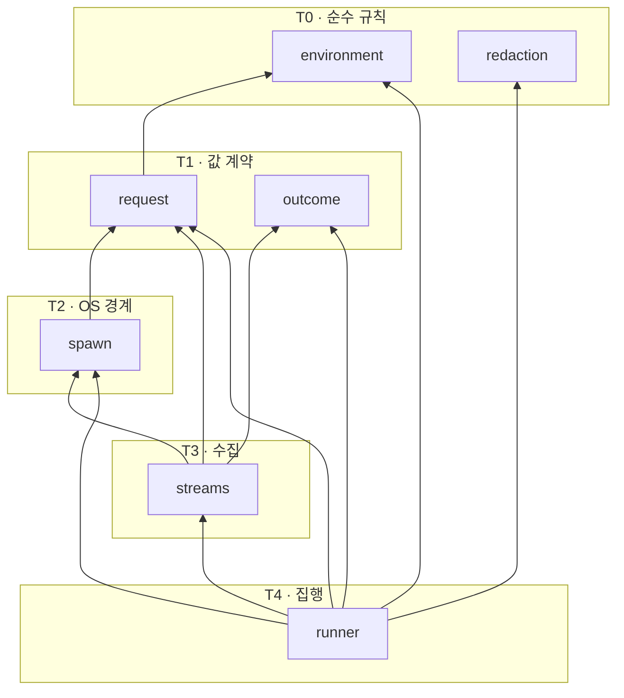
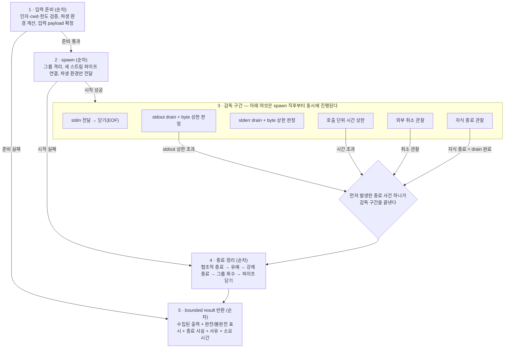
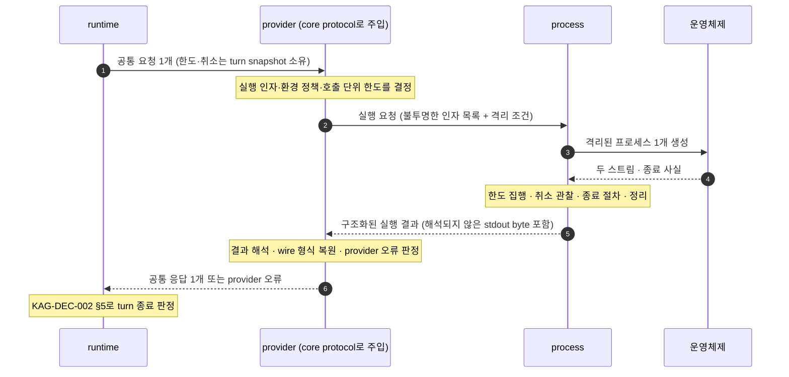

# process package 실행 격리 경계 — 파일·보안 불변식·실행 계약

KAG-DEC-001이 `process`에 배정한 “외부 프로세스 실행 격리”라는 단일 책임을 **어떤 파일에 어떤 종류의 것으로 나눠 담을지**, **한 번의 실행이 어떤 순서로 진행되고 무엇을 반드시 집행하는지**, 그리고 **그 결과와 실패를 누가 해석하는지** 제안한다. 파일 후보 트리, 파일별 역할과 타입 범주, 내부 import 방향, 최소 보안 경계 13항목의 판정, 실행 lifecycle과 fail-closed 원칙, 공개 표면과 테스트 seam까지가 대상이고 **exact signature·필드·예외명·sync/async 형태·OS별 구현 명령·라이브러리 선택은 대상이 아니다.**

> baseline의 날것 입력을 spec으로 내리기 전에 적용 방향을 정하는 문서.
> 기능 계약 상세는 `20-spec/`, 실제 작업 순서는 `30-work/`에 둔다.

> **상태 `proposed` — 사용자 리뷰 대기.** 이 문서의 §Decision 이하는 전부 **권고안**이며 아직 이 제품의 결정이 아니다. 사용자가 확정하기 전에는 어떤 파일도 만들지 않는다. KAG-BL-001·KAG-DEC-001·KAG-DEC-002의 `accepted`는 이 문서가 바꾸지 않는다 — 이 문서는 그 위에 쌓일 뿐 되돌리지 않는다. KAG-DEC-003은 여전히 `proposed`이며, 이 문서는 그것을 **확정 사실이 아니라 제안된 입력**으로만 참조한다(§0.2).

## Context

- 관련 baseline: [[baseline-001-provider-neutral-llm-runtime|KAG-BL-001]]
- 선행 결정: [[decision-001-runtime-directory-boundaries|KAG-DEC-001]] (accepted), [[decision-002-turn-runtime-flow|KAG-DEC-002]] (accepted), [[decision-003-core-contract-boundaries|KAG-DEC-003]] (proposed, 리뷰 대기)
- 문제/기회
  - KAG-DEC-001은 `process`를 L1 infrastructure로 두고 **`core`만 참조**하게 했으며, `providers → process` 한 방향만 계층을 건너뛰는 예외로 열었다. 책임은 “timeout·취소·환경변수 allowlist·출력 상한·stdout/stderr 분리”이고, provider의 CLI 이름·flag·출력 형식은 **두지 않는 것**으로 못박혔다.
  - 하지만 그 안의 파일, 실행 요청·결과·실패 값의 소유 위치, 한 번의 실행이 지나는 순서, 그리고 “격리했다”가 무엇을 집행한다는 뜻인지는 아직 비어 있다. 지금 상태로 첫 파일을 만들면 세 가지가 즉시 문제가 된다.
    1. **보안 경계가 목록으로 존재하지 않는다.** KAG-BL-001 §Possible Direction과 §10은 cwd·환경 allowlist·timeout·출력 상한을 나열했지만, `stdin`을 어떻게 둘지, shell을 쓸지, 자식의 자식까지 회수할지, 강제 종료를 언제 할지는 아무 데도 없다. 목록이 없으면 “빠뜨린 항목”을 발견할 방법도 없고, 빠뜨린 항목은 전부 **기본값이 열려 있는 쪽**으로 굴러간다.
    2. **timeout과 취소의 소유권이 두 층에 겹쳐 보인다.** KAG-DEC-002는 turn 시간 상한과 취소 상태를 `runtime`의 snapshot 소유로 확정했다. 그런데 `process`도 timeout과 취소를 다룬다. 같은 단어가 두 층에 있으면 구현자는 둘 중 하나를 지우거나, 더 나쁘게는 `process`가 turn 종료를 결정하게 만든다.
    3. **실행 요청·결과·실패 값이 어디 사는지 정해져 있지 않다.** `core`에 두면 subprocess 세부가 L0 계약을 오염시키고, `providers`에 두면 격리 계약이 provider별로 갈라진다. KAG-DEC-003(proposed)도 §1에서 “subprocess 실행·timeout 집행·환경 allowlist·출력 상한”을 core가 소유하지 않는 것으로 분류했고, §4.1에서 subprocess 실행 경계는 `providers`가 `process`를 직접 import할 수 있으므로 core protocol이 아니라고 판정했다. 그렇다면 그 값들은 `process` 자신이 소유해야 하는데, 그 제안이 아직 없다.
  - 공개 계약을 package 하나씩 내려가기로 했고 앞 순번은 `core`(KAG-DEC-003)였다. **다음이 `process`인 이유는 의존 그래프의 아래에서 위로 올라가기 때문**이다. `process`는 `core`만 참조하는 L1이고, `providers`는 `core`와 `process` 둘 다 참조한다. 아래를 먼저 고정하지 않으면 `providers` 상세를 쓸 때 “실행 격리는 이미 있다고 치고”가 되어 경계가 provider 문서 안으로 새어 들어간다.
- 결정이 필요한 이유
  - `process`는 **subprocess로 OS와 접촉하는 지점을 격리하는 자리**다. 이 라이브러리의 유일한 외부 접점은 아니다 — provider transport(향후 HTTP 등)와 호스트가 주입한 tool handler도 바깥과 닿는다. 다만 그 둘은 각자의 계약 안에서 다뤄지고, subprocess 실행만큼은 여기 한 곳에 모인다. 그리고 이 자리에서 열어둔 것은 위 계층의 어떤 검증으로도 다시 닫히지 않는다 — KAG-BL-001이 “권한과 상태의 소유권이 안전 경계”라고 적은 이유가 여기서 OS 수준으로 실현된다.
  - 첫 backend가 subprocess(KAG-BL-001 §첫 실험)이므로 이 package는 첫 vertical slice에 반드시 있어야 한다. 반면 실제 사용처는 아직 하나뿐이라 **과설계 위험도 가장 크다**. 그 둘을 같이 판단해야 한다.

### 0.1 이 문서의 표기 규칙

- **“실행”은 subprocess 1회 실행을 뜻한다.** KAG-DEC-002의 turn·step과 다른 단위다. 한 step(= provider 호출 1회)이 subprocess 실행 몇 번에 대응하는지는 `providers`의 문제이고 이 문서가 정하지 않는다.
- **파일명·타입 범주·경계 이름은 개념 라벨이다.** 클래스명·함수명·enum 값·예외명으로 승격하지 않는다. §Scope Out.
- **“권고”와 “확정”을 구분한다.** 이 문서 전체가 `proposed`이므로 모든 §Decision 항목은 권고이고, 그중에서도 근거가 약해 뒤집힐 수 있는 것은 그렇게 표시하거나 Open Questions로 뺀다.

### 0.2 선행 문서를 어떻게 참조하는가

| 문서 | 상태 | 이 문서에서의 취급 |
|---|---|---|
| KAG-BL-001 | accepted | 목표·보안 모델·reference 취급 규칙의 근거. 여기 없는 제품 결정을 발명하지 않는다 |
| KAG-DEC-001 | accepted | **변경하지 않는다.** package 책임·의존 방향·provider 격리 기준을 그대로 소비한다 |
| KAG-DEC-002 | accepted | **변경하지 않는다.** timeout·취소·provider 실패·종료 판정의 소유자는 `runtime`이고, 이 문서는 그 아래 하위 책임만 정의한다 (§5) |
| KAG-DEC-003 | **proposed** | 확정 사실로 쓰지 않는다. `core`의 파일·타입 범주는 “제안된 배치”로만 인용하고, 이 문서의 어떤 권고도 KAG-DEC-003이 뒤집히면 같이 무너지지 않도록 **범주 수준으로만** 연결한다 (§3.3) |
| REF-0007 설계 노트 | read-only | 초기 범위의 근거. 노트의 파일 가안(`process/subprocess_runner.py`)과 코드 예시는 **확정 API가 아니다**. 이 문서는 그 가안을 Option A로 명시 비교한다 (§Options) |

## Options

**초기 복잡도, 보안 규칙 경계의 명시성(어디서 지켜지는지가 구조에 드러나는가), OS 대체 지점의 안정성, 경계 유지력(provider 세부가 새어 들어오는가), 확장 비용** 다섯 축으로 비교했다.

축 이름을 미리 정확히 해 둔다. 여기서 비교하는 것은 **검증이 가능한가**가 아니다 — 아래 어느 안을 골라도 순수 규칙은 함수로 직접 호출해 검증할 수 있고, OS 호출은 주입이나 치환으로 대체해 가짜 프로세스로 lifecycle을 돌릴 수 있다. 비교 대상은 **그 검증 지점과 대체 지점을 무엇이 유지하는가**다.

| Option | Description | Pros | Cons | Notes |
|---|---|---|---|---|
| A. 단일 runner module | `process/`에 `__init__.py`와 runner module 하나만 두고 값·환경 계산·출력 수집·redaction·OS 호출을 전부 그 안에 담는다. REF-0007 설계 노트의 가안과 같은 모양 | 초기 복잡도 최저. 파일이 하나라 module 간 순환이 정의상 불가능하다. `process`의 책임이 원래 좁아서 한 파일로도 위에서 아래로 읽힌다. 첫 vertical slice까지 가장 빠르다 | **보안 규칙과 lifecycle 배관이 한 파일에 섞여 경계가 구조에 드러나지 않는다.** 환경 allowlist 계산·출력 상한 판정·진단 redaction은 단일 module에서도 순수 함수로 떼어 직접 호출하면 단독 검증된다 — 못 하는 것이 아니라 **그렇게 유지되는지가 규약에만 달려 있다.** OS 호출도 같다: 주입이나 치환으로 대체하면 실제 프로세스 없이 lifecycle을 돌릴 수 있지만, 그 대체 지점이 import 경계가 아니라 module 내부 이름이라 내부를 정리하는 순간 조용히 옮겨가고 테스트가 함께 깨지거나(운이 좋으면) 조용히 진짜 OS를 부른다(운이 나쁘면). diff가 항상 한 파일에 몰려 보안 규칙 변경과 배관 변경이 리뷰에서 구분되지 않는다 | 비권고 |
| B. 관심사별 평면 module 분리 | `process/` 아래에 중첩 없이 관심사별 module을 두고(실행 요청·결과 값 / 환경 계산 / redaction / 출력 수집 / OS 호출 경계 / lifecycle 집행), module 사이 방향을 **총순서로 고정**한다 | 보안 규칙 셋(환경 allowlist·출력 상한·redaction)이 각자 파일이라 **검증 지점이 경로로 고정된다** — 규칙이 배관과 섞이면 그 사실이 import 줄에 나타난다. OS 호출이 한 파일에 격리되어 **대체 지점이 안정된 import 경계**가 된다(§7.2): 테스트가 module 내부 이름이 아니라 경계를 붙잡으므로 내부 리팩터링에 덜 흔들리고, 대체를 빠뜨리면 진짜 OS를 부르는 대신 import가 드러난다. 파일명이 곧 보안 경계 목록이라 §2의 항목이 빠졌는지 트리만 봐도 드러난다. KAG-DEC-003(proposed)이 `core`에 제안한 평면 module + 총순서와 같은 어휘라 두 package를 같은 방식으로 읽는다 | module 6~7개는 이 package의 실제 크기보다 많아 보이고, 일부는 처음에 수십 줄이다. 총순서를 사람이 지켜야 한다(언어가 강제하지 않는다). 파일을 오가는 비용이 A보다 크다 | **권고** |
| C. backend별 중첩 구조 | `process/` 아래를 backend나 플랫폼으로 나눈다. 예: `process/posix/` · `process/windows/`, 또는 실행 대상별 하위 package | 플랫폼 분기가 폴더로 드러난다. 대상이 늘어도 자기 폴더 안에서 큰다 | **대상별 중첩은 KAG-DEC-001 §5를 정면으로 어긴다** — 폴더 이름이 provider 제품명이 되는 순간 provider 종속 정보가 `providers/` 밖으로 나온다. 플랫폼별 중첩은 지금 근거가 없다: 분기 지점은 “프로세스를 어떻게 만들고 어떻게 신호를 보내는가” 한 곳뿐이고, 그것은 §3.1의 OS 호출 경계 파일 **안의 분기**로 충분하다. 폴더로 나누면 lifecycle과 한도 집행이 플랫폼마다 두 벌이 되어 보안 규칙이 갈라진다 | 기각 |
| D. `process` package를 없애고 `providers` 안으로 접기 | 실행 격리를 subprocess provider 구현의 일부로 두고 L1 package를 두지 않는다 | 사용처가 하나뿐인 현재 상태에서 가장 적은 구조다. 실행과 변환이 한 곳에 있어 한 파일만 읽으면 된다 | **KAG-DEC-001 §2·§4가 이미 `process`를 L1 package로 확정했다.** 이 문서는 그 결정을 소비할 뿐 바꾸지 않으므로 D는 형식상 이 문서의 선택지가 아니다. 내용으로도, 접는 순간 실행 격리 코드와 provider wire 형식이 같은 파일에 섞여 “provider를 바꿔도 격리는 그대로”를 파일 구조로 증명할 수 없게 된다. HTTP provider가 생기면 공용 관심사를 다시 꺼내야 한다 | 비권고. **KAG-DEC-001 OQ-4는 이 문서가 닫지 않는다** (§Open Questions OQ-1) |

핵심 trade-off를 숨기지 않는다: **A가 초기 복잡도에서 명확히 이긴다.** `process`의 책임은 이 라이브러리에서 가장 좁고, 실제 사용처는 지금 subprocess provider 하나뿐이다. 그 상태에서 module 6~7개는 “추상화가 구현보다 많아지는” 쪽에 가깝고, 이것은 KAG-DEC-001이 Option C를 기각할 때 쓴 바로 그 기준이다.

B를 권고하는 이유는 파일 수가 아니라 **이 package에서만 성립하는 비대칭** 때문이다. 다른 package의 실수는 위 계층의 검증이 한 번 더 걸러준다 — KAG-DEC-002 §4의 I2(검증 먼저, 실행 나중)가 tool 축에서 그 역할을 한다. 그러나 `process`는 검증하는 층이 아니라 **집행하는 층**이고, 그 아래에는 OS밖에 없다. 여기서 “환경변수가 하나 더 새어 나갔다”거나 “강제 종료가 안 걸렸다”는 위에서 발견되지 않는다. 그래서 이 package만큼은 **보안 규칙이 어디서 지켜지고 어디서 대체되는지가 구조에 드러나는가**가 다른 축을 압도한다. A로도 같은 검증을 할 수 있다 — 다만 A에서 그것은 규약과 주의력이 유지하고, B에서는 경로가 유지한다.

과설계 경계도 명시한다. B가 권고하는 module은 **§2의 보안 경계 항목을 명시적으로 소유하는 것만**이다. 예상되는 확장(HTTP provider의 연결 한도·재시도)을 위한 자리는 **지금 만들지 않는다** — 그것은 subprocess 격리가 아니고, `process`라는 이름은 그 사실을 담고 있다(§1). 파일이 하나 늘어날 때마다 “이 파일이 §2의 어느 항목을 단독으로 지키는가”에 답할 수 있어야 하고, 답이 없으면 그 파일은 만들지 않는다.

## Decision

> 아래는 전부 **권고안**이다. 사용자 확정 전에는 결정이 아니다.

- 권고: **Option B — 관심사별 평면 module 분리 + module 간 총순서 고정.**
- 비권고: Option A(단일 runner module), Option D(`providers`로 접기). D는 KAG-DEC-001 OQ-4로 계속 열어 둔다.
- 기각: Option C(backend/플랫폼별 중첩 구조).
- 미결로 남김: shell 실행 경로를 훗날 열 것인지, 취소 관찰 지점이 provider 호출 경계를 어떻게 넘어오는지, 실패를 값으로 표현할지 예외로 표현할지, 플랫폼 최소 환경변수 처리 (→ §Open Questions).

이하 §1~§8이 Option B의 권고 내용이다.

### 1. process가 소유하는 것과 소유하지 않는 것

먼저 책임 범주를 못박는다. 파일 배치는 그 다음이다(§3).

| # | 책임 범주 | process가 소유하는 이유 |
|---|---|---|
| P1 | **실행 요청의 값 표현** — 무엇을 어떤 인자로, 어느 작업 디렉터리에서, 어떤 입력을 주고, 어떤 환경 정책과 어떤 호출 단위 한도로 실행할 것인가 | 이 값의 모든 필드가 “격리 조건”이다. 위 계층은 이 값을 채워 넘길 뿐 격리 규칙을 알지 않아도 된다 |
| P2 | **환경 격리 규칙** — 부모 환경에서 무엇을 통과시키고 무엇을 차단하는가, 파생 환경을 어떻게 계산하는가 | 상속 기본값을 한 곳에서만 정해야 “빠뜨리면 열린다”가 생기지 않는다 (§2.4) |
| P3 | **호출 단위 한도의 집행** — 주입받은 시간 상한과 출력 byte 상한을 실제로 걸고, 넘으면 종료 절차로 보낸다 | 한도를 **정하는 것**은 위 계층이고 **거는 것**은 여기다 (§5) |
| P4 | **취소 신호의 관찰과 반영** — 주입받은 취소 관찰 지점을 보고 종료 절차로 보낸다 | 취소를 **판정**하지 않고 **집행**한다. 판정은 `runtime`이다 (KAG-DEC-002 §3) |
| P5 | **출력 스트림 분리 수집과 상한 집행** — stdout과 stderr를 절대 합치지 않고 각각 상한 안에서 모은다 | 합치는 순간 진단 문자열이 계약 데이터로 섞인다 (§2.8) |
| P6 | **종료와 정리** — 협조적 종료 → 유예 → 강제 종료 → 자식까지 회수 | 회수되지 않은 자식은 위 어느 계층에서도 발견되지 않는다 (§2.11) |
| P7 | **구조화된 실행 결과** — 수집된 출력, 완전/불완전 표시, 종료 사실(exit/신호), 실행이 어떤 사유로 끝났는지, 소요 시간 | “실패했다”만 돌려주면 위 계층이 원인을 복원할 수 없다. KAG-DEC-002 §5의 “모든 종료는 원인이 구분된 결과”와 같은 방향 |
| P8 | **진단의 민감정보 축약** — 결과에 담기는 진단 문자열에서 민감 값을 지운다 | 진단은 결국 기록·관측으로 흘러간다. 지우는 자리는 만들어지는 자리여야 한다 (§8) |

**process가 소유하지 않는 것.** 아래가 `process/` 아래에 나타나면 그 자체가 위반이다.

| 두지 않는 것 | 사는 곳 | 근거 |
|---|---|---|
| provider 제품명·모델명·**실행 파일 이름·CLI flag·옵션 문자열** | `providers` | KAG-DEC-001 §5. `process`는 실행 대상을 **호출자가 준 불투명한 인자 목록**으로만 다룬다 |
| provider별 요청/응답 wire 형식, stdout 안의 JSON 해석, schema 검증 | `providers` | KAG-DEC-001 §2. `process`는 stdout을 **해석하지 않는다** (§2.13) |
| exit code 0/비0이 그 provider에게 무슨 뜻인지에 대한 판정 | `providers` | 같은 비0 코드가 CLI마다 다른 의미다. `process`는 사실만 보고한다 (§2.10) |
| provider 오류·turn 종료 원인으로의 최종 변환 | `providers` → `runtime` | KAG-DEC-002 §5. `process`의 결과는 provider 오류가 **아니다** (§5) |
| turn 시간 상한, step 한도, 취소 상태의 **소유와 판정** | `runtime` | KAG-DEC-002 §3·§4.3 |
| 재시도, backoff, 여러 번 실행을 하나로 합치는 정책 | `providers` 또는 미결 | KAG-DEC-002 I3(한 step에 provider 호출 정확히 1회)과 OQ-2에 걸려 있다. `process`는 **한 번의 실행만** 안다 |
| HTTP 연결 풀·재연결·keep-alive 같은 비-subprocess 격리 | (지금 만들지 않음) | 이름이 `process`인 이유다. 향후 HTTP provider가 공용 관심사를 요구하면 그때 별도 decision으로 판단한다 (→ OQ-2) |
| tool을 subprocess로 실행하는 transport | (이번 범위 밖) | KAG-DEC-002 §6 추후 확장. 다만 그때 이 package를 **재사용**하는 것이 자연스럽다 (§7.3) |
| 로깅 destination 선택, 파일 기록, telemetry 전송 | 호스트 애플리케이션 | 라이브러리는 진단을 **값으로 돌려주고** 어디에 쓸지 고르지 않는다 (§8) |

### 2. 최소 보안 경계 — 13항목 판정

각 항목을 **누가 정하는가 / process가 무엇을 집행하는가 / 권고 기본값 / 빠뜨렸을 때의 해석**으로 판정한다. 마지막 열이 fail-closed의 실체다 — “정하지 않았다”가 “열려 있다”로 읽히지 않게 한다.

| # | 경계 | 값을 정하는 쪽 | process가 집행하는 것 | 권고 기본값 | 미지정 시 해석 (fail-closed) |
|---|---|---|---|---|---|
| 2.1 | **argv 실행** | 호출자(`providers`) | 인자 목록을 **목록 그대로** 전달한다. 문자열 재조립·재분해·치환을 하지 않는다 | 없음(필수 입력) | 빈 목록은 실행하지 않는다. “알아서 해석”하지 않는다 |
| 2.2 | **shell 사용** | — | **열지 않는다** (§2.2 상세) | 해당 없음 | shell 경로 자체가 없으므로 실수로 켜질 수 없다 |
| 2.3 | **cwd** | 호출자 | 명시된 작업 디렉터리에서만 실행한다. 현재 프로세스의 cwd를 암묵 상속하지 않는다 | 없음(필수 입력) | 미지정이면 실행하지 않는다. 부모 cwd로 대체하지 않는다 |
| 2.4 | **stdin** | 호출자 | 부모 stdin을 상속하지 않는다. 요청이 준 입력만 써 넣고 즉시 EOF로 닫는다 | 빈 입력 + 즉시 닫음 | 부모 터미널을 물려주지 않는다. 자식이 입력을 기다리다 매달리는 경로를 만들지 않는다 |
| 2.5 | **환경 상속 / allowlist** | 호출자(목록), process(계산) | 부모 환경 전면 상속을 하지 않는다. **이름 allowlist에 있는 것만** 통과시키고, 요청이 명시한 값은 그대로 넣는다. 이름이 겹치면 명시 값이 이긴다 | 빈 allowlist | **빈 목록 = 아무것도 상속하지 않음**이지 “전부 통과”가 아니다. KAG-BL-001의 “접근 선언에 기본값을 두지 않는다”와 같은 규칙 |
| 2.6 | **호출 단위 시간 상한** | 호출자 | 상한이 지나면 종료 절차(§2.9)로 보낸다 | 없음(필수 입력) | 미지정을 **무제한으로 해석하지 않는다.** 상한 없는 실행 요청은 거절한다 |
| 2.7 | **외부 취소** | `runtime`(판정) → 주입 | 주입된 관찰 지점이 취소를 가리키면 종료 절차로 보낸다. 사유만 다르고 절차는 §2.9와 같다 | 관찰 지점 없음(= 취소 없음) | 관찰 지점이 없는 것은 “취소되지 않았다”이지 “취소를 무시한다”가 아니다. 전달 경로는 미결 (→ OQ-3) |
| 2.8 | **stdout/stderr 분리** | — | 두 스트림을 **절대 합치지 않는다.** stdout은 계약 데이터, stderr는 진단 | 분리(고정) | 합치는 옵션을 두지 않는다. 옵션이 있으면 언젠가 켜진다 |
| 2.9 | **종료·강제 종료 escalation** | 호출자(유예 시간) | 협조적 종료 요청 → 유한한 유예 → 강제 종료 → 회수 확인. 유예 없이 바로 죽이지도, 무한정 기다리지도 않는다 | 유예는 작은 유한값(구체값 미확정) | 유예를 무한으로 두지 않는다. 강제 종료 이후에도 회수되지 않으면 그 사실을 실패 사유로 보고한다 |
| 2.10 | **exit code / 종료 신호** | — | 종료 사실을 **원시 그대로** 보고한다. 정상 종료와 신호에 의한 종료를 구분하고, “우리가 죽였는가”를 표시한다 | 해석하지 않음 | “0이 아니면 실패”라는 의미 판정을 `process`가 하지 않는다. 그 해석은 `providers`(§1) |
| 2.11 | **자식 process 정리** | — | 자식을 새 process group/세션으로 띄워 손자까지 한 번에 신호가 닿게 한다. 회수까지 확인한다 | 그룹 격리(고정) | 회수 실패를 조용히 넘기지 않는다. 성공 결과에 “정리 실패” 사실을 숨기지 않는다 |
| 2.12 | **출력 byte 상한** | 호출자 | 스트림별로 독립 상한을 건다. **stdout 초과는 실패 사유**(계약 데이터가 잘렸다), **stderr 초과는 잘라내고 표시**(진단 손실은 계약 손실이 아니다) | 없음(필수 입력) | 미지정을 무제한으로 해석하지 않는다. 잘린 출력을 완전한 것처럼 표시하지 않는다 |
| 2.13 | **decode 경계** | — | stdout은 **byte로 수집·반환**하고 문자열로 해석하지 않는다. stderr는 진단이므로 안전 decode(깨진 바이트 허용)해서 축약 가능한 문자열로 만든다 | 위 고정 | decode 실패가 계약 데이터 손실로 번지지 않게 한다. stdout 파싱은 `providers`의 몫이다 |

이 13항목이 §3의 파일 배치를 결정한다. **항목 하나를 지우려면 파일 하나가 필요 없어지고, 항목을 더하려면 어느 파일이 그것을 집행하는지 답해야 한다.**

#### 2.2 상세 — shell 실행을 열지 않는 이유와, 여는 경우의 조건

편의상 열어두기 쉬운 자리라 따로 적는다.

| | argv 목록 실행 (권고) | shell command string 실행 |
|---|---|---|
| 인자 경계 | 호출자가 만든 목록이 그대로 전달된다. 공백·따옴표·개행이 인자 경계를 바꾸지 못한다 | 문자열이 shell 문법으로 다시 해석된다. 인자 안의 문자 하나가 새 명령이 될 수 있다 |
| 위험 표면 | 실행 대상 하나 | 실행 대상 + shell의 치환·확장·파이프·리다이렉션 전부 |
| 취소·종료 | 신호가 대상 프로세스에 직접 닿는다 | 중간에 shell이 끼어 신호가 자식에게 전달되지 않을 수 있다 — §2.9의 escalation이 무력해진다 |
| 환경 격리 | 파생 환경이 그대로 적용된다 | shell 초기화 파일이 환경을 다시 건드릴 수 있어 §2.5의 allowlist가 사후에 깨진다 |
| 편의 | 호출자가 목록을 만들어야 한다 | 한 줄로 쓴다 |

**권고: shell 경로를 만들지 않는다.** 편의 이득은 호출자가 목록을 만드는 수고 하나뿐인데, 잃는 것은 §2.5·§2.9·§2.11 세 항목이 동시에 무력화될 수 있다는 점이다. 게다가 이 라이브러리에서 실행 인자를 조립하는 쪽은 `providers`이고 그 조립 재료에는 model이 만든 값이 섞일 수 있다 — KAG-BL-001의 “model 출력은 명령이 아니라 실행 요청”이 여기서도 그대로 적용된다.

훗날 shell이 필요해지면(파이프라인이 꼭 필요한 tool transport 등) **별도 decision으로 열되**, 최소한 다음 셋을 함께 정해야 한다: (a) 어느 호출 경로에만 허용되는가, (b) 인자 조립에 model 유래 값이 섞이지 않음을 누가 보장하는가, (c) §2.9·§2.11의 신호 전달이 여전히 성립하는가. 셋 중 하나라도 답이 없으면 열지 않는다 (→ OQ-4).

#### 2.1 보충 — 실행 파일 경로 해석

`process`는 인자 목록의 첫 항목을 **불투명한 값**으로 다룬다. 다만 그 값이 절대 경로가 아니면 실행 대상이 환경(탐색 경로)에 따라 달라진다는 사실은 격리 계약의 일부이므로 여기 적는다: **탐색 경로 의존을 기본 전제로 삼지 않는다.** 실행 파일을 어떻게 찾을지 결정하는 것은 `providers`이며(그 이름과 위치는 provider 종속 정보다 — KAG-DEC-001 §5), `process`는 “탐색에 의존하면 §2.5의 환경 정책이 실행 대상 선택에까지 영향을 준다”는 점만 계약으로 명시한다.

### 3. 파일 후보 트리와 내부 방향

#### 3.1 파일 후보 트리

```text
src/kknaks_agents/process/
├── __init__.py       # 공개 표면 (§7.1)
├── environment.py    # 환경 allowlist 정책과 파생 환경 계산  ← §2.5
├── redaction.py      # 진단 문자열의 민감정보 축약 규칙        ← §2.13 · §8
├── request.py        # 실행 요청과 호출 단위 한도의 값 표현    ← §2.1 · 2.3 · 2.4 · 2.6 · 2.12
├── outcome.py        # 구조화된 실행 결과와 종료 사유의 값 표현 ← §2.10 · 2.12 · P7
├── spawn.py          # OS 호출 경계 — 이 package의 OS 의존 지점 ← §2.9 · 2.11
├── streams.py        # 두 스트림 동시 drain과 byte 상한 집행    ← §2.8 · 2.12 · 2.13
└── runner.py         # 실행 lifecycle 집행과 bounded result 조립 ← §4
```

module 7개 + `__init__.py`다. 화살표는 **그 파일이 어느 보안 항목을 명시적으로 소유하는가**를 가리키며, 항목과 파일이 개수로 1:1인 것은 아니다 — 한 파일이 여러 항목을 소유하고(`request`는 다섯), 한 항목이 두 파일에 걸치기도 한다(§2.12의 상한은 `request`가 값으로, `streams`가 집행으로 나눠 가진다). 규칙은 개수가 아니라 **모든 항목에 소유 파일이 하나 이상 있고, 소유할 항목이 없는 파일은 만들지 않는다**는 것이다(§Options의 과설계 경계).

이름에 대한 판단 두 가지.

- **`runner.py`이지 `subprocess_runner.py`가 아니다.** package 이름이 이미 `process`라 접두사가 중복이다. REF-0007의 파일 가안은 package 경계가 없던 시점의 이름이고, KAG-DEC-001이 package를 확정한 지금은 경로가 그 정보를 담는다.
- **`errors.py`를 두지 않는다.** 실패 사유는 결과와 함께 읽히는 값이라 `outcome.py`에 함께 둔다. 파일을 나누면 “정상 결과”와 “실패 사유”가 서로를 참조하며 같은 tier에서 순환한다. 이름 충돌 문제도 있다 — `core/errors.py`(KAG-DEC-003 proposed)와 basename이 겹치면 두 오류 계약이 같은 것처럼 읽힌다. 이 둘은 다른 층이다(§5).

#### 3.2 파일별 역할 · 타입 범주 · producer/consumer

“대표 타입/행동 범주”는 **어떤 종류의 것이 사는가**이지 확정 클래스명·함수명이 아니다.

| 파일 | 단일 역할 | 대표 타입/행동 범주 | 주로 만드는 쪽 (producer) | 주로 쓰는 쪽 (consumer) |
|---|---|---|---|---|
| `environment.py` | 환경 격리 규칙과 파생 환경 계산 (§2.5) | 환경 정책 값(통과시킬 이름 목록 + 명시 값), 부모 환경과 정책으로부터 파생 환경을 만드는 **순수 계산**. 여기에는 실제 환경을 읽는 코드가 없다 — 부모 환경도 입력으로 받는다 | 정책 값: 호출자(`providers`·L4). 계산: 이 파일 | `request`(정책 값 보유), `runner`(계산 호출) |
| `redaction.py` | 진단 문자열에서 민감 값을 지우는 규칙 (§8) | 민감 판정 규칙, 축약된 진단 문자열을 만드는 **순수 변환**. 무엇이 민감한지는 규칙 값으로 주입받고 이 파일이 목록을 소유하지 않는다 | 규칙 값: 호출자. 변환: 이 파일 | `runner` (결과 조립 직전) |
| `request.py` | 한 번의 실행에 필요한 **모든 격리 조건**을 담은 값 (§2.1·2.3·2.4·2.6·2.12) | 실행 인자 목록, 작업 디렉터리, 입력 payload, 환경 정책 참조, 호출 단위 한도(시간 상한·스트림별 byte 상한·종료 유예), 취소 관찰 지점을 받을 자리 | `providers` | `runner`, `spawn`, `streams` |
| `outcome.py` | 실행이 어떻게 끝났는지의 **구조화된 사실** (§2.10·2.12·P7) | 수집된 stdout byte와 완전/불완전 표시, 축약된 stderr 발췌와 잘림 표시, 종료 사실(정상 종료 값 / 신호 종료 / 우리가 강제 종료했는지), 종료 사유 구분(정상·시간 초과·취소·출력 초과·시작 실패·정리 실패), 소요 시간 | `runner` | `providers` (해석), 테스트 |
| `spawn.py` | **이 package에서 OS를 부르는 유일한 자리** (§2.9·2.11) | 준비된 요청으로 프로세스를 만들고, 그룹 격리를 걸고, 신호를 보내고, 종료를 회수하는 얇은 경계. 정책 판단을 하지 않는다 — “언제 죽일지”는 `runner`, “어떻게 죽이는지”만 여기 | `runner` | `runner`, `streams` |
| `streams.py` | 두 스트림의 분리 수집과 상한 집행 (§2.8·2.12·2.13) | 두 스트림을 **서로 막지 않게 동시에** 비우는 drain 행동(한쪽만 읽어 자식이 멈추는 교착을 만들지 않는다 — §4 읽는 법 3), 상한 도달 사실의 표현, stderr 안전 decode | `runner` | `runner` |
| `runner.py` | §4의 lifecycle 국면을 집행하고 결과를 조립 | 실행 진입 행동, 감독 구간의 감시 항목을 동시에 띄우고 먼저 발생한 종료 사건을 확정하는 행동, 종료 절차 집행, 정리 보장, 결과 조립. **이 package에서 국면 순서와 종료 사유 확정을 아는 유일한 파일** | — | `providers`, 테스트 |
| `__init__.py` | 공개 표면 (§7.1) | — (정의를 두지 않는다) | — | `providers` |

세 줄 덧붙인다.

- **`environment.py`와 `redaction.py`는 부모 환경도, 민감 목록도 스스로 읽지 않는다.** 둘 다 입력을 받아 답이 하나로 정해지는 순수 계산이어야 외부 상태 없이 검증된다. 이것이 §Options에서 B를 권고한 실질적 이유다.
- **`spawn.py`는 정책을 모른다.** “유예가 지났으니 강제 종료한다”는 판단은 `runner.py`에 있고, `spawn.py`는 “강제 종료를 이렇게 보낸다”만 안다. 이 분리가 없으면 lifecycle을 테스트할 때 OS 동작까지 같이 흉내 내야 한다.
- **`outcome.py`는 성공/실패를 판정하지 않는다.** 사실과 사유를 담을 뿐이고, 그것이 provider 오류인지 turn 실패인지는 위 계층이 정한다(§5).

#### 3.3 module 간 방향 — 5단 총순서

KAG-DEC-001이 package 사이 방향을 정했듯 `process/` 안에서도 방향을 정한다. **화살표는 항상 아래에서 위로만 간다. 같은 tier끼리는 서로 import하지 않는다.**



| Tier | module | 이 tier에 있는 이유 |
|---|---|---|
| T0 | `environment` · `redaction` | 아무것도 참조하지 않는 순수 규칙. 서로도 참조하지 않는다 |
| T1 | `request` · `outcome` | 값 계약. `request`는 환경 정책 값을 품으므로 `environment`를 참조하고, `outcome`은 아무것도 참조하지 않는다. 둘은 서로를 모른다 |
| T2 | `spawn` | 준비된 요청으로 OS를 부른다. 결과 **해석**은 하지 않으므로 `outcome`을 모른다 |
| T3 | `streams` | `spawn`이 만든 대상에서 읽고, `request`의 상한을 적용하며, 초과 사실을 `outcome`의 사유로 표현한다 |
| T4 | `runner` | 전부를 참조한다. 이 package에서 아무도 참조하지 않는 꼭대기 |

이 배치의 효용 셋.

1. **`process`의 OS 의존이 T2 한 곳에 모인다.** T2를 대체하면 T3·T4의 lifecycle과 한도 집행을 실제 프로세스 없이 돌릴 수 있고, **그 대체 지점이 import 경계라 내부 리팩터링에 흔들리지 않는다**(§7.2). Option A에서도 같은 대체는 가능하지만 지점이 module 내부에 있다.
2. **보안 규칙 셋이 T0·T1에 있어 위쪽 배관을 몰라도 검증된다.** allowlist 계산·상한 판정·redaction은 전부 입력→출력이 하나로 정해지는 대상이고, tier가 그 순수성을 구조로 유지한다 — T0가 위 tier를 import할 수 없으므로 배관이 규칙 안으로 섞여 들어오면 그 자체가 방향 위반으로 드러난다.
3. **순환이 tier 번호 비교로 환원된다.** `outcome`이 `runner`를 참조하고 싶어지는 순간(예: 결과가 스스로 정리를 호출하려는 설계) tier가 그것을 금지하고, 그 금지가 §3.2의 “결과는 판정하지 않는다”와 같은 규칙이 된다.

한계도 적는다: 이 총순서 역시 **사람이 지키는 규약**이다. KAG-DEC-001 OQ-5(import 경계 정적 검사)를 도입한다면 package 경계·`core` tier(KAG-DEC-003 §3.2, proposed)와 함께 이 tier도 같은 검사에 넣는 것이 자연스럽다.

**`core`와의 연결은 범주 수준으로만 둔다.** `process → core`는 허용된 방향이지만(KAG-DEC-001 §4), 이 문서는 `process`의 값이 `core`의 어떤 파일을 참조해야 하는지 확정하지 않는다. 이유는 두 가지다. (a) KAG-DEC-003이 아직 `proposed`라 `core` 파일 배치가 확정 사실이 아니다. (b) 실제로 `process`가 `core`에서 필요로 할 만한 것은 식별자 원시 타입 정도이고, 그마저도 없어도 성립한다 — **`process`가 `core`를 전혀 참조하지 않아도 이 설계는 무너지지 않는다.** 참조 여부는 첫 파일 생성 시점에 판단한다(→ OQ-5).

### 4. 실행 lifecycle

한 번의 실행은 **국면 5개**를 지난다 — 순차 국면 4개와 동시 감독 구간 1개이고, 동시 구간은 세 번째다. 순서를 바꾸거나 종료·정리를 건너뛰는 구현은 이 권고 위반이며, **세 번째 국면의 감시 항목을 순차 단계로 쪼개는 구현도 위반이다**(읽는 법 3).



읽는 법 여섯 줄.

1. **1국면에서 실패하면 프로세스를 만들지 않는다.** 인자 목록이 비었거나 cwd·시간 상한·출력 상한이 없으면 그 자체로 끝난다(§2의 미지정 해석). 격리 조건이 갖춰지지 않은 실행은 시작하지 않는 것이 fail-closed다.
2. **2국면 이후 어떤 경로로 끝나든 4국면(종료·정리)을 지난다.** 시작 실패조차 4국면으로 간다 — 부분적으로 만들어진 자원이 남을 수 있기 때문이다. “정리 없이 반환”은 없다.
3. **3국면은 단계의 나열이 아니라 하나의 동시 감독 구간이다.** stdin 전달, stdout drain, stderr drain, 시간 상한, 취소 관찰, 자식 종료 관찰이 **전부 동시에** 진행된다. 순차로 구현하면 세 가지가 동시에 깨진다.
   - **EOF를 기다린 뒤 시간 상한을 보면 멈춘 자식을 끊지 못한다.** 출력을 내지 않고 매달린 자식에서는 drain이 영원히 끝나지 않고, 그 뒤에 놓인 상한은 영원히 평가되지 않는다. 시간 상한과 취소는 **drain과 같은 시점부터** 살아 있어야 한다.
   - **두 스트림을 번갈아가 아니라 동시에 비워야 한다.** 한쪽만 읽으면 다른 쪽 파이프 버퍼가 차는 순간 자식이 쓰기에서 멈추고, 그러면 우리가 읽고 있는 스트림도 더 이상 진행되지 않는다. 교착의 원인은 자식이 아니라 수집 순서다.
   - **stdin 전달도 감시 대상 안에 있다.** 자식이 입력을 읽지 않으면 쓰기 자체가 블록되므로, stdin 쓰기를 시간 상한 바깥에 두면 상한을 우회하는 경로가 하나 생긴다.
4. **종료 사건은 먼저 발생한 하나로 확정한다(first-wins).** 시간 초과와 자식 종료가 거의 동시에 일어나도 사유는 하나만 기록한다. 사유가 둘이면 위 계층이 무엇 때문에 끝났는지 판정할 수 없다.
5. **모든 감시 항목이 종료 사건인 것은 아니다.** stdin 전달 완료와 stderr 상한 초과는 감독 구간을 끝내지 않는다 — 전자는 그저 그 감시가 할 일을 마친 것이고, 후자는 잘라내고 표시한 뒤 계속 간다(§2.12). 반대로 자식이 종료해도 파이프에 남은 것을 마저 읽기 전에는 구간을 끝내지 않는다.
6. **부분 출력을 버리지 않는다. 대신 완전하다고 말하지도 않는다.** 시간 초과나 취소로 끝나도 그때까지 모은 stdout은 결과에 담고 **불완전 표시를 붙인다**. 담지 않으면 진단이 불가능해지고, 표시하지 않으면 `providers`가 잘린 데이터를 완전한 wire 데이터로 파싱한다.

종료 사유가 무엇이든 4국면의 절차는 **같다**(§2.9). 시간 초과·취소·stdout 상한 초과가 전부 같은 종료 절차를 쓴다 — 절차를 사유마다 다르게 두면 드물게 실행되는 경로가 검증되지 않는다.

동시 감독을 **어떤 실행 모델로 구현할지는 정하지 않는다.** 이 문서는 “세 감시가 서로를 막지 않는다”는 성질만 요구하고, sync/async 선택과 그 아래 라이브러리는 확정하지 않는다(§Scope Out, OQ-6).

계층 구분을 한 그림 더 붙인다. **participant는 KAG-DEC-001의 package 경계와 같고, `runtime`은 여기 등장하지 않는다** — `runtime ↛ process`이기 때문이다.



여기서 눈여겨볼 것은 **`process`가 돌려준 것이 `runtime`에 그대로 도달하지 않는다**는 점이다. 중간의 `providers`가 반드시 해석 단계를 거친다. 그것이 §5의 소유권 분리다.

### 5. 실패의 소유권과 fail-closed 원칙

#### 5.1 세 층의 책임 분리

같은 단어(timeout·취소·실패)가 세 층에 나타나므로 먼저 갈라놓는다.

| 층 | 소유자 | 무엇을 정하는가 | 무엇을 만들지 않는가 |
|---|---|---|---|
| turn | `runtime` | turn 전체 시간 상한, step 한도, 취소 상태의 **판정**, 종료 state 4종 (KAG-DEC-002 §3·§4.3·§5) | 프로세스를 직접 만들지 않는다 (`runtime ↛ process`) |
| provider 호출 | `providers` | 한 번의 model 호출이 성공인지, 실패라면 provider 오류인지. 실행 인자·환경 정책·호출 단위 한도 값의 결정 | turn 종료 state를 만들지 않는다 |
| subprocess 실행 | `process` | 주입받은 호출 단위 한도의 **집행**, 격리 조건의 집행, 구조화된 결과 | **turn 종료 state도 provider 오류도 만들지 않는다** |

**핵심 한 줄: `process`가 돌려준 “시간 초과”는 turn의 한도종료가 아니다.** KAG-DEC-002 §5는 provider 호출 자체의 실패를 `provider 오류 → 실패종료`로 판정하고, 한도종료는 turn의 step·시간 한도에서만 나온다. 그 사이 변환은 `providers`가 한다 — subprocess가 시간 안에 끝나지 못한 사실을 provider 오류로 볼지 다른 것으로 볼지는 provider의 판단이고, 그 판단 기준은 `providers` 상세 decision의 몫이다.

취소도 마찬가지다. KAG-DEC-002 §3은 “취소는 바깥에서 주입되는 이벤트가 아니라 snapshot이 들고 있는 상태”이고 판정 주체는 turn 소유자라고 확정했다. `process`는 그 상태를 **관찰할 수 있는 지점을 주입받으면 반영할 뿐**이고, 취소 여부를 스스로 정하지 않는다.

#### 5.2 상황별 소유권

| 상황 | process가 하는 일 | process가 하지 않는 일 | 이후 해석 |
|---|---|---|---|
| 준비 실패 (인자 없음·cwd 없음·한도 없음) | 실행하지 않고 사유가 담긴 결과 반환 | 기본값으로 메꿔 실행 | `providers`가 자기 조립 오류로 다룬다 |
| 시작 실패 (대상 없음·권한 없음·cwd 접근 불가) | OS가 준 실패 사실을 사유로 담아 반환. 정리 단계를 거친다 | “실행 파일 이름이 틀렸다” 같은 provider 해석 | `providers`가 자기 설정 문제로 판정 |
| 정상 종료 (모든 exit 값 포함) | 종료 값을 사실로 보고 | 0/비0의 성패 판정 | `providers`가 CLI 관례에 따라 해석 |
| 신호에 의한 종료 | 신호 종료임을 표시하고, 우리가 보낸 것인지 구분 | 외부에서 죽은 것을 timeout으로 뭉뚱그리기 | `providers` |
| 호출 단위 시간 초과 | 종료 절차 → 정리 → 부분 출력 + 불완전 표시 + 시간 초과 사유 | turn 한도종료 판정 | `providers` → `runtime` (§5.1) |
| 외부 취소 관찰 | 종료 절차 → 정리 → 부분 출력 + 취소 사유 | 취소 여부 판정, turn 취소종료 판정 | `runtime`이 KAG-DEC-002 §5로 판정 |
| stdout 상한 초과 | 종료 절차 → 정리 → 초과 사유. **계약 데이터가 잘렸으므로 성공으로 반환하지 않는다** | 잘린 출력을 완전한 것처럼 표시 | `providers`가 응답 복원 불가로 다룬다 |
| stderr 상한 초과 | 잘라내고 “잘림” 표시. 실행은 계속 | 진단 손실을 실행 실패로 승격 | 진단으로만 소비 |
| 정리 실패 (회수 불가) | 결과에 정리 실패 사실을 실어 반환 | 조용히 성공 처리 | 호스트가 관측·경보 (§8) |
| stderr decode 문제 | 안전 decode로 축약. 실패로 만들지 않음 | stdout을 문자열로 해석 | — |

#### 5.3 fail-closed 원칙 6개

| # | 원칙 | 어기면 생기는 일 |
|---|---|---|
| F1 | **모든 실행은 사유가 구분된 결과로 끝난다.** “빈 출력 + 성공”으로 실패를 위장하지 않는다 | 위 계층이 “model이 아무 말도 안 했다”와 “프로세스가 죽었다”를 구분하지 못한다 |
| F2 | **불완전한 출력을 완전한 것처럼 표시하지 않는다** | `providers`가 잘린 데이터를 파싱해 그럴듯한 부분 응답을 만든다. KAG-DEC-002 §4.1의 malformed 판정보다 나쁜, **판정을 통과하는 거짓 응답**이 생긴다 |
| F3 | **미지정 한도를 무제한으로 해석하지 않는다** | 상한 없는 실행이 turn 시간 상한이 끊을 때까지 매달리고, 그 사이 §2.11의 자식들이 쌓인다 |
| F4 | **미지정 allowlist를 전부 허용으로 해석하지 않는다** | 부모 환경의 자격 증명이 통째로 외부 프로세스에 전달된다. KAG-BL-001의 “접근 선언에 기본값을 두지 않는다”와 같은 실패 |
| F5 | **정리 실패를 결과에서 숨기지 않는다** | 회수되지 않은 자식이 조용히 쌓이고, 아무 계층도 그것을 볼 수 없다 |
| F6 | **`process`는 해석하지 않는다.** 사실과 사유만 돌려주고 성패·오류 등급을 정하지 않는다 | 격리 계층이 provider 의미를 알기 시작하면 KAG-DEC-001 §5의 격리가 여기서부터 새어 나간다 |

실패를 **값으로 표현할지 예외로 표현할지는 확정하지 않는다**(→ OQ-6). 다만 어느 쪽이든 F1·F2를 만족해야 하고, “정상 경로에서만 결과가 나오고 실패 경로에서는 정보가 사라진다”는 형태는 어느 쪽에서도 허용하지 않는다.

### 6. KAG-DEC-002와 겹치지 않는다는 확인

`process`가 turn state machine을 흉내 내지 않는지 항목별로 확인한다.

| KAG-DEC-002의 것 | process에 대응물이 있는가 | 판정 |
|---|---|---|
| 진행 phase 9종 | 없다. §4의 5국면은 **한 번의 subprocess 실행 내부 진행**이며 turn 단계가 아니다. 게다가 그중 하나는 순차 단계가 아니라 동시 감독 구간이라 phase 전이와 성격 자체가 다르다 | 이름도 개수도 겹치지 않게 유지한다 |
| 종료 state 4종 (완료·취소·한도·실패) | 없다. §5.2의 종료 사유는 **실행 사실의 분류**이지 turn 결과가 아니다 | `process`의 사유를 turn 종료 state 이름으로 부르지 않는다 |
| snapshot 5항목 (§3) | 없다. `process`는 요청 하나를 받아 그 요청대로만 실행한다 | 실행 중 요청 값이 바뀌지 않는다는 점만 같다 |
| side effect 순서 12단계와 I1~I3 | 없다. 기록(event append)은 `runtime`·`sessions`의 것이고 `process`는 아무것도 기록하지 않는다 | `process`는 session에 쓰지 않는다 |
| step 회계 (provider 호출 1회 = 1 step) | 없다. subprocess 실행 횟수는 step이 아니다 | 한 step이 실행 몇 번인지는 `providers`의 문제 |

한 가지만 방향을 맞춘다. KAG-DEC-002 §4.3은 **tool 실행 시간이 turn 시간 상한에 포함된다**고 했고, 같은 이유로 subprocess 실행에 쓴 시간도 turn 벽시계 시간에 포함된다. 즉 호출 단위 시간 상한은 turn 상한을 **대체하지 않고 그 안에 들어간다.** 두 상한의 크기 관계를 강제할지(호출 상한 ≤ 남은 turn 시간)는 `providers`·`runtime` 상세의 몫으로 남긴다(→ OQ-7).

### 7. 공개 표면과 테스트 seam

#### 7.1 `process/__init__.py`

이 package의 소비자는 **`providers` 하나와 테스트뿐**이다(KAG-DEC-001 §4). 그래서 표면 판단이 `core`보다 단순하다.

- **권고: 최소 재수출.** 실행 진입 행동, 실행 요청 값, 실행 결과·사유 값의 세 범주만 재수출한다.
- **재수출하지 않는 것:** OS 호출 경계, 출력 수집, 환경 계산, redaction. 이들은 `runner`가 조립하는 부품이고 바깥에서 개별로 부를 이유가 없다. 라이브러리 내부에서도 module 경로로 import해 §3.3의 tier가 import 줄에 그대로 보이게 한다.
- **package-root(`kknaks_agents/__init__.py`)에는 `process`를 올리지 않는다(권고).** 호스트 애플리케이션은 실행 격리를 직접 부를 일이 없다 — 부르게 되는 순간 L4가 L1을 직접 조립하는 셈이고, 그것은 KAG-DEC-001 §4가 허용하지만(“L4는 전부 참조 가능”) 이 라이브러리의 사용 시나리오에는 근거가 없다. root 표면 자체는 KAG-DEC-003 OQ-4로 계속 미결이므로 여기서는 “올릴 근거가 없다”까지만 적는다.

#### 7.2 테스트 seam

| seam | 무엇을 대체하는가 | 이 seam으로 검증되는 것 |
|---|---|---|
| **OS 호출 경계 대체** (§3.1 `spawn.py`) | 실제 프로세스 생성·신호·회수 | §4의 lifecycle 전체, §2.9의 escalation 순서, §5.2의 사유 분류. 실제 시간을 쓰지 않고, 실제로 죽지 않는 프로세스도 흉내 낼 수 있다 |
| **순수 규칙 직접 호출** (`environment` · `redaction`) | 없음 (입력을 직접 넣는다) | §2.5의 allowlist 계산, §8의 축약 규칙. 외부 상태 없이 표 형태로 검증 |
| **상한 집행 단독 호출** (`streams`) | 스트림 원본을 가짜로 공급 | §2.12의 stdout 초과 = 실패 / stderr 초과 = 잘림 구분 |
| **소수의 실제 프로세스 검증** | 대체 없음 | 진짜 timeout·강제 종료·자식 회수·출력 폭주가 실제 OS에서 성립하는지. **위 셋으로 대체할 수 없는 것만** 여기 둔다 |

마지막 줄이 중요하다. 대체 seam은 “우리 로직이 맞다”를 빠르게 확인할 뿐 **OS가 실제로 그렇게 동작한다**를 증명하지 못한다. 그래서 마지막 층을 없애지 않는다. 다만 그 층은 느리고 플랫폼에 따라 흔들리므로 항목 수를 최소로 유지한다. 구체적인 검증 목록과 실행 방식은 spec/work 단계의 몫이다.

#### 7.3 향후 재사용

KAG-DEC-002 §6은 subprocess tool transport를 추후 확장 후보로 남겼다. 그때 이 package를 재사용하는 것은 자연스럽지만, **`tools → process`는 KAG-DEC-001 §4가 금지한 방향**이다. 즉 재사용하려면 의존 방향 예외를 하나 더 여는 것이므로, 그 시점에 KAG-DEC-001을 갱신하는 별도 decision이 필요하다. 이 문서는 그것을 열지 않는다.

### 8. 관측과 민감정보 경계

| # | 원칙 | 근거 |
|---|---|---|
| R1 | **`process`는 로깅 destination을 고르지 않는다.** 진단은 결과 값에 담아 호출자에게 넘기고, 어디에 기록할지는 호스트가 정한다 | 라이브러리이지 애플리케이션이 아니다. KAG-DEC-001 §1 |
| R2 | **실행 인자와 환경 값을 진단에 원문으로 담지 않는다.** 담더라도 이름 수준까지이고 값은 축약한다 | 인자와 환경은 자격 증명이 실리기 가장 쉬운 자리다 |
| R3 | **secret은 인자로 넘기지 않기를 권고한다.** 필요하면 환경 명시 값이나 입력 payload로 넘긴다 | 인자는 같은 기계의 다른 프로세스에서 관찰될 수 있다. 다만 이것은 `providers`에게 주는 권고이지 `process`가 강제할 수 있는 것이 아니다 |
| R4 | **축약은 결과를 만들기 직전에 한 번만 한다.** 축약되지 않은 진단 문자열이 `process` 밖으로 나가는 경로를 만들지 않는다 | 경로가 둘이면 하나는 반드시 잊힌다 |
| R5 | **stdout은 축약 대상이 아니다.** 계약 데이터이므로 손대지 않고 byte 그대로 넘긴다 | §2.13. 축약하면 `providers`가 복원할 수 없다 |
| R6 | **무엇이 민감한지는 주입받는다.** `process`가 민감 값 목록을 소유하지 않는다 | 민감 판정은 도메인 지식이고 `process`에는 그 지식이 없다 |
| R7 | **session event에 무엇을 남길지는 `process`가 정하지 않는다** | 기록은 `runtime`·`sessions`의 책임 (KAG-DEC-002 §4). KAG-BL-001 OQ-8·OQ-9와도 묶인다 |

## Rationale

- 판단 기준
  1. **집행 계층에서 실수가 위로 새는가.** `process`의 실수는 위 계층의 검증으로 걸러지지 않는다. 그 실수를 구조가 미리 좁히는가.
  2. **보안 규칙이 어디서 지켜지고 어디서 대체되는지가 구조에 드러나는가.** allowlist·상한·redaction·escalation의 검증 지점과 OS 대체 지점이 파일 경계로 고정되는가, 아니면 규약으로만 유지되는가.
  3. **경계 유지력.** provider 종속 정보(실행 파일명·flag·wire 형식)와 turn 상태(종료 state)가 이 package로 새어 들어오는 것을 구조가 막는가.
  4. **초기 복잡도와 과설계.** 사용처가 하나뿐인 지금 파일 수가 정당화되는가.
- 대안 대비 이유
  - A는 기준 4에서 명확히 이기고 1에서도 나쁘지 않다. **기준 2에서도 A가 불가능한 것은 아니다** — 순수 규칙은 함수로 직접 부르면 되고, OS 호출은 주입이나 치환으로 대체해 “시간 상한이 실제로 종료 절차를 부르는가”, “강제 종료가 유예 뒤에 오는가”를 가짜 프로세스로 확인할 수 있다. 차이는 가능/불가능이 아니라 **무엇이 그 지점을 유지하는가**다. A에서 검증 지점과 대체 지점은 module 내부 이름이라 내부를 정리하면 조용히 옮겨가고, B에서는 같은 것이 import 경로라 옮기면 그 사실이 import 줄과 diff에 남는다. 드물게 실행되는 실패 경로(강제 종료·교착 방지·상한 초과)일수록 그 차이가 누적된다.
  - C는 기준 3에서 위험하고(대상별 중첩은 KAG-DEC-001 §5 위반) 기준 4에서도 비싸다. 플랫폼 분기는 지금 한 지점뿐이라 폴더가 필요 없다.
  - D는 기준 3에서 가장 나쁘다. 실행 격리와 wire 형식이 한 파일에 섞이면 “provider를 바꿔도 격리는 그대로”를 파일 구조로 보일 수 없다. 다만 D를 완전히 죽이지는 않는다 — KAG-DEC-001 OQ-4가 명시적으로 “두 번째 provider adapter가 생길 때 재평가”로 남긴 질문이고, 이 문서가 그 시점을 앞당길 근거를 갖고 있지 않다.
  - B는 1·2·3을 만족하면서 4를 “§2 항목을 명시적으로 소유하는 파일만 만든다”는 규칙으로 억제한다. 파일이 늘어나는 이유가 관심사의 미학이 아니라 **소유해야 할 보안 항목이 있기 때문**이라는 점이 이 권고의 핵심이다.
- 리스크
  - **파일 7개가 이 package의 실제 크기보다 많아 보인다.** `redaction`·`environment`는 처음에 수십 줄이고, `spawn`은 얇은 위임뿐이다. KAG-DEC-001이 package 8개에서, KAG-DEC-003(proposed)이 module 10개에서 감수한 것과 같은 성격의 비용이며 같은 이유로 감수한다. 다만 첫 vertical slice 뒤에도 계속 비어 있으면 합치는 것을 재검토한다 — 특히 `redaction`을 `outcome`으로, `streams`를 `runner`로 합치는 것이 가장 먼저 검토할 후보다.
  - **총순서가 코드로 강제되지 않는다.** Python은 tier를 모른다. 완화: KAG-DEC-001 OQ-5의 정적 검사에 이 tier도 넣는다(→ OQ-8).
  - **§2의 13항목이 완전하다는 보장이 없다.** 실제 실행 실험 전에 만든 목록이라 빠진 것이 있을 수 있다 — 예컨대 파일 디스크립터 상속, 리소스 한도, 임시 파일 정리, 실행 사용자 전환은 이번 목록에 없다. 완화: 모든 항목에 소유 파일을 명시해 두었으므로 항목이 추가되면 어느 파일이 지킬지 답하게 되고, 답이 없으면 새 파일이 생긴다. 그래도 “지금 목록이 최소이지 충분하지 않을 수 있다”는 사실은 남는다(→ OQ-9).
  - **취소 전달 경로가 비어 있다.** §2.7의 관찰 지점이 `runtime` → `providers` → `process`로 어떻게 넘어오는지는 KAG-DEC-002 OQ-3과 공개 계약 미결에 물려 있다. 지금은 “주입되면 관찰한다”는 자리만 열어 두었고, 전달 방식이 정해지면 이 문서의 §2.7과 `request`의 범주가 함께 갱신되어야 한다(→ OQ-3).
  - **호출 단위 한도와 turn 한도의 관계가 느슨하다.** 둘의 크기 관계를 강제하지 않으면 호출 상한이 turn 상한보다 커서 turn이 먼저 끊기는 경우가 생긴다. 그 자체는 안전하지만(더 이른 종료), 사유가 turn 쪽으로만 남아 진단이 흐려진다(→ OQ-7).
  - **`process`가 `core`를 참조하지 않을 수도 있다.** 그러면 KAG-DEC-001 §4의 `process → core` 화살표가 실제로는 쓰이지 않는 상태가 된다. 의존 방향 위반은 아니지만(허용된 방향을 안 쓰는 것뿐), 문서와 코드가 어긋나 보일 수 있다. 첫 파일 생성 시점에 확인한다(→ OQ-5).

## Scope

- In
  - `process`가 소유하는 책임 범주 8종(P1~P8)과 소유하지 않는 것 9종 (§1)
  - 최소 보안 경계 13항목의 판정 — 값을 정하는 쪽·집행 내용·권고 기본값·미지정 시 fail-closed 해석 (§2)
  - shell 실행을 열지 않는다는 권고와, 여는 경우 함께 정해야 할 세 조건 (§2.2)
  - 실행 파일 경로 해석이 환경에 좌우된다는 계약 명시 (§2.1 보충)
  - `process/` 파일 후보 트리 — module 7개 + `__init__.py`, 각 파일이 §2의 어느 항목을 명시적으로 소유하는지의 대응(개수 1:1이 아니다) (§3.1)
  - 파일별 단일 역할, 대표 타입/행동 범주, producer/consumer (§3.2)
  - `process` 내부 module 간 5단 총순서와 같은 tier 상호 참조 금지, OS 의존을 T2 한 곳에 격리 (§3.3)
  - 실행 lifecycle 5국면(순차 4 + 동시 감독 구간 1)과 그 불변식 — 격리 조건 미비 시 spawn하지 않음, 정리 없이 반환 없음, 감시 항목의 동시 진행과 first-wins 종료 사유, 부분 출력 보존 + 불완전 표시 (§4)
  - turn / provider 호출 / subprocess 실행 세 층의 책임 분리와 상황별 소유권, fail-closed 원칙 6개 (§5)
  - KAG-DEC-002의 phase·종료 state·snapshot·step 회계와 겹치지 않음의 항목별 확인 (§6)
  - `process/__init__.py` 최소 재수출 권고와 테스트 seam 4종 (§7)
  - 관측·민감정보 경계 원칙 7개 (§8)
- Out
  - **exact method signature, dataclass 필드, enum 값, 예외 이름, sync/async 형태** — 이 문서는 “어떤 종류의 것이 어느 파일에 사는가”와 “무엇을 집행하는가”까지만 정한다
  - **OS별 구현 명령·시스템 호출·라이브러리 선택**, 프로세스 그룹/세션을 만드는 구체 방법, 플랫폼별 신호 이름
  - 종료 유예 시간·출력 상한·시간 상한의 **구체 수치**와 기본값
  - provider별 CLI 이름·flag·옵션·prompt·stdout JSON protocol — `providers` 상세 decision
  - `providers`가 실행 결과를 provider 오류로 바꾸는 규칙과 재시도 정책 — `providers` 상세 decision, KAG-DEC-002 OQ-2
  - `core`의 어느 파일을 참조할지 (→ OQ-5). KAG-DEC-003이 `proposed`인 동안 확정하지 않는다
  - package-root `kknaks_agents/__init__.py`의 공개 표면 — KAG-DEC-003 OQ-4
  - tool을 subprocess로 실행하는 transport와 그에 필요한 의존 방향 예외 (§7.3)
  - HTTP provider를 위한 공용 격리 관심사 (→ OQ-2)
  - KAG-DEC-001의 디렉터리·의존 방향, KAG-DEC-002의 phase 전이·불변식 변경 — 이 문서는 소비할 뿐 바꾸지 않는다
  - KAG-DEC-003의 상태 변경이나 내용 수정 — 이 문서는 그것을 `proposed` 입력으로만 참조한다
  - 실제 코드 저장소·파일 생성 (이 decision은 문서만 남긴다)
- 영향을 받는 spec 후보: 없음. 이 decision은 spec을 직접 만들지 않는다. `process` 상세가 확정된 뒤에도 `providers`·`tools`·`sessions`·`context`·`skills`·`runtime` 상세 decision이 남아 있고, 첫 spec은 그것들이 정리된 뒤에 연다. 미래 decision/spec ID를 미리 선점하지 않는다.

## Open Questions

| ID | Question | Owner | Next |
|---|---|---|---|
| OQ-1 | `process`를 L1 package로 유지할지, `providers` 안으로 접을지 (§Options D) | planner | **KAG-DEC-001 OQ-4를 그대로 유지한다.** 이 문서는 닫지 않는다. 두 번째 provider adapter가 생길 때 재평가 |
| OQ-2 | HTTP 기반 provider가 생기면 공용 격리 관심사(연결 한도·재시도 등)를 어디에 둘지. `process`를 넓힐지, 형제 package를 만들지, `providers` 안에 둘지 | planner | 두 번째 provider adapter 착수 시점. KAG-DEC-001 Rationale의 “`providers → process` 예외가 늘어날 수 있다”와 같은 질문 |
| OQ-3 | 취소 관찰 지점이 `runtime` → `providers` → `process`로 어떻게 전달되는가. 공통 요청에 실리는가, 호출 경계의 별도 인자인가 | planner | KAG-DEC-002 OQ-3(취소의 tool handler 전파)과 `providers`·공개 계약 decision에서 함께. 답이 나오기 전까지 §2.7은 “주입되면 관찰한다”로만 둔다 |
| OQ-4 | shell 실행 경로를 훗날 열 것인지, 연다면 §2.2의 세 조건을 어떻게 만족시킬지 | 사용자 | 실제로 파이프라인이 필요한 사용처가 생긴 뒤. 그전까지는 열지 않는다 |
| OQ-5 | `process`가 `core`의 무엇을 참조하는지, 아니면 전혀 참조하지 않는지 | planner | 첫 파일 생성 직전. KAG-DEC-003이 확정된 뒤에 판단해야 `core` 파일 배치와 어긋나지 않는다 |
| OQ-6 | 실패를 결과 값으로 표현할지 예외로 표현할지 | planner | 공개 API 형태(sync/async 포함)를 정하는 시점. §5.3 F1·F2는 어느 쪽에서도 지켜야 한다 |
| OQ-7 | 호출 단위 시간 상한과 turn 시간 상한의 크기 관계를 강제할지(호출 상한 ≤ 남은 turn 시간) | planner | `providers`·`runtime` 상세 decision. KAG-DEC-002 §4.3의 “tool 실행 시간도 turn 상한에 포함”과 같은 계열 |
| OQ-8 | §3.3의 tier를 KAG-DEC-001 OQ-5의 import 경계 정적 검사에 포함할지 | planner | 의존성 정책 decision. KAG-DEC-003 OQ-8과 함께 |
| OQ-9 | §2의 13항목에 파일 디스크립터 상속·리소스 한도·임시 파일 정리·실행 사용자 전환 같은 항목을 추가할지 | planner | 첫 실제 실행 실험 후. 지금은 근거 없이 항목을 늘리지 않는다 |
| OQ-10 | 종료 유예·출력 상한·시간 상한의 기본 수치를 라이브러리가 제안할지, 호출자에게 전부 맡길지 | 사용자 | 첫 vertical slice 실행 결과를 본 뒤. §2는 “미지정을 무제한으로 읽지 않는다”만 정했고 값은 정하지 않았다 |

## Resulting Spec

| Spec | Action | Notes |
|---|---|---|
| (없음) | - | 이 decision은 spec을 만들지 않는다. `process` 상세만 제안하며, 형제 package 상세가 정리된 뒤에 첫 spec을 연다. 미래 decision/spec ID를 미리 선점하지 않는다 |
