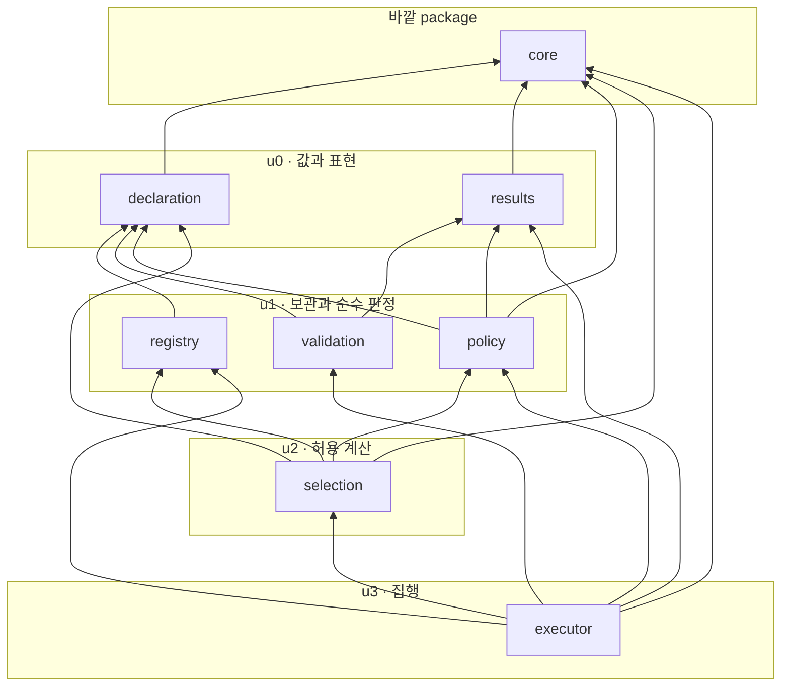
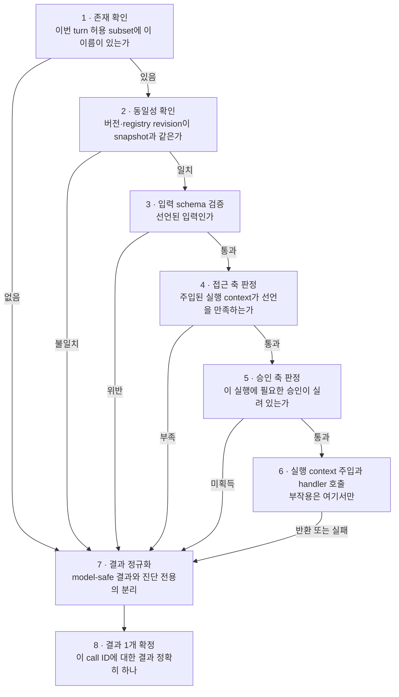
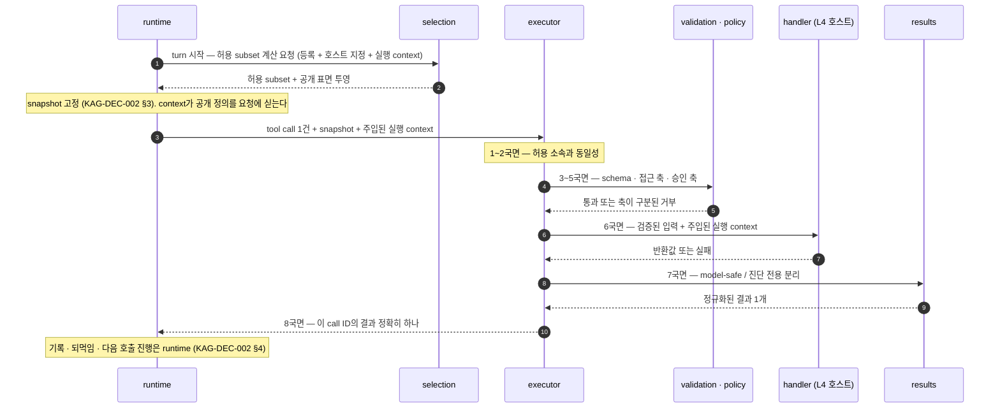

# tools package 경계 — 등록·허용 분리, 검증·정책 순서, handler 실행과 결과 정규화

KAG-DEC-001이 `tools`에 배정한 “호스트가 바깥에서 주입한 tool 정의와 handler의 등록, turn별 허용 subset 판정, 입력 schema 검증, 정책 확인, handler 실행, 결과 정규화”라는 책임을 **어떤 파일에 어떤 종류의 것으로 나눠 담을지**, **등록된 전체와 turn별 허용이 어떻게 갈라지고 어디서 다시 만나는지**, 그리고 **하나의 tool call이 어떤 순서로 판정되어 실행에 닿거나 닿지 못하는지** 제안한다. 구조 옵션 비교와 파일 후보 트리, 파일별 역할과 타입 범주, 내부 의존 방향, 등록·허용·검증·정책·실행·정규화의 lifecycle과 불변식, 실패·거부의 분류와 fail-closed 규칙, 외부 handler 주입 표면과 contract test seam까지가 대상이고 **exact signature·schema validator 선택·JSON Schema dialect·sync/async 형태·timeout 수치·정책 DSL은 대상이 아니다.**

> baseline의 날것 입력을 spec으로 내리기 전에 적용 방향을 정하는 문서.
> 기능 계약 상세는 `20-spec/`, 실제 작업 순서는 `30-work/`에 둔다.

> **상태 `proposed` — 사용자 리뷰 대기.** 이 문서의 §Decision 이하는 전부 **권고안**이며 아직 이 제품의 결정이 아니다. 사용자가 확정하기 전에는 어떤 파일도 만들지 않는다. KAG-BL-001·KAG-DEC-001·KAG-DEC-002의 `accepted`는 이 문서가 바꾸지 않는다 — 이 문서는 그 위에 쌓일 뿐 되돌리지 않는다. KAG-DEC-003·KAG-DEC-004·KAG-DEC-005는 여전히 `proposed`이며, 이 문서는 그 셋을 **확정 사실이 아니라 제안된 입력**으로만 참조한다(§0.2).

## Context

- 관련 baseline: [[baseline-001-provider-neutral-llm-runtime|KAG-BL-001]]
- 선행 결정: [[decision-001-runtime-directory-boundaries|KAG-DEC-001]] (accepted), [[decision-002-turn-runtime-flow|KAG-DEC-002]] (accepted), [[decision-003-core-contract-boundaries|KAG-DEC-003]] (proposed, 리뷰 대기), [[decision-004-process-boundaries|KAG-DEC-004]] (proposed, 리뷰 대기), [[decision-005-provider-boundaries|KAG-DEC-005]] (proposed, 리뷰 대기)
- 문제/기회
  - KAG-DEC-001은 `tools`를 L2 capability package로 두고 **`core`만 참조**하게 했다. 책임은 등록·허용 subset 판정·schema 검증·정책 확인·handler 실행·결과 정규화이고, model 호출·turn 반복·provider 형식은 두지 않는다. 특히 “**tool 목록의 출처는 언제나 호스트의 명시적 등록**”이라고 못박아 provider 내부 tool 탐색과 런타임 dynamic discovery를 이 디렉터리의 책임에서 제외했다.
  - KAG-DEC-002는 그 위에 실행 규율을 얹었다. turn 시작 시 **registry revision과 허용 subset을 snapshot으로 고정**하고(§3), **검증이 실행보다 먼저**이며(I2), 한 응답의 tool call은 **응답에 나타난 순서대로 직렬 실행**하고(§4.2), **거부도 실패도 전부 기록해 model에 되먹인다**(§5).
  - 그런데 그 사이가 비어 있다. **호스트가 등록한 것이 어떻게 이번 turn의 허용 목록이 되고, 그 목록이 어떤 순서의 판정을 거쳐 handler에 닿는지**가 아무 데도 정의돼 있지 않다. 지금 상태로 첫 tool 두 개를 붙이면 네 가지가 즉시 문제가 된다.
    1. **등록과 허용이 한 덩어리로 구현된다.** 둘을 나누는 이유는 편의가 아니라 재현성이다(KAG-DEC-002 §3). 한 덩어리로 만들면 “이번 turn에 무엇이 공개됐는가”를 사후에 복원할 수 없고, snapshot은 이름만 남은 규약이 된다.
    2. **노출 목록과 실행 판정이 두 벌이 된다.** 요청 조립에 실을 공개 정의를 고르는 코드와 실행 직전에 “이 tool을 써도 되는가”를 판정하는 코드는 자연스럽게 다른 자리에서 자라난다. 두 벌이 갈라지는 순간 **보이는데 못 쓰는 tool**이 생기고, 어느 쪽이 맞는지 판정할 근거가 없다 — KAG-BL-001이 운영 사례에서 관찰한 실패다.
    3. **판정 순서가 구조에 남지 않는다.** 존재 확인·schema·권한·승인은 서로 다른 축인데, 순서가 코드 흐름으로만 존재하면 한 축을 건너뛴 경로가 생겨도 지적할 자리가 없다. KAG-DEC-002 I2는 “검증 먼저”를 요구하지만 **무엇이 검증이고 그것이 몇 개의 축인지**는 아직 아무도 정하지 않았다.
    4. **접근 선언이 빈 채로 굴러갈 수 있다.** 새 tool을 만들 때 “누가 이걸 쓸 수 있는가”를 적지 않으면 기본값이 무엇이든 하나가 정해진다. 그 기본값이 “누구나”면 잊은 것과 열기로 한 것이 코드에서 구분되지 않고, 그 구분이 사라진 채로 tool이 하나씩 늘어난다.
  - 공개 계약을 package 하나씩 의존 그래프의 **아래에서 위로** 내려가기로 했고, `core`(L0, KAG-DEC-003) · `process`(L1, KAG-DEC-004) · `providers`(L2, KAG-DEC-005) 다음이 같은 L2의 `tools`다. `providers` 다음에 `tools`를 두는 이유는 KAG-DEC-005 PI7이 “복원한 tool call은 실행 요청이지 실행이 아니다”라며 그 요청의 수신자를 이 문서로 넘겼기 때문이다.
- 결정이 필요한 이유
  - `tools`는 이 라이브러리의 **보안 경계가 실제로 집행되는 자리**다. KAG-BL-001은 “model 출력은 명령이 아니라 실행 요청이고, 사용자·tenant·권한은 model이 만든 인자가 아니라 runtime이 주입하는 context여야 한다”를 존재 이유로 적었다. 그 문장이 코드가 되는 곳은 여기 하나뿐이다 — `providers`는 복원만 하고(KAG-DEC-005 PI7), `runtime`은 순서만 소유한다(KAG-DEC-002 §4).
  - 동시에 **범위를 넘기 가장 쉬운 자리**이기도 하다. 권한을 다루다 보면 역할 모델이 필요해 보이고, 승인을 다루다 보면 승인 저장소와 화면이 필요해 보인다. 그 둘은 호스트 애플리케이션의 제품 결정이지 이 라이브러리의 것이 아니다. 그래서 이 문서는 **축을 나누고 판정 자리를 만드는 데까지만** 가고, 축의 값과 그 의미는 호스트에 남긴다(§6).

### 0.1 이 문서의 표기 규칙

- **“등록”은 호스트가 tool 하나를 실행 가능한 것으로 라이브러리에 넘기는 행위**를 뜻하고, **“허용”은 이번 turn에 그중 무엇을 model에 공개하고 실행할 수 있게 할지 정하는 행위**를 뜻한다. 둘은 다른 시점, 다른 주체, 다른 값이다(§2).
- **“tool call”은 model이 낸 실행 요청 한 건**을 뜻한다. KAG-DEC-002 §4.2의 직렬 실행 단위와 1:1이며, 이 문서의 lifecycle(§4)은 **그 한 건**을 다룬다. 여러 건의 순서는 `runtime`의 것이다.
- **“handler”는 호스트가 소유하는 실제 실행 주체**를 뜻하고, **“공개 정의”는 model에 보이는 표면**(이름·버전·설명·입력 schema)을 뜻한다. 둘을 한 값으로 묶지 않는다(KAG-DEC-003 §3.1).
- **파일명·타입 범주·축 이름은 개념 라벨이다.** 클래스명·함수명·enum 값으로 승격하지 않는다. §Scope Out.
- **“권고”와 “확정”을 구분한다.** 이 문서 전체가 `proposed`이므로 모든 §Decision 항목은 권고이고, 근거가 약해 뒤집힐 수 있는 것은 그렇게 표시하거나 Open Questions로 뺀다.

### 0.2 선행 문서를 어떻게 참조하는가

| 문서 | 상태 | 이 문서에서의 취급 |
|---|---|---|
| KAG-BL-001 | accepted | 목표·보안 모델·reference 취급 규칙의 근거. 특히 “model 출력은 실행 요청이다”, “등록과 허용을 분리한다”, “노출 목록과 실행 목록은 같은 계산기를 쓴다”, “접근 선언에 기본값을 두지 않는다”가 이 문서의 출발점이다 |
| KAG-DEC-001 | accepted | **변경하지 않는다.** `tools`의 책임, `tools → core`만 허용하는 의존 방향, “tool 목록의 출처는 언제나 호스트의 명시적 등록”이라는 경계를 그대로 소비한다 |
| KAG-DEC-002 | accepted | **변경하지 않는다.** snapshot 고정(§3), I2(검증 먼저 실행 나중), 직렬 실행과 1:1 짝(§4.2), 거부·실패의 recoverable 되먹임(§5), 되먹임이 실행 표면을 넓히지 않는다는 규칙을 소비한다. 기록 시점과 되먹임 자체는 `runtime`·`sessions`의 것이고 이 문서는 그 아래 하위 책임만 정의한다 |
| KAG-DEC-003 | **proposed** | 확정 사실로 쓰지 않는다. 공개 tool 정의·tool call·tool result(K4·K5), 실행 context·한도·registry revision(K8), 오류·거부 사유 표현(K7), tool handler 경계 protocol(§4.1의 “권고 1건”)을 “제안된 배치”로만 인용하고 **파일 이름이 아니라 범주 수준으로만** 연결한다. KAG-DEC-003이 뒤집혀도 이 문서의 §3 배치와 §4 lifecycle은 그대로 성립해야 한다 |
| KAG-DEC-004 | **proposed** | 직접 참조하지 않는다. `tools`는 `process`를 import하지 않는다(KAG-DEC-001 §4). subprocess로 실행되는 tool이 필요하면 그것은 **호스트 handler 안쪽의 사정**이다(§6.4) |
| KAG-DEC-005 | **proposed** | 확정 사실로 쓰지 않는다. 소비하는 것은 **경계의 성질** 하나다 — provider는 tool call을 복원만 하고 실행하지 않으며(PI7), 중복 식별자나 텍스트 혼재를 감추지 않고 그대로 넘긴다(§5.2). 그 결과가 `runtime`의 판정을 거쳐 이 package에 도달한다 |
| REF-0007 설계 노트 | read-only | 초기 범위의 근거. “등록과 허용을 분리한다”(§2.3)와 “tool registry/executor” 배정이 이 문서의 입력이다. 노트의 코드 예시와 이름 가안은 **확정 API가 아니다** |
| 사내 운영 서비스의 server-owned tool loop | read-only | **구조 패턴만** 일반화했다. 접근 축과 승인 축의 분리, 노출과 실행의 동일 계산, 접근 선언 무기본값, 거부의 축 구분 기록, 등록 시점 중복 거부가 그것이다. 조직·업무·데이터와 코드·식별자는 옮기지 않았고, 그쪽의 역할·권한 모델은 **이 라이브러리가 발명하지 않는다**(§6.2) |

## Options

**초기 복잡도, 판정 축의 명시성(어느 축에서 막혔는지가 구조에 남는가), 우회 경로의 부재(handler에 닿는 경로가 하나로 유지되는가), 등록 출처의 통제(호스트 명시 등록 외의 경로가 생기지 않는가), 확장 비용(새 tool·새 판정 축이 늘 때 무엇이 열리는가)** 다섯 축으로 비교했다.

축 하나를 미리 정확히 해 둔다. 여기서 비교하는 것은 **판정을 할 수 있는가**가 아니다 — 아래 어느 안을 골라도 판정 코드는 쓸 수 있다. 비교 대상은 **판정을 건너뛰는 경로가 만들어질 수 있는가**다. 이 package는 “한 번만 뚫리면 나머지가 전부 무의미해지는” 성질을 갖고 있어서, 평균적인 편의보다 최악의 경로가 구조를 결정한다.

| Option | Description | Pros | Cons | Notes |
|---|---|---|---|---|
| A. 단일 `registry.py` | 등록·허용 계산·검증·정책·실행·정규화를 한 module에 둔다. REF-0007 설계 노트의 `tools/registry.py` 가안과 같은 모양 | 초기 복잡도 최저. 판정 순서가 한 함수 안에 있어 읽는 순간 전부 보인다. 파일 간 방향을 고민할 필요가 없다 | **판정 축이 구조에 남지 않는다.** 접근·승인·schema·존재 확인이 같은 함수의 연속된 `if`가 되면, 축을 하나 더할 때 그 자리가 어디인지 규칙이 없고 축이 빠졌는지도 눈으로만 확인한다. 노출 계산과 실행 판정이 같은 파일에 있다는 것은 **같은 계산을 쓴다는 보장이 아니다** — 오히려 가까이 있어서 두 벌이 되기 쉽다. 등록 가드와 실행 경로가 한 파일이라 “등록 시점에 막을 것”과 “실행 시점에 막을 것”의 구분도 흐려진다 | 비권고 |
| B. 관심사별 평면 module + 총순서 고정 | 등록 단위 값 · registry와 등록 가드 · 허용 subset 계산 · 입력 검증 · 정책 판정 · 결과 정규화 · 실행 집행을 각각 module로 두고, module 간 방향을 총순서로 고정한다 | **판정 축이 파일 경계와 일치한다.** “접근 판정이 어디 있나”에 경로로 답하고, 축을 더할 때 어느 파일이 소유하는지 답하지 못하면 그 축은 아직 설계되지 않은 것이다. 노출 계산이 정책 판정 module을 **참조**하도록 방향을 고정하면 “같은 계산”이 규약이 아니라 import 경로로 유지된다(§3.3). handler 호출이 한 파일에만 있어 **우회 경로 부재를 파일 단위로 검증**할 수 있다(§7.3). 순수 판정(부작용 없음)과 실행(부작용 있음)이 파일로 갈린다 | module 7개는 tool 두 개짜리 첫 slice에 확실히 많고, `results`·`validation`은 처음에 짧다. 총순서를 언어가 강제하지 않는다. 공개/전용 판정을 사람이 해야 한다 | **권고** |
| C. tool 분류별 중첩 package | `tools/read/` · `tools/write/`처럼 부작용 분류로 먼저 나누거나, namespace/도메인별로 하위 package를 둔다 | 분류가 폴더로 드러나 “write는 여기”가 자명하다. 승인이 필요한 것과 아닌 것이 갈린다 | **분류 축이 틀렸다.** read/write는 **정책 판정의 입력 값**이지 배치 축이 아니다 — 같은 tool이 분류를 바꾸면 폴더가 바뀌고, 그 이동이 곧 import 경로 변경이 된다. 게다가 이 package에는 tool 구현이 살지 않는다. **handler는 호스트 것이다.** 분류로 나눌 대상 자체가 여기 없고, 남는 것은 판정 코드뿐인데 그것은 분류와 무관하게 한 벌이어야 한다. namespace로 나누는 안도 같은 문제다 — namespace는 model이 탐색하는 배치 축이지 권한 축이 아니고(KAG-BL-001 운영 사례), 그것을 폴더로 만들면 배치 축이 권한 축처럼 읽힌다 | 기각 |
| D. 기반 클래스 상속 + 자기 등록 | `Tool` 기반 클래스를 두고 각 tool이 상속해 구현하며, 데코레이터나 entry-point로 import 시점에 스스로 registry에 등록된다 | 호스트가 쓸 때 문법이 짧다. tool 하나가 클래스 하나라 응집이 높다. 등록을 잊을 일이 없다 | **등록의 출처가 흐려진다.** import 부작용으로 registry가 채워지면 “무엇이 등록됐는가”가 import 그래프의 함수가 되고, 그것은 KAG-DEC-001이 금지한 dynamic discovery와 관찰 가능성 면에서 같아진다 — 목록을 복원하려면 어떤 module이 언제 import됐는지를 알아야 한다. entry-point까지 가면 **설치된 package가 실행 표면을 바꾸는** 구조가 되어 KAG-DEC-002 §6의 완전 제외(plugin marketplace·자동 설치)에 정면으로 걸린다. 상속은 별도의 문제도 갖는다 — 호스트의 기존 함수를 tool로 만들려면 클래스로 감싸야 하고, 라이브러리가 호스트 코드의 모양을 규정하기 시작한다 | 기각. 다만 “호스트가 쓸 때 짧다”는 이점은 §7.1의 선별 재수출로 일부 얻는다 |

핵심 trade-off를 숨기지 않는다: **A가 초기 복잡도에서 크게 이기고, 판정 순서의 가독성에서도 이긴다.** 순서가 한 함수 안에 있으면 그 순서를 읽는 데 파일을 옮겨 다니지 않아도 된다. 첫 tool이 두 개인 지금 이것은 가벼운 이점이 아니다.

B를 권고하는 이유는 파일 수가 아니라 **이 package에서 틀렸을 때의 대가가 다르기 때문**이다. `core`나 `process`가 잘못 나뉘면 리팩터링 비용이 생긴다. `tools`가 잘못 나뉘면 **판정을 건너뛴 실행이 생기고, 그것은 조용하다.** A에서 우회 경로 부재를 확인하는 방법은 함수를 끝까지 읽는 것뿐이고, 축이 늘어나면 그 확인은 매번 다시 해야 한다. B는 그 확인을 “handler를 부르는 import가 `executor` 밖에 있는가”라는 한 줄 질문으로 바꾼다.

과설계 경계도 명시한다. B가 module을 7개로 나누는 것은 **§1에서 `tools`가 소유한다고 판정한 책임이 그만큼이기 때문**이지 대칭을 위해서가 아니다. 소유할 책임이 없는 파일은 만들지 않는다 — 예컨대 “tool 목록을 model 프롬프트 문면으로 만드는” 파일은 두지 않는다. 그것은 `context`의 일이다(KAG-DEC-001 §2).

## Decision

> 아래는 전부 **권고안**이다. 사용자 확정 전에는 결정이 아니다.

- 권고: **Option B — 관심사별 평면 module 분리 + module 간 총순서 고정.**
- 비권고: Option A(단일 `registry.py`).
- 기각: Option C(tool 분류별 중첩 package), Option D(기반 클래스 상속 + 자기 등록). D가 노리던 호스트 편의는 §7.1의 선별 재수출로 대신한다.
- 미결로 남김: schema validator와 dialect, sync/async handler 형태, 권한 판정 규칙의 거처(내장인가 주입인가), 승인 축을 노출에 반영할지, registry의 가변성과 revision 발급 주체, 실패의 값/예외 표현, 결과 크기 상한 (→ §Open Questions).

이하 §1~§8이 Option B의 권고 내용이다.

### 1. tools가 소유하는 것과 소유하지 않는 것

먼저 책임 범주를 못박는다. 파일 배치는 그 다음이다(§3).

| # | 책임 범주 | tools가 소유하는 이유 |
|---|---|---|
| T1 | **등록의 수용** — 호스트가 넘긴 공개 정의·handler·선언(접근·승인·부작용 분류)을 한 등록 단위로 받아 보관한다 | KAG-DEC-001 §2. tool의 출처는 언제나 호스트의 명시적 등록이고, 그 수신자가 여기다 |
| T2 | **등록 시점 가드** — 이름 중복, 필수 선언 누락, 공개 표면과 실행 표면의 불일치를 등록에서 거부한다 | 잘못된 카탈로그는 실행 시점에 고칠 수 없다. 같은 이름이 두 번 실리면 model에는 둘로 보이고 실행은 하나로만 간다 |
| T3 | **registry revision** — 등록 원본이 어느 시점의 것인지를 식별하는 값의 발급과 보존 | KAG-DEC-002 §3이 snapshot에 revision을 넣었다. 그 값을 만들 수 있는 것은 등록을 보관하는 쪽뿐이다 |
| T4 | **turn 허용 subset 계산** — 등록된 것 중 이번 turn에 공개·실행할 subset을 정하는 **단 하나의 계산** | KAG-BL-001 운영 사례. 노출과 실행이 같은 계산을 쓰지 않으면 “보이는데 못 쓰는 tool”이 생긴다 |
| T5 | **model 공개 표면의 투영** — 허용 subset에서 handler·권한 선언·호스트 내부 값을 제외한 공개 정의만 내보낸다 | KAG-DEC-003 K5. 공개 정의와 실행 주체를 한 값으로 묶으면 보내면 안 되는 것이 실린다 |
| T6 | **입력 schema 검증** — model이 낸 인자가 그 tool의 선언된 입력인지 판정 | KAG-DEC-002 I2. 검증은 실행보다 먼저이고, 검증의 결과는 통과 아니면 구분된 거부다 |
| T7 | **정책 판정** — 접근 권한 축과 실행 승인 축의 판정, 그리고 **어느 축에서 막혔는지의 구분** | KAG-BL-001 보안 모델. 두 축을 하나로 뭉치면 감사 기록이 “거부됨”만 남는다 |
| T8 | **handler 실행과 실행 context 주입** — 검증된 입력과 **runtime이 주입한** 실행 context로 handler를 부른다 | KAG-BL-001 “사용자·tenant·권한은 model이 만든 인자가 아니라 runtime이 주입하는 context”. 그 주입이 실제로 일어나는 자리가 여기다 |
| T9 | **결과 정규화** — handler 반환값과 실패를 model-safe 결과와 진단 전용 정보로 나눈다 | KAG-DEC-002 §5 “stack trace·secret·내부 식별자는 되먹이지 않고 진단 기록에만 남긴다” |

**tools가 소유하지 않는 것.** 아래가 `tools/` 아래에 나타나면 그 자체가 위반이다.

| 두지 않는 것 | 사는 곳 | 근거 |
|---|---|---|
| model 호출, 공통 요청·응답 형식, provider wire | `providers` | KAG-DEC-001 §4·§5. `tools`는 `providers`를 import하지 않는다 |
| turn loop, 반복 진입 판정, step 회계, 종료 state | `runtime` | KAG-DEC-002 §1·§4.3. `tools`는 **호출 한 건**의 계약이다 |
| tool call 여러 건의 순서 결정, 짝 판정, 중단 시점 | `runtime` | KAG-DEC-002 §4.2. 순서는 응답에 나타난 순서이고 그것을 아는 것은 `runtime`뿐이다 |
| session event 기록, 기록 시점, 무엇을 남길지의 결정 | `runtime` · `sessions` | KAG-DEC-002 §4. **`tools`는 아무것도 기록하지 않고 값만 돌려준다** (§4 TI6) |
| 거부·결과를 model에 되먹이는 행위와 그 문면 | `runtime` · `context` | KAG-DEC-002 §5. `tools`는 model-safe 값을 만들 뿐 그것을 어디에 싣는지 모른다 |
| 요청 조립, 공개 정의를 프롬프트 문면으로 만드는 일, tool 결과의 축약·재현 | `context` | KAG-DEC-001 §2. 무엇을 어떻게 보여줄지는 context 투영의 판단이다 |
| dynamic tool discovery, provider 내장 tool, MCP 탐색, plugin 설치·자동 업데이트 | (어디에도 두지 않음) | KAG-DEC-001 §2, KAG-DEC-002 §6 완전 제외. **실행 표면이 turn 도중 바뀌면 snapshot이 무의미해진다** |
| 역할·권한 모델의 정의(어떤 역할이 있고 무엇을 포함하는가) | 호스트 애플리케이션 | 제품 결정이다. 라이브러리는 **판정 자리와 기본 거부 규칙**만 갖는다 (§6.2) |
| 승인 저장소, 승인 화면, 승인의 발급·만료·철회 lifecycle | 호스트 애플리케이션 | 같음. 라이브러리는 “승인이 실렸는가”만 본다 (§6.3) |
| 취소 여부의 판정, turn 시간 상한·step 한도의 소유 | `runtime` | KAG-DEC-002 §3. tool별 timeout을 둘지는 미결 (→ OQ-3) |
| subprocess 실행 격리, HTTP 호출, 외부 transport | `process` · 호스트 handler 안쪽 | KAG-DEC-001 §4는 `tools → process`를 금지한다. transport는 handler 구현의 사정이다 (§6.4) |
| 로깅 destination 선택, 파일 기록, telemetry 전송 | 호스트 애플리케이션 | 라이브러리는 진단을 값으로 돌려주고 어디에 쓸지 고르지 않는다 (§8) |
| tool 목록·정책의 조립과 주입 시점 결정 | L4 애플리케이션 | KAG-DEC-001 §4 “조립은 여기서만” |

한 줄 덧붙인다. **이 package에는 tool 구현이 살지 않는다.** 여기 있는 것은 전부 “남의 구현을 받아 판정하고 부르는” 코드다. 첫 사례의 read-only tool 두 개(문서 검색·열람)도 라이브러리가 아니라 호스트(`examples/`)가 소유한다(KAG-DEC-001 §1).

### 2. 등록과 허용의 분리

KAG-BL-001과 REF-0007이 “등록과 허용을 분리한다”까지 적었고, KAG-DEC-002 §3이 “registry revision과 허용 subset을 snapshot으로 고정한다”까지 적었다. 그 둘 사이의 규칙을 여기서 항목으로 내린다.

#### 2.1 세 개의 값

| 값 | 무엇 | 언제 만들어지나 | 누가 만드나 | 누가 보나 |
|---|---|---|---|---|
| **등록 registry** | 실행 가능한 등록 단위 전체. 공개 정의 + handler + 접근·승인·분류 선언 | 애플리케이션 시작 시점(또는 호스트가 정한 등록 시점) | L4 호스트가 넘기고 `tools`가 보관 | `tools`만. **밖으로 통째로 나가지 않는다** |
| **turn 허용 subset** | 이번 turn에 공개·실행할 대상의 판정 결과 | turn 시작 시점, 정확히 한 번 | `tools`가 계산, `runtime`이 snapshot으로 고정 | `runtime`(고정·판정), `context`(공개 정의 투영을 통해) |
| **model 공개 표면** | 허용 subset에서 공개 정의만 남긴 투영 | 허용 subset과 같은 시점, 같은 계산에서 | `tools` | `context` → `providers` → model |

세 값의 관계를 한 줄로: **registry ⊇ 허용 subset ⊇(투영) 공개 표면**이고, **셋을 잇는 계산은 하나**다.

#### 2.2 분리 규칙 8개

| # | 규칙 | 어기면 생기는 일 |
|---|---|---|
| RG1 | **tool의 출처는 언제나 L4 호스트의 명시적 등록이다.** runtime dynamic discovery, provider 내장 tool·MCP 탐색, 자동 설치·자동 업데이트 경로를 만들지 않는다 | 실행 표면이 turn 도중 또는 배포 사이에 조용히 바뀌고, snapshot이 “무엇이 공개됐는가”를 복원하지 못한다 (KAG-DEC-002 §6) |
| RG2 | **registry와 허용 subset은 서로 다른 값이고 서로 다른 시점에 만들어진다.** 등록되어 있다는 사실이 이번 turn의 허용을 뜻하지 않는다 | 한 덩어리로 만들면 “이번 turn에 무엇이 열렸나”라는 질문에 “등록된 전부”라고밖에 답할 수 없다 |
| RG3 | **snapshot에 고정되는 것은 이름·버전·registry revision·공개 정의다.** handler 객체·secret·권한 선언의 내부·호스트 자원은 model에 노출되는 어떤 값에도 들어가지 않는다 | model에 보내면 안 되는 것이 실린다. 그리고 handler를 값으로 다루기 시작하면 프로세스 경계를 넘길 수 있는 것처럼 보인다 (RG7) |
| RG4 | **model 노출 목록과 실제 실행 허용 판정은 같은 계산 결과를 사용한다.** 접근 축의 판정은 노출 시점과 실행 시점에 **같은 지점**을 통과한다 | 두 벌이 갈라져 “보이는데 못 쓰는 tool”이 생기고, 어느 쪽이 맞는지 판정할 근거가 없다 (KAG-BL-001 운영 사례) |
| RG5 | **접근 선언에 기본값을 두지 않는다.** 선언이 없는 등록은 “누구나”가 아니라 “아직 판단하지 않음”이며 **등록에서 거부한다**(T2) | 빠뜨린 tool이 전원 허용으로 열리고, 잊은 것과 열기로 한 것이 코드에서 구분되지 않는다 |
| RG6 | **조회·계산 실패를 빈 목록으로 접지 않는다.** 허용 subset 계산이 실패하면 “허용 0개”가 아니라 실패다 | 일시 장애가 조용한 기능 정지로 나타나고, model은 “tool이 원래 없다”고 판단해 근거 없는 답을 만든다 (KAG-DEC-002 §5, KAG-BL-001) |
| RG7 | **handler는 값이 아니라 프로세스 지역 자원이다.** 등록 단위를 직렬화해 옮기지 않고, 다른 프로세스가 필요하면 **이름·버전·revision만 넘겨 자기 registry에서 조회**한다 | 함수 객체를 직렬화하려는 시도가 생기고, 그 경로는 곧 임의 코드 역직렬화가 된다. queue·multi-worker 자체는 여전히 범위 밖이다 (KAG-BL-001 OQ-11) |
| RG8 | **허용 subset은 turn 시작에 확정되고 turn 내내 불변이다.** 거부 사유를 model에 되먹여도 표면은 넓어지지 않는다 | KAG-DEC-002 §5의 “되먹임은 실행 표면을 넓히지 않는다”가 무너지고, model이 거부를 근거로 더 넓은 권한을 협상할 수 있게 된다 |

#### 2.3 허용 subset을 무엇이 좁히는가

허용 subset은 세 입력의 교집합이다. **셋 다 좁히기만 하고 넓히지 않는다.**

| 입력 | 누가 주나 | 성격 |
|---|---|---|
| 등록 registry | 호스트(등록 시점) | 상한. 여기에 없는 것은 어떤 경우에도 실행되지 않는다 |
| 이번 turn의 허용 지정 | 호스트(turn 입력) | 호스트가 이번 대화·이번 사용자에게 열기로 한 목록. **미지정을 “전부”로 읽을지는 미결**(→ OQ-6은 승인 축, 이쪽은 OQ-11) |
| 접근 축 판정 | `tools`가 실행 context와 등록 선언을 대조 | 권한이 없는 tool은 노출되지 않고 실행되지도 않는다. **같은 판정 지점**(RG4) |

**승인 축은 여기서 좁히지 않는다.** 승인이 필요한 tool을 노출에서 감출지, 보이되 실행 시점에 거부하고 그 사유를 되먹일지는 판단이 갈린다. 이 문서의 권고는 **보이되 거부하고 되먹인다**이다 — 감추면 model은 그 tool이 존재하지 않는다고 판단해 대안을 찾고, 승인이 필요하다는 사실 자체가 어디에도 나타나지 않는다. 반면 노출은 실행이 아니므로 감추지 않아도 fail-open이 아니다. 다만 “무엇이 필요한지를 model에 얼마나 알려줄 것인가”는 정보 노출 판단이 섞이므로 미결로 둔다(→ OQ-6, §8 TR4).

### 3. 파일 후보 트리와 내부 방향

#### 3.1 파일 후보 트리

```text
src/kknaks_agents/tools/
├── __init__.py       # 공개 표면 (§7.1) — 호스트가 등록할 때 통과하는 자리
├── declaration.py    # 등록 단위 — 공개 정의 + handler 참조 + 접근·승인·분류 선언   ← §1 T1
├── results.py        # 결과·거부의 정규화와 model-safe / 진단 전용 분리             ← §1 T9
├── registry.py       # 등록 보관 · 등록 시점 가드 · revision · 이름/버전 조회        ← §1 T1 · T2 · T3
├── validation.py     # 입력 schema 검증                                            ← §1 T6
├── policy.py         # 접근 축 · 승인 축 판정과 축 구분                              ← §1 T7
├── selection.py      # turn 허용 subset 계산과 공개 표면 투영 (노출·실행 공통 계산)   ← §1 T4 · T5
└── executor.py       # 판정 순서 집행 · 실행 context 주입 · handler 호출            ← §1 T8, §4 집행
```

module 7개 + `__init__.py`다. 화살표는 **그 파일이 §1의 어느 책임을 명시적으로 소유하는가**를 가리키며, 책임과 파일이 개수로 1:1인 것은 아니다 — `registry`는 셋을 소유하고, `executor`는 T8을 소유하되 나머지 전부의 순서를 집행한다.

이름에 대한 판단 넷.

- **`registry.py`와 `executor.py`라는 역할 이름을 쓴다.** KAG-DEC-003 §4.2는 “`registry`·`executor` 같은 역할 이름을 가진 서비스 클래스는 core가 아닐 가능성이 높다”고 적었는데, 그 기준의 반대편이 정확히 여기다. 이 package는 **행동이 사는 곳**이므로 역할 이름이 적절하다.
- **`declaration.py`이지 `tool.py`가 아니다.** 여기 사는 것은 tool 그 자체가 아니라 **호스트가 tool에 대해 선언한 것**이다. `tool.py`로 부르면 “tool 구현이 여기 있다”고 읽히고, 그것은 §1 마지막 줄과 정면으로 어긋난다. `registration.py`도 후보였다(→ OQ-7).
- **`policy.py`는 정책 **판정**이지 정책 **정의**가 아니다.** 역할·권한 모델을 이 파일에 넣지 않는다(§6.2). 이름이 오해를 부를 수 있어 §3.2의 역할 열에 명시한다.
- **`snapshot.py`를 따로 두지 않는다.** snapshot은 `runtime`이 고정하는 값이고(KAG-DEC-002 §3), `tools`가 하는 일은 그 재료가 되는 계산과 투영이다 — 그것은 `selection`이 소유한다. 파일을 하나 더 만들면 §1에서 그 파일이 단독으로 소유할 책임이 없다.

#### 3.2 파일별 역할 · 타입 범주 · producer/consumer

“대표 타입/행동 범주”는 **어떤 종류의 것이 사는가**이지 확정 클래스명·함수명이 아니다.

| 파일 | 단일 역할 | 대표 타입/행동 범주 | 주로 만드는 쪽 (producer) | 주로 쓰는 쪽 (consumer) |
|---|---|---|---|---|
| `declaration.py` | 호스트가 tool 하나에 대해 선언하는 것의 **형태**와 그 자체의 정합 가드 (§1 T1) | 등록 단위 값(공개 정의 참조 + handler 참조 + 접근 선언 + 승인 정책 선언 + 부작용 분류), 접근 선언을 만드는 **명시적 생성 경로**(“공개”도 명시해야 만들어진다 — RG5), 선언 자체의 모순 검사(예: 승인 필요라고 적힌 read tool). **판정하지 않고 실행하지 않는다** | L4 호스트 (값 채우기), 이 파일 (형태·가드) | `registry`, `policy`, `selection`, `executor` |
| `results.py` | tool 실행 결과와 거부를 **두 표현으로 나눠** 만드는 규칙 (§1 T9) | model-safe 결과(정규화된 값 + 축 구분된 거부 사유), 진단 전용 정보(예외·내부 식별자·원문), 둘을 한 값으로 합치지 못하게 하는 구분. **무엇이 민감한지는 주입받는다**(§8 TR6) | 이 파일 (규칙), `executor`·`policy`·`validation` (재료) | `runtime` (되먹임·기록 판단), L4 (관측) |
| `registry.py` | 등록 단위의 보관과 **등록 시점 가드**, revision (§1 T1·T2·T3) | 등록 보관소, 이름·버전으로의 조회, revision 값의 발급·보존, 등록 거부 규칙(이름 중복·필수 선언 누락·선언 모순). **실행하지 않고 허용을 정하지 않는다** | L4 호스트 (등록 호출) | `selection`, `executor`, L4 (조립) |
| `validation.py` | model이 낸 인자가 그 tool의 선언된 입력인지의 판정 (§1 T6) | 입력 검증의 **수행 지점**, 위반의 구조화된 표현(어느 필드가 왜), 모르는 필드·모르는 판별값에 대한 fail-closed 판정. **validator 선택과 dialect는 미결**(→ OQ-1) | 이 파일 | `executor` |
| `policy.py` | 접근 축과 승인 축의 판정, 그리고 **어느 축에서 막혔는지의 구분** (§1 T7) | 접근 판정(등록 선언 ↔ 주입된 실행 context의 대조), 승인 판정(이 실행에 승인이 실렸는가), 부족한 축과 그 요구치의 반환. **역할·권한 모델을 정의하지 않고**(§6.2) **두 축을 하나로 합치지 않는다** | 이 파일 | `selection` (접근 축만), `executor` (두 축 모두) |
| `selection.py` | 이번 turn의 허용 subset 계산과 공개 표면 투영 — **노출과 실행이 공유하는 단 하나의 계산** (§1 T4·T5) | 등록 목록 ∩ 호스트 허용 지정 ∩ 접근 축 판정의 교집합 계산, 공개 정의만 남기는 투영(handler·선언 제거), 계산 실패의 표현(빈 목록이 아니다 — RG6) | 이 파일 | `runtime` (snapshot 고정), `context` (공개 정의 투영을 통해), `executor` (실행 시 소속 확인) |
| `executor.py` | §4의 국면 순서를 집행하고 **handler를 부르는 유일한 자리** (§1 T8) | 호출 진입 행동, 국면 순서 집행, 실행 context 주입, handler 호출, 결과 확정. **이 package에서 부작용이 발생하는 유일한 파일** | — | `runtime` (직렬 실행), L4 (조립) |
| `__init__.py` | 공개 표면 (§7.1) | — (정의를 두지 않는다) | — | L4 애플리케이션 |

네 줄 덧붙인다.

- **`validation`·`policy`·`selection`은 부작용이 없다.** 셋 다 입력을 받아 답이 하나로 정해지는 판정이어야 고정 입력으로 검증된다(§7.3). 여기에 handler 호출이나 기록이 섞이면 “거부가 부작용 없이 끝난다”가 성립하지 않는다.
- **`policy`는 `validation`을 부르지 않고 그 반대도 아니다.** 두 축이 서로를 참조하기 시작하면 “schema는 통과했지만 권한이 없다”와 “권한은 있지만 schema가 틀렸다”가 같은 사유로 접힌다. 순서는 `executor`가 알고 두 module은 서로를 모른다(§3.3 같은 tier 규칙).
- **`selection`은 접근 축만 쓰고 승인 축은 쓰지 않는다.** §2.3의 판단 그대로다. 승인은 노출을 좁히지 않는다.
- **`executor`는 registry가 아니라 허용 subset을 본다.** 실행 직전에 “이 이름이 이번 turn 허용에 있는가”를 확인하는 것이지 “등록되어 있는가”가 아니다(§4 TI3).

#### 3.3 module 간 방향

KAG-DEC-001이 package 사이 방향을 정했듯 `tools/` 안에서도 방향을 정한다. **화살표는 항상 아래에서 위로만 간다. 같은 tier끼리는 서로 import하지 않는다.**



| Tier | module | 이 tier에 있는 이유 |
|---|---|---|
| u0 | `declaration` · `results` | `core`만 참조하는 값과 표현 규칙. 서로를 참조하지 않는다 |
| u1 | `registry` · `validation` · `policy` | 등록 단위를 읽고 판정하거나 보관한다. **셋은 서로를 모른다** — 보관·입력 검증·권한 판정은 독립한 축이다 |
| u2 | `selection` | 보관된 것과 접근 판정을 조합해 이번 turn의 허용을 만든다. `registry`와 `policy` 둘 다 참조하는 유일한 module |
| u3 | `executor` | 전부를 참조한다. 아무도 이것을 참조하지 않는 꼭대기이자 부작용이 발생하는 유일한 자리 |

**방향 규칙 넷을 추가로 못박는다.** 이 넷이 이 package를 다른 package와 다르게 만드는 부분이다.

1. **`executor`를 아무도 참조하지 않는다.** 어떤 module도 실행을 되부르지 않으므로 handler 호출 경로는 항상 위에서 아래로 한 번뿐이다. 이 규칙이 깨지면 판정 module 안에서 실행이 일어나 §4의 순서가 무의미해진다.
2. **`policy`는 `selection`을 참조하지 않는다.** 방향이 반대로 서면 “권한 판정이 이번 turn 허용을 다시 계산하는” 순환이 생기고, RG4가 요구한 “같은 계산”이 두 번 도는 다른 계산이 된다.
3. **`registry`는 `selection`·`executor`를 모른다.** 등록 보관이 실행을 알기 시작하면 등록 시점 가드와 실행 시점 판정의 구분이 흐려지고, Option D가 기각된 이유(등록이 실행 그래프에 종속됨)가 다른 모습으로 돌아온다.
4. **어떤 module도 `core` 밖의 형제 package를 참조하지 않는다.** `providers`·`process`·`sessions`·`context`·`skills`·`runtime` 전부다(KAG-DEC-001 §4). transport가 필요한 tool은 handler 안쪽에서 해결한다(§6.4).

이 배치의 효용 셋.

1. **“같은 계산”이 규약이 아니라 import 경로로 유지된다.** `selection`이 `policy`를 참조하고 `executor`도 `policy`를 참조하므로, 접근 판정은 정의상 한 곳에 있다. A에서는 이것이 “같은 함수를 부르자”는 약속이고, 여기서는 그 약속을 어기려면 판정 코드를 복제해야 한다 — 복제는 diff에 보인다.
2. **우회 경로 부재가 파일 단위 질문이 된다.** “handler를 부르는 코드가 `executor` 밖에 있는가”만 확인하면 되고, 그 확인은 사람이 매번 함수를 읽는 것보다 훨씬 싸다(§7.3 seam 5).
3. **순환이 tier 번호 비교로 환원된다.** `validation`이 `executor`를 참조하고 싶어지는 순간(예: 검증 중에 다른 tool을 한 번 불러 보고 싶은 설계) tier가 그것을 금지하고, 그 금지가 §4 TI7의 “tools는 스스로 다음 tool을 부르지 않는다”와 같은 규칙이 된다.

한계도 적는다: 이 방향들 역시 **사람이 지키는 규약**이다. KAG-DEC-001 OQ-5(import 경계 정적 검사)를 도입한다면 package 경계·`core` tier(KAG-DEC-003 §3.2)·`process` tier(KAG-DEC-004 §3.3)·`providers` 방향 규칙(KAG-DEC-005 §3.3)과 함께 이 네 규칙도 같은 검사에 넣는 것이 자연스럽다(→ OQ-10). 규칙 1은 **가장 검사하기 쉬운 형태**다 — `executor` 경로가 다른 module의 import 목록에 없는지만 보면 된다.

**`core`와의 연결은 범주 수준으로만 둔다.** KAG-DEC-003이 아직 `proposed`이므로 이 문서는 `tools`가 `core`의 어느 **파일**을 참조하는지 확정하지 않는다. 확정하는 것은 “공개 tool 정의·tool call·tool result·실행 context·오류 표현을 읽고 만든다”는 범주뿐이다.

### 4. 하나의 tool call이 지나는 lifecycle

한 tool call은 **국면 8개**를 지난다. 순서를 바꾸거나 국면을 건너뛰는 구현은 이 권고 위반이다. **1~5국면은 부작용이 없고, 부작용은 6국면에서만 발생한다.**



읽는 법 여덟 줄.

1. **1국면의 기준은 허용 subset이지 registry가 아니다.** 등록되어 있지만 이번 turn에 허용되지 않은 이름은 “있다”가 아니라 **없다**로 판정한다(RG2·RG8). 이 구분이 없으면 turn 단위 표면 통제가 성립하지 않는다.
2. **2국면이 3국면보다 먼저다.** 버전이나 revision이 snapshot과 다르면 그 tool의 입력 schema 자체가 다를 수 있어, 검증을 먼저 하면 **틀린 자로 재는** 셈이 된다. 불일치는 조용히 최신으로 맞추지 않고 실패다(TI3).
3. **3국면은 model이 만든 유일한 재료를 검사하는 자리다.** 인자는 전적으로 model 출력이고 그 밖의 모든 입력은 주입된 값이다. 그래서 여기가 유일하게 “model을 믿지 않는다”가 데이터에 적용되는 지점이다.
4. **4국면은 model이 무엇을 주장하든 보지 않는다.** 사용자·tenant·권한은 실행 context에서 오고, 인자에 같은 이름의 필드가 있어도 그것은 인자일 뿐이다(TI4).
5. **5국면은 4국면과 별개 축이다.** “쓸 수 있는 사람인가”와 “이 실행이 승인됐는가”를 하나로 합치면 거부 사유가 한 종류가 되고, 어디를 고쳐야 하는지 알 수 없게 된다(§5.1).
6. **6국면이 유일한 부작용 지점이다.** 1~5국면이 전부 통과해야 여기 닿는다. 거부는 어느 국면에서든 부작용 없이 7국면으로 간다.
7. **7국면은 실패도 지난다.** handler가 예외로 끝나도 그것은 결과이고, model-safe 표현과 진단 전용 정보로 나뉘어야 한다.
8. **8국면은 하나만 낸다.** 성공이든 거부든 실패든 이 call ID에 대한 결과는 정확히 하나다(TI1).

불변식 여덟 개로 요약한다.

| # | 불변식 | 어기면 생기는 일 |
|---|---|---|
| TI1 | **한 tool call은 정확히 하나의 결과로 끝난다. 거부도 결과다** | KAG-DEC-002 §4.2의 “call과 result의 1:1 짝”이 깨져 다음 context가 완결되지 않는다 |
| TI2 | **1~5국면을 통과하지 않고 handler에 닿는 경로가 없다** | KAG-DEC-002 I2(검증 먼저, 실행 나중)가 우회된다. **이 라이브러리의 보안 경계 전체가 이 한 줄에 걸려 있다** |
| TI3 | **판정 기준은 turn snapshot이지 현재 registry가 아니다.** 버전·revision 불일치는 맞춰주지 않고 실패다 | 실행 도중 등록이 바뀌면 같은 turn이 재현되지 않는다 (KAG-DEC-002 §3·§4.3) |
| TI4 | **model이 인자로 주장한 사용자·tenant·권한을 신뢰하지 않는다.** 실행 context는 주입된 값만 쓴다 | model이 자기 권한을 스스로 주장할 수 있게 된다 (KAG-BL-001 Why It Matters) |
| TI5 | **미등록·허용 밖·revision 불일치·schema 불일치·권한 누락·승인 누락은 fail-closed다.** 어느 것도 “통과에 가까운 것”으로 접지 않는다 | 조용한 fail-open이 생기고, 그것은 실행되고 나서야 발견된다 |
| TI6 | **`tools`는 아무것도 기록하지 않고 되먹이지 않는다.** 값만 반환한다 | 기록 순서(KAG-DEC-002 I1)를 `runtime`이 소유하지 못하고 두 곳에서 기록이 생긴다 |
| TI7 | **`tools`는 model을 부르지 않고 스스로 다음 tool을 부르지 않는다.** handler가 재귀 loop를 여는 경로를 만들지 않는다 | step 회계 밖의 loop가 생겨 KAG-DEC-002 §4.3의 한도가 실제 실행 수를 세지 못한다 |
| TI8 | **거부와 실패는 이 call 하나만 끝낸다.** 남은 tool call을 중단시킬지, turn을 끝낼지 판정하지 않는다 | turn 종료 판정이 두 곳에 생긴다. 중단 판정은 `runtime`의 것이다 (KAG-DEC-002 §4.2·§5) |

계층 구분을 그림 하나로 붙인다. **participant는 §3의 파일 경계와 같고, `runtime`이 순서와 기록을 소유한 채 이 package를 호출 한 건 단위로 부른다.**



눈여겨볼 것은 **`tools`가 돌려준 것이 곧 model이 보는 것이 아니라는 점**이다. 그 사이에 `runtime`의 기록과 `context`의 투영이 한 번씩 더 있다. 그리고 **거부도 이 경로를 그대로 지난다** — 거부를 예외로 던져 위로 빠져나가게 하면 기록과 짝 맞춤이 경로마다 달라진다(→ 값/예외 표현은 OQ-9).

#### 4.1 KAG-DEC-002 side effect 순서와의 대조

KAG-DEC-002 §4의 12단계 중 이 package가 소유하는 것은 **6단계(tool call 검증)와 7단계(tool 실행)뿐**이고, 결과 정규화는 8단계의 재료를 만드는 데까지다. 겹치지 않음을 확인한다.

| DEC-002 단계 | 소유자 | 이 문서와의 관계 |
|---|---|---|
| 1 turn 고정 | `runtime` | `selection`이 재료(허용 subset·공개 표면)를 만들고 고정은 `runtime`이 한다 (§2.1) |
| 2 사용자 입력 기록 | `runtime`·`sessions` | 무관 |
| 3 요청 조립 | `context` | 공개 표면 투영만 넘긴다. 문면 구성은 `context` |
| 4 provider 호출 | `runtime`·`providers` | 무관 |
| 5 응답 기록 | `runtime`·`sessions` | 무관 |
| **6 tool call 검증** | **`tools`** | §4의 1~5국면. **거부도 결과로 반환**하고 기록은 하지 않는다 (TI6) |
| **7 tool 실행** | **`tools`** | §4의 6국면. 6단계 통과 없이 도달하는 경로가 없다 (TI2) |
| 8 tool result 기록 | `runtime`·`sessions` | §4의 7~8국면이 만든 model-safe 결과가 기록 재료다 |
| 9 진행 판정 | `runtime` | 짝 판정은 `runtime`. `tools`는 call 하나에 결과 하나를 보장할 뿐 (TI1·TI8) |
| 10 반복 진입 | `runtime` | 무관 |
| 11 final 기록 · 12 반환 | `runtime` | 무관 |

### 5. 실패·거부의 소유권과 fail-closed 원칙

#### 5.1 거부 5계열

거부를 다섯 계열로 나눈다. 계열이 필요한 이유는 각 계열의 **책임 소재가 다르기 때문**이다 — 어느 계열이 잦은지가 곧 어디를 고쳐야 하는지다. KAG-DEC-002 §5는 “tool validation/policy 오류”로 **미등록·허용 subset 밖·입력 schema 위반·권한 거부·승인 미획득**을 묶어 recoverable(model에 되먹이고 loop 계속)로 분류했고, 이 문서는 그 안의 구분을 만든다. **동일성 계열만 그 목록에 없다** — KAG-DEC-002 §4.3은 snapshot 훼손을 실패종료로 두었는데 tool call 하나의 revision 불일치가 그와 같은 것인지는 정하지 않았다. 이 문서는 `tools` 쪽에서 “구분된 결과로 돌려준다”까지만 하고 recoverable/terminal 판정은 `runtime`에 남긴다.

| 계열 | 무엇 | 책임 소재 | 소유 파일 | model-safe 표현이 담아야 하는 것 |
|---|---|---|---|---|
| **존재** | 이번 turn 허용 subset에 없는 이름 (미등록이거나 허용 밖) | model의 이름 착오, 또는 호스트의 허용 지정 | `selection`(계산) · `executor`(확인) · `results`(표현) | “그 이름은 이번에 쓸 수 없다”. **등록은 되어 있으나 허용 밖이라는 사실을 알려줄지는 정보 노출 판단**(→ §8 TR4) |
| **동일성** | 버전 또는 registry revision이 snapshot과 다르다 | 호스트의 등록 변경 타이밍, 또는 `runtime`의 snapshot 취급 | `executor` · `results` | model이 고칠 수 있는 것이 아니다. **되먹여도 의미가 없으므로 진단 쪽이 본체이고, 이 계열을 recoverable로 볼지 terminal로 볼지는 `runtime`이 정한다**(→ OQ-8) |
| **입력** | schema 위반 — 필수 누락, 형 불일치, 모르는 필드 | model | `validation` · `results` | 어느 필드가 왜 틀렸는가. 이것이 model이 스스로 고칠 수 있는 유일한 계열이다 |
| **접근** | 실행 context가 등록 선언의 접근 요구를 만족하지 못한다 | 권한 구성 또는 잘못된 tool 선택 | `policy` · `results` | **막힌 축이 접근이라는 사실.** 요구치를 얼마나 노출할지는 호스트 판단(§8 TR4) |
| **승인** | 승인이 필요한 실행에 승인이 실려 있지 않다 | 승인 절차 미완 | `policy` · `results` | **막힌 축이 승인이라는 사실.** model이 승인을 스스로 만들 수 없다는 점이 접근 계열과 다르다 |

여기에 거부가 아닌 하나를 더한다.

| 계열 | 무엇 | 책임 소재 | 소유 파일 |
|---|---|---|---|
| **handler 실패** | 실행은 시작됐고 handler가 실패했다 | tool 구현 또는 그 너머의 외부 시스템 | `executor`(포착) · `results`(분리) |

**접근과 승인을 두 계열로 나누는 것이 이 표의 핵심이다.** 둘을 “정책 거부” 하나로 합치면 감사 기록에 남는 것이 “거부됨”뿐이고, 권한을 더 줘야 하는 상황과 승인을 받아야 하는 상황이 구분되지 않는다.

#### 5.2 상황별 소유권

| 상황 | `tools`가 하는 일 | `tools`가 하지 않는 일 | 이후 해석 |
|---|---|---|---|
| 이름이 허용 subset에 없다 | **존재** 계열 거부 | registry를 다시 뒤져 비슷한 이름 찾아주기, 그 자리에서 등록하기 | `runtime`이 되먹이고 loop 계속 (KAG-DEC-002 §5) |
| 등록되어 있으나 이번 turn 허용 밖 | **존재** 계열 거부 | 허용 subset을 넓히기 | 같음. RG8이 이것을 금지한다 |
| 버전·revision 불일치 | **동일성** 계열 거부 | 현재 registry의 최신으로 맞춰 실행 | `runtime`. 이 계열이 잦으면 등록 시점 또는 snapshot 취급이 틀렸다는 뜻이다 |
| 인자가 schema 위반 | **입력** 계열 거부. 위반 지점을 구조화해 남긴다 | 기본값으로 메꾸기, 형 강제 변환으로 통과시키기 | `runtime`이 되먹이고 model이 고쳐 다시 시도한다 |
| 인자에 schema에 없는 필드 | **입력** 계열 거부 | 모르는 필드를 조용히 버리고 실행 | KAG-DEC-003 V3의 fail-closed. 버리면 model은 그 필드가 반영됐다고 가정한다 |
| 인자에 사용자·권한을 주장하는 필드 | 그냥 **인자로만** 다룬다. schema에 없으면 입력 계열 거부 | 그 값을 실행 context로 승격하기 | TI4. 이 한 줄이 KAG-BL-001의 보안 경계다 |
| 접근 선언을 만족하지 못함 | **접근** 계열 거부, 부족한 축과 요구치를 구분해 반환 | 요구를 낮춰 실행, “이번만” 통과 | `runtime`이 되먹인다. 되먹여도 표면은 그대로다 (RG8) |
| 접근 선언이 아예 없는 등록 | **등록에서 거부**한다 — 실행 시점까지 오지 않는다 | 없음을 “공개”로 읽기 | RG5. 등록이 실패하면 애플리케이션이 시작 시점에 안다 |
| 승인이 필요한데 실려 있지 않음 | **승인** 계열 거부 | 승인을 만들어 주기, 승인 없이 read로 낮춰 실행 | `runtime`이 되먹인다. 승인 발급은 호스트 절차다 (§6.3) |
| 승인은 실렸는데 그 승인이 이 tool·이 실행과 맞지 않음 | **승인** 계열 거부 | 맞는 승인을 찾아보기 | 같음. “승인이 있다”와 “이 실행에 대한 승인이다”는 다른 판정이다 |
| handler가 예외로 끝남 | **handler 실패** 결과. 원문·stack trace는 진단 전용으로 분리 | 실패를 성공 결과로 감싸기, 예외를 그대로 위로 던져 turn을 죽이기 | `runtime` — recoverable. model이 대안을 찾는다 (KAG-DEC-002 §5) |
| handler가 정상 반환했으나 형태가 선언과 다름 | **handler 실패**로 다룬다 | 있는 그대로 model에 싣기 | 선언과 다른 값을 실으면 model은 tool 계약을 잘못 배운다 |
| handler가 오래 걸린다 | **이 문서는 정하지 않는다** — tool별 timeout의 유무가 미결이다 | 임의 상한을 지금 발명하기 | KAG-DEC-002 OQ-4 유지 (→ OQ-3). 미결인 동안 turn 전체 시간 상한이 유일한 방어다 |
| turn이 취소됐다 | **이 문서는 정하지 않는다** — 취소의 handler 전파 방식이 미결이다 | 취소를 스스로 판정하기 | KAG-DEC-002 OQ-3 유지 (→ OQ-4). 취소 판정은 `runtime`의 snapshot 상태다 |
| 같은 tool을 같은 인자로 반복 호출 | 매번 같은 판정을 하고 매번 실행한다 | 스스로 중복 방어를 만들기 | KAG-DEC-002 OQ-6 유지. 방어를 둔다면 그 자리는 `runtime`의 step 회계 쪽이다 |
| 허용 subset 계산 자체가 실패 | **실패로 끝낸다.** 빈 목록을 만들지 않는다 | 실패를 “허용 0개”로 접기 | RG6. `runtime`은 turn을 실패종료로 판정한다 (KAG-DEC-002 §5 내부 오류) |

#### 5.3 fail-closed 원칙 6개

| # | 원칙 | 어기면 생기는 일 |
|---|---|---|
| TF1 | **모든 거부는 축이 구분된 결과로 끝난다.** “거부됨”만 돌려주지 않는다 | 감사 기록이 무의미해지고, 어디를 고쳐야 하는지 알 수 없다 (KAG-DEC-002 §4 6단계) |
| TF2 | **미선언 접근 범위를 “누구나”로 읽지 않는다.** 등록이 실패한다 | 빠뜨린 tool이 전원 허용으로 열린다. 잊은 것과 연 것이 구분되지 않는다 (RG5) |
| TF3 | **조회·계산 실패를 빈 목록으로 접지 않는다** | 일시 장애가 조용한 기능 정지로 번지고, model은 tool이 원래 없다고 판단한다 (RG6) |
| TF4 | **snapshot 밖의 tool은 registry에 있어도 실행하지 않는다** | turn 단위 표면 통제가 사라지고 §3 snapshot이 장식이 된다 (TI3) |
| TF5 | **부분 검증으로 실행하지 않는다.** 모르는 필드·모르는 판별값은 통과가 아니다 | 계약 버전 불일치가 조용한 오작동으로 나타난다 (KAG-DEC-003 V3·V3′) |
| TF6 | **handler 실패를 성공 결과로 감싸지 않는다** | model이 실패를 성공으로 읽고 그 위에 답변을 쌓는다 |

실패를 **값으로 표현할지 예외로 표현할지는 확정하지 않는다** — KAG-DEC-004 OQ-6·KAG-DEC-005와 같은 질문이고 같은 시점에 답한다(→ OQ-9). 다만 어느 쪽이든 TI1(결과 정확히 하나)과 TF1을 만족해야 한다.

### 6. 외부 handler 주입 · 실행 context · 세 개의 축

#### 6.1 호스트가 tool 하나를 등록할 때 채우는 것

새 tool을 만드는 사람이 만족해야 하는 것은 **다섯 가지**다.

| # | 채우는 것 | 왜 필수인가 |
|---|---|---|
| 1 | **공개 정의** — 이름·버전·설명·입력 schema | model이 보는 전부다. `core`의 값 자리를 쓴다 (KAG-DEC-003 K5) |
| 2 | **handler** — 검증된 입력과 실행 context를 받아 결과를 내는 호출 가능한 것 | 실행 주체. 라이브러리는 **상속을 요구하지 않는다** (§Options D 기각) |
| 3 | **접근 선언** — 누가 이 tool을 쓸 수 있는가 | 기본값이 없다. 공개로 두더라도 **명시적으로** 공개라고 적는다 (RG5) |
| 4 | **승인 정책 선언** — 이 실행에 승인이 필요한가 | 없으면 승인 축의 판정 대상인지 아닌지가 정해지지 않는다 |
| 5 | **부작용 분류** — read인가 write인가 | 정책 판정의 입력이자 관측의 축이다. **배치 축이 아니다** (§Options C 기각) |

그 밖에 **상속해야 할 기반 클래스, 구현해야 할 plugin 진입점, 등록을 자동화하는 데코레이터는 없다.** 조립은 L4가 하고(KAG-DEC-001 §4), 자동 발견은 이 제품이 명시적으로 제외한 것이다(KAG-DEC-002 §6).

handler에 **넘어가는 것과 넘어가지 않는 것**도 못박는다.

| 넘어간다 | 넘어가지 않는다 |
|---|---|
| 검증을 통과한 입력 | model이 낸 원시 인자, model 응답 원문 |
| runtime이 주입한 실행 context | registry, 다른 tool, 다른 tool의 결과 |
| (미결) 취소 관찰 지점 (→ OQ-4) | session, context, provider, turn 상태 |

두 번째 열이 중요하다. **handler가 registry를 볼 수 있으면 handler 안에서 다른 tool을 부를 수 있고, 그 호출은 §4의 국면을 지나지 않는다** — TI2와 TI7이 동시에 뚫린다.

#### 6.2 접근 축 — 라이브러리가 갖는 것과 갖지 않는 것

| 갖는다 | 갖지 않는다 |
|---|---|
| 접근 선언을 **반드시 적게 하는 규칙**(RG5) | 어떤 역할이 존재하고 무엇을 포함하는지의 모델 |
| 노출과 실행이 통과하는 **단 하나의 판정 지점**(RG4) | 조직·테넌트·구독 등급 같은 도메인 개념 |
| 부족한 축과 요구치를 **구분해 돌려주는 형태**(TF1) | 권한의 저장·조회·캐시·동기화 |
| 실행 context가 비어 있을 때의 **기본 거부**(TF2·TF3) | 권한 상속·위임·임시 승격 규칙 |

판정 규칙 자체를 라이브러리가 내장할지, 호스트가 판정을 주입할지는 판단이 갈린다. **이 문서의 권고는 최소 규칙 내장이다** — 등록 선언이 요구하는 항목의 집합이 실행 context가 싣고 온 보유 집합에 포함되는가만 보고, **그 값들의 의미는 해석하지 않는다**. 근거는 하나다: 판정을 통째로 주입받으면 RG4(“같은 계산”)의 보장이 호스트로 넘어가고, 호스트가 노출용과 실행용 두 벌을 주입해도 라이브러리는 그것을 알 수 없다. 반론도 적는다 — 실제 권한 모델은 부분집합 포함으로 표현되지 않는 경우가 많고, 그때 호스트는 라이브러리 규칙을 우회하려고 선언을 왜곡하게 된다. 그래서 미결로도 남긴다(→ OQ-5). **어느 쪽을 고르든 판정 지점은 하나여야 한다**는 것이 이 절이 확정하려는 부분이다.

#### 6.3 승인 축

- **라이브러리가 보는 것은 “이 실행에 대한 승인이 실려 있는가” 하나다.** 승인의 발급·저장·만료·철회·화면은 전부 호스트의 것이다.
- **승인은 실행 context에 실려 온다.** model이 만든 인자로 승인을 주장할 수 없다(TI4). 이것이 승인 축이 접근 축과 같은 성질을 공유하는 이유다.
- **승인이 실렸다는 사실만으로 통과시키지 않는다.** 그 승인이 이 tool·이 실행에 대한 것인지의 대조까지가 판정이다(§5.2). 대조에 무엇을 쓸지는 호스트가 승인 값에 무엇을 담느냐에 달려 있고, 라이브러리는 그 값을 불투명하게 다룬다.
- **승인 축은 노출을 좁히지 않는다**(§2.3). 다만 이 판단은 미결로도 남긴다(→ OQ-6).

#### 6.4 transport는 handler 안쪽의 사정이다

KAG-DEC-002 §6은 HTTP·subprocess·MCP tool transport를 “handler 구현으로만 추가하고 §4의 6→7→8 순서를 바꾸지 않는다”로 정리했다. 이 문서는 그것을 구조로 확인한다.

- `tools`는 `process`를 import하지 않는다(KAG-DEC-001 §4). subprocess로 도는 tool이 필요하면 **호스트 handler가** `process`를 쓰거나 자기 방식으로 실행한다.
- 그 결과 **transport가 늘어도 이 package는 열리지 않는다.** 새 등록 경로도, 새 판정 축도, 새 파일도 생기지 않는다.
- **MCP는 여기서도 예외가 아니다.** MCP 서버가 제공하는 tool을 쓰고 싶다면 호스트가 그것을 **명시적으로 등록**해야 하고, 등록 시점에 공개 정의와 접근 선언을 적어야 한다. 라이브러리가 서버에 물어서 목록을 채우는 경로는 만들지 않는다(RG1).

### 7. 공개 표면 · 확장 표면 · contract test seam

#### 7.1 `tools/__init__.py`

이 package의 소비자는 **L4 애플리케이션(등록·조립)과 `runtime`(허용 계산·실행 호출)과 테스트**다. `core`와 달리 **호스트가 반드시 직접 만지는 package**라는 점이 표면 판단을 가른다.

- **권고: 선별 재수출.** 호스트가 tool을 등록하는 데 필요한 것만 `__init__.py`가 재수출하고, 라이브러리 내부는 항상 module 경로로 import한다(KAG-DEC-003 §5.1의 S3와 같은 형태).
- 재수출 후보 범주(이름이 아니라 범주다): 등록 단위를 만드는 경로 · 접근 선언을 만드는 경로 · registry를 만들고 등록하는 경로.
- 재수출하지 **않을** 후보: 판정 함수(`validation`·`policy`) · 허용 subset 계산(`selection`) · 실행 진입(`executor`). 앞의 셋은 `runtime`과 테스트가 module 경로로 쓴다.
- 근거 셋.
  1. **호스트가 만지는 것과 라이브러리가 조립하는 것이 다르다.** 등록은 호스트가, 계산과 실행은 `runtime`이 부른다. 재수출 목록이 그 구분을 문서처럼 드러낸다.
  2. **판정 함수를 재수출하지 않으면 호스트가 그것을 따로 부를 유인이 줄어든다.** 호스트가 자기 화면에서 “이 사용자가 쓸 수 있는 tool”을 그리려고 판정을 직접 부르기 시작하면 RG4의 “한 계산”이 세 벌이 된다. 필요하면 `selection`의 결과를 쓰게 한다.
  3. **KAG-DEC-005와 다르게 가는 이유가 있다.** `providers`는 무-재수출을 권고했는데, 그것은 adapter별 선택적 의존과 provider 이름의 가시성 때문이었다. `tools`에는 그 둘이 다 해당하지 않는다.
- **package-root(`kknaks_agents/__init__.py`)에는 올리지 않는다(권고).** root 표면은 KAG-DEC-003 OQ-4로 계속 미결이다.

#### 7.2 확장 표면

§6.1의 다섯 가지가 전부다. 새 tool을 더하는 비용은 **호스트 코드 한 곳**이고 이 package는 열리지 않는다. 새 **판정 축**을 더하는 것은 다르다 — 그때는 `policy`(또는 새 module)와 `executor`의 국면 순서와 §5.1의 계열 표가 함께 열린다. 축을 더하는 것이 tool을 더하는 것보다 비싸다는 사실이 구조에 남아 있는 편이 맞다.

#### 7.3 contract test seam

| seam | 무엇을 대체·고정하는가 | 이 seam으로 검증되는 것 |
|---|---|---|
| **등록 가드 단독** (`registry` · `declaration`) | 없음 | 이름 중복 거부, 접근 선언 누락 거부, 선언 모순 거부. **RG5·TF2가 실행이 아니라 등록에서 걸리는지** |
| **허용 계산 단독** (`selection`) | 없음 (등록 목록과 실행 context를 직접 넣는다) | RG2·RG4·RG6. 특히 **노출 목록과 실행 판정이 같은 결과를 내는지** — 같은 입력으로 `selection`의 결과와 `executor`의 1·4국면 판정을 대조한다 |
| **순수 판정 직접 호출** (`validation` · `policy`) | 없음 | §5.1의 계열이 축별로 구분되는지, 부분 통과가 없는지(TF5), 두 축이 합쳐지지 않는지 |
| **handler 대체** (§3.1 `executor` → handler 호출 지점) | 실제 handler | §4의 국면 순서, TI1·TI2·TI4·TI5. 부작용 없는 fake handler로 전 경로를 돈다. **주입된 실행 context가 그대로 도달하는지, model 인자가 그것을 덮지 못하는지** |
| **우회 경로 부재** (구조 검사) | 없음 | handler를 부르는 코드가 `executor` 밖에 없는지, 판정 module이 `executor`를 참조하지 않는지(§3.3 규칙 1). **다른 넷과 성격이 다르다 — 이것은 동작이 아니라 구조를 보는 검사다** |

마지막 줄이 중요하다. **앞의 넷은 “올바르게 동작하는가”를 보고, 다섯 번째는 “틀리게 동작할 경로가 존재하는가”를 본다.** 이 package에서는 후자가 더 비싼 질문이고, §Options에서 B를 권고한 실질적 이유가 그것이 파일 단위 질문으로 줄어든다는 데 있다.

fake handler와 fake registry를 **라이브러리 표면에 둘지 테스트 자산으로 둘지는 정하지 않는다** — KAG-DEC-005 OQ-6과 같은 질문이고 같은 시점에 답한다(→ OQ-12).

### 8. 관측과 민감정보 경계

| # | 원칙 | 근거 |
|---|---|---|
| TR1 | **`tools`는 로깅 destination을 고르지 않는다.** 진단은 결과 값에 담아 넘기고 어디에 기록할지는 호스트·`runtime`이 정한다 | 라이브러리이지 애플리케이션이 아니다. KAG-DEC-004 R1·KAG-DEC-005 PR1과 같은 규칙 |
| TR2 | **handler 예외 원문·stack trace·내부 식별자를 model-safe 결과에 담지 않는다** | KAG-DEC-002 §5가 명시한다. 되먹여진 것은 곧 다음 요청에 실리고 provider로 나간다 |
| TR3 | **secret·자격증명은 등록 단위의 공개 정의와 snapshot 어디에도 담지 않는다.** handler가 호스트 쪽에서 얻는다 | RG3. 공개 정의는 정의상 model에 나가는 값이다 |
| TR4 | **거부 결과에 축은 남기되, 요구치를 얼마나 노출할지는 호스트가 정한다** | “이 tool은 관리자만 쓸 수 있다”는 사실 자체가 조직 구조의 정보일 수 있다. 축(무엇이 막았는가)과 요구치(무엇이 필요한가)는 노출 판단이 다르다 (→ OQ-6과 함께 본다) |
| TR5 | **tool 입력 원문을 진단에 그대로 담지 않는다.** 인자에는 사용자 데이터가 실린다 | KAG-BL-001 OQ-9, KAG-DEC-005 PR2와 같은 이유 |
| TR6 | **무엇이 민감한지는 주입받는다.** `tools`가 민감 값 목록을 소유하지 않는다 | KAG-DEC-004 R6·KAG-DEC-005 PR7과 같은 규칙. 민감 판정은 호스트의 도메인 지식이다 |
| TR7 | **session event에 무엇을 남길지는 `tools`가 정하지 않는다** | 기록은 `runtime`·`sessions`의 책임 (TI6). **다만 “거부도 기록된다”가 성립하려면 거부가 값으로 반환되어야 하고, 그것은 이 문서가 보장한다**(TI1) |
| TR8 | **결과 크기 상한을 지금 발명하지 않는다.** 큰 결과가 model context를 압박하는 문제는 `context`의 투영·축약 쪽 질문이다 | KAG-DEC-001 §2. 다만 “tools가 자를 것인가 context가 자를 것인가”는 미결이다 (→ OQ-13) |

## Rationale

- 판단 기준
  1. **판정을 건너뛴 실행이 만들어질 수 있는가.** 이 package의 실패는 조용하므로 최악 경로가 평균 편의를 앞선다.
  2. **노출과 실행이 한 계산으로 유지되는가.** 규약이 아니라 구조가 그것을 유지하는가.
  3. **판정 축이 늘어날 때 무엇이 열리는가.** 축을 더하는 비용이 tool을 더하는 비용보다 비싸다는 사실이 구조에 남는가.
  4. **등록의 출처가 통제되는가.** 호스트 명시 등록 외의 경로가 생기지 않는가.
  5. **초기 복잡도와 과설계.** tool이 두 개인 지금 파일 수가 정당화되는가.
- 대안 대비 이유
  - A는 기준 5에서 명확히 이기고 “순서를 한눈에 읽는다”는 별도 이점도 있다. 지는 것은 1과 3이다. 우회 경로 부재를 확인하는 방법이 “함수를 끝까지 읽기”뿐이고, 축이 늘어날 때 그 확인을 매번 다시 해야 한다. **A를 고르는 것이 합리적인 시나리오도 있다** — 판정 축이 영원히 넷을 넘지 않고 tool도 소수라면 B의 이점 대부분이 사라진다. 이 문서가 B를 고르는 것은 KAG-BL-001이 접근·승인을 별개 축으로 명시했고 그 둘이 이미 넷을 만들었기 때문이다.
  - C는 기준 3에서 나쁘고 기준 5에서도 이득이 없다. 결정적으로 **이 package에는 분류할 대상(구현)이 살지 않는다.** 분류를 폴더로 만들면 배치 축이 권한 축처럼 읽히는 위험만 남는다.
  - D는 기준 4에서 가장 나쁘다. import 부작용이나 entry-point로 registry가 채워지면 “무엇이 등록됐는가”가 import 그래프나 설치 상태의 함수가 되고, 그것은 KAG-DEC-001·KAG-DEC-002가 dynamic discovery와 plugin 자동 설치를 제외한 이유와 정확히 같은 문제다.
  - B는 1·2·3·4를 만족하면서 5를 §1의 책임 목록으로 억제한다. module이 7개인 이유가 미학이 아니라 **§1을 통과한 책임이 그만큼이기 때문**이라는 점이 이 권고의 핵심이다.
- 리스크
  - **`declaration`과 `registry`의 경계가 얇다.** 등록 단위 값과 그 보관을 나눈 것은 “선언 자체의 가드”와 “목록으로서의 가드”가 다른 시점의 것이라는 판단에 기댄다. 첫 slice 뒤에도 `declaration`이 몇 줄이면 합치는 것을 재검토한다 — 이 문서에서 **합쳐질 가능성이 가장 큰 후보**다(→ OQ-7).
  - **권한 판정 규칙을 라이브러리에 두는 권고가 뒤집힐 수 있다.** §6.2의 최소 규칙(집합 포함)은 실제 권한 모델의 일부만 표현한다. 그 규칙이 맞지 않는 호스트는 선언을 왜곡해 우회하게 되고, 그것이 규칙이 없는 것보다 나쁠 수 있다. 완화: OQ-5로 열어 두고, 어느 쪽이든 **판정 지점은 하나**라는 부분만 확정 후보로 둔다.
  - **승인 축을 노출에서 감추지 않는 권고가 정보 노출을 만든다.** “이런 tool이 존재하고 승인이 필요하다”는 사실이 model을 거쳐 사용자에게 보일 수 있다. 완화: TR4로 요구치 노출 범위를 호스트에 남기고, 판단 자체는 OQ-6으로 연다.
  - **module 7개가 첫 slice에서 과하다.** `results`·`validation`은 처음에 짧다. KAG-DEC-003(module 10)·KAG-DEC-004(7)·KAG-DEC-005(공용 2 + adapter 5)가 감수한 것과 같은 성격의 비용이며 같은 이유로 감수한다.
  - **§3.3의 방향 규칙이 코드로 강제되지 않는다.** 특히 규칙 1(`executor`를 아무도 참조하지 않는다)의 위반은 보안 경계를 직접 무너뜨린다. 완화: 이 규칙은 import 목록 비교만으로 검사되므로 KAG-DEC-001 OQ-5의 정적 검사에 **가장 먼저** 넣을 후보다(→ OQ-10).
  - **이 문서가 `proposed` 세 건 위에 서 있다.** KAG-DEC-003이 뒤집히면 §3.2의 값 참조가, KAG-DEC-005가 뒤집히면 §4의 입력 성질이 흔들린다. 완화: 연결을 파일명이 아니라 범주 수준으로만 두었다(§0.2·§3.3 마지막 문단). 그래도 “네 문서가 함께 리뷰되어야 한다”는 사실은 남는다.
  - **timeout과 취소가 비어 있어 handler가 turn을 오래 붙잡을 수 있다.** §5.2가 둘 다 미결로 남겼고, 그동안 방어는 turn 전체 시간 상한 하나다. 이것은 의도된 선택이다 — 첫 tool 두 개가 read-only이고 실제 응답 시간을 본 뒤 정하는 편이 싸다(KAG-DEC-002 OQ-4의 판단 그대로).

## Scope

- In
  - `tools`가 소유하는 책임 범주 9종(T1~T9)과 소유하지 않는 것 13종 (§1)
  - 등록 registry · turn 허용 subset · model 공개 표면 세 값의 구분과 관계, 분리 규칙 8개(RG1~RG8), 허용 subset을 좁히는 세 입력과 승인 축을 노출에서 제외하는 판단 (§2)
  - 구조 옵션 4안 비교 — 단일 `registry.py` / 관심사별 평면 module / tool 분류별 중첩 / 기반 클래스 상속 + 자기 등록 (§Options)
  - `tools/` 파일 후보 트리 — module 7개 + `__init__.py`, 각 파일이 §1의 어느 책임을 소유하는지의 대응 (§3.1)
  - 파일별 단일 역할, 대표 타입/행동 범주, producer/consumer (§3.2)
  - `tools` 내부 4단 총순서와 방향 규칙 4개(`executor` 무참조 · `policy` ↛ `selection` · `registry`는 실행을 모름 · 형제 package 무참조) (§3.3)
  - 하나의 tool call이 지나는 국면 8개와 불변식 8개(TI1~TI8) — 판정 기준은 snapshot, 부작용은 6국면에서만, model이 주장한 권한은 무시, tools는 기록하지도 되먹이지도 않음 (§4)
  - KAG-DEC-002 side effect 12단계와의 대조 — `tools`가 소유하는 것은 6·7단계뿐임의 확인 (§4.1)
  - 거부 5계열(존재·동일성·입력·접근·승인) + handler 실패, 상황별 소유권 16건, fail-closed 원칙 6개(TF1~TF6) (§5)
  - 호스트가 등록할 때 채우는 다섯 가지, handler에 넘어가는 것과 넘어가지 않는 것, 접근 축에서 라이브러리가 갖는 것과 갖지 않는 것, 승인 축의 최소 계약, transport를 handler 안쪽에 두는 판단 (§6)
  - `tools/__init__.py` 선별 재수출 권고와 재수출하지 않을 범주, 확장 표면, contract test seam 5종(그중 하나는 동작이 아니라 구조를 보는 검사) (§7)
  - 관측·민감정보 경계 원칙 8개(TR1~TR8) (§8)
- Out
  - **exact method signature, dataclass 필드, enum 값, 예외 이름, sync/async 형태** — 이 문서는 “어떤 종류의 것이 어느 파일에 사는가”와 “어떤 순서로 무엇을 보장하는가”까지만 정한다
  - **JSON Schema validator 선택과 dialect** — KAG-BL-001 OQ-3 유지 (→ OQ-1)
  - **정책 DSL, 규칙 표현식, 조건부 허용 문법** — 지금 근거가 없다. §6.2는 판정 지점만 정한다
  - **역할·권한 모델의 정의와 승인 lifecycle·승인 UI** — 호스트 애플리케이션의 제품 결정이다
  - tool별 timeout 수치와 유무 — KAG-DEC-002 OQ-4 유지 (→ OQ-3)
  - 취소의 handler 전파 방식 — KAG-DEC-002 OQ-3 유지 (→ OQ-4)
  - 결과 크기 상한과 축약 규칙 (→ OQ-13). 투영·축약 자체는 `context`의 책임
  - read-only tool 병렬 실행 — KAG-DEC-002 §4.2가 이번 범위 밖으로 두었다
  - HTTP·subprocess·MCP tool transport의 구현 — handler 안쪽이다 (§6.4)
  - `core`의 어느 파일을 참조할지 — KAG-DEC-003이 `proposed`인 동안 확정하지 않는다
  - package-root `kknaks_agents/__init__.py`의 공개 표면 — KAG-DEC-003 OQ-4
  - `sessions`·`skills`·`context`·`runtime`의 내부 파일 구조 — 각각 별도 decision
  - KAG-DEC-001의 디렉터리·의존 방향, KAG-DEC-002의 phase 전이·불변식 변경 — 이 문서는 소비할 뿐 바꾸지 않는다
  - KAG-DEC-003·KAG-DEC-004·KAG-DEC-005의 상태 변경이나 내용 수정 — 이 문서는 그것들을 `proposed` 입력으로만 참조한다
  - 실제 코드 저장소·파일 생성 (이 decision은 문서만 남긴다)
- 영향을 받는 spec 후보: 없음. 이 decision은 spec을 직접 만들지 않는다. `tools` 상세가 확정된 뒤에도 `sessions`·`skills`·`context`·`runtime` 상세 decision이 남아 있고, 첫 spec은 그것들이 정리된 뒤에 연다. 미래 decision/spec ID를 미리 선점하지 않는다.

## Open Questions

| ID | Question | Owner | Next |
|---|---|---|---|
| OQ-1 | 입력 schema를 어떤 형식으로 선언하고 무엇으로 검증할지 — JSON Schema dialect, validator 라이브러리, 아니면 Python 타입 기반 | planner | **KAG-BL-001 OQ-3을 그대로 유지한다.** 의존성 정책과 함께 판단. §3.2는 “검증의 수행 지점이 `validation`”까지만 정했다 |
| OQ-2 | handler를 sync·async 중 어느 쪽으로 받을지, 둘 다 받을지 | planner | **KAG-BL-001 OQ-2를 그대로 유지한다.** 공개 API 형태 결정 시점. `runtime` 상세 decision과 묶인다 |
| OQ-3 | tool별 개별 timeout을 둘지, turn 전체 시간 상한만 둘지 | planner | **KAG-DEC-002 OQ-4를 그대로 유지한다.** 첫 tool 두 개의 실제 응답 시간을 본 뒤 |
| OQ-4 | 취소를 handler에 어떻게 전파하는가 — 협조적 신호인가, 진행 중 handler는 끝까지 두고 다음 호출부터 막는가 | planner | **KAG-DEC-002 OQ-3을 그대로 유지한다.** KAG-DEC-004 OQ-3·KAG-DEC-005 OQ-2와 같은 질문이며 model 호출 Protocol 형태를 정하는 시점에 함께 답한다 |
| OQ-5 | 접근 판정 규칙을 라이브러리가 내장할지(집합 포함), 호스트가 판정을 주입할지 | 사용자 | 첫 호스트 예제에서 실제 권한 모델을 붙여 본 뒤. **§6.2가 권고한 내장이 이 문서에서 가장 뒤집히기 쉬운 항목이다.** 어느 쪽이든 판정 지점은 하나 |
| OQ-6 | 승인이 필요한 tool을 노출에서 감출지, 보이되 실행 시 거부하고 되먹일지. 그리고 거부 결과에 요구치를 어디까지 실을지 | 사용자 | 첫 write tool이 생기는 시점. 정보 노출 판단이 섞여 planner가 단독으로 정하지 않는다 (§8 TR4와 함께) |
| OQ-7 | `declaration`을 별도 module로 둘지 `registry`에 합칠지, 그리고 이름을 `declaration`으로 할지 `registration`으로 할지 | planner | 첫 vertical slice 직후. **이 문서에서 합쳐질 가능성이 가장 큰 후보다** |
| OQ-8 | registry revision을 누가 어떤 형태로 발급하는가 — `tools`가 등록마다 증가시키는가, 호스트가 배포 식별자를 주는가 | planner | `runtime` 상세 decision. KAG-DEC-002 §3의 snapshot 항목과 묶인다 |
| OQ-9 | 거부·실패를 값으로 표현할지 예외로 표현할지 | planner | **KAG-DEC-004 OQ-6과 같은 시점에 답한다.** KAG-DEC-005도 같은 질문을 열어 두었다. 어느 쪽이든 TI1·TF1을 만족해야 한다 |
| OQ-10 | §3.3의 네 방향 규칙을 KAG-DEC-001 OQ-5의 import 경계 정적 검사에 포함할지 | planner | 의존성 정책 decision. KAG-DEC-003 OQ-8·KAG-DEC-004 OQ-8·KAG-DEC-005 OQ-9와 함께. **규칙 1은 보안 경계와 직결되므로 가장 먼저 넣을 후보다** |
| OQ-11 | turn 허용 지정이 없을 때(호스트가 목록을 주지 않았을 때)를 “등록 전부”로 읽을지 “허용 없음”으로 읽을지 | 사용자 | 첫 호스트 예제 작성 시. 전자는 편하고 후자는 fail-closed와 일관된다 — 사용 감각 판단이라 planner가 단독으로 정하지 않는다 |
| OQ-12 | 계약 suite용 fake handler·fake registry가 라이브러리 표면인지 테스트 자산인지 | planner | **KAG-DEC-005 OQ-6과 같은 시점에 답한다.** 라이브러리에 두면 호스트도 쓸 수 있지만 공개 표면이 넓어진다 |
| OQ-13 | tool 결과의 크기 상한을 `tools`가 걸지, `context`의 투영이 걸지 | planner | `context` 상세 decision. §8 TR8은 “지금 발명하지 않는다”까지만 정했다 |

## Resulting Spec

| Spec | Action | Notes |
|---|---|---|
| (없음) | - | 이 decision은 spec을 만들지 않는다. `tools` 상세만 제안하며, 형제 package 상세가 정리된 뒤에 첫 spec을 연다. 미래 decision/spec ID를 미리 선점하지 않는다 |
