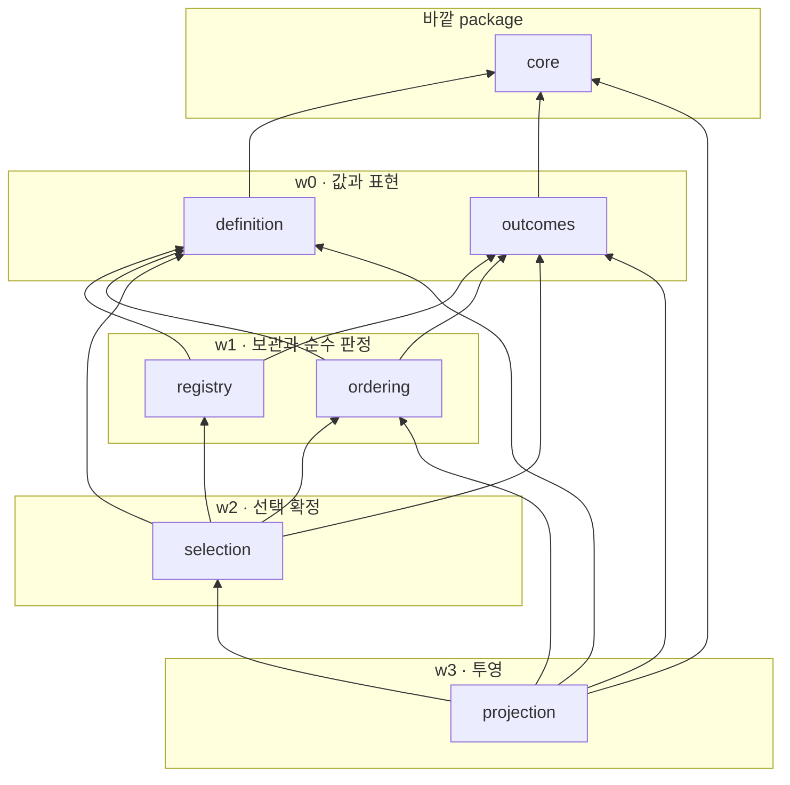
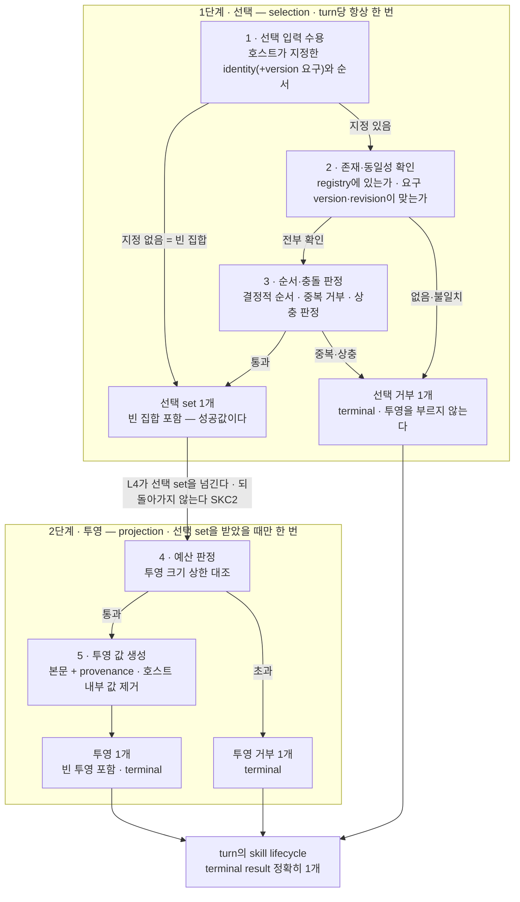
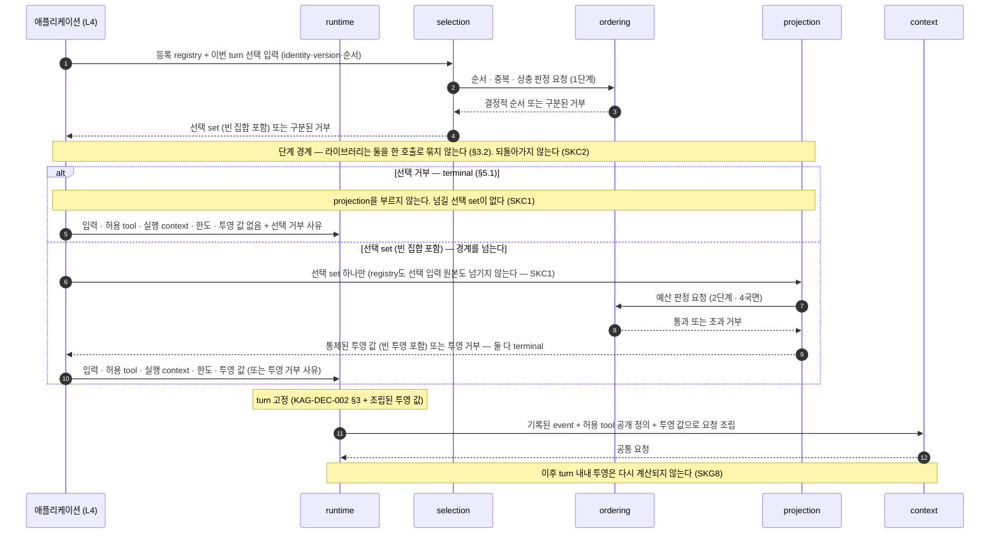

# skills package 경계 — 명시적 등록·선택 입력, prompt projection, turn 고정과 신뢰 경계

KAG-DEC-001이 `skills`에 배정한 “skill 등록, 선택, 버전 관리, prompt 투영”이라는 책임을 **어떤 파일에 어떤 종류의 것으로 나눠 담을지**, **호스트가 등록한 것이 어떻게 이번 turn의 선택 set이 되고 그 set이 어떤 통제를 거쳐 model에 닿는 투영 값이 되는지**, 그리고 **skill이 실행 표면·권한·정책을 넓히지 못하게 하는 경계가 무엇인지** 제안한다. 구조 옵션 비교와 파일 후보 트리, 파일별 역할과 타입 범주, 내부 의존 방향, skill identity/version/revision의 식별과 turn 고정, 선택·순서·충돌·예산 판정, 투영 경계와 provenance·신뢰 등급, prompt injection과 민감정보 경계, contract test seam까지가 대상이고 **exact signature·prompt syntax·skill 저장 포맷·selector 알고리즘·sync/async 형태·packaging/distribution은 대상이 아니다.**

> baseline의 날것 입력을 spec으로 내리기 전에 적용 방향을 정하는 문서.
> 기능 계약 상세는 `20-spec/`, 실제 작업 순서는 `30-work/`에 둔다.

> **상태 `proposed` — 사용자 리뷰 대기.** 이 문서의 §Decision 이하는 전부 **권고안**이며 아직 이 제품의 결정이 아니다. 사용자가 확정하기 전에는 어떤 파일도 만들지 않는다. KAG-BL-001·KAG-DEC-001·KAG-DEC-002의 `accepted`는 이 문서가 바꾸지 않는다 — 이 문서는 그 위에 쌓일 뿐 되돌리지 않는다. KAG-DEC-003·KAG-DEC-004·KAG-DEC-005·KAG-DEC-006·KAG-DEC-007은 여전히 `proposed`이며, 이 문서는 그 다섯을 **확정 사실이 아니라 제안된 입력**으로만 참조한다(§0.2).

## Context

- 관련 baseline: [[baseline-001-provider-neutral-llm-runtime|KAG-BL-001]]
- 선행 결정: [[decision-001-runtime-directory-boundaries|KAG-DEC-001]] (accepted), [[decision-002-turn-runtime-flow|KAG-DEC-002]] (accepted), [[decision-003-core-contract-boundaries|KAG-DEC-003]] (proposed, 리뷰 대기), [[decision-004-process-boundaries|KAG-DEC-004]] (proposed, 리뷰 대기), [[decision-005-provider-boundaries|KAG-DEC-005]] (proposed, 리뷰 대기), [[decision-006-tools-boundaries|KAG-DEC-006]] (proposed, 리뷰 대기), [[decision-007-sessions-boundaries|KAG-DEC-007]] (proposed, 리뷰 대기)
- 문제/기회
  - KAG-DEC-001은 `skills`를 L2 capability package로 두고 **`core`만 참조**하게 했다. 책임은 “skill 등록, 선택, 버전 관리, prompt 투영”이고, **tool 실행과 provider 형식은 명시적으로 제외**했다.
  - KAG-DEC-002는 skills를 **최소 state machine 밖**에 두었다. §6의 추후 확장 후보 첫 줄이 “skills 등록·선택·prompt 투영 — 최소 tool loop에 필요하지 않고, instruction 선택 정책이 먼저다. 추가한다면 **요청 조립 단계의 입력으로만 들어오고 새 phase를 만들지 않는다**”이다. 같은 §6의 **완전 제외** 목록에는 provider 내장 skill과 dynamic tool/skill discovery와 plugin marketplace가 들어 있다.
  - KAG-DEC-006은 반대편에서 같은 자리를 가리켰다. tool의 출처는 **언제나 호스트의 명시적 등록**이고(RG1), 허용 subset은 turn 내내 불변이며(RG8), 되먹임이 실행 표면을 넓히지 않는다. skill이 그 규율의 예외가 되어서는 안 되는데, skill은 tool과 달리 **자유 텍스트로 model의 행동을 바꾸는 것이 목적**이라 같은 규율을 적용할 자리가 아직 없다.
  - 그런데 그 사이가 비어 있다. **호스트가 등록한 skill이 어떻게 이번 turn의 선택이 되고, 그 선택이 어떤 통제를 거쳐 model에 닿으며, 그 텍스트가 무엇을 할 수 있고 무엇을 할 수 없는지**가 아무 데도 정의돼 있지 않다. 지금 상태로 skill 하나를 붙이면 다섯 가지가 즉시 문제가 된다.
    1. **skill이 최소 loop의 필수 요소로 스며든다.** “요청 조립에 skill instruction을 넣자”가 자연스러워 보이는 순간, 조립 코드가 skill을 전제하게 되고 skill 없이 도는 경로가 사라진다. 그러면 KAG-DEC-002 §6이 skills를 “**이번에 넣을 것**”이 아니라 “**추후에 넣으면 좋을 것**”으로 분류한 판단이 문서에만 남는다.
    2. **`loader`라는 이름 하나가 자동 탐색을 정당화한다.** REF-0007 설계 노트의 `skills/loader.py` 가안은 “어딘가에서 읽어온다”를 이름으로 이미 인정하고 있다. 읽어오는 자리가 생기면 곧 디렉터리 규약이 생기고, 그 다음은 plugin과 marketplace다 — KAG-DEC-002 §6이 완전 제외한 경로다.
    3. **투영과 조립의 경계가 사라진다.** skill 본문을 아는 코드가 곧 “그 본문을 프롬프트 어디에 어떻게 붙일지”를 알고 싶어진다. 그 순간 `context`가 소유해야 할 최종 요청 조립이 `skills`로 넘어오고, 조립이 두 곳에서 일어난다.
    4. **선택이 model에게 넘어간다.** “필요한 skill을 model이 고르게 하자”는 편의는 크지만, 그 순간 실행에 영향을 주는 표면이 turn 도중 바뀐다. KAG-DEC-002 §3의 snapshot과 KAG-DEC-006 RG8이 지키던 것이 skill 축에서만 뚫린다.
    5. **신뢰 경계가 비어 있다.** skill instruction은 **model prompt에 그대로 들어가는 자유 텍스트**다. tool 공개 정의도 model에 나가지만 그것은 이름·설명·입력 schema라는 좁은 구조이고, skill은 정의상 “model이 이렇게 행동하게 하라”는 글이다. 등록된 것과 model이 읽는 것 사이에 아무 판정이 없으면, skill 본문이 tool 권한을 요구하거나 다른 skill을 켜라고 지시하거나 자기 자신을 갱신하라고 적는 경로가 **문서상 금지되지 않은 채로** 열려 있게 된다.
  - 공개 계약을 package 하나씩 의존 그래프의 **아래에서 위로** 내려가기로 했고, `core`(L0, KAG-DEC-003) · `process`(L1, KAG-DEC-004) · `providers`(L2, KAG-DEC-005) · `tools`(L2, KAG-DEC-006) · `sessions`(L2, KAG-DEC-007) 다음이 같은 L2의 `skills`다. 남은 L2는 `context` 하나이고, `skills`를 그 앞에 두는 이유는 KAG-DEC-002 §6이 skill 투영을 **`context`의 입력**으로 규정했기 때문이다 — 입력을 만드는 쪽이 먼저 정의되어야 `context`가 무엇을 받는지 쓸 수 있다.
- 결정이 필요한 이유
  - `skills`는 이 라이브러리에서 **“넣지 않기로 한 것”이 구조로 유지되는지 시험되는 자리**다. KAG-BL-001은 provider의 내장 skill·내장 tool·자동 탐색에 의존하지 않는 것을 존재 이유로 적었는데, 정작 자기 skills package에 filesystem loader를 두면 같은 문제를 자기 손으로 다시 만든다. 다른 package에서는 “무엇을 소유하는가”가 어려웠지만 여기서는 **“무엇을 만들지 않는가”가 결정의 본체**다.
  - 동시에 **경계가 가장 흐린 자리**이기도 하다. skill 본문은 텍스트이고, 텍스트는 무엇이든 될 수 있다. 권한을 요구하는 문장, 정책을 재정의하는 문장, 다른 skill을 부르는 문장이 전부 같은 문자열 안에 들어간다. 그래서 이 문서는 **그 문장들이 실제로는 아무것도 바꾸지 못한다는 사실을 구조로 확인하는 데까지** 가고(§6), model이 그 문장을 따르는지 여부는 이 라이브러리가 보장하지 않는다는 것도 함께 적는다.

### 0.1 이 문서의 표기 규칙

- **“등록”은 호스트가 skill 하나를 사용 가능한 것으로 라이브러리에 넘기는 행위**를 뜻하고, **“선택”은 이번 turn에 그중 무엇을 어떤 순서로 투영할지 정하는 행위**를 뜻한다. 둘은 다른 시점, 다른 주체, 다른 값이다(§3).
- **“투영(projection)”은 선택된 skill을 `context`가 요청 재료로 쓸 수 있는 통제된 값으로 만드는 것**을 뜻한다. **문면 조립이 아니다** — 최종 요청의 어느 자리에 어떤 형식으로 실을지는 `context`의 것이다(§1).
- **“instruction 본문”은 model이 읽게 될 skill의 텍스트 내용**을 뜻하고, **“skill 자산(asset)”은 그 본문이 담긴 원본**을 뜻한다. **이 문서의 권고 구조는 “호스트가 본문을 채워 넘긴다”를 전제한다**(§8.2). 자산의 원본이 물리적으로 어디에 있는지는 호스트 사정이고, 그 전제를 바꾸려면 무엇을 함께 바꿔야 하는지는 §8.2가 적어 둔다.
- **“선택 set”은 한 turn에 대해 확정된 skill의 목록과 그 순서**를 뜻한다. 이 문서의 lifecycle(§5)은 **turn 하나당 한 번** 도는 것이고, KAG-DEC-006의 lifecycle이 tool call **한 건당** 도는 것과 단위가 다르다.
- **파일명·타입 범주·규칙 이름은 개념 라벨이다.** 클래스명·함수명·enum 값으로 승격하지 않는다. §Scope Out.
- **“권고”와 “확정”을 구분한다.** 이 문서 전체가 `proposed`이므로 모든 §Decision 항목은 권고이고, 근거가 약해 뒤집힐 수 있는 것은 그렇게 표시하거나 Open Questions로 뺀다.

### 0.2 선행 문서를 어떻게 참조하는가

| 문서 | 상태 | 이 문서에서의 취급 |
|---|---|---|
| KAG-BL-001 | accepted | 목표·보안 모델·reference 취급 규칙의 근거. 특히 “tool·skill 등록은 라이브러리와 호스트의 것”, “provider의 내장 skill은 공통 계약에 넣지 않는다”, “model 출력은 명령이 아니라 실행 요청이다”가 이 문서의 출발점이다. OQ-7(skill 선택 주체)은 **이 문서가 닫지 않는다** |
| KAG-DEC-001 | accepted | **변경하지 않는다.** `skills`의 책임, `skills → core`만 허용하는 의존 방향, `skills`가 `tools`·`context`·`runtime`을 참조하지 않는다는 경계를 그대로 소비한다. OQ-6(skill 자산의 거처)은 §8에서 선택지를 비교하되 **닫지 않는다** |
| KAG-DEC-002 | accepted | **변경하지 않는다.** §6의 분류(skills = 추후 확장 후보 · dynamic skill discovery와 provider 내장 skill = 완전 제외)와 그 경계(“요청 조립 단계의 입력으로만, 새 phase를 만들지 않는다”), snapshot 고정(§3), 되먹임이 실행 표면을 넓히지 않는다는 규칙(§5)을 소비한다. **§3의 snapshot 5항목에 skill 항목을 더하지 않는다** — 그것은 이 문서의 권한 밖이고 OQ-13으로 남긴다(§5.1) |
| KAG-DEC-003 | **proposed** | 확정 사실로 쓰지 않는다. message·content block(K1), 공통 요청(K2), turn 고정 값의 provider-neutral 부분(K8), 오류·거부 사유 표현(K7), 호환성 원칙(V3·V3′)을 “제안된 배치”로만 인용하고 **파일 이름이 아니라 범주 수준으로만** 연결한다. **KAG-DEC-003은 skill 관련 계약을 core 소유로 판정한 적이 없다** — K1~K10에 skill 항목이 없다는 사실 자체가 §4의 배치 판단에 입력이다(§4.4) |
| KAG-DEC-004 | **proposed** | 직접 참조하지 않는다. `skills`는 `process`를 import하지 않는다(KAG-DEC-001 §4). skill 자산을 파일에서 읽는 경로 자체를 만들지 않으므로(§2 SKG1·§5 SKI4) 외부 실행·외부 I/O 격리가 필요한 자리가 없다 |
| KAG-DEC-005 | **proposed** | 확정 사실로 쓰지 않는다. 소비하는 것은 **경계의 성질** 하나다 — provider는 공통 요청을 변환할 뿐이고 provider 내장 skill·harness 기능에 의존하지 않는다(§Scope). skill 투영 값은 `context`를 거쳐 공통 요청의 일부가 된 뒤에야 adapter에 닿는다 |
| KAG-DEC-006 | **proposed** | 확정 사실로 쓰지 않는다. 소비하는 것은 **패턴과 불변식의 성질**이다 — 등록/허용/공개 표면 세 값의 분리(§2.1), “출처는 언제나 호스트의 명시적 등록”(RG1), “snapshot이 turn 내내 불변”(RG8), “1~5국면 없이 handler에 닿는 경로가 없다”(TI2), “model이 주장한 권한을 신뢰하지 않는다”(TI4). **이 문서의 §6은 그 위에 “skill 본문이 그 판정을 우회할 수 없다”를 더한다.** 두 문서가 함께 뒤집히면 §6의 근거가 흔들린다 |
| KAG-DEC-007 | **proposed** | 거의 참조하지 않는다. `skills`는 아무것도 기록하지 않고(SKI7) `sessions`를 import하지 않는다. 다만 **재현하려면 identity·version·revision이 어딘가 남아야 한다**는 사실은 남고, 무엇을 남길지는 `runtime`의 결정이다(§7 SKR6, KAG-DEC-002 OQ-7과 이어진다) |
| REF-0007 설계 노트 | read-only | 초기 범위의 근거. “skills = 추후에 넣으면 좋을 것 · 독립 확장 모듈”, “호스트가 skill을 명시적으로 등록하고 `context`에 prompt projection만 제공”, “provider 내장 skill과 자동 탐색은 사용하지 않음”이 이 문서의 입력이다. 노트의 파일 가안(`definitions`·`registry`·`loader`)은 **확정 API가 아니며, 이 문서는 그중 `loader`를 명시적으로 뒤집는다**(§4.1) |
| 사내 운영 서비스의 server-owned tool loop | read-only | 이 문서에서는 **거의 쓰지 않는다.** 그쪽 사례에는 skill 축이 없다. 일반화해 옮기는 것은 “접근 선언에 기본값을 두지 않는다”와 “거부는 축을 구분해 남긴다”라는 성질 둘뿐이고, 조직·업무·데이터와 코드·식별자는 옮기지 않았다 |
| 개인 clean-room 연구 아카이브 | read-only, 개념만 | 실행하지 않았고 코드·문자열·식별자·비공개 protocol을 옮기지 않았으며 이 문서에서 출처로 인용하지 않는다. 이 제품 언어로 다시 쓴 개념은 하나다 — **대화에 걸쳐 남는 상태와 turn마다 새로 잡는 상태를 나누지 않으면 turn이 쌓일수록 무한히 커진다.** 이 문서에서는 “선택 set은 turn의 것이고 registry는 turn의 것이 아니다”(§3)로 나타난다 |

## Options

**초기 복잡도, 등록 출처의 통제(호스트 명시 등록 외의 경로가 생기지 않는가), 선택 주체의 명시성(누가 골랐는지가 구조에 남는가), 투영 경계의 유지(어디까지가 `skills`이고 어디부터가 `context`인가), 확장 비용(새 skill·새 판정이 늘 때 무엇이 열리는가)** 다섯 축으로 비교했다.

축 하나를 미리 정확히 해 둔다. 이 package는 다른 다섯과 성질이 다르다 — **소유할 책임의 양이 적고, 하지 말아야 할 일의 목록이 길다.** `tools`는 판정 축이 많아서 파일이 나뉘었고 `sessions`는 계약과 구현이 갈려서 나뉘었지만, `skills`가 나뉘어야 할 이유가 있다면 그것은 **“하지 않기로 한 것이 파일 경계로 드러나는가”**다. 그래서 아래 비교는 파일 수의 미학이 아니라 금지의 가시성을 본다.

| Option | Description | Pros | Cons | Notes |
|---|---|---|---|---|
| A. 단일 `registry.py` | 등록·선택·순서·투영을 한 module에 둔다. 이 package는 작으므로 한 파일로 충분하다는 안 | 초기 복잡도 최저. skill이 한 개인 첫 사례에서 읽을 것이 한 곳뿐이다. 등록에서 투영까지의 흐름이 한 함수로 보인다 | **금지가 구조에 남지 않는다.** “여기서 파일을 읽지 않는다”, “여기서 문면을 만들지 않는다”, “여기서 model 출력을 보지 않는다”는 세 금지가 전부 같은 파일 안의 관습이 되고, 그것을 어긴 코드는 diff에서 다른 코드와 구분되지 않는다. 특히 **투영과 조립의 경계**(문제 3)가 한 파일 안에서는 “함수를 하나 더 만드는 일”로 보인다 | 비권고 |
| B. 관심사별 평면 module + 총순서 고정 | 등록 단위 값 · 결과 표현 · registry와 등록 가드 · 순서·충돌 판정 · turn 선택 확정 · 투영 값 생성을 각각 module로 두고, module 간 방향을 총순서로 고정한다 | **금지가 파일 경계와 일치한다.** 외부 읽기 경로가 없다는 것을 “`skills/` 안에 파일·네트워크 접근이 없는가”라는 파일 단위 질문으로 확인할 수 있다(§8.4 seam 6). 투영을 만드는 코드가 한 파일에만 있어 조립이 새어 들어오는 지점이 하나로 좁혀진다. 순수 판정(순서·충돌)이 등록 보관과 분리되어 고정 입력으로 검증된다. `tools`·`sessions`와 같은 읽는 법을 쓴다 | module 6개는 skill이 한 개인 첫 사례에 확실히 많고, `ordering`·`outcomes`는 처음에 짧다. 총순서를 언어가 강제하지 않는다 | **권고** |
| C. skill 자산 형식별·도메인별 중첩 package | `skills/markdown/` · `skills/inline/`처럼 자산 형식으로 나누거나, 도메인(`skills/document/` 등)별 하위 package를 둔다 | 형식이 폴더로 드러난다. 새 형식을 더할 때 자리가 자명하다 | **분류 축이 틀렸다.** 형식은 자산을 읽어들이는 쪽의 관심사인데, §2 SKG1·§5 SKI4가 **읽어들이는 주체를 이 package에서 없앤다.** 나눌 대상 자체가 여기 없다. 도메인별 분리는 더 나쁘다 — **이 package에는 skill 내용이 살지 않는다.** 내용은 호스트의 것이고(§8), 도메인 폴더를 만들면 라이브러리가 skill을 소유하는 것처럼 읽힌다 | 기각 |
| D. loader 기반 자동 탐색 | REF-0007 가안대로 `loader.py`를 두고, 지정된 디렉터리·plugin 진입점·원격 registry에서 skill을 찾아 등록한다 | 호스트가 쓸 때 가장 짧다. skill 파일을 놓기만 하면 된다. 완성형 agent 제품의 사용 감각과 같다 | **이 제품이 명시적으로 제외한 것이다.** KAG-DEC-002 §6의 완전 제외 목록에 dynamic tool/skill discovery와 plugin marketplace가 둘 다 있다. 구조적으로도 세 가지가 동시에 깨진다 — (a) “무엇이 등록됐는가”가 파일시스템·설치 상태의 함수가 되어 사후 복원이 불가능해지고, (b) turn 중 파일이 바뀌면 같은 turn이 재현되지 않으며, (c) **skill 본문은 model prompt에 그대로 들어가는 텍스트이므로, 자동 탐색은 곧 “디렉터리에 파일을 놓을 수 있는 누구나 model의 행동을 바꿀 수 있다”가 된다.** 이것은 편의가 아니라 공급망 경로다 | 기각 |

핵심 trade-off를 숨기지 않는다: **A가 초기 복잡도에서 크게 이기고, 이 package에서는 그 차이가 다른 어느 package보다 크다.** `tools`는 판정 축이 다섯이라 나눌 것이 있었지만 `skills`는 소유 책임이 일곱이고 그중 넷이 짧다. skill 한 개짜리 첫 사례에서 B의 module 6개는 명백히 과하다.

B를 권고하는 이유는 소유의 양이 아니라 **금지의 성질**이다. 이 package에서 틀렸을 때 생기는 일은 실행 실패가 아니라 **조용한 범위 확장**이다 — 파일을 한 번 읽기 시작하면 그 다음은 디렉터리 규약이고, 문면을 한 번 만들기 시작하면 그 다음은 조립이다. A에서 그 확장을 막는 방법은 리뷰어가 함수 본문을 읽는 것뿐이고, B는 그것을 “이 파일이 무엇을 import하는가”라는 질문으로 바꾼다. `tools`에서 같은 판단을 “handler를 부르는 코드가 `executor` 밖에 있는가”로 표현했고, 여기서는 “model에 나갈 값을 만드는 코드가 `projection` 밖에 있는가”와 “외부를 읽는 코드가 어디에도 없는가” 둘이다.

과설계 경계도 명시한다. B가 module을 6개로 나누는 것은 **§1에서 `skills`가 소유한다고 판정한 책임이 그만큼이기 때문**이지 다른 package와 개수를 맞추기 위해서가 아니다. 소유할 책임이 없는 파일은 만들지 않는다 — 예컨대 skill 본문을 프롬프트 문면으로 배치하는 파일도, skill을 고르는 도메인 규칙을 담는 파일도 두지 않는다. 앞은 `context`의 일이고(KAG-DEC-001 §2), 뒤는 호스트의 제품 결정이다(§1).

## Decision

> 아래는 전부 **권고안**이다. 사용자 확정 전에는 결정이 아니다.

- 권고: **Option B — 관심사별 평면 module 분리 + module 간 총순서 고정.**
- 비권고: Option A(단일 `registry.py`).
- 기각: Option C(자산 형식별·도메인별 중첩 package), Option D(loader 기반 자동 탐색). D는 KAG-DEC-002 §6의 완전 제외를 그대로 유지하는 것이며, 이 문서가 새로 내리는 판단이 아니라 **이미 내려진 판단을 구조로 확인하는 것**이다.
- 미결로 남김: skill 자산의 보관 방식, 선택 주체(호스트 지정만인가 별도 selector 자리를 둘 것인가), exact prompt syntax와 투영 값의 형태, 저장 포맷, 순서 결정 기준, 충돌 판정의 범위, 예산 단위와 값, sync/async 형태, 실패의 값/예외 표현, packaging/distribution (→ §Open Questions).

이하 §1~§8이 Option B의 권고 내용이다.

### 1. skills가 소유하는 것과 소유하지 않는 것

먼저 책임 범주를 못박는다. 파일 배치는 그 다음이다(§4).

| # | 책임 범주 | skills가 소유하는 이유 |
|---|---|---|
| SK1 | **등록의 수용** — 호스트가 넘긴 skill 정의(identity·version·instruction 본문·선택 메타·출처 표시)를 한 등록 단위로 받아 보관한다 | KAG-DEC-001 §2가 “skill 등록”을 이 package에 배정했다. REF-0007도 “호스트가 skill을 명시적으로 등록”까지 적었고, 그 수신자가 여기다 |
| SK2 | **등록 시점 가드** — identity 중복, 필수 값 누락, 본문 부재, 선언 모순을 등록에서 거부한다 | KAG-DEC-006 T2와 같은 성격이다. 잘못된 카탈로그는 선택 시점에 고칠 수 없고, 같은 identity가 두 번 실리면 어느 본문이 나갔는지 사후에 알 수 없다 |
| SK3 | **registry revision** — 등록 원본이 어느 시점의 것인지를 식별하는 값의 발급과 보존 | 같은 identity·같은 version이라도 등록 내용이 바뀌었을 수 있다. 그 시점을 식별할 수 있는 것은 등록을 보관하는 쪽뿐이다 |
| SK4 | **turn 선택 set 확정** — 호스트가 명시한 선택 입력을 등록된 것과 대조해 이번 turn의 선택 set 하나로 만든다 | KAG-DEC-002 §3의 취지 그대로다. 이번 turn에 무엇이 model에 실렸는지를 사후에 복원할 수 있어야 한다 |
| SK5 | **순서·충돌·예산 판정** — 복수 skill의 결정적 순서 부여, 중복·충돌의 판정, 투영 크기 상한의 판정 | 두 개 이상이 실리는 순간 “어느 것이 먼저인가”가 결과를 바꾼다. 그 규칙이 없으면 같은 선택이 다른 투영을 낸다 |
| SK6 | **prompt projection 값 생성** — 선택 set을 `context`가 쓸 수 있는 **통제된 투영 값**으로 만든다 | KAG-DEC-002 §6이 skills의 출력을 “요청 조립 단계의 입력”으로 규정했다. 그 입력의 형태를 만드는 것이 여기다. **문면 배치는 아니다** |
| SK7 | **provenance와 신뢰 등급 표시의 보존·전달** — 투영 값의 각 조각이 어느 identity·version·revision에서 왔는지, 호스트가 어떤 신뢰 등급으로 등록했는지가 값에 따라붙는다 | 남지 않으면 model 출력이 이상할 때 어느 skill 때문인지 복원할 수 없다. 신뢰 등급은 **자리만** 갖고 그 값의 의미는 호스트가 정한다(§6 PJ5) |

**skills가 소유하지 않는 것.** 아래가 `skills/` 아래에 나타나면 그 자체가 위반이다.

| 두지 않는 것 | 사는 곳 | 근거 |
|---|---|---|
| 최종 prompt·request 조립, 투영 값을 요청 어디에 어떤 형식으로 실을지, compaction | `context` | KAG-DEC-001 §2. **skills는 선택 결과를 통제된 값으로 제공하는 데서 멈춘다** |
| tool 등록·허용 subset·schema 검증·정책 판정·handler 실행 | `tools` | KAG-DEC-001 §4. `skills`는 `tools`를 import하지 않는다. **skill은 tool 권한을 만들지도 넓히지도 않는다** (§6 PJ1) |
| provider 선택·변환·wire·capability | `providers` | KAG-DEC-001 §5. provider 내장 skill은 계약에 넣지 않는다 (KAG-BL-001) |
| turn loop, 반복 진입 판정, step 회계, 종료 state | `runtime` | KAG-DEC-002 §1·§4.3. `skills`는 **turn 하나에 대한 선택과 투영**의 계약이다 |
| session event 기록, 무엇을 언제 남길지의 결정 | `runtime` · `sessions` | KAG-DEC-002 §4. **`skills`는 아무것도 기록하지 않고 값만 돌려준다** (§5 SKI7) |
| model 호출, model 응답의 판정, 되먹임 | `runtime` · `providers` | KAG-DEC-002 §4.1. `skills`는 model 출력을 보지 않는다 (§5 SKI2) |
| **filesystem scan · plugin loader · marketplace · remote registry · dynamic discovery** | (어디에도 두지 않음) | KAG-DEC-002 §6 완전 제외. 실행·노출 표면이 turn 도중 또는 배포 사이에 조용히 바뀐다 |
| **model 주도 설치·자기선택·권한 상승** | (어디에도 두지 않음) | KAG-BL-001 보안 모델. model 출력은 실행 요청이지 설정 변경이 아니다 |
| 어떤 상황에 어떤 skill을 쓸지의 도메인 규칙 | 호스트 애플리케이션 | 제품 결정이다. 라이브러리는 **선택 입력을 받는 자리와 그 대조 규칙**만 갖는다(선택 주체는 → OQ-1) |
| skill 본문의 저작·번역·검수·승인 절차 | 호스트 애플리케이션 | 같음. 라이브러리는 “등록된 본문”만 본다 |
| 신뢰 등급의 정의(어떤 등급이 있고 무엇을 뜻하는가), 서명·검증 인프라 | 호스트 애플리케이션 | KAG-DEC-006 §6.2와 같은 판단. 라이브러리는 값을 불투명하게 다루고 자리만 만든다 (§6 PJ5) |
| 로깅 destination 선택, 파일 기록, telemetry 전송 | 호스트 애플리케이션 | 라이브러리는 값을 돌려주고 어디에 쓸지 고르지 않는다 (§7) |
| skill 목록·선택 입력의 조립과 주입 시점 결정 | L4 애플리케이션 | KAG-DEC-001 §4 “조립은 여기서만” |

한 줄 덧붙인다. **이 package에는 skill 내용이 살지 않는다.** 여기 있는 것은 전부 “남이 쓴 글을 **받아** 보관하고, 고르고, 통제된 값으로 내보내는” 코드다 — **받는다**는 말이 중요하다. 읽어오지 않는다. 첫 사례의 문서 답변 skill도 라이브러리가 아니라 호스트(`examples/`)가 소유한다(KAG-DEC-001 §1). 본문의 원본이 물리적으로 어디에 있는지는 호스트 사정이며, 이 전제를 바꾸는 대안과 그 대가는 §8.2가 다룬다.

### 2. skills는 왜 “조립 가능한 독립 확장 모듈”인가

KAG-DEC-002 §6은 skills를 **추후 확장 후보**로 분류했다. 그 분류가 문서에만 남지 않으려면 “확장 모듈”이 무엇을 뜻하는지 검증 가능한 형태로 적혀야 한다. 규칙 다섯 개로 못박는다.

| # | 규칙 | 어기면 생기는 일 |
|---|---|---|
| SKB1 | **skill 없이 turn이 완결된다.** 선택 set이 빈 집합인 것은 정상이고 실패가 아니며, 최소 tool loop의 어떤 phase도 skill을 요구하지 않는다 | skills가 최소 runtime의 필수 요소가 된다. KAG-DEC-002 §6이 “이번에 넣을 것”과 “추후에 넣으면 좋을 것”을 나눈 판단이 무의미해진다 |
| SKB2 | **새 phase를 만들지 않는다.** 투영 값은 KAG-DEC-002 §1의 `context구성` phase에 **입력으로만** 들어간다 | KAG-DEC-002 §6이 명시한 경계다. phase가 늘면 진행 phase 9가 흔들리고, 그것은 accepted 결정의 개정이다 |
| SKB3 | **`skills`는 `core` 밖의 어떤 형제 package도 참조하지 않는다** | KAG-DEC-001 §4. 특히 `context`를 참조하면 “투영한 김에 조립까지”가 즉시 가능해진다(§4.3 규칙 4) |
| SKB4 | **skills를 조립에서 빼도 다른 package의 파일이 열리지 않는다.** 이것이 “독립 확장 모듈”의 판정 기준이다 | 다른 package가 skill을 전제하면 그것은 확장 모듈이 아니라 숨은 필수 부품이다 |
| SKB5 | **skills를 넣어도 turn의 불변식·종료 조건·판정 축이 늘지 않는다.** 투영은 값을 하나 더 만들 뿐 새 판정을 도입하지 않는다 | KAG-DEC-002 §4의 I1·I2·I3와 §4.3의 반복 진입 조건이 skill 축 때문에 다시 열리면, 확장 모듈 하나가 loop 계약을 개정하는 셈이 된다 |

SKB4를 뒤집어 읽으면 이 문서의 실질적 성공 조건이 된다: **`skills/`를 통째로 지워도 `core`·`process`·`providers`·`tools`·`sessions`·`runtime`은 컴파일되고 첫 vertical slice는 그대로 돈다.** 그렇지 않다면 이 문서의 어딘가가 틀린 것이다.

### 3. 등록 · 선택 · 투영의 분리

KAG-DEC-006이 tool에 대해 등록/허용/공개 표면 세 값을 나눈 것과 같은 구조를 skill에 적용한다. 같은 구조를 쓰는 이유는 대칭이 아니라, **둘 다 “호스트가 등록한 것 중 이번 turn에 무엇이 model에 나가는가”라는 같은 질문**이기 때문이다.

#### 3.1 세 개의 값

| 값 | 무엇 | 언제 만들어지나 | 누가 만드나 | 누가 보나 |
|---|---|---|---|---|
| **등록 registry** | 사용 가능한 등록 단위 전체. identity + version + 본문 + 선택 메타 + 출처·신뢰 표시 | 애플리케이션 시작 시점(또는 호스트가 정한 등록 시점) | L4 호스트가 넘기고 `skills`가 보관 | `skills`만. **밖으로 통째로 나가지 않는다** |
| **turn 선택 set** | 이번 turn에 투영될 대상과 그 순서의 판정 결과 | turn 시작 시점, 정확히 한 번 | 호스트의 선택 입력 + `skills`의 대조·판정 | `runtime`(고정), `context`(투영 값을 통해) |
| **prompt projection** | 선택 set에서 model에 나갈 본문과 provenance만 남긴 통제된 값 | 선택 set이 확정된 **직후**, 같은 turn 고정값 위에서 (§3.2) | `skills` | `context` → `providers` → model |

세 값은 **타입이 서로 다르므로 집합 포함 관계로 쓰지 않는다.** 실제로 보장하려는 것은 관계 셋이고, 각각 성질이 다르다.

| 관계 | 무엇을 보장하나 | 타입 |
|---|---|---|
| **상한** — 선택 set의 identity·version 집합 ⊆ registry의 identity·version 집합 | registry에 없는 것은 어떤 경로로도 선택되지 않는다 | 같은 타입(등록 식별자)끼리의 집합 포함이다. **여기서만 ⊆를 쓴다** |
| **변환** — 선택 set → projection | 선택 set의 각 원소가 model에 나갈 조각 하나로 바뀐다. 조각을 더하지도 원소를 빼지도 않는다 | **다른 타입 사이의 사상(map)이다.** 등록 단위와 투영 조각은 담는 것이 다르다 — 전자에는 handler 없는 선택 메타·출처·신뢰 표시가 있고 후자에는 본문과 provenance만 있다 |
| **출처 추적** — projection의 각 조각 → 선택 set의 원소 하나 | 나간 텍스트가 어느 identity·version·revision에서 왔는지 역으로 찾을 수 있다 | 변환의 역방향 대응이다. 이것이 성립해야 PJ4가 값으로 실현된다 |

이 셋을 한 줄로 줄이면: **선택은 registry를 넘지 못하고, 투영은 선택 set만을 입력으로 받으며, 나간 조각은 전부 출처가 하나로 정해진다.**

`tools`와 다른 점 하나를 명시한다. tool에서는 “노출 목록과 실행 판정이 **같은 계산을 쓰는가**”가 핵심 위험이었다(RG4) — 두 벌이 갈라지면 보이는데 못 쓰는 tool이 생기기 때문이다. **skill에는 실행 축이 없으므로 그 위험이 없고, 따라서 선택과 투영을 한 계산으로 묶을 이유도 없다.** skill의 위험은 반대편에 있다 — 투영은 곧 노출이고, 노출된 텍스트는 model의 행동을 바꾼다. 그래서 여기서 지켜야 할 것은 “두 계산이 같은가”가 아니라 **“투영이 선택 set 말고 다른 것을 보지 않는가”와 “투영에 닿는 경로가 하나인가”** 둘이다(§3.2·§4.3 규칙 1).

#### 3.2 선택과 투영은 하나의 계산인가 — 고정 순서 2단계

§3.1의 관계표는 “투영은 선택 set만을 입력으로 받는다”를 요구하지만, 그것이 **한 번의 호출인지 두 번의 호출인지**는 아직 정하지 않은 상태다. 여기서 하나로 정한다.

- **권고: 분리된 순수 2단계 + L4가 고정 순서로 조립.** `selection`이 선택 set 하나를 내고, 그 값을 입력으로 `projection`이 투영 하나를 낸다. 라이브러리는 둘을 한 호출로 묶는 facade를 두지 않는다.
- **비권고: 단일 원자 facade.** 등록 registry와 선택 입력을 받아 투영까지 한 번에 돌려주는 진입점 하나.

근거 넷.

1. **facade는 §4.3 방향 규칙 1과 충돌한다.** 규칙 1은 “`projection`을 아무도 참조하지 않는다”이고, 그것이 “model에 나갈 값을 만드는 경로가 하나”를 파일 단위 질문으로 만드는 장치다. facade를 두면 그 파일이 `projection`을 참조하게 되고, 규칙 1은 “`projection`을 참조하는 것은 facade 하나뿐”으로 약해진다. 그 순간 검사는 파일 목록 비교에서 “facade가 무엇을 하는가”를 읽는 일로 되돌아간다.
2. **두 값의 수명이 다르다.** 선택 set은 turn 고정 값의 재료로 `runtime`에 넘어가고(§5.3), 투영은 요청 재료로 `context`에 넘어간다. 두 소비자가 다르므로 두 값이 각각 이름을 갖는 편이 조립에서 덜 헷갈린다.
3. **단독 검증이 유지된다.** §8.4의 seam 3(선택 단독)과 seam 4(투영 결정성)는 두 단계가 각각 입력→출력인 것에 기대고 있다. facade면 둘 중 하나만 재현하려 해도 등록 registry부터 세워야 하고, **선택 거부 turn에서 투영이 실행되지 않는다는 것**(§5.1)도 안쪽 분기가 되어 밖에서 관찰되지 않는다.
4. **`tools`와 다른 선택인 이유가 §3.1에 이미 있다.** `tools`가 노출과 실행을 한 계산에 묶은 것은 RG4 때문인데, skill에는 그 요구가 없다.

대신 **2단계를 나눈 대가**를 두 규칙으로 갚는다. 이것이 “같은 계산”이 하던 일을 대신한다.

| # | 규칙 | 어기면 생기는 일 |
|---|---|---|
| SKC1 | **투영의 입력은 선택 set 하나뿐이다.** `projection`은 등록 registry도 호스트 선택 입력 원본도 다시 보지 않는다. **선택 거부는 선택 set이 아니므로 투영에 넘기지 않는다** — 선택이 거부로 끝나면 투영 단계는 아예 실행되지 않는다(§5.1) | 투영이 registry를 다시 보면 “선택되지 않았지만 등록된 것”이 나갈 경로가 생기고, §3.1의 상한 관계가 투영 단계에서 무의미해진다. 이것이 §4.3 방향 규칙(`projection`은 `registry`를 참조하지 않는다)의 실질이다. 거부를 넘기는 쪽도 같은 위반이다 — 그 순간 투영이 “선택 set 말고 다른 것”을 보게 된다 |
| SKC2 | **순서는 고정이고 되돌아가지 않는다.** 선택 → 투영 한 방향뿐이고, 투영 결과가 선택을 다시 계산하게 하는 경로가 없다 | 투영 단계에서 예산이 초과됐을 때 “그럼 선택을 줄여서 다시”가 가능해진다. 그것은 조용한 축약(PJ7)을 다른 이름으로 되살리는 일이고, 호스트가 무엇을 요청했는지와 무엇이 나갔는지가 갈린다 |

**예산 초과는 투영 단계의 거부이고, 줄여서 재시도할지는 호스트가 정한다.** 라이브러리가 대신 줄이지 않는다(PJ7·SKC2).

#### 3.3 분리 규칙 8개

| # | 규칙 | 어기면 생기는 일 |
|---|---|---|
| SKG1 | **skill의 출처는 언제나 L4 호스트의 명시적 등록이다.** filesystem scan·디렉터리 규약·plugin 진입점·marketplace·원격 registry·provider 내장 skill·runtime dynamic discovery 경로를 만들지 않는다 | KAG-DEC-002 §6 완전 제외. skill 본문은 model prompt에 그대로 들어가는 텍스트이므로, 자동 탐색은 “파일을 놓을 수 있는 누구나 model 행동을 바꿀 수 있다”가 된다 |
| SKG2 | **registry와 선택 set은 서로 다른 값이고 서로 다른 시점에 만들어진다.** 등록되어 있다는 사실이 이번 turn의 선택을 뜻하지 않는다 | 한 덩어리면 “이번 turn에 무엇이 실렸나”에 “등록된 전부”라고밖에 답할 수 없다 |
| SKG3 | **선택 입력은 호스트가 준다. model이 선택하지 않는다.** model 응답이 skill을 켜거나 끄거나 추가하거나 순서를 바꾸는 경로가 없다 | 실행에 영향을 주는 표면이 turn 도중 바뀌고, KAG-DEC-002 §3의 snapshot과 KAG-DEC-006 RG8이 skill 축에서만 뚫린다 |
| SKG4 | **선택 set에 고정되는 것은 identity·version·registry revision·순서다.** 호스트 자원·파일 경로·내부 식별자·secret은 투영 값에 들어가지 않는다 | model에 보내면 안 되는 것이 실린다. 경로가 실리면 그 경로가 곧 다음 공격 표면이다 |
| SKG5 | **선택 입력이 없으면 선택 set은 빈 집합이다.** “등록된 전부”로 읽지 않는다 | 등록만 해 두고 잊은 skill이 조용히 model 행동을 바꾼다. **KAG-DEC-006 OQ-11(tool 미지정 해석)을 여기서는 미결로 남기지 않는 이유는 SKB1 때문이다** — skill 없는 turn이 정상이므로 빈 집합이 기능 정지가 아니고, fail-closed 쪽을 골라도 잃는 것이 없다 |
| SKG6 | **조회·대조·투영 계산의 실패를 빈 집합으로 접지 않는다.** 실패는 실패다 | SKG5의 “지정 없음”과 “실패”가 같은 결과로 접히면, 일시 장애가 “원래 skill이 없는 turn”으로 위장된다 (KAG-DEC-006 RG6과 같은 방향) |
| SKG7 | **instruction 본문은 등록 시점에 확정된 값이다.** 선택·투영 시점에 파일·네트워크·외부 저장소를 다시 읽지 않는다 | turn 중 본문이 바뀌면 같은 turn이 재현되지 않고, 검사와 사용 사이에 내용이 갈리는 창이 생긴다 |
| SKG8 | **선택 set은 turn 시작에 확정되고 turn 내내 불변이다.** 거부·되먹임·중간 응답이 선택을 넓히지 않는다 | KAG-DEC-002 §5의 “되먹임은 실행 표면을 넓히지 않는다”가 skill 축에서 무너진다 |

#### 3.4 선택 set을 무엇이 좁히는가

선택 set은 두 입력의 교집합이고, **둘 다 좁히기만 하고 넓히지 않는다.**

| 입력 | 누가 주나 | 성격 |
|---|---|---|
| 등록 registry | 호스트(등록 시점) | 상한. 여기에 없는 것은 어떤 경우에도 투영되지 않는다 |
| 이번 turn의 선택 입력 | 호스트(turn 입력) | 호스트가 이번 대화·이번 사용자에게 쓰기로 한 목록과 순서. 없으면 빈 집합(SKG5) |

**model 출력은 입력이 아니다.** tool에서는 접근 축 판정이 세 번째 입력이었지만(KAG-DEC-006 §2.3), skill에는 실행 권한 축이 없으므로 그 자리가 비어 있다. 그 자리를 “model이 고른다”로 채우려는 것이 가장 자연스러운 유혹이고, SKG3이 그것을 막는다. **비-model selector(호스트가 주입하는 규칙 기반 선택기)를 둘 자리를 만들 것인지**는 판단이 갈려 미결로 남긴다(→ OQ-1). 어느 쪽이든 **선택의 최종 확정은 turn 시작 시점 한 번**이라는 것이 이 절이 확정하려는 부분이다.

### 4. 파일 후보 트리와 내부 방향

#### 4.1 파일 후보 트리

```text
src/kknaks_agents/skills/
├── __init__.py       # 공개 표면 (§8.1) — 호스트가 등록할 때 통과하는 자리
├── definition.py     # 등록 단위 — identity·version·본문·선택 메타·출처와 신뢰 표시   ← §1 SK1
├── outcomes.py       # 선택·투영 결과와 거부의 표현                                  ← §1 SK2·SK5의 표현
├── registry.py       # 등록 보관 · 등록 시점 가드 · revision · identity 조회          ← §1 SK1·SK2·SK3
├── ordering.py       # 복수 skill의 결정적 순서 · 중복/충돌 · 예산 판정 (순수)         ← §1 SK5
├── selection.py      # turn 선택 set 확정 — 선택 입력 ∩ registry, 동일성 대조         ← §1 SK4
└── projection.py     # 선택 set → 통제된 prompt projection 값 (문면 조립이 아니다)     ← §1 SK6·SK7
```

module 6개 + `__init__.py`다. 화살표는 **그 파일이 §1의 어느 책임을 명시적으로 소유하는가**를 가리키며, 책임과 파일이 개수로 1:1인 것은 아니다 — `registry`는 셋을 소유하고 `ordering`은 SK5 하나를 셋으로 나눠 담는다.

이름에 대한 판단 넷.

- **`loader.py`를 두지 않는다.** REF-0007 설계 노트의 `skills/loader.py` 가안을 **이 문서가 명시적으로 뒤집는 유일한 지점**이다. “loader”는 “어딘가에서 읽어온다”를 이름으로 인정하는 것이고, 그 자리가 존재하면 SKG1이 금지한 경로가 “이미 있는 파일에 함수를 하나 더하는 일”이 된다. 호스트가 내용을 채워 넘기므로(§8) **읽어오는 주체가 이 package에 없다.** 이름을 지우는 것이 규칙보다 강한 방어다.
- **`definition.py`이지 `skill.py`가 아니다.** 여기 사는 것은 skill 그 자체가 아니라 **호스트가 skill에 대해 선언한 것**이다. KAG-DEC-006이 `declaration.py`를 고른 것과 같은 판단이되 이름이 다른 이유가 있다 — tool에서는 실행 주체(handler)가 호스트에 남고 정의만 넘어오지만, skill에서는 **본문 자체가 등록 단위에 실릴 수 있다**(§8의 (가) 안). “선언”보다 “정의”가 그 상황을 덜 왜곡한다. REF-0007의 `definitions.py`와도 이어진다.
- **`projection.py`이지 `prompt.py`·`renderer.py`가 아니다.** 문면을 만드는 것은 `context`다(§1). 이 파일이 소유하는 것은 “무엇이, 어떤 순서로, 어떤 provenance를 달고, 얼마만큼 나가는가”까지이고 “그것이 요청의 어느 자리에 어떤 문자열로 놓이는가”는 아니다. 이름에 `prompt`를 넣으면 그 경계가 첫날부터 흐려진다.
- **`ordering.py`를 `selection`에서 뗀 이유는 순수성이다.** 순서·충돌·예산은 등록 보관을 몰라도 답이 정해지는 규칙이고, 떼어 놓아야 고정 입력으로 단독 검증된다(§8.4 seam 2). 다만 이 분리는 얇고, 첫 slice 뒤에 합치는 것을 재검토한다(→ OQ-11) — **이 문서에서 합쳐질 가능성이 가장 큰 후보다.**

#### 4.2 파일별 역할 · 타입 범주 · producer/consumer

“대표 타입/행동 범주”는 **어떤 종류의 것이 사는가**이지 확정 클래스명·함수명이 아니다.

| 파일 | 단일 역할 | 대표 타입/행동 범주 | 주로 만드는 쪽 (producer) | 주로 쓰는 쪽 (consumer) |
|---|---|---|---|---|
| `definition.py` | 호스트가 skill 하나에 대해 선언하는 것의 **형태**와 그 자체의 정합 가드 (§1 SK1) | 등록 단위 값(identity + version + instruction 본문 + 선택 메타 + 출처·신뢰 표시), 본문이 비어 있지 않다는 보장, 선언 자체의 모순 검사. **읽어오지 않고 고르지 않고 투영하지 않는다** | L4 호스트 (값 채우기), 이 파일 (형태·가드) | `registry`, `selection`, `projection` |
| `outcomes.py` | 선택·투영의 결과와 거부를 **값으로** 표현 (§1 SK2·SK5의 표현) | 선택 성공 결과(선택 set + 고정된 identity·version·revision), 거부 계열의 구분(존재·동일성·중복·충돌·예산·등록), 실패 표현. **“거부됨”만 남는 표현을 만들지 않는다** | 이 파일 (규칙), `registry`·`ordering`·`selection` (재료) | `runtime` (판정), L4 (관측) |
| `registry.py` | 등록 단위의 보관과 **등록 시점 가드**, revision (§1 SK1·SK2·SK3) | 등록 보관소, identity·version으로의 조회, revision 값의 발급·보존, 등록 거부 규칙(identity 중복·필수 값 누락·본문 부재·선언 모순). **고르지 않고 투영하지 않는다** | L4 호스트 (등록 호출) | `selection`, L4 (조립) |
| `ordering.py` | 복수 skill의 결정적 순서와 중복·충돌·예산 판정 (§1 SK5) | 순서 부여 규칙, 같은 identity 중복의 **거부**(조용한 중복 제거가 아니다), 선언된 상충 관계의 판정, 투영 크기 상한 대조. **저장하지 않고 본문을 바꾸지 않는다** | 이 파일 | `selection`, `projection` |
| `selection.py` | 이번 turn의 선택 set 확정 — **1단계의 끝**(§5) (§1 SK4) | 선택 입력과 registry의 대조, 요구 version·revision의 동일성 확인, 순서·충돌 규칙 적용, 빈 선택의 정상 처리(SKG5), 계산 실패의 표현(빈 집합이 아니다 — SKG6). **투영하지 않는다** | 이 파일 | `runtime` (turn 고정의 재료), `projection` (선택 set 타입 참조), L4 (호출·조립) |
| `projection.py` | 선택 set을 **model에 나갈 통제된 값**으로 만드는 유일한 자리 (§1 SK6·SK7) | 예산 판정(§5 4국면), 본문과 provenance·신뢰 표시만 남기는 투영, 호스트 자원·경로·내부 식별자의 제거(SKG4), 예산 초과의 거부(§6 PJ7). **입력은 선택 set 하나뿐이고**(SKC1) **이 package에서 model에 나갈 값이 만들어지는 유일한 파일**이다 | — | `context` (요청 재료로 소비), L4 (호출·조립) |
| `__init__.py` | 공개 표면 (§8.1) | — (정의를 두지 않는다) | — | L4 애플리케이션 |

네 줄 덧붙인다.

- **이 package에는 부작용이 없다.** 여섯 module 전부가 입력을 받아 답이 하나로 정해지는 판정과 값 생성이다. KAG-DEC-006의 `tools`가 `executor` 하나에 부작용을 몰아넣은 것과 대비되는데, 이유는 단순하다 — **skill은 실행되지 않는다.** 그래서 이 package의 위험은 “잘못 실행됨”이 아니라 “잘못 노출됨”이고, 그것이 §4.3 규칙 1이 `projection`을 겨냥하는 이유다.
- **`ordering`은 `registry`를 모른다.** 순서 규칙이 등록 보관을 알기 시작하면 “등록 순서대로”가 규칙에 섞이고, 그 순간 순서가 고정 입력으로 검증되지 않는다(순서 결정 기준 자체는 → OQ-8).
- **`selection`은 본문을 보지 않는다.** 고르는 데 필요한 것은 identity·version·revision·선택 메타이고 본문은 투영 시점에야 필요하다. 본문을 선택 판정의 입력으로 쓰기 시작하면 “본문에 이렇게 적힌 skill은 자동으로 켠다”가 가능해지고, 그것은 SKG3의 우회로다.
- **`projection`은 registry가 아니라 선택 set을 본다.** 투영 직전에 “이 identity가 이번 turn 선택에 있는가”를 확인하는 것이지 “등록되어 있는가”가 아니다(§5 SKI3).

#### 4.3 module 간 방향

KAG-DEC-001이 package 사이 방향을 정했듯 `skills/` 안에서도 방향을 정한다. **화살표는 항상 아래에서 위로만 간다. 같은 tier끼리는 서로 import하지 않는다.**



| Tier | module | 이 tier에 있는 이유 |
|---|---|---|
| w0 | `definition` · `outcomes` | `core`만 참조하는 값과 표현 규칙. 서로를 참조하지 않는다 |
| w1 | `registry` · `ordering` | 등록 단위를 읽고 보관하거나 순수 판정한다. **둘은 서로를 모른다** — 보관과 순서 규칙은 독립한 축이다 |
| w2 | `selection` | 보관된 것과 순서 규칙을 조합해 이번 turn의 선택을 만든다. `registry`와 `ordering` 둘 다 참조하는 유일한 module |
| w3 | `projection` | 선택 set을 model에 나갈 값으로 바꾼다. 아무도 이것을 참조하지 않는 꼭대기 |

**방향 규칙 다섯을 추가로 못박는다.**

1. **`projection`을 아무도 참조하지 않는다.** 어떤 module도 투영을 되부르지 않으므로 **model에 나갈 값이 만들어지는 경로가 하나뿐**이다. KAG-DEC-006 §3.3 규칙 1이 실행 경로를 하나로 유지한 것과 같은 형태이고, 여기서 지키는 것은 실행이 아니라 노출이다.
2. **`ordering`은 `registry`를 참조하지 않는다.** 순서·충돌·예산 판정이 등록 보관에 의존하면 고정 입력 검증이 불가능해지고, “등록 순서”가 규칙에 스며든다.
3. **`projection`은 `registry`를 참조하지 않는다.** 투영의 입력은 선택 set 하나뿐이라는 SKC1(§3.2)의 구조적 형태다. 참조가 생기면 “선택되지 않았지만 등록된 것”이 투영에 실릴 경로가 만들어지고, §3.1의 상한 관계가 투영 단계에서 무의미해진다.
4. **`registry`는 `selection`·`projection`을 모른다.** 등록 보관이 선택이나 투영을 알기 시작하면 등록 시점 가드와 turn 시점 판정의 구분이 흐려진다(KAG-DEC-006 §3.3 규칙 3과 같은 판단).
5. **어떤 module도 `core` 밖의 형제 package를 참조하지 않는다.** `context`·`tools`·`sessions`·`runtime`·`providers`·`process` 전부다(KAG-DEC-001 §4, SKB3). **`context`가 가장 흔한 누수 경로다** — “투영한 김에 요청 문면까지 만들어 주면 편하다”가 이 package가 경계를 넘는 방식이고, 그 유혹은 `projection.py` 안에서 가장 크다.

이 배치의 효용 셋.

1. **노출 경로 부재가 파일 단위 질문이 된다.** “model에 나갈 값을 만드는 코드가 `projection` 밖에 있는가”만 확인하면 되고, 그 확인은 함수 본문을 읽는 것보다 훨씬 싸다(§8.4 seam 6).
2. **외부 읽기 금지가 검사 가능해진다.** 읽어올 자리(`loader`)를 없앴으므로, 남은 확인은 “`skills/` 어느 파일에도 파일·네트워크·import 부작용 접근이 없는가” 하나다. **이것이 SKG1·SKG7·SKI4를 동시에 지키는 유일한 실효 방어이며, §8.2의 (가)를 전제로 성립한다** — 자산 거처를 (나)/(다)로 바꾸면 이 검사(§8.4 seam 6)는 “존재 금지”에서 “한 파일로 국소화”로 완화되어야 하고, 그것은 이 문서의 supersede다.
3. **순환이 tier 번호 비교로 환원된다.** `ordering`이 `registry`를 참조하고 싶어지는 순간(예: “등록 순서로 정렬하고 싶다”) tier가 그것을 금지하고, 그 금지가 OQ-8의 질문을 표면화한다.

한계도 적는다: 이 방향들 역시 **사람이 지키는 규약**이다. KAG-DEC-001 OQ-5(import 경계 정적 검사)를 도입한다면 package 경계·`core` tier·`process` tier·`providers` 방향 규칙·`tools` 방향 규칙·`sessions` 방향 규칙과 함께 이 다섯 규칙도 같은 검사에 넣는 것이 자연스럽다(→ OQ-12). **규칙 3·5와 §8.4 seam 6은 그중 가장 검사하기 쉽고 가장 중요한 형태다** — import 목록만 보면 된다.

**`core`와의 연결은 범주 수준으로만 둔다.** KAG-DEC-003이 아직 `proposed`이므로 이 문서는 `skills`가 `core`의 어느 **파일**을 참조하는지 확정하지 않는다.

#### 4.4 core가 skill 계약을 소유하지 않는다는 판단

KAG-DEC-003의 계약 범주 K1~K10에는 **skill 관련 항목이 없다.** 그것이 누락인지 판단인지 여기서 정리한다. 이 문서의 권고는 **지금은 누락이 아니다**이고, 근거는 KAG-DEC-003 §4.1의 기준 그대로다 — core에 두어야 하는 것은 “소비자가 구현 package를 import할 수 없을 때”뿐인데, 투영 값의 소비자는 `context`이고 **`context`도 `skills`도 서로를 import할 수 없는 L2 형제**다.

그래서 선택지는 둘이다.

| 안 | 내용 | 대가 |
|---|---|---|
| (가) 투영 값을 `core`의 값 계약으로 올린다 | `context`가 `core`의 타입으로 투영 값을 받는다 | core 계약이 하나 늘고, KAG-DEC-003 V1(“core 변경은 가장 비싼 변경”)의 대상이 하나 늘어난다. **skill이 확장 모듈인데 그 계약이 L0에 상주하는 어색함**이 남는다 |
| (나) 투영 값을 `core`의 기존 message·content block 계약(K1)으로 표현한다 | 새 계약을 만들지 않고 이미 있는 값으로 투영을 표현한다 | `skills`가 만드는 것이 “skill 투영”이 아니라 “요청 재료 조각”이 되어, `context`가 그것을 다른 재료와 같은 방식으로 다룬다. **확장 모듈성이 가장 잘 유지되지만**, provenance·신뢰 표시(SK7)를 실을 자리가 K1에 있는지가 불확실하다 |

**이 문서의 권고는 (나)를 우선 검토하는 것**이다 — 새 core 계약 없이 성립하면 SKB4(“빼도 다른 package가 열리지 않는다”)가 가장 잘 지켜진다. 다만 provenance를 실을 자리가 없으면 (가)가 필요해지므로, **확정하지 않고 `context` 상세 decision과 함께 판단한다**(→ OQ-3). 어느 쪽이든 **이 문서는 KAG-DEC-003 본문을 수정하지 않는다.**

### 5. 한 turn의 선택과 투영이 지나는 lifecycle

한 turn의 skill 처리는 **고정 순서 2단계**(§3.2)로 나뉘고 합쳐서 **국면 6개**를 지난다. 순서를 바꾸거나 국면을 건너뛰는 구현은 이 권고 위반이다. **여섯 국면 전부 부작용이 없다** — KAG-DEC-006의 lifecycle이 tool call 한 건당 도는 것과 단위가 다르다(§0.1).

**두 단계의 실행 횟수는 같지 않다.** 이 구분이 §3.2의 SKC1에서 곧바로 따라 나온다.

- **선택 단계는 turn당 정확히 한 번 실행된다.** 조건이 없다.
- **투영 단계는 선택이 선택 set을 냈을 때만, 그때 정확히 한 번 실행된다.** SKC1이 “투영의 입력은 선택 set 하나뿐”이라고 못박았으므로 **선택 거부에는 투영을 부를 입력 자체가 없다** — 거부는 선택 set이 아니다.
- 따라서 **“각 단계가 결과 하나를 낸다”는 실행된 단계에 대한 말이지 “두 단계가 항상 실행된다”는 뜻이 아니다.**

#### 5.1 terminal result 셋

한 turn의 skill lifecycle은 아래 셋 중 **정확히 하나**로 끝난다. 이것이 `runtime`·`context`가 받는 최종 형태다.

| terminal result | 언제 | 투영 단계 실행 여부 | 다음에 무엇이 되나 |
|---|---|---|---|
| **투영**(빈 투영 포함) | 선택 성공 → 투영 성공 | 실행됨 | `context`의 요청 재료가 된다 (§5.3) |
| **선택 거부** | 선택 단계가 구분된 거부를 냄 | **실행되지 않음** | 투영 값이 없다. `runtime`은 “이번 turn에 skill을 실을 수 없다”로 판정한다 |
| **투영 거부** | 선택 성공 → 예산 초과 등 | 실행됨 | 같음. 다만 원인이 선택이 아니라 투영 쪽이라는 것이 계열로 구분된다 |

**선택 거부 turn에는 투영 결과가 존재하지 않는다.** 없는 것을 “빈 투영”으로 만들어 채우지 않는다 — 빈 투영은 **선택이 성공했고 고른 것이 없었다**는 뜻이고, 선택 거부는 **고르지 못했다**는 뜻이라 둘은 다른 결과다(SKG6·SKI8).

#### 5.2 국면과 단계 경계

단계 경계는 **3국면과 4국면 사이**이고, **선택이 선택 set을 냈을 때만 그 경계를 넘는다.**

| 단계 | 국면 | 소유 module | 실행 조건 | 입력 | 실행되면 내는 결과 |
|---|---|---|---|---|---|
| **선택** | 1~3 | `selection` (+`registry`·`ordering`) | **항상** — turn당 정확히 한 번 | 등록 registry + 호스트 선택 입력 | 선택 set 하나(빈 집합 포함) → 경계를 넘는다 / 구분된 거부 하나 → **여기서 terminal, 투영을 부르지 않는다** |
| **투영** | 4~6 | `projection` (+`ordering`) | **선택 set을 받았을 때만** — 그때 정확히 한 번 | **선택 set 하나뿐**(SKC1) | 투영 하나(빈 투영 포함) 또는 구분된 거부 하나. **어느 쪽이든 terminal** |



읽는 법 여덟 줄.

1. **1국면의 “지정 없음”은 실패가 아니라 빈 집합이고, 빈 집합은 성공값이다**(SKG5·SKB1). 그래서 그것은 거부가 아니라 **선택 set으로서 단계 경계를 넘어** 투영에서 빈 투영이 된다. 이 경로가 존재한다는 사실 자체가 skills를 확장 모듈로 유지한다 — 빈 투영으로 turn이 완결되지 않는다면 이 package는 이미 필수 부품이다.
2. **2국면의 기준은 registry이되 판정은 snapshot이다.** 호스트가 version을 지정했으면 그 version이어야 하고, turn 시작에 고정된 revision과 다르면 조용히 최신으로 맞추지 않고 거부한다(SKI3).
3. **3국면은 중복을 제거하지 않고 거부한다.** 같은 identity가 두 번 지정된 것은 호스트의 실수이고, 조용히 하나로 접으면 “두 번 적은 것이 반영됐다”는 착각이 남는다. 상충 판정의 범위는 미결이다(→ OQ-6).
4. **선택 거부는 단계 경계를 넘지 않는다.** 그림에서 `NG1`은 `S4`로 가지 않고 곧장 terminal로 간다. **거부는 선택 set이 아니므로 투영에 넘길 값 자체가 없고**(SKC1), 거부를 억지로 넘기면 투영이 “선택 set 말고 다른 것”을 보게 되어 SKC1이 그 자리에서 깨진다.
5. **경계를 넘을 때 값 하나가 밖으로 나갔다가 돌아온다.** 라이브러리는 두 단계를 한 호출로 묶지 않고, 조립하는 L4가 선택 set을 받아 투영에 넘긴다(§3.2). **되돌아가는 화살표가 없다는 것이 SKC2다** — 투영이 거부로 끝나도 선택을 다시 계산하지 않는다.
6. **4국면이 5국면보다 먼저다.** 투영 값을 다 만든 뒤에 크기를 재면, 초과했을 때 이미 만들어진 값을 자르고 싶어진다. 자른 instruction은 조용히 다른 지시가 되므로(§6 PJ7) 만들기 전에 판정한다. 예산의 단위와 값은 미결이다(→ OQ-7).
7. **5국면이 이 package에서 model에 나갈 값이 만들어지는 유일한 지점이다.** 호스트 자원·경로·내부 식별자는 여기서 제거되고 provenance는 여기서 붙는다(SKG4·SK7).
8. **실행된 단계는 각각 하나만 내고, lifecycle 전체는 terminal result 하나로 끝난다.** 선택은 항상 실행되어 선택 set 하나 또는 거부 하나를 내고, 투영은 **선택 set을 받았을 때만** 실행되어 투영 하나 또는 거부 하나를 낸다. terminal은 셋 중 하나다(§5.1). **“결과가 둘”인 turn도 없고 “결과가 없는” turn도 없다**(SKI1).

불변식 아홉 개로 요약한다.

| # | 불변식 | 어기면 생기는 일 |
|---|---|---|
| SKI1 | **실행된 각 단계는 정확히 하나의 결과를 내고, 한 turn의 skill lifecycle은 정확히 하나의 terminal result로 끝난다.** 선택은 **항상** 실행되어 선택 set 하나(빈 집합 포함) 또는 거부 하나를 내고, 투영은 **선택 set을 받았을 때만** 실행되어 투영 하나(빈 투영 포함) 또는 거부 하나를 낸다. terminal은 셋 중 하나다 — 투영 · 선택 거부 · 투영 거부(§5.1). **빈 것도 거부도 결과다.** 이것은 “두 단계가 항상 실행된다”는 뜻이 **아니다** | 결과가 없는 경로가 생기면 `runtime`이 “skill이 없는 것”과 “판정이 안 끝난 것”을 구분할 수 없다. 반대로 **두 단계가 항상 실행된다고 읽으면 선택 거부 turn에서 실행되지도 않은 투영 결과를 요구하게 되고**, 그것을 만들려면 거부를 투영에 넘겨야 해서 SKC1이 그 자리에서 깨진다 — 거부는 선택 set이 아니다. 두 결과를 하나로 합치는 반대 방향도 안 된다: §3.2가 나눈 두 소비자(`runtime`과 `context`)가 같은 값을 받게 되어 수명이 다른 두 값이 다시 묶인다 |
| SKI2 | **선택은 호스트 입력에서만 온다.** `skills`는 model 출력을 읽지 않고, model 응답이 선택 set을 바꾸는 경로가 없다 | model이 자기 지시문을 스스로 고르게 된다. KAG-BL-001의 보안 모델이 skill 축에서 무너진다 |
| SKI3 | **판정 기준은 turn에 고정된 identity·version·revision이지 현재 registry가 아니다.** 불일치는 맞춰주지 않고 거부다 | 실행 도중 등록이 바뀌면 같은 turn이 재현되지 않는다 (KAG-DEC-002 §3·§4.3과 같은 규율) |
| SKI4 | **instruction 본문은 등록 시점에 확정된 값이다.** 선택·투영 중 파일·네트워크·외부 저장소를 읽지 않는다 | 검사와 사용 사이에 내용이 갈리는 창이 생기고, 재현이 깨진다 (SKG7) |
| SKI5 | **skill은 tool을 만들지도 넓히지도 않는다.** 투영 값은 tool 허용 subset·실행 context·권한·승인·한도에 어떤 영향도 주지 않는다 | KAG-DEC-006 RG8·TI2가 우회된다. **skill 본문이 곧 권한 신청서가 된다** |
| SKI6 | **투영 값은 지시가 아니라 데이터다.** 그 내용이 `runtime`·`tools`의 판정 분기를 바꾸는 경로가 없다 | 라이브러리가 skill 텍스트를 해석하기 시작하면, 텍스트를 쓴 사람이 곧 라이브러리 동작을 정하게 된다 |
| SKI7 | **`skills`는 아무것도 기록하지 않고 model을 부르지 않으며 다른 package를 호출하지 않는다.** 값만 반환한다 | 기록 순서(KAG-DEC-002 I1)를 `runtime`이 소유하지 못하고 두 곳에서 기록이 생긴다 (KAG-DEC-006 TI6과 같은 규칙) |
| SKI8 | **빈 선택 set은 거부가 아니라 성공값이다.** 그대로 단계 경계를 넘어 투영에 들어가고 빈 투영으로 정상 종료한다. 실패도 경고도 아니다. **다만 계산 실패를 빈 집합으로 접지는 않는다**(SKG6) — “고른 것이 없다”와 “고르지 못했다”는 다른 결과다 | 빈 집합을 거부로 취급하면 SKB1이 무너지고 skills가 필수 부품이 된다. 반대로 실패를 빈 집합으로 접으면 일시 장애가 “원래 skill이 없는 turn”으로 위장되고, 선택 거부가 빈 투영으로 둔갑한다 |
| SKI9 | **같은 선택 입력·같은 revision이면 같은 순서와 같은 투영 값이 나온다.** 시각·난수·환경에 의존하지 않는다 | 같은 turn을 두 번 돌렸을 때 model이 다른 지시문을 받고, 그러면 KAG-BL-001의 재현성이 skill 축에서만 사라진다 |

#### 5.3 KAG-DEC-002 turn 구조와의 대조

KAG-DEC-002 §4의 side effect 12단계 중 이 package가 관여하는 것은 **1단계(turn 고정)의 재료를 만드는 일과 3단계(요청 조립)의 입력을 제공하는 일뿐**이고, **어떤 단계도 소유하지 않는다.**

| DEC-002 단계 | 소유자 | 이 문서와의 관계 |
|---|---|---|
| 1 turn 고정 | `runtime` | `selection`이 재료(선택 set + identity·version·revision)를 만들고 고정은 `runtime`이 한다. **§3의 snapshot 표에 항목을 더하는 것은 이 문서의 권한 밖이다**(아래) |
| 2 사용자 입력 기록 | `runtime`·`sessions` | 무관 |
| 3 요청 조립 | `context` | **투영 값이 여기의 입력이다.** 문면 구성은 `context`이고 `skills`는 값까지만 만든다 (KAG-DEC-002 §6) |
| 4 provider 호출 ~ 12 반환 | `runtime`·`providers`·`tools`·`sessions` | 전부 무관. 투영은 3단계에서 끝나고 turn 내내 다시 계산되지 않는다 (SKG8) |

**KAG-DEC-002 §3의 snapshot 5항목에 skill 항목을 더하지 않는다.** 선택 set이 turn 고정 값이어야 한다는 것은 SKG8·SKI3이 요구하는 바이고 §3의 취지와도 일관되지만, §3은 `accepted` 문서의 열거이므로 항목을 더하는 것은 그 문서의 개정(supersede)이다. 이 문서는 **“skills를 실제로 조립에 넣는 시점에 그 개정이 필요하다”는 사실을 적어 두는 데까지만** 가고, 개정 여부는 미결로 남긴다(→ OQ-13). 그때까지는 **조립하는 L4가 선택 set을 turn 입력으로 함께 고정하는 방식**으로 같은 성질을 얻을 수 있다 — 그 경우 §3의 “사용자 실행 context”와 “실행 한도”처럼 호스트가 넘기는 값의 하나가 된다.

계층 구분을 그림 하나로 붙인다. **participant는 §4의 파일 경계와 같고, 조립은 L4가 하며 `runtime`은 값을 받아 고정할 뿐이다.**



눈여겨볼 것 둘. 하나는 **`alt` 갈래가 §5.1의 terminal result 셋과 1:1이라는 점**이다 — 선택 거부 갈래에는 `PRJ`가 등장하지 않고, 그것이 “투영 단계가 실행되지 않는다”의 그림 형태다. 다른 하나는 **`skills`가 `runtime`에도 `context`에도 직접 닿지 않는다는 점**이다. KAG-DEC-001 §4는 `runtime → skills`를 허용하므로 `runtime`이 직접 부르는 조립도 가능하지만, **이 문서의 권고는 L4 조립**이다 — 그래야 SKB4(“빼도 다른 package가 열리지 않는다”)가 코드로도 성립한다. `runtime`이 직접 부르면 skill 없는 조립에서도 `runtime`이 skills를 알게 되고, 확장 모듈성이 규약으로 내려앉는다. 다만 이 선택은 호스트 사용 감각과 맞물려 있어 강하게 주장하지 않는다(→ OQ-14).

### 6. 투영 경계 · provenance · prompt injection

이 절이 `skills`를 다른 package와 가장 다르게 만드는 부분이다. 차이의 출발점은 하나다 — **skill instruction은 model prompt에 그대로 들어가는 자유 텍스트이고, model의 행동을 바꾸는 것이 그 목적이다.** tool 공개 정의도 model에 나가지만 그것은 이름·설명·입력 schema라는 좁은 구조이고, 목적은 “무엇을 부를 수 있는지 알리는 것”이다. skill은 “어떻게 행동하라”이다.

그래서 여기서 물어야 할 것은 “무엇이 실릴 수 있는가”가 아니라 **“그 텍스트가 실제로 무엇을 바꿀 수 있는가”**다.

#### 6.1 투영 경계 원칙 7개

| # | 원칙 | 근거와 대가 |
|---|---|---|
| PJ1 | **투영은 권한을 만들지 않는다.** skill 본문이 “tool X를 써라”라고 적어도, X가 이번 turn의 허용 subset에 없으면 실행되지 않는다 | KAG-DEC-006 TI2·RG8. **이 한 줄이 이 절의 전부다** — 나머지 원칙은 이것이 예외 없이 성립하게 하는 장치다. skill 본문은 model이 무엇을 *시도할지*만 바꾸고, 무엇이 *가능한지*는 turn 시작에 고정된 값이 매번 다시 판정한다 |
| PJ2 | **투영 값은 정책을 담지 않는다.** 권한·승인·한도·종료 조건·재시도를 skill이 선언할 수 없다 | 그것들은 snapshot의 값이고 호스트가 준다(KAG-DEC-002 §3). skill이 선언할 수 있으면 “정책을 바꾸는 skill”을 등록하는 것이 정책 변경의 우회로가 된다 |
| PJ3 | **투영 값에 라이브러리가 해석하는 것이 실리지 않는다.** 본문은 model이 읽는 텍스트이고 runtime이 실행하는 지시가 아니다 | SKI6. 라이브러리가 본문의 구조를 읽기 시작하면 그것은 사실상 skill이 라이브러리를 프로그래밍하는 것이 된다. **대가**: 그래서 skill로 할 수 있는 일이 “글로 부탁하기”로 제한된다 — 의도한 제한이다 |
| PJ4 | **provenance가 값에 따라붙는다.** 투영 값의 각 조각이 어느 identity·version·revision에서 왔는지가 남는다 | 남지 않으면 model 출력이 이상할 때 어느 skill 때문인지 사후에 복원할 수 없다. skill이 둘 이상이면 이 문제는 즉시 현실이 된다 |
| PJ5 | **신뢰 등급은 등록 시점에 붙고 turn 중 올라가지 않는다.** 라이브러리는 그 값을 불투명하게 다루고 **판정 자리만** 갖는다 | KAG-DEC-006 §6.2와 같은 판단 — 등급의 정의는 호스트의 제품 결정이다. 라이브러리가 등급 체계를 발명하면 호스트는 자기 모델을 왜곡해 끼워 맞추게 된다. 값의 형태와 부착 시점은 미결이다(→ OQ-10, KAG-DEC-003 OQ-6과 같은 질문) |
| PJ6 | **model 출력이 skill이 되는 경로가 없다.** model이 생성한 텍스트가 등록되거나 다음 turn의 투영 값이 되는 자리를 만들지 않는다 | 자기설치 방어다. 이 경로가 열리면 한 번의 injection이 영구적이 된다 — 그것이 일회성 오작동과 근본적으로 다른 점이다 |
| PJ7 | **예산 초과는 자르지 않고 거부한다** | 잘린 instruction은 조용히 **다른 지시**가 된다. 앞부분만 남은 “다음 조건에서만 X하라”는 “X하라”가 된다. 자르는 편이 편하지만 그 편의의 대가가 의미 변경이다 (KAG-DEC-006 TF6·KAG-DEC-007 SI10과 같은 방향) |

#### 6.2 prompt injection 경로별 판정

경로를 나열하고 **어디서 막히는지, 막히지 않는 것은 무엇인지**를 함께 적는다. 막지 못하는 것을 적지 않으면 이 표는 안전하다는 착각을 만든다.

| 경로 | 위협 | 어디서 막히나 |
|---|---|---|
| 등록된 skill 본문이 tool 권한·승인을 요구한다 | 권한 상승 | **막힌다.** PJ1 + KAG-DEC-006 TI2·RG8. 허용 subset은 turn 고정이고 요구는 판정을 다시 통과하지 못한다 |
| skill 본문이 다른 skill을 켜라고 지시한다 | 노출 표면 확대 | **막힌다.** SKI2·SKG3·SKG8. 선택은 호스트 입력에서만 오고 turn 내내 불변이다 |
| skill 본문이 실행 한도·종료 조건을 재정의한다 | loop 방어 무력화 | **막힌다.** PJ2. 한도는 snapshot의 값이다 (KAG-DEC-002 §3·§4.3) |
| model 출력이 skill로 저장되어 다음 turn에 실린다 | 영구화된 injection | **막힌다.** PJ6·SKG1. 등록 경로가 호스트 명시 호출 하나뿐이다 |
| 파일시스템·plugin·marketplace에 놓인 것이 자동으로 skill이 된다 | 공급망 | **막힌다.** SKG1 — 경로 자체가 존재하지 않고, `loader` 자리도 만들지 않았다(§4.1) |
| 등록 후 원본 파일이 바뀌어 다른 본문이 실린다 | TOCTOU | **막힌다.** SKG7·SKI4. 본문은 등록 시점에 확정된 값이고 turn 중 다시 읽지 않는다 |
| 투영 값이 잘려 의미가 바뀐다 | 무성의 변조 | **막힌다.** PJ7. 초과는 거부이지 축약이 아니다 |
| **tool 결과에 섞여 온 텍스트가 skill처럼 model을 조종한다** | 간접 injection | **이 package가 막지 못한다.** tool 결과는 skill이 되지 않지만(SKG1), **model이 그 텍스트를 지시로 읽는 것 자체는 막을 수 없다.** 라이브러리가 보장하는 것은 그 텍스트가 권한·선택·정책을 바꾸지 못한다는 것까지다(PJ1·PJ2·SKI5). 실제 피해는 model이 잘못된 tool을 *시도*하는 것이고, 그 시도는 KAG-DEC-006의 국면 8개에서 다시 판정된다 |
| **등록 시점에 신뢰할 수 없는 본문이 들어온다** | 공급망 | **이 package가 막지 못한다.** 등록은 호스트의 판단이고 라이브러리는 그 판단을 대신하지 않는다. 주는 것은 provenance 보존(PJ4)과 신뢰 등급의 자리(PJ5)까지다. **이것을 “막는다”고 적지 않는 것이 이 표의 정직함이다** |
| **model이 skill 지시를 따르지 않는다** | 기능 실패 | 이 라이브러리의 보장 대상이 아니다. 투영은 “무엇이 나갔는지”를 결정할 뿐 “model이 그대로 행동한다”를 보장하지 않는다 |

마지막 세 행이 중요하다. **앞의 일곱은 구조로 막히고, 뒤의 셋은 막히지 않는다.** 이 라이브러리가 skill 축에서 실제로 제공하는 안전 보장은 “**skill 텍스트는 model이 무엇을 시도할지만 바꾸고, 무엇이 가능한지는 바꾸지 못한다**” 한 문장이며, 그 이상을 주장하지 않는다.

### 7. 관측과 민감정보 경계

| # | 원칙 | 근거 |
|---|---|---|
| SKR1 | **`skills`는 로깅 destination을 고르지 않는다.** 진단은 결과 값에 담아 넘기고 어디에 기록할지는 호스트·`runtime`이 정한다 | 라이브러리이지 애플리케이션이 아니다. KAG-DEC-004 R1·KAG-DEC-005 PR1·KAG-DEC-006 TR1과 같은 규칙 |
| SKR2 | **instruction 본문에 secret·자격증명을 담지 않는다.** 본문은 정의상 model에 나가는 값이다 | KAG-DEC-006 TR3과 같은 이유. 라이브러리는 이것을 검사하지 못하므로 **등록하는 호스트의 책임**이며, 이 문서는 그 사실을 명시하는 데까지 간다 |
| SKR3 | **파일 경로·호스트 내부 식별자·자원 핸들을 투영 값에 담지 않는다** | SKG4. 경로가 실리면 그 경로가 다음 공격 표면이 되고, model이 그것을 tool 인자로 되쓴다 |
| SKR4 | **무엇이 민감한지는 주입받는다.** `skills`가 민감 값 목록을 소유하지 않는다 | KAG-DEC-004 R6·KAG-DEC-005 PR7·KAG-DEC-006 TR6과 같은 규칙. 민감 판정은 호스트의 도메인 지식이다 |
| SKR5 | **거부 결과에 본문 원문을 담지 않는다.** 계열과 identity·version까지만 남긴다 | 본문에는 호스트의 내부 절차가 적혀 있을 수 있고, 거부 결과는 진단 경로를 타고 예상 밖의 곳으로 간다 |
| SKR6 | **session event에 무엇을 남길지는 `skills`가 정하지 않는다** | 기록은 `runtime`·`sessions`의 책임(SKI7). **다만 재현하려면 identity·version·revision이 어딘가 남아야 한다**는 사실은 남고, 그 판단은 KAG-DEC-002 OQ-7(snapshot을 event로 기록할지)과 같은 자리에 있다 |
| SKR7 | **투영 크기 상한을 `skills`가 판정하되 축약은 하지 않는다** | §5 4국면·PJ7. 축약이 필요하다면 그것은 `context`의 투영 판단이고, **skill 본문을 줄이는 축약은 어느 쪽에서도 하지 않는 편이 권고다** (KAG-DEC-006 TR8·OQ-13과 같은 성격, 다만 결론이 다르다 — tool 결과는 데이터라 줄여도 의미가 남지만 지시문은 줄이면 다른 지시가 된다) |
| SKR8 | **skill 본문도 외부 provider로 나가는 값이다.** 데이터 등급 정책의 대상에서 빠지지 않는다 | KAG-BL-001 OQ-9 유지. 본문에 조직 내부 절차·용어·정책이 적히는 것은 흔한 일이고, 그것이 매 turn 요청에 실린다 |

### 8. 공개 표면 · skill 자산의 거처 · contract test seam

#### 8.1 `skills/__init__.py`

이 package의 소비자는 **L4 애플리케이션(등록·선택 지정·조립)과 테스트**다. `runtime`이 직접 부르지 않는 것이 권고이므로(§5.3), `tools`보다도 호스트 쪽으로 치우친 표면이다.

- **권고: 선별 재수출.** 호스트가 skill을 등록하고 이번 turn의 선택을 지정하는 데 필요한 것만 `__init__.py`가 재수출하고, 라이브러리 내부는 항상 module 경로로 import한다(KAG-DEC-006 §7.1과 같은 형태).
- 재수출 후보 범주(이름이 아니라 범주다): 등록 단위를 만드는 경로 · registry를 만들고 등록하는 경로 · **1단계 진입(선택 확정)** · **2단계 진입(투영 생성)**. 뒤의 둘은 §3.2가 정한 고정 순서 2단계와 1:1이다.
- 재수출하지 **않을** 후보: 순서·충돌·예산 판정(`ordering`) · 결과 표현의 내부(`outcomes`의 세부). 앞은 테스트가 module 경로로 쓰고, 뒤는 값으로만 소비된다.
- **`selection`과 `projection`을 둘 다 재수출하는 것이 `tools`와 다른 점이고, 그것은 §3.2의 직접적 귀결이다.** `tools`가 판정·실행 진입을 재수출하지 않은 이유는 RG4였다 — 노출과 실행이 **같은 계산**을 써야 하는데 호스트가 판정을 따로 부르면 그 계산이 여러 벌이 된다. skill에는 실행 축이 없어 RG4가 요구하는 “같은 계산”이 아예 없고(§3.1), 대신 지켜야 할 것은 SKC1(투영의 입력은 선택 set 하나뿐)과 SKC2(되돌아가지 않는다)인데 **그 둘은 호스트가 두 진입을 순서대로 부르는 것과 충돌하지 않는다.** 호스트가 `selection`을 두 번 부르든 결과를 캐시하든, 투영이 보는 것은 넘겨받은 선택 set 하나뿐이기 때문이다.
- **두 진입을 재수출하는 것이 “아무 순서로나 불러도 된다”는 뜻은 아니다.** 순서는 §3.2·§5가 고정한다. 라이브러리가 그 순서를 강제하지 않고 **문서와 값의 타입으로만** 유지한다는 사실이 이 표면의 대가이고, facade를 두지 않기로 한 값이다(§3.2 근거 1).
- **package-root(`kknaks_agents/__init__.py`)에는 올리지 않는다(권고).** root 표면은 KAG-DEC-003 OQ-4로 계속 미결이다.

#### 8.2 skill 자산은 어디에 사는가 — **이 문서의 권고 구조는 (가)를 전제한다**

KAG-DEC-001 OQ-6이 남긴 질문이다. 먼저 이 절의 성격을 정확히 해 둔다.

> **§1~§8의 권고 구조는 (가)를 전제로 세워져 있다.** “이 package에는 skill 내용이 살지 않는다”(§1), “읽어올 자리를 없앴다”(§4.1의 `loader` 부재), “`skills/` 어느 파일에도 파일·네트워크 접근이 없다”(§4.3 효용 2·§8.4 seam 6)는 전부 (가) 위에서만 성립한다. 따라서 아래 표는 **동등한 세 선택지의 비교가 아니라, 권고를 뒤집으려면 무엇을 함께 뒤집어야 하는지의 목록**이다. OQ-2는 열려 있지만 **그것을 (나)나 (다)로 답하는 것은 이 문서의 일부를 supersede하는 결정**이며, 조용히 고를 수 있는 선택이 아니다.

| 안 | 내용 | 이점 | 이 문서에서 함께 supersede해야 하는 것 |
|---|---|---|---|
| **(가) 호스트가 본문 문자열을 등록 시점에 넘긴다** — **현재 권고의 전제** | 라이브러리는 문자열만 받는다. 파일에서 읽든 DB에서 읽든 상수로 두든 전부 호스트 사정 | SKG1·SKG7·SKI4가 규칙이 아니라 **구조**로 성립한다 — 라이브러리에 읽는 코드가 아예 없어 위반할 방법이 없다 | **없다.** §1~§8이 그대로 성립한다 |
| (나) 호스트가 경로를 넘기고 라이브러리가 **등록 시점에 한 번** 읽는다 | 등록이 곧 읽기다. 읽은 뒤에는 (가)와 같아진다 | 호스트 코드가 짧다. 등록 시점 한 번이므로 SKI4(turn 중 읽지 않음) 자체는 유지된다 | **넷.** ① §4.1의 파일 트리 — 읽는 책임을 소유할 파일이 하나 필요하다(그것을 `registry`에 숨기면 등록 보관과 I/O가 한 파일에 섞여 §4.2의 단일 역할이 깨진다. **숨기는 방식으로 해결하지 않는다**). ② §4.3 효용 2와 §8.4 seam 6의 **검사 기준** — “파일·네트워크 접근이 어디에도 없는가”를 “그 접근이 지정된 한 파일 안에만 있는가”로 바꿔야 한다(KAG-DEC-007이 종류 판별을 “존재 금지”에서 “국소화”로 바꾼 것과 같은 형태의 완화다). ③ §1의 “읽어오는 주체가 이 package에 없다”는 서술. ④ §4.1의 `loader` 부재 판단 — 이름을 무엇으로 부르든 그 자리가 생긴다 |
| (다) package 안에 기본 skill 자산을 동봉한다 | 라이브러리가 범용 skill 몇 개를 들고 배포된다 | 첫 사용이 가장 쉽다 | **(나)의 넷에 더해 둘.** ⑤ §1의 “**이 package에는 skill 내용이 살지 않는다**” — 이것은 §Options C를 기각한 근거이자 §4.1의 이름 판단(`definition`이 `skill`이 아닌 이유)의 근거이므로, 뒤집으면 §Options의 결론까지 다시 봐야 한다. ⑥ SKB4(“`skills/`를 지워도 첫 slice가 돈다”)의 의미 — 라이브러리가 model 행동 지침을 소유하면 그것을 지우는 것이 더 이상 “확장 모듈 제거”가 아니다. 배포물 크기와 자산 버전 관리도 따라온다(→ OQ-15) |

**어느 안을 고르든 유지되는 것과, (가)에서만 구조로 보장되는 것을 구분한다.**

- **어느 안에서도 유지된다**: SKG1(출처는 호스트의 명시적 등록), SKG7(본문은 등록 시점 확정), SKI4(선택·투영 중 다시 읽지 않음), 그리고 **dynamic discovery·plugin·marketplace·원격 registry의 완전 제외**. (나)는 호스트가 **경로를 하나씩 명시**하는 것이지 디렉터리를 훑는 것이 아니고, (다)는 배포에 동봉된 것을 호스트가 **명시적으로 등록**하는 것이지 자동으로 켜지는 것이 아니다. 이 구분이 무너지면 그것은 (나)/(다)가 아니라 §Options D이고, D는 기각이다.
- **(가)에서만 구조로 보장된다**: “위반할 코드 자체가 없다”. (나)/(다)에서는 같은 성질이 **국소화 규칙과 코드 리뷰**로 내려앉는다.

**이 문서의 권고는 (가)다.** OQ-2를 계속 열어 두는 이유는 호스트 사용 감각이 실제 예제 없이는 판단되지 않기 때문이지, 세 안이 대등해서가 아니다. KAG-DEC-001 OQ-6은 이 문서가 **닫지 않지만**, 이제 그 질문의 답이 (나)/(다)일 경우 **무엇을 함께 고쳐야 하는지는 닫아 두었다.**

#### 8.3 확장 표면

§1 SK1이 요구하는 등록 값이 전부다. 새 skill을 더하는 비용은 **호스트 코드 한 곳**이고 이 package는 열리지 않는다. **상속할 기반 클래스, 구현할 plugin 진입점, 등록을 자동화하는 데코레이터, 디렉터리 규약은 없다**(§Options D 기각).

새 **판정 축**을 더하는 것은 다르다 — 그때는 `ordering`(또는 새 module)과 §5의 국면 순서와 거부 계열이 함께 열린다. skill을 더하는 것보다 판정 축을 더하는 것이 비싸다는 사실이 구조에 남아 있는 편이 맞다(KAG-DEC-006 §7.2와 같은 판단).

#### 8.4 contract test seam

| seam | 무엇을 대체·고정하는가 | 이 seam으로 검증되는 것 |
|---|---|---|
| **등록 가드 단독** (`registry` · `definition`) | 없음 | identity 중복 거부, 필수 값 누락 거부, 본문 부재 거부, 선언 모순 거부. **SK2가 선택이 아니라 등록에서 걸리는지** |
| **순수 판정 직접 호출** (`ordering`) | 없음 (선택 목록을 직접 넣는다) | 순서의 결정성(SKI9), 중복이 제거가 아니라 거부인지, 예산 초과가 축약이 아니라 거부인지(PJ7) |
| **선택 단독** (`selection`) | 없음 (등록 목록과 선택 입력을 직접 넣는다) | SKG2·SKG5·SKG6·SKI3. 특히 **지정 없음(빈 집합)과 계산 실패가 다른 결과인지** — 전자는 경계를 넘는 성공값이고 후자는 terminal 거부다(§5.1·SKI8) — 그리고 revision 불일치가 조용히 최신으로 맞춰지지 않는지 |
| **투영 결정성과 내용 경계** (`projection`) | 없음 (**선택 set 하나만** 직접 넣는다) | SKI9(같은 입력 두 번이 같은 값), SKG4(호스트 자원·경로가 값에 없음), PJ4(provenance가 붙음), **SKC1(선택 set만으로 투영이 완성되는지 — registry 없이 이 seam이 돌면 그 자체가 증거다)**. 고정 입력이면 문자열 비교로 끝난다 |
| **단계 실행 조건** (`selection` → `projection` 조립) | 없음 (선택 거부를 만드는 입력을 넣는다) | SKI1·SKC1. **선택 거부 turn에 투영이 호출되지 않는지**, 그리고 그 turn의 terminal result가 “빈 투영”이 아니라 “선택 거부”로 남는지(§5.1) |
| **외부 읽기·노출 경로 부재** (구조 검사) | 없음 | `skills/` 어느 파일에도 파일·네트워크·import 부작용 접근이 없는지(**§8.2의 (가)를 전제로 한 기준이다**), model에 나갈 값을 만드는 코드가 `projection` 밖에 없는지(§4.3 규칙 1), `projection`이 `registry`를 참조하지 않는지(§4.3 규칙 3 = SKC1), 형제 package import가 없는지(SKB3). **다른 넷과 성격이 다르다 — 이것은 동작이 아니라 구조를 보는 검사다** |
| **확장 모듈성** (구조 검사) | `skills/` 전체를 조립에서 제외 | SKB4. **skills 없이 첫 vertical slice가 그대로 도는지.** 이것도 동작 검증이 아니라 “빼도 다른 package가 열리지 않는가”라는 조립 검사다 |

마지막 두 줄이 중요하다. **앞의 다섯은 “올바르게 동작하는가”를 보고, 뒤의 둘은 “경계가 유지되고 있는가”를 본다.** 이 package에서는 후자가 더 비싼 질문이고, §Options에서 B를 권고한 실질적 이유가 그것이 파일 단위·조립 단위 질문으로 줄어든다는 데 있다.

fake registry와 예제 skill 자산을 **라이브러리 표면에 둘지 테스트 자산으로 둘지는 정하지 않는다** — KAG-DEC-005 OQ-6·KAG-DEC-006 OQ-12·KAG-DEC-007 OQ-12와 같은 질문이고 같은 시점에 답한다(→ OQ-16).

## Rationale

- 판단 기준
  1. **“넣지 않기로 한 것”이 구조로 유지되는가.** 자동 탐색·자기설치·권한 확대가 코드로 가능해지는 경로가 남는가.
  2. **확장 모듈성이 코드로 성립하는가.** skills를 빼도 나머지가 그대로 도는가(SKB4).
  3. **투영과 조립의 경계가 유지되는가.** `context`가 소유할 일이 여기로 새어 오는가.
  4. **선택 주체가 구조에 남는가.** 누가 골랐는지가 사후에 복원되는가.
  5. **초기 복잡도와 과설계.** skill이 한 개인 지금 파일 수가 정당화되는가.
- 대안 대비 이유
  - A는 기준 5에서 명확히 이기고, 이 package에서는 그 우위가 다른 어느 package보다 크다. 지는 것은 1과 3이다. 금지가 전부 한 파일 안의 관습이 되고, 그 관습을 어긴 코드는 diff에서 다른 코드와 구분되지 않는다. **A를 고르는 것이 합리적인 시나리오도 있다** — skill이 영원히 한둘이고 투영이 “본문을 이어 붙인다”에 머문다면 B의 이점 대부분이 사라진다. 이 문서가 B를 고르는 것은 §6의 경계가 코드로 확인 가능해야 한다고 보기 때문이다.
  - C는 기준 5에서 이득이 없고 기준 1·3에서도 도움이 되지 않는다. 결정적으로 **이 package에는 분류할 대상(skill 내용)이 살지 않는다.** 자산 형식으로 나누는 것은 읽어들이는 주체를 전제하는데, 이 문서는 그 주체를 없앤다.
  - D는 기준 1에서 가장 나쁘고, 그것은 이미 KAG-DEC-002 §6이 내린 판단이다. 이 문서가 새로 더하는 것은 **왜 skill에서 특히 나쁜가**이다 — tool 자동 탐색은 “실행 가능한 것이 늘어난다”이고 skill 자동 탐색은 “**model에게 말할 수 있는 사람이 늘어난다**”이다. 후자는 실행 판정을 우회하지 않지만 판정의 앞단을 조종한다.
  - B는 1·2·3·4를 만족하면서 5를 §1의 책임 목록으로 억제한다. module이 6개인 이유가 대칭이 아니라 **§1을 통과한 책임이 그만큼이기 때문**이라는 점이 이 권고의 핵심이다.
- 리스크
  - **이 package가 첫 slice에서 한 번도 쓰이지 않을 수 있다.** KAG-DEC-002 §6이 skills를 추후 확장으로 두었으므로, 이 문서가 확정돼도 코드가 한동안 비어 있을 수 있다. 그것은 감수한다 — 다만 **쓰이지 않는 동안 검증되지 않는다는 사실**은 남고, KAG-DEC-007이 `memory`가 `serialization`을 참조하지 않아 직렬화가 첫 slice에서 한 번도 돌지 않는다고 적은 것과 같은 성격의 비용이다.
  - **`ordering`·`outcomes`가 처음에 매우 짧다.** module 6개는 skill 한 개짜리 사례에 과하다. KAG-DEC-003(10)·KAG-DEC-004(7)·KAG-DEC-006(7)·KAG-DEC-007(7)이 감수한 것과 같은 성격의 비용이지만, **소유할 책임의 절대량이 가장 작은 package라 비율로는 여기가 가장 크다.** OQ-11로 `ordering` 합치기를 열어 둔다.
  - **§6의 안전 보장이 좁다.** 이 문서가 실제로 보장하는 것은 “skill 텍스트는 무엇을 시도할지만 바꾼다”뿐이고, 간접 injection과 신뢰할 수 없는 등록은 막지 못한다(§6.2 마지막 세 행). 그 사실을 표에 적었지만, **읽는 사람이 “skills가 injection을 막는다”로 요약할 위험**은 남는다. 완화: §6.2의 마지막 문단이 보장 범위를 한 문장으로 못박는다.
  - **선택 주체를 확정하지 않은 채 구조를 정했다.** OQ-1이 열려 있으므로 별도 selector가 생기면 `selection` 앞에 자리가 하나 필요할 수 있다. 완화: SKG3(model이 선택하지 않는다)만은 어느 쪽이든 유지되므로, selector가 생겨도 그것은 **호스트가 주입하는 규칙**이지 새 등록 경로가 아니다.
  - **`core`가 skill 계약을 소유하지 않는다는 §4.4의 권고가 뒤집힐 수 있다.** provenance를 실을 자리가 K1에 없으면 **§4.4의 (가)안**(core 값 계약으로 올리기 — §8.2의 (가)와 다른 것이다)이 필요해지고, 그때는 KAG-DEC-003이 열린다. 완화: OQ-3으로 `context` 상세 decision과 함께 판단하도록 미뤘다.
  - **§4.3의 방향 규칙이 코드로 강제되지 않는다.** 특히 규칙 5(형제 package 무참조)의 위반은 `context` 방향으로 일어나기 쉽고, 그것이 이 package의 경계가 무너지는 전형적 경로다. 완화: import 목록 비교만으로 검사되므로 KAG-DEC-001 OQ-5의 정적 검사 후보다(→ OQ-12).
  - **2단계 순서를 라이브러리가 강제하지 않는다.** §3.2가 facade를 두지 않기로 했으므로, 호스트가 `projection`을 선택 없이 부르거나 낡은 선택 set으로 부르는 것을 라이브러리 구조가 막지 못한다. 값의 타입과 문서가 유일한 방어다. 완화: SKC1 덕분에 **투영이 볼 수 있는 것이 선택 set뿐**이라 잘못 불러도 표면이 넓어지지는 않고, 낡은 값이면 그 안의 revision이 turn 고정값과 어긋나 SKI3에서 걸린다. 그래도 “순서를 문서가 지킨다”는 사실은 facade를 기각한 대가로 남는다(§8.1 마지막 줄).
  - **§8.2의 (가) 전제가 OQ-2의 답에 걸려 있다.** 이 문서의 무-I/O·무-loader 구조는 (가) 위에서만 성립하고, 사용자가 (나)/(다)를 고르면 §4.1 파일 트리와 §4.3 효용 2와 §8.4 seam 6이 함께 열린다. 완화: 무엇이 열리는지를 §8.2 표에 항목으로 적어 **열린 OQ가 확정된 구조를 조용히 깨는 상태를 없앴다.** 다만 그 경우 이 문서의 재작성 범위가 작지 않다는 사실은 남는다.
  - **이 문서가 `proposed` 다섯 건 위에 서 있다.** 특히 KAG-DEC-006이 뒤집히면 §6 PJ1의 근거가, KAG-DEC-003이 뒤집히면 §4.4의 판단이 흔들린다. 완화: 연결을 파일명이 아니라 범주 수준으로만 두었다(§0.2·§4.3 마지막 문단). 그래도 “여섯 문서가 함께 리뷰되어야 한다”는 사실은 남는다.

## Scope

- In
  - `skills`가 소유하는 책임 범주 7종(SK1~SK7)과 소유하지 않는 것 13종 (§1)
  - “조립 가능한 독립 확장 모듈”의 검증 가능한 정의 — 규칙 5개(SKB1~SKB5)와 그 성공 조건(“`skills/`를 지워도 첫 slice가 돈다”) (§2)
  - 등록 registry · turn 선택 set · prompt projection 세 값의 구분과 **타입에 맞는 관계 3종**(상한 ⊆ · 변환 사상 · 출처 추적 — 셋을 집합 포함으로 뭉뚱그리지 않는다) (§3.1)
  - **선택과 투영을 고정 순서 2단계로 두고 단일 원자 facade를 두지 않는다는 판단**과 그 대가를 갚는 규칙 2개(SKC1 투영의 입력은 선택 set 하나뿐 · SKC2 순서는 고정이고 되돌아가지 않는다) (§3.2)
  - 분리 규칙 8개(SKG1~SKG8), 선택 set을 좁히는 두 입력과 **model 출력이 입력이 아니라는 판단** (§3.3·§3.4)
  - 구조 옵션 4안 비교 — 단일 `registry.py` / 관심사별 평면 module / 자산 형식·도메인별 중첩 / loader 기반 자동 탐색 (§Options)
  - `skills/` 파일 후보 트리 — module 6개 + `__init__.py`, 각 파일이 §1의 어느 책임을 소유하는지의 대응, **REF-0007 `loader.py` 가안을 두지 않는 판단** (§4.1)
  - 파일별 단일 역할, 대표 타입/행동 범주, producer/consumer (§4.2)
  - `skills` 내부 4단 총순서와 방향 규칙 5개(`projection` 무참조 · `ordering` ↛ `registry` · **`projection` ↛ `registry`** · `registry`는 선택·투영을 모름 · 형제 package 무참조) (§4.3)
  - `core`가 skill 계약을 소유하지 않는다는 판단과 두 선택지의 비교 (§4.4)
  - 한 turn의 선택·투영 lifecycle — **고정 순서 2단계**(선택 1~3국면 / 투영 4~6국면)와 그 경계, 부작용 없음, **실행 조건의 비대칭**(선택은 항상 한 번 · 투영은 선택 set을 받았을 때만 한 번 · 선택 거부는 투영을 실행하지 않는다)과 **terminal result 셋**(투영 · 선택 거부 · 투영 거부)으로 lifecycle이 정확히 하나로 끝남, 불변식 9개(SKI1~SKI9) (§5·§5.1·§5.2)
  - KAG-DEC-002 12단계와의 대조 — `skills`가 어떤 단계도 소유하지 않고 1단계의 재료와 3단계의 입력만 제공함, **§3 snapshot 표를 수정하지 않는다는 경계** (§5.3)
  - 투영 경계 원칙 7개(PJ1~PJ7)와 prompt injection 경로 10건의 판정 — **막히는 일곱과 막지 못하는 셋의 구분** (§6)
  - 관측·민감정보 경계 원칙 8개(SKR1~SKR8) (§7)
  - `skills/__init__.py` 선별 재수출 권고(두 단계 진입을 둘 다 노출)와 `tools` RG4와 다르게 가는 이유, **skill 자산 거처는 (가)를 권고 구조의 전제로 두고 (나)/(다)를 고를 때 supersede해야 할 항목을 명시**(OQ-2는 열려 있되 조용히 고를 수 없게 함), 확장 표면, contract test seam 7종(그중 둘은 동작이 아니라 구조·조립을 보는 검사) (§8)
- Out
  - **exact method signature, dataclass 필드, enum 값, 예외 이름, sync/async 형태** — 이 문서는 “어떤 종류의 것이 어느 파일에 사는가”와 “어떤 순서로 무엇을 보장하는가”까지만 정한다
  - **exact prompt syntax** — 투영 값이 요청의 어느 자리에 어떤 문자열로 놓이는지는 `context`의 것이다 (→ OQ-3)
  - **skill 저장 포맷과 metadata 표기**(markdown인지 구조화 문서인지, frontmatter 규약) (→ OQ-4)
  - **selector 알고리즘과 선택 정책** — 어떤 상황에 어떤 skill을 고르는가는 호스트의 제품 결정이고, 별도 selector 자리를 둘지도 미결 (→ OQ-1)
  - **skill 자산의 보관 방식** — KAG-DEC-001 OQ-6 유지 (→ OQ-2)
  - **순서 결정 기준·충돌 판정의 범위·예산의 단위와 값** (→ OQ-6·OQ-7·OQ-8)
  - **신뢰 등급 체계의 정의, 서명·검증 인프라** — 호스트 애플리케이션의 것이다 (§6 PJ5, → OQ-10)
  - **packaging / distribution** — skill 자산이 배포물에 포함되는지, PyPI 배포명 (KAG-DEC-001 OQ-1과 함께, → OQ-15)
  - filesystem scan · plugin loader · marketplace · remote registry · dynamic discovery · model 주도 설치와 자기선택 — **미결이 아니라 만들지 않기로 한 것이다** (KAG-DEC-002 §6)
  - `core`의 어느 파일을 참조할지 — KAG-DEC-003이 `proposed`인 동안 확정하지 않는다
  - package-root `kknaks_agents/__init__.py`의 공개 표면 — KAG-DEC-003 OQ-4
  - `context`·`runtime`의 내부 파일 구조 — 각각 별도 decision
  - KAG-DEC-001의 디렉터리·의존 방향, KAG-DEC-002의 phase 전이·snapshot 항목·불변식 변경 — 이 문서는 소비할 뿐 바꾸지 않는다
  - KAG-DEC-003~007의 상태 변경이나 내용 수정 — 이 문서는 그것들을 `proposed` 입력으로만 참조한다
  - 실제 코드 저장소·파일 생성 (이 decision은 문서만 남긴다)
- 영향을 받는 spec 후보: 없음. 이 decision은 spec을 직접 만들지 않는다. `skills` 상세가 확정된 뒤에도 `context`·`runtime` 상세 decision이 남아 있고, 첫 spec은 그것들이 정리된 뒤에 연다. 미래 decision/spec ID를 미리 선점하지 않는다.

## Open Questions

| ID | Question | Owner | Next |
|---|---|---|---|
| OQ-1 | skill 선택을 호스트 명시 지정만으로 둘지, 호스트가 주입하는 **비-model selector**(규칙 기반 선택기)의 자리를 만들지 | 사용자 | **KAG-BL-001 OQ-7을 그대로 유지한다.** 첫 사례에 skill이 한 개뿐이라 구분이 드러나지 않는다. 어느 쪽이든 SKG3(model이 선택하지 않는다)과 “선택 확정은 turn 시작 한 번”은 유지된다 |
| OQ-2 | skill 자산이 package 안에 사는지 호스트가 소유하는지 — §8.2의 (가)/(나)/(다) | 사용자 | **KAG-DEC-001 OQ-6을 그대로 유지한다.** 첫 호스트 예제를 써 본 뒤. 다만 **세 안은 대등하지 않다** — 이 문서의 권고 구조는 (가)를 전제하며, (나)/(다)를 고르는 것은 §4.1 파일 트리·§4.3 효용 2·§8.4 seam 5·§1의 서술을 함께 supersede하는 결정이다(§8.2 표). **어느 안에서도 dynamic discovery·plugin·marketplace 완전 제외는 유지된다** |
| OQ-3 | 투영 값의 형태 — `core`의 새 계약으로 올릴지(§4.4 가), 기존 message·content block 계약으로 표현할지(나). 그리고 요청의 어느 자리에 어떤 문자열로 놓이는지 | planner | `context` 상세 decision과 함께. **KAG-DEC-003 본문은 이 문서가 수정하지 않았다** |
| OQ-4 | skill 저장 포맷과 metadata 표기 — markdown 본문 + frontmatter인지 구조화 값인지 | planner | OQ-2가 정해진 뒤. 포맷은 자산의 거처가 정해져야 의미가 생긴다 |
| OQ-5 | version 표기 규칙과 호환성 — 같은 identity의 서로 다른 두 version을 한 turn에 동시에 선택할 수 있는지 | planner | 첫 skill 두 개가 생기는 시점. 지금은 §5 3국면이 “같은 identity 중복은 거부”까지만 정했다 |
| OQ-6 | 충돌 판정의 범위 — 같은 identity 중복만 보는가, 호스트가 선언한 상충 관계까지 보는가 | planner | 같음. 후자를 넣으면 `definition`에 선언 항목이 하나 늘고 `ordering`이 그것을 읽는다 |
| OQ-7 | 투영 예산의 단위와 값 — 문자 수인가 token인가, 라이브러리가 기본값을 제안하는가 | planner | **KAG-BL-001 OQ-6(token 계산 방식)과 묶인다.** provider별 계측 차이를 먼저 관찰해야 한다 |
| OQ-8 | 복수 skill의 순서 결정 기준 — 호스트가 지정한 순서인가, 등록 순서인가, 선언된 우선순위 값인가 | 사용자 | 첫 skill 두 개가 생기는 시점. 사용 감각 판단이라 planner가 단독으로 정하지 않는다 |
| OQ-9 | 공개 API를 sync·async 중 어느 쪽으로 둘지 | planner | **KAG-BL-001 OQ-2를 그대로 유지한다.** 이 package는 순수 판정뿐이라 sync로 충분해 보이지만, 자산 읽기가 (나)안으로 가면 달라진다 (OQ-2와 묶인다) |
| OQ-10 | 신뢰 등급 값의 형태와 부착 시점 — 등록 단위의 필수 항목인가 선택 항목인가 | planner | **KAG-DEC-003 OQ-6(신뢰 등급 부착 시점)과 같은 질문이다.** 같은 시점에 답한다. 값의 *의미*가 호스트의 것이라는 점(§6 PJ5)은 이 문서가 정했다 |
| OQ-11 | `ordering`을 별도 module로 둘지 `selection`에 합칠지 | planner | 첫 vertical slice 직후. **이 문서에서 합쳐질 가능성이 가장 큰 후보다** |
| OQ-12 | §4.3의 다섯 방향 규칙과 §8.4 seam 6·7의 구조 검사를 KAG-DEC-001 OQ-5의 import 경계 정적 검사에 포함할지 | planner | 의존성 정책 decision. KAG-DEC-003 OQ-8·KAG-DEC-004 OQ-8·KAG-DEC-005 OQ-9·KAG-DEC-006 OQ-10·KAG-DEC-007 OQ-13과 함께. **“외부 읽기 코드 부재”는 이 package의 핵심 방어라 가장 먼저 넣을 후보다** |
| OQ-13 | KAG-DEC-002 §3의 snapshot 5항목에 “선택된 skill set과 그 identity·version·revision”을 여섯 번째 항목으로 더할지(그 문서의 supersede가 필요하다), 아니면 호스트가 turn 입력으로 넘기는 값으로 둘지 | 사용자 | skills를 실제로 조립에 넣기로 하는 시점. **이 문서는 KAG-DEC-002를 수정하지 않았다** (§5.1) |
| OQ-14 | 조립을 L4가 할지 `runtime`이 `skills`를 직접 부를지 | 사용자 | 첫 호스트 예제 작성 시. KAG-DEC-001 §4는 `runtime → skills`를 허용하지만, L4 조립이 SKB4를 코드로 성립시킨다는 것이 §5.3의 권고다 |
| OQ-15 | skill 자산이 배포물에 포함되는지와 packaging 형태 | 사용자 | **KAG-DEC-001 OQ-1(PyPI 배포명)과 함께.** OQ-2가 (다)로 가면 즉시 현실 문제가 된다 |
| OQ-16 | 계약 suite용 fake registry와 예제 skill 자산이 라이브러리 표면인지 테스트 자산인지 | planner | **KAG-DEC-005 OQ-6·KAG-DEC-006 OQ-12·KAG-DEC-007 OQ-12와 같은 시점에 답한다** |

## Resulting Spec

| Spec | Action | Notes |
|---|---|---|
| (없음) | - | 이 decision은 spec을 만들지 않는다. `skills` 상세만 제안하며, 남은 `context`·`runtime` 상세가 정리된 뒤에 첫 spec을 연다. 미래 decision/spec ID를 미리 선점하지 않는다 |
