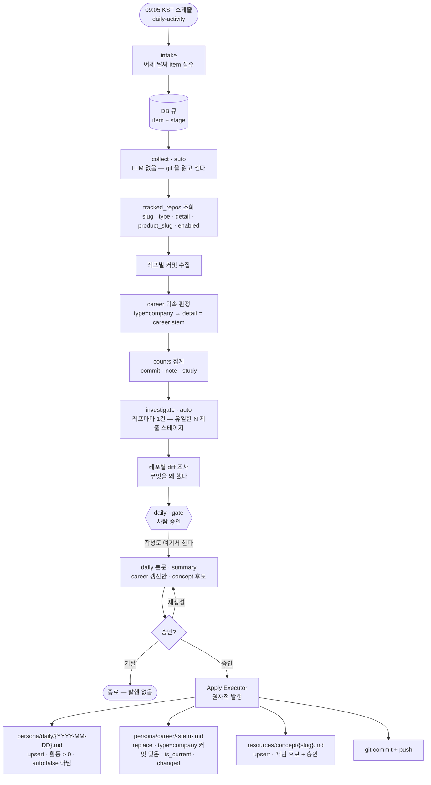

# 업데이트 라인 케이스 정리 — 서버 승인 게이트 · 로컬 작업

> 아직 결정하지 않은 날것의 입력이다. 정리보다 보존이 우선이다.

무엇이 어디로 들어와 어디에 앉는지를 **케이스별로** 늘어놓는다. [[decision-020-para-alignment-area-and-personal|KDEV-DEC-020]]이 자리(PARA)를 정했으니, 다음은 **그 자리로 가는 라인**이다.

## Raw

축이 둘이다.

```
서버(승인 게이트)   스케줄·외부 입력 → DB 큐 → 게이트 → 승인분만 발행
로컬(사람·에이전트) 직접 작성 → pre-commit 검사 → 커밋
```

### 확인된 사실

**입구는 `inbox/` 가 아니다.** [[decision-011-approval-gate-chain|KDEV-DEC-011]] D1 이 뒤집었다 —

> **승인 큐는 DB에 둔다.** 승인 전에는 레포에 파일이 생기지 않는다. …
> `**inbox/` 는 "보류함"으로 역할을 바꾼다** … 즉 `inbox/` 도 **하나의 목적지**이지 대기열이 아니다.

다만 `app/back/service/knowledge_capture/render.py:38` 이 아직 `inbox/` 로 직접 쓴다(게이트 이전 구현 잔존). **어느 쪽이 현행인지 확인이 필요하다.**

## 케이스

### 서버 — 승인 게이트


| #   | 케이스     | 입구                            | 종착지                                                                                  | 상태      |
| --- | ------- | ----------------------------- | ------------------------------------------------------------------------------------ | ------- |
| 1   | 잔디잡     | **09:05 KST** 스케줄 → 접수 → DB 큐 | `persona/daily/` · `persona/career/{회사}` · `resources/concept/`                      | 돈다      |
| 2   | 유튜브 콘텐츠 | Slack URL·업로드 → DB 큐          | `resources/source/` · `resources/concept/` · `persona/contents/` · `inbox/`(보류) · 폐기 | 돈다      |
| 3   | 블로그 글   | —                             | `persona/posts/`                                                                     | **미구현** |


- 1은 **route 게이트가 없다** — 목적지가 고정이라 고를 것이 없다([[decision-015-grass-destinations-and-formats|KDEV-DEC-015]] D1).
- 2는 route 게이트가 **목적지 조합**을 고른다([[spec-008-gate-chain|KDEV-SPEC-008]]).

#### 1. 잔디잡 워크플로우




### 로컬 — 사람·에이전트


| #   | 케이스        | 입구  | 종착지                                                                                | 상태      |
| --- | ---------- | --- | ---------------------------------------------------------------------------------- | ------- |
| 4   | product 작업 | 직접  | `products/{제품}/{00-baseline…70-runbook}` + 근거 개념이 없으면 `resources/{source,concept}` | 돈다      |
| 5   | 공부 노트      | 직접  | `resources/source/` → `resources/concept/`                                         | **미구현** |


- 4는 pre-commit 이 강제한다 — decision 의 `up:`·「근거 개념」 절, 그래프 L1~L6.

## Context

[[decision-020-para-alignment-area-and-personal|KDEV-DEC-020]] 이 자리를 정했다.

```
정체성  context/kknaks.md      회사 · 여름별컴퍼니 · 개인
작업    P products/  ·  R resources/  ·  이력 persona/daily/
귀결    A persona/   career · posts · showcase · profile
```

각 케이스의 종착지가 이 배치의 어디에 앉는지가 정리의 기준이다.

## Why It Matters

**같은 자리에 두 축이 쓴다.** `resources/concept/` 는 케이스 1·2·4·5 넷이 모두 쓰고, `persona/` 는 1·3이 쓴다. 축마다 다른 규칙으로 쓰면 같은 디렉토리가 두 모양이 된다.

그리고 **비어 있는 칸이 드러난다** — 3·5가 미구현이고, 그 둘이 각각 「R → 글」과 「배움 → 개념」이라 **개인 영역의 산출 경로 둘이 다 비어 있다.**

## Possible Direction

아직 결정은 아니지만 가능한 방향.

- (비워 둠 — 케이스별로 채운다)

## 미결


| ID   | 질문                                                                |
| ---- | ----------------------------------------------------------------- |
| OQ-1 | `knowledge_capture/render.py` 의 `inbox/` 직접 쓰기가 현행인가, 게이트 이전 잔재인가 |
| OQ-2 | 게이트 목적지에 `products/` 가 없다 — P 는 로컬만 만드는 것이 맞나                     |
| OQ-3 | `persona/posts/` 를 누가 만드나 — 게이트(3)인가 로컬인가                         |
| OQ-4 | 케이스 5(공부 노트)가 게이트를 타야 하나, 로컬로 끝내야 하나                              |


