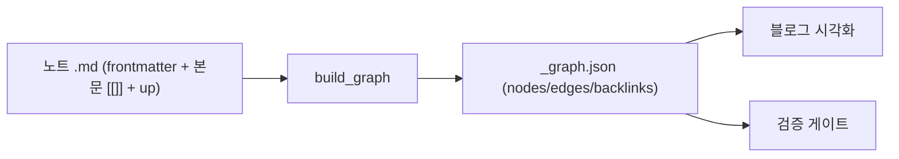

# 그래프 스키마 — 노드·식별자·엣지·빌더 산출물

지식그래프의 노드/엣지/식별자 규약과 빌더 산출물(`_graph.json`)의 외부 계약. 작성자·빌더·시각화가 이 문서를 단일 기준으로 따른다. medi_docs 구 spec-02(wikilinks)/spec-04(persona-map)를 계승한다.

## 1. Context

### Meta

- Decision reference: [[decision-003-node-type-and-identifier|KDEV-DEC-003]], [[decision-004-edge-model-and-schema|KDEV-DEC-004]]
- Baseline reference: [[baseline-001-repo-knowledge-graph|KDEV-BL-001]]
- Domain note: node `type` enum, edge `type` = `assoc`|`lineage`, `dir`. DB 없음 — 파일 frontmatter가 SoT.
- Open questions: §7

### Business Requirement

노트 간 관계를 기계가 파싱해 그래프로 조립하려면, 식별자·링크 문법·관계 종류가 단일 규약이어야 한다. 옵시디언(순정)과 블로그 빌더가 같은 데이터를 읽는다.

### Scope

In scope: 노드 식별자, frontmatter 필수 필드, 엣지 문법(본문 `[[]]` + `up:` 오버레이), `_graph.json` 외부 형태.
Out of scope: 빌더 함수 구현(work), 검증 규칙([[spec-004-graph-validation|KDEV-SPEC-004]]), 렌더([[spec-005-graph-visualization|KDEV-SPEC-005]]).

## 2. UX Contract

해당 없음.

## 3. User Scenario

### S-1. 작성자 — 노트를 다른 노트에 연결

1. 연상 연결이면 본문에 `[[파일명-stem]]`을 적는다 (옵시디언 그래프에 표시됨, 엣지 type=`assoc`).
2. "이 노트가 무엇을 기반으로 했는지"(계보)면, 본문에 `[[stem]]`을 적고 **추가로** frontmatter `up: [stem]`에 그 stem을 넣는다 (엣지 type=`lineage`, 방향=상류→이 노트).
3. id로 링크하고 싶으면 `[[KDEV-SPEC-001]]`처럼 쓴다 — 대상의 `aliases`에 id가 있으면 resolve.

### S-2. 빌더 — 그래프 조립

1. 모든 노트의 frontmatter + 본문을 읽는다.
2. 본문 `[[stem]]`·`[[stem|alias]]`·`[[folder/stem]]`을 엣지로 추출 (기본 `assoc`).
3. `up:`에 있는 stem은 해당 엣지를 `lineage` + 방향으로 마킹.
4. 노드·엣지·백링크를 `_graph.json`으로 산출.

## 4. Interface Contract

### Data Contract — 노드 (frontmatter)

| 필드 | 필수 | 설명 |
|---|---|---|
| `id` | ✓ | 전역 유일. `{PRODUCT}-{TYPE}-{NNN}` 등 prefix 형태 (예: `KDEV-SPEC-002`) |
| `type` | ✓ | 지식층 type `idea`/`reference`/`permanent`/`post`/`product` 계열([[decision-003-node-type-and-identifier\|KDEV-DEC-003]]). **+ products 문서 type**(`baseline`/`decision`/`spec`/`work`/`release`/`runbook`/`bugfix`)도 frontmatter `type` 보유 → 그래프 노드로 포함됨(§5·T-021 정정) |
| `aliases` | 선택 | `[[id]]` 링크 resolve용. id를 등록 |
| `up` | 선택 | lineage 상류 stem 리스트 (본문 `[[]]`의 부분집합) |
| `source` | 선택 | 외부 자료 URL (노드 아님, 속성) |

- **식별자 = 파일명 stem** (옵시디언이 `[[X]]`를 파일명/aliases로 resolve). 전역 유일.

### Data Contract — 엣지

| 필드 | 값 |
|---|---|
| `source` | 출발 노드 stem |
| `target` | 도착 노드 stem |
| `type` | `assoc`(본문 `[[]]`) \| `lineage`(`up:`로 마킹) |
| `dir` | lineage는 상류→하류 방향. assoc는 무방향 |

### Data Contract — `_graph.json` (외부 산출물 형태)

```json
{
  "nodes": [{ "id": "<stem>", "type": "permanent", "title": "...", "archived": false }],
  "edges": [{ "source": "<stem>", "target": "<stem>", "type": "assoc|lineage", "dir": "up|null" }],
  "backlinks": { "<stem>": ["<stem>", "..."] }
}
```
- **확정**(WORK-001, abcfbc4): 위 필드가 빌더 산출물의 외부 계약이다. `nodes[id,type,title,archived]` / `edges[source,target,type,dir]`(assoc는 `dir=null`, lineage는 `dir="up"`) / `backlinks{stem:[source-stem]}`. 검증 함수 시그니처 = `validate_graph(nodes, duplicate_stems=None) -> list[{rule,level,node,detail}]`.

### Flow



## 5. Implementation Rules

- 링크 문법: 본문 `[[stem]]` / `[[stem|alias]]` / `[[folder/stem]]` 모두 동일 stem으로 resolve.
- `up:`의 stem은 반드시 본문 `[[]]`에도 존재 (오버레이 전제 — 검증 L3).
- 출처 URL은 `source:` 속성, 노드로 만들지 않는다.
- **노드 집합 = frontmatter `type` 보유 문서 전체**(T-021 실측, v0.0.2): 빌더 `_build_graph_nodes`는 type 보유 문서를 노드화하므로, 지식층(reference 등) 외에 **products 개발문서**(spec/decision/work/baseline/release/runbook/bugfix)도 그래프 노드로 들어온다. 라이브(2026-06-30) 8종 등장(reference 156 + products 문서 ~154), `permanent/post/product/idea`는 0건. 블로그 `/graph`가 이 개발문서 노드를 노출/필터할지는 §7 Open Question.
- 기존 평문 `links: [id]`는 폐기 → 본문 `[[]]` 또는 `up:`으로 흡수.
- **alias 인덱스**(WORK-001 확정): frontmatter `aliases` + frontmatter `id` + 파일명 stem 자기참조 → canonical stem으로 resolve. 전체 노드 집합이 필요하므로 `core/graph.py`의 `build_alias_index`에서 구성.
- **code-fence 스킵**(WORK-002 확정, 0014790): 빌더는 fenced(` ``` `)·inline(`` ` ``) 코드 영역 내 `[[]]`를 엣지에서 제외한다. 문법 설명용 prose 예시(코드블록·인라인 코드 안의 `[[stem]]`)는 링크가 아니다. 추출 직전 코드 영역을 공백 치환(경계 보존) 후 `[[]]` 파싱 — `extract_wikilinks()` 단일 지점이라 build/knowledge/validate 전부 동일 적용.
- 빌더 regex 패턴 세부는 work(구현)에 둔다.

## 6. Verification

### Acceptance Criteria

- [ ] 본문 `[[stem|alias]]`·`[[folder/stem]]`이 모두 엣지로 잡힌다.
- [ ] `up:` 타겟이 `lineage`+방향으로 마킹된다.
- [ ] `[[id]]`가 aliases로 resolve된다.
- [ ] `_graph.json`에 nodes/edges(type,dir)/backlinks가 포함된다.

## 7. Open Questions

- ~~(구현 OQ, work) `_graph.json` 최종 필드명·빌더 함수 시그니처·regex 패턴.~~ **해소(WORK-001, abcfbc4)** — §4 확정 필드·시그니처 참조.
- ~~(구현 OQ, work) aliases 인덱스 구현 방식.~~ **해소(WORK-001)** — §5 `build_alias_index`(aliases+id+stem 자기참조).
- ~~(OPEN, WORK-002) code-fence/inline-code 내 `[[]]` 스킵 — 빌더 스킵 vs 문서 예시 escape 택일.~~ **해소(WORK-002, 0014790)** — §5 확정: 빌더가 fenced·inline 코드 영역 내 `[[]]`를 엣지에서 제외(빌더 스킵 채택). probe L1 12→0.
- **(OPEN, T-021 박제 — 미해소)** **products 개발문서 type이 그래프 노드에 포함**됨(§5). 이게 의도된 범위인지(자기참조적 지식맵) vs 지식층만 노드화하고 개발문서는 제외할지 admin/사용자 결정. 블로그 노출 측면은 [[spec-005-graph-visualization|KDEV-SPEC-005]] §7과 동일 이슈.
- **(OPEN, T-021 박제 — 미해소)** **lineage 엣지 0건** — 라이브 330엣지 전부 `assoc`/`dir:null`. 데이터에 `up:` 오버레이가 안 쓰여 lineage(§3·§4)가 발현되지 않음. 의도(현 데이터에 계보 표기 미사용)인지 빌더 결함인지 확인 필요.
