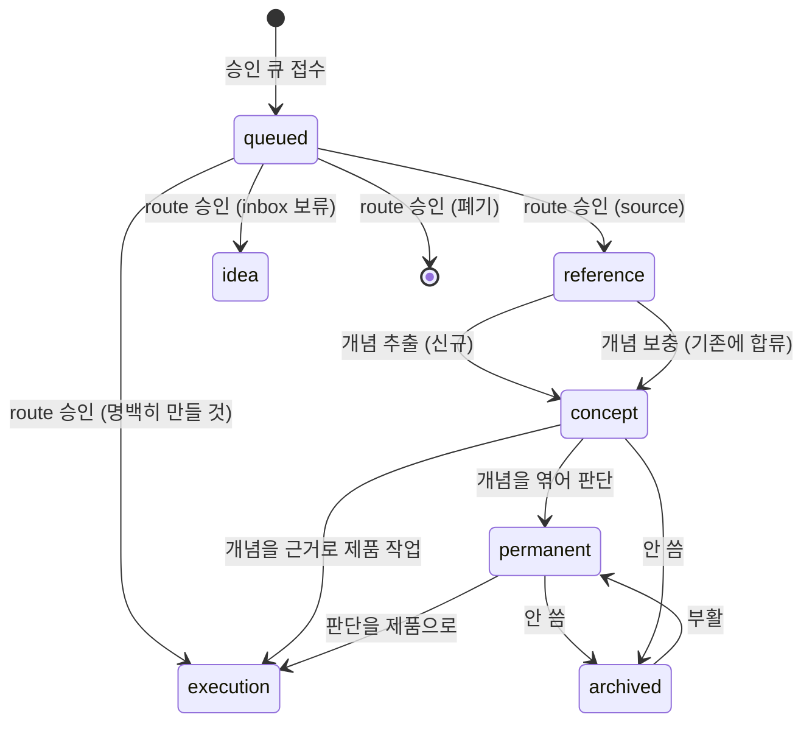

# 지식 워크플로 — 4층 생명주기와 승인 기반 정제

노트가 **수집 → 분류 → 개념화 → 연결 → 망각**으로 흐르는 규약. 분류는 *승격/이동*이 아니라 성격에 따른 배치이고, 정제는 **AI가 초안을 내고 사람이 승인 게이트에서 판단**하는 방식으로 일어난다.

> v0.0.2 — [[decision-010-knowledge-graph-four-layers|KDEV-DEC-010]](4층·concept)와 [[decision-011-approval-gate-chain|KDEV-DEC-011]](승인 게이트 체인) 반영. [[decision-005-classification-workflow|KDEV-DEC-005]]의 "정제 주체 = 사람 · 에이전트는 보조만" 조항이 개정됐다.

## 1. Context

### Meta

- Decision reference: [[decision-005-classification-workflow|KDEV-DEC-005]](개정됨), [[decision-010-knowledge-graph-four-layers|KDEV-DEC-010]], [[decision-011-approval-gate-chain|KDEV-DEC-011]]
- Baseline reference: [[baseline-001-repo-knowledge-graph|KDEV-BL-001]], [[baseline-003-inbox-approval-pipeline|KDEV-BL-003]]
- Domain note: 4층 = `source`(reference) → `concept` → `synthesis`(permanent) → `execution`(products). `idea`는 휘발.
- 정제 주체: **AI 초안 + 사람 승인.** 판단(무엇을 만들지·어디에 둘지·기존 개념에 합칠지)은 사람이 한다.
- Open questions: §7

### Business Requirement

생각·자료가 휘발되지 않고 적절한 층에 쌓이며, 층 간 중복 없이 계보로 연결되어야 한다.

여기에 두 가지가 더해진다.

- **개념이 재사용 단위로 서야 한다.** 자료와 개념은 1:1이 아니다. 같은 개념이 여러 자료에 걸쳐 나올 때 합류할 자리가 없으면, 제품 문서를 쓸 때 "이 개념 어디 적어놨더라"를 매번 다시 찾게 된다.
- **정제가 실제로 일어나야 한다.** 종전 규약은 "작성자가 주기적으로 inbox를 리뷰한다"를 전제했는데, **그 리뷰 단계가 구현된 적이 없다.** `inbox/`는 쌓이기만 했고 `reference/` 157개는 대부분 인용되지 않은 채 남아 있다. 사람의 규율에만 의존하는 워크플로는 작동하지 않았다.

### Scope

In scope: 4층 생명주기, 개념 성장, 정제 주체와 승인 경계, `inbox/`의 역할, 망각.
Out of scope:
- 게이트 체인의 스테이지 구조 → [[spec-008-gate-chain|KDEV-SPEC-008]]
- 검증 규칙 → [[spec-004-graph-validation|KDEV-SPEC-004]]
- 디렉토리 정의 → [[spec-001-directory-structure|KDEV-SPEC-001]]
- 발행 실행 → [[spec-010-apply-executor|KDEV-SPEC-010]]

## 2. UX Contract

해당 없음 (작성자·에이전트 규약). 승인 화면은 [[spec-008-gate-chain|KDEV-SPEC-008]]이 소유한다.

## 3. User Scenario

### S-1. 수집 — 입력을 던진다

1. Slack이나 관리자 화면으로 자료·생각을 던진다.
2. **승인 큐에 접수된다.** 이 시점에 레포에는 파일이 생기지 않는다([[spec-007-approval-queue|KDEV-SPEC-007]]).
3. 손으로 직접 노트를 쓰는 경로도 유효하다 — 그 경우 파일을 바로 만든다. 게이트는 **자동 유입을 위한 장치**이지 수동 작성을 막지 않는다.

### S-2. 분류 — 목적지 배치

경로 게이트에서 성격을 판단한다. AI가 제안하고 사람이 확정한다.

1. **`source`(reference)** — 이 자료가 무엇을 말했는지 남길 가치가 있으면. group을 함께 고른다.
2. **`concept`** — 재사용 가능한 개념이 나오면.
3. **`execution`(products)** — 명백히 만들 것이면 `products/{x}/00-baseline`으로.
4. **`inbox` 보류** — 지금은 정제 못 하겠지만 버리긴 아까우면. **원본 idea가 폐기되지 않고 여기 남는다.**
5. **폐기** — 남길 가치가 없으면.

목적지는 **조합**이다. 유튜브 하나가 `reference` + `concept` + 교안을 함께 낼 수 있다.

### S-3. 개념화 — 원자 개념으로 뽑아낸다

1. 자료에서 재사용 가능한 개념을 추출한다.
2. 각 개념에 대해 **신규 생성인지 기존 개념 보충인지** 판정한다 — `aliases`로 기존 concept를 찾는다.
3. **같은 개념에 두 번째 출처가 오면 새 파일을 만들지 않고 기존 concept를 보충한다.** 이것이 개념 성장 메커니즘이다. 없으면 `stt.md`·`speech-to-text.md`가 갈라지고 SoT가 둘이 된다.
4. concept는 자신이 나온 출처(`reference`)를 `up:`으로 가리킨다. 출처 없는 개념은 성립하지 않는다.
5. **SoT 위임**: 개념 상세는 concept 한 곳에만 쓴다. `reference`는 요지 + `[[concept]]` 링크로 위임한다.

### S-4. 정제 — 판단을 세운다 (정제의 핵심)

`permanent` 종합 노트 작성은 단순 이동이 아니라 **개념들을 엮어 내 판단을 세우는 사고 행위**다.

1. 관련 concept들을 본문 `[[]]`로 인용하고, 기반이면 `up:`에도 넣는다.
2. **개념 내용을 재서술하지 않는다.** 엮은 판단만 소유한다. 다만 판단 문장 안에 개념 요지가 인용되는 것은 허용하며 필연적이다.
3. 기존 permanent와 `[[]]`로 잇는다 — 여기서 관련·충돌·확장이 발견된다.
4. permanent와 products는 별개 SSOT로 평행하게 살아 있고, `up:`은 인용일 뿐 중복이 아니다.
5. **이 층의 판단은 AI가 대신하지 않는다.** 개념까지는 AI 초안 + 승인으로 자동화되지만, "그래서 우리 제품에 이걸 어떻게 쓸 것인가"는 사람이 쓴다.

### S-5. 실행 — 제품으로 내린다

1. concept가 쌓이면 그중 하나를 근거로 제품 작업을 시작한다.
2. `products/{제품}/00-baseline`에 baseline을 만들고 `up:`으로 concept·permanent를 가리킨다.
3. 이후는 제품 문서 파이프라인(`rules/product-doc-pipeline.md`)이 소유한다 — baseline → decision → spec → work.

### S-6. 망각 — 아카이브

1. 안 쓰게 된 `permanent`·`concept`는 `permanent/archive/`로 옮긴다 (파일명 stem 유지 → 링크 보존).
2. 다시 필요하면 폴더 한 칸 위로 이동(부활).

## 4. Interface Contract

### State / Lifecycle

- `idea`(inbox 보류)는 종착이다. 나중에 다시 큐에 태워 정제할 수 있다.
- `reference → concept`가 **성장 축**이다. 같은 concept 노드에 여러 reference가 합류한다.
- `up:` 방향은 이 다이어그램의 **역방향**이다 — 하류가 상류를 가리킨다([[spec-002-graph-schema|KDEV-SPEC-002]]).

## 5. Implementation Rules

- **정제 주체 = AI 초안 + 사람 승인.** AI는 초안을 만들고 파일·git을 직접 건드리지 못한다. 무엇을 만들지·어디에 둘지·기존 개념에 합칠지는 사람이 게이트에서 결정한다([[spec-008-gate-chain|KDEV-SPEC-008]]).
  - [[decision-005-classification-workflow|KDEV-DEC-005]]가 "연결 = 본인 사고"를 이유로 에이전트 초안을 기각했으나, 그 우려는 **승인 게이트가 흡수**한다. 바뀐 것은 초안 타이핑 주체이지 판단 주체가 아니다.
  - `synthesis`(종합 판단) 층은 예외다 — 이 층은 사람이 쓴다.
- **`inbox/`는 대기열이 아니라 목적지다.** 승인 대기는 DB 큐가 맡고, `inbox/`에는 route에서 "보류"로 **승인된** idea만 들어간다. 종전 "분류 후 원본 idea 폐기 / inbox는 미분류만 보유"는 **"inbox는 미정제만 보유"**로 개정한다.
- **개념 성장**: 같은 개념의 두 번째 출처는 새 파일이 아니라 기존 concept 보충이다. `aliases`가 그 매칭의 1차 재료다.
- **SoT 위임**: 개념 상세는 concept 한 곳. `reference`·`permanent`는 재서술하지 않고 `[[concept]]`로 위임한다.
- `idea`는 `up:` 대상 금지 (휘발) — 검증 L4.
- 층 간 동일 stem 중복 금지 = SSOT 단일 — 검증 L2.
- 아카이브 내림은 폴더 이동이며 링크는 stem 기반이라 보존된다.
- 수동 작성 경로는 계속 유효하다. 게이트는 자동 유입에 대한 장치다.

## 6. Verification

### Acceptance Criteria

- [ ] 입력이 승인 큐에 접수되고, 승인 전에는 레포에 파일이 생기지 않는다.
- [ ] route 승인 결과가 목적지 조합으로 반영된다(`reference` + `concept` 동시 생성 가능).
- [ ] `inbox 보류`로 승인하면 idea가 `inbox/`에 남고 폐기되지 않는다.
- [ ] 같은 개념의 두 번째 출처가 새 concept 파일을 만들지 않고 기존 노트를 보충한다.
- [ ] 보충 시 새 출처가 `up:`과 본문 `[[]]` 양쪽에 추가된다.
- [ ] `concept`가 출처(`reference`)를 `up:`으로 가리킨다.
- [ ] `reference`·`permanent` 본문에 개념 상세가 복사되지 않고 `[[concept]]`로 위임된다.
- [ ] `permanent`가 `concept`를 엮고, 개념 내용을 재서술하지 않는다.
- [ ] permanent와 products가 같은 내용을 중복 보유하지 않는다.
- [ ] archive로 옮겨도 inbound 링크가 깨지지 않는다.
- [ ] idea를 `up:`으로 가리키는 노트가 없다.

## 7. Open Questions

- 아카이브로 내리는 트리거 기준(수동 판단 vs 미참조 기간). 운영하며 정한다.
- **(OPEN, v0.0.2)** `reference/` 157개의 소급 정제. 대부분 개념으로 올라가지 않은 상태이며, [[spec-004-graph-validation|KDEV-SPEC-004]]의 미소화 큐로 집계된다. 일괄 처리할지 자연 소모에 맡길지 정하지 않았다.
- **(OPEN, v0.0.2)** `synthesis` 층을 사람이 쓴다는 규칙의 실효성. 개념이 쌓이면 종합 초안도 AI에 맡기고 싶어질 수 있다. 개념 층 자동화가 먼저 돌아본 뒤 판단한다.
- **(OPEN, v0.0.2)** `inbox` 보류 항목을 다시 큐에 태우는 경로. 지금은 수동 재접수를 전제한다.
