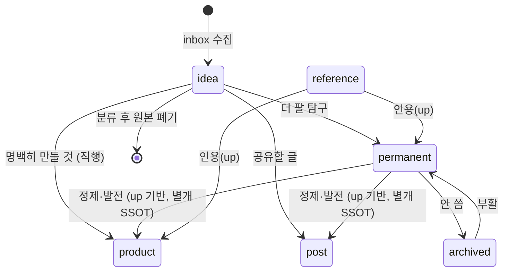

# 지식 워크플로 — 분류·연결·망각 생명주기

노트가 생성→분류→연결→망각으로 흐르는 규약. SSOT는 종착지이며, 분류는 *승격/이동*이 아니라 성격에 따른 배치다.

## 1. Context

### Meta

- Decision reference: [[decision-005-classification-workflow|KDEV-DEC-005]]
- Baseline reference: [[baseline-001-repo-knowledge-graph|KDEV-BL-001]]
- Domain note: permanent·product·post는 평행한 독립 SSOT. idea는 휘발. reference는 종착지가 아니라 인용되는 재료층.
- 분류 기준: **product**=명백히 만들 것 / **permanent**=더 팔 탐구 / **post**=공유할 글.
- 정제 주체: **사람(작성자)** 주도. 에이전트는 보조(inbox 정리·연결 후보 제안)만.
- Open questions: §7

### Business Requirement

생각·자료가 휘발되지 않고 적절한 종착지에 쌓이며, 종착지 간 중복 없이 계보로 연결되어야 한다.

### Scope

In scope: 노트 생명주기(수집·분류·연결·망각), SSOT 귀속 규칙.
Out of scope: 검증 규칙([[spec-004-graph-validation|KDEV-SPEC-004]]), 디렉토리 정의([[spec-001-directory-structure|KDEV-SPEC-001]]).

## 2. UX Contract

해당 없음 (작성자/에이전트 규약).

## 3. User Scenario

### S-1. 수집 — 아이디어 던지기

1. 떠오른 생각을 `inbox/`에 빠르게 적는다 (type: idea, 정제 안 함).

### S-2. 분류·정제 — 종착지로 배치

작성자가 주기적으로 inbox를 리뷰한다 (에이전트는 inbox 정리·연결 후보 제안까지만 보조).

1. 각 idea의 성격을 판단한다. 분류 기준:
   - **product** (명백히 만들 것) → `products/{x}/00-baseline`로 직행.
   - **permanent** (더 팔 탐구·고찰) → `permanent/`로 정제(S-3).
   - **post** (공유할 글) → `persona/posts/`로.
   - 버릴 것 → 삭제.
2. **두 경로 공존**: 명백하면 종착지 직행, 더 여물 게 필요하면 `permanent`를 거쳐 정제 후 product/post로 발전(up 기반).
3. **원본 idea는 폐기** (휘발). 내용은 종착지에 존재.

### S-3. 정제 — 연결하며 재작성 (정제의 핵심)

permanent 작성은 단순 이동이 아니라 **연결하며 내 언어로 다시 쓰는 사고 행위**다.

1. 내 언어로 다시 서술한다 (자료 베끼기 X).
2. "왜 중요한지 / 맥락"을 덧붙인다.
3. 관련 reference 자료를 본문 `[[reference-stem]]`으로 인용하고, 기반이면 `up:`에도 stem을 넣는다.
4. **기존 permanent와 본문 `[[]]`로 연결한다 — 여기서 정제가 일어난다** (관련/충돌/확장 발견). 연상 연결.
5. permanent와 product는 별개 SSOT로 살아있고, `up:`은 인용일 뿐 중복 아님.
6. permanent 연결이 쌓여 패턴이 보이면 product(만들 것)/post(글)로 발전한다.

### S-4. 망각 — 아카이브

1. 안 쓰게 된 permanent는 `permanent/archive/`로 옮긴다 (파일명 stem 유지 → 링크 보존).
2. 다시 필요하면 상위로 폴더 한 칸 이동(부활).

## 4. Interface Contract

### State / Lifecycle

## 5. Implementation Rules

- **정제 주체 = 사람(작성자).** 에이전트는 inbox 정리·연결 후보 제안까지만 보조하고, permanent 재작성·연결(사고 행위)은 사람이 한다.
- 분류 후 inbox 원본은 폐기 (inbox는 항상 미분류만 보유).
- idea는 `up:` 대상 금지 (휘발). 상류는 reference·permanent만 — 검증 L4.
- 종착지 간 동일 stem 중복 금지 = SSOT 단일 — 검증 L2.
- 아카이브 내림은 폴더 이동, 링크는 stem 기반이라 보존.

## 6. Verification

### Acceptance Criteria

- [ ] inbox에는 미분류 idea만 남는다 (분류된 것 폐기).
- [ ] permanent와 product가 같은 내용을 중복 보유하지 않는다.
- [ ] archive로 옮겨도 inbound 링크가 깨지지 않는다.
- [ ] idea를 `up:`으로 가리키는 노트가 없다.

## 7. Open Questions

- 아카이브로 내리는 트리거 기준(수동 판단 vs 미참조 기간). 운영하며 정함.
