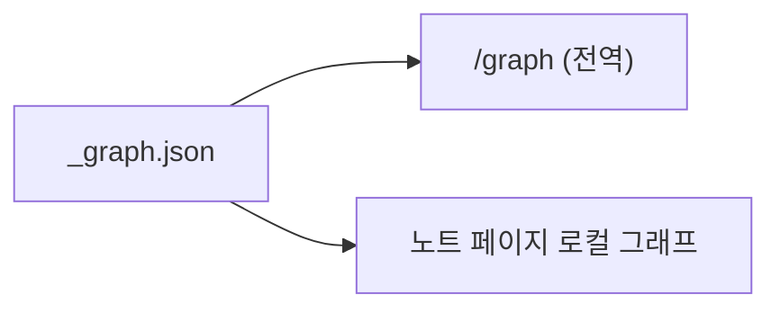

# 블로그 그래프 시각화 — 전역 + 노트별 로컬

`_graph.json`을 블로그에서 force-directed로 렌더한다. 전역 `/graph`와 각 노트 페이지의 로컬 그래프가 사용자에게 무엇을 보장하는지에 대한 계약.

## 1. Context

### Meta

- Decision reference: [[decision-007-blog-graph-visualization|KDEV-DEC-007]]
- Baseline reference: [[baseline-001-repo-knowledge-graph|KDEV-BL-001]]
- Domain note: 데이터는 [[spec-002-graph-schema|KDEV-SPEC-002]]의 `_graph.json`.
- Open questions: §7

### Business Requirement

방문자가 "지식이 어떻게 이어지는지"를 한눈에 보고(전역), 특정 노트에서 이웃 관계를 탐색(로컬)할 수 있어야 한다.

### Scope

In scope: 전역 `/graph` 뷰, 노트별 로컬 그래프, 노드/엣지 시각 규칙, 인터랙션.
Out of scope: `_graph.json` 산출(빌더, [[spec-002-graph-schema|KDEV-SPEC-002]]), force graph 라이브러리 선택(work).

## 2. UX Contract

### Placement

```text
+──────────────────────────────────────────────+
│ 전역: /graph 페이지 — 전체 지식맵             │
+──────────────────────────────────────────────+
│ 로컬: 각 노트 페이지 하단 — 이웃 + 백링크     │
+──────────────────────────────────────────────+
```

### U-1. 전역 그래프 (`/graph`)

- **상태**: 정상(전체 노드/엣지) · 로딩(스켈레톤) · 빈(노드 0).
- **문구**: type 범례(**데이터에 등장하는 type만** — 라이브 8종 reference + products 문서 type baseline/decision/spec/work/release/runbook/bugfix; 미지 type fallback. v0.0.1의 5종 고정 표기는 T-021 정정), 필터 라벨.
- **CTA**: 노드 클릭 → 해당 노트로 이동. type 필터 토글. 노드 포커스 → 이웃만 강조.
- **기대 결과**: force-directed 레이아웃, 노드 색=type, 엣지 lineage=화살표/assoc=선, archived=흐리게.

### U-2. 노트별 로컬 그래프

- **상태**: 정상(이웃+백링크) · 이웃 없음(단독 노드).
- **문구**: "연결된 노트" 헤더.
- **CTA**: 이웃 노드 클릭 → 이동.
- **기대 결과**: 현재 노트 중심 1-hop(+백링크) 미니 그래프.

## 3. User Scenario

### S-1. 방문자 — 전역 탐색

1. `/graph` 진입 → 전체 지식맵 표시.
2. type 필터로 permanent만 보기.
3. 노드 클릭 → 노트 페이지 이동.

### S-2. 방문자 — 노트에서 이웃 탐색

1. 노트 페이지 하단 로컬 그래프 확인.
2. lineage 화살표로 "이 노트가 무엇에 기반했는지" 파악.
3. 이웃 노드 클릭 → 이동.

## 4. Interface Contract

### Data Contract

입력 = [[spec-002-graph-schema|KDEV-SPEC-002]]의 `_graph.json` (nodes/edges/backlinks). 시각화는 이를 소비만 한다.

### Flow



## 5. Implementation Rules

- 시각 규칙: 노드 색=`type`, lineage 엣지=화살표(dir), assoc=무방향 선, `archived`=흐리게.
- **노드 색 = 데이터 기반 팔레트**(T-021 정정, v0.0.2): `type`별 색을 매기되 **그래프 데이터에 실제 등장하는 type만 범례에 표기**하고, 팔레트에 없는 미지 type은 fallback 색으로 렌더한다(특정 N색 고정 아님). type enum 전체 집합과 "어떤 type이 그래프 노드인지"는 [[spec-002-graph-schema|KDEV-SPEC-002]] 참조. 라이브(2026-06-30)는 8종 등장(reference + products 문서 type), `permanent/post/product/idea`는 0건.
- 로컬 그래프 = 현재 노트 1-hop + `backlinks`.
- force graph 라이브러리·렌더 컴포넌트 파일은 work에 둔다.

## 6. Verification

### Acceptance Criteria

- [ ] `/graph`에서 전체 노드/엣지가 type 색·엣지 스타일로 렌더된다.
- [ ] 노드 클릭으로 노트 이동, type 필터 동작.
- [ ] 노트 페이지에 로컬 그래프(이웃+백링크)가 표시된다.
- [ ] archived 노드가 시각적으로 구분된다.

## 7. Open Questions

- (구현 OQ, work) force graph 라이브러리 선택(react-force-graph / d3-force / cytoscape 등) — 프로토타입 후 결정.
- (구현 OQ, work) 노드 수 많을 때 전역 그래프 성능/클러스터링.
- **(설계 OQ, T-021 박제 — 미해소)** 블로그 `/graph`가 **products 개발문서 type**(spec/decision/work/baseline/release/runbook/bugfix, ~154노드)을 포함할지. 현재는 빌더가 frontmatter `type` 보유 문서를 전부 노드화해 **포함**(자기참조적 — 제품 개발문서가 공개 지식맵에 노출). 지식층(reference 등)만 남기고 개발문서를 필터할지는 admin/사용자 결정 대상. → [[spec-002-graph-schema|KDEV-SPEC-002]] §7과 동일 이슈.
- **(설계 OQ, T-021 박제 — 미해소)** **lineage 엣지 0건**: 라이브 330엣지 전부 `assoc`/`dir:null`로, `up:` 오버레이가 생성되지 않아 lineage 화살표 규칙(§5)이 발현되지 않는다. 빌더가 lineage를 안 내는 게 의도인지(데이터에 `up:` 미사용) 결함인지 확인 필요. → [[spec-002-graph-schema|KDEV-SPEC-002]] §7.
