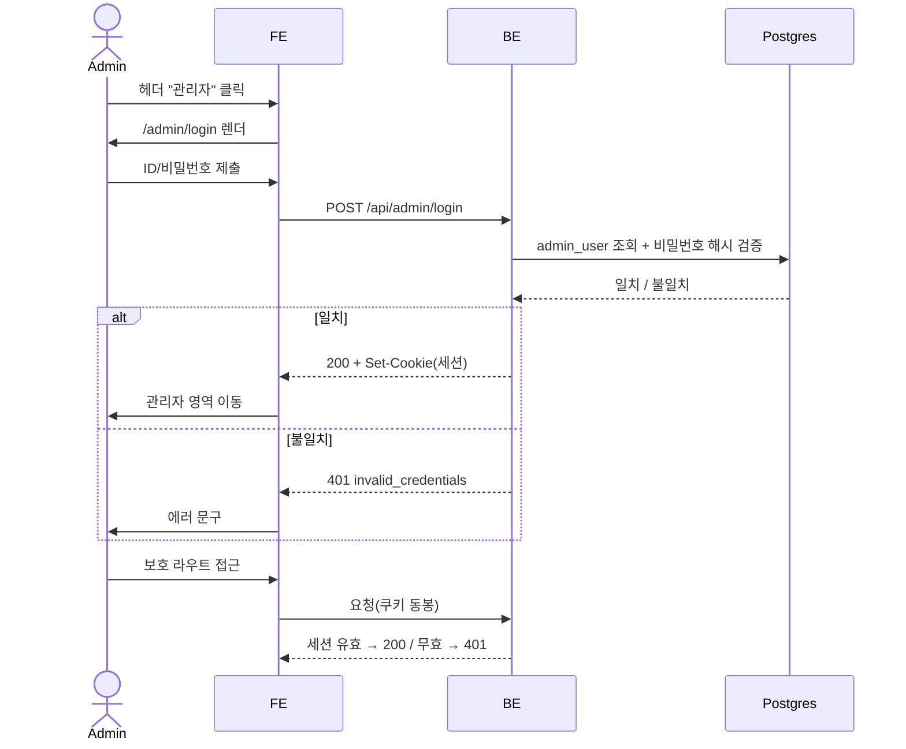
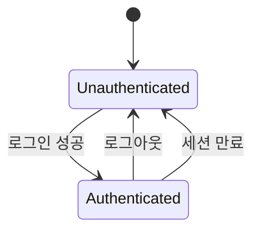

# 관리자 로그인 — admin 인증·세션·보호 라우트

블로그 헤더 우측 "관리자" 진입점에서 단일 관리자가 ID/비밀번호로 로그인하고, 세션이 유지되는 동안 `/admin/*` 보호 영역에 접근할 수 있음을 보장한다.

> 이 SPEC은 **로그인·세션·라우트 보호**의 외부 계약만 정의한다. 관리자 페이지가 실제로 무엇을 하는지(inbox 승인 게이트 등)는 별도 SPEC이다.

## 1. Context

### Meta

- Decision reference: (없음 — 로그인 도입은 이 SPEC이 선행. Postgres 도입 결정은 승인 게이트 SPEC과 함께 별도 decision으로 박는다 — §7)
- Baseline reference: [[baseline-001-repo-knowledge-graph|KDEV-BL-001]]
- Domain note: 외부 노출 resource = `session`(로그인 상태). status enum = `authenticated` / `unauthenticated`. actor 1종 = **admin**(사이트 주인 단일 계정).
- Open questions: §7

### Business Requirement

블로그를 넘어 운영 기능(inbox 승인 게이트 등)을 웹에서 다루려면, 공개 사이트와 분리된 **인증된 관리자 전용 영역**이 필요하다. 현재 사이트는 전면 공개이며 보호 영역이 없다. 이 SPEC은 그 첫 계약 — "관리자만 `/admin/*`에 들어갈 수 있다"를 보장한다.

### Scope

In scope:

- 헤더 우측 "관리자" 진입점 노출.
- 관리자 로그인 화면(ID + 비밀번호).
- 로그인 성공 시 세션 발급, 실패 시 거부.
- 세션 기반 `/admin/*` 보호(미인증 접근 차단·로그인으로 유도).
- 로그아웃(세션 파기).

Out of scope:

- 관리자 페이지의 기능(inbox 승인 게이트 등) → 별도 SPEC.
- 다중 관리자·역할(role)·권한 등급 → 현재 단일 admin, YAGNI.
- 회원가입·비밀번호 재설정 UI → 단일 계정이라 자격증명은 운영자가 직접 주입(§5).
- Postgres 스키마 전문·migration → 관련 work·코드가 SoT.

## 2. UX Contract

### Placement

```text
+──────────────────────────────────────────────────+
│ 로고        ...섹션 네비...            [관리자] ← 헤더 우측 │
+──────────────────────────────────────────────────+

/admin/login (전용 페이지)
+──────────────────────────────────+
│           관리자 로그인           │
│   [ ID              ]            │
│   [ 비밀번호         ]            │
│              [ 로그인 ]          │
│   (에러 시) 안내 메시지           │
+──────────────────────────────────+
```

### U-1. 헤더 "관리자" 진입점

- **상태**:
  - 미인증: "관리자" 링크 노출 → 클릭 시 `/admin/login`으로 이동.
  - 인증됨: "관리자" 대신 관리자 영역 진입("대시보드") + "로그아웃" 노출.
- **문구**: `관리자` / (인증 시) `로그아웃`.
- **CTA**: 텍스트 링크. 헤더 우측 고정. 항상 활성.
- **기대 결과**: 미인증 → 로그인 페이지. 인증 → 관리자 영역.

### U-2. 로그인 폼

- **상태**:
  - 정상(입력 대기): ID·비밀번호 입력 필드 + 로그인 버튼.
  - 로딩: 로그인 버튼 비활성 + 진행 표시(중복 제출 차단).
  - 에러: 폼 상단/하단에 실패 안내(자격증명 불일치를 필드별로 특정하지 않음 — §5).
  - 이미 인증됨: 로그인 페이지 진입 시 관리자 영역으로 리다이렉트.
- **문구**: 헤더 `관리자 로그인`, 라벨 `ID`·`비밀번호`, 버튼 `로그인`, 실패 `아이디 또는 비밀번호가 올바르지 않습니다.`
- **CTA**: `로그인` 버튼 — ID·비밀번호 둘 다 비어있지 않을 때만 활성.
- **기대 결과**: 성공 → 세션 발급 + 관리자 영역 이동. 실패 → 에러 문구, 폼 유지, 비밀번호 필드 초기화.

### U-3. 보호 라우트(`/admin/*`) 접근 차단

- **상태**:
  - 미인증 접근: 콘텐츠를 렌더하지 않고 로그인 페이지로 유도.
  - 인증 만료: 보호 영역에서 세션 만료 감지 시 로그인으로 유도.
- **문구**: (유도 시) `로그인이 필요합니다.`
- **CTA**: 없음(자동 리다이렉트).
- **기대 결과**: 인증 없이는 보호 콘텐츠가 노출되지 않는다.

## 3. User Scenario

### S-1. admin — 로그인 성공

1. 헤더 우측 "관리자" 클릭 → `/admin/login` 진입.
2. ID·비밀번호 입력 후 "로그인" 클릭.
3. BE가 자격증명을 검증(일치) → 세션 발급(httpOnly 쿠키).
4. 관리자 영역으로 이동. 헤더는 "로그아웃" 상태로 전환.

### S-2. admin — 로그인 실패

1. `/admin/login`에서 잘못된 ID 또는 비밀번호로 "로그인" 클릭.
2. BE가 검증 실패 → 세션 미발급, 401 응답.
3. 폼에 `아이디 또는 비밀번호가 올바르지 않습니다.` 노출(어느 필드가 틀렸는지 특정하지 않음). 비밀번호 필드 초기화.

### S-3. 미인증 사용자 — 보호 라우트 직접 접근

1. 세션 없이 `/admin/...` URL로 직접 진입 시도.
2. 보호 콘텐츠를 렌더하지 않고 `/admin/login`으로 유도.

### S-4. admin — 로그아웃

1. 인증 상태에서 헤더 "로그아웃" 클릭.
2. BE가 세션 파기(쿠키 무효화).
3. 공개 페이지로 이동. 이후 `/admin/*` 재접근 시 로그인 요구.

### S-5. admin — 세션 만료

1. 세션 유효기간이 지난 뒤 보호 라우트에 접근·요청.
2. BE가 만료 세션 거부(401) → 로그인으로 유도.

## 4. Interface Contract

### API Contract

| Method | Path | 요약 | 권한 |
|---|---|---|---|
| POST | `/api/admin/login` | ID/비밀번호 검증 후 세션 발급 | public |
| POST | `/api/admin/logout` | 현재 세션 파기 | admin |
| GET | `/api/admin/session` | 현재 세션 유효성·로그인 상태 조회 | public |

### Request / Response

- `POST /api/admin/login`
  - Request: `{ "id": string, "password": string }`
  - 200: `{ "authenticated": true }` + `Set-Cookie`(세션, httpOnly).
- `GET /api/admin/session`
  - 200: `{ "authenticated": true | false }`.
- `POST /api/admin/logout`
  - 200: `{ "authenticated": false }` + 세션 쿠키 무효화.

### Validation

| 필드 | 규칙 |
|---|---|
| id | 비어있지 않음(trim 후 length ≥ 1). |
| password | 비어있지 않음(length ≥ 1). |

### Case Matrix

| 에러 코드 | 백엔드 출력 | 프론트 출력 | 표시 위치 |
|---|---|---|---|
| AUTH_INVALID_CREDENTIALS | 401 `{ "error": "invalid_credentials" }` | `아이디 또는 비밀번호가 올바르지 않습니다.` | 로그인 폼 |
| AUTH_MISSING_FIELD | 400 `{ "error": "missing_field" }` | `아이디와 비밀번호를 입력하세요.` | 로그인 폼 |
| AUTH_UNAUTHENTICATED | 401 `{ "error": "unauthenticated" }` | `로그인이 필요합니다.` (→ 로그인 유도) | 보호 라우트 |
| AUTH_SESSION_EXPIRED | 401 `{ "error": "session_expired" }` | `세션이 만료되었습니다. 다시 로그인하세요.` | 보호 라우트 |

### Flow



### State / Lifecycle



### Data Contract

- 외부 노출 resource: `session` — `{ authenticated: boolean }`만 드러난다.
- 관리자 자격증명(ID·비밀번호 해시)은 응답에 절대 노출하지 않는다.
- 저장소는 Postgres(`admin_user`)를 전제하되, table column/index/migration 전문은 코드가 SoT(§7 decision 종속).

## 5. Implementation Rules

- **단일 관리자.** 자격증명은 운영자가 직접 주입한다(초기 seed 또는 env로 부트스트랩). 회원가입 플로 없음.
- **비밀번호는 평문 저장 금지** — 해시(salt 포함)로만 저장·검증한다.
- **세션은 httpOnly 쿠키.** 자바스크립트에서 토큰을 읽을 수 없어야 한다. 프로덕션은 `Secure` + `SameSite` 적용.
- **자격증명 실패는 아이디/비밀번호를 구분해 알리지 않는다**(enumeration 방지) — 단일 `invalid_credentials`.
- **보호 경계는 백엔드가 최종 신뢰 경계다.** FE 리다이렉트는 UX 편의일 뿐, `/api/admin/*`(로그인 제외) 및 향후 관리자 API는 서버에서 세션을 재검증한다.
- **브루트포스 완화**(로그인 시도 제한 등)는 이 SPEC의 계약 밖 — 관련 work에서 필요 시 다룬다(§7).

라우트·페이지·컴포넌트 파일, 세션 미들웨어 구조, migration 적용 순서는 work에 둔다.

## 6. Verification

### Acceptance Criteria

- [ ] 헤더 우측 "관리자" 진입점이 미인증/인증 상태에 따라 다르게 노출된다.
- [ ] 올바른 자격증명으로 로그인하면 세션이 발급되고 관리자 영역에 접근할 수 있다.
- [ ] 잘못된 자격증명은 거부되고, 어느 필드가 틀렸는지 특정하지 않는다.
- [ ] 세션 없이 `/admin/*`에 접근하면 보호 콘텐츠가 렌더되지 않는다.
- [ ] 로그아웃 후 `/admin/*` 재접근 시 다시 로그인을 요구한다.
- [ ] 만료된 세션은 보호 라우트에서 거부된다.
- [ ] 비밀번호가 평문으로 저장·전송·노출되지 않는다.

## 7. Open Questions

| ID | Question | Owner | Next |
|---|---|---|---|
| OQ-1 | Postgres 도입(ADR-01 DB-less 뒤집기)의 근거·범위를 별도 decision으로 박아야 한다. 이 SPEC은 그 decision을 전제로 `admin_user` 저장소를 가정. | admin | 승인 게이트 SPEC과 묶어 decision 작성 |
| OQ-2 | 세션 유효기간·갱신(refresh) 정책 구체값. | admin | work 발주 직전 결정 |
| OQ-3 | 로그인 시도 제한(브루트포스 완화) 도입 여부. | admin | 운영 단계에서 판단 |
