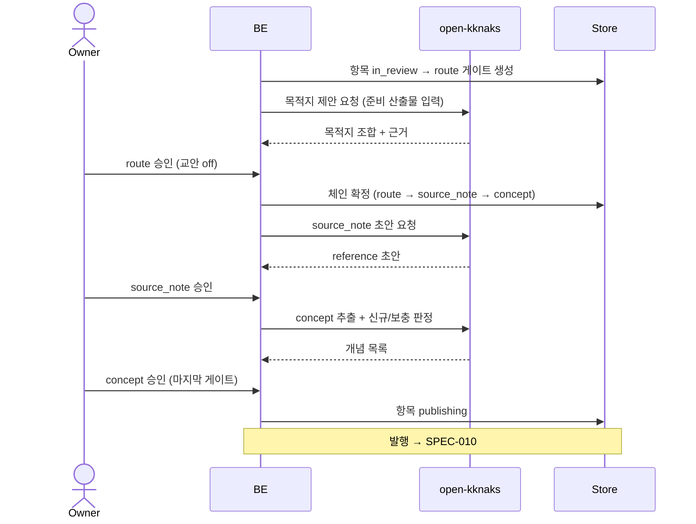
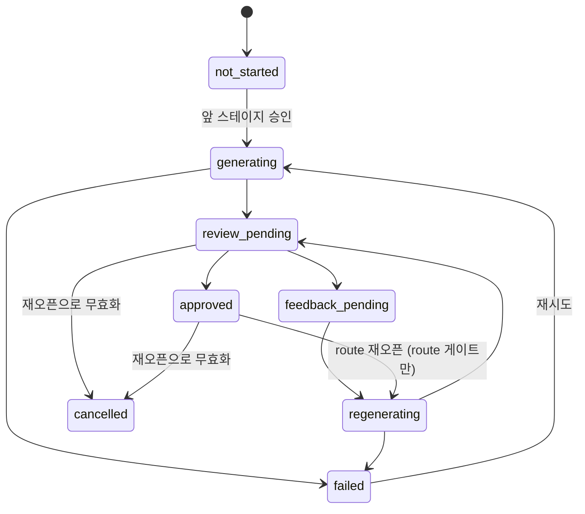

# 게이트 체인 — 파이프라인 정의와 스테이지 계약

큐 항목이 **어떤 스테이지들을 거쳐** 문서가 되는지의 계약. 게이트 수는 고정이 아니라 입력 종류와 첫 게이트의 판단이 결정한다.

> 게이트 하나의 동작(버전·피드백·재생성)은 [[spec-009-gate-feedback|KDEV-SPEC-009]]가, 최종 발행은 [[spec-010-apply-executor|KDEV-SPEC-010]]이 소유한다. 이 spec은 **체인의 모양과 각 스테이지가 무엇을 결정하는가**를 소유한다.

## 1. Context

### Meta

- Decision reference: [[decision-011-approval-gate-chain|KDEV-DEC-011]] D2/D3/D5/D6
- Baseline reference: [[baseline-003-inbox-approval-pipeline|KDEV-BL-003]]
- Domain note: `Pipeline`(정의), `Stage`(스테이지), `Gate`(게이트 스테이지의 인스턴스). 스테이지 종류 = 자동 / 게이트.
- Open questions: §7

### Business Requirement

입력 종류마다 산출물이 다르다.

| 입력 | 산출물 | 정의 |
|---|---|---|
| 유튜브 | **reference + concept** + contents(파생) | 확정 |
| 커밋(잔디) | **daily + career + concept** | 확정 ([[spec-013-grass-gate\|KDEV-SPEC-013]]) |
| 블로그 | **reference + concept** + posts(파생, 게시 판정 시) | 미정 |

**`concept`가 유일한 공통 코어이고 나머지는 입력마다 다르다.** 잔디를 정의하면서 종전의 "`reference` + `concept`가 공통" 가정이 깨졌다 — 커밋은 외부 자료가 아니라 출처 기록(`reference`)을 남길 대상이 없고, 대신 활동 기록(`daily`)과 경력 누적(`career`)으로 간다. 그래서 공통 코어를 전제한 구조가 아니라 **정의를 등록하는 구조**여야 한다는 요구가 더 강해졌다.

동시에 **판단은 근거가 갖춰진 시점에** 이뤄져야 한다. "이건 k8s 자료다"는 요약을 보면 알지만, "이 영상에 STT 말고 VAD도 나오나"는 개념을 뽑아봐야 안다. 두 판단을 한 게이트에 묶으면 뒤쪽이 근거 없는 추측이 된다.

### Scope

In scope: 파이프라인 정의 모델, 스테이지 종류, 유튜브·블로그·공부 노트 체인, 각 게이트가 결정하는 것, 체인 길이 확정, 역방향 전이, 발행 트리거.
Out of scope:
- 항목 접수·준비 → [[spec-007-approval-queue|KDEV-SPEC-007]]
- 게이트 버전·피드백·재생성 → [[spec-009-gate-feedback|KDEV-SPEC-009]]
- 발행 실행·검증 → [[spec-010-apply-executor|KDEV-SPEC-010]]
- 잔디 파이프라인 상세 → [[spec-013-grass-gate|KDEV-SPEC-013]] (정의 자체는 이 spec 이 등록한다)

## 2. UX Contract

### Placement

큐 항목 상세 아래에 게이트가 **세로 스택으로 인라인** 쌓인다. 사이드바 왕복이나 화면 이동이 없다.

```text
+──────────────────────────────────────────────────+
│ 큐 항목 상세 (SPEC-007 U-2)                       │
+──────────────────────────────────────────────────+
│ ✓ route        목적지 확정   [v2 | v1]           │
+──────────────────────────────────────────────────+
│ ✓ source_note  reference 초안                     │
+──────────────────────────────────────────────────+
│ ▸ concept      개념 3건 (신규 2 · 보충 1)         │
│                [피드백]  [승인]                   │
+──────────────────────────────────────────────────+
│ · derived      교안        (대기)                 │
+──────────────────────────────────────────────────+
```

### U-1. 게이트 스택

- **상태**: 대기(아직 생성 안 됨) · 생성 중 · 검토 대기 · 승인됨 · 실패 · 무효(재오픈으로 취소됨)
- **문구**: 스테이지 이름, 한 줄 요약, 버전 badge, 상태
- **CTA**: 접기/펴기
- **기대 결과**: 승인된 게이트는 접혀서 결과 한 줄만 보이고, **현재 검토 대상만 펼쳐진다.** 아직 안 열린 스테이지는 흐리게 예고된다 — 몇 번 더 승인해야 하는지 보여야 한다.

### U-2. route 게이트

- **상태**: 검토 대기 · 승인됨 · 재생성 중 · 재오픈됨
- **문구**: 자동 요약(판단 근거), AI가 제안한 **목적지 조합**과 근거
  - `reference` 생성 여부 + **group 선택**(13종)
  - `concept` 생성 여부
  - 파생 산출물 생성 여부 — **유튜브면 교안(`derived`), 글·문서면 공개 글(`post`)**
  - 또는 배타 옵션: **폐기** (KDEV-DEC-021 로 `inbox 보류` 폐기)
- **CTA**: `피드백`, `승인`. 각 항목은 토글로 조정 가능
- **기대 결과**: **승인하는 순간 체인 길이가 확정된다.** 파생을 끄면 그 스테이지가 아예 생성되지 않는다. `폐기`면 이후 스테이지 없이 항목이 종료된다.

### U-3. source_note 게이트

- **상태**: 검토 대기 · 승인됨 · 재생성 중
- **문구**: reference 초안 전문(frontmatter 미리보기 + 본문), 저장될 경로
- **CTA**: `피드백`, `승인`
- **기대 결과**: "이 자료가 뭐라고 했나"를 담은 초안을 검토한다. 승인하면 다음 스테이지가 열린다. **아직 파일은 만들어지지 않는다.**

### U-4. concept 게이트

- **상태**: 검토 대기 · 승인됨 · 재생성 중
- **문구**: 추출된 개념 목록. 각 개념마다
  - **신규 생성** — 새 concept 전문 미리보기
  - **기존 보충** — 대상 concept 경로 + **변경분(diff)**
  - 판정 근거(어떤 `aliases`로 기존 개념을 찾았는지)
- **CTA**: `피드백`, `승인`, 개별 개념 **제외 토글**
- **기대 결과**: 개념들은 **묶음으로 승인**된다. 개별 승인이 아니라, 원하지 않는 개념만 제외 토글로 빼고 나머지를 한 번에 승인한다. 보충인 경우 손으로 쓴 문장이 사라지는 변경도 diff에 보인다([[decision-012-draft-storage-and-publish-boundary|KDEV-DEC-012]] D4).

### U-5. derived 게이트 (파생)

- **상태**: 검토 대기 · 승인됨 · 재생성 중 · **존재하지 않음**(route에서 껐을 때)
- **문구**: 파생 산출물 초안. 유튜브면 교안 전문
- **CTA**: `피드백`, `승인`
- **기대 결과**: 이 게이트 승인이 체인의 마지막이면 **발행이 시작된다**([[spec-010-apply-executor|KDEV-SPEC-010]]).

### U-6. 목적지 재검토

- **상태**: route가 승인된 이후에만 노출
- **문구**: "이 목적지가 아님"
- **CTA**: 사유 입력 후 제출
- **기대 결과**: route 게이트가 **재오픈**되고 이후 게이트들이 무효 처리된다. 자동 준비 결과(수집·요약)는 재사용한다 — 목적지 오판 때문에 자막을 다시 받지 않는다.

## 3. User Scenario

### S-1. owner — 유튜브 하나를 끝까지 승인

1. 큐 항목이 준비 완료(`in_review`)되어 route 게이트가 열린다.
2. AI 제안: `reference`(group=`ai_skills`) + `concept` 생성 + 교안 O. 근거로 자동 요약이 함께 보인다.
3. owner가 group을 `ai_skills`에서 그대로 두고 교안은 끈다 → 승인.
4. **체인이 `route → source_note → concept` 3단으로 확정된다.** 교안 스테이지는 생성되지 않는다.
5. source_note 게이트에서 reference 초안을 확인하고 승인한다.
6. concept 게이트에 개념 3건이 뜬다 — `STT`는 기존 노트 보충(diff 표시), `VAD`·`스트리밍 ASR`은 신규. owner가 `스트리밍 ASR`을 제외 토글로 빼고 승인한다.
7. 마지막 게이트 승인이므로 발행이 시작된다. `reference` 1장 + `concept` 신규 1장 + 보충 1장이 **한 커밋**으로 나간다.
8. 노트북에서 pull하면 완성된 세트가 온다.

### S-2. owner — 개념 뽑다가 목적지가 틀렸음을 안다

1. concept 게이트에서 개념을 보다가 "이건 `ai_skills`가 아니라 `network` 자료였다"고 판단한다.
2. `이 목적지가 아님`에 사유를 적고 제출한다.
3. route 게이트가 재오픈되고, source_note·concept 게이트는 무효 처리된다. **기록은 지우지 않는다** — 나중에 "그때 왜 ai_skills로 했지"를 볼 수 있어야 한다.
4. 자동 준비 결과는 그대로 재사용된다.
5. 새 목적지를 승인하면 체인이 새로 생성된다. 파생 on/off를 바꿨으면 체인 길이도 바뀐다.

### S-3. owner — route에서 폐기한다

1. route 게이트에서 AI 제안을 보니 남길 가치가 없다고 판단한다.
2. `폐기`를 선택해 승인한다.
3. 이후 스테이지 없이 항목이 `discarded`가 된다. 파일은 생기지 않고 행은 보존된다.

### S-4. owner — 지금은 정제하기 어렵다

1. ~~route 게이트에서 `inbox 보류`를 선택해 승인한다.~~ **폐기(KDEV-DEC-021)** — 배타 옵션은 `폐기` 하나뿐이다.
2. `inbox/`에 idea 1장만 발행되고 항목이 종료된다.
3. 노트북 옵시디언에서 그 idea가 보인다 — "이런 것도 있었지"가 확인된다.

### S-5. System — 게이트 생성이 실패한다

1. AI 실행이 실패해 게이트 초안을 만들지 못한다.
2. 게이트는 `실패` 상태가 되고 사유가 표시된다.
3. `재시도`로 다시 실행한다. 기존 실패 기록은 보존된다([[spec-009-gate-feedback|KDEV-SPEC-009]]).

## 4. Interface Contract

### API Contract

| Method | Path | 요약 | 권한 |
|---|---|---|---|
| GET | 항목의 게이트 목록 | 스테이지별 게이트와 현재 상태 | admin |
| GET | 게이트 상세 | 현재 active revision의 내용 | admin |
| POST | 게이트 승인 | 승인 → 다음 스테이지 생성 또는 발행 | admin |
| POST | 목적지 재검토 | route 재오픈 + 이후 게이트 무효화 | admin |
| POST | 게이트 재시도 | 실패한 생성/재생성 재실행 | admin |

피드백·재생성 API는 [[spec-009-gate-feedback|KDEV-SPEC-009]]가 소유한다.

### Validation

| 필드 | 규칙 |
|---|---|
| 승인 | 현재 `검토 대기`인 게이트만 승인 가능. 이미 승인된 게이트는 재승인 불가 |
| 승인 순서 | 앞 스테이지가 승인되지 않으면 뒤 스테이지는 생성되지 않는다 |
| route 목적지 | 최소 1개 산출물이 켜져 있거나, 배타 옵션(`폐기`)이어야 한다 |
| `reference` group | 켜져 있으면 group 필수. `persona/_meta.yaml` clusters에 존재하는 값만 |
| concept 제외 | 전부 제외하면 concept 스테이지 산출물이 0이 된다 — 허용하되 경고 |
| 목적지 재검토 | route가 승인된 이후에만 가능 |

### Case Matrix

| 에러 코드 | 백엔드 출력 | 프론트 출력 | 표시 위치 |
|---|---|---|---|
| `GATE_ALREADY_APPROVED` | 승인된 게이트 재승인 | 이미 승인된 단계입니다. | 게이트 카드 |
| `GATE_NOT_REVIEWABLE` | 검토 대기 아님 | 지금은 승인할 수 없습니다. | 게이트 카드 |
| `STALE_GATE_VERSION` | 오래된 버전 승인 시도 | 최신 상태를 다시 확인해 주세요. | 게이트 카드 |
| `NO_DESTINATION_SELECTED` | 산출물 0 + 배타 옵션 없음 | 목적지를 하나 이상 선택해 주세요. | route 게이트 |
| `UNKNOWN_REFERENCE_GROUP` | 미등록 group | 없는 그룹입니다. | route 게이트 |
| `REOPEN_NOT_ALLOWED` | route 미승인 상태 | 목적지가 아직 확정되지 않았습니다. | 게이트 스택 |
| `RETRY_NOT_ALLOWED` | 실패 상태 아님 | 지금은 재시도할 수 없습니다. | 게이트 카드 |

### Flow



### State / Lifecycle

게이트 하나의 상태:



- `cancelled`는 목적지 재검토로 뒤 게이트가 무효화될 때 쓴다. 그 외 임의 취소는 없다.
- `approved → regenerating`은 **route 게이트에만** 허용되는 유일한 역방향 전이다.

### Data Contract

| Resource | Field | 설명 |
|---|---|---|
| Pipeline | `source_kind` | 이 정의가 적용되는 입력 종류 |
| Pipeline | `stages[]` | 순서 있는 스테이지 목록 |
| Stage | `kind` | `auto` 또는 `gate` |
| Stage | `name` | `collect`·`summarize`·`route`·`source_note`·`concept`·`derived`·`post`·`investigate`·`daily` |
| Stage | `optional` | `true`면 route 판단에 따라 생성되지 않을 수 있다 |
| Gate | `item_id` | 소속 큐 항목 |
| Gate | `stage_name` | 어느 스테이지인가 |
| Gate | `stage_no` | 체인 내 순번 |
| Gate | `status` | 위 상태기계 |
| Gate | `active_revision_id` | 현재 검토 중인 버전 |
| Gate | `approved_revision_id` | 승인된 버전. 없으면 `null` |

**파이프라인 정의는 데이터다.** 입력 종류가 늘어도 게이트 종류를 enum에 추가하지 않고 정의를 등록한다.

#### 유튜브 파이프라인 정의

| # | stage | kind | optional | 결정하는 것 |
|---|---|---|---|---|
| 1 | `collect` | auto | — | 메타·자막 수집 |
| 2 | `summarize` | auto | — | 판단 근거용 요약 |
| 3 | `route` | gate | — | 목적지 조합 + reference group + 파생 on/off |
| 4 | `source_note` | gate | route 의존 | reference 초안 |
| 5 | `concept` | gate | route 의존 | 개념 추출 + 신규/보충 판정 |
| 6 | `derived` | gate | route 의존 | 교안(`persona/contents/`) |

#### 블로그 파이프라인 정의 (`blog`)

**유튜브와 앞의 셋이 같고 산출만 갈린다.** 유튜브는 교안(`derived`, 학습 가능한 장문)을 만들고, 블로그는 공개 글(`post`, 핵심 압축 한 편)을 만든다.

| # | stage | kind | optional | 결정하는 것 |
|---|---|---|---|---|
| 1 | `collect` | auto | — | 본문 크롤링 — **정적 → 동적 → 최종 실패** |
| 2 | `summarize` | auto | — | 판단 근거용 요약 |
| 3 | `route` | gate | — | 목적지 조합 |
| 4 | `source_note` | gate | route 의존 | reference 초안 |
| 5 | `concept` | gate | route 의존 | 개념 추출 |
| 6 | `post` | gate | route 의존 | 공개 글(`persona/posts/`) |

`collect` 가 세 단계인 이유는 **실패의 종류가 다르기** 때문이다. 정적 HTTP 로 대부분 끝나고, 본문을 JS 로 그리는 페이지만 chromium headless 로 올라간다. 올라가도 결과가 같은 실패(로그인·유료 장벽·크기 초과·timeout)는 올라가지 않는다. 둘 다 안 되면 **빈 본문으로 요약을 부르지 않고 항목을 실패로 남긴다.**

#### 공부 노트 파이프라인 정의 (`study_note`)

**`collect` 가 없다.** URL 이 아니라 본문이 이미 손에 있어 수집할 것이 없다 — 사람이 `inbox/` 에 넣고 push 한 파일이 그대로 원문이다(KDEV-DEC-021).

| # | stage | kind | optional | 결정하는 것 |
|---|---|---|---|---|
| 1 | `summarize` | auto | — | 판단 근거용 요약 (본문은 `note` 에 있다) |
| 2 | `route` | gate | — | 목적지 조합 |
| 3 | `source_note` | gate | route 의존 | reference 초안 |
| 4 | `concept` | gate | route 의존 | 개념 추출 |
| 5 | `post` | gate | route 의존 | 공개 글(`persona/posts/`) |

접수는 **FastAPI lifespan 의 `inbox/` 스캔**이다. 스케줄이 아닌 이유는 트리거가 push 이기 때문이다 — 노트를 넣고 push 하면 배포가 돌고 서버가 다시 뜬다.

멱등의 자연키는 **파일명(slug)** 이고 `normalized_url` 에 `study:{slug}` 합성 키로 들어간다(잔디의 `daily:{date}` 와 같은 자리). 접수되면 파일을 지우므로 **입구에 파일이 있다는 것은 곧 미처리**다. 다만 지우지 **않는** 경우가 둘 있다 — 이미 발행된 slug, 그리고 본문이 비었거나 파일명이 키로 쓸 수 없는 모양일 때. 둘 다 사람이 봐야 하는 상태이고, 입구에 남아 있는 것 자체가 그 신호다.

**입구 원본의 삭제는 항목이 종결될 때 커밋된다.** 발행은 산출물과 **같은 커밋으로** 회수한다(나눠 커밋하면 「노트는 발행됐는데 입구에 원본이 남은」 중간 상태가 생긴다). 폐기·삭제는 함께 나갈 산출물이 없으므로 회수 커밋 하나를 낸다. 실패는 종결이 아니라 회수하지 않는다 — 다시 push 하면 기존 항목에 합류하고, 그 항목이 종결될 때 돈다.

#### post 게이트

- **`up:` 이 정확히 하나여야 한다.** 이것이 「한 글 = 한 자료」의 제약이고, 여럿을 묶는 글은 이 계열이 아니다(`INVALID_POST_UP`).
- `type` 은 `post_article`(스크랩 — 자료가 말한 요지) 또는 `post_note`(공부 — 내가 이해한 것). 가르는 기준은 **누가 말한 것인가**다.
- stem 에 날짜를 붙이지 않는다 — 자료의 날짜는 `up:` 이 가리키는 source 가 갖는다.
- 양식 원천은 `templates/persona/post-article.md`·`post-note.md` 두 곳이고, 프롬프트에 복사하지 않는다.

#### 잔디 파이프라인 정의 (`daily_commit`)

| # | stage | kind | optional | 결정하는 것 |
|---|---|---|---|---|
| 1 | `collect` | auto | — | git 조사·career 귀속·`counts` (LLM 없음) |
| 2 | `investigate` | auto | — | 레포별 상세 조사 — **N 건 fan-out** |
| 3 | `daily` | gate | — | 하루 1개. **작성 + 검토**, 승인 = 발행 |

**자동 스테이지는 재료까지만 만든다.** 서술을 쓰는 것은 게이트다 — 재생성이 조사를
다시 돌리지 않고 서술만 다시 만들기 때문에(SPEC-013 §3 S-3) 게이트가 작성 능력을
가져야 하고, 그러면 자동 쪽 작성은 첫 회에만 쓰이는 중복이 된다. 유튜브도 같다:
`summarize`(auto)는 route 판단 재료만 만들고 노트 작성은 게이트가 한다.

상세 계약은 [[spec-013-grass-gate|KDEV-SPEC-013]].

#### route 가 없는 파이프라인

**목적지가 고정인 입력 종류는 route 게이트를 두지 않는다.** 잔디가 그렇다 — 산출물이 daily·career·concept 로 정해져 있어 사람이 고를 것이 없다.

그래서 체인 진행 규칙에 분기가 하나 필요하다.

| route 승인 결과 | 켜지는 게이트 |
|---|---|
| 목적지 조합 있음 | 켠 목적지의 스테이지만 |
| 배타 선택(폐기) | 없음 |
| **route 게이트 자체가 없음** | **정의된 게이트 전부** |

세 번째가 이번에 추가된다. "끄는 주체가 없으면 전부 켜진 것" 으로 읽는다. 이 분기가 없으면 route 없는 파이프라인은 **첫 승인에서 체인이 끝난 것으로 판정되어** 남은 게이트를 건너뛰고 발행된다 — 게이트가 하나뿐이면 우연히 맞지만 둘 이상이면 미완성 산출물이 나간다.

#### fan-out 스테이지

`investigate` 처럼 **한 스테이지가 N 건을 실행**하는 경우, 그 스테이지는 **반드시 `auto`** 여야 한다.

게이트 스테이지는 리비전 1건과 실행 1건이 짝이고, 수확 멱등성이 그 1:1 전제 위에 서 있다. 게이트에 N 건을 매달면 그 전제가 깨진다. fan-out 결과는 자동 스테이지 산출물로 누적하고, 승인은 그것을 **취합한 결과 하나**에 건다.

부분 실패는 진행한다 — N 건 중 일부가 실패해도 나머지로 다음 스테이지를 만들고, 실패분을 산출물에 남겨 화면이 표시한다. **전부 실패하면 스테이지 실패다.**

## 5. Implementation Rules

- **체인 길이는 route 승인이 확정한다.** route에서 끈 산출물의 스테이지는 생성되지 않는다. **route 게이트가 정의에 없는 파이프라인은 정의된 게이트를 전부 켠 것으로 본다** — 끄는 주체가 없기 때문이다.
- **마지막 게이트 승인이 발행 트리거다.** 중간 게이트 승인은 다음 스테이지를 열 뿐 파일을 만들지 않는다([[decision-011-approval-gate-chain|KDEV-DEC-011]] D6).
- **승인은 즉시 응답한다.** 다음 스테이지 게이트를 `생성 중` 으로 만들고 실행만 제출한 뒤
  돌려준다 — 제안이 준비되기를 기다리지 않는다([[spec-009-gate-feedback|KDEV-SPEC-009]] 실행 계약).
  기다리면 프록시 타임아웃에 요청이 취소되고 **승인 자체가 롤백된다.**
- 자동 스테이지는 승인 대상이 아니다. 실패 시 재시도하며 항목 status로 관리한다([[spec-007-approval-queue|KDEV-SPEC-007]]).
- **concept는 묶음 승인**이다. 개념 N개를 개별 승인하지 않고 게이트 승인 하나에 묶으며, 원하지 않는 개념은 제외 토글로 뺀다. 개별 승인하면 승인 횟수가 개념 수만큼 늘어 마찰이 폭발한다.
- **역방향은 route 재오픈 하나뿐이다.** 재오픈 시 기존 승인 revision을 밀어냄 처리하고 승인 포인터를 해제하며, 뒤 게이트를 `cancelled`로 전이한다. **revision 내용은 불변으로 남긴다.**
- 재오픈해도 자동 준비 산출물은 재사용한다.
- 게이트 생성/재생성의 AI 실행 상태는 게이트 상태와 섞지 않고 별도로 관리한다([[spec-009-gate-feedback|KDEV-SPEC-009]]).
- 게이트 표면 전체가 **admin 전용**이다.

## 6. Verification

### Acceptance Criteria

- [ ] 준비 완료된 항목에 route 게이트가 자동 생성된다.
- [ ] route 승인 시 체인 길이가 확정되고, 끈 산출물의 스테이지는 생성되지 않는다.
- [ ] 앞 스테이지 미승인 상태에서 뒤 스테이지가 생성되지 않는다.
- [ ] route에서 `폐기`를 승인하면 이후 스테이지 없이 항목이 종료된다.
- [ ] concept 게이트에서 기존 개념 보충이 diff로 표시된다.
- [ ] concept 개별 제외 토글이 동작하고, 제외한 개념은 발행되지 않는다.
- [ ] 마지막 게이트 승인이 발행을 트리거한다.
- [ ] 중간 게이트 승인만으로는 파일이 생기지 않는다.
- [ ] `이 목적지가 아님` 제출 시 route가 재오픈되고 뒤 게이트가 무효화된다.
- [ ] 재오픈 후에도 이전 revision 기록이 조회 가능하다.
- [ ] 재오픈이 자동 준비 결과를 다시 실행하지 않는다.
- [ ] route 승인 전에는 목적지 재검토를 할 수 없다.
- [ ] 게이트 생성 실패 시 사유와 재시도 CTA가 표시된다.
- [ ] 승인된 게이트는 재승인되지 않는다.

## 7. Open Questions

- ~~route 게이트가 목적지를 조합으로 제시할지 단일 선택으로 제시할지([[decision-011-approval-gate-chain|KDEV-DEC-011]] OQ-2).~~ **해소** — **조합**이다. 유튜브 하나에서 `reference`+`concept`+교안이 함께 나오므로 단일 선택으로는 표현되지 않는다. 다만 `폐기`는 다른 산출물과 함께 켤 수 없는 **배타 옵션**이다(`inbox 보류`는 KDEV-DEC-021 로 폐기).
- ~~concept 게이트에서 개념 N개를 개별 승인할지 묶음 승인할지([[decision-011-approval-gate-chain|KDEV-DEC-011]] OQ-3).~~ **해소** — **묶음 승인 + 개별 제외 토글**. 개별 승인은 승인 횟수가 개념 수만큼 늘어 마찰이 감당되지 않는다.
- **(OPEN)** 승인 3~4회의 실제 마찰. 인라인 스택으로 화면 이동은 없앴지만 클릭 수는 남는다. 첫 실전 후 게이트 병합이나 자동 승인 규칙을 검토한다([[decision-011-approval-gate-chain|KDEV-DEC-011]] OQ-4).
- **(OPEN)** concept 신규/보충 판정을 AI가 틀렸을 때(있는 개념을 새로 만들려 할 때) owner가 게이트에서 직접 "기존 X에 합쳐라"로 바꿀 수 있어야 하는가. 지금은 피드백 재생성으로만 가능하다.
- **(OPEN)** 파이프라인 정의를 어디에 둘지 — 코드 상수 vs DB 테이블 vs 설정 파일. 정의가 데이터라는 계약은 확정이나 저장 위치는 구현 소관이다.
- **(OPEN)** 커밋·블로그·스케줄 파이프라인의 스테이지 목록. 유튜브 체인이 실제로 돈 뒤 같은 틀로 추가한다.
