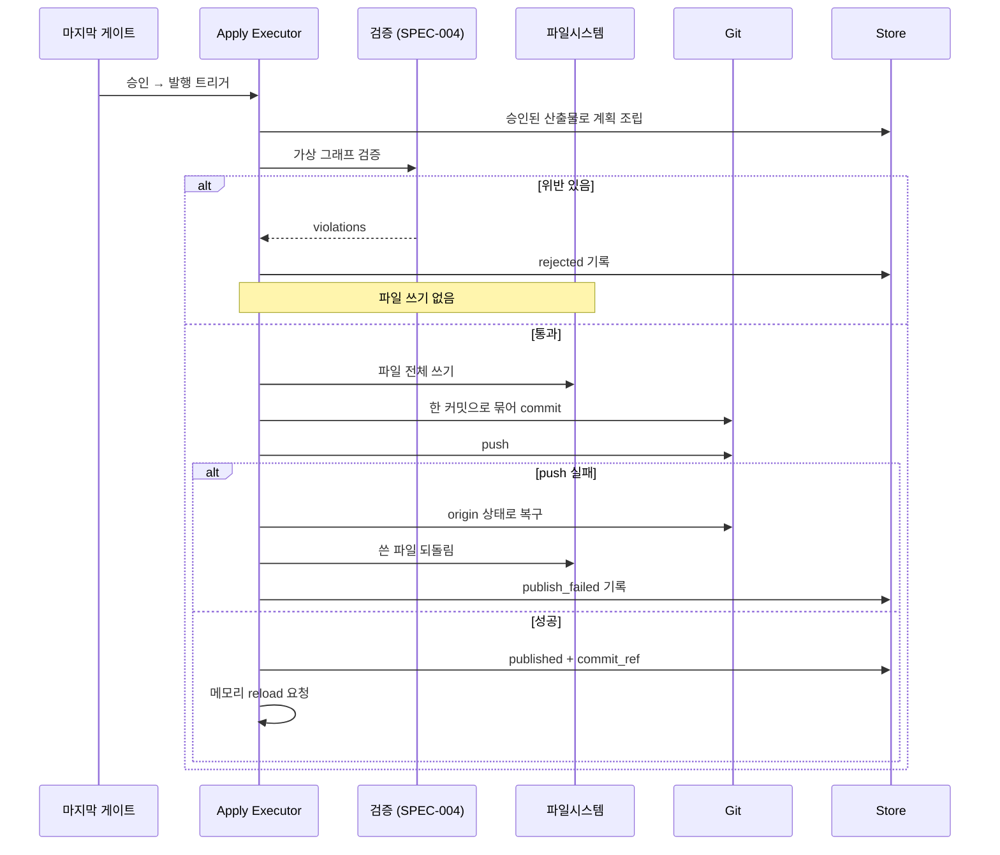

# Apply Executor — 발행 계획 검증과 원자적 발행

승인된 게이트의 산출물을 md 파일로 쓰고 커밋·push한다. **AI는 계획만 내고 실행은 executor가 단독으로 한다.** 전부 성공하거나 전부 되돌린다.

> 무엇을 만들지는 [[spec-008-gate-chain|KDEV-SPEC-008]]이, 그래프 규칙(L1~L6)은 [[spec-004-graph-validation|KDEV-SPEC-004]]가 소유한다. 이 spec은 **계획의 형태와 실행·롤백**을 소유한다.

## 1. Context

### Meta

- Decision reference: [[decision-012-draft-storage-and-publish-boundary|KDEV-DEC-012]] D2~D7
- Baseline reference: [[baseline-003-inbox-approval-pipeline|KDEV-BL-003]]
- Domain note: `ApplyPlan`(발행 계획), `FileAction`, `ApplyResult`. 실행 주체 = back 프로세스 단독.
- Open questions: §7

### Business Requirement

현재 Slack 캡처는 AI 결과를 받아 **곧바로** `atomic_write` → `commit_and_push` → reload를 수행한다. AI 출력이 그대로 `origin/main`이 되는 구조다.

그리고 실패가 조용하다. `commit_and_push_with_retry`는 3회 재시도 후 `False`를 반환할 뿐이고 호출자는 로그만 남긴다. **커밋됐지만 push되지 않은 상태**가 남으면 다음 webhook의 `git reset --hard origin/main`이 그 커밋을 지운다 — 승인한 결과가 사라지는데 아무도 모른다.

발행은 origin에 나가는 동작이라 되돌리기 비싸다. 그래서 **쓰기 전에 검증하고, 실패하면 흔적 없이 되돌려야** 한다.

### Scope

In scope: 발행 계획 형태, 검증 항목, 원자적 실행 순서, 롤백, 발행 결과 기록, 재시도.
Out of scope:
- 게이트·승인 → [[spec-008-gate-chain|KDEV-SPEC-008]]
- L1~L6 규칙 정의 → [[spec-004-graph-validation|KDEV-SPEC-004]] (executor는 호출만)
- 발행 후 정정 — 제품 기능이 아니다(§5)
- git 인증·리모트 설정 (인프라)

## 2. UX Contract

### Placement

발행은 마지막 게이트 승인의 후속 동작이라 별도 화면이 없다. 상태와 실패 처리는 큐 항목 상세에 표시된다([[spec-007-approval-queue|KDEV-SPEC-007]] U-2).

### U-1. 발행 진행 표시

- **상태**: 발행 중 · 발행됨 · 발행 실패
- **문구**: 발행될 파일 목록(경로 + 신규/수정), 진행 단계, 실패 시 사유
- **CTA**: `발행 재시도`(실패 시)
- **기대 결과**: 성공하면 커밋 참조와 함께 발행 완료가 표시된다. 실패하면 사유와 재시도 버튼이 남는다 — **조용히 끝나지 않는다.**

### U-2. 검증 거부 표시

- **상태**: 검증 실패
- **문구**: 위반 규칙과 대상(예: "STT 노트의 `[[whisper-architecture]]`가 존재하지 않습니다")
- **CTA**: 해당 게이트로 이동해 `피드백`
- **기대 결과**: 발행이 거부되고 **파일이 하나도 생기지 않는다.** 게이트는 승인 상태를 유지하며, owner는 피드백으로 재생성하거나 재시도한다.

## 3. User Scenario

### S-1. System — 정상 발행

1. 마지막 게이트가 승인된다.
2. executor가 승인된 모든 게이트의 산출물을 모아 **발행 계획**을 조립한다.
3. 계획을 적용한 **가상 그래프**에 L1~L6를 돌린다([[spec-004-graph-validation|KDEV-SPEC-004]] S-3).
4. 통과하면 파일을 쓰고, 하나의 커밋으로 묶어 push한다.
5. 메모리 reload를 요청한다.
6. 항목이 `published`가 되고 커밋 참조가 기록된다.

### S-2. System — 검증에서 거부된다

1. 계획에 깨진 wikilink가 있다.
2. 검증이 실패한다. **파일을 쓰기 전이다.**
3. 발행 전체를 거부하고 사유를 기록한다. 부분 적용은 없다.
4. 항목은 `publish_failed`가 되고 게이트는 승인 상태를 유지한다.

### S-3. System — push가 실패한다

1. 파일 쓰기와 커밋은 성공했는데 push가 실패한다(네트워크·충돌).
2. 재시도해도 안 되면 **커밋을 되돌려 서버를 origin 상태로 복구**한다.
3. 항목이 `publish_failed`가 되고 사유가 기록된다.
4. owner가 `발행 재시도`를 누르면 파일 쓰기부터 다시 수행한다. **AI를 다시 부르지 않는다** — 계획이 DB에 있다.

> origin에 없는 커밋을 서버에 남기지 않는 이유: 다음 webhook의 `git reset --hard origin/main`이 언제든 지운다. 붙들고 있으면 그걸 막는 예외 처리를 계속 만들어야 한다.

### S-4. System — 파일 여러 장 중 일부만 써진다

1. 3장 중 2장을 쓰고 디스크 오류로 실패한다.
2. 이미 쓴 파일을 되돌린다. **반쪽 발행을 남기지 않는다.**
3. `publish_failed`로 기록한다.

### S-5. System — reload가 거부된다

1. 커밋·push는 성공했는데 메모리 reload가 그래프 검증에서 거부된다.
2. **롤백하지 않는다.** 커밋은 이미 유효하고 origin에 나갔다.
3. 항목은 `published`이되 경고를 함께 기록한다. 서버는 이전 데이터로 계속 서빙한다.

### S-6. owner — 발행된 노트가 틀렸다

1. 발행 후에 내용이 잘못됐음을 발견한다.
2. **옵시디언에서 직접 고치고 커밋한다.** 되돌리기 UI를 쓰지 않는다.
3. 파일이 SoT이고 git이 이력을 가지므로 별도 버전 관리 기능이 중복이다.

## 4. Interface Contract

### API Contract

| Method | Path | 요약 | 권한 |
|---|---|---|---|
| POST | 발행 재시도 | `publish_failed` 항목 재발행 | admin |
| GET | 발행 결과 조회 | 계획·검증 결과·커밋 참조·실패 사유 | admin |

정상 발행은 마지막 게이트 승인의 내부 후속 동작이며 별도 호출이 없다.

### Data Contract — 발행 계획

AI는 이 계획을 **제안**하고, executor가 검증 후 실행한다. AI가 파일·DB·git을 직접 건드리지 않는다.

| Resource | Field | 설명 |
|---|---|---|
| ApplyPlan | `item_id` | 대상 큐 항목 |
| ApplyPlan | `file_actions[]` | 실행할 파일 액션 목록 |
| ApplyPlan | `validation_status` | `pending` · `passed` · `rejected` |
| FileAction | `action` | `create`(신규) 또는 `overwrite`(전문 교체) — **부분 패치 액션은 없다** |
| FileAction | `target_path` | 레포 루트 기준 상대 경로. **AI가 아니라 시스템이 조립한다**(아래) |
| FileAction | `filename_stem` | **AI 출력** — 파일명 후보 |
| FileAction | `content` | 파일 전체 Markdown (신규=신규 전문, 수정=수정 전문) |
| FileAction | `diff_preview` | `overwrite`일 때 변경 요지. **표시용이며 적용 입력이 아니다** |
| ApplyResult | `status` | `published` · `rejected` · `failed` |
| ApplyResult | `commit_ref` | 성공 시 커밋 참조 |
| ApplyResult | `violations[]` | 검증 위반 목록 |
| ApplyResult | `error_code` / `error_message` | 실패 사유 |

**경로 결정 주체**: AI는 **파일명 stem만** 낸다. 디렉토리는 시스템이 층·목적지에서 조립한다([[spec-001-directory-structure|KDEV-SPEC-001]]). AI가 임의 경로를 지정할 수 없게 하는 것이 안전 경계의 일부다.

### Data Contract — 검증 항목

계획은 아래를 **모두** 통과해야 실행된다. 하나라도 위반하면 발행 전체를 거부한다.

| 검증 | 내용 | 소유 |
|---|---|---|
| 경로 allowlist | 목적지 디렉토리 밖 경로 거부. 레포 루트 이탈 거부 | 이 spec |
| 층-경로 정합 | `type`이 디렉토리와 일치 | [[spec-001-directory-structure|KDEV-SPEC-001]] |
| 그래프 검증 | L1 dead link · L2 스키마/필수필드/유일성 · L3 오버레이 · L4 방향 · L6 archive 참조 | [[spec-004-graph-validation|KDEV-SPEC-004]] |
| `up:` 필수 | `concept`·`permanent`에 `up:` 누락 시 거부 | [[spec-004-graph-validation|KDEV-SPEC-004]] L2 |
| 신규 중복 | `create`인데 대상 경로에 파일이 이미 있으면 거부 | 이 spec |
| stale 대상 | 초안 생성 시점 이후 대상 파일이 바뀌었으면 거부하고 재생성 요구 | 이 spec |

`stale 대상` 검증이 필요한 이유: `overwrite`는 승인 화면의 diff를 근거로 승인된다. 그 사이 파일이 바뀌면 **승인 근거가 무효**가 되고, 그대로 덮어쓰면 사이에 들어온 변경이 조용히 사라진다.

### Case Matrix

| 에러 코드 | 백엔드 출력 | 프론트 출력 | 표시 위치 |
|---|---|---|---|
| `PATH_NOT_ALLOWED` | 허용 밖 경로 | 허용되지 않은 경로입니다. | 발행 결과 |
| `LAYER_PATH_MISMATCH` | type과 디렉토리 불일치 | 문서 종류와 경로가 맞지 않습니다. | 발행 결과 |
| `GRAPH_VALIDATION_FAILED` | L1~L6 위반 | 연결에 문제가 있어 발행할 수 없습니다. | 발행 결과 |
| `TARGET_EXISTS` | 신규인데 파일 존재 | 같은 이름의 문서가 이미 있습니다. | 발행 결과 |
| `STALE_TARGET` | 대상 파일이 변경됨 | 대상 문서가 그사이 바뀌었습니다. 다시 생성해 주세요. | 발행 결과 |
| `WRITE_FAILED` | 파일 쓰기 실패 | 파일을 쓰지 못했습니다. 되돌렸습니다. | 발행 결과 |
| `PUSH_FAILED` | push 실패(재시도 소진) | 원격 반영에 실패해 되돌렸습니다. 다시 시도해 주세요. | 발행 결과 |
| `RELOAD_REJECTED` | reload 거부 | 발행은 됐지만 서버 반영이 지연됩니다. | 발행 결과 (경고) |

### Flow

### State / Lifecycle

발행 결과 상태는 큐 항목 status에 반영된다([[spec-007-approval-queue|KDEV-SPEC-007]]): `publishing → published` 또는 `publishing → publish_failed → publishing`(재시도).

## 5. Implementation Rules

- **AI는 파일·DB·git을 직접 건드리지 않는다.** AI 산출물은 계획으로만 저장되고, executor가 검증을 통과한 것만 실행한다. 현재 `service/slack_bridge/runner.py`가 `atomic_write` → `publish()` → `reload_data()`를 직접 호출하는 구조를 이 executor가 대체한다.
- **파일 액션은 `create`와 `overwrite` 둘뿐이다.** 부분 패치를 두지 않는다 — 컨텍스트가 어긋나면 실패하거나 조용히 오적용되는데, 발행은 되돌리기 비싼 동작이라 결정적이어야 한다.
- **경로는 시스템이 조립한다.** AI는 파일명 stem만 낸다.
- **발행 단위 = 승인 1회 = 커밋 1개.** 한 자료에서 나온 문서들이 서로를 `[[]]`로 참조하므로, 나눠 커밋하면 중간 커밋에서 dead link가 생기고 그 시점에 pull한 로컬 옵시디언·검증기가 깨진 그래프를 본다.
- 한 발행 안에서 `create`와 `overwrite`가 섞일 수 있다(concept 보충이 그렇다). 그래도 한 커밋이다.
- **검증은 파일을 쓰기 전에 한다.** 커밋 후 부팅 검증에서 걸리면 이미 origin에 나간 뒤다.
- **실패하면 전량 롤백한다.** 파일 쓰기 실패든 push 실패든 흔적을 남기지 않는다. push 실패 시 커밋도 되돌려 서버를 origin 상태로 복구한다.
- **재시도는 AI를 다시 부르지 않는다.** 계획이 DB에 박제돼 있으므로 파일 쓰기부터 다시 수행한다. 이것이 "붙들지 말고 되돌린다"를 택할 수 있는 이유다.
- **reload 실패는 롤백 사유가 아니다.** 커밋·push는 이미 유효하므로 경고로 노출하고 서버는 이전 데이터로 계속 서빙한다.
- 발행 결과(성공/실패, 사유, 커밋 참조, 검증 위반)를 **반드시 기록**한다. 조용히 실패하는 경로를 남기지 않는다.
- **발행 후 정정은 제품 기능이 아니다.** 되돌리기 UI를 만들지 않는다. 발행 전 정정은 게이트 피드백으로, 발행 후 정정은 옵시디언 직접 편집으로 처리한다.
- executor는 back 프로세스에서 **단독으로** 실행된다([[decision-013-slack-bridge-into-backend|KDEV-DEC-013]]). git push 소유권이 두 프로세스로 갈리지 않는다.

## 6. Verification

### Acceptance Criteria

- [ ] 마지막 게이트 승인이 발행을 트리거한다.
- [ ] 한 발행이 **하나의 커밋**을 만든다.
- [ ] 신규 생성과 기존 파일 교체가 한 커밋에 함께 들어간다.
- [ ] 검증은 파일을 쓰기 **전에** 수행된다.
- [ ] 깨진 wikilink가 있으면 발행이 거부되고 파일이 하나도 생기지 않는다.
- [ ] `concept`에 `up:`이 없으면 발행이 거부된다.
- [ ] 허용 밖 경로가 계획에 있으면 거부된다.
- [ ] 신규 생성 대상 경로에 파일이 이미 있으면 거부된다.
- [ ] 초안 생성 후 대상 파일이 바뀌었으면 거부되고 재생성을 요구한다.
- [ ] 파일 일부만 쓰고 실패하면 이미 쓴 파일이 되돌려진다.
- [ ] push 실패 시 커밋이 되돌려져 서버가 origin 상태가 된다.
- [ ] push 실패 후 서버에 origin에 없는 커밋이 남지 않는다.
- [ ] 발행 실패가 기록되고 admin에 재시도 CTA가 표시된다.
- [ ] 발행 재시도가 AI를 호출하지 않는다.
- [ ] reload 거부 시 롤백하지 않고 경고만 남긴다.
- [ ] 발행 성공 시 커밋 참조가 기록된다.
- [ ] 발행 후 노트를 되돌리는 UI가 존재하지 않는다.

## 7. Open Questions

- **(OPEN)** 발행 커밋 메시지 형식 — 자료 제목 기반인지 항목 id 기반인지([[decision-012-draft-storage-and-publish-boundary|KDEV-DEC-012]] OQ-1).
- **(OPEN)** 발행 실패가 반복될 때 Slack 알림 임계([[decision-012-draft-storage-and-publish-boundary|KDEV-DEC-012]] OQ-4).
- **(OPEN)** stale 거부가 실제로 얼마나 자주 나는지. concept 보충이 몰리면 잦아질 수 있다([[decision-012-draft-storage-and-publish-boundary|KDEV-DEC-012]] OQ-2).
- **(OPEN)** 가상 그래프 검증을 전체 재조립으로 할지 증분으로 할지. 현재 규모(406노드)에서는 전체도 감당 가능해 보이나 실측이 필요하다([[spec-004-graph-validation|KDEV-SPEC-004]] §7).
- **(OPEN)** 롤백 자체가 실패하는 경우(디스크·git 이상). 지금은 기록하고 수동 개입을 전제한다.
