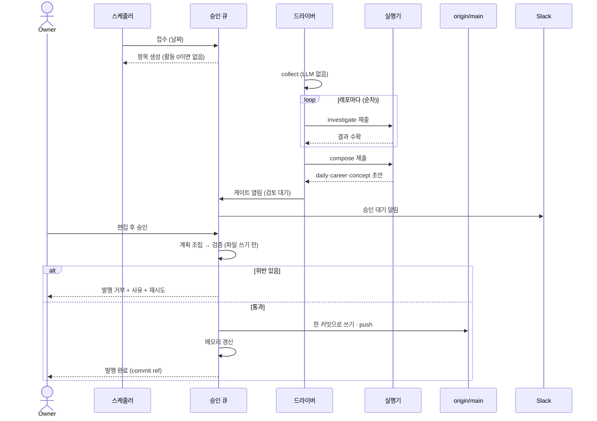
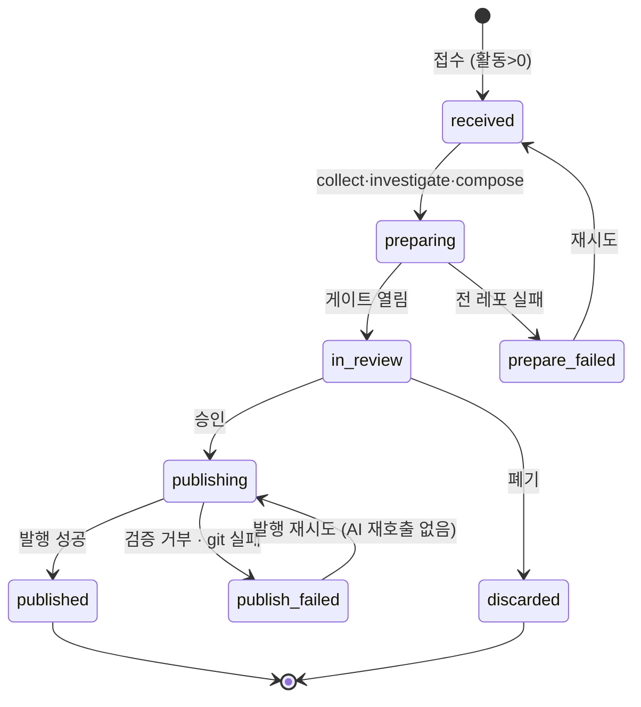

# 잔디 승인 게이트 — daily_commit 파이프라인과 발행

잔디 산출물이 **사람 승인 없이 발행되지 않게** 한다. 기존 승인 큐·게이트·피드백 계약을 그대로 쓰고, 파이프라인 정의 하나와 발행 검증 확장만 더한다.

> 조사 입력은 [[spec-011-commit-collection|KDEV-SPEC-011]], 산출 문서 형식은 [[spec-012-grass-artifacts|KDEV-SPEC-012]].

## 1. Context

### Meta

- Decision reference: [[decision-016-grass-gate-and-publish|KDEV-DEC-016]]
- Baseline reference: [[baseline-004-commit-pipeline-and-career|KDEV-BL-004]]
- Domain note: `source_kind = daily_commit`, 스테이지 `collect`·`investigate`·`compose`(자동) + `daily`(게이트). 항목 상태기계·게이트 상태·리비전 계약은 승인 큐·게이트 체인·피드백 spec 을 그대로 따른다.
- Open questions: 없음

### Business Requirement

AI 가 만든 결과물이 사람 검토 없이 `origin/main` 으로 나가는 경로가 넷 있었고, 지식 캡처는 승인 게이트로 옮겨졌다. **잔디는 그중 유일하게 남아 매일 자동으로 반복된다.** 게다가 지금은 발행 실패 시 되돌리는 경로가 없어, push 가 실패하면 로컬 커밋이 남고 다음 작업트리 초기화가 그것을 조용히 지운다.

동시에 잔디는 커밋 diff 를 읽게 되므로(SPEC-011) **회사 코드 서술이 공개 레포에 나가는 경로**가 새로 생긴다. 그 통제 지점이 게이트다.

### Scope

In scope:

- `daily_commit` 파이프라인 정의와 스테이지 계약
- fan-out(레포별 조사) 배치와 부분 실패 처리
- route 없는 체인의 진행 규칙
- 게이트 화면 요구(줄 단위 편집·문장 단위 승인)
- 발행 검증 확장 — 경로 허용·층 매핑·`upsert`·그래프 검증 제외·본인 작성 보호
- 원자적 발행 전환, 접수 진입점, 날짜 축 중복 판정, 백필
- 승인 대기 알림

Out of scope:

- 조사 입력 → SPEC-011, 문서 형식 → SPEC-012
- 게이트 생성·피드백·재생성·승인의 공통 계약 → 기존 게이트 체인·피드백 spec (변경 없음)
- `algorithms`·`content_enrich` 잡의 게이트 편입 — 후속
- 그래프 재정비

## 2. UX Contract

### Placement

기존 승인 큐 화면을 그대로 쓴다. 항목 상세에 게이트가 하나 있고, 그 안에 목적지별 토글과 편집 영역이 들어간다.

```text
+──────────────────────────────────────────────────+
│ 승인 큐 › 항목 #N (daily_commit · 2026-07-31)     │
+──────────────┬───────────────────────────────────+
│ 진행 표시     │ [daily] 요약 줄 · 본문             │
│ collect ✓    │ [career] medisolve-ai 갱신안       │
│ investigate ✓│ [concept] 개념 N건                 │
│ compose  ✓   │                                    │
│ daily   ●    │ [피드백] [재생성] [승인]            │
+──────────────┴───────────────────────────────────+
```

### U-1. 조사 진행 표시

- **상태**: `collect`·`investigate`·`compose` 각각 진행 중/완료/실패. `investigate` 는 레포 N건 중 진행 수를 보여준다
- **문구**: `조사 중 (3/13)` · `레포 2개 조사 실패` · `입력 상한 적용 — 일부 diff 생략`
- **CTA**: 없음(자동 스테이지)
- **기대 결과**: 완료되면 게이트가 검토 대기로 열린다

### U-2. daily 검토

- **상태**: 항상 켜져 있다. 끌 수 없다
- **문구**: 활동 단위별 요약 줄 목록 + 본문
- **CTA**: **줄 단위 편집·삭제**. 본문은 전문 편집
- **기대 결과**: 고친 결과가 승인 대상이 된다. AI 제안 원본이 아니다

### U-3. career 검토

- **상태**: 갱신안이 있을 때만 나타난다. `changed: false` 이거나 귀속 커밋이 0이면 영역 자체가 없다
- **문구**: 대상 career 이름 + 섹션별 갱신안. **기존 문서와의 차이를 보여준다**
- **CTA**: **문장 단위 승인·제외** 토글. career 는 이력서라 다른 목적지보다 촘촘해야 한다
- **기대 결과**: 제외한 문장은 발행 계획에 들어가지 않는다

### U-4. concept 검토

- **상태**: 개념 후보가 있을 때만. 신규/보충이 구분돼 보인다
- **문구**: 개념별 제목 + 본문 + 신규인지 기존 보충인지
- **CTA**: 개념별 제외 토글
- **기대 결과**: 제외한 개념은 파일이 만들어지지 않는다

### U-5. 승인 대기 알림

- **상태**: 조사가 끝나 게이트가 열렸을 때
- **문구**: `:seedling: 잔디 승인 대기 — {date}` + counts 요약. **미승인이 2건 이상 쌓이면 재알림**
- **CTA**: 없음(알림 전용)
- **기대 결과**: 매일 울리지 않는다 — 밀리기 시작한 시점에만 신호가 된다

## 3. User Scenario

### S-1. owner — 그날 잔디를 승인한다

1. 아침에 Slack 으로 승인 대기 알림을 받는다.
2. 승인 큐에서 그날 항목을 연다. `collect`·`investigate`·`compose` 가 끝나 있고 게이트가 검토 대기다.
3. daily 요약 줄을 훑고, 회사 코드 서술 중 공개하기 곤란한 문장을 지운다.
4. career 갱신안에서 부정확한 문장을 제외 처리한다.
5. concept 후보 중 억지스러운 것을 제외한다.
6. 승인한다. **승인이 곧 발행이다** — daily·career·concept 가 한 커밋으로 나간다.
7. 발행이 끝나면 서버 메모리가 갱신되고 잔디에 그날 칸이 든다.

### S-2. owner — 며칠 승인을 못 했다

1. 승인 안 된 날의 잔디 칸은 **비어 있다.** 지금은 그날 바로 나가니 없던 갭이다.
2. 미승인이 2건이 되면 Slack 이 다시 알린다.
3. 나중에 각 항목을 승인하면 그날 칸이 채워진다 — 날짜는 항목이 들고 있어 늦게 승인해도 제자리에 들어간다.

### S-3. owner — 제안이 마음에 안 든다

1. 피드백을 적고 재생성을 누른다.
2. 이전 버전은 read-only 로 남고 새 버전이 만들어진다.
3. 조사 결과(`collect`·`investigate`)는 **다시 돌지 않는다.** 원문이 바뀐 게 아니라 서술이 마음에 안 든 것이다.

### S-4. System — 일부 레포 조사가 실패한다

1. 레포 하나의 fetch·조사가 실패해도 나머지로 진행한다.
2. 실패한 레포를 결과에 남기고 게이트 화면이 표시한다.
3. **전 레포가 실패하면** 그때는 스테이지 실패다 — 재시도를 열어 둔다.

### S-5. System — 발행 검증이 거부한다

1. 검증은 **파일을 쓰기 전에** 전부 끝난다.
2. 하나라도 위반이면 발행 전체를 거부하고 파일을 만들지 않는다.
3. 거부 사유가 화면에 남고 재시도를 열어 둔다 — AI 를 다시 부르지 않고 계획만 다시 쓴다.

### S-6. System — 대상 daily 가 본인 작성이다

1. 접수 단계에서 이미 걸러진다(SPEC-011).
2. 경합으로 접수 후에 사람이 직접 썼다면, **발행 검증이 막는다.**
3. 항목은 발행 실패로 남고 사람이 폐기한다.

### S-7. owner — 과거 날짜를 다시 만든다

1. 날짜를 지정해 접수한다(백필).
2. 같은 날짜의 미발행 항목이 이미 있으면 새로 만들지 않고 그 항목에 합류한다.
3. 이미 발행된 날짜면 재조사가 정당할 수 있으므로 사람 확인을 거쳐 진행한다.

## 4. Interface Contract

### API Contract

기존 승인 큐 표면을 그대로 쓴다. 접수 경로 하나만 는다.

| Method | Path | 요약 | 권한 |
|---|---|---|---|
| POST | `/api/admin/queue/items` | 잔디 항목 접수 (날짜 지정 = 백필) | admin |
| GET | `/api/admin/queue/items/{id}/gates` | 게이트 조회 (기존) | admin |
| POST | `/api/admin/queue/gates/{id}/feedback` | 피드백 (기존) | admin |
| POST | `/api/admin/queue/gates/{id}/regenerate` | 재생성 (기존) | admin |
| POST | `/api/admin/queue/gates/{id}/retry` | 재시도 (기존) | admin |
| POST | `/api/admin/queue/gates/{id}/approve` | 승인 = 발행 (기존) | admin |
| POST | `/api/admin/queue/items/{id}/publish` | 발행 재시도 (기존) | admin |

스케줄러는 API 를 거치지 않고 접수 함수를 직접 호출한다.

### Validation

| 필드 | 규칙 |
|---|---|
| 접수 날짜 | 미지정이면 어제(KST). 지정 시 미래 날짜 불가 |
| 중복 판정 | 날짜 기준. 같은 날짜의 미발행 항목이 있으면 합류 |
| 승인 payload | 사람 전용 필드(`bullets`·`period`·`is_current` 등)를 포함할 수 없다 |
| 승인 버전 | 화면이 보고 있는 리비전이 최신이어야 한다 (낙관적 잠금, 기존 계약) |

### Case Matrix

| 에러 코드 | 백엔드 출력 | 프론트 출력 | 표시 위치 |
|---|---|---|---|
| `PATH_NOT_ALLOWED` | 발행 거부, 파일 미생성 | `발행이 쓸 수 없는 경로` | 항목 상세 |
| `LAYER_PATH_MISMATCH` | 〃 | `타입과 경로가 어긋난다` | 항목 상세 |
| `USER_AUTHORED_DAILY` | 〃 | `그날 daily 는 본인 작성이다 — 덮어쓰지 않는다` | 항목 상세 |
| `PROTECTED_FIELD` | 〃 | `사람 전용 필드는 자동 갱신할 수 없다` | 항목 상세 |
| `TARGET_MISSING` | 〃 | `수정 대상 파일이 사라졌다` | 항목 상세 |
| `EMPTY_PLAN` | 〃 | `발행할 것이 없다` | 항목 상세 |
| `GIT_FAILED` | 전량 롤백 후 실패 기록 | `발행 실패 — 되돌렸다` + 재시도 | 항목 상세 |
| `INVESTIGATE_ALL_FAILED` | 스테이지 실패 | `전 레포 조사 실패` + 재시도 | 게이트 카드 |
| `GATE_ALREADY_APPROVED` | 409 | `이미 승인된 단계다` | 게이트 카드 |
| `STALE_REVISION` | 409 | `화면이 보고 있는 버전이 최신이 아니다` | 게이트 카드 |

### Flow



### State / Lifecycle

파이프라인 정의:

| 스테이지 | 종류 | 하는 일 |
|---|---|---|
| `collect` | 자동 | git 조사·career 귀속·`counts` (LLM 없음) |
| `investigate` | 자동 | 레포별 상세 조사 — **N 건 fan-out** |
| `compose` | 자동 | 취합 — daily·career·concept 초안 |
| `daily` | **게이트** | 하루 1개. 승인 = 발행 |



**route 게이트가 없다.** 잔디는 목적지가 고정이라 고를 것이 없다. 게이트가 하나뿐이므로 승인이 곧 체인 종료이고 발행 트리거다.

### Data Contract — 발행 계획 확장

| 항목 | 계약 |
|---|---|
| 허용 경로 | 기존 지식층 경로 + `persona/daily/` + `persona/career/` |
| 층 매핑 | `daily` → `persona/daily/`, `career` → `persona/career/` |
| 액션 | 기존 `create`·`replace` + **`upsert`** |
| `upsert` 검증 | 경로 허용·층 매핑만 본다. **파일 존재 여부를 보지 않는다** |
| 그래프 검증 | `daily`·`career` **제외**. `concept` 는 기존 규율 그대로 |
| 본인 작성 보호 | `daily` 대상 파일이 본인 작성이면 위반 |
| 사람 전용 필드 | 계획에 포함되면 위반 |
| 발행 단위 | **승인 1회 = 커밋 1개.** daily·career·concept 를 한 커밋으로 |
| 실패 처리 | 전량 롤백 — 원래 커밋 상태로 되돌린다 |

`upsert` 가 필요한 이유: daily·career 는 첫 회 생성과 이후 덮어쓰기가 **둘 다 정상**이라, `create`/`replace` 만으로는 매일 액션 종류가 갈린다.

그래프 검증 제외 이유: `daily`·`career` 는 지식그래프 노드가 아니다. 상류 참조가 없어 검증에 얹으면 위반으로 막힌다.

## 5. Implementation Rules

- **fan-out 은 게이트 밖에 둔다.** `investigate` 는 자동 스테이지라 승인 리비전을 만들지 않는다. 게이트 공통 계약(리비전 1:1, 수확 멱등)을 건드리지 않는다.
- **부분 실패는 진행한다.** 레포 하나가 막혀도 나머지로 간다. 전부 실패하면 스테이지 실패.
- **"변경 없음"이 정상 출력이다.** 귀속 커밋 0이면 스테이지를 만들지 않고(AI 미호출), 커밋은 있으나 더할 게 없으면 `changed: false`.
- **route 없는 체인** — 목적지 판정 결과가 없으면 "끄는 주체가 없다" 로 읽어 정의된 게이트를 전부 켠 것으로 본다. 게이트가 하나뿐인 잔디에서는 첫 승인이 곧 체인 종료다.
- **원자적 발행** — 재시도 후 남는 로컬 커밋을 허용하지 않는다. 서버는 항상 origin 과 같거나, 발행이 끝난 상태다.
- **발행 재시도는 AI 를 부르지 않는다.** 저장된 계획으로 다시 쓴다.
- **접수는 스케줄러가 한다.** 요청 안에서 조사·AI 호출을 기다리지 않는다 — 제출까지만 하고 드라이버가 이어 민다.
- **날짜 축 중복** — 같은 날짜의 미발행 항목이 있으면 새 항목을 만들지 않고 합류한다.
- **백필** — 접수 시 날짜 지정으로 과거 날짜를 다시 만들 수 있다.

## 6. Verification

### Acceptance Criteria

- [ ] 스케줄러 발동으로 항목이 접수되고 요청이 AI 를 기다리지 않는다
- [ ] `investigate` 가 레포 수만큼 실행되고 진행 수가 화면에 보인다
- [ ] 레포 하나가 실패해도 게이트가 열리고, 실패 레포가 화면에 표시된다
- [ ] 전 레포 실패 시 스테이지 실패로 닫히고 재시도가 열린다
- [ ] 게이트가 하나이고 승인 즉시 발행된다
- [ ] daily 요약 줄을 지우고 승인하면 지운 결과가 발행된다
- [ ] career 문장을 제외하고 승인하면 제외분이 파일에 없다
- [ ] `persona/daily/`·`persona/career/` 경로가 발행 허용된다
- [ ] daily·career 가 그래프 검증 대상에서 빠지고 concept 는 검증을 받는다
- [ ] 같은 날 두 번 승인해도 `upsert` 로 통과한다 (`ALREADY_EXISTS` 없음)
- [ ] 대상 daily 가 본인 작성이면 발행이 거부된다
- [ ] 사람 전용 필드가 계획에 있으면 발행이 거부된다
- [ ] push 실패 시 로컬 커밋이 남지 않고 원래 상태로 되돌아간다
- [ ] 발행 재시도가 AI 를 다시 부르지 않는다
- [ ] 승인 대기 알림이 발동 시 1회 나가고, 미승인 2건 이상일 때 재알림된다
- [ ] 같은 날짜로 두 번 접수하면 항목이 하나만 생긴다
- [ ] 날짜를 지정한 백필 접수가 동작한다
- [ ] 기존 유튜브 파이프라인이 회귀 없이 동작한다

## 7. Open Questions

없음.
