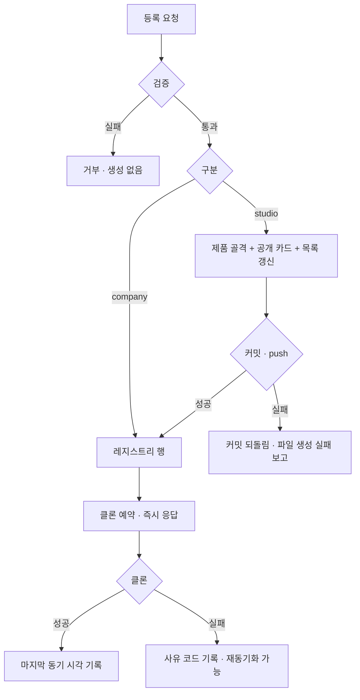

# 제품 레지스트리 — 등록·스캐폴딩·미등록 발견

관리자가 **제품과 레포를 한 화면에서 등록·연결하고**, 추적에서 빠진 레포를 발견한다. 등록은 제품 문서 골격과 공개 카드를 결정적으로 생성하고, 레포를 즉시 클론해 성공/실패를 그 자리에서 보여준다.

## 1. Context

### Meta

- Decision reference: [[decision-017-product-registry-and-admin-scaffold|KDEV-DEC-017]]
- Baseline reference: [[baseline-005-product-project-career-link|KDEV-BL-005]]
- Domain note: 레지스트리 행은 `slug`(레포) · `type`(`company`\|`studio`) · `detail`(career stem) · **`product_slug`(신설)** · `account` · `enabled` · 클론 상태를 외부에 드러낸다. 제품 카드는 `products/{slug}/showcase.md` 로 남고 DB 에 들어가지 않는다.
- Open questions: 없음

### Business Requirement

- **추적에서 빠진 레포가 조용히 누락된다.** 레지스트리가 `showcase.md` 에서 1회 시드돼 그 사각지대를 물려받았고, 이후 발견 장치가 없다. 실측 결과 미등록 레포 4개에 **최근 30일 본인 커밋 57건**이 있었고 잔디는 매일 정상 종료했다.
- **제품·프로젝트·커리어를 잇는 키가 없다.** 레포가 어느 제품인지 시스템이 모른다. 이 키가 있어야 잔디가 studio 커밋을 제품으로 보낼 수 있다(후속).
- **등록 오타가 하루 숨는다.** 클론·fetch 는 09:05 잡 안에서만 돈다. 손입력 화면을 만들면서 즉시 검증이 없으면 오타가 다음 날까지 드러나지 않는다.
- **제품 문서 골격을 손으로 만들면 빠뜨린다.** 검증이 요구하는 최소 집합이 6 파일인데, 지금은 어디에도 그 목록이 코드로 고정돼 있지 않다.

### Scope

In scope:

- 레지스트리 조회 · 등록 · 수정 · 비활성(CRU)
- 제품 등록 — `type` 구분, studio 스캐폴딩, 레포 등록·클론, 공개 카드 생성
- 미등록 레포 발견과 알림
- 레포 수동 재동기화
- 클론 상태(마지막 동기 시각 · 실패 사유) 노출
- 제품 디렉토리 실재 여부 노출

Out of scope:

- 제품 문서 본문 편집·삭제 — 로컬에서 한다
- 공개 카드 본문 편집 · `visible` 토글 — 파일이 SoT 다
- 잔디 산출물에 제품을 더하는 것 — 후속 spec
- 레지스트리 행 물리 삭제 — 비활성으로 대신한다

## 2. UX Contract

### Placement

admin 사이드바 **「프로젝트」** 슬롯 (`/admin/projects`). 인증은 [[spec-006-admin-auth|KDEV-SPEC-006]] 의 admin 세션을 그대로 쓴다.

구성: `U-1` 미등록 배너 · `U-2` 레지스트리 표 · `U-3` 새 제품 등록 · `U-4` 행 편집.

### U-1. 미등록 레포 배너

표 위에 놓인다. 미등록이 0이면 **표시하지 않는다.**

| 상태 | 문구 | CTA | 기대결과 |
|---|---|---|---|
| 미등록 있음 | `추적에 없는 레포 N건` + 레포 이름 칩 | 칩 클릭 | `U-3` 이 해당 레포로 채워진 채 열린다 |
| 조회 실패 | `미등록 확인 실패 — {사유}` | 재시도 | 표는 정상 표시된다. 배너 실패가 화면을 막지 않는다 |
| 미등록 없음 | (숨김) | — | — |

fork·아카이브·본인 계정이 아닌 레포는 목록에 넣지 않는다.

### U-2. 레지스트리 표

| 열 | 값 | 편집 |
|---|---|---|
| 레포 | `owner/name` | ✗ (등록 후 불변) |
| 제품 | `product_slug` · 디렉토리가 없으면 `⚠ 제품 폴더 없음` | ✓ 드롭다운 |
| 커리어 | `detail` — `company` 만 값이 있다 | ✓ 드롭다운 |
| 긁기 | `enabled` | ✓ 토글 |
| 노출 | 공개 카드의 노출 여부 | **✗ 읽기 전용** — 파일이 SoT 다 |
| 마지막 동기 | 성공 시각 · 실패 시 사유 코드 · 진행 중이면 `동기화 중…` | — |
| — | 재동기화 | ✓ 버튼 |

- `⚠ 제품 폴더 없음` 은 **경고이지 차단이 아니다.** 저장은 된다.
- `노출` 열이 눌리지 않는 것이 *"이 값은 파일에 있다"* 는 설명을 겸한다.

### U-3. 새 제품 등록

| 필드 | 입력 | 조건 |
|---|---|---|
| 구분 | `company` \| `studio` | 필수 |
| 커리어 | 드롭다운(실재하는 career 문서) | `company` 일 때 필수 |
| 제품 slug | 텍스트 | `studio` 일 때 필수 |
| 레포 | `owner/name` 또는 GitHub URL | 필수 |
| 카드 — 제목·요약 | ko / en | `studio` 일 때 필수 |
| 카드 — 분류 | **드롭다운** | `studio` 일 때 필수 |
| 카드 — 상태 | 드롭다운 | `studio` 일 때 필수 |
| 카드 — 스택 | 태그 입력 | `studio` 일 때 필수 |

- **`studio` 만 파일을 만든다.** `company` 는 레지스트리 행과 클론까지고, 제품 문서도 공개 카드도 만들지 않는다.
- 분류는 자유입력이 아니다 — 정해진 목록 밖의 값은 **사이트 전체를 옛 데이터에 묶는다**(§4 Validation).
- 카드 번호는 사람이 입력하지 않는다. 시스템이 부여한다.

| 상태 | 문구 | 기대결과 |
|---|---|---|
| 검증 실패 | 필드별 사유 | 아무것도 만들어지지 않는다 |
| 생성 성공 | `등록됨 — 클론 진행 중` | 표에 행이 추가되고 `동기화 중…` |
| 클론 실패 | 표의 `마지막 동기` 에 사유 코드 | **행과 파일은 남는다.** 재동기화로 다시 시도 |

### U-4. 행 편집

`product_slug` · `detail` · `enabled` 를 고친다. `product_slug` 를 바꿔도 **파일을 옮기지 않는다** — 연결만 바뀐다.

## 3. User Scenario

### S-1. 소유자 — 새 개인 제품을 등록한다

1. `/admin/projects` 진입 → 배너에 `추적에 없는 레포 3건`
2. `ax-graph` 칩 클릭 → 등록 폼이 레포로 채워진 채 열림
3. 구분 `studio`, 제품 slug `ax-knowledge-graph`, 카드 정보 입력
4. 저장 → 제품 문서 골격 + 공개 카드가 **한 커밋**으로 생성되고 push
5. 표에 행 추가, `동기화 중…` → 수십 초 뒤 마지막 동기 시각 표시
6. 배너의 미등록이 2건으로 줄어든다

### S-2. 소유자 — 회사 레포를 추적에 넣는다

1. 등록 폼 → 구분 `company`, 커리어 `medisolve-ai`, 레포 입력
2. 저장 → **파일은 생성되지 않고** 레지스트리 행 + 클론만
3. 다음 09:05 부터 그 레포 커밋이 커리어 갱신 근거에 포함된다

### S-3. 소유자 — 오타를 즉시 안다

1. 레포를 `kknaks/ax-grph` 로 잘못 입력하고 저장
2. 표에 행이 생기고 `동기화 중…` → 곧 `✕ REPO_NOT_FOUND`
3. **다음 날 09:05 을 기다리지 않고 그 자리에서 안다**

### S-4. 소유자 — 추적을 잠시 끈다

1. `긁기` 토글을 끈다 → 다음 조사부터 제외
2. 행·클론·파일은 남는다. 다시 켜면 그대로 재개된다

## 4. Interface Contract

### API Contract

모두 admin 인증이 필요하다. 인증 실패는 [[spec-006-admin-auth|KDEV-SPEC-006]] 계약을 따른다.

| Method | Path | 목적 |
|---|---|---|
| GET | `/api/admin/products` | 레지스트리 목록 + 제품 실재 여부 + 클론 상태 |
| GET | `/api/admin/products/options` | 폼 선택지 — 제품 디렉토리 · 분류 · 상태 · career stem |
| GET | `/api/admin/products/undiscovered` | 미등록 레포 목록 |
| POST | `/api/admin/products` | 제품 등록 (스캐폴딩 + 카드 + 레지스트리 행 + 클론 예약) |
| PATCH | `/api/admin/products/{id}` | `product_slug` · `detail` · `enabled` 수정 |
| POST | `/api/admin/products/{id}/sync` | 수동 재동기화 |

### Request / Response

- **등록 요청**은 구분에 따라 필요한 필드가 다르다. `company` 는 커리어 stem 과 레포만, `studio` 는 제품 slug 와 카드 정보를 함께 받는다.
- **목록 응답의 각 행**은 레지스트리 값에 더해 **파생 두 가지**를 포함한다 — ① `product_slug` 가 가리키는 디렉토리의 실재 여부 ② 공개 카드의 노출 값(읽기 전용). 둘 다 DB 에 저장하지 않고 응답 시점에 판정한다.
- **등록 응답은 클론을 기다리지 않는다.** 행 생성 직후 반환하고, 클론 결과는 목록 조회로 확인한다.

### Validation

거부는 **파일을 쓰기 전에** 판정한다. 하나라도 걸리면 아무것도 만들어지지 않는다.

| 규칙 | 대상 | 사유 코드 |
|---|---|---|
| 레포 식별자 형식 (`owner/name`) | 등록·수정 | `INVALID_SLUG` |
| 레포 중복 | 등록 | `SLUG_TAKEN` |
| 제품 slug 형식 (소문자·숫자·하이픈) | 등록 | `INVALID_PRODUCT_SLUG` |
| 제품 디렉토리 이미 존재 | 등록 | `PRODUCT_EXISTS` |
| `company` 인데 커리어 stem 없음 / 실재하지 않음 | 등록·수정 | `CAREER_REQUIRED` · `CAREER_NOT_FOUND` |
| 카드 필수 필드 누락 | 등록(studio) | `CARD_FIELD_MISSING` |
| **분류가 허용 목록 밖** | 등록(studio) | `CATEGORY_INVALID` |

**분류 검증이 특히 중요하다.** 허용 목록 밖의 값이 파일에 들어가면 페르소나 로드 **전체**가 실패하고, 사이트는 옛 데이터를 계속 서빙한다. 파일 하나의 문제로 끝나지 않는다.

`product_slug` 가 실재하는 디렉토리인지는 **거부 사유가 아니다.** 저장하고 화면에 경고로 표시한다.

### Case Matrix

| 상황 | 결과 | 사용자가 보는 것 |
|---|---|---|
| 정상 등록 (studio) | 골격 6 파일 + 카드 + 행, 한 커밋 | `등록됨 — 클론 진행 중` |
| 정상 등록 (company) | 행만 | `등록됨 — 클론 진행 중` |
| 검증 실패 | 아무것도 생성 안 됨 | 필드별 사유 |
| 커밋 성공·push 실패 | **커밋 되돌림.** 행은 남는다 | `파일 생성 실패 — 재시도 필요` |
| 클론 실패 | 행·파일 유지 | 사유 코드 + 재동기화 버튼 |
| 미등록 조회 실패 | 배너만 실패 | `미등록 확인 실패` · 표는 정상 |
| 제품 폴더가 사라짐 | 행 유지 | `⚠ 제품 폴더 없음` |

### Flow



### State / Lifecycle

레지스트리 행의 **추적 상태**는 둘뿐이다.

```text
enabled(추적) ⇄ disabled(제외)
```

- 물리 삭제가 없다. 제외해도 행·클론·파일이 남고, 다시 켜면 그대로 재개된다.
- **클론 상태는 추적 상태와 독립이다.** 추적 중이면서 클론 실패인 상태가 정상이고, 그 조합이 "고쳐야 할 것" 을 가리킨다.

| 클론 상태 | 의미 |
|---|---|
| 미동기 | 등록됐으나 아직 클론 전 |
| 동기화 중 | 진행 중 |
| 정상 | 마지막 성공 시각 있음 |
| 실패 | 사유 코드 있음. 재동기화로 재시도 |

### Data Contract

외부에 드러나는 값만 적는다. 스키마 전문은 코드가 SoT 다.

| 값 | 설명 |
|---|---|
| 레포 식별자 | `owner/name`. 유일하고 등록 후 바뀌지 않는다 |
| 구분 | `company` \| `studio` |
| 커리어 귀속 | career 문서 stem. `company` 만 갖는다 |
| **제품 연결** | 제품 디렉토리명. **신설.** `company`·`studio` 둘 다 가질 수 있고 비어 있어도 된다 |
| 계정 | 클론·조회에 쓸 토큰 선택 |
| 추적 여부 | 조사 대상인지 |
| 클론 상태 | 마지막 성공 시각 · 마지막 실패 사유 |

**공개 카드는 이 계약에 없다.** 파일이 SoT 이고, 시스템은 그 존재와 노출 값을 읽기만 한다.

## 5. Implementation Rules

- **생성물의 최소 집합을 코드가 고정한다.** 제품 골격은 검증이 요구하는 최소 파일만 만든다. 템플릿 트리를 통째로 복사하지 않는다 — **문서 골격에 딸린 예시 문서가 함께 복사되면 지식 그래프에 같은 식별자가 둘 생겨 백엔드가 부팅되지 않는다.** 복사 목록은 화이트리스트로 두고 테스트로 고정한다.
- **한 번의 등록은 한 커밋이다.** 나눠 커밋하면 중간 커밋에 검증 실패 상태가 원격에 남는다.
- **push 가 실패하면 커밋을 되돌린다.** 원격에 없는 로컬 커밋은 다음 동기화가 조용히 지운다.
- **AI 를 호출하지 않는다.** 전 과정이 복사·치환·검증이다. 비동기로 도는 것은 클론뿐이다.
- **막지 않고 알린다.** 제품 디렉토리 부재, 미등록 레포, 클론 실패는 전부 차단이 아니라 표시다. 자동 등록·자동 생성으로 대신하지 않는다.
- **카드 번호는 기존 최대값 다음을 쓴다.** 비어 있는 과거 번호를 재사용하지 않는다.
- 백엔드 계층 구조는 `40-architecture/system/README.md` 「백엔드 계층 규약」을 따른다.

## 6. Verification

### Acceptance Criteria

- [ ] 미등록 레포가 있으면 배너에 뜨고, 칩을 누르면 등록 폼이 채워진 채 열린다
- [ ] fork·아카이브·타인 레포는 미등록 목록에 없다
- [ ] 미등록 조회가 실패해도 표는 정상 표시된다
- [ ] `studio` 등록이 제품 골격과 공개 카드를 **한 커밋**으로 만든다
- [ ] `company` 등록은 파일을 만들지 않는다
- [ ] 예시 문서가 제품 디렉토리에 복사되지 않는다 — 제품 둘을 연속 등록해도 부팅과 그래프 검증이 통과한다
- [ ] 허용 목록 밖 분류로 등록하면 거부되고, 파일이 하나도 생기지 않는다
- [ ] 잘못된 레포로 등록하면 표에 실패 사유가 뜬다 — 다음 날을 기다리지 않는다
- [ ] push 실패 시 로컬 커밋이 남지 않는다
- [ ] `product_slug` 가 실재하지 않아도 저장되고 경고로 표시된다
- [ ] `노출` 열은 편집되지 않는다
- [ ] 추적을 껐다 켜도 행·클론·파일이 유지된다
- [ ] 등록 응답이 클론 완료를 기다리지 않는다
- [ ] 카드 번호가 기존 최대값 다음으로 부여된다

## 7. Open Questions

없음.
