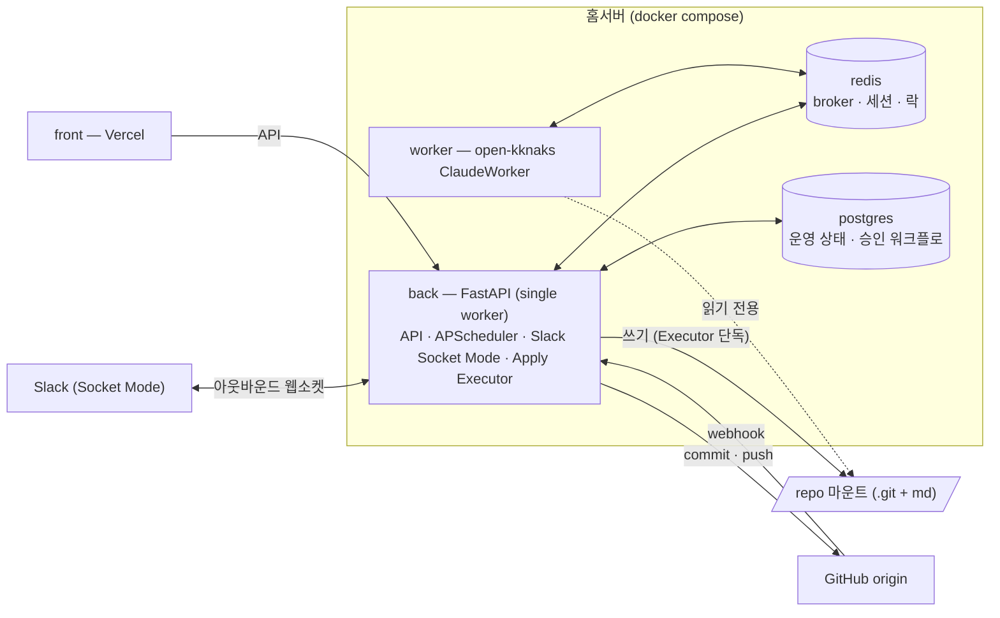
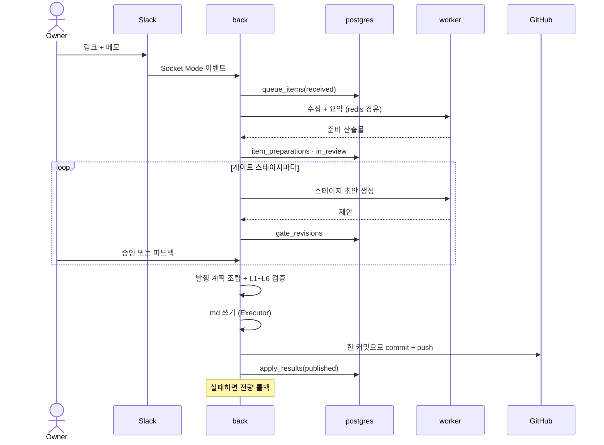
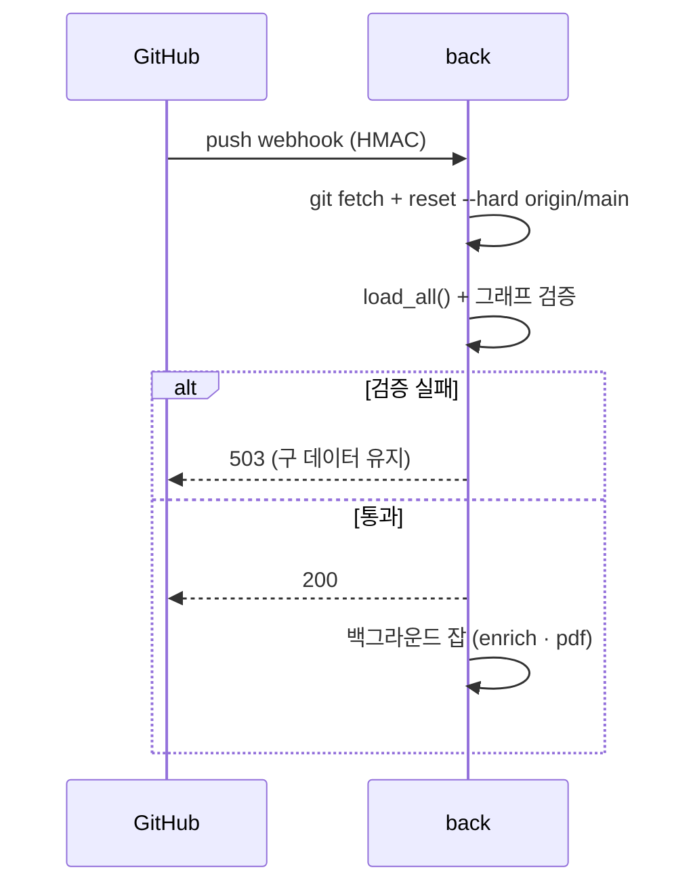

# System Architecture

규칙: `rules/product-doc-pipeline.md`

> 시스템 구성요소, 외부 연동, 주요 요청 흐름을 관리한다.

관련 decision: [[decision-013-slack-bridge-into-backend|KDEV-DEC-013]](프로세스 경계) · [[decision-012-draft-storage-and-publish-boundary|KDEV-DEC-012]](쓰기 소유권)

## Overview

## Components

| Component | Responsibility | Notes |
|---|---|---|
| `back` | HTTP API · 스케줄 잡 · **Slack Socket Mode** · 승인 큐 · 게이트 · **Apply Executor** | `--workers 1` 하드락. `_check_single_worker()`가 멀티워커를 raise로 금지한다 — APScheduler·Socket Mode가 in-process 장기 루프이기 때문 |
| `worker` | open-kknaks Claude 실행 | 자체 `Dockerfile.worker`, back을 임포트하지 않는 **독립 프로세스**. repo는 `:ro` 마운트라 파일을 쓸 수 없다 |
| `redis` | open-kknaks broker · Slack 스레드 세션 · 이벤트 멱등 키 · 스레드 락 | 휘발. 영속 워크플로 SoT로 쓰지 않는다 |
| `postgres` | 운영 상태 · 승인 워크플로 · 승인 전 초안 | `../database/README.md` |
| `front` | 공개 사이트 + admin 화면 | Vercel. 공개에는 게시 판정 통과분만 노출 |

`app/scripts/run_*.py`는 컨테이너가 아니라 **수동 dev 러너**다. back 모듈을 `sys.path`로 임포트해 잡을 1회 실행한다.

## 쓰기 소유권 경계

파이프라인의 안전 경계는 **누가 파일과 git을 건드릴 수 있는가**로 정의된다.

| 주체 | 파일 쓰기 | git commit/push | DB 쓰기 |
|---|---|---|---|
| AI (worker 경유) | ✗ | ✗ | ✗ |
| Slack 어댑터 (back 내부) | ✗ | ✗ | 큐 적재만 |
| 게이트 로직 (back) | ✗ | ✗ | ○ |
| **Apply Executor (back)** | **○** | **○** | ○ |
| 스케줄 잡 (back) | ○ *(전환 예정)* | ○ *(전환 예정)* | — |

- **AI는 계획만 낸다.** 파일·DB·git을 직접 건드리지 않는다([[decision-012-draft-storage-and-publish-boundary|KDEV-DEC-012]] D2).
- **쓰기는 back 프로세스 하나에 모인다.** 현재 `app/slack_bridge/run.py`가 별도 컨테이너에서 `atomic_write` + `commit_and_push`를 직접 수행하는데, 이 경로가 [[decision-013-slack-bridge-into-backend|KDEV-DEC-013]]로 제거된다.
- 잔디·algorithm·content_enrich 잡은 아직 직접 커밋한다. 순차적으로 Executor 경유로 전환한다.

## External Integrations

| System | Purpose | Direction | Notes |
|---|---|---|---|
| Slack | 지식 입력 접수 | **아웃바운드 웹소켓**(Socket Mode) | 공개 URL·포트 불필요. 앱 토큰 + 봇 토큰 |
| GitHub | 발행 대상 origin · webhook 트리거 | 양방향 | push는 `extraheader` 인증, webhook은 HMAC 검증 |
| open-kknaks | AI 실행 | Redis broker 경유 | back이 제출, worker가 실행. 세션 resume 지원 |
| YouTube | 메타·자막 수집 | 아웃바운드 | `yt-dlp` + `youtube-transcript-api` |
| Vercel | 프론트 호스팅 | — | 공개 사이트 + admin 화면 |

## Key Flows

### 1. 지식 캡처 → 승인 → 발행

### 2. GitHub webhook → reload

`reset --hard`가 **origin에 없는 로컬 변경을 지운다.** 이것이 승인 전 초안을 DB에 두고, 발행 실패 시 커밋까지 되돌리는 근거다([[decision-012-draft-storage-and-publish-boundary|KDEV-DEC-012]] D5).

### 3. 스케줄 잡

| 잡 | 시각 | 산출 | 현재 |
|---|---|---|---|
| daily-activity (잔디) | 09:05 KST | `persona/daily/{date}.md` | 직접 커밋 |
| neetcode-canonical | 23:00 UTC | `persona/algorithms/A-NNN.md` | 직접 커밋 |
| content_enrich | webhook 백그라운드 | `persona/contents/C-*.md` | 직접 커밋 |
| pdf_generate | webhook 백그라운드 | 이력서·포트폴리오 PDF | 직접 커밋 |

앞의 셋은 승인 파이프라인으로 편입 예정이다. `pdf_generate`는 지식이 아니라 파생 산출물이라 대상이 아니다.

## Open

- 스케줄 잡의 Executor 전환 순서 — 유튜브 체인 검증 후 결정한다([[decision-011-approval-gate-chain|KDEV-DEC-011]] 보류).
- 웹소켓 task가 반복 실패할 때 back을 종료할지 캡처만 비활성화할지([[decision-013-slack-bridge-into-backend|KDEV-DEC-013]] OQ-1).
- back 단일 워커 제약의 지속 여부. APScheduler·Socket Mode가 둘 다 in-process라 유지되며, 벗어나려면 분산 락이 선행돼야 한다.
