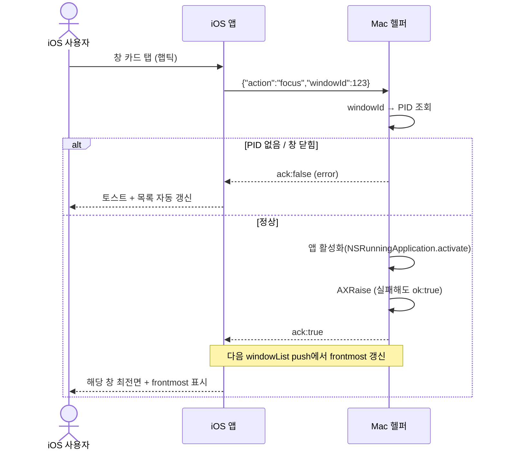
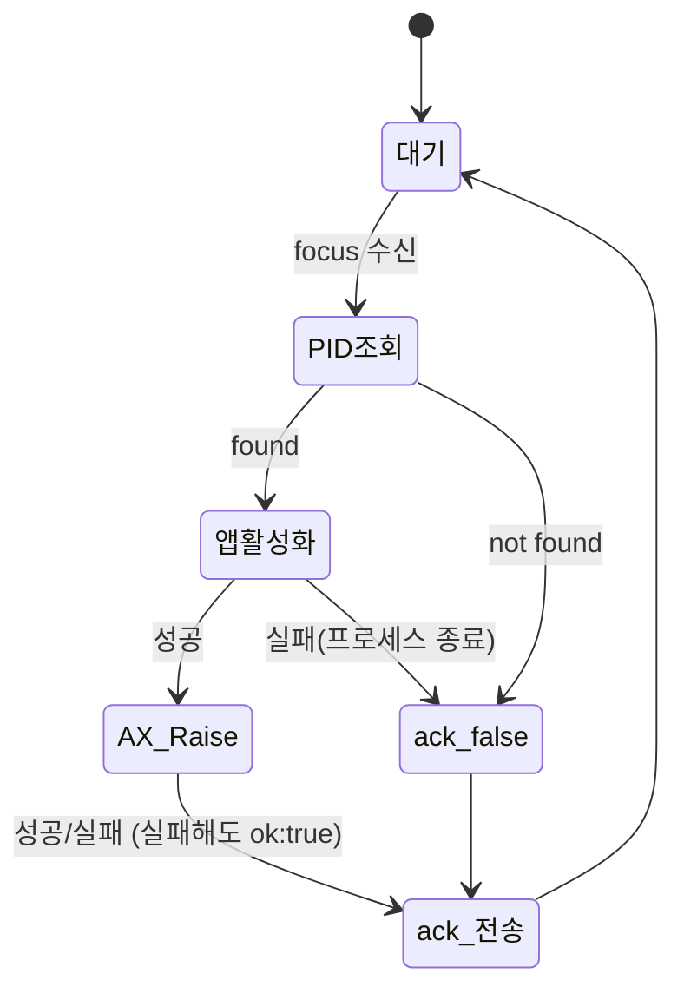

# 창 활성화

사용자가 iOS 앱에서 특정 창 카드를 탭하면 Mac에서 해당 창을 최전면으로 활성화하고 그 결과를 응답으로 보장한다. PID 기반 앱 활성화를 1차로, AXUIElement 기반 개별 창 활성화를 2차로 수행한다.

> 원본: `mac-remote/doc/spec/Spec-02-window-focus.md`.

## Context

이 spec이 나온 배경과 연결된 의존.

- 의존: [[spec-001-window-list|MRT-SPEC-001]] (창 목록에서 windowId/PID를 조회)
- 비즈니스 요구: 사용자가 Mac을 직접 만지지 않고 iOS에서 원하는 창을 골라 즉시 전환할 수 있어야 한다. 창 목록(Spec-01)이 보여 주기만 한다면, 이 spec이 "골라서 전환"이라는 핵심 조작을 완성한다.
- 관련 work: [[work-002-window-focus|MRT-WORK-002]] (창 활성화 구현), [[work-005-websocket-server|MRT-WORK-005]] (§계약 focus/ack 메시지)
- 범위
  - In: PID로 앱 활성화, AXUIElement로 특정 창 raise, 결과 응답(ack)
  - Out: 창 목록 수집([[spec-001-window-list|MRT-SPEC-001]]), 창 이동/리사이즈

## UX Contract

iOS 앱의 "창 목록" 탭이 본 spec의 조작 진입점이다. 별도 화면은 없고, 창 목록 카드의 탭 인터랙션과 그 결과 피드백이 사용자에게 보이는 계약이다.

### Placement

iOS 앱 하단 탭의 "창 목록" 탭(Spec-01 화면 재사용). 각 창 카드가 focus의 탭 타깃이다. 목업: `macro_keyboard_mockup.html`.

```text
+──────────────────────────────+
│ 창 목록            ● 연결됨    │
+──────────────────────────────+
│ ┌──────────────────────────┐ │
│ │ Arc                  ◉    │ │  ← 탭 → focus, 활성화 후 frontmost 표시
│ │ 디자인 레퍼런스 — 12개 탭 │ │
│ ├──────────────────────────┤ │
│ │ Xcode                     │ │  ← 탭 → focus
│ │ MacroHelper — AppDeleg…  │ │
│ └──────────────────────────┘ │
+──────────────────────────────+
```

### U-1. 창 카드 (탭 타깃)

- **상태**: 정상 — 카드 탭 가능 / 활성화 성공 — 다음 windowList push에서 해당 카드에 frontmost 표시(청록 테두리) 갱신 / 실패 — 토스트 노출 후 목록 자동 갱신
- **문구**: 실패 토스트 — 창이 닫힘 "창을 찾을 수 없습니다", 앱 종료 "앱이 종료되었습니다", 권한 없음 "손쉬운 사용 권한이 필요합니다"
- **CTA**: 카드 탭 → 해당 창 focus 명령 전송, 햅틱 피드백
- **기대 결과**: Mac에서 해당 창이 최전면으로 올라오고, ack:true 수신 후 다음 windowList push에서 frontmost 표시가 갱신된다. 실패 시 토스트 + 창 목록 자동 갱신

## User Scenario

actor는 iOS 앱 사용자. 카드 탭이라는 단순 조작이지만 권한·경계·실패 흐름을 빠짐없이 박는다.

### S-1. iOS 사용자 — 창 활성화 (정상)

1. "창 목록" 탭에서 원하는 창 카드를 탭, 햅틱 피드백
2. 앱이 `{"action":"focus","windowId":123}` 전송
3. Mac 헬퍼가 windowId로 PID 조회 → 앱 활성화(NSRunningApplication.activate) → AXRaise로 해당 창 raise
4. Mac에서 해당 창이 최전면으로 올라옴
5. 헬퍼가 ack:true 응답, 이어지는 windowList push(Spec-01, 1.5초 주기)에서 해당 카드에 frontmost 표시가 갱신됨

### S-2. iOS 사용자 — 권한·실패·경계

1. (이미 frontmost) 탭한 창이 이미 최전면이면 상태 변화 없이 ack:true (no-op)
2. (같은 앱 다중 창) 같은 앱 창이 여러 개면 AXRaise로 정확히 그 창만 raise (windowId 기준)
3. (권한 없음) Accessibility 권한이 없으면 PID 기반 앱 활성화만 수행 → 같은 앱 다중 창은 특정 창 구분 불가, "손쉬운 사용 권한이 필요합니다" 안내
4. (full screen) 대상이 전체 화면 앱이면 해당 Space로 전환 후 활성화
5. (창 닫힘 race) 탭 직후 창이 닫혔으면 ack:false → "창을 찾을 수 없습니다" 토스트 + 목록 자동 갱신
6. (앱 종료) PID에 해당하는 프로세스가 없으면 ack:false → "앱이 종료되었습니다" 토스트 + 목록 자동 갱신

## FE Contract

iOS 앱이 지켜야 하는 외부 계약.

- 카드 탭 시 `{"action":"focus","windowId":<id>}` 전송, 햅틱 피드백을 즉시 제공
- ack:true 수신은 별도 UI 변화 없이 수용. frontmost 표시 갱신은 자체 갱신이 아니라 **다음 windowList push(Spec-01)에 의존**해 렌더
- ack:false 수신 시 error 값에 맞는 토스트 노출 + 창 목록 자동 갱신 트리거
- 권한 안내 에러(AX_PERMISSION)는 "손쉬운 사용 권한이 필요합니다" 안내로 렌더

## BE Contract

Mac 헬퍼가 제공해야 하는 메시지와 동작.

### 메시지

| 방향 | 이름 | 설명 |
|------|------|------|
| iOS → Mac | `focus` | 특정 창 활성화 요청 |
| Mac → iOS | `ack (focus)` | 활성화 결과 응답 |

#### 요청 예시

```json
{"action":"focus","windowId":123}
```

#### 응답 예시

```json
{"type":"ack","action":"focus","ok":true}
```

```json
{"type":"ack","action":"focus","ok":false,"error":"window not found"}
```

### 동작 규칙

- 헬퍼는 `focus` 수신 시 windowId로 WindowInfo를 조회해 PID 획득 → `NSRunningApplication(pid).activate()`로 앱 활성화 → AXUIElement로 해당 창에 AXRaise.
- **Graceful degradation**: AXRaise가 실패해도 앱은 이미 활성화되었으므로 `ok:true`를 반환한다. 즉 AX 단계의 실패는 ack:false 사유가 아니다.
- 같은 앱 창이 1개뿐이면 AXRaise를 생략하고 앱 활성화만으로 충분하다.
- Accessibility 권한이 없으면 PID 기반 앱 활성화만 수행하고 경고 로그를 남긴다(같은 앱 다중 창 구분 불가).
- 대상이 전체 화면 앱이면 해당 Space로 전환한 뒤 활성화한다.
- 탭한 창이 이미 frontmost면 상태 변화 없이 ack:true.

#### 재시도 정책

| 에러 유형 | 재시도 | 최대 횟수 | 간격 | 비고 |
|-----------|--------|-----------|------|------|
| WINDOW_NOT_FOUND | N | — | — | 창 닫힘, 재시도 무의미 |
| AX_RAISE_FAIL | Y | 1 | 100ms | 타이밍 이슈 가능 |

## Validation

입력 및 대상 검증 규칙 — 어떤 focus 요청이 valid한가.

| 필드 | 규칙 | 검증 위치 | 실패 시 동작 |
|------|------|-----------|-------------|
| windowId | 양의 정수 | Back (Mac) | ack:false |
| windowId 존재 | 현재 창 목록(Spec-01)에 존재 | Back (Mac) | WINDOW_NOT_FOUND |
| Accessibility 권한 | 허용 상태 | Back (Mac) | PID만으로 앱 활성화 시도 |

## Case Matrix

에러·경계 케이스의 단일 SoT.

| 에러/케이스 | 발생 조건 | 백엔드(Mac) 처리 | 프론트(iOS) 출력 | 표시 위치 |
|---|---|---|---|---|
| `WINDOW_NOT_FOUND` | windowId가 현재 목록에 없음 / 탭 직후 창이 닫힘(race) | ack:false + 창 목록 재전송, 재시도 X | "창을 찾을 수 없습니다" 토스트 + 목록 자동 갱신 | 토스트 / 리스트 |
| `PROCESS_DEAD` | PID에 해당하는 프로세스 없음(앱 종료) | ack:false + 창 목록 재전송 | "앱이 종료되었습니다" 토스트 + 목록 자동 갱신 | 토스트 / 리스트 |
| `AX_PERMISSION` | Accessibility 권한 없음 | PID 활성화만 수행, 경고 로그 (같은 앱 다중 창 구분 불가) | "손쉬운 사용 권한이 필요합니다" | 안내 영역 |
| `AX_RAISE_FAIL` | AXRaise 실패 | 100ms 후 1회 재시도, 그래도 실패하면 앱은 활성화됨 → ok:true | — (무시, 앱은 전환됨) | — |

## Flow



## State Machine



| 현재 상태 | 이벤트 | 다음 상태 | 액션 | 비고 |
|-----------|--------|-----------|------|------|
| 대기 | focus 수신 | PID 조회 | windowId로 WindowInfo 검색 → PID 획득 | |
| PID 조회 | found | 앱 활성화 | NSRunningApplication(pid).activate() | |
| PID 조회 | not found | ack:false | 에러 응답 | 창이 닫혔을 수 있음 |
| 앱 활성화 | 성공 | AX 창 Raise | AXUIElement로 해당 창에 AXRaise | 같은 앱 다중 창 대응 |
| 앱 활성화 | 실패 | ack:false | 에러 응답 | 프로세스 종료 등 |
| AX 창 Raise | 성공/실패 | ack 전송 | AX 실패해도 앱은 활성화됨 → ok:true | graceful degradation |

## Data Contract

외부에 드러나는 resource와 제약.

```text
Entity: FocusRequest
├── windowId: Int     — 대상 창의 kCGWindowNumber
└── (pid는 Spec-01의 WindowInfo에서 조회)
```

| 필드 | 제약 | 비고 |
|------|------|------|
| windowId | Spec-01 windowList에 존재하는 id | 존재하지 않으면 에러 |

### 공유 상수 / Enum

해당 없음.

## Work Handoff

이 spec의 계약 표면을 work의 Acceptance Criteria로 가져간다. 구현·테스트·PR 완료 체크리스트는 30-work 문서에 둔다.

| Work | 범위 |
|---|---|
| [[work-002-window-focus\|MRT-WORK-002]] | 창 활성화 구현 (PID 활성화 + AXRaise + graceful degradation) |
| [[work-005-websocket-server\|MRT-WORK-005]] | 계약 focus/ack 메시지 (WS 서버) |

## Open Questions

- 없음 (구현·릴리즈 완료)
