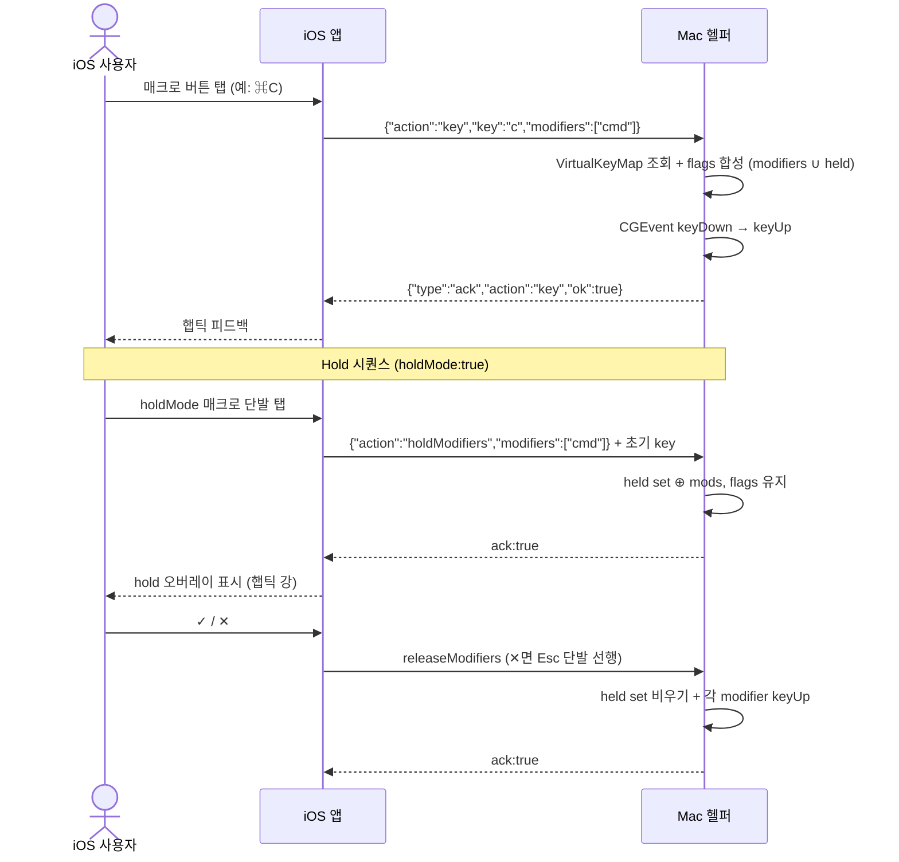
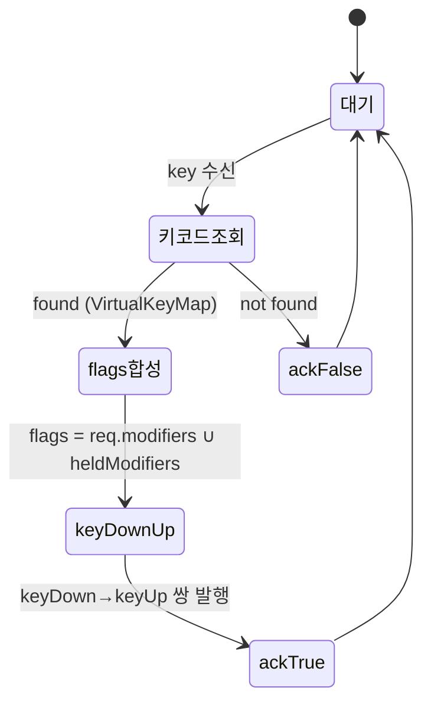
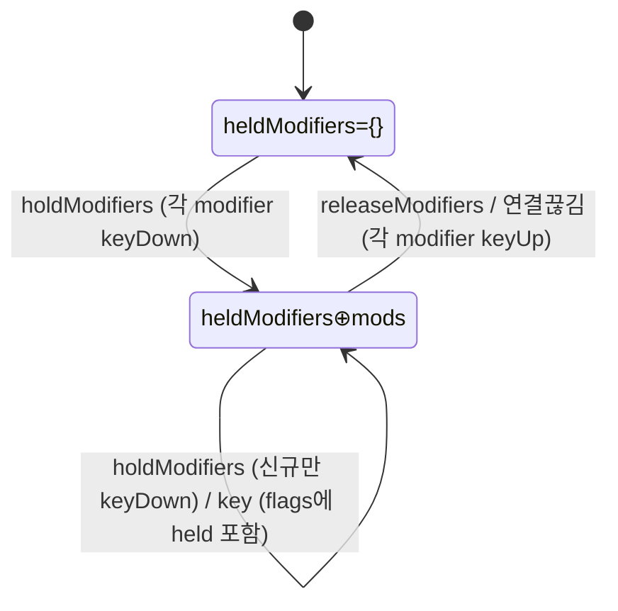

# 키 입력 (매크로)

iOS 앱에서 키+modifier 조합 또는 hold 시퀀스를 전송하면 Mac 헬퍼가 CGEvent로 해당 입력을 시스템에 정확히 재현하도록 보장한다. 사용자 정의 매크로 버튼의 백엔드.

> 원본: `mac-remote/doc/spec/Spec-03-key-input.md`.

## Context

- 관련 decision: 없음
- 비즈니스 요구: 사용자가 iOS 앱의 매크로 버튼 하나로 Mac의 키 조합(복사/붙여넣기/앱전환 등)을 실행하려면, 키+modifier 조합과 hold 시퀀스를 신뢰성 있게 시스템에 전달하는 입력 계약이 필요하다. 사용자 정의 매크로의 실행 기반.
- 관련 work: [[work-003-key-input|MRT-WORK-003]] (키 입력 구현), [[work-017-hold-modifiers|MRT-WORK-017]] (Hold 모드), [[work-005-websocket-server|MRT-WORK-005]] (계약 key/holdModifiers/releaseModifiers 메시지)
- 범위
  - In: CGEvent 기반 키 전송, 가상 키코드 매핑, modifier 조합, hold/release 시퀀스
  - Out: 매크로 UI/저장(iOS 영역 — 매크로 정의 화면), 텍스트 입력(문자열 타이핑)

## UX Contract

iOS 앱의 "매크로" 탭이 본 spec의 입력 계약을 사용자에게 노출하는 화면이다. 단발 매크로 실행과 hold 모드 오버레이가 핵심 컴포넌트.

### Placement

iOS 앱 하단 탭의 "매크로" 탭. 2열 그리드 버튼. hold 모드 진입 시 화면 중앙 모달 오버레이.

```text
+──────────────────────────────+
│ 매크로            ● 연결됨     │
+──────────────────────────────+
│ ┌────────┐ ┌────────┐         │
│ │  ⌘C    │ │  ⌘V    │         │
│ ├────────┤ ├────────┤         │
│ │  ⌘Z    │ │ ⌘⇧Z    │         │
│ ├────────┤ ├────────┤         │
│ │ ⌘⇧4    │ │ ⌃⌘Q    │         │
│ ├────────┤ ├────────┤         │
│ │ ⌘⇥앱전환│ │ + 추가  │         │
│ └────────┘ └────────┘         │
+──────────────────────────────+

  ── Hold 오버레이 (중앙 모달) ──
       ┌──────────────────┐
       │   ◀   ▶   ✓   ✕  │
       └──────────────────┘
```

### U-1. 매크로 그리드

- **상태**: 정상 — 매크로 버튼이 2열 그리드로 나열. 미연결 — 상단 연결 표시등 빨간색
- **문구**: 헤더 "매크로". 버튼 라벨은 키 조합 기호(⌘C 등) 또는 사용자 지정 이름
- **기본 프리셋**: ⌘C / ⌘V / ⌘Z / ⌘⇧Z / ⌘⇧4 / ⌃⌘Q / ⌘⇥ — 이 7개가 기본 매크로 버튼으로 제공된다. "앱전환"(⌘⇥)은 `holdMode: true` 적용 권장
- **CTA**: 매크로 버튼 탭 → 해당 key 조합 전송(`holdMode:true`면 hold 오버레이 진입), 성공 시 햅틱 / "매크로 추가" 버튼 → 키 + modifier 선택 화면
- **기대 결과**: 버튼 탭 시 Mac에서 해당 키 조합 실행, ack:true에 햅틱 피드백

### U-2. Hold 오버레이 (iOS)

매크로 모델에 `holdMode: Bool` 플래그 추가. true인 매크로는 **단발 탭** 시 일반 매크로처럼 단일 키 전송이 아니라 **hold 오버레이가 뜨면서** modifier hold + 초기 key가 전송된다.

- **상태**: hold 진입 — 화면 중앙 모달 오버레이 표시, modifier 유지 중. 단발 vs hold 분기는 매크로 단위로 결정(long-press 같은 별도 제스처 불필요)
- **문구**: 오버레이 4개 버튼 ◀ / ▶ / ✓ / ✕
- **CTA**:
  - ▶ / ◀ 탭 → 동일 key 또는 Shift+key 단발 전송 (Hold 중 다음/이전)
  - ✓ 탭 → releaseModifiers 전송 (Hold 종료 — 선택 확정)
  - ✕ 탭 또는 배경 탭 → Esc 단발 + releaseModifiers 전송 (Hold 종료 — 취소)
- **기대 결과**: 각 동작 시 해당 메시지 전송 + 햅틱(진입 시 강), hold 종료 시 modifier 해제

## User Scenario

actor는 iOS 앱 사용자. 단발 실행 / hold 시퀀스 / 권한·실패·경계를 빠짐없이 박는다.

### S-1. iOS 사용자 — 매크로 단발 실행 (정상)

1. "매크로" 탭 진입
2. 매크로 버튼 탭 (예: ⌘C)
3. 앱이 `{"action":"key","key":"c","modifiers":["cmd"]}` 전송 (사용자 정의 매크로면 key/modifiers가 사용자 설정값. modifier 없는 단일 키면 빈 배열 전송)
4. Mac 헬퍼가 CGEvent로 ⌘C keyDown → keyUp 전송 (modifier 없으면 flags 없이 전송)
5. Mac에서 복사 동작 실행
6. ack:true → iOS에서 햅틱 피드백

### S-2. iOS 사용자 — Hold 시퀀스 (앱전환)

1. `holdMode:true` 매크로(예: ⌘⇥ 앱전환)를 **단발 탭**
2. 앱이 `holdModifiers` + 초기 key 전송, hold 오버레이 표시(햅틱 강) — Mac은 modifier를 held set에 추가하고 CGEvent flags에 유지
3. (다음/이전) 오버레이 ▶/◀ 탭 → 동일 key 또는 Shift+key 단발 전송. held 상태 유지되어 flags에 held set 포함
4. (다른 매크로 단발 — 경계) hold 중 다른 매크로를 단발 탭하면, 그 매크로의 `modifiers` ∪ held로 합성 발사. held 상태 유지
5. (종료) ✓ → releaseModifiers 전송, 또는 ✕/배경 탭 → Esc 단발 + releaseModifiers 전송 → Mac이 각 modifier keyUp + held set 비우기
6. (안전장치) hold 중 클라이언트 연결이 끊기면 Mac 헬퍼가 자동으로 releaseModifiers 실행

### S-3. iOS 사용자 — 권한·실패·경계

1. (권한 없음) Accessibility 권한 없이 실행 시 ack:false → "손쉬운 사용 권한이 필요합니다" 알림, 설정 화면으로 안내
2. (미연결) WebSocket 미연결이면 연결 표시등 빨간색 → 재연결 후 재시도
3. (알 수 없는 키) key가 VirtualKeyMap에 없거나 modifier만 있고 key가 빈 문자열이면 ack:false → "알 수 없는 키: {key}"
4. (잘못된 modifier) cmd/shift/alt/ctrl 아닌 modifier는 해당 항목만 무시하고 나머지로 진행
5. (잠금 화면) Mac 잠금 화면일 때 CGEvent 전송되나 효과 없음, ack:true
6. (빠른 연속 탭) 매우 빠른 연속 탭 / 같은 매크로 동시 2회 탭은 각각 독립된 key 이벤트로 전송, 순서 보장, 2회 모두 전송
7. (멱등 경계) releaseModifiers 수신 시 held set이 비어있으면 ack:true(멱등). 두 번 연속 holdModifiers면 이미 held인 modifier는 무시, 신규만 keyDown

## FE Contract

iOS 앱이 지켜야 하는 외부 계약.

- 매크로를 2열 그리드 버튼으로 렌더. `holdMode:true` 매크로는 단발 탭 시 hold 오버레이를 띄우고 일반 매크로는 단일 key 전송으로 분기 (분기는 매크로 단위 결정)
- modifier가 없는 키는 `modifiers`를 **빈 배열**로 전송
- hold 오버레이는 화면 중앙 모달, 4개 버튼(◀/▶/✓/✕). 각 버튼은 §UX Contract U-2 매핑대로 메시지 전송
- ack:true 수신 시 햅틱 피드백, ack:false 수신 시 에러 메시지/알림 노출 (§Case Matrix)

## BE Contract

Mac 헬퍼가 제공해야 하는 메시지와 동작.

### 메시지

| 방향 | 이름 | 설명 |
|------|------|------|
| iOS → Mac | `key` | 단발 키 입력 전송 (down + up) |
| iOS → Mac | `holdModifiers` | modifier를 누른 상태로 유지 |
| iOS → Mac | `releaseModifiers` | 유지 중인 modifier 모두 해제 |
| Mac → iOS | `ack` (key / holdModifiers / releaseModifiers) | 결과 응답 |

#### 요청 예시

```json
{"action":"key","key":"c","modifiers":["cmd"]}
```

```json
{"action":"key","key":"4","modifiers":["cmd","shift"]}
```

```json
{"action":"holdModifiers","modifiers":["cmd"]}
```

```json
{"action":"releaseModifiers"}
```

#### 응답 예시

```json
{"type":"ack","action":"key","ok":true}
```

```json
{"type":"ack","action":"key","ok":false,"error":"unknown key: xyz"}
```

```json
{"type":"ack","action":"holdModifiers","ok":true}
```

```json
{"type":"ack","action":"releaseModifiers","ok":true}
```

### 동작 규칙

**Hold 모드 동작**

- Mac 헬퍼는 **현재 유지(held) 중인 modifier 집합**을 상태로 보관한다.
- `holdModifiers` 수신 시: 해당 modifier를 CGEvent flagsState에 추가 + held set에 추가. 이미 held면 무시.
- `key` 수신 시: 요청의 `modifiers` ∪ held set 으로 flags를 구성하여 keyDown/keyUp 전송.
- `releaseModifiers` 수신 시: held set 비우기 + 각 modifier에 대해 keyUp 이벤트 발행 (CGEvent로 modifier 가상 키코드 keyUp).
- 클라이언트 연결이 끊기면 Mac 헬퍼는 **자동으로 releaseModifiers를 실행**한다 (안전장치, Spec-03 §9 #5 참조).
- keyDown과 keyUp은 항상 **쌍으로** 발행한다.

**재시도 정책**

| 에러 유형 | 재시도 | 최대 횟수 | 간격 | 비고 |
|-----------|--------|-----------|------|------|
| 모든 유형 | N | — | — | 키 입력은 재시도하면 중복 입력 위험 |

## Validation

입력 검증 규칙 — 어떤 입력이 valid한가. 위반 시 에러/표시는 §Case Matrix가 단일 SoT.

| 검증 항목 | 규칙 | 검증 위치 | 실패 시 동작 |
|-----------|------|-----------|-------------|
| key | VirtualKeyMap에 존재 | Back (Mac) | UNKNOWN_KEY 에러 |
| modifiers | 각 항목이 cmd/shift/alt/ctrl | Back (Mac) | 잘못된 modifier 무시 |
| modifiers | 배열 (빈 배열 허용) | Front (iOS) | 빈 배열로 전송 |

## Case Matrix

에러·경계 케이스의 단일 SoT.

| 에러/케이스 | 발생 조건 | 백엔드(Mac) 처리 | 프론트(iOS) 출력 | 표시 위치 |
|---|---|---|---|---|
| `UNKNOWN_KEY` | key가 VirtualKeyMap에 없음 (modifier만 있고 key가 빈 문자열인 경우 포함) | ack:false 응답, 키 입력 미전송 | "알 수 없는 키: {key}" | 알림 / 토스트 |
| `INVALID_MODIFIER` | modifier가 cmd/shift/alt/ctrl 아님 | 해당 modifier 무시, 나머지로 진행 (재시도 X) | — | — |
| `AX_PERMISSION` | Accessibility 권한 없음 | ack:false 응답 | "손쉬운 사용 권한이 필요합니다" + 설정 화면 안내 | 권한 알림 |
| `EVENT_CREATE_FAIL` | CGEvent 생성 실패 | ack:false 응답 | "키 입력을 생성할 수 없습니다" | 알림 / 토스트 |
| 잠금 화면 | Mac 잠금 화면 상태에서 key 수신 | CGEvent 전송 (효과 없음), ack:true | (성공 처리) 햅틱 | — |
| 미연결 | WebSocket 미연결 | — | 연결 표시등 빨간색, 재연결 후 재시도 | 상단 표시등 |

## Flow



## State Machine

### 단발 키 입력 (action="key")



| 현재 상태 | 이벤트 | 다음 상태 | 액션 | 비고 |
|-----------|--------|-----------|------|------|
| 대기 | key 수신 | 키코드 조회 | VirtualKeyMap에서 조회 | |
| 키코드 조회 | found | flags 합성 | CGEvent flags = req.modifiers ∪ heldModifiers | |
| 키코드 조회 | not found | ack:false | 에러 응답 | |
| flags 합성 | — | keyDown→keyUp | keyDown/keyUp 쌍 발행 | keyDown/keyUp 쌍 필수 |
| keyDown→keyUp | — | ack:true | 성공 응답 | |

### Hold 모드 (heldModifiers 상태)



| 현재 상태 | 이벤트 | 다음 상태 | 액션 | 비고 |
|-----------|--------|-----------|------|------|
| heldModifiers={} | holdModifiers 수신 | heldModifiers⊕mods | 각 modifier keyDown 발행 | 중복 hold는 무시 |
| heldModifiers≠{} | holdModifiers 수신 | heldModifiers⊕mods | 신규만 keyDown 발행 | 멱등 |
| heldModifiers≠{} | key 수신 | (동일) | §단발 흐름 + flags에 held set 포함 | held 유지 |
| heldModifiers≠{} | releaseModifiers 수신 | heldModifiers={} | 각 modifier keyUp 발행 | |
| heldModifiers≠{} | 클라이언트 연결 끊김 | heldModifiers={} | releaseModifiers와 동일 | 안전장치 |

## Data Contract

외부에 드러나는 resource, 키코드 매핑, enum.

```text
Entity: KeyCommand
├── key: String          — 키 이름 ("c", "v", "z", "tab", "4" 등)
└── modifiers: [String]  — modifier 목록 ["cmd", "shift", "alt", "ctrl"]

Entity: VirtualKeyMap (정적 매핑 테이블)
├── "a": 0, "s": 1, "d": 2, "f": 3
├── "c": 8, "v": 9, "z": 6
├── "tab": 48, "space": 49, "return": 36, "escape": 53
├── "0"~"9": 29,18,19,20,21,23,22,26,28,25
└── ... (전체 키코드 테이블)
```

| 필드 | 제약 | 비고 |
|------|------|------|
| key | VirtualKeyMap에 존재해야 함 | 없으면 UNKNOWN_KEY 에러 |
| modifiers | cmd/shift/alt/ctrl만 허용 | 빈 배열 허용 (modifier 없는 키) |

### 기본 매크로 프리셋

| 라벨 | key | modifiers | 비고 |
|------|-----|-----------|------|
| ⌘C | c | [cmd] | 복사 |
| ⌘V | v | [cmd] | 붙여넣기 |
| ⌘Z | z | [cmd] | 실행 취소 |
| ⌘⇧Z | z | [cmd, shift] | 다시 실행 |
| ⌘⇧4 | 4 | [cmd, shift] | 영역 캡처 |
| ⌃⌘Q | q | [ctrl, cmd] | 화면 잠금 |
| ⌘⇥ | tab | [cmd] | 앱전환 — `holdMode: true` 권장 |

### Modifier enum

```swift
enum Modifier: String {
    case cmd   = "cmd"
    case shift = "shift"
    case alt   = "alt"
    case ctrl  = "ctrl"
}

// Modifier → CGEventFlags 매핑
// cmd   → .maskCommand
// shift → .maskShift
// alt   → .maskAlternate
// ctrl  → .maskControl
```

## Work Handoff

이 spec의 계약 표면을 work의 Acceptance Criteria로 가져간다. 구현 완료 체크리스트는 아래 work 문서(30-work)에 둔다.

| Work | 범위 |
|---|---|
| [[work-003-key-input\|MRT-WORK-003]] | 키 입력 구현 — CGEvent, VirtualKeyMap, modifier 조합 |
| [[work-017-hold-modifiers\|MRT-WORK-017]] | Hold 모드 — holdModifiers/releaseModifiers, heldModifiers 상태, hold UI |
| [[work-005-websocket-server\|MRT-WORK-005]] | 계약 key/holdModifiers/releaseModifiers 메시지 (WS 서버) |

## Open Questions

- 없음 (구현·릴리즈 완료)
