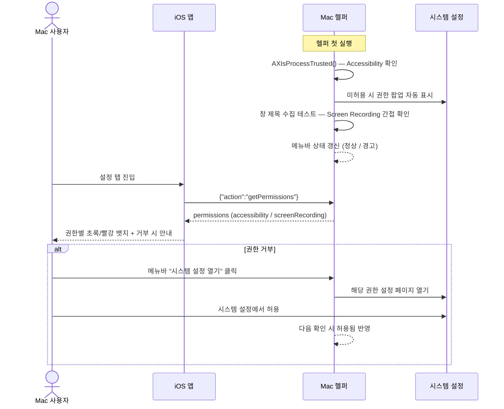
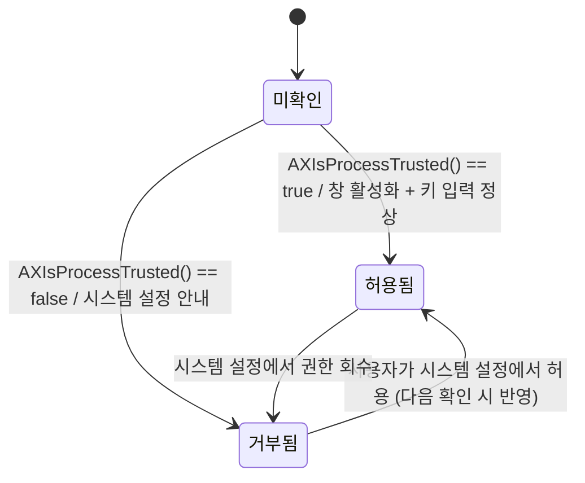
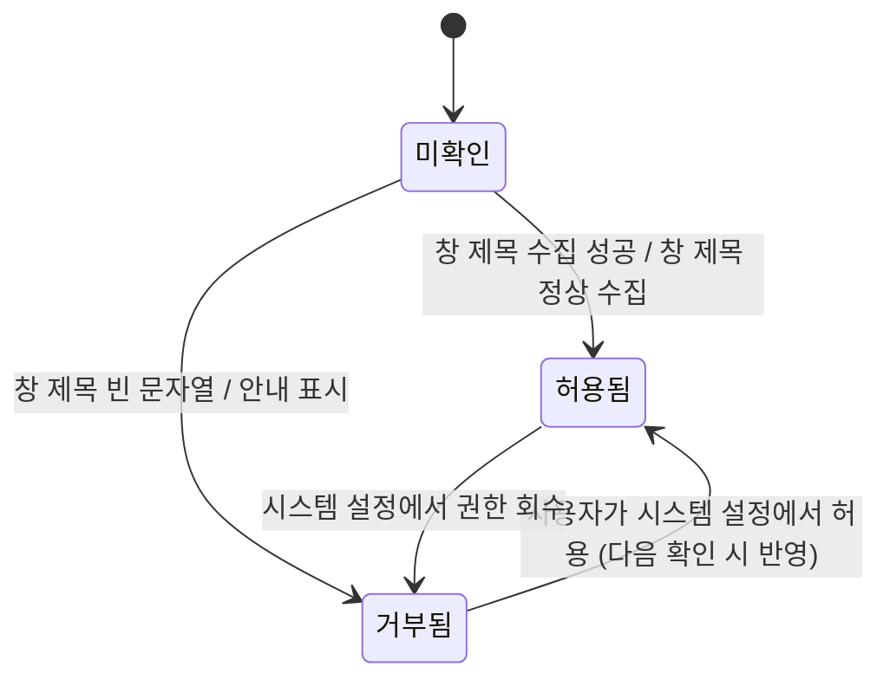

# 권한 관리

Mac 헬퍼가 필요로 하는 시스템 권한(손쉬운 사용, 화면 기록)의 상태를 점검하고 사용자에게 안내하며, 권한 상태를 iOS 앱에 전달하는 것을 보장한다. 권한이 없으면 코드가 에러 없이 빈 값을 반환하므로, 명시적 확인과 안내가 핵심이다.

> 원본: `mac-remote/doc/spec/Spec-06-permissions.md`.

## Context

이 spec이 나온 배경과 연결된 work.

- 관련 decision/baseline: 없음
- 비즈니스 요구: Mac 헬퍼의 핵심 기능(창 제목 수집·창 활성화·키 입력)은 시스템 권한에 의존한다. 권한이 없으면 기능이 조용히 실패(빈 값/무동작)하므로, 사용자가 무엇을 켜야 하는지 명시적으로 확인·안내하지 않으면 "동작 안 함"의 원인을 알 수 없다. 권한 상태를 점검하고 안내하는 것이 모든 기능의 전제다.
- 관련 work: [[work-001-cli-prototype|MRT-WORK-001]] (권한 확인 프로토타입), [[work-006-menubar-app|MRT-WORK-006]] (메뉴바 권한 상태/안내 UI)
- 범위(In/Out)
  - In: 권한 상태 확인, 사용자 안내(Mac 메뉴바 / iOS 설정 탭), iOS 앱에 권한 상태 전송
  - Out: 권한 부여 자체 (시스템 설정에서만 가능)

## UX Contract

권한 안내는 두 면에 걸쳐 노출된다 — Mac 헬퍼의 메뉴바(권한 상태 + 시스템 설정 열기)와 iOS 앱의 설정 탭(헬퍼 권한 상태 뱃지). 두 영역을 각각 U-N으로 박는다.

### Placement

Mac: 메뉴바 상태 아이템(드롭다운). iOS: 앱 하단 "설정" 탭의 헬퍼 권한 상태 섹션.

```text
[ Mac 메뉴바 드롭다운 ]            [ iOS 설정 탭 ]
+────────────────────────+        +──────────────────────────────+
│ ⚠ 권한 확인 필요        │        │ 설정              ● 연결됨     │
│ ─────────────────────  │        +──────────────────────────────+
│ 손쉬운 사용      ●거부  │        │ 헬퍼 권한                     │
│ 화면 기록        ●허용  │        │  손쉬운 사용         🟢 허용  │
│ ─────────────────────  │        │  화면 기록           🔴 거부  │
│ [시스템 설정 열기]      │        │  └ 화면 기록 권한을 허용하면  │
+────────────────────────+        │     창 제목이 표시됩니다       │
                                  +──────────────────────────────+
```

### U-1. Mac 메뉴바 권한 상태

- **상태**: 정상(모두 허용) — "정상" 상태 표시 / 일부·전체 거부 — 경고 아이콘(⚠) + 거부된 권한 표기 / 미확인 — 앱 시작 시 두 권한 모두 확인 후 상태 반영
- **문구**: 권한별 라벨("손쉬운 사용", "화면 기록")과 허용/거부 상태 인디케이터(●). 거부 시 안내 텍스트 노출
- **CTA**: "시스템 설정 열기" — 메뉴바에서 클릭 시 해당 권한의 시스템 설정 페이지(개인 정보 보호 → 손쉬운 사용 / 화면 기록)를 직접 연다
- **기대 결과**: 클릭 시 해당 설정 페이지 열림. 사용자가 시스템 설정에서 허용하면 다음 확인 시 상태가 허용됨으로 갱신

### U-2. iOS 설정 탭 헬퍼 권한 상태

- **상태**: 정상 — 권한별 초록(🟢 허용) 뱃지 / 거부 — 빨강(🔴 거부) 뱃지 + 안내 문구 / 미연결 — 상단 연결 표시등 빨간색, 상태 갱신 불가
- **문구**: 권한별 라벨 + 초록/빨강 뱃지. Screen Recording 거부 시 "화면 기록 권한을 허용하면 창 제목이 표시됩니다", Accessibility 거부 시 "시스템 설정 → 개인 정보 보호 → 손쉬운 사용에서 허용해주세요"
- **CTA**: 설정 탭 진입 시 `getPermissions` 자동 요청 → 상태 표시
- **기대 결과**: 진입 시 최신 권한 상태가 초록/빨강 뱃지로 표시. 헬퍼가 연결되어 있으면 권한 변경 후 재진입 시 갱신된 상태 반영

## User Scenario

actor는 Mac 헬퍼를 켜는 사용자와 iOS 앱 사용자. 권한 요청·허용·거부 흐름과 경계(회수·간접 확인·재시작)를 빠짐없이 박는다.

### S-1. Mac 사용자 — 권한 확인·허용 (정상)

1. Mac 헬퍼 첫 실행
2. `AXIsProcessTrusted()` 호출로 Accessibility 권한 확인 → 미허용 시 시스템 권한 팝업 자동 표시
3. 창 제목 수집 테스트로 Screen Recording 권한을 간접 확인(직접 API 없음)
4. 두 권한 모두 허용됨 → 메뉴바에 "정상" 상태 표시
5. iOS 앱 연결 시 `permissions` 메시지를 자동 push

### S-2. Mac 사용자 — 권한 거부·안내 (분기)

1. (Accessibility 거부) Step 2에서 사용자가 권한을 거부 → 메뉴바에 경고 아이콘 + "시스템 설정 열기" 버튼, iOS 설정 화면에 "거부됨" 표시. 복구는 시스템 설정 직접 열기
2. (Screen Recording 거부) Step 3에서 창 제목이 빈 문자열로 옴 → 메뉴바 경고, 기능은 제한적 동작(창 활성화·키 입력은 정상, 창 제목만 미표시)
3. (간접 확인의 모호함) 빈 제목이 진짜 빈 제목인지 권한 거부인지 구분 불가 → 보수적으로 `SR_DENIED`로 판단하고 안내 표시

### S-3. iOS 사용자 — 권한 상태 조회

1. 설정 탭 진입
2. 앱이 헬퍼에 `{"action":"getPermissions"}` 전송
3. 헬퍼가 현재 권한 상태를 `permissions` 메시지로 응답 (권한 변경은 시스템 설정에서만 가능하므로 응답은 현재 스냅샷)
4. 앱이 권한별 초록(허용)/빨강(거부) 뱃지 표시, 거부 권한엔 안내 문구 노출

### S-4. 경계 — 권한 회수·재시작

1. (회수) 사용자가 허용했던 권한을 시스템 설정에서 회수 → 다음 `getPermissions`(또는 다음 확인)에서 false로 반영
2. (한쪽만 허용) Accessibility만 허용, Screen Recording 거부 → 창 활성화·키 입력은 동작, 창 제목만 안 보임
3. (모두 거부) 두 권한 모두 거부 → 모든 기능 제한, 안내 메시지 표시
4. (재시작) 헬퍼 재시작 후 권한이 변경된 상태면 시작 시 두 권한 모두 재확인

## FE Contract

iOS 앱이 지켜야 하는 외부 계약.

- `permissions` 메시지의 `accessibility` / `screenRecording`(Bool)을 파싱해 권한별 초록(허용)/빨강(거부) 뱃지로 렌더
- `accessibility == false`면 기능 제한 안내("시스템 설정 → 개인 정보 보호 → 손쉬운 사용에서 허용해주세요") 노출
- `screenRecording == false`면 창 제목 미표시 안내("화면 기록 권한을 허용하면 창 제목이 표시됩니다") 노출
- 미연결이면 상단 연결 표시등 빨간색, 상태 갱신 불가. 권한 거부 상태에서도 앱은 크래시 없이 동작(graceful degradation)

## BE Contract

Mac 헬퍼가 제공해야 하는 메시지와 동작. REST가 아닌 WebSocket 메시지 계약이다.

### 메시지

| 방향 | 이름 | 설명 |
|------|------|------|
| iOS → Mac | `getPermissions` | 권한 상태 요청 |
| Mac → iOS | `permissions` | 권한 상태 응답 (연결 시 자동 push에도 사용) |

#### 요청 예시

```json
{"action":"getPermissions"}
```

#### 응답 예시

```json
{"type":"permissions","accessibility":true,"screenRecording":false}
```

### 동작 규칙

- 헬퍼는 앱 시작 시 두 권한을 모두 확인하고, `getPermissions` 수신 시 현재 권한 상태를 `permissions`로 응답. iOS 앱 연결 시에도 자동 push
- Accessibility는 `AXIsProcessTrusted()`로 확인. 미허용 시 시스템 권한 팝업이 자동 표시됨
- Screen Recording은 직접 확인 API가 없어 창 제목 수집 테스트로 간접 확인. 창 제목이 빈 문자열이면 `SR_DENIED`로 보수적 판단
- **재시도 정책**: 모든 권한 유형에 대해 재시도하지 않는다(N). 권한 변경은 사용자가 시스템 설정에서 직접 해야 하므로, 헬퍼가 재시도해도 의미가 없다.

| 에러 유형 | 재시도 | 최대 횟수 | 간격 | 비고 |
|-----------|--------|-----------|------|------|
| 모든 유형 | N | — | — | 사용자가 시스템 설정에서 변경해야 함 |

## Validation

권한 상태 입력 검증 규칙. FE(즉시 안내)/BE(권한 점검)가 각자 구현한다.

| 필드 | 규칙 |
|------|------|
| `accessibility` | Bool. `AXIsProcessTrusted()`로 확인, 실시간 변경 가능 |
| `screenRecording` | Bool. 창 제목 수집 테스트로 간접 확인(직접 API 없음) |

검증 위치는 Both(Mac 점검 + iOS 표시). 위반(권한 false) 시 표시·문구·위치는 아래 Case Matrix가 단일 SoT. Front행 렌더 책임(false → 안내 문구 노출)은 FE Contract 참조.

## Case Matrix

권한 거부·경계 케이스의 단일 SoT.

| 에러/케이스 | 발생 조건 | 백엔드(Mac) 처리 | 프론트(iOS) 출력 | 표시 위치 |
|---|---|---|---|---|
| `AX_DENIED` | Accessibility 거부 | 메뉴바 경고, 시스템 설정 링크 제공 | "시스템 설정 → 개인 정보 보호 → 손쉬운 사용에서 허용해주세요" + 빨강 뱃지 | Mac 메뉴바 / iOS 설정 탭 |
| `SR_DENIED` | Screen Recording 거부 | 경고 표시, 기능은 제한적 동작(창 제목 없이) | "화면 기록 권한을 허용하면 창 제목이 표시됩니다" + 빨강 뱃지 | Mac 메뉴바 / iOS 설정 탭 |
| `SR_SILENT_FAIL` | 창 제목이 빈 문자열 | 진짜 빈 제목인지 권한 거부인지 구분 불가 → 보수적으로 `SR_DENIED`로 판단 | (`SR_DENIED`와 동일) | Mac 메뉴바 / iOS 설정 탭 |
| 권한 회수 | 허용했던 권한을 시스템 설정에서 회수 | 다음 `getPermissions`/확인 시 false 반영 | 해당 권한 빨강 뱃지로 갱신 | iOS 설정 탭 |
| 한쪽만 허용 | Accessibility만 허용, Screen Recording 거부 | 창 활성화·키 입력 동작, 창 제목만 미수집 | 창 제목 미표시 안내, AX는 정상 표기 | iOS 설정 탭 / 창 목록 |
| 모두 거부 | 두 권한 모두 거부 | 모든 기능 제한 | 안내 메시지 표시, 두 권한 빨강 뱃지 | Mac 메뉴바 / iOS 설정 탭 |
| 미연결 | WebSocket 미연결 | — | 연결 표시등 빨간색, 상태 갱신 불가 | iOS 상단 표시등 |

## Flow



## State Machine

권한 상태는 미확인 → (확인) → 허용됨/거부됨으로 전이한다. 부여 자체는 시스템 설정에서만 일어나므로 헬퍼는 확인·반영만 한다.

### Accessibility 권한



### Screen Recording 권한



| 현재 상태 | 이벤트 | 다음 상태 | 액션 | 비고 |
|-----------|--------|-----------|------|------|
| 미확인 | 앱 시작 | 허용됨/거부됨 | 두 권한 모두 확인 | |
| 거부됨 | `getPermissions` 요청 | 거부됨 | 현재 상태 응답 | 권한 변경은 시스템 설정에서만 |
| 거부됨 | 사용자가 시스템 설정에서 허용 | 허용됨 | 다음 확인 시 반영 | |

## Data Contract

외부에 드러나는 권한 상태 resource와 확인 방식.

```text
Entity: PermissionStatus
├── accessibility: Bool      — 손쉬운 사용 권한
└── screenRecording: Bool    — 화면 기록 권한
```

| 필드 | 제약 | 비고 |
|------|------|------|
| accessibility | `AXIsProcessTrusted()`로 확인 | 실시간 변경 가능 |
| screenRecording | 창 제목 수집 테스트로 확인 | 직접 API 없음, 간접 확인 |

### 권한 상태 enum

| 상태 | 의미 | 진입 조건 |
|------|------|-----------|
| 미확인 | 아직 점검 전 | 헬퍼 시작 직후 |
| 허용됨 | 권한 부여됨 | 확인 성공 (AX true / 창 제목 수집 성공) |
| 거부됨 | 권한 없음 | 확인 실패 (AX false / 창 제목 빈 문자열) |

공유 상수 / Enum(메시지 레벨): 해당 없음.

## Work Handoff

이 spec의 계약 표면을 work의 Acceptance Criteria로 가져간다. 완료 체크리스트는 30-work에 둔다.

| Work | 범위 |
|---|---|
| [[work-001-cli-prototype\|MRT-WORK-001]] | 권한 확인 로직 (AXIsProcessTrusted + 창 제목 수집 테스트) (CLI) |
| [[work-006-menubar-app\|MRT-WORK-006]] | 메뉴바 권한 상태/안내 UI + 시스템 설정 열기 |

## Open Questions

- 없음 (구현·릴리즈 완료)
