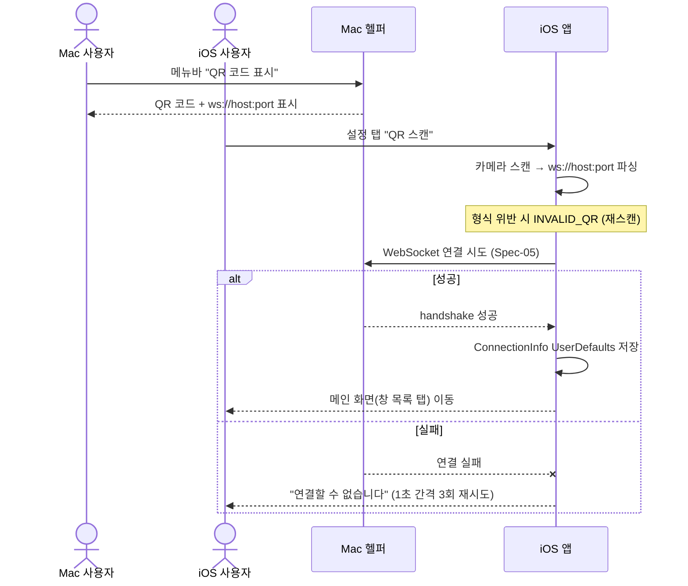
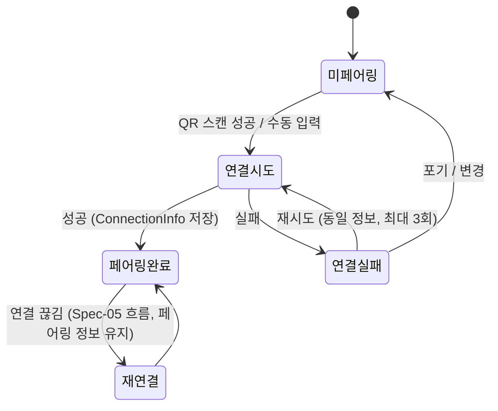

# 페어링

iOS 앱이 Mac 헬퍼의 IP:포트를 얻어 WebSocket 연결을 수립할 수 있도록, QR 스캔(기본)과 수동 IP 입력(fallback)으로 연결 정보를 전달하고 저장하는 과정을 보장한다.

> 원본: `mac-remote/doc/spec/Spec-07-pairing.md`.

## Context

- 의존: [[spec-005-websocket-protocol|MRT-SPEC-005]] (페어링 후 진입하는 WebSocket 연결/재연결 플로우)
- 비즈니스 요구: iOS 앱이 Mac을 원격 제어하려면 먼저 어느 Mac 헬퍼에 붙을지 알아야 한다. 사용자가 IP를 외우지 않고도 QR 한 번으로 1:1 연결을 맺을 수 있어야 한다.
- 관련 워크: [[work-007-pairing-qr|MRT-WORK-007]] (QR 페어링), [[work-012-settings-ui|MRT-WORK-012]] (설정/수동 입력 UI)
- 범위
  - In: QR 코드 생성(Mac), QR 스캔(iOS), 수동 IP 입력, 연결 정보 저장
  - Out: 인증/암호화, 멀티 Mac 연결

## UX Contract

페어링은 Mac 메뉴바의 QR 표시 화면과 iOS 설정 탭의 스캔/수동 입력 화면이 핵심이다. 두 화면을 컴포넌트로 박는다.

### Placement

- Mac: 메뉴바 팝오버 (QR 코드 + IP:포트 텍스트)
- iOS: 하단 탭의 "설정" 탭 (QR 스캔 버튼 + 수동 입력 필드)

```text
Mac 메뉴바 팝오버              iOS 설정 탭
+──────────────────+        +──────────────────────────+
│  ▓▓▒░ QR ░▒▓▓     │        │ 설정                      │
│  ▒░▓ 코드 ▓░▒     │        +──────────────────────────+
│  ▓▓▒░░▒▓▓         │        │ [ QR 스캔 ]               │
│                  │        │                          │
│ ws://            │        │ 또는 직접 입력            │
│ 192.168.1.10:8765│        │ IP   [____________]       │
+──────────────────+        │ Port [ 8765 ]            │
                            │ [ 연결 ]                  │
                            +──────────────────────────+
```

### U-1. Mac 메뉴바 QR 팝오버

- **상태**: 정상 — 헬퍼의 IP:포트를 인코딩한 QR 코드와 `ws://{host}:{port}` 텍스트를 함께 표시. 포트 충돌로 기본 8765가 아닌 포트를 쓰면 QR/텍스트 모두 실제 사용 포트를 반영
- **문구**: QR 하단에 `ws://192.168.1.10:8765` 형식의 평문 주소(수동 입력 fallback용)
- **CTA**: 메뉴바 클릭 → "QR 코드 표시"
- **기대 결과**: QR 코드 팝오버 노출. 별도 피드백 없음

### U-2. iOS 설정 탭 — QR 스캔 / 수동 입력

- **상태**: 정상 — "QR 스캔" 버튼 + 수동 IP/Port 입력 필드 노출 / 권한 없음 — 카메라 권한 거부 시 스캔 불가, 수동 입력으로 fallback
- **문구**: 카메라 권한 거부 시 "QR 스캔을 위해 카메라 권한이 필요합니다", QR 형식 오류 시 "올바른 QR 코드가 아닙니다", IP 형식 오류 시 "올바른 IP 주소를 입력해주세요", 연결 실패 시 "Mac 헬퍼에 연결할 수 없습니다. 같은 Wi-Fi인지 확인해주세요"
- **CTA**:
  - "QR 스캔" 버튼 → 카메라 열림 → 자동 인식
  - 수동 입력 필드 → IP:포트 입력 후 "연결"
- **기대 결과**: QR 스캔 성공 시 진동(햅틱) + 자동 연결, 수동 입력은 성공/실패 토스트. 연결 성공 시 ConnectionInfo 저장 후 메인 화면(창 목록 탭)으로 자동 이동

## User Scenario

actor는 iOS 앱 사용자(스캔/입력)와 Mac 헬퍼 사용자(QR 표시). 정상 흐름과 권한·실패·경계를 빠짐없이 박는다.

### S-1. iOS 사용자 — QR 스캔 페어링 (정상)

1. Mac 헬퍼 사용자가 메뉴바에서 "QR 코드 표시" 클릭 → 헬퍼가 자신의 IP:포트를 QR로 표시
2. iOS 사용자가 설정 탭에서 "QR 스캔" 탭
3. 카메라로 QR 스캔 → `ws://192.168.1.10:8765` 파싱 (형식 위반 시 INVALID_QR, 재스캔 — Case Matrix 참조)
4. WebSocket 연결 시도 → 성공 ([[spec-005-websocket-protocol|MRT-SPEC-005]] 연결 플로우 진입)
5. ConnectionInfo를 UserDefaults에 저장 (이전 페어링 정보가 있으면 덮어씀)
6. 메인 화면(창 목록 탭)으로 자동 이동

### S-2. iOS 사용자 — 수동 입력 / 권한 fallback

1. (카메라 권한 거부) 설정 탭에서 스캔 시도 시 권한 없으면 수동 IP 입력 화면으로 전환 (CAMERA_DENIED)
2. (수동 입력 선택) IP:포트를 직접 입력 → 입력값 파싱 → S-1의 Step 4(연결 시도)로 합류
3. 입력 IP/포트 형식 위반 시 재입력 안내 (INVALID_IP)

### S-3. iOS 사용자 — 연결 실패 / 경계

1. (다른 Wi-Fi / 헬퍼 미실행) 연결 시도 실패 → "연결할 수 없습니다" + Wi-Fi/헬퍼 실행 확인 안내, 1초 간격 최대 3회 재시도 후 재입력 경로 (CONNECTION_FAIL)
2. (Mac IP 변경) DHCP 갱신으로 Mac IP가 바뀌면 기존 연결이 끊기고 재페어링 필요
3. (자동 연결) 앱 재실행 시 저장된 ConnectionInfo로 자동 연결 시도, 실패하면 설정 화면으로
4. (다중 Mac) 같은 네트워크에 헬퍼가 여러 개 있어도 마지막 페어링 정보만 유지(1:1)
5. (포트 충돌) Mac에서 8765가 사용 중이면 헬퍼가 다른 포트를 쓰고 QR에 반영 → 스캔 시 해당 포트로 연결

## FE Contract

iOS 앱이 지켜야 하는 외부 계약. (페어링은 WebSocket 연결 이전 단계이므로 검증·렌더 책임이 전적으로 Front에 있다.)

- QR 페이로드를 `ws://{ip}:{port}` 형식으로 파싱. 형식 위반 시 렌더하지 말고 INVALID_QR 안내
- 수동 입력 IP는 IPv4 형식, 포트는 1024~65535 숫자로 즉시 검증 후에만 연결 시도 (위반 시 INVALID_IP)
- 카메라 권한이 없으면 스캔 UI 대신 수동 입력 화면을 렌더 (CAMERA_DENIED)
- 연결 성공 시 ConnectionInfo를 UserDefaults에 저장하고 메인 화면으로 전환. 이전 정보가 있으면 덮어씀
- 앱 실행 시 저장된 ConnectionInfo가 있으면 자동 연결 시도, 실패 시 설정 화면 노출

## BE Contract

페어링은 WebSocket 연결 이전에 발생하므로 Mac↔iOS 간 **메시지 계약은 없다**. Mac 헬퍼는 연결 정보를 QR/평문으로 노출하는 책임만 지고, 정보 전달 후 [[spec-005-websocket-protocol|MRT-SPEC-005]]의 WebSocket 연결 플로우로 진입한다.

### 메시지

| 방향 | 이름 | 설명 |
|------|------|------|
| — | (없음) | 페어링 단계 자체에는 WebSocket 메시지 없음. QR/수동 입력으로 연결 정보 전달 → Spec-05 연결 플로우로 진입 |

### Request / Response 상세

- 페어링 산출물은 QR 페이로드 `ws://{host}:{port}` (또는 동일 형식의 수동 입력값)이다.
- Mac 헬퍼는 자신의 LAN IP와 WebSocket 포트(기본 8765)를 QR로 인코딩하고, 같은 값을 평문으로도 노출한다.
- 이후 정상/에러 응답은 Spec-05의 WebSocket handshake가 담당한다.

### 동작 규칙

- **재시도 정책**: 연결 실패(CONNECTION_FAIL)는 **페어링 단계에 한해** 1초 간격 최대 3회 재시도한다. 이후 재연결은 Spec-05 정책을 따른다.
- 포트 충돌 시 헬퍼는 8765가 아닌 다른 포트를 선택하고, QR과 평문 텍스트 모두에 실제 사용 포트를 반영한다.
- 페어링 단계에는 별도의 토큰·세션·만료 시간이 없다. 연결 정보는 1:1, 마지막 페어링만 유효하며 영구 저장(UserDefaults)된다.

## Validation

페어링 입력 검증은 모두 Front(iOS)에서 수행한다. 위반 시 에러코드·표시·위치는 Case Matrix가 단일 SoT.

| 검증 항목 | 규칙 | 검증 위치 | 실패 시 동작 |
|-----------|------|-----------|-------------|
| QR 페이로드 | `ws://{ip}:{port}` 형식 | Front (iOS) | INVALID_QR |
| IP 주소 | 유효한 IPv4 주소 (LAN 대역: 192.168.x.x, 10.x.x.x 등) | Front (iOS) | INVALID_IP |
| 포트 | 1024~65535 숫자 (기본 8765) | Front (iOS) | INVALID_IP |
| 연결 테스트 | WebSocket handshake 성공 | Front (iOS) | CONNECTION_FAIL |

## Case Matrix

페어링 에러·경계 케이스의 단일 SoT.

| 에러/케이스 | 발생 조건 | 백엔드(Mac) 처리 | 프론트(iOS) 출력 | 표시 위치 |
|---|---|---|---|---|
| `INVALID_QR` | QR 코드가 `ws://` 형식이 아님 | — | "올바른 QR 코드가 아닙니다" + 재스캔 안내 | 스캔 화면 |
| `INVALID_IP` | 수동 입력 IP/포트가 유효하지 않음 | — | "올바른 IP 주소를 입력해주세요" + 재입력 안내 | 수동 입력 필드 |
| `CONNECTION_FAIL` | 연결 실패 (다른 Wi-Fi / 헬퍼 미실행) | — | "Mac 헬퍼에 연결할 수 없습니다. 같은 Wi-Fi인지 확인해주세요" (1초 간격 3회 재시도 후 재입력 경로) | 토스트 / 안내 |
| `CAMERA_DENIED` | 카메라 권한 거부 | — | "QR 스캔을 위해 카메라 권한이 필요합니다" → 수동 입력으로 fallback | 스캔 화면 |
| Mac IP 변경 | DHCP 갱신으로 IP 변경 | 기존 연결 끊김 | 재페어링 필요 안내 | 설정 화면 |
| 자동 연결 실패 | 앱 재실행 시 저장 정보로 연결 실패 | — | 설정 화면 노출 | 설정 화면 |
| 다중 Mac | 같은 네트워크에 헬퍼 여러 개 | 각자 QR 표시 | 마지막 페어링 정보만 유지 (1:1) | — |
| 포트 충돌 | 8765 사용 중 | 다른 포트 사용, QR에 반영 | 반영된 포트로 연결 | Mac QR 팝오버 |

## Flow



## State Machine

iOS 앱의 페어링 lifecycle.



| 현재 상태 | 이벤트 | 다음 상태 | 액션 | 비고 |
|-----------|--------|-----------|------|------|
| 미페어링 | QR 스캔 | 연결 시도 | QR에서 host:port 파싱 → WebSocket 연결 | |
| 미페어링 | 수동 입력 | 연결 시도 | 입력값 파싱 → WebSocket 연결 | |
| 연결 시도 | 성공 | 페어링 완료 | ConnectionInfo 저장, 메인 화면 진입 | UserDefaults 저장 |
| 연결 시도 | 실패 | 연결 실패 | 에러 표시 | |
| 연결 실패 | 재시도 | 연결 시도 | 동일 정보로 재연결 | 1초 간격 최대 3회 |
| 연결 실패 | 포기/변경 | 미페어링 | 입력 화면으로 돌아감 | |
| 페어링 완료 | 연결 끊김 | 재연결 | Spec-05 재연결 흐름 | 페어링 정보 유지 |

## Data Contract

페어링이 외부에 드러내는 resource와 페이로드.

```text
Entity: ConnectionInfo
├── host: String     — Mac 헬퍼 IP 주소
└── port: UInt16     — WebSocket 포트 (기본 8765)
```

### QR 코드 페이로드

```text
ws://{host}:{port}        // 예: ws://192.168.1.10:8765
```

| 필드 | 제약 | 비고 |
|------|------|------|
| host | 유효한 IPv4 주소 | LAN 대역 (192.168.x.x, 10.x.x.x 등) |
| port | 1024~65535 | 기본 8765 |

```swift
let defaultPort: UInt16 = 8765
let qrPrefix = "ws://"  // QR 페이로드 형식: ws://192.168.1.10:8765
```

## Work Handoff

이 spec의 계약 표면을 work의 Acceptance Criteria로 가져간다. 구현·테스트·PR 완료 체크리스트는 아래 work(30-work) 문서에 둔다.

| Work | 범위 |
|---|---|
| [[work-007-pairing-qr\|MRT-WORK-007]] | QR 코드 생성(Mac) + QR 스캔/파싱(iOS) + 연결 정보 저장 |
| [[work-012-settings-ui\|MRT-WORK-012]] | 설정 탭 UI + 수동 IP:포트 입력 fallback |

## Open Questions

- 없음 (구현·릴리즈 완료)
