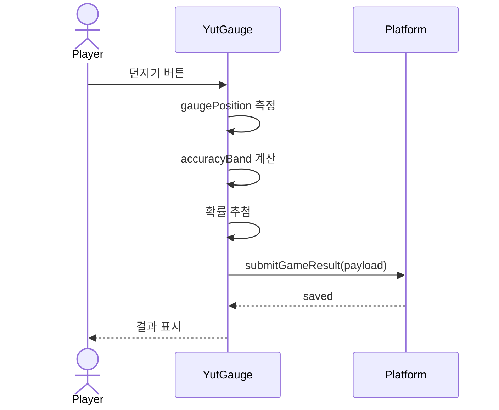
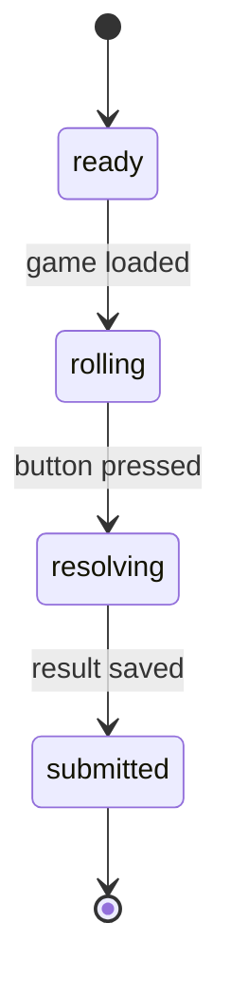

# Yut gauge game

첫 daily game은 모바일에서 버튼으로 게이지를 멈추고, 중앙 정확도에 따라 `도/개/걸/윷/모` 결과 확률이 달라지는 윷놀이 게이지 게임이다.

## 1. Context

### Meta

- Decision reference: DEC-002
- Baseline reference: BL-001
- Domain note: `gameType=yut_gauge`, result labels `도/개/걸/윷/모`
- Open questions: 없음

### Business Requirement

모바일에서 한 손으로 짧게 플레이할 수 있고, 결과를 바로 비교할 수 있는 첫 게임을 제공한다.

### Scope

In scope:

- 윷 화면.
- 게이지.
- 단일 버튼 입력.
- 정확도 기반 확률 테이블.
- 결과 label/rankValue/metadata 생성.

Out of scope:

- 윷판 이동.
- 여러 번 던지기.
- 팀전.
- 사운드/고급 애니메이션.

## 2. UX Contract

### Placement

당일 active game의 game renderer 영역.

```text
+------------------------------+
| 오늘의 윷놀이                 |
| 윷 화면 / 결과 표시            |
|                              |
| [게이지 바: 좌우 왕복]          |
| [던지기 버튼]                  |
|                              |
| 결과 / 제출 상태               |
+------------------------------+
```

### U-1. 윷 화면

- **상태**: 대기 / 던지는 중 / 결과 표시 / 제출 완료.
- **문구**: `오늘의 윷놀이`, 결과 label `도`, `개`, `걸`, `윷`, `모`.
- **CTA**: 없음.
- **기대 결과**: 버튼 입력 후 결과 label과 간단한 시각 피드백을 보여준다.

### U-2. 게이지

- **상태**: 대기 중에는 중앙 zone과 움직이는 marker를 보여준다. 결과 이후에는 멈춘 위치를 유지한다.
- **문구**: `가운데에 가까울수록 좋은 결과 확률이 올라갑니다`.
- **CTA**: 없음.
- **기대 결과**: marker 위치로 accuracy band가 결정된다.

### U-3. 버튼

- **상태**: 참여 가능 / 처리 중 / 제출 완료 / 이미 참여함 / 종료됨.
- **문구**: `던지기`, `기록 중`, `오늘은 이미 참여했습니다`, `게임 종료`.
- **CTA**: 던지기 버튼.
- **기대 결과**: 버튼을 누르면 게이지가 멈추고 확률 추첨 후 결과가 저장된다.

## 3. User Scenario

### S-1. Player - 윷 던지기

1. 사용자는 당일 게임 카드에서 윷놀이 게임을 연다.
2. 화면은 왕복하는 게이지 marker와 버튼을 보여준다.
3. 사용자는 중앙에 맞춰 버튼을 누른다.
4. 시스템은 중앙 오차율을 계산한다.
5. 오차율에 맞는 확률 테이블로 `도/개/걸/윷/모`를 추첨한다.
6. 시스템은 결과를 platform result contract로 저장한다.
7. 사용자는 결과 label을 확인한다.

### S-2. Player - 좋은 입력이지만 모가 안 나옴

1. 사용자가 Perfect 구간에 맞춘다.
2. 시스템은 Perfect 확률 테이블을 사용한다.
3. `모`는 35% 확률이므로 다른 결과가 나올 수 있다.
4. 화면은 결과를 그대로 표시한다.

### S-3. Player - 중복 참여 제한

1. 사용자가 이미 당일 결과를 제출했다.
2. 윷놀이 화면은 저장된 결과를 표시한다.
3. 던지기 버튼은 비활성화된다.

## 4. Interface Contract

### API Contract

SPEC-001의 `submitGameResult`를 사용한다. 게임별로 생성해야 하는 result payload만 이 spec에서 정의한다.

| Method | Path / Operation | 요약 | 권한 |
|---|---|---|---|
| POST | `submitGameResult` | 윷놀이 결과 저장 | authenticated |

### Request / Response

Request:

```json
{
  "gameId": "uuid",
  "score": 5,
  "rankValue": 5,
  "resultLabel": "모",
  "metadata": {
    "gameType": "yut_gauge",
    "accuracyBand": "perfect",
    "centerErrorRatio": 0.03,
    "gaugePosition": 0.47,
    "probabilityTableVersion": "yut-gauge-v1"
  }
}
```

### Validation

| 필드 | 규칙 |
|---|---|
| `gameType` | `yut_gauge` |
| `resultLabel` | `도`, `개`, `걸`, `윷`, `모` 중 하나 |
| `rankValue` | `도=1`, `개=2`, `걸=3`, `윷=4`, `모=5` |
| `score` | MVP에서는 `rankValue`와 동일 |
| `centerErrorRatio` | 0 이상 1 이하 |
| `gaugePosition` | 0 이상 1 이하 |
| `probabilityTableVersion` | `yut-gauge-v1` |

### Probability Table

중앙 오차율은 `abs(gaugePosition - 0.5) * 2`로 계산한다. 0에 가까울수록 중앙에 가깝다.

| Accuracy band | Error ratio | 도 | 개 | 걸 | 윷 | 모 |
|---|---|---:|---:|---:|---:|---:|
| perfect | `0 <= error < 0.05` | 5% | 8% | 18% | 31% | 38% |
| great | `0.05 <= error < 0.15` | 8% | 12% | 24% | 30% | 26% |
| good | `0.15 <= error < 0.30` | 14% | 18% | 30% | 24% | 14% |
| normal | `0.30 <= error < 0.50` | 24% | 24% | 28% | 16% | 8% |
| bad | `0.50 <= error <= 1` | 38% | 28% | 21% | 9% | 4% |

### Case Matrix

| 에러 코드 | 백엔드 출력 | 프론트 출력 | 표시 위치 |
|---|---|---|---|
| ALREADY_SUBMITTED | SPEC-001과 동일 | 오늘은 이미 참여했습니다 | 버튼 영역 |
| GAME_CLOSED | SPEC-001과 동일 | 게임 종료 | 버튼 영역 |
| INVALID_YUT_RESULT | result contract 위반 | 결과를 저장할 수 없습니다 | 결과 영역 |

### Flow



### State / Lifecycle



### Data Contract

| Resource | Field | Description |
|---|---|---|
| YutResult | `resultLabel` | `도`, `개`, `걸`, `윷`, `모` |
| YutResult | `rankValue` | 1-5 |
| YutResult | `accuracyBand` | `perfect`, `great`, `good`, `normal`, `bad` |
| YutResult | `centerErrorRatio` | 중앙 오차율 |
| YutResult | `gaugePosition` | marker 위치 |
| YutResult | `probabilityTableVersion` | `yut-gauge-v1` |

## 5. Implementation Rules

- 결과 추첨은 버튼 입력 1회에만 실행한다.
- 좋은 accuracy band는 높은 결과 확률을 올리지만 `모`를 보장하지 않는다.
- 결과 저장 성공 전에는 완료 상태로 보지 않는다.
- 저장 실패 시 재시도 버튼은 같은 measured gauge result를 다시 저장하는 용도여야 하며, 새로 던지는 재시도는 허용하지 않는다.
- result generation logic은 deterministic input과 random source를 분리해 테스트 가능하게 둔다.

## 6. Verification

### Acceptance Criteria

- [ ] 버튼을 누르면 게이지가 멈추고 결과가 나온다.
- [ ] 중앙 오차율에 따라 accuracy band가 계산된다.
- [ ] 각 accuracy band는 지정된 확률 테이블을 사용한다.
- [ ] Perfect여도 `모`가 보장되지 않는다.
- [ ] 결과는 SPEC-001 result contract로 저장된다.
- [ ] 제출 후 버튼은 비활성화된다.
- [ ] 이미 참여한 사용자는 저장된 결과를 본다.
- [ ] 모바일 폭에서 윷 화면, 게이지, 버튼이 겹치지 않는다.

## 7. Open Questions

없음.
