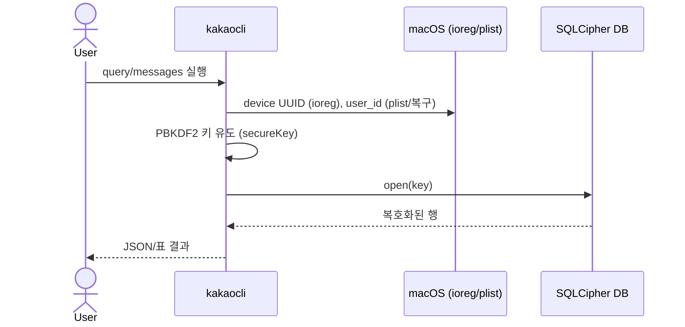

# 카톡 메시지 로컬 추출

본인 macOS 카카오톡의 로컬 암호화 DB를 복호화해, 모든 대화방의 메시지(작성자·시각·본문)를 SQL로 조회할 수 있게 보장한다. 내보내기 기능을 쓰지 않는다.

> 메시지 추출까지의 기능 계약 문서. 일정 파싱/캘린더 출력은 범위 밖(후속 spec).
> 본 제품의 "백엔드"는 복호화·DB 접근 메커니즘 그 자체이므로, 그 방법을 BE Contract에 상세히 둔다 (사용자 요청: 방법 상세 기록).

## Context

- 관련 decision/baseline: [[decision-001-extraction-approach]] / [[baseline-001-kakao-message-extraction]]
- 비즈니스 요구: 여러 단톡방에 흩어진 일정을 다루기 위한 전제로, 메시지를 자동·일괄로 가져와야 한다.
- 범위(In/Out):
  - In: 로컬 DB 발견 → 키 유도 → 복호화 → 메시지/대화방 SQL 조회.
  - Out: 일정 추출(NLP), 캘린더/ics/md 출력, 증분 동기화 자동화.

## UX Contract

UI 없음 (CLI). 사용자에게 보이는 계약은 명령과 그 출력이다.

### Placement

해당 없음 (터미널 CLI).

### U-1. 추출 명령 출력

- **상태**:
  - 정상: 지정한 SQL/필터 결과를 JSON 또는 표로 출력.
  - 권한 없음: Full Disk Access 미부여 시 DB 파일 읽기 실패 메시지.
  - 키 실패: user_id 자동 탐지 실패 시 후보 목록과 수동 지정 안내 출력.
- **문구**: 영문 CLI 메시지(`Database opened successfully!`, `No candidate user ID produced a valid key.` 등).
- **CTA**: `kakaocli query/messages/search` 실행.
- **기대 결과**: 복호화된 메시지 데이터 반환.

## User Scenario

### S-1. 사용자 — 전체 방 메시지 일괄 조회

1. 터미널(또는 호출 프로세스)에 Full Disk Access 권한이 부여돼 있다.
2. 키 입력값(device UUID, user_id)을 확보한다. user_id 자동 탐지 실패 시 §BE Contract의 복구 절차로 1회 복구해 고정한다.
3. user_id로 SQLCipher 키를 유도한다.
4. `kakaocli query "<SQL>" --db <DB> --key <KEY>` 로 메시지/대화방을 조회한다.
5. (경계) 카톡 버전 업데이트로 키 유도가 깨지면 §Open Questions OQ 경로로 재확보.

### S-2. 사용자 — 특정 방/기간 필터 조회

1. `kakaocli messages --chat "<방이름>" --since <ts> --limit N` 또는 `query`에 `WHERE chatId=... AND sentAt>=...`.
2. `chatName`이 빈 1:1 방은 멤버명으로 식별(§Data Contract 참고).

## FE Contract

해당 없음.

## BE Contract

추출 메커니즘 = 본 제품의 백엔드. 아래가 핵심 계약이다.

### 도구 / 환경 (복호화는 내부 구현, kakaocli는 reference-only)

- **복호화는 mykakao 내부에서 직접 수행한다.** 런타임 의존은 표준 `sqlcipher`(또는 sqlcipher 바인딩) + 자체 키 유도뿐.
- `kakaocli`는 **지식 참고용**(reference)이다 — PRAGMA cipher compatibility 모드와 키 유도식(`KeyDerivation.swift`, blluv 연구)을 파악하는 데만 사용했고, **런타임 의존이 아니다**.
- 대상: 카톡 macOS App Store 샌드박스 버전 (검증: v26.1.1).
- 권한: 호출 프로세스/터미널에 **Full Disk Access** 필요(+UI 자동화 시 Accessibility).
- DB 위치: 컨테이너
  `~/Library/Containers/com.kakao.KakaoTalkMac/Data/Library/Application Support/com.kakao.KakaoTalkMac/<78-hex>` — 확장자 없는 78자리 hex 파일. WAL/SHM 동반. 헤더 `2a32 11fe...`(SQLCipher).

### 키 유도 (KeyDerivation)

두 입력에서 결정적으로 유도된다: **device UUID** + **user_id**.

- device UUID: `ioreg -rd1 -c IOPlatformExpertDevice` 의 `IOPlatformUUID`.
- `hashedDeviceUUID(uuid)` = base64( SHA1(uuid) ‖ SHA256(uuid) ).
- **DB 파일명** = PBKDF2-HMAC-SHA256(iter=100000, dklen=128B) 후 hex의 `[28:106]`(78자). password/salt 조합은 user_id+uuid 기반(`KeyDerivation.swift` 정본).
- **SQLCipher 키(secureKey)** = 같은 PBKDF2(100000, 128B)로 다른 조합에서 유도, 결과 256-hex.
- 검증: 계산한 DB 파일명이 디스크의 실제 파일명과 일치하면 user_id가 맞다.

### user_id 확보 / 복구 (중요 — 자동 탐지 실패 대응)

`kakaocli`의 자동 user_id 탐지가 실패할 수 있다(설치본 0.4.1 기준 `AlertKakaoIDsList` 후보가 빗나감). 복구 절차:

1. plist `~/Library/Containers/com.kakao.KakaoTalkMac/Data/Library/Preferences/com.kakao.KakaoTalkMac.plist` 에서 `*REVISION:<128hex>` 키들을 본다.
2. **값이 0이 아닌**(=활성 계정) 키의 128-hex가 곧 **SHA512(str(user_id))**. (빈 계정 기본값 = SHA512("0") = `31bca020...`)
3. 그 hex의 preimage를 SHA512 brute-force로 찾는다(정수, 0~10억, C/CommonCrypto로 ~십수 초).
4. 찾은 user_id로 DB 파일명을 계산해 디스크 파일명과 일치하는지 확인.

이 기기 확보값 (검증 완료 2026-06-12):

| 항목 | 값 |
|---|---|
| device UUID | `9E76ABB4-DFA8-52D0-87D0-C5982BA4212D` |
| user_id | `39411126` |
| 활성 계정 키 | `DENYFILEEXTIONSIONREVISION:85cb2674...972c6` (value=5) |

> SQLCipher 키(256-hex)는 user_id로 언제든 재유도되므로 문서에 평문 보관하지 않는다.

### SQLCipher open (내부 복호화 레시피 — 검증 완료)

유도한 256-hex 키는 **raw key(`x'..'`)가 아니라 passphrase**로 준다. SQLCipher가 그 위에 자체 KDF를 적용한다. 카톡 v26.1.1은 **compatibility 3**에서 열린다.

```sql
-- file:<DB>?immutable=1 로 read-only open (live DB·WAL 무간섭)
PRAGMA cipher_default_compatibility = 3;   -- 실패 시 4 폴백
PRAGMA key = '<256-hex secureKey>';
SELECT count(*) FROM NTChatMessage;        -- 성공 확인
```

- 표준 `sqlcipher` CLI/라이브러리로 위 PRAGMA + 임의 read-only SQL 실행. (라이브 검증: 632k+ 메시지 평문 반환)
- 조회 래퍼는 `30-work/`에서: device UUID·user_id 확보 → secureKey 재유도 → 위 open → SQL.
- **읽기 모드 주의**: `immutable=1`은 WAL 무시 → 연 시점 **스냅샷 고정**(새 메시지 안 보임). 라이브 반영이 필요하면 `mode=ro`로 열어 WAL을 읽는다. (WORK-001 SSE는 mode=ro 폴링으로 실시간 반영)

> (참고) kakaocli도 같은 일을 `kakaocli query "<SQL>" --db --key` / `messages` / `search` / `sync` 로 하지만, 본 제품은 이를 런타임에 쓰지 않는다.

## Validation

| 필드 | 규칙 |
|---|---|
| user_id | 양의 정수. DB 파일명 계산이 디스크와 일치해야 valid. |
| device UUID | `ioreg` IOPlatformUUID 형식. |
| DB 경로 | 컨테이너 내 78-hex 파일이 존재해야 함. |

## Case Matrix

| 에러 코드/상황 | 백엔드 출력 | 프론트(CLI) 출력 | 표시 위치 |
|---|---|---|---|
| 권한 없음 | 파일 read 실패 | Full Disk Access 안내 | stderr |
| user_id 미탐지 | 후보 키 검증 전부 실패 | `No candidate user ID produced a valid key.` + 수동 지정 안내 | stdout |
| 키 불일치 | DB open 실패 | `Failed to open database` | stdout |
| 빈 방이름 | `chatName=''` | 1:1 방, 멤버명으로 식별 필요 | 데이터 |

## Flow



## State Machine

해당 없음.

## Data Contract

복호화 후 외부에 드러나는 핵심 리소스/필드.

### NTChatMessage (메시지)

| 필드 | 의미 |
|---|---|
| `chatId` | 대화방 ID (→ NTChatRoom) |
| `logId` / `msgId` | 메시지 식별자 |
| `authorId` | 작성자 user_id |
| `type` | 메시지 종류 (1 = 일반 텍스트) |
| `message` | 본문(평문) |
| `sentAt` | 전송 시각 — **unix epoch 초** (`datetime(sentAt,'unixepoch','localtime')`) |
| `attachment` / `extra` | 첨부·부가 데이터(JSON) — 비텍스트 type 해석에 사용 |

### NTChatRoom (대화방)

| 필드 | 의미 |
|---|---|
| `chatId` | 대화방 ID |
| `chatName` | 방 이름(단톡=있음, 1:1=빈값 → 멤버명 별도) |
| `type` | 방 종류 |
| `lastUpdatedAt` | 마지막 활동 시각 |

- 규모(검증 시점): 631,713 메시지 / 741 방.

## Work Handoff

- 키 유도/복구를 1회 수행해 user_id·DB 경로를 고정하고, 조회용 래퍼(키 재유도 + `kakaocli query`)를 만든다.
- 비텍스트 `type`/`attachment` 분포 조사는 다음 단계(일정 파싱)에서 필요. 이번 범위 밖.

## Open Questions

- OQ-1: 카톡 버전 업데이트 시 키 유도/스키마 변경 대응. (DEC-001 OQ-1)
- OQ-2: 신규 메시지 증분 수집(`kakaocli sync` 폴링) 채택 여부. (DEC-001 OQ-2)
- OQ-3: `NTCalendar` 등 카톡 내장 약속/캘린더 테이블에 구조화된 일정이 있는지 — 일정 플로우 진입 시 우선 확인.
