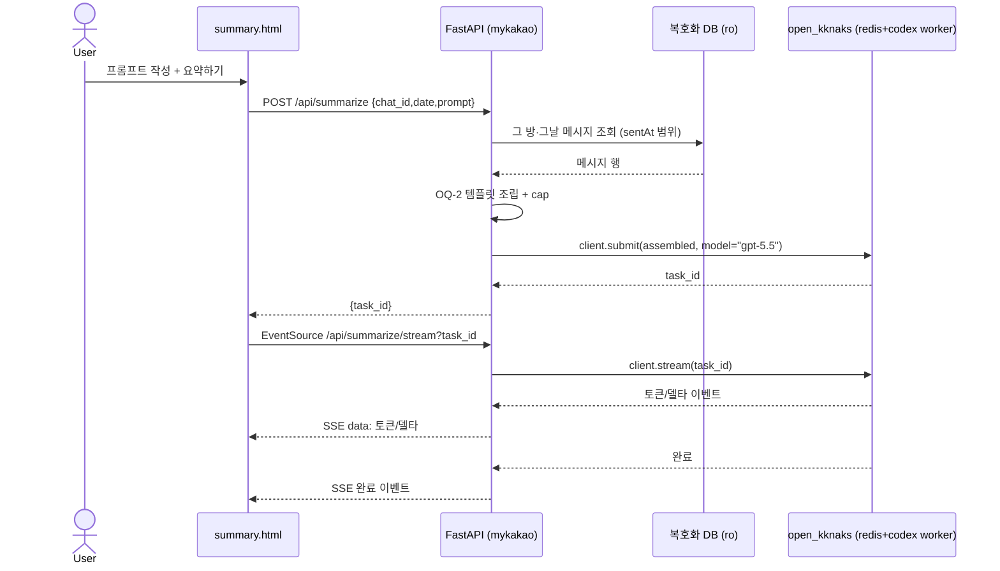
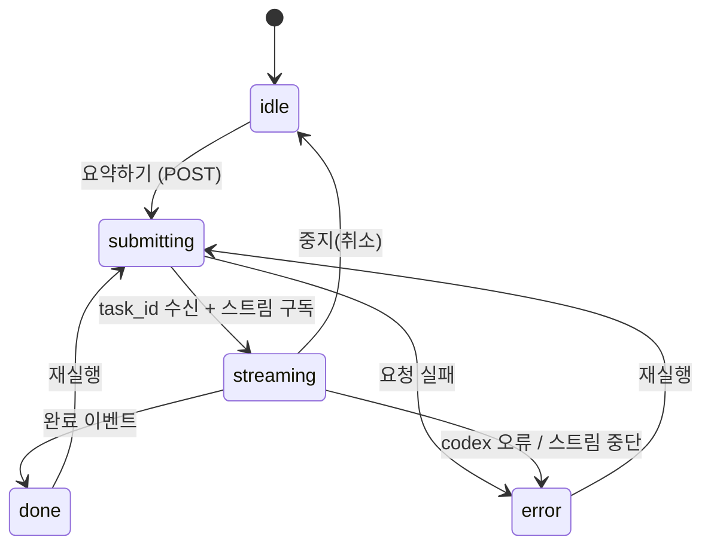

# 추출 대화 AI 요약 (방·날짜 선택 + 사용자 프롬프트)

추출된 카톡 대화에서 채팅방 1개 + 날짜 1일치를 고르고, 사용자가 직접 쓴 프롬프트와 그날 메시지를 합쳐 codex(LLM)로 요약해, 결과를 SSE로 스트리밍 렌더하는 기능 계약.

> DEC-002 확정 5개를 외부 계약으로 구체화한 문서. 구현 순서·작업 분리·완료 체크리스트는 `30-work/`(WORK-002) 소관.
> 모델/프롬프트 템플릿/cap/2뷰 구성은 DEC-002 OQ로 닫힌 값을 계약으로 박는다.

## Context

- 관련 decision/baseline: [[decision-002-ai-summary-approach]] / [[baseline-002-ai-conversation-summary]]
- 비즈니스 요구: 추출(SPEC-001/WORK-001)은 끝났다. "이 방·이 날짜에 무엇이 중요했나"를 사람이 다시 읽지 않고 LLM 요약으로 얻는다. 프롬프트만 바꾸면 요약/일정추출/할일추출로 확장되는 첫 LLM 체인.
- 범위(In/Out):
  - In: 방 1개 × 날짜 1일 선택 → 사용자 프롬프트 + 그날 메시지 조립 → codex 호출 → SSE 스트리밍 렌더. 2뷰 데모(목록/요약).
  - Out: 멀티데이/방 전체 요약, 일정 파싱·캘린더 출력, 결과 영속 저장/히스토리, 프롬프트 프리셋 관리.

## UX Contract

2뷰 데모 (DEC-002 ⑤, OQ-4 = 별도 html 2개).

### Placement

```text
index.html (목록)                     summary.html (요약)
+────────────────────────+            +──────────────────────────────+
│ 채팅방 목록            │            │ [방 이름 / YYYY-MM-DD] 헤더   │
│  - 방 A  [날짜선택][▶] │ ── 이동 ─▶ │ 프롬프트 textarea            │
│  - 방 B  [날짜선택][▶] │ chat_id    │ [요약하기] 버튼              │
│  ...                   │ date       │ 결과 영역(스트리밍)          │
+────────────────────────+            │ (에러 / 생략 고지)           │
                                       +──────────────────────────────+
```

### U-1. index.html — 채팅방 목록 + 요약 진입

- **상태**:
  - 정상: 기존 데모의 채팅방 목록을 그대로 유지(WORK-001). 각 방에 날짜 선택 수단 + 요약 진입 CTA를 둔다.
  - 빈: 추출된 방이 없으면 기존 데모의 빈 상태를 따른다.
- **문구**: 방 이름, 날짜 선택 라벨, 진입 버튼 라벨("요약하기").
- **CTA**: "요약하기" — 선택된 `chat_id`와 `date`를 들고 `summary.html`로 이동. 날짜 미선택 시 비활성(또는 그날 메시지 없음 안내는 U-2/Case Matrix).
- **기대 결과**: `summary.html?chat_id=<id>&date=<YYYY-MM-DD>`로 페이지 이동.

### U-2. summary.html — 요약 화면

- **상태**:
  - idle: 방/날짜 헤더 표시, 프롬프트 textarea(빈/작성), 실행 버튼 활성, 결과 영역 비어 있음.
  - streaming: 실행 버튼 비활성(또는 "중지"로 전환), 결과 영역에 토큰이 점진적으로 누적 렌더.
  - done: 전체 결과 렌더 완료, 실행 버튼 재활성(재실행 가능).
  - error: 결과 영역 또는 별도 영역에 에러 메시지(Case Matrix).
  - 생략 고지: 그날 메시지가 cap 초과로 잘린 경우, 결과와 함께 `…(일부 생략됨, 총 N개 중 M개 표시)` 고지.
- **문구**: 방/날짜 헤더, 프롬프트 placeholder, 실행 버튼("요약하기"/"중지"), 에러 문구, cap 생략 고지 문구.
- **CTA**: "요약하기" — `POST /api/summarize` 호출 후 SSE 구독 시작. 프롬프트 빈 값이면 비활성/거부(Validation).
- **기대 결과**: 결과 영역에 LLM 출력이 스트리밍으로 렌더되고 완료된다.

## User Scenario

### S-1. 사용자 — 방·날짜 골라 요약

1. `index.html`에서 채팅방 1개를 고르고 날짜 1일을 선택한다.
2. "요약하기"로 `summary.html`(해당 `chat_id`·`date`)로 이동한다.
3. 요약 프롬프트(system prompt 성격)를 textarea에 작성한다.
4. "요약하기"를 누르면 `POST /api/summarize`로 `{chat_id, date, prompt}`를 보내고 `task_id`를 받는다.
5. FE가 `EventSource('/api/summarize/stream?task_id=...')`로 구독한다.
6. 결과가 토큰/델타 이벤트로 도착하며 결과 영역에 점진 렌더된다.
7. 완료 이벤트가 오면 스트림이 닫히고 버튼이 재활성된다.

### S-2. 사용자 — 그날 메시지가 많은 방 (cap)

1. S-1과 동일하게 실행한다.
2. 그날 메시지가 상한(설정값)을 초과하면, 조립 시 **오래된 것부터 잘라내고** 최근 메시지만 프롬프트에 담는다.
3. 결과와 함께 `…(일부 생략됨, 총 N개 중 M개 표시)` 고지가 표시된다.

### S-3. 사용자 — 빈 날짜 / 에러

1. 선택한 방·날짜에 메시지가 없으면 요약을 실행하지 않고 "그날 메시지가 없습니다" 류 안내를 보인다(Case Matrix).
2. 워커/브로커 미가동 또는 codex 오류 시 에러 이벤트가 도착하고 결과 영역에 에러가 표시된다.
3. (재실행) done/error 후 같은 프롬프트 또는 수정한 프롬프트로 다시 실행할 수 있다.

## FE Contract

- `summary.html`은 실행 시 두 단계로 동작한다: ① `POST /api/summarize`로 `{chat_id, date, prompt}` 전송 → `task_id` 수신, ② `EventSource('/api/summarize/stream?task_id=<task_id>')`로 스트림 구독·렌더.
- 분리 이유: `EventSource`는 GET 전용이라 프롬프트 본문을 실어 보낼 수 없다. 프롬프트는 POST로 보내고, 스트림은 `task_id`로만 구독한다.
- FE validation(즉시 피드백): 프롬프트 비어 있으면 실행 버튼 비활성/거부. `chat_id`·`date`는 URL 쿼리로 받은 값을 그대로 전송.
- 상태 전이 렌더: idle → submitting(요청 중) → streaming(토큰 누적) → done/error는 State Machine을 따른다.
- `chat_id`·`date`는 `index.html` → `summary.html` 이동 시 URL 쿼리로 전달된다.

## BE Contract

FastAPI(mykakao `backend/`). LLM 호출은 직접 subprocess가 아니라 `open_kknaks` 라이브러리를 통한다(DEC-002 ①).

### 전제 (Precondition)

- `open_kknaks` 동작에는 **Redis 브로커 + codex provider 워커 프로세스**가 필요하다. spec은 이를 런타임 의존성으로 명시하고, 실제 기동 절차는 `30-work/`(WORK-002) 또는 runbook 소관.
- 메시지 소스는 SPEC-001의 복호화 DB 접근(`raw_ro_connection` 류 read-only)이다.

### API 계약

| Method | Path | 요약 | 권한 |
|---|---|---|---|
| POST | `/api/summarize` | `{chat_id, date, prompt}` → 그 방·그날 메시지 조립 + cap + codex submit → `{task_id}` | 본인 로컬 |
| GET | `/api/summarize/stream?task_id=...` | `open_kknaks` 스트림 이벤트를 `text/event-stream`으로 릴레이 | 본인 로컬 |

### Request / Response 상세 (정상 응답만 — 에러는 Case Matrix)

- **POST `/api/summarize`**
  - Request body: `{ "chat_id": <string|int>, "date": "YYYY-MM-DD", "prompt": <string> }`.
  - 처리: 해당 `chat_id` + `sentAt`이 그 날짜 로컬 `[00:00, 24:00)` 범위인 `ChatMessage`를 시각 오름차순 조회 → OQ-2 템플릿으로 조립(+ cap 적용) → `client.submit(assembled, model="gpt-5.5")`.
  - Response: `{ "task_id": <string> }` (open_kknaks가 발급한 식별자).
  - `chat_id`/`logId` 등은 SPEC-001 Data Contract의 문자열 직렬화 규약을 유지한다(BigInteger overflow 회피).
- **GET `/api/summarize/stream?task_id=...`**
  - 처리: `client.stream(task_id)` 이벤트를 SSE로 릴레이. 기존 `/api/stream` SSE 패턴(`StreamingResponse(media_type="text/event-stream")`, keep-alive `: ping`)을 재사용하되, 페이로드는 DB 행이 아니라 LLM 출력(Data Contract).
  - Response: `text/event-stream`. 이벤트 종류는 Data Contract.

### LLM 호출 계약

- provider = codex, model = `gpt-5.5`(tunable). `open_kknaks` 경로: `client.submit(prompt, model="gpt-5.5")` → codex provider 워커가 `codex exec --json --model gpt-5.5 <prompt>` 실행 → `client.stream(task_id)`로 결과 스트림.

## Validation

| 필드 | 규칙 |
|---|---|
| `chat_id` | 추출된 방 중 존재하는 ID. |
| `date` | `YYYY-MM-DD` 형식. 로컬 날짜로 해석. |
| `prompt` | 비어 있지 않은 문자열. |
| (그날 메시지) | 선택 방·날짜에 메시지 1건 이상 있어야 요약 실행. 0건이면 거부(Case Matrix). |

## Case Matrix

| 에러/경계 상황 | 백엔드 출력 | 프론트 출력 | 표시 위치 |
|---|---|---|---|
| 프롬프트 빈 값 | 400 (요청 거부) | 실행 버튼 비활성/입력 요구 | summary.html 입력부 |
| `chat_id` 없음 / `date` 형식 오류 | 400 | "잘못된 방/날짜" 안내 | summary.html |
| 그날 메시지 0건 | 빈 결과(요약 미실행) | "그날 메시지가 없습니다" 안내 | summary.html 결과부 |
| 메시지 cap 초과 | 오래된 것부터 truncate + 고지 메타 | `…(일부 생략됨, 총 N개 중 M개 표시)` | summary.html 결과부 (에러 아님) |
| Redis/워커 미가동 | submit/stream 실패 | "요약 서버(워커) 미가동" 류 에러 | summary.html 결과부 |
| codex 오류/타임아웃 | error 이벤트 | 에러 메시지 + 재실행 안내 | summary.html 결과부 |
| 스트림 중단 | 연결 종료 | 부분 결과 유지 + 재실행 안내 | summary.html 결과부 |

## Flow



## State Machine



## Data Contract

### 조립 프롬프트 형식 (OQ-2 확정)

```text
{사용자 프롬프트}

---
[{방 이름} / {YYYY-MM-DD}]
{HH:MM} {발신자}: {본문}
{HH:MM} {발신자}: {본문}
...
```

- 한 줄 = 한 메시지. 시각(`HH:MM`)은 그날 로컬 기준(`sentAt` unix epoch → localtime).
- 발신자는 표시명. 비텍스트(`type ≠ 1`)는 `[사진]`/`[기타]` 등 placeholder로 치환.

### SSE 이벤트 페이로드

- 종류: **토큰/델타**(부분 출력 누적), **완료**(스트림 종료 신호), **에러**(실패 사유). open_kknaks 스트림 이벤트를 릴레이하며, 형식은 SSE `data:` 라인 + keep-alive `: ping`.
- (구체 필드 명칭/JSON 키는 open_kknaks `client.stream` 이벤트 형태에 맞춰 WORK-002에서 고정.)

### cap 생략 고지 형식

- `…(일부 생략됨, 총 N개 중 M개 표시)` — N=그날 전체 메시지 수, M=프롬프트에 담은 수. 결과와 함께 표시(에러 아님).

## Work Handoff

- WORK-002에서 다음 표면으로 분리된다(체크리스트/순서는 work 소관):
  - **BE**: `POST /api/summarize`(조회+조립+cap+submit) / `GET /api/summarize/stream`(릴레이) 2개 엔드포인트, OQ-2 조립기, OQ-3 cap 로직.
  - **FE**: `summary.html`(POST→EventSource 분리 구조 + 상태 렌더) / `index.html` 날짜 선택 + 진입 CTA.
  - **인프라**: Redis 브로커 + codex provider 워커 기동(전제).
- cap 상한 구체값은 tunable 파라미터로 WORK-002에서 정한다(spec은 "상한 존재 + 초과 시 truncation + 고지"만 계약).
- SSE 이벤트 JSON 키 확정은 open_kknaks `client.stream` 실제 이벤트 형태에 맞춘다.

## Open Questions

- 없음. DEC-002 OQ-1~4는 본 spec에 반영되어 closed. 남은 미정값(cap 상한 수치, SSE 이벤트 JSON 키)은 OQ가 아니라 WORK-002에서 고정할 구현 파라미터다.
