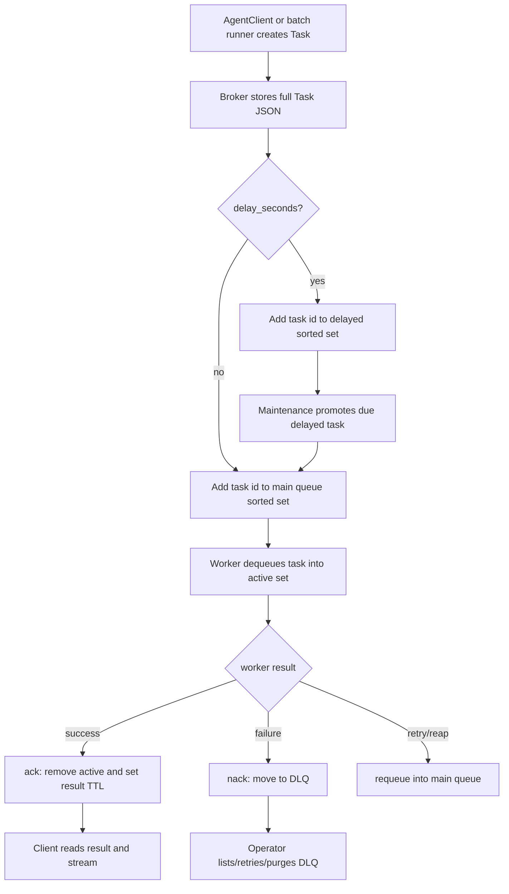
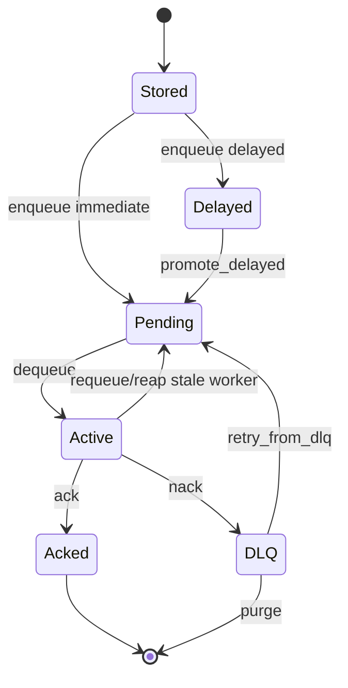

# OKK-SPEC-002 Redis Broker 큐 계약

RedisBroker는 task 저장, queue ordering, active/DLQ 관리, stream event delivery, worker heartbeat, cost 집계를 담당한다.

## Context

source는 `/Users/kknaks/git/library/claude_code_pty/open_kknaks/open_kknaks/broker/`다.

## User Flow

## State Machine

## UX Contract

CLI는 pending queue size, task state, DLQ list/retry/purge를 보여준다.

## FE Contract

해당 없음.

## BE Contract

### AbstractBroker

| 영역 | Method |
|---|---|
| queue | `enqueue`, `dequeue`, `ack`, `nack`, `requeue` |
| state | `get_task`, `update_task` |
| stream | `publish_chunk`, `subscribe_chunks` |
| DLQ | `list_dlq`, `retry_from_dlq`, `purge_dlq` |
| worker | `register_worker`, `deregister_worker`, `heartbeat`, `reap_stale_workers`, `queue_size` |
| cost | `incr_cost`, `get_total_cost`, `get_worker_cost` |
| lifecycle | `promote_delayed`, `connect`, `close` |

### RedisBroker 기본값

| Field | Default |
|---|---|
| `url` | `redis://localhost:6379` |
| `namespace` | `open_kknaks` |
| `result_ttl` | 3600 seconds |
| `stream_maxlen` | 1000 |

## Data Contract

### Task storage

Broker는 `Task.model_dump_json()` 결과를 hash `data` 필드에 저장한다. provider 기반 task 모델의 `provider`, `model`, `options`, `provider_options`, `result_session_id`, `usage`는 broker가 해석하지 않고 JSON round-trip으로 보존한다.

Broker의 책임은 task payload를 변형하지 않는 저장/전달이다. provider validation과 option validation은 client, worker, runner adapter 계약에서 처리한다.

### Queue ordering

같은 queue 안에서는 `priority * 1e12 + current_time_ms` score를 사용한다. 낮은 priority 값이 먼저 처리되고, 같은 priority에서는 오래된 task가 먼저 처리된다.

여러 queue를 worker가 구독할 때는 queue list 순서가 먼저 적용된다. 전 queue global priority 정렬은 보장하지 않는다.

### Delayed task

`delay_seconds`가 있으면 delayed sorted set에 들어가고, maintenance loop가 due task를 main queue로 승격한다.

delayed 승격은 원래 priority score를 복원하지 않고 승격 시점의 `Priority.NORMAL` score를 사용한다. 이것은 현재 Redis lua maintenance 계약이다.

### Active / DLQ

| Action | 계약 |
|---|---|
| `dequeue` | queue sorted set에서 제거하고 active set에 추가 |
| `ack` | active set에서 제거하고 task hash TTL 설정 |
| `nack` | active set에서 제거하고 DLQ list에 추가 |
| `requeue` | active set에서 제거하고 main queue에 재삽입 |

### Streaming

Redis Streams를 사용한다. `subscribe_chunks`는 `0-0`부터 읽어 history와 live event를 함께 전달하고, task가 `done`, `failed`, `cancelled`가 된 뒤 남은 stream event를 drain하고 종료한다.

## Work Handoff

work의 Acceptance Criteria는 아래 계약 표면에서 파생한다.

- full Task JSON 저장과 provider/options/provider_options round-trip
- queue score 기반 priority ordering
- delayed task의 `Priority.NORMAL` promotion
- active/DLQ/ack/nack/requeue 상태 이동
- stream history/live delivery와 terminal drain
- worker heartbeat와 stale worker reap
- Redis key component validation

## Open Questions

없음.
