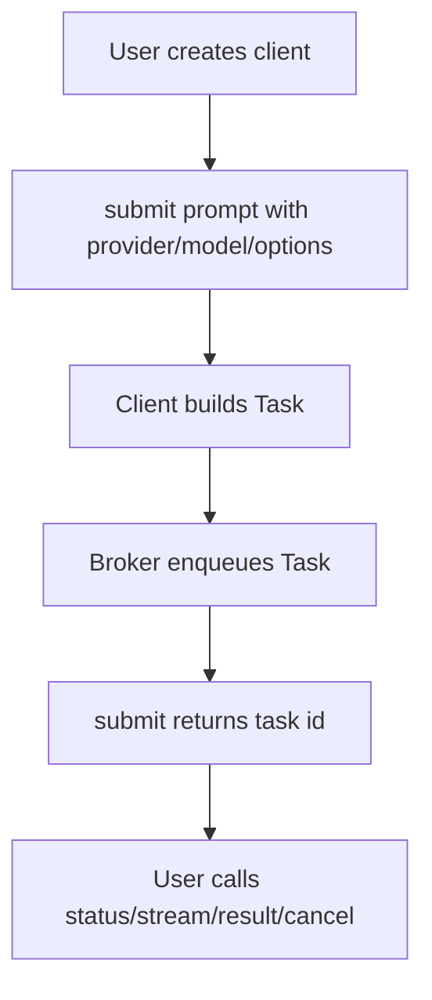
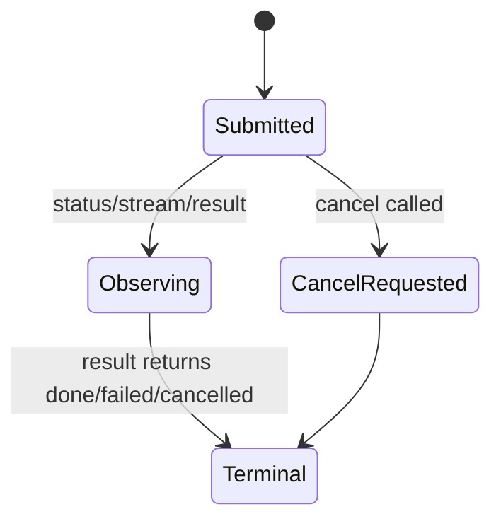

# OKK-SPEC-003 Python Client와 Streaming API

`AgentClient`는 broker 위의 async producer/observer API이며, provider 실행은 worker가 담당한다. provider 구조가 들어가는 버전은 breaking change이므로 legacy `ClaudeClient` 대신 provider-neutral `AgentClient`를 public client 이름으로 사용한다.

## Context

source는 `/Users/kknaks/git/library/claude_code_pty/open_kknaks/open_kknaks/client.py`와 package root export다.

## User Flow

## State Machine

## UX Contract

라이브러리 사용자는 task id를 중심으로 비동기 작업을 추적한다. `submit`은 실행 결과를 기다리지 않고 즉시 task id를 반환한다.

## FE Contract

해당 없음.

## BE Contract

### Public exports

package root는 `AgentClient`, `RedisBroker`, `AbstractBroker`, `Task`, `TaskResult`, `StreamEvent`, `TaskStatus`, `Priority`, `TokenUsage`, `BatchRunner`, `BatchStatus`, exception classes를 export한다.

legacy `ClaudeClient`는 provider 구조가 들어가는 버전의 public export에서 제거한다.

### AgentClient methods

| Method | Return | 계약 |
|---|---|---|
| `submit(...)` | `str` | `Task`를 생성해 broker에 enqueue하고 task id를 반환 |
| `status(task_id)` | `str \| None` | 저장된 task status 또는 없음 |
| `result(task_id, timeout=600)` | `Task \| None` | terminal이면 즉시 반환, 아니면 stream을 구독하며 terminal까지 대기 |
| `stream(task_id, timeout=600, event_types=None)` | `AsyncIterator[StreamEvent]` | broker stream event를 비동기로 전달 |
| `cancel(task_id)` | `bool` | 저장된 task status를 `cancelled`로 변경. running process interrupt는 보장하지 않음 |

### submit parameters

`submit`은 `prompt`, `context`, `queue`, `priority`, `delay_seconds`, `timeout`, `max_retries`, `provider`, `model`, `options`, `provider_options`, `metadata`를 task에 반영한다.

legacy Claude 전용 인자 `system_prompt`, `append_system_prompt`, `max_turns`, `effort`, `json_schema`, `allowed_tools`, `disallowed_tools`, `permission_mode`, `session_id`, `mcp_config`, `add_dirs`는 provider 구조가 들어가는 버전에서 public submit contract에서 제거한다. 기존 호출자는 provider 구조 이전 버전을 사용한다.

`AgentClient.submit()`은 middleware chain을 실행하지 않는다. enqueue 전후 hook은 public submit contract에 포함하지 않는다.

## Data Contract

`stream(event_types=...)`는 event type filter가 주어지면 해당 type만 yield한다.

`result(timeout=...)`는 client-side wait timeout이 발생해도 예외를 던지지 않고, 마지막 persisted task snapshot을 반환한다.

`cancel`은 running process interrupt가 아니라 persisted status marker다. provider adapter의 direct cancel 기능은 worker shutdown 같은 내부 제어에 사용할 수 있으나, public `AgentClient.cancel()`의 보장 범위가 아니다.

## Work Handoff

work의 Acceptance Criteria는 아래 계약 표면에서 파생한다.

- `submit`의 provider/model/options/provider_options 입력
- provider 생략 시 `claude` task 생성
- legacy Claude submit 인자 제거와 새 options 계약 반영
- `status`, `result`, `stream`, `cancel`의 provider-neutral 동작
- client가 provider CLI를 직접 실행하지 않는 구조
- submit path에서 enqueue middleware hook을 호출하지 않는 구조

## Open Questions

없음.
