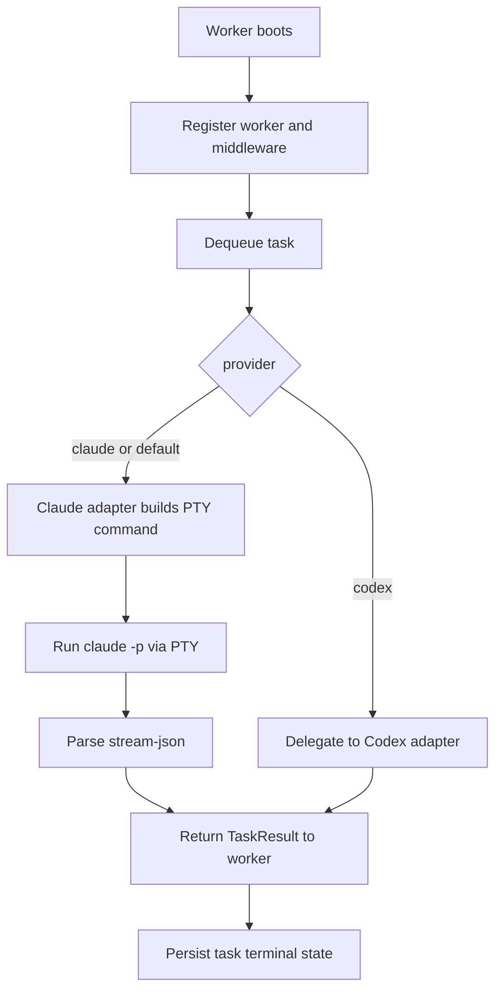
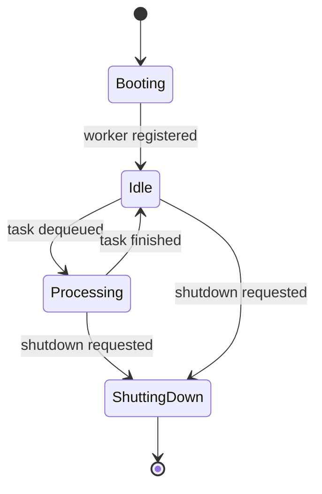

# OKK-SPEC-004 PTY Worker 실행 계약

`ClaudeWorker`의 legacy PTY 실행 계약은 `claude` provider runner adapter로 보존된다. worker는 provider-neutral 실행 흐름을 가지며, Claude adapter만 PTY child process와 stream-json parsing을 담당한다.

## Context

source는 `/Users/kknaks/git/library/claude_code_pty/open_kknaks/open_kknaks/worker/`다.

## User Flow



## State Machine



## UX Contract

운영자는 CLI 또는 Python으로 worker를 실행할 수 있다. worker는 Claude CLI 존재 여부를 boot 시점에 확인하고 heartbeat를 유지한다.

## FE Contract

해당 없음.

## BE Contract

### Worker behavior

| 단계 | 계약 |
|---|---|
| boot | worker 등록, middleware boot hook 실행, runner health check |
| loop | delayed task promotion, stale worker reap, queue dequeue |
| process | task `running` 저장, middleware `before_process`, provider adapter 실행 |
| skipped cancel | dequeue 후 task status가 이미 `cancelled`이면 실행하지 않고 ack |
| success | result/usage/session 저장, status `done`, ack |
| non-zero exit | status `failed`, error context 저장, nack |
| cancellation exception | status `cancelled`, ack |
| exception | status `failed`, retry middleware 가능, 아니면 nack |
| shutdown | running task 처리 중단 요청, middleware shutdown hook, worker deregister |

### Claude adapter command

Claude adapter는 fork/PTY 기반으로 Claude를 실행한다. 기본 command는 다음 형태다.

```text
claude -p --output-format stream-json --verbose --include-partial-messages ... -- <prompt>
```

지원하는 provider option mapping:

| Option | Claude CLI option |
|---|---|
| `model` | `--model` |
| `provider_options.system_prompt` | `--system-prompt` |
| `provider_options.append_system_prompt` | `--append-system-prompt` |
| `provider_options.max_turns` | `--max-turns` |
| `provider_options.effort` | `--effort` |
| `provider_options.json_schema` | `--json-schema` |
| `provider_options.allowed_tools` | repeated `--allowedTools` |
| `provider_options.disallowed_tools` | repeated `--disallowedTools` |
| `provider_options.permission_mode` | permission mode option |
| `options.resume.session_id` | `--resume` |
| `provider_options.mcp_config` | `--mcp-config` |
| `provider_options.add_dirs` | repeated `--add-dir` |

`work_dir`와 `claude_bin`은 worker/provider config이며 task override 대상이 아니다. 공통 `options.cwd`는 provider runner 실행 working directory로 사용한다.

## Data Contract

PTY stdout/stderr는 merged stream으로 처리된다. 출력은 line-buffered UTF-8 replacement decode를 거치며 빈 줄은 버린다.

stream parser는 Claude `stream-json` JSONL을 읽고 `text`, `cost`, `retry`, `tool_use`, `tool_result`, `thinking`, `init`, `progress` event를 생성한다.

parser가 이해하지 못하는 non-JSON stdout/stderr line은 stream event로 publish하지 않는다. non-zero exit에서는 `TaskResult.stream` 또는 `TaskResult.result`를 error context로 사용하고, 둘 다 비어 있으면 `Process exited with code ... (empty output)` 형태의 error를 저장한다.

`TaskResult.result`는 final result source의 text만 사용한다. assistant/delta text만 있고 final result가 없으면 result는 빈 문자열일 수 있다.

PTY 종료 직후 line buffer에 남은 JSONL도 main parsing path와 동일하게 처리한다. 마지막 newline 없이 종료된 `text`, `cost`, `init`, `progress`, `tool_use`, `tool_result`, `thinking` event가 aggregate result에만 반영되고 broker stream publish에서 누락되면 안 된다.

non-JSON stdout/stderr line은 stream event로 publish하지 않지만, 실패 진단을 위해 adapter 내부 debug context 또는 task error context에 tail을 보존할 수 있어야 한다. 이 context는 public stream contract가 아니라 failure debugging contract다.

## Timeout / Cancellation

| 항목 | 계약 |
|---|---|
| total timeout | `task.timeout` 또는 600초 |
| idle timeout | PTY output 없이 30초 |
| termination | process group SIGHUP, direct pid SIGTERM, process group SIGKILL 순서 |
| direct executor cancel | active PTY process를 찾아 종료 |
| client cancel | persisted status marker이며 running process interrupt 아님 |

client cancel로 `cancelled`가 저장된 pending task는 worker가 dequeue하더라도 실행하지 않는다. worker는 dequeue 직후 최신 task snapshot을 확인하고 이미 `cancelled`이면 ack 후 다음 task로 넘어간다.

## Work Handoff

work의 Acceptance Criteria는 아래 계약 표면에서 파생한다.

- worker의 provider-neutral process flow
- Claude adapter의 PTY command build
- legacy Claude task fields 제거와 `provider_options` 기반 command build
- `options.resume.session_id` -> Claude `--resume`
- PTY stream-json parsing과 `TaskResult` 생성
- PTY 종료 시 remaining/flush JSONL event의 publish 누락 방지
- non-JSON stdout/stderr debug context 보존
- timeout/cancel termination sequence 유지
- pending cancel marker를 worker가 실행하지 않는 skip/ack 처리

## Open Questions

없음.
