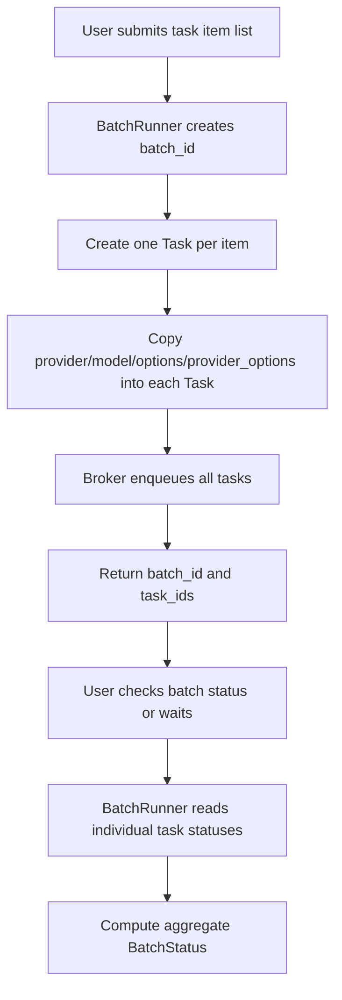
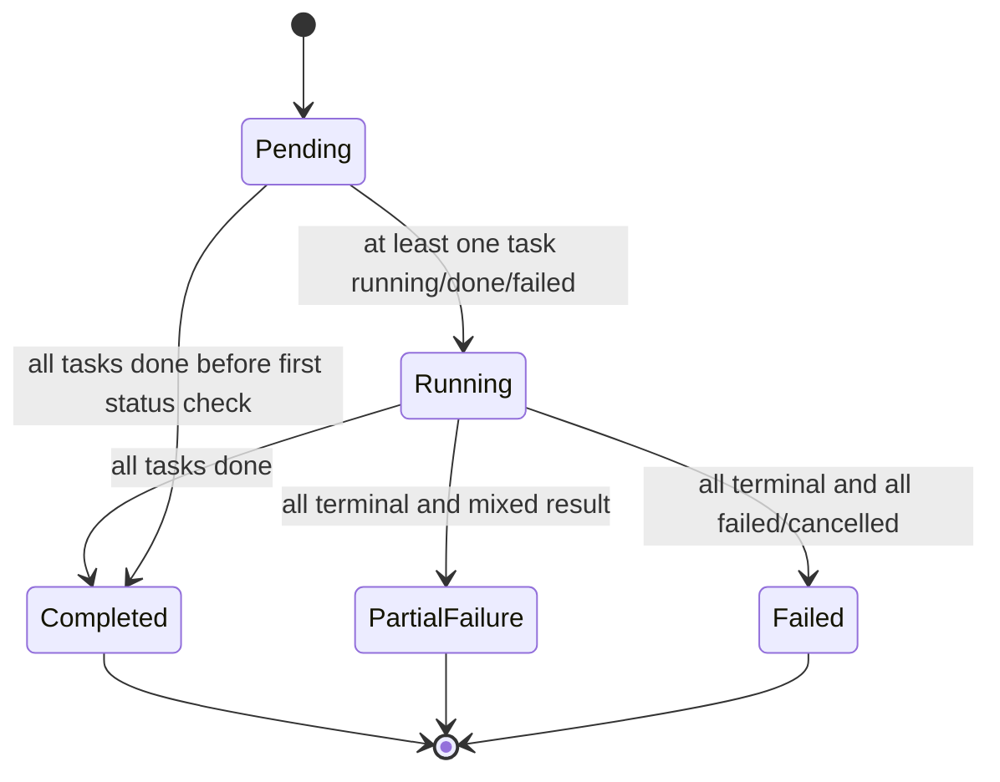

# OKK-SPEC-005 Batch 실행 계약

`BatchRunner`는 여러 prompt를 하나의 batch id로 묶어 enqueue하고, 개별 task 상태를 합산해 batch 상태를 계산한다.

## Context

source는 `/Users/kknaks/git/library/claude_code_pty/open_kknaks/open_kknaks/batch.py`다.

## User Flow

## State Machine

## UX Contract

batch는 별도 실행 엔진이 아니라 개별 task 묶음이다. 결과 역시 개별 task의 terminal status를 모아서 판단한다.

batch는 sequential execution controller가 아니다. 모든 task item은 독립 task로 enqueue되며 실제 실행 순서는 broker queue, priority, worker concurrency가 결정한다.

## FE Contract

해당 없음.

## BE Contract

### Methods

| Method | Return | 계약 |
|---|---|---|
| `submit_batch(items, queue="default")` | `(batch_id, task_ids)` | task item list를 task로 enqueue |
| `get_batch_status(batch_id, task_ids)` | `BatchStatus` | task status를 조회해 batch status 계산 |
| `wait_batch(task_ids, timeout=3600, poll_interval=1.0)` | `list[Task]` | terminal task를 모아 반환 |

`mode` 인자는 provider 구조 버전의 public contract에서 제거한다. `sequential` batch는 이번 범위에서 지원하지 않는다.

### BatchStatus

| Status | 조건 |
|---|---|
| `pending` | 모든 task가 아직 `pending`이거나 task snapshot을 찾을 수 없음 |
| `running` | 하나 이상의 task가 `running`, `done`, `failed`, `cancelled`이고 전체 terminal은 아님 |
| `completed` | 모든 task가 `done` |
| `partial_failure` | 모든 task가 terminal이고 일부 실패/취소 |
| `failed` | 모든 task가 실패/취소 |

`running` task만 존재해도 aggregate status는 `running`이다. legacy 구현은 완료/실패 count만 보고 `pending`을 반환할 수 있으므로 provider 구조 버전에서 수정한다.

### Wait semantics

`wait_batch(task_ids, timeout, poll_interval)`는 timeout 전 모든 task가 terminal이 되면 terminal task list를 반환한다.

timeout이 먼저 발생하면 그 시점까지 terminal 상태가 된 task만 반환한다. 아직 `pending` 또는 `running`인 task snapshot은 반환하지 않는다.

## Data Contract

batch item은 최소 `prompt` key를 가져야 한다. `context`, `provider`, `model`, `options`, `provider_options`, `metadata` key가 있으면 생성되는 task에 복사한다.

item-level provider가 없으면 `DEFAULT_PROVIDER`인 `claude`를 따른다. item-level queue는 지원하지 않고 `submit_batch(..., queue=...)`의 batch-level queue를 모든 task에 적용한다.

각 task에는 동일한 `batch_id`가 저장된다.

`BatchRunner`는 batch metadata를 별도 Redis key로 저장하지 않는다. batch id와 task id list는 호출자가 보관하고, status/wait API에 다시 전달한다.

## Work Handoff

work의 Acceptance Criteria는 아래 계약 표면에서 파생한다.

- `submit_batch(items, queue)` public signature
- batch item의 provider/model/options/provider_options -> Task 복사
- `mode` 인자 제거와 sequential 미지원
- 동일 `batch_id`를 모든 task에 저장
- aggregate `BatchStatus` 계산
- running-only batch를 `running`으로 계산하는 aggregate semantics
- `wait_batch`가 timeout 시 terminal task만 반환하는 semantics
- batch metadata를 broker에 별도 저장하지 않는 구조

## Open Questions

없음.
