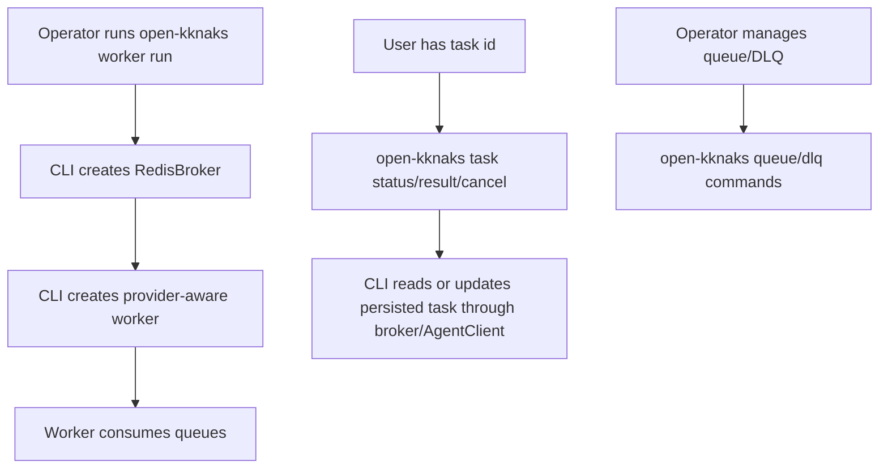
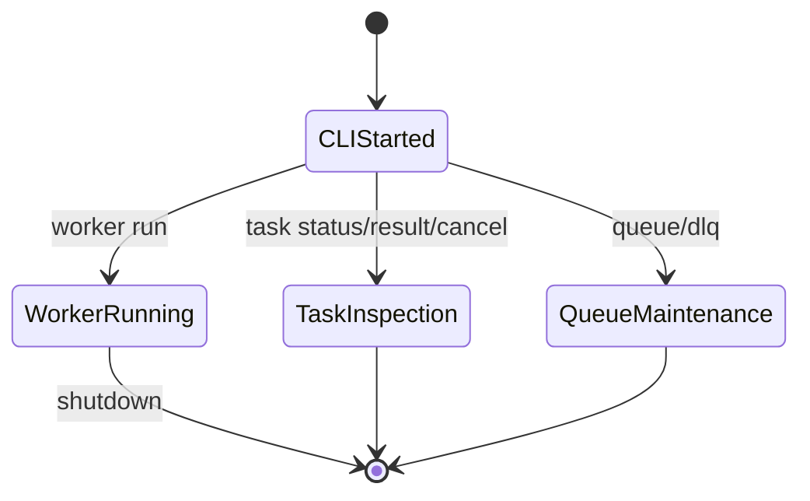

# OKK-SPEC-006 CLI 표면 계약

`open-kknaks` console script는 provider worker 운영, queue 확인, task 조회/취소, DLQ 관리를 위한 Typer CLI를 제공한다.

## Context

source는 `/Users/kknaks/git/library/claude_code_pty/open_kknaks/open_kknaks/cli/`와 `pyproject.toml`이다.

## User Flow

## State Machine

## UX Contract

CLI root command는 `open-kknaks`다. command group은 `worker`, `queue`, `task`, `dlq`다.

CLI는 provider task submit 표면을 이번 spec에서 추가하지 않는다. task 생성은 Python `AgentClient` API와 batch API가 담당하고, CLI는 운영/조회/취소 중심이다.

## FE Contract

해당 없음.

## BE Contract

### worker

| Command | 계약 |
|---|---|
| `worker run` | RedisBroker와 provider-aware worker를 생성하고 worker loop 실행 |

`worker run` option:

| Option | 의미 |
|---|---|
| `--broker` | Redis URL |
| `--namespace` | Redis namespace |
| `--queues` | comma-separated queue names |
| `--work-dir` | provider process default working directory |
| `--model` | worker default model |
| `--provider` | worker default provider. 기본 `claude` |
| `--concurrency` | parallel task count |
| `--shutdown-timeout` | graceful shutdown timeout |

CLI worker는 `LoggingMiddleware()`와 `RetriesMiddleware()`를 기본 장착한다.

### task

| Command | 계약 |
|---|---|
| `task status <task-id>` | status, provider, model, queue, priority, error, cost 표시 |
| `task result <task-id>` | current result 조회 |
| `task result <task-id> --wait --timeout <seconds>` | terminal까지 대기 후 result 조회 |
| `task cancel <task-id>` | `AgentClient.cancel` 호출. persisted cancellation marker |

### queue / dlq

| Command | 계약 |
|---|---|
| `queue size <queue-name>` | pending main queue size 표시 |
| `dlq list <queue-name> --limit <n>` | DLQ task list 표시 |
| `dlq retry <queue-name> --task-id <id>` | 특정 task DLQ retry |
| `dlq retry <queue-name> --all` | DLQ 전체 retry |
| `dlq purge <queue-name>` | 확인 후 DLQ 비우기 |

## Data Contract

CLI는 Redis broker를 통해 persisted task 상태를 읽는다. cancel command의 의미는 OKK-SPEC-003의 persisted cancellation contract를 따른다.

provider 구조 버전의 package root는 `AgentClient`와 provider-aware worker를 export해야 한다. legacy `ClaudeClient`/`ClaudeWorker` export 여부는 새 CLI 계약의 기준이 아니다.

## Work Handoff

work의 Acceptance Criteria는 아래 계약 표면에서 파생한다.

- `open-kknaks = open_kknaks.cli.main:main` console script 유지
- `worker`, `queue`, `task`, `dlq` command group 유지
- worker run의 provider-aware worker 생성
- task status 출력에 provider/model 포함
- task result의 immediate/wait 동작
- task cancel의 persisted marker 동작
- DLQ purge confirmation

## Open Questions

없음.
