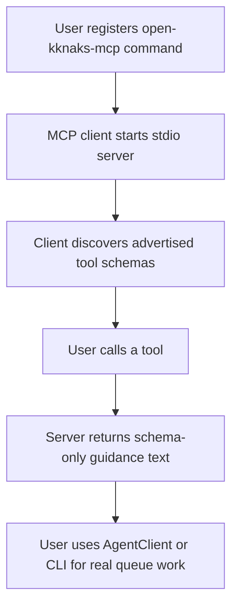
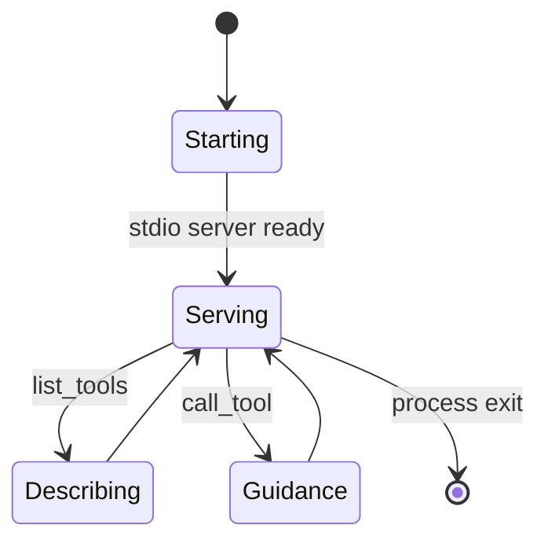

# OKK-SPEC-007 MCP schema server 계약

`open-kknaks-mcp`는 MCP tool schema를 노출하지만, 현재 구현은 queue 작업을 직접 실행하지 않는 documentation-only server다.

## Context

source는 `/Users/kknaks/git/library/claude_code_pty/open_kknaks/open_kknaks/mcp/server.py`와 `pyproject.toml`이다.

## User Flow

## State Machine

MCP server는 schema-only 문서 server로 유지한다. 실행형 queue server 승격은 이번 provider 구조 범위에 포함하지 않는다.

## UX Contract

MCP server는 stdio transport로 실행된다. Redis 연결이나 worker 실행은 요구하지 않는다.

## FE Contract

해당 없음.

## BE Contract

### Console script

`pyproject.toml`은 `open-kknaks-mcp = open_kknaks.mcp:run` console script를 제공한다.

### Advertised tools

| Tool | Schema 의미 |
|---|---|
| `submit_task` | task 제출 schema |
| `get_task` | task 전체 정보 조회 schema |
| `get_status` | task status 조회 schema |
| `get_result` | task result 조회 schema |
| `cancel_task` | task cancel schema |
| `submit_batch` | batch 제출 schema |
| `get_batch_status` | batch status 조회 schema |
| `wait_batch` | batch completion wait schema |
| `queue_size` | queue size 조회 schema |
| `list_dlq` | DLQ list schema |
| `retry_from_dlq` | DLQ retry schema |
| `purge_dlq` | DLQ purge schema |
| `get_cost` | cost 조회 schema |

### Tool call behavior

모든 tool call은 실제 broker/client 작업을 수행하지 않고, Python API 또는 CLI를 사용하라는 text response를 반환한다.

provider 구조 버전의 안내 문구와 schema 설명은 `AgentClient`, `provider`, `model`, `options`, `provider_options` 기준으로 갱신한다. legacy `ClaudeClient` 또는 Claude 전용 task option을 public API처럼 안내하지 않는다.

## Data Contract

MCP schema의 설명은 Python API/CLI와 맞아야 한다. 현재 일부 설명은 실제 구현보다 강한 실행 semantics를 암시하므로 provider 구조 work에서 정리한다.

## Work Handoff

work의 Acceptance Criteria는 아래 계약 표면에서 파생한다.

- MCP server는 13개 tool schema를 노출한다
- MCP server 실행 자체는 Redis 연결을 요구하지 않는다
- MCP tool call은 실제 queue mutation/query를 수행하지 않는다
- tool call response는 schema-only임을 명시한다
- schema 설명과 guidance text를 `AgentClient`와 provider 구조 기준으로 갱신한다

## Open Questions

없음.
