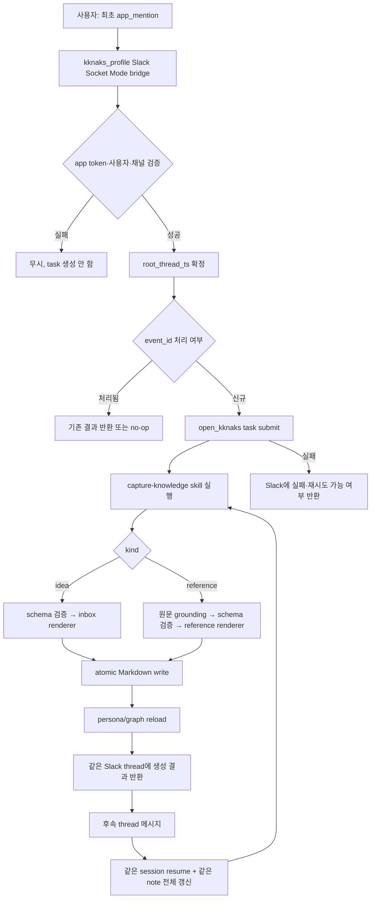
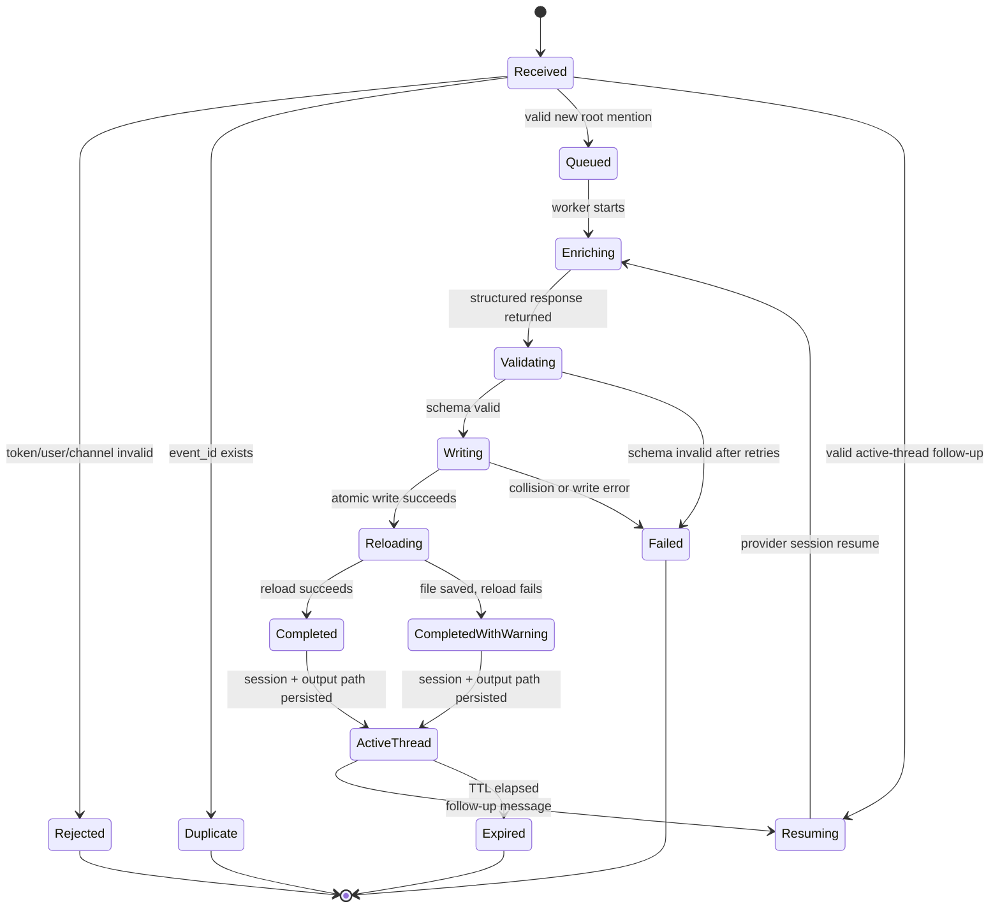

# OKK-SPEC-011 Slack 지식 수집 — inbox·reference 생성 계약

Slack에서 봇을 mention해 일반 텍스트나 외부 자료 URL을 전달하면
`open_kknaks`로 구조화하고, `kknaks_profile`의 `inbox/` 또는 `reference/`에
일관된 Markdown SoT로 저장한다. 최초 mention의 Slack thread는 하나의
`open_kknaks` session과 하나의 노트에 대응하며, 후속 메시지는 같은 대화와 노트를
이어 갱신한다.

## 1. Context

### Meta

- Baseline: [[OKK-BL-002-slack-idea-knowledge-graph|OKK-BL-002]]
- 기존 고품질 생성 기준:
  - `.agent/skills/youtube-content/SKILL.md`
  - `app/back/service/jobs/content_enrich.py`
- Slack thread/session 참고 구현:
  - `/Users/kknaks/git/toy_pr2/kknaks_mobile/src/bridge/app.py`
  - `/Users/kknaks/git/toy_pr2/kknaks_mobile/src/bridge/sessions.py`
  - `/Users/kknaks/git/toy_pr2/kknaks_mobile/src/bridge/runner.py`
- 지식 생명주기: [[spec-003-knowledge-workflow|KDEV-SPEC-003]]
- 그래프 검증: [[spec-004-graph-validation|KDEV-SPEC-004]]
- Slack 공식 계약:
  - https://docs.slack.dev/apis/events-api/

### Business Requirement

사용자는 Slack에서 생각 또는 유튜브·블로그·논문 링크를 던지는 것만으로
일관된 형식의 지식 초안을 만들어야 한다. 자동화는 자료를 구조화하되,
`permanent/`에 들어갈 개인의 결론을 대신 확정하지 않는다.

### Scope

In scope:

- Slack Bolt Socket Mode에서 `app_mention`과 활성 thread 후속 메시지 수신
- Slack app/bot 인증, 사용자·채널 allowlist, 이벤트 중복 방지
- Slack thread와 `open_kknaks` session 및 단일 output note 매핑
- 일반 텍스트와 외부 자료 URL 분류
- `open_kknaks` task를 통한 구조화
- `capture-knowledge` skill의 idea/reference 모드
- 고정 출력 schema, Markdown renderer, 저장 전 validator
- `inbox/` 또는 `reference/` 저장
- Slack 성공·실패 결과 반환

Out of scope:

- `permanent/` 자동 생성·승격
- 자동 product/post 분류
- 연결 후보를 확정 wikilink로 자동 반영
- 여러 사용자를 위한 권한·테넌트 모델
- Slack 파일 첨부 처리
- reference를 이용한 후속 질의응답
- slash command와 공개 HTTP Events API endpoint

## 2. User Flow



### Scenario A — 일반 아이디어

1. 사용자가 채널에서 봇을 mention하며 `Redis stream으로 작업 이벤트를 추적하면 어떨까`를 입력한다.
2. bridge는 Slack 사용자·채널을 검증하고 원 메시지의 `ts`를 root thread로 확정한다.
3. `capture-knowledge` skill은 입력을 `kind=idea`로 분류한다.
4. 서버는 고정된 inbox 템플릿으로 `inbox/<date>-<slug>.md`를 생성한다.
5. Slack에는 노트 제목, 저장 위치, 상태를 반환한다.

### Scenario B — 외부 자료

1. 사용자가 봇을 mention하며 유튜브·블로그·논문 URL과 선택적 intent를 전달한다.
2. 서버는 URL에서 자료 유형을 식별하고 가능한 원문 데이터를 수집한다.
3. `capture-knowledge` skill은 원문에 근거한 reference metadata와 본문을 생성한다.
4. 서버는 `reference/<group>/<date>-<slug>.md`를 생성하고 graph reload를 요청한다.
5. Slack에는 제목, 자료 유형, 저장 위치, 연결 후보 수를 반환한다.

### Scenario C — 혼합 입력

텍스트에 URL이 하나 이상 있으면 기본 `kind=reference`로 처리하고, URL 밖의 텍스트는
`intent`로 사용한다. 사용자가 `idea: <text>` 또는 `reference: <url>`처럼 kind를
명시하면 명시값이 우선한다.

### Scenario D — 같은 thread에서 보완

1. 최초 mention 처리 후 생성 결과가 원 메시지 thread에 게시된다.
2. 사용자가 같은 thread에서 멘션 없이 추가 요구나 정정 내용을 입력한다.
3. bridge는 `(channel_id, root_thread_ts)`로 기존 session과 output path를 찾는다.
4. `AgentClient`는 기존 provider session을 resume한다.
5. skill은 기존 노트와 후속 입력을 반영한 **전체 structured output snapshot**을 반환한다.
6. 검증에 성공하면 기존 output path를 atomic replace하고 같은 thread에 결과를 갱신한다.
7. 새 노트가 필요하면 사용자는 새 root message에서 봇을 다시 mention한다.

## 3. State Machine



## 4. Slack Contract

### Transport and Entry Point

- `kknaks_profile`은 Slack Bolt `AsyncApp`과 `AsyncSocketModeHandler` 기반 bridge를
  별도 장기 실행 프로세스로 운용한다.
- 인증은 `SLACK_APP_TOKEN`과 `SLACK_BOT_TOKEN`을 사용한다.
- 새 지식 대화의 유일한 진입점은 `app_mention`이다.
- 공개 HTTP request URL, slash command, `response_url`은 1단계에서 사용하지 않는다.

### Request Verification

- 허용된 `team_id`, `user_id`, `channel_id`만 처리한다.
- bot message, message edit, subtype event는 처리하지 않는다.
- allowlist가 비어 있으면 fail-closed로 모든 사용자 입력을 무시한다.
- Socket Mode 연결과 envelope acknowledgement는 Slack Bolt adapter가 담당한다.
- event listener는 원문 수집·LLM 실행·파일 쓰기와 분리된 비동기 작업을 시작한다.

### Idempotency

- Socket Mode envelope의 `event_id`를 idempotency key로 사용한다.
- event ID와 task/file/result 상태를 Redis에 저장한다.
- 동일 key 재수신 시 새 task나 새 파일을 만들지 않는다.

### Thread Conversation

- 최초 mention의 `root_thread_ts`는 `event.thread_ts`가 있으면 그 값, 없으면
  `event.ts`다.
- 최초 mention은 `(channel_id, root_thread_ts)` session record를 생성한다.
- 채널/group의 후속 `message`는 활성 session record가 있는 thread에서만 받는다.
- 활성 thread 안에서는 봇을 다시 mention하지 않아도 된다.
- thread 하나는 `open_kknaks` provider session 하나와 output path 하나를 가진다.
- 최초 분류된 `kind`와 output path는 thread 생명주기 동안 바꾸지 않는다.
- 새 노트 또는 다른 kind가 필요하면 새 root message에서 봇을 mention한다.
- session TTL은 마지막 성공 처리 시점부터 7일이다. 만료 thread의 후속 메시지는
  처리하지 않고 새 mention을 요구한다.
- 같은 thread의 task는 Redis lock으로 직렬화해 갱신 유실을 막는다.

### Result Reply

- 모든 접수·진행·성공·실패 응답은 bot Web API로 원 root thread에 게시한다.
- 실행 중 placeholder를 만들고 `chat.update`로 진행/최종 상태를 갱신할 수 있다.
- 기존 `SLACK_WEBHOOK_URL` 알림 경로는 본 기능의 대화형 응답 경로로 사용하지 않는다.

성공 응답:

```text
저장 완료: <title>
종류: inbox | reference
경로: <repository-relative-path>
연결 후보: <count>
```

실패 응답은 사용자 입력 오류, 원문 수집 실패, LLM 실패, schema 실패, 저장 실패를
구분하며 secret, raw stack trace, 전체 prompt를 노출하지 않는다.

## 5. Internal API Contract

### CaptureRequest

```json
{
  "request_id": "slack idempotency key",
  "source": "slack",
  "entrypoint": "app_mention | thread_message",
  "team_id": "T...",
  "channel_id": "C...",
  "user_id": "U...",
  "root_thread_ts": "required",
  "text": "사용자 입력 원문",
  "requested_kind": "auto | idea | reference",
  "session_id": "optional provider session id",
  "output_path": "optional existing repository-relative path",
  "received_at": "ISO-8601"
}
```

### CaptureSession

Redis record의 논리 계약:

```json
{
  "channel_id": "C...",
  "root_thread_ts": "123.456",
  "session_id": "open_kknaks provider session id",
  "kind": "idea | reference",
  "output_path": "inbox/...md | reference/...md",
  "first_prompt": "최대 200자",
  "created_at": "ISO-8601",
  "last_seen_at": "ISO-8601",
  "ttl_seconds": 604800
}
```

- Redis key는 namespace, channel ID, root thread timestamp를 포함한다.
- 최초 task의 init/session event에서 provider session ID를 저장한다.
- 후속 task는 저장된 session ID를 resume option으로 전달한다.
- output path는 최초 저장 성공 후 기록하며 이후 같은 path만 갱신한다.

### open_kknaks Task

- `kknaks_profile`이 `AgentClient.submit()`으로 task를 제출한다.
- task provider/model은 환경 설정으로 선택하며 Slack payload가 임의로 덮어쓰지 못한다.
- task에는 `capture-knowledge` skill, 정규화된 request, 수집한 source material을 전달한다.
- queue/timeout/retry는 [[spec-001-task-model-and-lifecycle|OKK-SPEC-001]]과
  [[spec-008-middleware-and-operational-controls|OKK-SPEC-008]]을 따른다.
- worker는 repository 파일을 직접 쓰지 않는다. 구조화 결과만 반환한다.
- 최초 task는 새 provider session으로 실행하고 session ID를 `CaptureSession`에 저장한다.
- 후속 thread task는 같은 provider session을 resume한다.
- 구형 참고 구현의 `ClaudeClient(session_id=...)` 호출 형태를 복사하지 않고
  현재 `AgentClient`의 provider-neutral resume 계약을 사용한다.

## 6. Skill Contract

### Skill Location and Responsibility

`capture-knowledge` skill은 `.agent/skills/capture-knowledge/SKILL.md`에 둔다.

책임:

- idea/reference 분류
- 원문에서 metadata와 핵심 내용을 추출
- source fact와 agent interpretation 분리
- 고정 schema에 맞는 구조화 결과 생성
- 연결 후보 제안
- 후속 입력을 반영한 전체 structured output snapshot 재생성

비책임:

- 파일 경로 최종 확정
- 파일 쓰기·덮어쓰기
- graph reload
- git commit/push
- permanent 승격

### Quality Rules

- reference의 핵심 주장과 근거는 제공된 원문에서 확인 가능한 내용만 쓴다.
- 원문이 제공하지 않은 정보는 출처의 주장처럼 서술하지 않는다.
- 일반 지식으로 보충한 내용은 `적용 가능성` 또는 `해석`으로 분리한다.
- 직접 인용은 최소화하고 나머지는 요약·재서술한다.
- 자료를 읽지 못했으면 URL과 제목만으로 본문을 추정하지 않고 실패로 반환한다.
- 사용자 intent가 있으면 요약 관점의 최우선 조건으로 사용하되 원문을 왜곡하지 않는다.
- 연결 후보는 후보일 뿐 자동 wikilink로 확정하지 않는다.

## 7. Structured Output Contract

LLM 응답은 metadata JSON과 raw Markdown section data를 분리한다. 자유 형식 완성
Markdown을 직접 저장하지 않는다.

```json
{
  "schema_version": "1.0",
  "kind": "idea | reference",
  "title": "한국어 제목",
  "slug": "lowercase-kebab-or-date-slug",
  "summary": "핵심 한 줄",
  "tags": ["tag"],
  "intent": "optional",
  "source": {
    "url": "optional",
    "type": "youtube | blog | paper | other",
    "title": "optional",
    "author": "optional",
    "publisher": "optional",
    "published_at": "optional",
    "accessed_at": "ISO-8601",
    "external_id": "optional"
  },
  "idea": {
    "original": "idea only",
    "refined": "idea only",
    "problem": "idea only",
    "expected_value": "idea only",
    "open_questions": ["idea only"]
  },
  "reference": {
    "overview": "reference only",
    "context": "reference only",
    "key_claims": ["reference only"],
    "concepts": [{"name": "...", "description": "..."}],
    "evidence": ["reference only"],
    "applications": ["reference only; agent interpretation"],
    "limitations": ["reference only"],
    "notes": "reference only"
  },
  "connection_candidates": [
    {
      "target": "existing stem",
      "reason": "연결 근거",
      "confidence": 0.0
    }
  ]
}
```

### Validation

- `schema_version`, `kind`, `title`, `slug`, `summary`, `tags`는 필수다.
- `kind=idea`면 `idea`가 필수이고 `source.url`은 선택이다.
- `kind=reference`면 `reference`, `source.url`, `source.type`, `source.accessed_at`이 필수다.
- `source.type`은 `youtube|blog|paper|other` 중 하나다.
- `connection_candidates.target`은 현재 graph alias index에서 resolve되는 stem만 허용한다.
- resolve되지 않는 후보는 저장 결과에서 제외하고 warning으로 기록한다.
- schema 오류는 원본 응답과 validation error를 이용해 제한된 횟수만 repair한다.
- repair 후에도 실패하면 파일을 쓰지 않는다.
- 후속 갱신 응답도 patch가 아니라 전체 snapshot이어야 한다.
- 후속 갱신에서 `kind` 또는 최초 output path 변경을 요구하면 validation failure다.

## 8. Markdown Data Contract

### Inbox Template

경로:

```text
inbox/<YYYY-MM-DD>-<slug>.md
```

형태:

```markdown
---
type: idea
id: <file-stem>
title: "<title>"
created_at: <ISO-8601>
source: slack
slack_event_id: "<request-id>"
slack_thread_ts: "<root-thread-ts>"
tags: []
---

# <title>

## 원문

<original>

## 정리된 아이디어

<refined>

## 해결하려는 문제

<problem>

## 기대 효과

<expected-value>

## 열린 질문

- <question>
```

- inbox는 graph loader의 현재 스캔 대상이 아니다.
- `up`과 확정 wikilink를 자동 생성하지 않는다.
- 사람이 permanent/product/post로 분류하면 inbox 원본을 폐기한다.

### Reference Template

경로:

```text
reference/<group>/<YYYY-MM-DD>-<slug>.md
```

frontmatter:

```yaml
---
type: reference
id: <file-stem>
title: "<title>"
date: <YYYY.MM.DD>
group: <persona._meta.notes.clusters id>
source: <url>
source_type: youtube | blog | paper | other
source_title: "<source title>"
source_author: "<author or channel>"
source_published_at: <optional>
accessed_at: <ISO-8601>
slack_event_id: "<request-id>"
slack_thread_ts: "<root-thread-ts>"
summary: "<summary>"
tags: []
---
```

본문 섹션은 반드시 다음 순서를 따른다.

```markdown
## 개요
## 출처와 맥락
## 핵심 주장
## 주요 개념
## 근거와 사례
## 적용 가능성
## 한계와 검증이 필요한 부분
## 내 지식과의 연결 후보
## 참고
```

규칙:

- `핵심 주장`, `주요 개념`, `근거와 사례`는 source-grounded 영역이다.
- `적용 가능성`은 agent interpretation 영역임을 본문에서 표시한다.
- `내 지식과의 연결 후보`는 plain text 후보 목록이며 `[[]]`를 자동 삽입하지 않는다.
- source에 없는 참고자료를 만들어내지 않는다.
- `group`은 `persona/_meta.yaml`의 `notes.clusters[].id` 중 하나여야 한다.
- 분류가 불명확하면 `study`를 fallback group으로 사용한다.

### Renderer

- 서버 renderer만 frontmatter, 경로, 섹션 순서와 Markdown escaping을 결정한다.
- skill/LLM은 완성 파일을 직접 작성하지 않는다.
- renderer는 동일 structured output에 대해 결정론적 결과를 만들어야 한다.
- 파일명 충돌 시 기존 파일을 덮어쓰지 않고 deterministic suffix를 붙이거나 실패한다.
- 최초 저장 후 같은 Slack thread에서 온 유효한 후속 결과만 기존 output path를 갱신한다.
- 후속 갱신은 기존 파일을 읽고 전체 snapshot을 render한 뒤 validation 성공 시 atomic replace한다.
- 임시 파일에 쓴 뒤 같은 filesystem에서 atomic rename한다.

## 9. Source Extraction Contract

| Source type | 우선 수집 데이터 |
|---|---|
| YouTube | video ID, title, channel, duration, transcript |
| Blog | canonical URL, title, author, published date, article body |
| Paper | DOI/arXiv ID, title, authors, abstract, publication date, available full text |
| Other | canonical URL, title, publisher, readable body |

- URL fetch와 metadata 추출은 LLM 호출 전에 수행한다.
- prompt에 전달할 원문 길이는 상한을 두되 title/abstract/핵심 본문 경계를 보존한다.
- transcript/full text가 없으면 확보한 범위를 metadata에 기록한다.
- paywall, robots, 인증 등으로 본문을 읽지 못하면 reference 생성 실패로 처리한다.
- 동일 canonical URL이 이미 존재하면 신규 파일을 만들지 않고 기존 경로를 반환한다.

## 10. Persistence and Reload Contract

1. structured output validation
2. repository path containment 검증
3. Markdown render
4. frontmatter 재파싱
5. repository graph/persona validation
6. atomic write
7. runtime reload
8. Slack result reply

- `reference` 저장 후 기존 graph builder가 노드와 명시된 wikilink를 반영한다.
- `inbox` 저장은 runtime graph node 수를 변경하지 않는다.
- reload 실패 시 파일 저장 성공과 reload 실패를 구분해 운영자에게 경고한다.
- 1단계에서는 자동 git commit/push를 수행하지 않는다.

## 11. Security and Operational Controls

- secret은 `SLACK_APP_TOKEN`, `SLACK_BOT_TOKEN` 환경변수로 주입한다.
- token을 로그 또는 Markdown에 저장하지 않는다.
- URL은 HTTP(S)만 허용하고 private/link-local/loopback address 접근을 차단한다.
- redirect 후 최종 URL에도 같은 SSRF 검증을 적용한다.
- source fetch에 timeout, 최대 응답 크기, redirect 제한을 둔다.
- Slack 원문은 prompt injection 가능 데이터로 취급하며 system/skill 규칙을 덮어쓸 수 없다.
- open_kknaks worker의 repository write tool은 비활성화한다.
- task와 Slack 응답에는 secret·환경변수·로컬 절대 경로를 노출하지 않는다.

## 12. Observability

다음 필드를 구조화 로그로 남긴다.

- `request_id`
- `entrypoint`
- `root_thread_ts`
- `kind`
- `source_type`
- `task_id`
- `status`
- `output_path`
- `duration_ms`
- `retry_count`
- `error_code`

원문 전체, transcript 전문, app/bot token은 로그에서 제외한다.

## 13. Acceptance Criteria

- [ ] Socket Mode bridge가 `app_mention`을 새 지식 대화의 진입점으로 수신한다.
- [ ] Slack app/bot token과 team/user/channel allowlist가 검증된다.
- [ ] allowlist가 비어 있으면 모든 사용자 입력을 무시한다.
- [ ] 재전송된 동일 요청이 task나 파일을 중복 생성하지 않는다.
- [ ] 최초 mention의 `event.thread_ts or event.ts`가 root thread key가 된다.
- [ ] 활성 thread의 후속 메시지는 멘션 없이 처리된다.
- [ ] 활성 session이 없는 channel thread 메시지는 무시된다.
- [ ] `(channel_id, root_thread_ts)`가 provider session과 output path 하나에 매핑된다.
- [ ] 후속 메시지는 같은 provider session을 resume하고 같은 파일을 갱신한다.
- [ ] 같은 thread의 병렬 이벤트가 직렬화되어 갱신 유실이 없다.
- [ ] 7일 TTL이 지난 thread는 새 mention 없이는 재개되지 않는다.
- [ ] 일반 텍스트가 고정 inbox 템플릿으로 저장된다.
- [ ] YouTube·블로그·논문 URL이 source-grounded reference 템플릿으로 저장된다.
- [ ] reference 본문에 필수 9개 H2 섹션이 순서대로 존재한다.
- [ ] source fact와 agent interpretation이 섹션으로 분리된다.
- [ ] schema 또는 repository 검증 실패 시 파일이 생성되지 않는다.
- [ ] worker/skill이 repository에 직접 파일을 쓰지 않는다.
- [ ] 연결 후보가 자동 wikilink로 확정되지 않는다.
- [ ] reference 저장 후 graph reload가 수행된다.
- [ ] inbox 저장은 현재 graph node를 만들지 않는다.
- [ ] 성공·실패 결과가 항상 원 Slack root thread에 반환된다.
- [ ] permanent/product/post 자동 승격이 발생하지 않는다.

## 14. Work Handoff

후속 work는 다음 구현 표면을 다룬다.

- Slack Bolt Socket Mode bridge와 app mention/thread message handler
- `CaptureRequest`, `CaptureSession`, idempotency와 per-thread lock
- `kknaks_mobile` thread/session pattern의 `AgentClient` 이식
- source type detection과 extractor
- `.agent/skills/capture-knowledge/`
- structured output parser/repair/validator
- inbox/reference deterministic renderer
- atomic writer와 runtime reload
- Slack async result reply
- unit/integration/E2E fixture

## 15. Open Questions

- 없음. 구현 중 발견되는 provider·extractor 선택은 외부 계약을 바꾸지 않는 한 work에서 확정한다.
